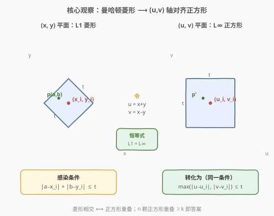
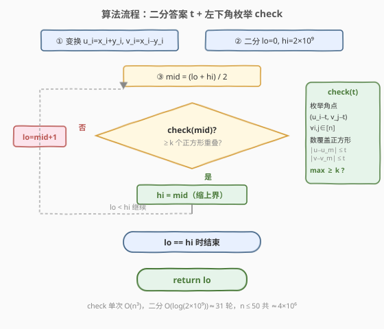
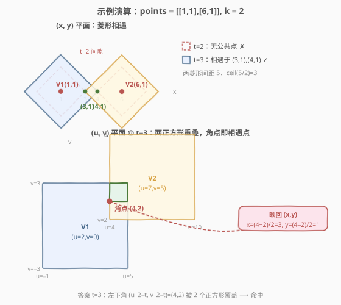

# LeetCode 感染 K 种病毒所需的最短时间 题解

## 1. 题目概述

- **标题 / 题号**：感染 K 种病毒所需的最短时间（#1956，hard）
- **链接**：https://leetcode.cn/problems/minimum-time-for-k-virus-variants-to-spread/
- **难度**：困难
- **标签**：几何、二分查找、枚举、坐标变换、有序集合、滑动窗口

**题意**：在无限大的二维平面上有 $n$ 种**不同**的病毒。给定二维数组 `points`，第 $i$ 项 `points[i] = [x_i, y_i]` 表示第 $0$ 天有一种病毒位于点 $(x_i, y_i)$。注意初始状态下，可能有**多种**病毒在**同一点**上。

每天，被感染的点会把它感染的病毒传播到**上、下、左、右**四个邻居点（即曼哈顿距离 $+1$）。因此第 $t$ 天时，初始位于 $(x_i, y_i)$ 的病毒已感染所有满足 $|a - x_i| + |b - y_i| \le t$ 的点 $(a, b)$。

给定整数 $k$，问**最少**需要多少天，方能找到一点感染**至少** $k$ 种病毒？

**示例 1**：

```text
输入：points = [[1,1],[6,1]], k = 2
输出：3
解释：在第 3 天，点 (3,1) 与 (4,1) 将感染所有 2 种病毒。
```

**示例 2**：

```text
输入：points = [[3,3],[1,2],[9,2]], k = 2
输出：2
解释：在第 2 天，点 (2,2) 同时被前两种病毒感染（距 (3,3) 与 (1,2) 均不超过 2）。
```

**示例 3**：

```text
输入：points = [[3,3],[1,2],[9,2]], k = 3
输出：4
解释：在第 4 天，点 (5,2) 会感染所有 3 种病毒。
```

**约束**：

- $n = \text{points.length}$
- $2 \le n \le 50$
- $\text{points[i].length} = 2$
- $1 \le x_i, y_i \le 10^9$
- $2 \le k \le n$

> 💡 **审题关键**：① 病毒扩散是**曼哈顿距离**意义上的——第 $t$ 天覆盖以 $(x_i,y_i)$ 为中心、半径 $t$ 的「菱形」区域；② 「一点感染 $\ge k$ 种」即某点被 $\ge k$ 个菱形同时覆盖；③ 坐标高达 $10^9$、平面无限大，**不能模拟逐日扩散**，必须从「几何覆盖」角度直接求临界天数；④ $k \le n$ 保证答案必存在（$t$ 足够大时全部 $n$ 种病毒覆盖整个平面），故无 $-1$ 分支。

## 2. 解题思路

### 2.1 暴力思路：逐日递增 + 朴素覆盖判定

最直觉的做法：让天数 $t$ 从 $0$ 开始一天天递增，对每个 $t$ 判定「是否存在一点被 $\ge k$ 个菱形覆盖」。一旦判定为真，当前 $t$ 即答案。

- **正确性**：覆盖区域随 $t$ 单调扩大，首个满足条件的 $t$ 即最小天数。
- **致命缺陷**：① 答案 $t$ 可达 $\sim 10^9$（两点分处 $(1,1)$ 与 $(10^9,10^9)$ 时需 $\lceil 2(10^9-1)/2\rceil \approx 10^9$ 天），线性扫描天数不可行；② 即便单次判定，菱形是**旋转 $45°$** 的斜放图形，求多个菱形的最大重叠点比轴对齐图形麻烦得多。

> ⚠️ 暴力法的两个浪费：一是「线性扫描 $t$」——明明覆盖性关于 $t$ 单调，应二分；二是「在原坐标系硬刚菱形」——旋转坐标系后菱形可变为轴对齐正方形，重叠判定极大简化。下文两步观察分别消除这两个浪费。

### 2.2 核心观察：坐标变换化菱形为正方形 + 左下角枚举



**观察一（坐标变换）：曼哈顿菱形 ⟺ 轴对齐正方形。**

令 $u = x + y$，$v = x - y$（$45°$ 旋转 + 缩放）。对任意点 $p=(a,b)$ 与病毒 $i$：

$$|a - x_i| + |b - y_i| \;=\; \max\bigl(\,|(a+b)-(x_i+y_i)|,\; |(a-b)-(x_i-y_i)|\,\bigr) \;=\; \max(|u - u_i|,\; |v - v_i|)$$

> 💡 **恒等式证明**：记 $p = a - x_i$，$q = b - y_i$。则 $u - u_i = p + q$，$v - v_i = p - q$。当 $p,q$ 同号时 $|p+q| = |p|+|q| \ge |p-q|$；异号时 $|p-q| = |p|+|q| \ge |p+q|$。故 $\max(|p+q|,|p-q|) = |p|+|q|$，即 $\max(|u-u_i|,|v-v_i|) = |a-x_i|+|b-y_i|$。

于是「病毒 $i$ 在第 $t$ 天的感染区」这个**菱形** $|a-x_i|+|b-y_i| \le t$，在 $(u,v)$ 空间里变成以 $(u_i, v_i)$ 为中心、半边长 $t$ 的**轴对齐正方形** $[u_i - t,\, u_i + t] \times [v_i - t,\, v_i + t]$。「某点被 $\ge k$ 个菱形覆盖」等价于「某点被 $\ge k$ 个正方形覆盖」——求 $n$ 个轴对齐正方形的**最大重叠数**是否 $\ge k$。

**观察二（左下角枚举）：最大重叠点必在某正方形的「左下角」。**

轴对齐正方形的重叠数只在跨越边界时变化，故最大重叠必在某个「格点」处取得。更精确地：取任一最大重叠点 $p$，其覆盖集 $S$ 中每个正方形 $m$ 满足 $u_m - t \le p_u$ 与 $v_m - t \le p_v$。把 $p_u$ 左移到 $\max_{m \in S}(u_m - t) = u_a - t$（某 $a \in S$），把 $p_v$ 下移到 $\max_{m \in S}(v_m - t) = v_b - t$（某 $b \in S$），所得角点 $(u_a - t,\, v_b - t)$ 仍被 $S$ 中所有正方形覆盖。

$$\boxed{\text{最大重叠数} \;=\; \max_{a,\,b}\; \#\{\,m : |u_m - (u_a - t)| \le t \;\text{且}\; |v_m - (v_b - t)| \le t\,\}}$$

因此 $\text{check}(t)$ 只需枚举 $n \times n$ 个候选角点 $(u_i - t,\, v_j - t)$，每个角点 $O(n)$ 数覆盖正方形——总计 $O(n^3)$，对 $n \le 50$ 仅 $1.25 \times 10^5$ 次。

> ⚠️ **为何只需左下角、无需右上角？** 上述「左移 + 下移」把任意最大重叠点归约到一个左下角 $(u_a - t, v_b - t)$，且覆盖数不降。故枚举所有左下角必能命中最大值。枚举右上角是冗余的（同一重叠区域的另一角，覆盖数相同）。

### 2.3 算法流程图



整体为「**二分答案 + 单调判定**」骨架：

1. **坐标变换**：预处理 $u_i = x_i + y_i$，$v_i = x_i - y_i$（$O(n)$，全程只做一次）。
2. **二分答案**：$\text{check}(t)$ 关于 $t$ 单调（菱形随 $t$ 扩大，覆盖只增不减），在 $[0,\, 2 \times 10^9]$ 上二分最小可行 $t$。
3. **判定 $\text{check}(t)$**：枚举角点 $(u_i - t,\, v_j - t)$，数覆盖正方形数 $\ge k$ 即返回 `true`。
4. **收敛**：`check(mid)` 为真则 `hi = mid`，否则 `lo = mid + 1`，结束时 `lo` 即答案。

> 💡 **上界取 $2 \times 10^9$ 的依据**：$k \le n$ 时答案不超过「让全部 $n$ 种病毒相遇」的天数 $\lceil \max(\text{range}_u, \text{range}_v)/2 \rceil$。$u = x+y \in [2,\, 2\times10^9]$，$\text{range}_u \le 2\times10^9 - 2$，故答案 $\le 10^9 - 1$；取 $2 \times 10^9$ 留足余量，二分约 $31$ 轮。

### 2.4 示例演算

以**示例 1** `points = [[1,1],[6,1]], k = 2` 演示（$V_1=(1,1)$，$V_2=(6,1)$，曼哈顿距离 $5$，$\lceil 5/2 \rceil = 3$）：



**坐标变换**：$V_1 \to (u,v) = (2, 0)$，$V_2 \to (7, 5)$。

| $t$ | $V_1$ 正方形 | $V_2$ 正方形 | 重叠？ | 角点命中 | $\text{check}(t)$ |
|-----|--------------|--------------|--------|----------|-------------------|
| $2$ | $u \in [0,4]$, $v \in [-2,2]$ | $u \in [5,9]$, $v \in [3,7]$ | 无（$u$ 侧 $4 < 5$） | 最大覆盖 $1 < 2$ | `false` |
| $3$ | $u \in [-1,5]$, $v \in [-3,3]$ | $u \in [4,10]$, $v \in [2,8]$ | $u \in [4,5]$, $v \in [2,3]$ | $(u_2 - t, v_2 - t) = (4,2)$ 覆盖 $2$ 个 | `true` |

- **$t = 2$**：两正方形在 $u$ 轴上 $[0,4]$ 与 $[5,9]$ 之间留有间隙（$4 < 5$），任意角点至多覆盖 $1$ 个正方形 $\Rightarrow$ `false`。原坐标系下即两菱形在 $y=1$ 行分别触及 $x=3$ 与 $x=4$，未相遇。
- **$t = 3$**：两正方形重叠于 $u \in [4,5],\, v \in [2,3]$。枚举到角点 $(u_2 - t, v_2 - t) = (7-3,\, 5-3) = (4,2)$ 时，$V_1$（$|2-4|=2 \le 3$，$|0-2|=2 \le 3$）与 $V_2$（$|7-4|=3 \le 3$，$|5-2|=3 \le 3$）均覆盖 $\Rightarrow$ 计数 $2 \ge k$，`true`。
- 该角点映回原坐标：$x = (u+v)/2 = 3$，$y = (u-v)/2 = 1$，即相遇点 $(3,1)$ ✓。

**二分轨迹**：$\text{check}(0)=\text{F}$, $\ldots$, $\text{check}(2)=\text{F}$, $\text{check}(3)=\text{T}$（此后恒真）$\Rightarrow$ 答案 $3$。

> 💡 **观察要点**：① 原坐标系下两菱形「相向生长」，相遇时刻恰为 $\lceil \text{曼哈顿距离}/2 \rceil$（$k=2$ 的特例即两点半径之和 $\ge$ 距离）；② $(u,v)$ 空间把「菱形相切」翻译为「正方形重叠」，相遇点恒对应某正方形的左下角；③ $k > 2$ 时不再是两点配对，但「角点枚举」统一处理——这正是坐标变换 + 枚举的威力。

## 3. 参考代码

### C++（坐标变换 + 二分答案 + 左下角枚举 check）

```cpp
class Solution {
public:
    int minDayskVariants(vector<vector<int>>& points, int k) {
        int n = points.size();
        vector<long long> u(n), v(n);
        for (int i = 0; i < n; ++i) {
            u[i] = (long long)points[i][0] + points[i][1];
            v[i] = (long long)points[i][0] - points[i][1];
        }
        long long lo = 0, hi = 2000000000LL;
        while (lo < hi) {
            long long mid = lo + (hi - lo) / 2;
            if (check(u, v, mid, k)) hi = mid;
            else lo = mid + 1;
        }
        return (int)lo;
    }
private:
    bool check(const vector<long long>& u, const vector<long long>& v,
               long long t, int k) {
        int n = u.size();
        for (int i = 0; i < n; ++i) {
            for (int j = 0; j < n; ++j) {
                long long cu = u[i] - t;   // 候选角点 u = 第 i 个正方形左边界
                long long cv = v[j] - t;   // 候选角点 v = 第 j 个正方形下边界
                int cnt = 0;
                for (int m = 0; m < n; ++m) {
                    long long du = u[m] - cu; if (du < 0) du = -du;
                    long long dv = v[m] - cv; if (dv < 0) dv = -dv;
                    if (du <= t && dv <= t) ++cnt;   // 正方形 m 覆盖该角点
                }
                if (cnt >= k) return true;
            }
        }
        return false;
    }
};
```

### Python（同思路）

```python
from typing import List

class Solution:
    def minDayskVariants(self, points: List[List[int]], k: int) -> int:
        u = [x + y for x, y in points]
        v = [x - y for x, y in points]
        n = len(points)

        def check(t: int) -> bool:
            for i in range(n):
                for j in range(n):
                    cu = u[i] - t          # 候选角点 u
                    cv = v[j] - t          # 候选角点 v
                    cnt = sum(1 for m in range(n)
                              if abs(u[m] - cu) <= t and abs(v[m] - cv) <= t)
                    if cnt >= k:
                        return True
            return False

        lo, hi = 0, 2 * 10 ** 9
        while lo < hi:
            mid = (lo + hi) // 2
            if check(mid):
                hi = mid
            else:
                lo = mid + 1
        return lo
```

> 💡 **实现细节**：① 坐标 $x_i, y_i \le 10^9$，$u_i = x_i + y_i$ 可达 $2 \times 10^9$，**C++ 必须用 `long long`**（`int` 溢出）；Python 大整数无虞；② 二分用 `lo + (hi - lo) / 2` 防 `lo + hi` 溢出（本题 `hi = 2e9` 已超 `int` 上限 $2.1\times10^9$，更须 `long long`）；③ `abs` 对 `long long` 在 C++ 中有坑（`<cstdlib>` 的 `abs` 重载依赖编译器），故手写 `if (du < 0) du = -du;` 最稳；④ 角点枚举的 $i, j$ 独立取自 $[0, n)$，覆盖所有左下角组合。

> ⚠️ **`int` 溢出是本题最高频的坑**：$u_i, v_i \in [-10^9, 2\times10^9]$，$t$ 上界 $2\times10^9$，乘加后远超 32 位。C++ 中 `points[i][0] + points[i][1]` 若先按 `int` 求和再赋给 `long long` 也会溢出——必须先强转 `(long long)points[i][0]` 再相加，如参考代码所示。

## 4. 复杂度分析

| 维度 | 复杂度 | 说明 |
|------|--------|------|
| 时间复杂度 | $O(n^3 \log H)$ | $\text{check}(t)$ 枚举 $n^2$ 个角点、每个 $O(n)$ 数覆盖 $\Rightarrow O(n^3)$；二分 $O(\log H)$ 轮，$H = 2\times10^9$，$\log H \approx 31$。$n = 50$ 时约 $4 \times 10^6$ 次基本运算 |
| 空间复杂度 | $O(n)$ | 仅存 $u, v$ 两个长度 $n$ 的数组 |

> 💡 **量级感知**：$n = 50$、$n^3 = 1.25 \times 10^5$、$\times 31 \approx 3.9 \times 10^6$，远低于 $10^7$ 量级，单测瞬时通过。即便 $n$ 放宽到 $200$，$n^3 \log H \approx 2 \times 10^8 \times 31$ 才需改用下节 $O(n^2 \log n)$ 的扫描线判定。

## 5. 扩展：扫描线判定（$O(n^2 \log n)$）与 $k=2$ 闭式解

### 5.1 扫描线 + 有序集合优化 check

左下角枚举的 $O(n^3)$ 已足够通过本题，但可优化到 $O(n^2 \log n)$：沿 $u$ 轴扫描，把每个正方形拆为「进入事件」$(u_i - t,\, +)$ 与「离开事件」$(u_i + t,\, -)$，按 $u$ 排序（同坐标先处理进入以保留闭区间）。维护当前活跃正方形的 $v$-区间集合，每加入一个新区间后求 $v$ 轴最大重叠——用端点排序扫描 $O(m \log m)$（$m$ 为活跃数 $\le n$）。总 $O(n \log n)$ 排序 + $O(n)$ 次事件 $\times O(n \log n)$ $v$ 扫描 $= O(n^2 \log n)$。这正是题目标签「有序集合 / 滑动窗口」所指。

```python
def check_sweep(u, v, t, k):
    n = len(u)
    events = []
    for i in range(n):
        events.append((u[i] - t, 0, i))   # 0 = 进入，先处理
        events.append((u[i] + t, 1, i))   # 1 = 离开
    events.sort(key=lambda e: (e[0], e[1]))
    active = []                            # 活跃正方形的 v 区间 (v_i - t, v_i + t)
    for _, typ, i in events:
        if typ == 0:
            active.append((v[i] - t, v[i] + t))
            # 求 v 轴最大重叠：端点扫描
            pts = []
            for (lo, hi) in active:
                pts.append((lo, 1))
                pts.append((hi, -1))
            pts.sort(key=lambda p: (p[0], -p[1]))   # 同点先 +1（闭区间）
            cur = best = 0
            for _, d in pts:
                cur += d
                best = max(best, cur)
            if best >= k:
                return True
        else:
            active.remove((v[i] - t, v[i] + t))
    return False
```

> 💡 $n \le 50$ 时该优化收益有限（$n^3 = 1.25\times10^5$ vs $n^2\log n \approx 1.4\times10^4$，单次 check 差一个数量级），但思路可迁移到 $n$ 更大的几何重叠问题（如 [850. 矩形面积 II](https://leetcode.cn/problems/rectangle-area-ii/) 的扫描线）。

### 5.2 $k = 2$ 的闭式解

$k = 2$ 时答案即「任意两病毒相遇的最短天数」：

$$\text{ans} = \min_{i < j}\; \Bigl\lceil \tfrac{|x_i - x_j| + |y_i - y_j|}{2} \Bigl\rceil$$

因为两点各自的菱形要相遇，半径之和 $\ge$ 曼哈顿距离，即 $2t \ge d$，$t \ge \lceil d/2 \rceil$。示例 1 中 $d = 5$，$\lceil 5/2 \rceil = 3$ ✓。$k > 2$ 不再有此类简单配对公式，须回到二分 + 重叠判定。

### 5.3 坐标变换的通用性

$(u, v) = (x+y, x-y)$ 把 $L_1$（曼哈顿）距离化为 $L_\infty$（切比雪夫）距离，是计算几何的常用技巧：曼哈顿意义上的「菱形 / 最小外接菱形 / 菱形覆盖」均可转为轴对齐正方形问题，再套用成熟的区间 / 扫描线工具。反向同理——$L_\infty$ 问题可通过逆变换 $(x, y) = ((u+v)/2, (u-v)/2)$ 转为 $L_1$。

## 6. 面试要点

**Q1：为什么用坐标变换 $(u,v) = (x+y, x-y)$？它解决了什么问题？**

> 病毒扩散区是曼哈顿菱形——旋转 $45°$ 的斜放图形，多个菱形求最大重叠点要在斜边上做交点计算，繁琐且易错。该变换利用恒等式 $|a-x|+|b-y| = \max(|u-u_i|,|v-v_i|)$，把菱形 $|a-x_i|+|b-y_i| \le t$ 变成轴对齐正方形 $[u_i-t, u_i+t] \times [v_i-t, v_i+t]$。重叠判定从「斜图形相交」降为「轴对齐矩形重叠」，可直接枚举边界点或套扫描线。

**Q2：为什么最大重叠点只需枚举「左下角」$(u_i - t, v_j - t)$？**

> 取任一最大重叠点 $p$，覆盖集 $S$ 中每个正方形 $m$ 满足 $u_m - t \le p_u$、$v_m - t \le p_v$。把 $p_u$ 左移到 $\max_{m \in S}(u_m - t) = u_a - t$（某 $a \in S$），把 $p_v$ 下移到 $\max_{m \in S}(v_m - t) = v_b - t$（某 $b \in S$）。新角点仍满足 $u_m - t \le u_a - t \le p_u \le u_m + t$（对覆盖集中所有 $m$），$v$ 同理，故仍被 $S$ 全部覆盖，覆盖数不降。因此某左下角必达到最大重叠，枚举 $n^2$ 个 $(u_i - t, v_j - t)$ 即完备。

**Q3：为什么二分上界取 $2 \times 10^9$？答案会不会更大？**

> 不会。$k \le n$ 时「让 $k$ 种相遇」不比「让全部 $n$ 种相遇」更难，故答案 $\le$ 让 $n$ 种相遇的天数 $= \lceil \max(\text{range}_u, \text{range}_v)/2 \rceil$。$u = x+y \in [2, 2\times10^9]$，$\text{range}_u \le 2\times10^9 - 2$，故答案 $\le 10^9 - 1$。取 $2\times10^9$ 是安全上界，二分约 $31$ 轮。若 $k > n$ 才会出现「永远无法相遇」需返回 $-1$，但本题约束 $k \le n$ 保证有解。

**Q4：C++ 实现中最容易踩的坑是什么？**

> **`int` 溢出**。$u_i = x_i + y_i$ 可达 $2\times10^9$，已超 32 位有符号 `int` 上限（$\approx 2.1\times10^9$）；$t$ 上界 $2\times10^9$ 同理。三处必须 `long long`：① 存 $u_i, v_i$ 的数组；② `points[i][0] + points[i][1]` 须先 `(long long)` 强转再相加（否则先按 `int` 求和已溢出）；③ 二分中 `lo + hi` 可能溢出，用 `lo + (hi - lo) / 2`。另外 `abs` 对 `long long` 的重载不可靠，手写 `if (d < 0) d = -d;` 最稳。

**Q5：能否不二分，直接求答案？**

> $k = 2$ 时有闭式 $\min_{i<j} \lceil d_{ij}/2 \rceil$（$d_{ij}$ 为曼哈顿距离），$O(n^2)$ 直接算。但 $k > 2$ 时需考虑 $k$ 元子集的共同覆盖，子集数 $\binom{n}{k}$ 指数级，无简单闭式。二分答案把「求最小 $t$」转为「判定 $t$ 是否可行」这一单调决策问题，配合 $O(n^3)$ 的 check 统一处理所有 $k$，是通用且高效的选择。

> 💡 **一句话总结**：曼哈顿菱形经 $(u,v)=(x+y,x-y)$ 变换化为轴对齐正方形；最大重叠点必在某正方形左下角，故 $\text{check}(t)$ 可 $O(n^3)$ 枚举判定；覆盖性关于 $t$ 单调，二分答案 $\Rightarrow O(n^3 \log H)$ 求得最少天数。

## 同类练习题

| # | 题目 | 与本题的关联 |
|---|------|-------------|
| 719 | [找出第 K 小的数对距离](https://leetcode.cn/problems/find-k-th-smallest-pair-distance/)（[题解](../0701-0800/719_找出第K小的数对距离.md)） | 同为「二分答案 + 计数判定 $\ge k$」骨架，把「求第 $k$ 小」转为「判定距离 $\le t$ 的数对是否 $\ge k$」，对照体会二分答案在距离/计数问题中的普适性 |
| 836 | [矩形重叠](https://leetcode.cn/problems/rectangle-overlap/)（[题解](../0801-0900/836_矩形重叠.md)） | 两个轴对齐矩形是否相交的基础判定，是本题「$n$ 个正方形最大重叠数」的退化入门版，理解坐标变换后正方形相交条件 $\|u-u_i\|\le t$ 且 $\|v-v_i\|\le t$ 的源头 |
| 410 | [分割数组的最大值](https://leetcode.cn/problems/split-array-largest-sum/)（[题解](../0401-0500/410_分割数组的最大值.md)） | 「二分答案 + 贪心验证」的经典母题，与本题同属「最小化最大值 / 临界值二分」范式，体止单调判定转化为二分的通用思路 |
| 149 | [直线上最多的点数](https://leetcode.cn/problems/max-points-on-a-line/)（[题解](../0101-0200/149_直线上最多的点数.md)） | 几何坐标 + 哈希分组，对照不同几何结构下的坐标处理策略（本题用线性变换消旋转，149 用 GCD 化简斜率） |
