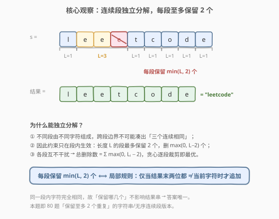
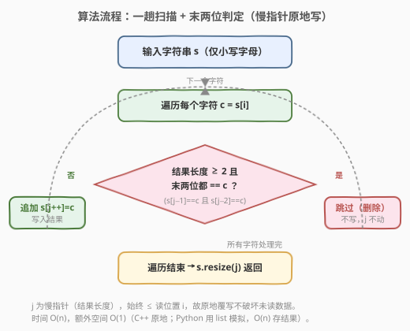
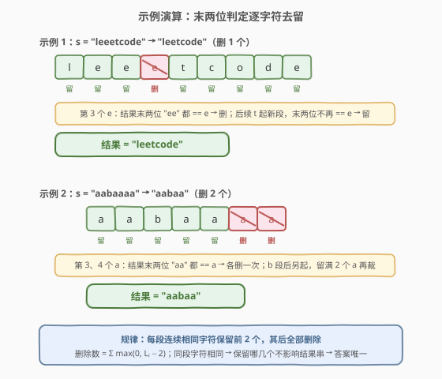

# 删除字符使字符串变好

- **题目名称**：删除字符使字符串变好
- **链接**：[1957. 删除字符使字符串变好](https://leetcode.cn/problems/delete-characters-to-make-fancy-string/)
- **难度**：简单
- **标签**：字符串、贪心、双指针

## 1. 题目概述

一个字符串如果没有**三个连续**相同字符，那么它就是一个**好字符串**。

给你一个字符串 $s$，请你从 $s$ 删除**最少**的字符，使它变成一个**好字符串**。请你返回删除后的字符串。题目数据保证答案总是**唯一的**。

**示例 1**：

```text
输入：s = "leeetcode"
输出："leetcode"
解释：从第一组 'e' 里面删除一个 'e'，得到 "leetcode"。没有连续三个相同字符。
```

**示例 2**：

```text
输入：s = "aabaaaa"
输出："aabaa"
解释：从第一组 'a' 里面删除一个 'a'，得到 "aabaaaa"；从第二组 'a' 里面删除两个 'a'，得到 "aabaa"。
```

**示例 3**：

```text
输入：s = "aab"
输出："aab"
解释：没有连续三个相同字符，直接返回。
```

**约束条件**：

- $1 \le s.\text{length} \le 10^5$
- $s$ 只包含小写英文字母

> 💡 **审题关键**：① 「三个连续相同」是**局部**约束——只看相邻三位，不关心全局频次；② 要删**最少**，意味着能留则留，只在「不删就会违规」时才删；③ 答案唯一是因为同一连续段内字符完全相同，删哪几个都不改变结果串的形态；④ $n \le 10^5$ 要求 $O(n)$，反复扫描的 $O(n^2)$ 会超时。

---

## 2. 解题思路

### 2.1 暴力思路：反复扫描删除三元组

最直觉的做法：从头扫描 $s$，一旦发现 $s[i] = s[i+1] = s[i+2]$，就删掉其中一个（比如 $s[i+2]$），然后**从删除点重新开始**扫描——因为下标错位后后续比较要重来。

```text
"leeetcode" → 发现 "eee" → 删第 3 个 e → "leetcode" → 再扫一遍无三元组 → 结束
```

- **正确性**：每次消除一个三元组，最终必无三元组；删的次数即最少（每个三元组至少删一个）。
- **效率**：最坏 $O(n^2)$。考虑 $s = $ `"a" * 10^5`，每次删一个字符后从头扫描，共删约 $n/3$ 次，每次扫描 $O(n)$，总量 $O(n^2)$，$n = 10^5$ 时约 $3 \times 10^9$ 次操作，**超时**。

> ⚠️ 暴力法的浪费在于「删一个就重头扫」——其实删掉一个字符只会缩短当前段，不可能在别处产生新的三元组（删除不引入新字符、不跨段拼接）。所以完全可以从左到右**一趟**处理，无需回溯。

### 2.2 核心观察：连续段独立分解 + 每段至多保留 2



关键洞察分三层：

**第一层：约束按「连续段」分解。** 把 $s$ 切成若干**极大连续相同字符段**（runs），每段由同一个字符重复 $L$ 次组成。「三个连续相同」只可能发生在**同一段内**——不同段的字符不同，跨段边界的三位必含相异字符，凑不出三元组。因此各段**互相独立**，可逐段处理。

**第二层：每段至多保留 2 个。** 一段长度 $L$：若 $L \le 2$，本就无三元组，全留；若 $L \ge 3$，要消除三元组须把长度降到 $\le 2$，即至少删 $L - 2$ 个。而降到 $2$ 恰好满足约束（两位不可能凑出三个），所以**最优就是每段保留 $\min(L, 2)$ 个**，删除 $\max(0, L-2)$ 个。

$$\boxed{\text{总删除数} = \sum_{\text{段 } i} \max(0,\, L_i - 2)}$$

**第三层：等价为局部贪心——「末两位判定」。** 上面要先识别段再裁剪，两趟扫描。进一步观察：**「保留每段前 2 个」等价于「逐字符追加时，仅当结果末两位不都等于当前字符才追加」**。因为一旦某段已追加 2 个，第 3 个会让末两位都等于它 → 跳过；而下一段首字符与末两位不同 → 必然追加。于是无需显式分段，一趟扫描 + 一个 $O(1)$ 的末两位判定即可，且可**原地慢指针覆写**（写指针 $j$ 始终 $\le$ 读位置，不破坏未读数据）。

> 💡 **与 80 题的同构**：[80. 删除有序数组中的重复项 II](../0001-0100/80_删除有序数组中的重复项II.md) 是「有序数组中每个值至多保留 2 份」，用慢指针 `slow-2` 判定；本题是「字符串中每个连续段至多保留 2 个」，用「结果末两位」判定。二者骨架完全一致——都是「保留至多 K=2 个重复」的慢指针模板，只是 80 题依赖排序保证同值相邻，而本题的「相邻」是原始连续段天然成立。

> ⚠️ **为什么答案唯一？** 同一段内字符完全相同，删掉该段的任意 $L-2$ 个，留下的都是「2 个该字符」，结果串形态不变。所以尽管「删哪几个」有多种选法，**结果字符串唯一**。贪心选「保留前 2 个」只是其中一种实现，输出与任何最优删法相同。

### 2.3 算法流程图



整体为「一趟遍历 + 条件追加」的线性流程：

1. **初始化**：慢指针 $j = 0$（结果长度），原地覆写 $s$（C++）或用列表暂存（Python）。
2. **遍历**：对每个字符 $c = s[i]$：
   - **判定**：若 $j \ge 2$ 且 $s[j-1] = c$ 且 $s[j-2] = c$（结果末两位都等于 $c$）→ **跳过**（删除，$j$ 不动）。
   - 否则 → **追加** $s[j] = c,\ j \gets j+1$。
3. **收尾**：`s.resize(j)`（C++）或 `''.join(res)`（Python），返回结果。

> 💡 **原地覆写的安全性**：写指针 $j$ 始终满足 $j \le i$（读位置），故写入 $s[j]$ 只会覆盖已读过的位置，不会破坏尚未读取的 $s[i+1..]$。当 $j = i$ 时是原地自拷贝，无害。这是慢指针去重模板的通用不变式，与 26/27/80 题同源。

### 2.4 示例演算

以两个官方示例演示末两位判定的逐字符去留：



**示例 1**（`s = "leeetcode"`）：

| 字符 | 结果末两位 | 判定 | 去留 | 结果 |
|------|------------|------|------|------|
| l | —（长度 0） | — | 留 | "l" |
| e | —（长度 1） | — | 留 | "le" |
| e | l, e | 末位 e == e，次末 l ≠ e | 留 | "lee" |
| e | e, e | 都 == e | **删** | "lee" |
| t | e, e | t ≠ e | 留 | "leet" |
| c | e, t | c ≠ e/t | 留 | "leetc" |
| o | t, c | o ≠ t/c | 留 | "leetco" |
| d | c, o | d ≠ c/o | 留 | "leetcod" |
| e | o, d | e ≠ o/d | 留 | "leetcode" |

第 3 个 `e` 被删（末两位 "ee" 都等于 e），其余全留 → `"leetcode"` ✓

**示例 2**（`s = "aabaaaa"`）：

| 字符 | 结果末两位 | 判定 | 去留 | 结果 |
|------|------------|------|------|------|
| a | —（长度 0） | — | 留 | "a" |
| a | —（长度 1） | — | 留 | "aa" |
| b | a, a | b ≠ a | 留 | "aab" |
| a | a, b | a ≠ b | 留 | "aaba" |
| a | b, a | a ≠ b | 留 | "aabaa" |
| a | a, a | 都 == a | **删** | "aabaa" |
| a | a, a | 都 == a | **删** | "aabaa" |

第二段 `a` 长度 4，保留前 2 个、删后 2 个 → `"aabaa"` ✓

> 💡 **观察要点**：① 末两位判定等价于「当前段已留 2 个就不再留」；② `b` 段隔开后，`a` 段重新从 0 计数，能再留 2 个——这正是「段间独立」的体现；③ 删除总数 $= \max(0,3-2) + \max(0,4-2) = 1 + 2 = 3$，与示例一致。

---

## 3. 参考代码

### C++（原地慢指针覆写）

```cpp
class Solution {
public:
    string makeFancyString(string s) {
        int j = 0;
        for (char c : s) {
            if (j >= 2 && s[j - 1] == c && s[j - 2] == c) continue;
            s[j++] = c;
        }
        s.resize(j);
        return s;
    }
};
```

### Python（列表暂存 + 末两位判定）

```python
class Solution:
    def makeFancyString(self, s: str) -> str:
        res = []
        for c in s:
            if len(res) >= 2 and res[-1] == c and res[-2] == c:
                continue
            res.append(c)
        return ''.join(res)
```

### Python（`itertools.groupby` 直接翻译「每段保留 min(L, 2)」）

```python
from itertools import groupby

class Solution:
    def makeFancyString(self, s: str) -> str:
        return ''.join(k * min(2, len(list(g))) for k, g in groupby(s))
```

> 💡 **写法对照**：① C++ 原地版直接翻译慢指针思路，$O(1)$ 额外空间，是 80 题慢指针模板的字符串镜像，面试默认先写这版；② Python 列表版与 C++ 逻辑一一对应，因字符串不可变需用 `list` 暂存；③ `groupby` 一行流把 2.2 节「每段保留 $\min(L, 2)$」直接落成代码——`groupby(s)` 按「连续相同」自动分段，`min(2, len)` 裁剪，语义最贴近数学表达，但需遍历两趟（分组 + 拼接）且生成中间列表；三版时间同为 $O(n)$。

> ⚠️ **`groupby` 与排序去重的区别**：`groupby` 只合并**相邻**的相同元素（不排序），恰好匹配本题「连续段」语义。若误用 `sorted` + `groupby` 会把全局同字符聚到一起，彻底改变题意——这是「连续相同」与「全局相同」的分水岭，对照 [80 题](../0001-0100/80_删除有序数组中的重复项II.md)（数组已排序，故相邻即全局同值）。

---

## 4. 复杂度分析

| 维度 | 反复扫描法 | 末两位判定法 | 说明 |
|------|-----------|--------------|------|
| 时间复杂度 | $O(n^2)$ | $O(n)$ | 反复扫描每删一个从头重来，最坏 $n/3$ 趟；贪心法一趟遍历，每字符 $O(1)$ 判定 |
| 空间复杂度 | $O(n)$（删改字符串） | C++ $O(1)$ / Python $O(n)$ | C++ 原地覆写仅慢指针；Python 字符串不可变，需列表暂存结果 |

> 💡 $n \le 10^5$ 时 $O(n)$ 约 $10^5$ 次操作，远在时限内；$O(n^2)$ 约 $3 \times 10^9$ 次会超时。这是「识别局部约束 → 单趟贪心」把平方降为线性的典型收益。

---

## 5. 扩展：保留至多 K 个的通用模板

本题是「每个连续段至多保留 $K=2$ 个」的特例。推广到任意 $K$：判定条件改为「结果末 $K$ 位都等于当前字符则跳过」。

```cpp
string removeKConsecutive(string s, int K) {
    int j = 0;
    for (char c : s) {
        if (j >= K) {
            bool allSame = true;
            for (int t = 1; t <= K; ++t) if (s[j - t] != c) { allSame = false; break; }
            if (allSame) continue;
        }
        s[j++] = c;
    }
    s.resize(j);
    return s;
}
```

- $K = 1$：即「相邻去重」，对应 [1047. 删除字符串中的所有相邻重复项](../1001-1100/1047_删除字符串中的所有相邻重复项.md) 的「压平」语义（但 1047 是**成对消除可递归**，比单纯去重更强）。
- $K = 2$：本题。
- 数组版 $K = 2$：[80. 删除有序数组中的重复项 II](../0001-0100/80_删除有序数组中的重复项II.md)，慢指针 `slow - K` 判定。

> ⚠️ 本题的 $K$ 是「连续段内上限」，**不是** [1209. 删除字符串中的所有相邻重复项 II](../1201-1300/1209_删除字符串中的所有相邻重复项II.md) 的「恰好 $k$ 个连续就整组消除并可能连锁」——1209 是**可递归触发**的栈模型，删除后两端可能拼接出新三元组；本题删除只缩短段、不跨段拼接，无连锁。二者形似而神不同，务必区分。

---

## 6. 面试要点

**Q1：为什么贪心「末两位判定」能得到最少删除？**

> 「三个连续相同」是局部约束，只在同一段内生效，段间独立。每段长度 $L$ 至多保留 2 个，最少删 $\max(0, L-2)$ 个。「末两位都等于当前字符则跳过」等价于「每段保留前 2 个、删其后所有」，恰达到各段下界 $\max(0, L-2)$，求和即全局最少。任何少于该量的删法都会使某段长度 $> 2$ 而违规。

**Q2：为什么删除不会产生新的三元组，可以一趟处理？**

> 删除一个字符只缩短当前段，不引入新字符、不把两段拼成一段（中间仍有别的字符隔开）。所以三元组只在原段内出现，删到长度 $\le 2$ 即彻底消除，无连锁反应。这与 1209 题「删除后两端拼接可能触发新消除」截然不同——本题是**无连锁**的局部裁剪。

**Q3：原地覆写 $s$ 安全吗？写指针会不会覆盖未读数据？**

> 安全。慢指针 $j$ 始终满足 $j \le i$（当前读位置），写入 $s[j]$ 只覆盖已读位置。循环 `for (char c : s)` 中 `c` 是按值拷贝，覆写 $s$ 不影响后续迭代读取。当 $j = i$ 时为原地自拷贝，无害。这是 26/27/80 题慢指针去重的通用不变式。

**Q4：本题和 80 题（删除有序数组中的重复项 II）有什么异同？**

> 同：都是「保留至多 2 个重复」的慢指针模板，判定都看「结果末两位/末 K 位」。异：80 题数组**已排序**，同值全局相邻，故「相邻重复」即「全局同值」；本题字符串未排序，只有**原始连续**的同字符成段，跨段同字符不合并。所以 80 题可用 `slow-2` 单指针判定，本题用「结果末两位」判定——结构同源、语义有别。

**Q5：为什么题目保证答案唯一？**

> 同一段内字符完全相同，无论删该段的哪 $L-2$ 个，留下都是「2 个该字符」，结果串形态不变。不同段的删法互相独立组合，但每段输出固定，故最终字符串唯一。贪心选「保留前 2 个」只是实现之一，输出与任意最优删法相同。

> 💡 **一句话总结**：「三个连续相同」是局部约束 → 按连续段独立分解 → 每段保留 $\min(L,2)$ 个 → 等价为「结果末两位都等于当前字符则跳过」的一趟贪心，慢指针原地 $O(n)$。

---

## 7. 同类练习题

- [80. 删除有序数组中的重复项 II](https://leetcode.cn/problems/remove-duplicates-from-sorted-array-ii/)（[题解](../0001-0100/80_删除有序数组中的重复项II.md)）：本题的数组母题，同属「保留至多 K=2 个重复」慢指针模板；80 题依赖排序保证同值相邻，本题依赖原始连续段，对照体会「相邻」语义差异
- [26. 删除有序数组中的重复项](https://leetcode.cn/problems/remove-duplicates-from-sorted-array/)（[题解](../0001-0100/26_删除有序数组中的重复项.md)）：K=1 的基础版慢指针去重，回看 1 格判定；本题是 K=2 的字符串延伸，体会在判定上多回看 1 格的递进
- [1047. 删除字符串中的所有相邻重复项](https://leetcode.cn/problems/remove-all-adjacent-duplicates-in-string/)（[题解](../1001-1100/1047_删除字符串中的所有相邻重复项.md)）：同为字符串相邻消除，但 1047 是「成对消除」，栈模型；本题是「至多留 2 个」，无连锁，对照两种消除语义
- [1209. 删除字符串中的所有相邻重复项 II](https://leetcode.cn/problems/remove-all-adjacent-duplicates-in-string-ii/)（[题解](../1201-1300/1209_删除字符串中的所有相邻重复项II.md)）：形似而神不同——1209 删除后两端拼接**可连锁触发**新消除，需栈 + 计数；本题删除不跨段拼接、无连锁，单趟贪心即可，务必区分
