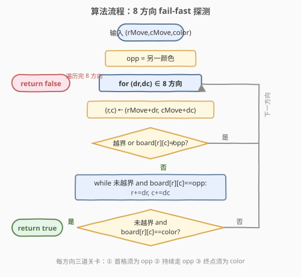
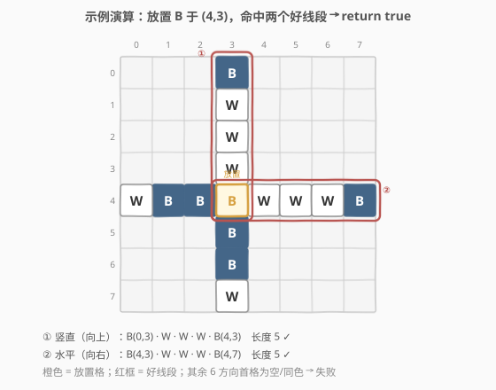

# LeetCode 检查操作是否合法 题解

## 1. 题目概述

- **标题 / 题号**：检查操作是否合法（#1958，medium）
- **链接**：https://leetcode.cn/problems/check-if-move-is-legal/
- **难度**：中等
- **标签**：数组、矩阵、方向枚举、模拟

**题意**：给你一个下标从 **0** 开始的 $8 \times 8$ 网格 `board`，其中 `board[r][c]` 表示棋盘格子 $(r, c)$：空格用 `'.'`，白色用 `'W'`，黑色用 `'B'`。

每次操作：选一个空格子，涂成你正在执行的颜色（`'W'` 或 `'B'`）。**合法**操作必须满足：涂色后这个格子是**好线段的一个端点**（好线段可水平、竖直或对角）。

**好线段**定义：

- 包含 **3 个或更多**格子（含两端）；
- 两个**端点**格子为**同一种颜色**；
- 中间剩余格子全为**另一种颜色**；
- 线段上**不能有任何空格子**。

给定 `rMove`、`cMove`、`color`，若把 $(rMove, cMove)$ 变成 `color` 后是合法操作返回 `true`，否则 `false`。

**示例 1**：

```text
输入：board = [[".",".",".","B",".",".",".","."],
              [".",".",".","W",".",".",".","."],
              [".",".",".","W",".",".",".","."],
              [".",".",".","W",".",".",".","."],
              ["W","B","B",".","W","W","W","B"],
              [".",".",".","B",".",".",".","."],
              [".",".",".","B",".",".",".","."],
              [".",".",".","W",".",".",".","."]]
      rMove = 4, cMove = 3, color = "B"
输出：true
解释：以选中格子为端点的两个好线段（竖直向上、水平向右）均满足条件。
```

**示例 2**：

```text
输入：board = [[".",".",".",".",".",".",".","."],
              [".","B",".",".","W",".",".","."],
              [".",".","W",".",".",".",".","."],
              [".",".",".","W","B",".",".","."],
              [".",".",".",".",".",".",".","."],
              [".",".",".",".","B","W",".","."],
              [".",".",".",".",".",".","W","."],
              [".",".",".",".",".",".",".","B"]]
      rMove = 4, cMove = 4, color = "W"
输出：false
解释：选中格子涂色后虽产生好线段，但它作为中间格子，没有以它为端点的好线段。
```

**约束**：

- `board.length == board[r].length == 8`
- $0 \le \text{rMove}, \text{cMove} < 8$
- `board[rMove][cMove] == '.'`
- `color` 为 `'B'` 或 `'W'`

> 💡 **审题关键**：① 「**端点**」是题眼——放置格必须是好线段的**一端**，而非中间格子（示例 2 的陷阱正是如此）；② 由端点语义可知，每条好线段从放置格出发只**沿一个方向**延伸，故只需探测 **8 个单向方向**，而非 4 条穿过格子的整线；③ 好线段结构被放置色完全固定：$[\text{color},\, \underbrace{\text{opp},\ldots,\text{opp}}_{\ge 1},\, \text{color}]$，首格必为对方色、末格必为同色、中间全为对方色。

## 2. 解题思路

### 2.1 暴力思路：沿方向收集整条射线再判定

最直觉的做法：对 8 个方向中的每一个，从 $(rMove, cMove)$ 出发把该方向上直到边界/空格的所有格子收集到一个列表，再逐一核验好线段三要素——长度 $\ge 3$、首尾同色（均为 `color`）、中间全为对方色、无空格。

- **正确性**：穷举所有可能以放置格为端点的射线，逐一验证，显然完备。
- **效率**：8 方向，每方向至多 8 格，时间 $O(8 \times 8) = O(1)$（棋盘固定 $8\times 8$）；但**先收集再判定**需开临时列表、扫两遍（收集一遍 + 校验一遍），且未利用「首格即定生死」的早退机会。

> ⚠️ 暴力法的浪费在于「整段收集后才下结论」。其实好线段的模式由放置色完全决定，可用**在线模式匹配 + fail-fast**一次性走完：第一步若不是对方色即刻放弃该方向，走到非对方色时只需判断是否为同色。无需存储中间列表，也无需回头校验。

### 2.2 核心观察：端点语义 + 固定模式 $[\text{color}, \text{opp}^+, \text{color}]$

![核心观察：好线段 = [放置色, 对方色+, 放置色]，8 方向单向探测](../images/1958_concept.svg)

关键洞察分两层：

**第一层：端点语义 ⟹ 8 条单向射线。** 放置格是好线段的**一个端点**，线段从它出发**只向一个方向**延伸（不会越过放置格到反方向）。过放置格的「整条线」虽有 4 条（水平、竖直、两条对角），但每条线被放置格切成两段，只有其中**一段**可能成为好线段。因此等价于探测 **8 个单向方向**（上、下、左、右、四个对角），任一命中即合法。

**第二层：模式固定 ⟹ 单遍 fail-fast 匹配。** 设放置色为 `color`，对方色为 `opp`。从放置格沿某方向 $(dr, dc)$ 前进，好线段必然呈：

$$\boxed{[\,\text{color}\,(\text{放置格}),\; \underbrace{\text{opp},\; \text{opp},\; \ldots,\; \text{opp}}_{\ge 1 \text{ 个对方色}},\; \text{color}\,(\text{另一端})\,]}$$

由此推出**三道关卡**，逐关失败即放弃该方向：

1. **首格须为 `opp`**：若第一步就出界 / 为空 / 为同色 → 该方向无好线段（长度不足或端点不对）。
2. **持续走 `opp`**：只要当前格是对方色就继续前进，中间**不得有空格**（空格自然终止循环）。
3. **终止格须为 `color`**：循环停下时，若仍在界内且恰为 `color` → 找到好线段，`return true`；若出界或为空 → 该方向失败。

> 💡 **为什么首格必须是对方色？** 好线段至少 3 格，两端同色。放置格已是 `color`（一端），则紧邻的第二格必属「中间段」，必为对方色 `opp`；若第二格就是 `color`，则线段只有 2 格（不满足 $\ge 3$）；若第二格为空或出界，则无法构成连续线段。故首格判 `opp` 一举三得：排除长度不足、排除空格断线、排除同色相邻。

> ⚠️ **易错点：把放置格当中间格。** 示例 2 中 $(4,4)$ 涂色后，竖直方向的 $(3,4)=\text{B}, (2,4)=.$ 构不成好线段，而某些斜方向虽有连续异色但放置格位于中间——题意要求放置格是**端点**。本算法从放置格**出发**单向延伸，天然保证放置格是端点，不会误判中间格情形。

### 2.3 算法流程图



整体为「8 方向循环 + 三关 fail-fast」：

1. **预处理**：`opp = (color == 'B') ? 'W' : 'B'`，枚举 8 组方向增量 $(dr, dc)$。
2. **每方向**：
   - **步进一格**：$(r, c) \leftarrow (rMove+dr,\, cMove+dc)$。
   - **关卡①**：若越界或 `board[r][c] != opp` → `continue`（下一方向）。
   - **关卡②**：`while` 未越界且 `board[r][c] == opp`：$(r, c) \mathrel{+}= (dr, dc)$。
   - **关卡③**：循环结束时，若未越界且 `board[r][c] == color` → `return true`。
3. **8 方向均未命中** → `return false`。

> 💡 **fail-fast 的收益**：关卡①在第一步即可淘汰大量方向（示例 1 中 6 个方向首格为空/同色，一步即弃）；关卡②遇空格/出界自然停；关卡③一次比较定成败。每方向至多走 8 步，整题至多 $8 \times 8 = 64$ 次访问。

### 2.4 示例演算

以**示例 1** 演示：放置 `B` 于 $(4,3)$，`opp = 'W'`，逐方向探测：



| 方向 | $(dr,dc)$ | 首格 $(r,c)$ | 关卡① | 沿途格子（关卡②） | 终止格 | 关卡③ | 结果 |
|------|-----------|--------------|-------|-------------------|--------|-------|------|
| 上 | $(-1,0)$ | $(3,3)=W$ | ✓ opp | $(2,3)=W,\,(1,3)=W$ | $(0,3)=B$ | ✓ color | `true` |
| 下 | $(1,0)$ | $(5,3)=B$ | ✗ 同色 | — | — | — | 失败 |
| 左 | $(0,-1)$ | $(4,2)=B$ | ✗ 同色 | — | — | — | 失败 |
| 右 | $(0,1)$ | $(4,4)=W$ | ✓ opp | $(4,5)=W,\,(4,6)=W$ | $(4,7)=B$ | ✓ color | `true` |
| 左上 | $(-1,-1)$ | $(3,2)=.$ | ✗ 空 | — | — | — | 失败 |
| 右上 | $(-1,1)$ | $(3,4)=.$ | ✗ 空 | — | — | — | 失败 |
| 左下 | $(1,-1)$ | $(5,2)=.$ | ✗ 空 | — | — | — | 失败 |
| 右下 | $(1,1)$ | $(5,4)=.$ | ✗ 空 | — | — | — | 失败 |

- **命中两条**：① 竖直向上 $B(0,3)\text{-}W\text{-}W\text{-}W\text{-}B(4,3)$（长度 5）；② 水平向右 $B(4,3)\text{-}W\text{-}W\text{-}W\text{-}B(4,7)$（长度 5）。任一命中即 `return true`。
- **6 个方向一步即弃**：下/左首格同色（`B`），四个对角首格为空——关卡①直接 `continue`，体现代码 fail-fast 的效率。

> 💡 **示例 2 对照**：放置 `W` 于 $(4,4)$，`opp='B'`。竖直向上 $(3,4)=B$（过①），但 $(2,4)=.$ 为空，关卡②终止，关卡③判空格 → 失败；其余方向首格为空或同色。8 方向全失败 → `false`。这正印证「放置格必须为端点」——尽管棋盘别处有好线段，但无一以 $(4,4)$ 为端点。

## 3. 参考代码

### C++（8 方向 fail-fast）

```cpp
class Solution {
public:
    bool checkMove(vector<vector<char>>& board, int rMove, int cMove, char color) {
        int dirs[8][2] = {{1,0},{-1,0},{0,1},{0,-1},{1,1},{1,-1},{-1,1},{-1,-1}};
        char opp = (color == 'B') ? 'W' : 'B';
        for (auto& d : dirs) {
            int r = rMove + d[0], c = cMove + d[1];
            if (r < 0 || r >= 8 || c < 0 || c >= 8 || board[r][c] != opp) continue;
            while (r >= 0 && r < 8 && c >= 0 && c < 8 && board[r][c] == opp) {
                r += d[0];
                c += d[1];
            }
            if (r >= 0 && r < 8 && c >= 0 && c < 8 && board[r][c] == color) {
                return true;
            }
        }
        return false;
    }
};
```

### Python（同逻辑）

```python
class Solution:
    def checkMove(self, board: List[List[str]], rMove: int, cMove: int, color: str) -> bool:
        dirs = [(1,0),(-1,0),(0,1),(0,-1),(1,1),(1,-1),(-1,1),(-1,-1)]
        opp = 'W' if color == 'B' else 'B'
        for dr, dc in dirs:
            r, c = rMove + dr, cMove + dc
            if not (0 <= r < 8 and 0 <= c < 8) or board[r][c] != opp:
                continue
            while 0 <= r < 8 and 0 <= c < 8 and board[r][c] == opp:
                r += dr
                c += dc
            if 0 <= r < 8 and 0 <= c < 8 and board[r][c] == color:
                return True
        return False
```

### Python（抽方向探测函数，结构更清晰）

```python
class Solution:
    def checkMove(self, board: List[List[str]], rMove: int, cMove: int, color: str) -> bool:
        opp = 'W' if color == 'B' else 'B'
        dirs = [(1,0),(-1,0),(0,1),(0,-1),(1,1),(1,-1),(-1,1),(-1,-1)]

        def hits(dr: int, dc: int) -> bool:
            r, c = rMove + dr, cMove + dc
            if not (0 <= r < 8 and 0 <= c < 8) or board[r][c] != opp:
                return False
            while 0 <= r < 8 and 0 <= c < 8 and board[r][c] == opp:
                r += dr
                c += dc
            return 0 <= r < 8 and 0 <= c < 8 and board[r][c] == color

        return any(hits(dr, dc) for dr, dc in dirs)
```

> 💡 **写法对照**：① 前两版直接翻译「三道关卡」，C++ 与 Python 逐行对应，面试默认先写这版并口述三关；② 第三版把单方向探测抽成 `hits` 闭包，主逻辑化为 `any(...)`，突出「8 方向任一命中即合法」的语义，便于口述「存在性判定 = 短路或」。三版时间同为 $O(1)$。

> ⚠️ **边界写法细节**：`while` 条件把「未越界」与「`== opp`」合并，保证循环内访问 `board[r][c]` 一定不越界（Python 的短路 `and` 与 C++ 的 `&&` 均左到右求值，越界检查在前）。循环退出后再独立判一次越界 + 同色——此时 `board[r][c]` 可能是 `color`、`.` 或越界，须先确认在界内才能访问。

## 4. 复杂度分析

| 维度 | 收集再判定 | fail-fast 三关 | 说明 |
|------|-----------|----------------|------|
| 时间复杂度 | $O(1)$ | $O(1)$ | 棋盘固定 $8\times 8$，8 方向每方向至多 8 步，总计 $\le 64$ 次访问；fail-fast 常数更小（首格即弃多数方向） |
| 空间复杂度 | $O(1)$（若存列表 $O(8)$） | $O(1)$ | 仅常数个方向增量与游标 $(r,c)$；fail-fast 不存储中间格子 |

> 💡 严格按输入规模记，时间为 $O(D \cdot N)$，其中 $D=8$ 方向数、$N=8$ 棋盘边长，即 $O(N)$ 量级。但因 $N=8$ 固定，实战中视为 $O(1)$。若推广到 $N\times N$ 棋盘，则为 $O(N)$ 时间、$O(1)$ 额外空间。

## 5. 扩展：黑白棋（Othello / Reversi）落子合法性

本题的「好线段」正是黑白棋（Othello / Reversi）中**合法落子**的核心规则：落子后，以该子为一端、夹住对方一段连续棋子、另一端为己方已有棋子，则被夹棋子全部翻转。判定合法性与本题完全一致——8 方向寻找 $[\text{己色}, \text{opp}^+, \text{己色}]$。

- **合法落子判定**：即本题，只需判断是否存在至少一个方向满足模式，返回布尔。
- **实际落子翻转**：在判定合法后，沿每个命中方向把中间的 `opp` 逐格翻成 `color`。只需在找到终止格为 `color` 后，反向回走把中间格改色即可。

```python
def flips(board, rMove, cMove, color):
    opp = 'W' if color == 'B' else 'B'
    dirs = [(1,0),(-1,0),(0,1),(0,-1),(1,1),(1,-1),(-1,1),(-1,-1)]
    legal = False
    for dr, dc in dirs:
        r, c = rMove + dr, cMove + dc
        if not (0 <= r < 8 and 0 <= c < 8) or board[r][c] != opp:
            continue
        while 0 <= r < 8 and 0 <= c < 8 and board[r][c] == opp:
            r += dr; c += dc
        if 0 <= r < 8 and 0 <= c < 8 and board[r][c] == color:
            legal = True
            r -= dr; c -= dc
            while (r, c) != (rMove, cMove):
                board[r][c] = color
                r -= dr; c -= dc
    return legal
```

> 💡 **判定 vs 执行**：本题只问「是否合法」，是存在性判定（`any`）；翻转则是执行，需对所有命中方向都操作（`all` 方向遍历）。二者共用同一套 8 方向扫描骨架，差别仅在「找到后是否回填改色」。

> ⚠️ LeetCode 上没有完整的黑白棋对局题，但本题足以覆盖「落子合法性」这一核心子问题。若面试被追问「实现翻转」，只需在命中方向上反向回走改色即可，复杂度仍 $O(1)$。

## 6. 面试要点

**Q1：为什么是 8 个方向而不是 4 条线？**

> 放置格是好线段的**端点**，线段从它出发只向一个方向延伸。过放置格的整线虽有 4 条（横、竖、两对角），但每条被放置格切成两段，每段对应一个单向方向，故共 8 个单向方向。若误按 4 条整线扫描，需额外处理「放置格在中间」的情况，反而把端点语义搞错——示例 2 正是放置格在中间而不合法的陷阱。

**Q2：好线段的模式为什么是 $[\text{color}, \text{opp}^+, \text{color}]$？**

> 两端同色且为 `color`（放置格已是其中一端），中间全为「另一种颜色」即 `opp`，长度 $\ge 3$ 意味着中间至少 1 个 `opp`。因此从放置格出发：首格必为 `opp`（否则长度不足或断线），之后连续 `opp`，直到遇到 `color`（另一端）即成好线段。模式由放置色完全决定，可单遍匹配。

**Q3：`while` 循环退出后为什么还要再判一次越界？**

> `while` 的退出条件是「越界 **或** 当前格非 `opp`」。退出时 $(r,c)$ 可能：(a) 在界内且为 `color`（成功）；(b) 在界内且为空（断线失败）；(c) 已越界（出界失败）。要访问 `board[r][c]` 判断是否为 `color`，必须**先确认在界内**，否则越界访问。故写成 `if (在界内 and board[r][c] == color)`，顺序不可颠倒。

**Q4：示例 2 为什么返回 `false`？棋盘上不是有好线段吗？**

> 确实，涂色后棋盘上存在好线段，但题意要求放置格是某好线段的**端点**。示例 2 中 $(4,4)$ 涂 `W` 后，竖直方向 $(3,4)=B$ 后接空格，无法到达另一端 `W`；其余方向首格为空或同色。8 方向无一以 $(4,4)$ 为端点构成好线段，故 `false`。本算法从放置格出发单向延伸，天然只认「放置格为端点」的线段，不会误判中间格。

**Q5：能否不模拟落子直接判？时间复杂度？**

> 本就是直接判——无需修改棋盘，因为放置格「视为」`color` 后，从它出发的方向扫描中，放置格本身不参与比较（从相邻格开始）。算法只读 `board` 不写，时间 $O(8 \times 8) = O(1)$（固定棋盘），推广到 $N\times N$ 为 $O(N)$。空间 $O(1)$。

> 💡 **一句话总结**：放置格为端点 ⟹ 8 单向射线；模式 $[\text{color}, \text{opp}^+, \text{color}]$ ⟹ 三关 fail-fast（首格 opp → 走 opp → 末格 color）；任一方向命中即 `true`，$O(1)$ 时间、$O(1)$ 空间。

## 同类练习题

| # | 题目 | 与本题的关联 |
|---|------|-------------|
| 79 | [单词搜索](https://leetcode.cn/problems/word-search/)（[题解](../0001-0100/79_单词搜索.md)） | 网格上的 4 方向 DFS 回溯，同属「方向枚举 + 边界判定」骨架，对照体会「逐方向深入 + 失败回退」与本题「逐方向 fail-fast + 早退」的异同 |
| 54 | [螺旋矩阵](https://leetcode.cn/problems/spiral-matrix/)（[题解](../0001-0100/54_螺旋矩阵.md)） | 方向驱动的网格遍历，按方向增量逐步行走并处理边界转向，训练方向增量 $(dr,dc)$ 与越界判定的基本功 |
| 200 | [岛屿数量](https://leetcode.cn/problems/number-of-islands/)（[题解](../0101-0200/200_岛屿数量.md)） | 网格 4 方向连通分量计数，从单格出发向邻格扩散，与本题「从单格出发向单方向探测」互为对照（扩散 vs 射线） |
| 994 | [腐烂的橘子](https://leetcode.cn/problems/rotting-oranges/)（[题解](../0901-1000/994_腐烂的橘子.md)） | 网格多源 BFS，按 4 方向逐层扩散，同属矩阵方向枚举系列，体会有序扩散（BFS）与单向射线（本题）的边界处理差异 |
