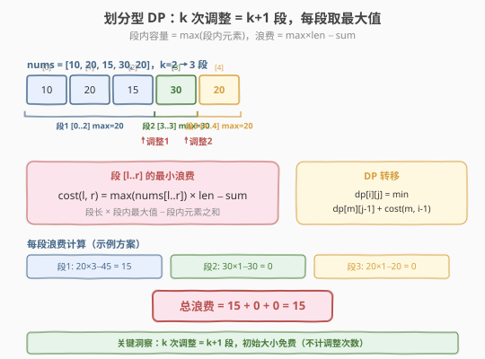
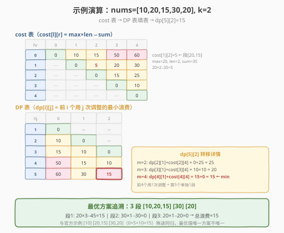

# LeetCode K 次调整数组大小浪费的最小总空间 题解

## 1. 题目概述

- **标题 / 题号**：K 次调整数组大小浪费的最小总空间（#1959，medium）
- **链接**：https://leetcode.cn/problems/minimum-total-space-wasted-with-k-resizing-operations/
- **难度**：中等
- **标签**：动态规划、区间划分

**题意**：给定下标从 0 开始的整数数组 `nums`，其中 `nums[i]` 表示时刻 `i` 数组中的元素数目。另有整数 `k`，表示**最多**可调整数组大小的次数（每次可调整成任意大小）。

- 时刻 `t` 的数组大小 `size_t` 必须 `≥ nums[t]`（容纳所有元素）。
- 时刻 `t` 的**浪费空间**为 `size_t - nums[t]`。
- **总浪费空间**为所有时刻浪费空间之和。
- 数组初始大小可为任意值，且**不计入**调整次数。

在调整不超过 `k` 次的前提下，返回**最小总浪费空间**。

**示例 1**：

```text
输入：nums = [10,20], k = 0
输出：10
解释：size = [20,20]。初始大小为 20，不调整。
总浪费 = (20-10) + (20-20) = 10。
```

**示例 2**：

```text
输入：nums = [10,20,30], k = 1
输出：10
解释：size = [20,20,30]。初始大小 20，时刻 2 调整为 30。
总浪费 = (20-10) + (20-20) + (30-30) = 10。
```

**示例 3**：

```text
输入：nums = [10,20,15,30,20], k = 2
输出：15
解释：size = [10,20,20,30,30]。初始 10，时刻 1 调为 20，时刻 3 调为 30。
总浪费 = (10-10)+(20-20)+(20-15)+(30-30)+(30-20) = 15。
```

**约束**：

- `1 <= nums.length <= 200`
- `1 <= nums[i] <= 10^6`
- `0 <= k <= nums.length - 1`

> 💡 本题本质是**将序列划分成若干段，每段取统一容量（该段最大值），最小化总浪费**。调整 `k` 次 = 切成 `k+1` 段，这是典型的**区间划分型 DP**，与 [410. 分割数组的最大值](../0401-0500/410_分割数组的最大值.md)（最小化最大段和）是姊妹题——只是优化目标从"最大段和"变成了"段内浪费之和"。

## 2. 解题思路

### 2.1 暴力思路：枚举所有切分方案

`k` 次调整等价于在序列中选 `k` 个切分点，将 `n` 个时刻分成 `k+1` 段。每段 `[l, r]` 的容量取 `max(nums[l..r])`（取最大才能容纳段内所有元素，且浪费最小）。

暴力枚举所有切分点组合：$C(n-1, k)$ 种，每种计算总浪费 `O(n)`，总量级 `O(C(n,k) · n)`。`n=200, k=100` 时组合数天文数字，**不可行**。

> ⚠️ 暴力的根本问题：**子问题重叠**。不同切分方案共享大量前缀段，重复计算浪费。例如切分点 `{2,5}` 和 `{2,7}` 都共享"前 3 个元素一段"这个前缀，但暴力各算一遍。

### 2.2 核心观察：段内浪费可预处理 + 划分型 DP

**观察 1：每段的最优容量 = 该段最大值。**

对段 `[l, r]`，容量 `s` 必须 `≥ max(nums[l..r])`。取 `s = max(nums[l..r])` 时浪费最小（再大只会增加浪费）。因此段 `[l, r]` 的最小浪费为：

$$cost(l, r) = \max(\text{nums}[l..r]) \times (r - l + 1) - \sum_{i=l}^{r} \text{nums}[i]$$

即"段长 × 段内最大值 − 段内元素之和"。**可预处理所有 `O(n²)` 个段的 cost。**

**观察 2：划分型 DP —— 前 `i` 个元素用 `j` 次调整的最小浪费。**

定义 $dp[i][j]$ = 前 `i` 个时刻（`nums[0..i-1]`）使用 `j` 次调整的最小总浪费。

- **边界**：$dp[i][0] = cost(0, i-1)$（不调整，整段一个容量）。
- **转移**：$dp[i][j] = \min_{m=j}^{i-1} \big\{ dp[m][j-1] + cost(m, i-1) \big\}$
  - 枚举最后一段的起点 `m`（前 `m` 个元素用 `j-1` 次调整，剩下 `nums[m..i-1]` 作为第 `j+1` 段）。
  - `m ≥ j`：前 `m` 个元素至少需 `j` 个元素才能分成 `j` 段（每段 ≥ 1 元素）。
  - `m ≤ i-1`：最后一段至少 1 个元素。
- **答案**：$dp[n][k]$。



> 💡 **为什么是 `k+1` 段而不是 `k` 段？** 初始大小不计入调整次数，所以"第 1 段"的容量是白送的。`k` 次调整 → `k+1` 段。`j` 次调整对应 `j+1` 段，所以 `dp[i][j]` 需要 `i ≥ j+1`（元素数 ≥ 段数）。

### 2.3 算法流程图

![算法流程：预处理 cost 表 → DP 逐层填表 → 返回 dp[n][k]](../images/1959_algorithm_flow.svg)

**完整步骤**：

1. **预处理 `cost` 表**：对每个 `[l, r]`，维护段内最大值和段内元素和，计算 `cost[l][r]`。
   - 可用前缀和加速求段内和：`sum(l, r) = prefix[r+1] - prefix[l]`。
   - 段内最大值：枚举 `l`，向右扩展 `r` 时滚动更新 `max`。
2. **DP 填表**：
   - 初始化 `dp[i][0] = cost[0][i-1]`（`i` 从 1 到 n）。
   - 对 `j` 从 1 到 `k`，对 `i` 从 `j+1` 到 `n`，枚举 `m` 从 `j` 到 `i-1`：`dp[i][j] = min(dp[i][j], dp[m][j-1] + cost[m][i-1])`。
3. **返回** `dp[n][k]`。

> ⚠️ **段数 ≤ 元素数约束**：`j+1 ≤ i`（`j` 次调整分 `j+1` 段，需 ≥ `j+1` 个元素）。不满足时 `dp[i][j] = ∞`，转移自动跳过。

### 2.4 示例演算

以 `nums = [10, 20, 15, 30, 20], k = 2` 为例（n=5，切 3 段）：



**第 1 步：预处理 cost 表**（`cost[l][r] = max × len − sum`）

| l\r | 0 | 1 | 2 | 3 | 4 |
|-----|---|---|---|---|---|
| **0** | 0 | 10 | 15 | 50 | 60 |
| **1** | — | 0 | 5 | 20 | 30 |
| **2** | — | — | 0 | 15 | 25 |
| **3** | — | — | — | 0 | 10 |
| **4** | — | — | — | — | 0 |

以 `cost[1][2]` 为例：段 `[20, 15]`，max=20，len=2，sum=35 → `20×2 − 35 = 5`。

**第 2 步：DP 填表**（`dp[i][j]` = 前 i 个元素用 j 次调整的最小浪费）

| i\j | 0 | 1 | 2 |
|-----|---|---|---|
| **1** | 0 | ∞ | ∞ |
| **2** | 10 | 0 | ∞ |
| **3** | 15 | 10 | 0 |
| **4** | 50 | 15 | 10 |
| **5** | 60 | 30 | **15** |

关键转移（`dp[5][2]`，前 5 个元素用 2 次调整 = 3 段）：

| m（最后一段起点） | dp[m][1] + cost[m][4] | 值 |
|------------------|----------------------|-----|
| m=2 | dp[2][1] + cost[2][4] = 0 + 25 = 25 | 25 |
| m=3 | dp[3][1] + cost[3][4] = 10 + 10 = **20** | 20 |
| m=4 | dp[4][1] + cost[4][4] = 15 + 0 = 15 | **15** ← min |

最优方案：`dp[4][1] + cost[4][4]` → 前 4 个元素用 1 次调整（2 段：`[10],[20,15,30]`），第 5 个元素单独 1 段（`[20]`）。

> 💡 追溯 `dp[4][1]`：`dp[1][0] + cost[1][3] = 0 + 20 = 20`，或 `dp[3][0] + cost[3][3] = 15 + 0 = 15`。取后者 → 前 3 个元素 1 段 `[10,20,15]`，第 4 个 `[30]`。最终 3 段：`[10,20,15] [30] [20]`，总浪费 `15 + 0 + 0 = 15`。与官方示例的切法 `[10] [20,15] [30,20]`（浪费 `0+5+10=15`）殊途同归——**最优值唯一，最优方案可能不唯一**。

## 3. 参考代码

### C++

```cpp
// 1959_K次调整数组大小浪费的最小总空间.cpp
// 编译: g++ -O2 -std=c++17 1959.cpp -o sol
#include <vector>
#include <algorithm>
using namespace std;

class Solution {
  public:
    int minSpaceWastedKResizing(vector<int>& nums, int k) {
        int n = nums.size();
        // cost[l][r] = 段 [l,r] 的最小浪费 = max*len - sum
        vector<vector<int>> cost(n, vector<int>(n, 0));
        for (int l = 0; l < n; ++l) {
            int mx = 0, sum = 0;
            for (int r = l; r < n; ++r) {
                mx = max(mx, nums[r]);
                sum += nums[r];
                cost[l][r] = mx * (r - l + 1) - sum;
            }
        }
        // dp[i][j] = 前 i 个元素用 j 次调整的最小浪费
        // i: 1..n, j: 0..k
        const int INF = 1e9;
        vector<vector<int>> dp(n + 1, vector<int>(k + 1, INF));
        for (int i = 1; i <= n; ++i) {
            dp[i][0] = cost[0][i - 1]; // 不调整，整段一个容量
        }
        for (int j = 1; j <= k; ++j) {
            for (int i = j + 1; i <= n; ++i) { // i >= j+1（段数≤元素数）
                for (int m = j; m < i; ++m) {  // 最后一段 nums[m..i-1]
                    dp[i][j] = min(dp[i][j], dp[m][j - 1] + cost[m][i - 1]);
                }
            }
        }
        return dp[n][k];
    }
};
```

### Python

```python
class Solution:
    def minSpaceWastedKResizing(self, nums: list[int], k: int) -> int:
        n = len(nums)
        # cost[l][r] = 段 [l,r] 的最小浪费 = max*len - sum
        cost = [[0] * n for _ in range(n)]
        for l in range(n):
            mx = 0
            total = 0
            for r in range(l, n):
                mx = max(mx, nums[r])
                total += nums[r]
                cost[l][r] = mx * (r - l + 1) - total

        # dp[i][j] = 前 i 个元素用 j 次调整的最小浪费
        INF = 10 ** 9
        dp = [[INF] * (k + 1) for _ in range(n + 1)]
        for i in range(1, n + 1):
            dp[i][0] = cost[0][i - 1]  # 不调整，整段一个容量

        for j in range(1, k + 1):
            for i in range(j + 1, n + 1):  # i >= j+1（段数≤元素数）
                for m in range(j, i):     # 最后一段 nums[m..i-1]
                    dp[i][j] = min(dp[i][j], dp[m][j - 1] + cost[m][i - 1])

        return dp[n][k]
```

> 💡 **预处理 cost 表的技巧**：枚举左端点 `l` 后向右扩展 `r`，同时滚动维护 `mx` 和 `sum`——无需前缀和数组，`O(n²)` 一次填完。这是因为 `cost[l][r]` 的 max 和 sum 都可从 `cost[l][r-1]` 增量得到。

## 4. 复杂度分析

| 维度 | 复杂度 | 说明 |
|------|--------|------|
| **时间** | $O(n^2 \cdot k)$ | cost 表预处理 $O(n^2)$；DP 三重循环 $O(n^2 k)$，后者主导 |
| **空间** | $O(n^2 + n \cdot k)$ | cost 表 $O(n^2)$；DP 表 $O(nk)$ |

> ⚠️ `n ≤ 200, k ≤ 199`，$n^2 k \approx 8 \times 10^6$，完全可接受。若 `k ≥ n`，调整次数充裕（每个元素单独一段，浪费为 0），但题目保证 `k ≤ n−1`。

## 5. 扩展：滚动数组优化与同类划分型 DP

### 5.1 空间优化

DP 转移 `dp[i][j]` 只依赖 `dp[*][j-1]`，可用**滚动数组**将 DP 表空间从 $O(nk)$ 降到 $O(n)$：

```python
prev = [cost[0][i - 1] for i in range(1, n + 1)]  # dp[i][0]
for j in range(1, k + 1):
    cur = [INF] * (n + 1)
    for i in range(j + 1, n + 1):
        for m in range(j, i):
            cur[i] = min(cur[i], prev[m] + cost[m][i - 1])
    prev = cur
return prev[n]
```

但 cost 表 $O(n^2)$ 无法省略（它是转移的核心依赖），所以总空间仍 $O(n^2)$。

### 5.2 划分型 DP 家族

本题属于"**将序列分成若干段，优化某段级指标之和**"的划分型 DP 家族：

| 题目 | 段级指标 | 优化目标 | 与本题关系 |
|------|---------|---------|-----------|
| **1959** 本题 | 段内最大值×段长−段和 | 最小化段指标之和 | — |
| [410. 分割数组的最大值](../0401-0500/410_分割数组的最大值.md) | 段内元素和 | 最小化最大段和 | 姊妹题，二分答案也可解 |
| [132. 分割回文串 II](../0001-0100/132_分割回文串II.md) | 段是否回文 | 最小化段数 | cost = 是否回文（布尔） |
| [1043. 分隔数组以得到最大和](https://leetcode.cn/problems/partition-array-for-maximum-sum/) | 段内最大值×段长 | 最大化段指标之和 | 本题"最大化"镜像 |
| [2767. 分隔字符串使同种字符最多出现一次](https://leetcode.cn/problems/partition-string-into-minimum-beautiful-substrings/) | 段是否合法 | 最小化段数 | cost = 合法性 |

> 💡 划分型 DP 的通用模板：**预处理段级 cost → `dp[i][j] = min(dp[m][j-1] + cost[m+1][i])`**。掌握这个骨架，所有"切段优化"题都可套用。

## 6. 面试要点

1. **为什么每段容量取段内最大值？**

   - 段 `[l, r]` 的容量 `s` 必须 `≥ nums[t]` 对所有 `t ∈ [l, r]`，即 `s ≥ max(nums[l..r])`。
   - 浪费 `= Σ(s − nums[t]) = s·len − sum`。`sum` 和 `len` 固定，`s` 越小浪费越小，所以取 `s = max(nums[l..r])`（最小合法值）。

2. **`dp[i][j]` 的 `i` 和 `j` 分别是什么？为什么 `i` 从 `j+1` 开始？**

   - `i` 是已处理的元素个数（前 `i` 个时刻），`j` 是已使用的调整次数。
   - `j` 次调整 → `j+1` 段，每段至少 1 个元素，所以 `i ≥ j+1`。`i < j+1` 时 `dp[i][j] = ∞`（不可能），转移时跳过。

3. **cost 表怎么预处理？为什么不用前缀和？**

   - 枚举 `l`，向右扩展 `r`，滚动维护 `mx`（段内最大值）和 `sum`（段内和），`cost[l][r] = mx·len − sum`。`O(n²)` 一次填完。
   - 段内和**可以**用前缀和算（`prefix[r+1] − prefix[l]`），但滚动求和更简洁——反正都要枚举 `[l, r]` 对，顺手累加即可，省一个前缀和数组。

4. **与 410（分割数组的最大值）的区别？**

   - 410 优化"最大段和"，可用**二分答案**（猜容量上限，贪心验证能否分成 ≤ k 段）。
   - 本题优化"段内浪费之和"，浪费非线性（依赖段内 max 和 sum），**无法二分答案**——没有单调的"猜值→验证"关系。只能老老实实区间 DP。
   - 410 也能用区间 DP（`dp[i][j] = min(max(dp[m][j-1], sum(m+1,i)))`），但二分答案更快 `O(n log Σ)`。

5. **时间复杂度能优化吗？**

   - 三重循环 `O(n²k)` 是本题的标准解法，`n=200` 足够。
   - 理论上可用**决策单调性**优化（四边形不等式），将 `O(n²k)` 降到 `O(nk log n)`，但实现复杂，面试中 `O(n²k)` 足够，不建议过度优化。

> 💡 **一句话总结**：本题是划分型 DP 的标准应用——预处理段级 cost，再用 `dp[i][j] = min(dp[m][j-1] + cost[m][i-1])` 切段。核心洞察是"k 次调整 = k+1 段，每段最优容量 = 段内最大值"。与 [410. 分割数组的最大值](../0401-0500/410_分割数组的最大值.md) 同属划分型 DP 家族，但优化目标不同导致解法不同——410 可二分答案，本题只能区间 DP。

## 同类练习题

| # | 题目 | 与本题的关联 |
|---|------|-------------|
| 410 | [分割数组的最大值](https://leetcode.cn/problems/split-array-largest-sum/) | 划分型 DP 姊妹题，最小化最大段和，可二分答案 |
| 1043 | [分隔数组以得到最大和](https://leetcode.cn/problems/partition-array-for-maximum-sum/) | 段长受限的划分型 DP，最大化段内最大值×段长 |
| 132 | [分割回文串 II](https://leetcode.cn/problems/palindrome-partitioning-ii/) | 预处理回文 cost + 划分 DP 求最小切割数 |
| 1335 | [工作计划的最低难度](https://leetcode.cn/problems/minimum-difficulty-of-a-job-schedule/) | 划分型 DP，段级指标为段内最大值，最小化段指标之和（与本题最接近） |
| 1473 | [粉刷房子 III](https://leetcode.cn/problems/paint-house-iii/) | 多维状态划分 DP，段+颜色双约束 |
