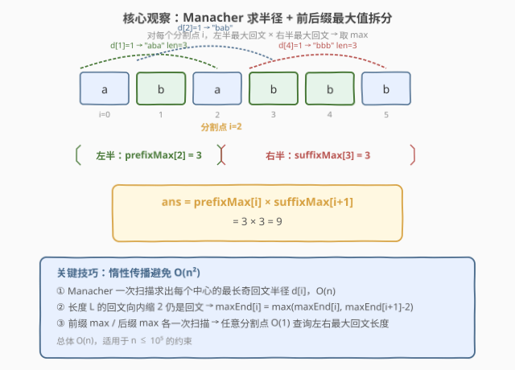
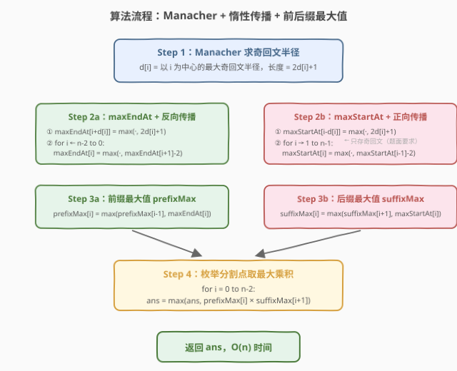

# 两个回文子字符串长度的最大乘积

- **题目名称**：两个回文子字符串长度的最大乘积
- **链接**：[1960. 两个回文子字符串长度的最大乘积](https://leetcode.cn/problems/maximum-product-of-the-length-of-two-palindromic-substrings/)
- **难度**：困难
- **标签**：字符串、Manacher、动态规划

## 1. 题目概述

给定下标从 0 开始的字符串 `s`，找到两个**不重叠**的回文子字符串，它们的长度都必须为**奇数**，使得它们长度的**乘积最大**。

形式化地：选择四个整数 $i, j, k, l$，使得 $0 \le i \le j < k \le l < \text{s.length}$，且 $s[i \ldots j]$ 和 $s[k \ldots l]$ 都是**奇数长度**回文串。返回两个回文子串长度的最大乘积。

**示例 1**：

```text
输入：s = "ababbb"
输出：9
解释：子字符串 "aba" 和 "bbb" 为奇数长度的回文串，乘积为 3 * 3 = 9。
```

**示例 2**：

```text
输入：s = "zaaaxbbby"
输出：9
解释：子字符串 "aaa" 和 "bbb" 为奇数长度的回文串，乘积为 3 * 3 = 9。
```

**约束条件**：

- $2 \le \text{s.length} \le 10^5$
- `s` 只包含小写英文字母

> 💡 **审题关键**：① 两个回文子串必须**不重叠**（前者右端点 $<$ 后者左端点）；② 长度必须是**奇数**——这意味着所有回文都以**单个字符位置**为中心，可以跳过偶数长度回文；③ $n$ 可达 $10^5$，乘积可达 $10^{10}$（需 `long long`），且必须 $O(n)$ 求解。

---

## 2. 解题思路

### 2.1 暴力思路：枚举两个回文

最直白的做法：用 $O(n^2)$ 中心扩展法预处理所有奇数回文，再双重循环枚举分割点 $i$（左回文在 $[0, i]$、右回文在 $[i+1, n-1]$），对每个分割点找左半最大奇回文和右半最大奇回文。

问题：对每个分割点重新扫描求最大值，总体 $O(n^2)$，$n = 10^5$ 时超时。

> ⚠️ 暴力的瓶颈在于「**对每个分割点重复求最大值**」。突破口是**预处理**：如果能 $O(1)$ 查询「任意前缀区间的最大奇回文长度」和「任意后缀区间的最大奇回文长度」，枚举 $n-1$ 个分割点就是 $O(n)$。

### 2.2 核心观察：Manacher + 惰性传播 + 前后缀最大值



整体三步走：

**第一步：Manacher 求奇回文半径**。用 Manacher 算法 $O(n)$ 求出每个位置 $i$ 为中心的最大奇回文半径 $d[i]$（回文长度 $= 2d[i]+1$，覆盖区间 $[i-d[i],\ i+d[i]]$）。

**第二步：惰性传播求「每个位置的最大回文长度」**。对每个中心 $i$，其最长回文右端点为 $i + d[i]$、左端点为 $i - d[i]$。直接记录端点处的最大长度，再利用**回文的缩放性质**传播：

> 💡 **关键性质**：若长度为 $L$ 的回文以位置 $c$ 为中心、右端点为 $e$，则长度为 $L - 2$ 的回文（同一中心、半径减 1）右端点为 $e - 1$。因此 `maxEndAt[e-1] ≥ maxEndAt[e] - 2`。

- **`maxEndAt[i]`**：右端点恰好落在位置 $i$ 的最大奇回文长度。先按每个中心写入 `maxEndAt[i+d[i]] = max(·, 2d[i]+1)`，再从右向左传播 `maxEndAt[i] = max(·, maxEndAt[i+1] - 2)`。
- **`maxStartAt[i]`**：左端点恰好落在位置 $i$ 的最大奇回文长度。先按每个中心写入 `maxStartAt[i-d[i]] = max(·, 2d[i]+1)`，再从左向右传播 `maxStartAt[i] = max(·, maxStartAt[i-1] - 2)`。

**第三步：前缀/后缀最大值 + 枚举分割点**。

- `prefixMax[i] = max(prefixMax[i-1], maxEndAt[i])`：前缀 $[0, i]$ 内的最大奇回文长度。
- `suffixMax[i] = max(suffixMax[i+1], maxStartAt[i])`：后缀 $[i, n-1]$ 内的最大奇回文长度。
- 答案 $= \max_{i=0}^{n-2}\ \text{prefixMax}[i] \times \text{suffixMax}[i+1]$。

### 2.3 算法流程图



四步流水线：

1. **Manacher**：一次扫描求 $d[i]$，利用对称性跳过已覆盖区域，$O(n)$。
2. **maxEndAt + 反向传播**：按右端点分桶 → 从右向左 `max(·, next - 2)` 填充。
3. **maxStartAt + 正向传播**：按左端点分桶 → 从左向右 `max(·, prev - 2)` 填充。
4. **前缀 max / 后缀 max**：各一次扫描 → 枚举 $n-1$ 个分割点取最大乘积。

> ⚠️ **为什么传播用 `-2` 而非 `-1`？** 奇回文长度序列是 $1, 3, 5, 7, \ldots$（公差 2）。长度 $L$ 的回文向内缩一层（半径减 1），长度变为 $L - 2$，端点平移 1 位。因此相邻位置的候选长度差 2，传播减 2 精确对应「缩一层」。

### 2.4 示例演算

以 `s = "ababbb"` 为例：


**Manacher 半径** $d[i]$：

| idx | 0 (a) | 1 (b) | 2 (a) | 3 (b) | 4 (b) | 5 (b) |
|-----|-------|-------|-------|-------|-------|-------|
| $d[i]$ | 0 | 1 | 1 | 0 | 1 | 0 |
| 回文 | "a" | "aba" | "bab" | "b" | "bbb" | "b" |

**maxEndAt**（先按右端点分桶，再反向传播 `-2`）：

初始分桶：`maxEndAt[2]=3`（"aba"右端在2）、`maxEndAt[3]=3`（"bab"右端在3）、`maxEndAt[5]=3`（"bbb"右端在5），其余为 1。

反向传播后：`[1, 1, 3, 3, 1, 3]`（如 `maxEndAt[2] = max(3, maxEndAt[3]-2=1) = 3`）。

**prefixMax**（前缀 max）：`[1, 1, 3, 3, 3, 3]`

**maxStartAt**（先按左端点分桶，再正向传播 `-2`）：

初始分桶：`maxStartAt[0]=3`（"aba"左端在0）、`maxStartAt[1]=3`（"bab"左端在1）、`maxStartAt[3]=3`（"bbb"左端在3），其余为 1。

正向传播后：`[3, 3, 1, 3, 1, 1]`

**suffixMax**（后缀 max）：`[3, 3, 3, 3, 1, 1]`

**枚举分割点**（`prefixMax[i] × suffixMax[i+1]`）：

| 分割点 $i$ | prefixMax[i] | suffixMax[i+1] | 乘积 |
|------------|-------------|----------------|------|
| 0 | 1 | 3 | 3 |
| 1 | 1 | 3 | 3 |
| **2** | **3** | **3** | **9** ★ |
| 3 | 3 | 1 | 3 |
| 4 | 3 | 1 | 3 |

最大乘积 $= 9$，对应 "aba"（$[0,2]$，长度 3）× "bbb"（$[3,5]$，长度 3）。

> 💡 **分割点 $i=2$ 最优**：左半恰好能容纳最长奇回文 "aba"（长度 3），右半恰好能容纳最长奇回文 "bbb"（长度 3），两者不重叠且乘积最大。

---

## 3. 参考代码

### C++

```cpp
class Solution {
public:
    long long maxProduct(string s) {
        int n = s.size();

        // Step 1: Manacher 求奇回文半径 d[i]
        vector<int> d(n, 0);
        int c = 0, r = -1; // 当前最右回文的中心与右边界
        for (int i = 0; i < n; ++i) {
            if (i <= r) {
                int mirror = 2 * c - i;
                d[i] = min(d[mirror], r - i);
            }
            while (i - d[i] - 1 >= 0 && i + d[i] + 1 < n &&
                   s[i - d[i] - 1] == s[i + d[i] + 1]) {
                ++d[i];
            }
            if (i + d[i] > r) {
                c = i;
                r = i + d[i];
            }
        }

        // Step 2a: maxEndAt[i] = 右端点恰好为 i 的最大奇回文长度
        vector<int> maxEndAt(n, 1);
        for (int i = 0; i < n; ++i)
            maxEndAt[i + d[i]] = max(maxEndAt[i + d[i]], 2 * d[i] + 1);
        for (int i = n - 2; i >= 0; --i)
            maxEndAt[i] = max(maxEndAt[i], maxEndAt[i + 1] - 2);

        // Step 2b: maxStartAt[i] = 左端点恰好为 i 的最大奇回文长度
        vector<int> maxStartAt(n, 1);
        for (int i = 0; i < n; ++i)
            maxStartAt[i - d[i]] = max(maxStartAt[i - d[i]], 2 * d[i] + 1);
        for (int i = 1; i < n; ++i)
            maxStartAt[i] = max(maxStartAt[i], maxStartAt[i - 1] - 2);

        // Step 3: 前缀最大值 / 后缀最大值
        vector<int> prefixMax(n);
        prefixMax[0] = maxEndAt[0];
        for (int i = 1; i < n; ++i)
            prefixMax[i] = max(prefixMax[i - 1], maxEndAt[i]);

        vector<int> suffixMax(n);
        suffixMax[n - 1] = maxStartAt[n - 1];
        for (int i = n - 2; i >= 0; --i)
            suffixMax[i] = max(suffixMax[i + 1], maxStartAt[i]);

        // Step 4: 枚举分割点
        long long ans = 0;
        for (int i = 0; i < n - 1; ++i)
            ans = max(ans, (long long)prefixMax[i] * suffixMax[i + 1]);
        return ans;
    }
};
```

### Python

```python
class Solution:
    def maxProduct(self, s: str) -> int:
        n = len(s)

        # Step 1: Manacher 求奇回文半径 d[i]
        d = [0] * n
        c, r = 0, -1  # 当前最右回文的中心与右边界
        for i in range(n):
            if i <= r:
                mirror = 2 * c - i
                d[i] = min(d[mirror], r - i)
            while (i - d[i] - 1 >= 0 and i + d[i] + 1 < n
                   and s[i - d[i] - 1] == s[i + d[i] + 1]):
                d[i] += 1
            if i + d[i] > r:
                c, r = i, i + d[i]

        # Step 2a: maxEndAt[i] = 右端点恰好为 i 的最大奇回文长度
        maxEndAt = [1] * n
        for i in range(n):
            maxEndAt[i + d[i]] = max(maxEndAt[i + d[i]], 2 * d[i] + 1)
        for i in range(n - 2, -1, -1):
            maxEndAt[i] = max(maxEndAt[i], maxEndAt[i + 1] - 2)

        # Step 2b: maxStartAt[i] = 左端点恰好为 i 的最大奇回文长度
        maxStartAt = [1] * n
        for i in range(n):
            maxStartAt[i - d[i]] = max(maxStartAt[i - d[i]], 2 * d[i] + 1)
        for i in range(1, n):
            maxStartAt[i] = max(maxStartAt[i], maxStartAt[i - 1] - 2)

        # Step 3: 前缀最大值 / 后缀最大值
        prefixMax = [0] * n
        prefixMax[0] = maxEndAt[0]
        for i in range(1, n):
            prefixMax[i] = max(prefixMax[i - 1], maxEndAt[i])

        suffixMax = [0] * n
        suffixMax[n - 1] = maxStartAt[n - 1]
        for i in range(n - 2, -1, -1):
            suffixMax[i] = max(suffixMax[i + 1], maxStartAt[i])

        # Step 4: 枚举分割点
        ans = 0
        for i in range(n - 1):
            ans = max(ans, prefixMax[i] * suffixMax[i + 1])
        return ans
```

> 💡 **写法对照**：① Manacher 的 `c, r` 维护逻辑两种语言完全对称——`i <= r` 时利用镜像 `mirror = 2c - i` 取初始半径，否则从 0 开始扩展；② 惰性传播只需两次线性扫描，C++ 用 `max(a, b)`、Python 用 `max(a, b)`，结构一致；③ 答案用 `long long`（C++）/ Python 原生大整数，避免 $10^{10}$ 溢出。

---

## 4. 复杂度分析

| 维度 | 复杂度 | 说明 |
|------|--------|------|
| 时间复杂度 | $O(n)$ | Manacher $O(n)$（利用对称性跳过已覆盖区域）；惰性传播两次 $O(n)$；前缀/后缀 max 两次 $O(n)$；枚举分割点 $O(n)$ |
| 空间复杂度 | $O(n)$ | `d`、`maxEndAt`、`maxStartAt`、`prefixMax`、`suffixMax` 各 $n$，共 $5n$ 辅助空间 |

> 💡 **为什么 Manacher 是 $O(n)$？** 关键在于维护「当前最右回文」的右边界 $r$。当 $i \le r$ 时，利用对称点 $i' = 2c - i$ 的已知半径跳过已比较区域，只需从 $r$ 之后继续扩展。每次扩展都会推进 $r$，而 $r$ 最多从 $0$ 走到 $n-1$，因此总扩展次数 $O(n)$。

---

## 5. 扩展：Manacher 与回文问题的通用武器

### 5.1 Manacher 算法回顾

Manacher 是回文问题的**竞赛级 $O(n)$ 解法**，核心思想是维护当前最右回文 $(c, r)$，利用回文对称性复用已计算结果：

- 当新中心 $i$ 在最右回文内（$i \le r$），其半径至少等于镜像点 $i' = 2c - i$ 的半径（被 $r$ 截断则取 $r - i$）。
- 从该初始值开始扩展，避免重复比较。
- 扩展成功后更新 $(c, r)$。

> ⚠️ 本题只需**奇数长度回文**，因此直接在原字符串上运行 Manacher（中心是字符位置）。若需同时处理偶数长度回文，需插入分隔符 `#` 转换为统一形式（见 [5. 最长回文子串](../0001-0100/5_最长回文子串.md) 的扩展章节）。

### 5.2 惰性传播的通用性

「按端点分桶 + 相邻传播」的技巧不限于回文，凡是有「**大区间包含小区间、且长度按固定步长递减**」性质的问题都适用：

- **回文**：长度 $L$ 缩一层 → $L - 2$，端点平移 1（本题）。
- **单调栈窗口**（[1950. 所有子数组最小值中的最大值](../1901-2000/1950_所有子数组最小值中的最大值.md)）：窗口大小 $w$ 的答案对更小窗口同样成立 → 反向传播取 max。

---

## 6. 面试要点

**Q1：为什么只考虑奇数长度回文，不需要插入 `#`？**

> 题面明确要求两个回文子串长度均为奇数。奇回文的中心是单个字符位置，直接在原字符串上跑 Manacher 即可。偶回文的中心在字符间隙，需要插入 `#` 统一处理，但本题不需要。

**Q2：惰性传播为什么用 `-2`？**

> 奇回文长度序列为 $1, 3, 5, 7, \ldots$（公差 2）。长度 $L$ 的回文以中心 $c$ 为轴缩一层（半径减 1），长度变为 $L - 2$，右端点从 $c + r$ 变为 $c + r - 1$（左移 1）。因此相邻位置的最大候选长度差 2，传播公式 `maxEndAt[i] = max(·, maxEndAt[i+1] - 2)` 精确对应「同一中心缩一层」。

**Q3：`maxEndAt` 初始值为什么是 1？**

> 每个位置至少有一个长度为 1 的奇回文（单字符本身）。初始全 1 保证传播时 `maxEndAt[i+1] - 2` 即使为负也不影响（`max(1, -1) = 1`）。

**Q4：为什么不能直接用 Manacher 的 $d[i]$ 取最大值，还要传播？**

> $d[i]$ 只记录以 $i$ 为中心的**最长**回文。但分割点可能落在某个长回文中间——此时该回文不能用（会越过分割线），但以 $i$ 为中心的**更短**回文可能仍在左半内。传播正是把这些更短的回文也计入候选。例如 "aba" 的 $d[1]=1$（长度 3），但分割点在位置 1 时只能用长度 1 的 "b"。

**Q5：如果题目改为允许偶数长度回文，怎么调整？**

> 在原字符串中插入 `#` 分隔符（如 "abba" → "#a#b#b#a#"），对所有中心跑 Manacher。此时每个中心的回文长度在原串中可能为奇或偶。传播逻辑不变，只需在提取原串长度时区分奇偶中心（偶数中心对应原串偶数回文）。

> 💡 **一句话总结**：Manacher $O(n)$ 求所有奇回文半径 → 按端点分桶 + 惰性传播（`-2`）求每个位置的最大回文长度 → 前缀/后缀 max 实现 $O(1)$ 分割点查询 → 枚举 $n-1$ 个分割点取最大乘积。整体 $O(n)$，核心技巧是「回文缩一层长度减 2」的传播性质。

---

## 7. 同类练习题

- [5. 最长回文子串](https://leetcode.cn/problems/longest-palindromic-substring/)（[题解](../0001-0100/5_最长回文子串.md)）：中心扩展法 / Manacher 的招牌题，理解 Manacher 的基础
- [647. 回文子串](https://leetcode.cn/problems/palindromic-substrings/)：Manacher / 中心扩展计数所有回文，对照「求最长」与「求数量」
- [1930. 长度为 3 的不同回文子序列](https://leetcode.cn/problems/unique-length-3-palindromic-subsequences/)（[题解](../1901-2000/1930_长度为3的不同回文子序列.md)）：回文子序列计数，固定长度 3 的特殊性简化为枚举首尾字符
- [2472. 最大非重叠回文子字符串的数目](https://leetcode.cn/problems/maximum-number-of-non-overlapping-palindrome-substrings/)：同样涉及不重叠回文子串，但目标是最大化数量而非长度乘积，需结合 Manacher + 贪心区间调度
- [1950. 所有子数组最小值中的最大值](https://leetcode.cn/problems/maximum-of-minimum-for-each-window/)（[题解](../1901-2000/1950_所有子数组最小值中的最大值.md)）：同样使用「按桶记录 + 反向传播」的惰性传播技巧，对照体会传播思想的通用性
