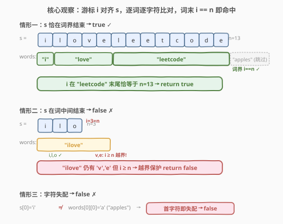
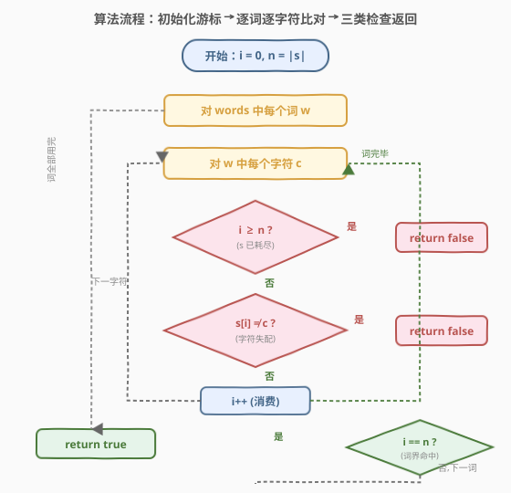
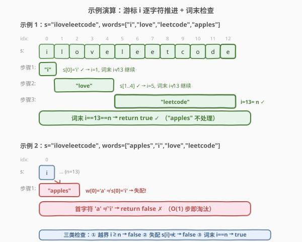

# LeetCode 检查字符串是否为数组前缀 题解

## 1. 题目概述

- **标题 / 题号**：检查字符串是否为数组前缀（#1961，easy）
- **链接**：https://leetcode.cn/problems/check-if-string-is-a-prefix-of-array/
- **难度**：简单
- **标签**：字符串、数组、模拟

**题意**：给你一个字符串 $s$ 和一个字符串数组 $words$，请你判断 $s$ 是否为 $words$ 的**前缀字符串**。

字符串 $s$ 要成为 $words$ 的前缀字符串，需要满足：$s$ 可以由 $words$ 中的前 $k$（$k$ 为**正数**）个字符串按顺序相连得到，且 $k$ 不超过 $words.length$。

如果 $s$ 是 $words$ 的前缀字符串，返回 `true`；否则返回 `false`。

**示例 1**：

```text
输入：s = "iloveleetcode", words = ["i","love","leetcode","apples"]
输出：true
解释：s 可以由 "i"、"love" 和 "leetcode" 相连得到。
```

**示例 2**：

```text
输入：s = "iloveleetcode", words = ["apples","i","love","leetcode"]
输出：false
解释：数组的前缀相连无法得到 s。
```

**约束**：

- $1 \le words.length \le 100$
- $1 \le words[i].length \le 20$
- $1 \le s.length \le 1000$
- $words[i]$ 和 $s$ 仅由小写英文字母组成

> 💡 **审题关键**：① 「前 $k$ 个**按顺序相连**」——必须从 $words[0]$ 开始连续拼接，不能跳过、不能重排；② $k$ 为正数且不超过数组长度，意味着至少拼一个词、至多拼全部；③ 关键约束是**词界对齐**：$s$ 必须恰好在某个 $words[k-1]$ 的末尾结束，不能停在词中间——「$s$ 是前 $k$ 个词的拼接」而非「$s$ 是拼接结果的前缀」。

## 2. 解题思路

### 2.1 暴力思路：逐词拼接 + 比较整串

最直觉的做法：维护一个空串 `prefix`，依次把 $words[0], words[1], \dots$ 拼上去，每拼一个就比较 `prefix == s`。

```text
prefix = "" → 拼 "i"        → "i"             ≠ "iloveleetcode"
         → 拼 "love"      → "ilove"         ≠ "iloveleetcode"
         → 拼 "leetcode" → "iloveleetcode" == "iloveleetcode" → true
```

- **正确性**：穷举所有前缀拼接，命中即返回 `true`，拼完仍不等则 `false`。
- **效率**：每拼一个词需复制整个 `prefix`（字符串不可变），最坏拼接总长度 $O(L)$（$L = \sum |words[i]|$），每次比较又需 $O(|s|)$，整体 $O(L \cdot |s|)$。能 AC，但**做了大量重复的字符串拷贝与整串比较**——其实只需逐字符比对，无需真正构造完整拼接串。

> ⚠️ 暴力法的浪费在于「用整串比较代替逐字符比对」。题目只需回答「$s$ 是否等于前 $k$ 个词的拼接」，而拼接过程中每个字符只需与 $s$ 对应位置比较一次。用一个游标 `i` 指向 $s$ 当前待匹配位置，即可避免字符串构造。

### 2.2 核心观察：游标对齐 + 词界判定（逐字符比对，零字符串构造）



关键洞察分三点：

**第一点：游标对齐，逐字符消费 $s$。** 维护游标 $i$ 指向 $s$ 中下一个待匹配字符。对 $words$ 中每个词 $w$，将 $w$ 的每个字符与 $s[i]$ 逐一比对：相等则 $i\!+\!+$，不等则立即 `return false`（某词与 $s$ 对应段不匹配，前缀拼接不可能成功）。

**第二点：越界保护。** 比对 $w$ 的字符时若 $i \ge |s|$（$s$ 已被消费完但当前词还有字符），说明前 $k$ 个词的拼接比 $s$ 长——$s$ 不是恰好的前缀拼接，`return false`。这保证不会越界访问 $s[i]$。

**第三点：词界判定。** 每处理完一个完整词 $w$ 后检查 $i$：若 $i == |s|$，说明 $s$ 恰好在当前词末尾用尽——$s$ 等于前 $k$ 个词的拼接，`return true`；若 $i < |s|$，说明 $s$ 尚未消费完，继续处理下一个词。全部词处理完毕后 $i < |s|$，则 $s$ 比所有词拼接还长，`return false`。

$$\boxed{\text{对每个 } w \in words:\ \text{逐字符比对 } s[i]\text{，词末检查 } i \stackrel{?}{=} |s|}$$

> 💡 **为什么「词末检查 $i == |s|$」是必须的？** 因为 $s$ 必须在某个词的**末尾**恰好结束。若 $s$ 在词中间结束（如 $s = \text{"ilo"}$, $words = [\text{"ilo"}\textbf{ve}]$），逐字符比对虽不报错，但词尚未处理完 $s$ 就耗尽——这种情况下 $s$ 不是「前 $k$ 个词的完整拼接」，而只是拼接结果的前缀，应返回 `false`。越界保护正是在比对 $w$ 的下一个字符时发现 $i \ge |s|$ 从而淘汰此情形。

> ⚠️ **易错点：忽略「词界对齐」。** 若只做逐字符比对而不在词末检查 $i == |s|$，会把「$s$ 是拼接结果的前缀」误判为 true。例如 $s = \text{"ilove"}$, $words = [\text{"i"}, \text{"love"}, \text{"leetcode"}]$：逐字符比对 "i" 和 "love" 全部通过，但若不在词末检查，可能漏判「$s$ 恰好等于前 2 词」→ 应为 `true`；而若 $s = \text{"ilo"}$, $words = [\text{"ilove"}]$：逐字符比对 "i"、"l"、"o" 通过，但 $w$ 还有 "v"、"e"，$i = 3 = |s|$ 时越界保护触发 `return false`——正确。

### 2.3 算法流程图



整体为「游标推进 + 三类检查」的线性流程：

1. **初始化**：$i = 0$（指向 $s$ 待匹配位置），$n = |s|$。
2. **逐词处理**：对 $words$ 中每个词 $w$：
   - **逐字符比对**：对 $w$ 中每个字符 $c$：
     - 若 $i \ge n$：$s$ 已耗尽但 $w$ 仍有字符 → 拼接比 $s$ 长 → `return false`。
     - 若 $s[i] \ne c$：字符失配 → `return false`。
     - $i\!+\!+$（消费一个字符）。
   - **词末检查**：若 $i == n$：$s$ 恰在当前词末用尽 → `return true`。
3. **全部词处理完**：$i < n$ → $s$ 比所有词拼接还长 → `return false`。

> 💡 **提前返回**：三类检查（越界、失配、词末命中）任一触发即立即返回，无需处理剩余词。最坏情况（末词才命中或始终差一点）才遍历完所有词，但总字符比对数 $\le \min(L, n)$，其中 $L = \sum |words[i]|$。

### 2.4 示例演算

以两个官方示例演示游标推进过程：



**示例 1**（`s = "iloveleetcode"`, `words = ["i","love","leetcode","apples"]`）：

| 步骤 | 当前词 $w$ | 比对过程 | 词末 $i$ | $i == 13$? | 结果 |
|------|------------|----------|----------|------------|------|
| 1 | "i" | s[0]='i'==w[0] ✓ | 1 | ✗ | 继续 |
| 2 | "love" | s[1..4]="love" ✓ | 5 | ✗ | 继续 |
| 3 | "leetcode" | s[5..12]="leetcode" ✓ | 13 | ✓ | `true` |

游标 $i$ 在第 3 个词 "leetcode" 末尾恰好等于 $|s|=13$ → 返回 `true` ✓（剩余词 "apples" 不处理）

**示例 2**（`s = "iloveleetcode"`, `words = ["apples","i","love","leetcode"]`）：

| 步骤 | 当前词 $w$ | 比对过程 | 触发检查 | 结果 |
|------|------------|----------|----------|------|
| 1 | "apples" | s[0]='i' ≠ w[0]='a' | 失配 | `false` |

第 1 个词 "apples" 的首字符 'a' 与 $s[0]$='i' 不匹配 → 立即返回 `false` ✓（后续词不处理）

> 💡 **观察要点**：① 示例 1 中游标 $i$ 严格单调递增，每消费一个字符即推进，无需回退；② 示例 2 在首词首字符即失配，体现「逐字符比对 + 提前返回」的优势——O(1) 步即淘汰；③ 词末检查 $i == n$ 是区分「$s$ 是拼接结果」与「$s$ 是拼接结果的前缀」的关键。

## 3. 参考代码

### C++（游标推进 + 逐字符比对）

```cpp
class Solution {
public:
    bool isPrefixString(string s, vector<string>& words) {
        int i = 0, n = s.size();
        for (const string& w : words) {
            for (char c : w) {
                if (i >= n || s[i] != c) return false;
                ++i;
            }
            if (i == n) return true;
        }
        return false;
    }
};
```

### Python（游标推进 + 逐字符比对）

```python
class Solution:
    def isPrefixString(self, s: str, words: List[str]) -> bool:
        i, n = 0, len(s)
        for w in words:
            for c in w:
                if i >= n or s[i] != c:
                    return False
                i += 1
            if i == n:
                return True
        return False
```

### Python（`str.startswith` + 拼接一行流）

```python
class Solution:
    def isPrefixString(self, s: str, words: List[str]) -> bool:
        prefix = ""
        for w in words:
            prefix += w
            if prefix == s:
                return True
            if len(prefix) >= len(s):
                return False
        return False
```

> 💡 **写法对照**：① 游标推进版直接翻译思路，显式体现「逐字符比对 + 越界保护 + 词末检查」三要素，$O(1)$ 额外空间，面试默认先写这版；② 拼接版用 `prefix += w` 累积字符串，每步整串比较 `==`，代码更直观但每次拼接都拷贝整个串，$O(L)$ 额外空间且常数更大；③ 两版时间同为 $O(\min(L, n))$，$n \le 1000$ 时无显著差异，但游标版体现了「避免不必要的字符串构造」这一工程思维。

> ⚠️ **拼接版的 `len(prefix) >= len(s)` 提前终止**：一旦拼接长度达到或超过 $|s|$ 却仍不等，即可返回 `false`（继续拼只会更长）。这等价于游标版的越界保护。若省略此判断，拼接版仍正确但会多拼无用词——例如 $s = \text{"a"}$, $words = [\text{"bb"}, \text{"c"}]$，不加判断会把 "bb"+"c" 全拼完才比较，加了则在拼完 "bb"（长度 $2 \ge 1$）即返回。

## 4. 复杂度分析

| 维度 | 拼接比较法 | 游标推进法 | 说明 |
|------|-----------|-----------|------|
| 时间复杂度 | $O(\min(L, n))$ | $O(\min(L, n))$ | 均逐字符处理，$L = \sum\|words[i]\|$，$n = \|s\|$；游标版在失配/越界时提前终止，拼接版在长度达标时提前终止 |
| 空间复杂度 | $O(L)$ | $O(1)$ | 拼接版需构造 `prefix` 字符串；游标版仅游标 $i$ 与长度 $n$ 两个变量 |

> 💡 本题 $n \le 1000$、$L \le 100 \times 20 = 2000$，两种解法均瞬时返回。游标版的优势在于零额外空间且常数更小，是「用游标代替字符串构造」的典型范例——与 [28. 找出字符串中第一个匹配项的下标](https://leetcode.cn/problems/find-the-index-of-the-first-occurrence-in-a-string/) 中「用指针比对代替 substr 切片」的优化同源。

## 5. 扩展：$k$ 的唯一性与前缀 vs 子串

### 5.1 为什么 $k$ 是唯一的？

若 $s$ 是 $words$ 的前缀字符串，则满足条件的 $k$ 至多一个。因为 $words$ 中每个词长度 $\ge 1$（约束 $1 \le |words[i]|$），拼接长度随 $k$ 严格递增——不可能有两个不同的 $k$ 使拼接长度都等于 $|s|$。这意味着一旦命中 $i == n$ 即可确定性地 `return true`，无需担心多解或遗漏。

> 💡 若放宽约束允许 $|words[i]| = 0$（空词），则 $k$ 可能不唯一（空词不改变拼接长度）。但本题保证每词非空，$k$ 唯一，逻辑更简洁。

### 5.2 「前缀字符串」vs「子串匹配」

本题的「前缀字符串」要求 $s$ **从 $words[0]$ 开始**连续拼接得到，是**前缀匹配**——$s$ 必须对齐拼接结果的起点。这与子串匹配（如 KMP / Rabin-Karp 在 $words$ 拼接结果中搜索 $s$ 可出现的位置）不同：

- **前缀匹配**（本题）：$s$ 必须从第 0 个词开头开始，方向单一，$O(\min(L, n))$ 一趟扫描即可。
- **子串匹配**（[28. 找出字符串中第一个匹配项的下标](https://leetcode.cn/problems/find-the-index-of-the-first-occurrence-in-a-string/)）：$s$ 可出现在拼接结果的任意位置，需 KMP 的 $\pi$ 数组或 Rabin-Karp 的滚动哈希处理失配回退，$O(L + n)$。

> ⚠️ 不要把本题当成 KMP 来做——前缀匹配无需失配回退，因为 $s$ 必须从头对齐，任何失配即整体失败。KMP 的回退机制是为「$s$ 可在任意位置出现」设计的，本题用不上。

## 6. 面试要点

**Q1：为什么需要「词末检查 $i == n$」？只用逐字符比对不行吗？**

> 逐字符比对只能保证「$s$ 的前 $i$ 个字符与拼接结果的前 $i$ 个字符一致」，但不能保证 $s$ 恰好在某个词的末尾结束。例如 $s = \text{"ilo"}$, $words = [\text{"ilove"}]$：逐字符比对 "i"、"l"、"o" 全通过，但 "ilove" 还有 "v"、"e"，$s$ 只是拼接结果的前缀而非完整拼接。词末检查 $i == n$ 配合越界保护（$i \ge n$ 时比对下一个字符即返回 `false`）共同保证「$s$ 恰在词界结束」。

**Q2：越界保护 `i >= n` 放在内层字符循环里，为什么不能放到词循环里？**

> 越界保护的目的是「$s$ 耗尽但当前词仍有字符」时立即返回 `false`。若放到词循环开头（处理整词前检查 $i \ge n$），则无法发现「词中间越界」——例如 $s = \text{"i"}$, $words = [\text{"ilove"}]$：进入词 "ilove" 时 $i = 0 < n = 1$ 不触发，比对 'i' ✓ 后 $i = 1$，接着比对 'l' 时 $i = 1 \ge n = 1$ 触发越界 → `false`。放内层才能在每个字符处及时检测。

**Q3：游标推进法和拼接比较法各有什么取舍？**

> 游标推进法 $O(1)$ 空间、常数更小，逐字符比对无需构造完整拼接串，体现「用游标代替字符串构造」的工程思维；拼接比较法 $O(L)$ 空间，代码更直观但每次 `+=` 都拷贝整串。$n \le 1000$ 时两者无显著差异，但面试期望游标版——它展示了对字符串不可变性代价的认知和对提前返回的运用。

**Q4：如果 $words$ 允许空字符串，算法需要修改吗？**

> 需要调整「$k$ 唯一」的隐含假设。空词不改变拼接长度，可能导致多个 $k$ 满足条件——但这不影响正确性，因为算法在首次 $i == n$ 时即返回 `true`，找到的是最小 $k$。不过越界保护需注意：空词的字符循环不执行，直接落到词末检查 $i == n$，逻辑仍成立。本题约束 $|words[i]| \ge 1$，无需处理此边界。

**Q5：为什么本题不能用 KMP？**

> KMP 解决的是「$s$ 在文本 $T$ 中任意位置出现的第一个匹配」，核心是失配时利用 $\pi$ 数组回退到最长真前缀继续匹配。而本题要求 $s$ 从 $words[0]$ 开头对齐——是前缀匹配，任何失配即整体失败，无需回退。用 KMP 是杀鸡用牛刀，且 $\pi$ 数组的回退逻辑在「必须从头对齐」的场景下毫无用武之地。

> 💡 **一句话总结**：游标 $i$ 逐字符消费 $s$，对每个词逐字符比对（越界/失配即返回 `false`），词末检查 $i == |s|$ 命中即 `true`——$O(\min(L, n))$ 时间、$O(1)$ 空间，零字符串构造。

## 同类练习题

| # | 题目 | 与本题的关联 |
|---|------|-------------|
| 28 | [找出字符串中第一个匹配项的下标](https://leetcode.cn/problems/find-the-index-of-the-first-occurrence-in-a-string/)（[题解](../0001-0100/28_找出字符串中第一个匹配项的下标.md)） | 从「前缀匹配」升级为「子串匹配」，$s$ 可出现在任意位置，需 KMP 的 $\pi$ 数组或 Rabin-Karp 滚动哈希处理失配回退，对照体会前缀匹配为何无需回退 |
| 14 | [最长公共前缀](https://leetcode.cn/problems/longest-common-prefix/)（[题解](../0001-0100/14_最长公共前缀.md)） | 同属前缀家族，从「判定 $s$ 是否为拼接结果」转为「求多个字符串的最长公共前缀」，共享「逐字符比对 + 游标推进」骨架 |
| 1455 | [检查单词是否为句中其他单词的前缀](https://leetcode.cn/problems/check-if-a-word-occurs-as-a-prefix-of-any-word-in-a-sentence/)（[题解](../1401-1500/1455_检查单词是否为句中其他单词的前缀.md)） | 前缀判定的镜像变体——给定词 $w$ 判定它是否为句子中某词的前缀，方向从「串是数组的前缀拼接」翻转为「词是串中某词的前缀」，同套逐字符比对思路 |
| 1933 | [判断字符串是否可分解为值均等的子串](https://leetcode.cn/problems/check-if-string-is-decomposable-into-value-equal-substrings/)（[题解](../1901-2000/1933_判断字符串是否可分解为值均等的子串.md)） | 同区间邻居题，同属「字符串 = 连续段拼接」家族，从「判定 $s$ 是否为给定词序列的拼接」转为「将 $s$ 分解为等值子串并校验段长约束」，共享「游标推进 + 段界判定」骨架 |
