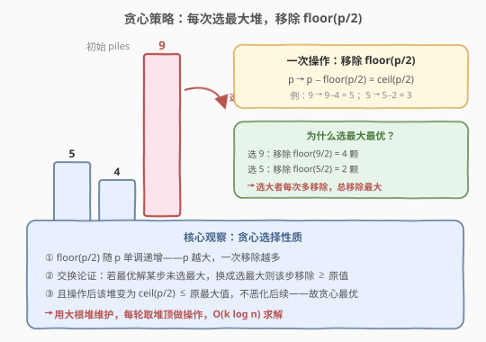

# 移除石子使总数最小

- **题目名称**：移除石子使总数最小
- **链接**：[1962. 移除石子使总数最小](https://leetcode.cn/problems/remove-stones-to-minimize-the-total/)
- **难度**：中等
- **标签**：贪心、堆、优先队列

## 1. 题目概述

给你一个整数数组 `piles`，其中 `piles[i]` 表示第 $i$ 堆石子的数量。另给你一个整数 $k$，执行下述操作**恰好** $k$ 次：

- 选出任一石子堆 `piles[i]`，从中**移除** $\lfloor \text{piles}[i] / 2 \rfloor$ 颗石子。

可以对**同一堆**石子多次执行此操作。返回执行 $k$ 次操作后，剩下石子的**最小**总数。

**示例 1**：

```text
输入：piles = [5, 4, 9], k = 2
输出：12
解释：
- 对第 2 堆执行操作， piles = [5, 4, 5]（移除 floor(9/2) = 4）
- 对第 0 堆执行操作， piles = [3, 4, 5]（移除 floor(5/2) = 2）
- 剩余总数 = 3 + 4 + 5 = 12
```

**示例 2**：

```text
输入：piles = [4, 3, 6, 7], k = 3
输出：12
解释：
- 对第 3 堆执行操作， piles = [4, 3, 6, 4]（移除 3）
- 对第 2 堆执行操作， piles = [4, 3, 3, 4]（移除 3）
- 对第 0 堆执行操作， piles = [2, 3, 3, 4]（移除 2）
- 剩余总数 = 2 + 3 + 3 + 4 = 12
```

**约束条件**：

- $1 \le \text{piles.length} \le 10^5$
- $1 \le \text{piles}[i] \le 10^4$
- $1 \le k \le 10^5$

> 💡 **审题关键**：① 每次操作移除 $\lfloor p/2 \rfloor$，等价于将该堆从 $p$ 变为 $p - \lfloor p/2 \rfloor = \lceil p/2 \rceil$；② 可对同一堆多次操作，故 $k$ 次操作需在 $n$ 堆间分配；③ 目标是**最小化剩余总数**，即**最大化总移除量**——每次应选移除量最大的堆；④ $\lfloor p/2 \rfloor$ 随 $p$ 单调递增，故「移除量最大」$\Leftrightarrow$ 「当前 $p$ 最大」。

---

## 2. 解题思路

### 2.1 暴力思路：枚举操作分配方案

最直觉的暴力：将 $k$ 次操作分配到 $n$ 堆石子上，每种分配方案对应一种操作序列。对每种方案模拟计算剩余总数，取最小值。

- **正确性**：穷举所有分配方案，必能找到最优解。
- **效率**：分配方案数为 $\binom{n+k-1}{k}$（可重复组合），$n, k \le 10^5$ 时方案数是天文数字，**完全不可行**。

> ⚠️ 暴力的核心痛点：**决策之间有依赖**——对某堆操作后该堆值变小，后续是否仍选它取决于其他堆的当前值。无法独立地「一次性分配」，必须**动态地**根据当前各堆大小做决策。

### 2.2 核心观察：贪心 + 大根堆（每轮选当前最大堆）



关键洞察分三点：

**第一点：操作效果等价转换。** 对堆 $p$ 执行一次操作，移除 $\lfloor p/2 \rfloor$，剩余 $p - \lfloor p/2 \rfloor = \lceil p/2 \rceil$。用整数运算表示即 $p \to p - p/2$（C++ 整数除法即 floor）。

**第二点：贪心选择——每轮选当前最大堆。** 由于 $\lfloor p/2 \rfloor$ 随 $p$ 单调递增，**当前 $p$ 最大的堆，一次操作移除的也最多**。要最大化总移除量（等价于最小化剩余总数），每轮贪心地选最大堆操作即可。

**第三点：贪心最优性（交换论证）。** 设最优解 $S$ 在某步选了堆 $j$，但此时堆 $i$ 的值 $p_i > p_j$。构造 $S'$：该步改选堆 $i$。

- 该步移除量：$S'$ 移除 $\lfloor p_i/2 \rfloor \ge \lfloor p_j/2 \rfloor$（$S$ 的移除量），不劣。
- 操作后：$S'$ 中堆 $i$ 变为 $\lceil p_i/2 \rceil \le p_i$，而 $S$ 中堆 $i$ 仍为 $p_i$。$S'$ 的最大元素 $\le S$ 的最大元素，**后续状态不恶化**。

由数学归纳法，$S'$ 全程不劣于 $S$，故贪心（每轮选最大）最优。

$$\boxed{\text{每轮选当前 } \arg\max\ p_i,\ \ p_i \leftarrow \lceil p_i / 2 \rceil,\ \ \text{重复 } k \text{ 次}}$$

> 💡 **为什么可以用大根堆？** 贪心策略只需「每轮取最大值 + 更新后放回」，这恰好是**大根堆（max-heap）**的招牌操作：堆顶即最大，弹出 → 修改 → 推回，$O(\log n)$ 维护。$k$ 轮总计 $O(k \log n)$。

> ⚠️ **易错点：以为需要「排序后从大到小依次操作」。** 排序只在初始时有序，但操作后某堆的值变小可能不再是最大——后续操作未必仍按原排序。必须用堆**动态维护**最大值，而非一次性排序。

### 2.3 算法流程图


整体为「建堆 + $k$ 轮循环 + 求和」三阶段：

1. **建堆**：将 `piles` 全部建为大根堆，$O(n)$。
2. **$k$ 轮循环**：每轮弹出堆顶 $t$（当前最大），更新 $t \leftarrow t - \lfloor t/2 \rfloor$，推回堆中，$k \leftarrow k - 1$。
3. **求和**：$k$ 轮结束后，将堆中所有元素累加，返回总和。

> 💡 **C++ 中 $p - \lfloor p/2 \rfloor$ 的写法**：整数除法 `p / 2` 即 floor（正数情况），故 `t -= t / 2` 直接等价于 $t \leftarrow t - \lfloor t/2 \rfloor = \lceil t/2 \rceil$。Python 中 `//` 同样为 floor 除法，写法一致。

### 2.4 示例演算

以**示例 1** `piles = [5, 4, 9], k = 2` 演算：

![示例演算：piles = [5,4,9], k = 2 的两轮贪心操作过程](../images/1962_example_walkthrough.svg)

| 步骤 | 选中堆 | 移除量 | 操作后 piles | 剩余总和 |
|------|--------|--------|-------------|---------|
| 初始 | — | — | [5, 4, 9] | 18 |
| 第 1 次 | 9 | $\lfloor 9/2 \rfloor = 4$ | [5, 4, 5] | 14 |
| 第 2 次 | 5 | $\lfloor 5/2 \rfloor = 2$ | [3, 4, 5] | 12 |

- **第 1 次**：堆顶 9，移除 4 → 9 变 5。此时 piles = [5, 4, 5]。
- **第 2 次**：堆顶 5（pile 0 或 pile 2 均可，取一），移除 2 → 5 变 3。piles = [3, 4, 5]。
- $k = 0$，停止。剩余 $3 + 4 + 5 = 12$ ✓

> 💡 **观察要点**：① 第 1 次操作后 9→5，与 pile 0 的 5 并列最大——说明操作后最大值可能变化，需堆动态维护；② 两轮共移除 $4 + 2 = 6$，$18 - 6 = 12$；③ 若第 2 次选 pile 2（也=5）结果相同，说明并列最大时任选其一皆最优。

---

## 3. 参考代码

### C++（大根堆 + 贪心）

```cpp
class Solution {
public:
    int minStoneSum(vector<int>& piles, int k) {
        priority_queue<int> pq(piles.begin(), piles.end());
        while (k--) {
            int t = pq.top(); pq.pop();
            t -= t / 2;
            pq.push(t);
        }
        int sum = 0;
        while (!pq.empty()) {
            sum += pq.top(); pq.pop();
        }
        return sum;
    }
};
```

### Python（取负数模拟大根堆）

```python
class Solution:
    def minStoneSum(self, piles: List[int], k: int) -> int:
        h = [-p for p in piles]
        heapq.heapify(h)
        for _ in range(k):
            t = -heapq.heappop(h)
            t -= t // 2
            heapq.heappush(h, -t)
        return -sum(h)
```

### Python（`heapreplace` 一步优化）

```python
class Solution:
    def minStoneSum(self, piles: List[int], k: int) -> int:
        h = [-p for p in piles]
        heapq.heapify(h)
        for _ in range(k):
            t = -h[0]
            heapq.heapreplace(h, -(t - t // 2))
        return -sum(h)
```

> 💡 **写法对照**：① 标准版显式 pop → 修改 → push，逻辑清晰，面试默认先写这版；② `heapreplace` 版用 `heapreplace(h, val)` 一步完成「弹出堆顶 + 推入新值」，比先 `heappop` 再 `heappush` 少一次堆调整，常数更优。Python 标准库 `heapq` 是小根堆，用**取负数**模拟大根堆是惯例写法。

> ⚠️ **溢出检查**：$n \le 10^5$、$\text{piles}[i] \le 10^4$，最大总和 $= 10^9$，恰在 `int` 范围内（$\le 2.1 \times 10^9$）。C++ 用 `int` 安全；Python 无溢出问题。若约束放宽到 $\text{piles}[i] \le 10^9$，则 C++ 需改 `long long`。

---

## 4. 复杂度分析

| 维度 | 贪心 + 大根堆 | 说明 |
|------|--------------|------|
| **时间复杂度** | $O((n + k) \log n)$ | 建堆 $O(n)$；$k$ 轮各一次 pop + push，各 $O(\log n)$；最终求和需清空堆 $O(n \log n)$，也可直接遍历原结构 $O(n)$ |
| **空间复杂度** | $O(n)$ | 堆存储 $n$ 个元素 |

> 💡 **优化求和**：C++ 中 `priority_queue` 不支持遍历，必须逐个 pop 求和（$O(n \log n)$）。若改用 `make_heap` + `pop_heap` 操作原生 `vector`，则最后直接 `accumulate` 即可 $O(n)$。本题 $n \le 10^5$，$O(n \log n)$ 也能轻松通过。

---

## 5. 扩展：贪心正确性的严格证明

### 5.1 交换论证（Exchange Argument）

**命题**：每轮选当前最大堆的贪心策略，总移除量 $\ge$ 任意其他策略。

**证明**：设贪心解为 $G$，任意解为 $S$。取两解**首次分歧的步骤** $t$：此前两解对各堆的操作完全相同，故各堆当前值相同。设此时刻最大堆为 $i$（值 $p_i$），$G$ 选 $i$，$S$ 选 $j$（值 $p_j \le p_i$）。

- **步骤 $t$ 移除量**：$G$ 移除 $\lfloor p_i / 2 \rfloor \ge \lfloor p_j / 2 \rfloor$（$S$ 的移除量）。
- **步骤 $t$ 后状态**：$G$ 中堆 $i = \lceil p_i / 2 \rceil$，堆 $j = p_j$；$S$ 中堆 $i = p_i$，堆 $j = \lceil p_j / 2 \rceil$。其余堆相同。

**关键引理**：$G$ 在步骤 $t$ 后的多元素集合 $\{\lceil p_i/2 \rceil, p_j, \ldots\}$ 的「最大值」$\le$ $S$ 的 $\{p_i, \lceil p_j/2 \rceil, \ldots\}$ 的最大值，因为：

$$\max(\lceil p_i/2 \rceil,\ p_j) \le p_i = \max(p_i,\ \lceil p_j/2 \rceil)$$

（左边 $\le p_i$ 因 $\lceil p_i/2 \rceil \le p_i$ 且 $p_j \le p_i$；右边 $= p_i$。）

由引理，$G$ 在步骤 $t$ 后的各堆值整体「不大于」$S$，后续每轮 $G$ 的可选最大值 $\le S$。**但** $G$ 的堆值更小意味着后续移除量可能更少？——并非如此。关键在于 $G$ 在步骤 $t$ 已多移除了 $\lfloor p_i/2 \rfloor - \lfloor p_j/2 \rfloor \ge 0$，且后续状态的最大值不增。

更严格地，可以用**势能函数** $\Phi = \sum_i p_i$（总石子数）来论证：每步贪心选最大使 $\Phi$ 下降最多，且引理保证贪心解的 $\Phi$ 始终 $\le$ 任意解的 $\Phi$，故最终 $\Phi_G \le \Phi_S$。

> 💡 **一句话**：贪心每步「贪得最多」且「不恶化后续状态」，故总体最优。这是**贪心选择性质 + 最优子结构**的经典体现。

### 5.2 与「最后一块石头的重量」对比

| 维度 | 1962 本题 | 1049 最后一块石头的重量 II |
|------|-----------|--------------------------|
| **操作** | 选一堆移除 $\lfloor p/2 \rfloor$ | 选两堆相撞，差值留下 |
| **目标** | 最小化剩余总数 | 最小化最后一块石头 |
| **贪心有效性** | ✓ 单堆操作，移除量单调 | ✗ 两堆交互，无法局部贪心 |
| **解法** | 大根堆贪心 | 0-1 背包 DP |

> ⚠️ 两题虽都涉及「石子」和「减少」，但 1049 的操作涉及**两堆交互**（相撞后差值取决于两堆大小关系），无法保证贪心最优，需 DP。本题操作**只作用于一堆**，移除量仅取决于该堆大小，单调性保证贪心有效。

---

## 6. 面试要点

**Q1：为什么每轮选最大堆是贪心最优的？**

> 因为 $\lfloor p/2 \rfloor$ 随 $p$ 单调递增——当前最大的堆，一次操作移除的也最多。通过交换论证：若最优解某步未选最大，换成选最大则该步移除量不减少，且操作后该堆值变为 $\lceil p/2 \rceil \le p$，后续状态不恶化。故贪心解总移除量 $\ge$ 任意解。

**Q2：为什么不能用排序代替大根堆？**

> 排序只在初始时有序。对最大堆操作后，其值变为 $\lceil p/2 \rceil$，可能不再是最大——后续操作的最大堆需要**动态更新**。排序是静态的，无法反映操作后的变化。大根堆每次 pop-push $O(\log n)$ 动态维护最大值，是正确做法。

**Q3：Python 中如何用 `heapq` 实现大根堆？**

> Python `heapq` 是小根堆，惯例做法是**取负数**：存入 $-p$，堆顶 $-p_{\max}$ 即对应最大 $p$。弹出时取负还原。注意推回时也要取负。另一种方法是 `heapq._heapify_max`，但它是内部 API，不如取负数通用。

**Q4：时间复杂度是多少？能否优化？**

> 建堆 $O(n)$ + $k$ 轮 pop-push 各 $O(\log n)$ = $O((n+k)\log n)$。C++ 最终求和需逐个 pop（$O(n\log n)$），可用 `make_heap` + 原生 `vector` 遍历求和优化到 $O(n)$。当 $k \gg n$ 时，堆中元素逐渐趋同（反复减半后都接近 1），可考虑提前终止优化。

**Q5：如果 $k$ 很大（远超 $n$），有优化空间吗？**

> 有。每堆最多被有效减半 $O(\log \max p)$ 次后即降到 1（$10^4 \to 5000 \to 2500 \to \cdots \to 1$，约 14 次）。$n$ 堆总共约 $14n$ 次有效操作后所有堆都为 1，继续操作移除量为 0 无意义。故当 $k > 14n$ 时可直接返回 $n$（每堆剩余 1）。但本题 $k \le 10^5$、$n \le 10^5$，$O(k \log n)$ 已够快，无需此优化。

> 💡 **一句话总结**：每轮选当前最大堆移除 $\lfloor p/2 \rfloor$，用大根堆 $O(\log n)$ 维护最大值——贪心选择性质（移除量单调）+ 交换论证（不恶化后续）保证最优，总计 $O((n+k)\log n)$。

---

## 7. 同类练习题

- [1049. 最后一块石头的重量 II](https://leetcode.cn/problems/last-stone-weight-ii/)（[题解](../1001-1100/1049_最后一块石头的重量II.md)）：同为「石子减少」但操作涉及两堆相撞，贪心失效需 0-1 背包 DP，对照体会「单堆操作可贪心 vs 双堆交互需 DP」
- [767. 重构字符串](https://leetcode.cn/problems/reorganize-string/)（[题解](../0701-0800/767_重构字符串.md)）：大根堆贪心的经典应用——每次取频率最高字符放置，频率减半推回，与本题「取最大 + 减半 + 推回」同构
- [502. IPO](https://leetcode.cn/problems/ipo/)（[题解](../0501-0600/502_IPO.md)）：大根堆 + 贪心——按资本解锁项目，每轮取最大利润，与本题「动态维护最大值 + 贪心选取」共享堆贪心模板
- [2558. 从数量最多的堆取走礼物](https://leetcode.cn/problems/take-gifts-from-the-richest-pile/)：几乎与本题完全同构——每秒从最大堆取 $\lfloor \sqrt{p} \rfloor$ 个礼物，剩余求和，同样大根堆贪心，操作从「减半」换成「开方」
- [2530. 执行 K 次操作后的最大分数](https://leetcode.cn/problems/maximal-score-after-applying-k-operations/)：每轮选最大元素取 $\lceil p/3 \rceil$ 推回，最大化总分——与本题镜像（最小化 → 最大化），同一套大根堆贪心骨架
