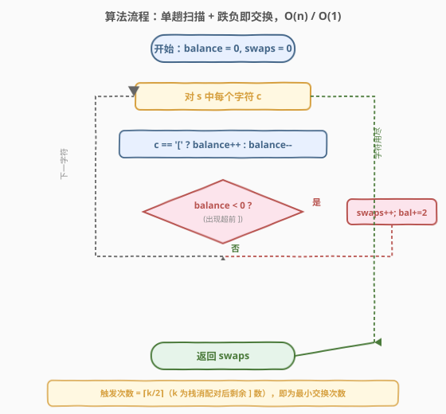
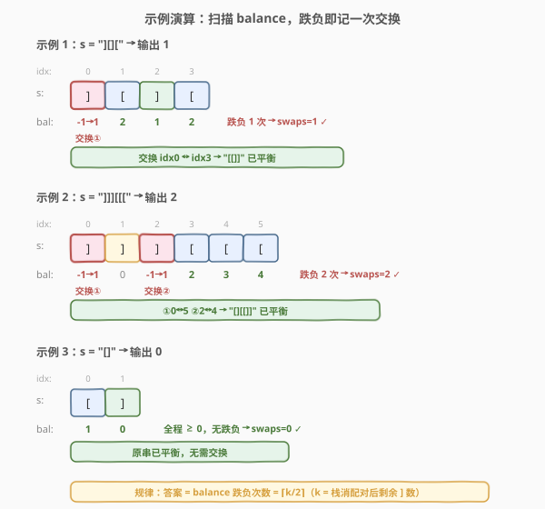

# LeetCode 使字符串平衡的最小交换次数 题解

## 1. 题目概述

- **标题 / 题号**：使字符串平衡的最小交换次数（#1963，medium）
- **链接**：https://leetcode.cn/problems/minimum-number-of-swaps-to-make-the-string-balanced/
- **难度**：中等
- **标签**：贪心、字符串、栈

**题意**：给你一个下标从 0 开始、长度为偶数 $n$ 的字符串 $s$，它**恰好**由 $n/2$ 个 `'['` 和 $n/2$ 个 `']'` 组成。称 $s$ 为**平衡字符串**当且仅当满足递归定义：空串平衡；或 $s = AB$ 其中 $A,B$ 均平衡；或 $s = [C]$ 其中 $C$ 平衡。

你可以**交换任意两个下标**对应的括号**任意次数**。返回使 $s$ 变成平衡字符串所需的**最小**交换次数。

**示例 1**：

```text
输入：s = "][]["
输出：1
解释：交换下标 0 和下标 3，得到 "[[]]"，已是平衡字符串。
```

**示例 2**：

```text
输入：s = "]]][[["
输出：2
解释：
- 交换下标 0 与下标 4，s = "[]]][[]"  （题面给的步骤）
- 交换下标 1 与下标 5，s = "[[][]]"
最终 "[[][]]" 平衡。
```

**示例 3**：

```text
输入：s = "[]"
输出：0
解释：原串已平衡。
```

**约束**：

- $n = s.length$，$2 \le n \le 10^6$，$n$ 为偶数
- $s[i]$ 为 `'['` 或 `']'`
- `'['` 与 `']'` 的数目各为 $n/2$

> 💡 **审题关键**：① 「交换任意两个下标」——不同于 [921. 使括号有效的最少添加](../0901-1000/921_使括号有效的最少添加.md) 的「插入」、也不同于 [1249. 移除无效的括号](../1201-1300/1249_移除无效的括号.md) 的「删除」，本题总字符数与两种括号数量**始终不变**，只能通过互换位置来纠正；② 「最小交换次数」——一次交换可同时改变两个位置，因此答案通常小于「超前 `]`」的个数；③ 平衡的等价判定：**任意前缀中 `#[` ≥ `#]`**（且总数相等，本题总数已保证相等，故只需看前缀）。

## 2. 解题思路

### 2.1 暴力思路：实际执行每次交换

最直觉的做法：反复扫描，找到第一个使前缀失衡的位置，把那个"超前"的 `]` 与后面某个 `[` 真正交换，计数加一，直到全串平衡。

```text
]]][[[
 ↑ 第 0 位 ] 让 balance 跌到 -1 → 找后面的 [ （如下标 5）→ 交换 → []][[] 
       ↑ 第 2 位 ] 让 balance 跌到 -1 → 找后面的 [ （如下标 4）→ 交换 → [][[]]  平衡！
共 2 次交换
```

- **正确性**：每次都消除一个"超前 `]`"，最终所有前缀满足「`#[`」≥「`#]`」即平衡。
- **效率**：最坏每次扫描 $O(n)$、最多 $O(n)$ 次交换，整体 $O(n^2)$；且需把字符串改为可变数组（$O(n)$ 空间）。$n \le 10^6$ 时会超时。

> ⚠️ 暴力法的浪费在于「真正去找被交换的 `[` 并执行交换」。其实我们只关心**最少交换次数**，不必知道和谁换、也不必修改原串——只需统计 balance 跌入负值的"事件"个数，并就地修正 balance 即可继续线性扫描。

### 2.2 核心观察：平衡值扫描 + 跌负即交换（贪心，O(n)/O(1)）

![核心观察：扫描平衡值，] 跌入负值即"超前"，需与未来 [ 交换](../images/1963_concept.svg)

关键洞察分三步：

**第一步：平衡判定 ⟺ 前缀 balance ≥ 0。** 令 $\text{balance}$ 为扫描到当前位置时 `#[` − `#]`。由于总串中两者数量相等（各 $n/2$），$s$ 平衡当且仅当**任意前缀** $\text{balance} \ge 0$（这是括号匹配的经典充要条件，可由递归定义归纳证明）。于是问题归约为：**消除所有使 balance 跌入负值的位置**。

**第二步：跌负的 `]` 必须被换走。** 当某个 `]` 把 balance 从 0 推到 −1，说明这个 `]`「超前」出现——它前面没有可匹配的 `[`。它不可能原地变成 `[`，唯一的修补方式是把它与**后面某个 `[`** 交换。因此**每一次 balance 跌负都至少需要一次交换**，这是答案的下界。

**第三步：贪心就地修正，无需真正交换。** 既然这次跌负注定要消耗一次交换（把这个 `]` 换成某个未来的 `[`），我们可以**假装交换已完成**：该位置由 `]`（贡献 −1）变成 `[`（贡献 +1），相对原 balance 净增 2。于是令 $\text{swaps}\!+\!+$、$\text{balance} \mathrel{+}= 2$（从 −1 修正为 +1），继续向后扫描。一趟线性扫描结束，`swaps` 即为答案。

$$\boxed{\text{对每个 } c \in s:\ c\text{ 为 }[\text{ 则 }bal\!+\!+,\ \text{否则 }bal\!-\!-;\ \text{若 }bal<0:\ swaps\!+\!+,\ bal\mathrel{+}=2}$$

> 💡 **为什么"假装交换"不破坏正确性？** 真正交换这个 `]` 与某个未来的 `[` 后，当前位置变 `[`（balance 多了 2），而那个未来的 `[` 变 `]`（它在" surplus 区"，balance 充裕，少一个 `[` 不会让它跌负）。所以交换的真实效果等价于「当前 balance +2，未来某处 balance −2」。由于未来的 `[` 处于 balance 充足的尾部，那里的 −2 不影响是否跌负——故只需在当前 +2 即可继续判定。这正是贪心成立的关键。

> ⚠️ **易错点：把答案当成"超前 `]` 的个数"。** 注意一次交换能"顺带"缓解紧跟其后的下一个超前 `]`：修正 +2 让紧邻的下一个 `]` 落在 balance = 0 而非 −1，不再触发。因此答案不是超前的总数 $k$，而是 $\lceil k/2 \rceil$（详见第 5 节的等价公式）。例如 `]]][[[` 有 3 个超前 `]`，但只需 2 次交换。

### 2.3 算法流程图



整体为「单趟能量扫描 + 条件修正」的线性流程：

1. **初始化**：$\text{balance} = 0$，$\text{swaps} = 0$。
2. **逐字符扫描** $s$：
   - $c = $ `'['`：$\text{balance}\!+\!+$（开括号累积"能量"）。
   - $c = $ `']'`：$\text{balance}\!-\!-$（闭括号消耗"能量"）。
   - **跌负判定**：若 $\text{balance} < 0$，说明此处 `]` 超前 → $\text{swaps}\!+\!+$，$\text{balance} \mathrel{+}= 2$（假装与未来 `[` 交换）。
3. **返回** $\text{swaps}$。

> 💡 由于一次修正 $+2$，且 balance 每步只变 ±1，故 $\text{balance}$ 在修正后立刻回到 +1，**永远不会低于 −1**——"balance < 0"等价于"balance == −1"。这让代码极为简洁，只需一个 `if`。

### 2.4 示例演算

以三个官方示例演示 balance 推进与交换触发：



**示例 1**（`s = "][]["`）：

| 步骤 | 字符 | balance 变化 | 触发? | swaps |
|------|------|--------------|-------|-------|
| 0 | `]` | 0 → −1 → **+1** | 是（交换①） | 1 |
| 1 | `[` | 1 → 2 | 否 | 1 |
| 2 | `]` | 2 → 1 | 否 | 1 |
| 3 | `[` | 1 → 2 | 否 | 1 |

balance 仅在第 0 位跌负一次 → `swaps = 1`。对应实际交换：下标 0 ↔ 下标 3 → `"[[]]"`。

**示例 2**（`s = "]]][[["`）：

| 步骤 | 字符 | balance 变化 | 触发? | swaps |
|------|------|--------------|-------|-------|
| 0 | `]` | 0 → −1 → **+1** | 是（交换①） | 1 |
| 1 | `]` | 1 → 0 | 否 | 1 |
| 2 | `]` | 0 → −1 → **+1** | 是（交换②） | 2 |
| 3 | `[` | 1 → 2 | 否 | 2 |
| 4 | `[` | 2 → 3 | 否 | 2 |
| 5 | `[` | 3 → 4 | 否 | 2 |

balance 在第 0、2 位各跌负一次 → `swaps = 2`。注意第 1 位的 `]` 因前一次修正 +2 而落在 balance = 0，**未被计入**——这就是"一次交换顺带缓解下一个超前 `]`"的体现。

**示例 3**（`s = "[]"`）：balance 走 1 → 0，全程 ≥ 0，无跌负 → `swaps = 0`。

> 💡 **观察要点**：① balance 单调地随 `[`/`]` 增减，修正 +2 仅在跌负时触发；② 示例 2 中第 1 位的 `]` 没触发，证明答案 ≠ 超前 `]` 总数，而是成对地被消除；③ 整个过程不修改原串、不记录交换对象，纯靠一个计数器完成。

## 3. 参考代码

### C++（平衡值扫描 + 跌负修正）

```cpp
class Solution {
public:
    int minSwaps(string s) {
        int balance = 0, swaps = 0;
        for (char c : s) {
            if (c == '[') balance++;
            else          balance--;
            if (balance < 0) {
                swaps++;
                balance += 2;
            }
        }
        return swaps;
    }
};
```

### Python（平衡值扫描 + 跌负修正）

```python
class Solution:
    def minSwaps(self, s: str) -> int:
        balance = swaps = 0
        for c in s:
            if c == '[':
                balance += 1
            else:
                balance -= 1
            if balance < 0:
                swaps += 1
                balance += 2
        return swaps
```

### Python（栈消配对 + ⌈k/2⌉ 公式）

```python
class Solution:
    def minSwaps(self, s: str) -> int:
        unmatched = 0
        for c in s:
            if c == '[':
                unmatched += 1
            elif unmatched > 0:
                unmatched -= 1
        return (unmatched + 1) // 2
```

> 💡 **写法对照**：① 平衡值版直接翻译思路，显式体现「跌负 → 交换 → +2 修正」三步，$O(1)$ 空间，面试默认先写这版；② 栈公式版用 `unmatched` 统计**栈消配对后剩余的 `[` 数**（等于剩余 `]` 数 $k$），答案直接套 $(k+1)//2$，逻辑更"数学化"但需在第 5 节证明；③ 两版时间同为 $O(n)$、空间同为 $O(1)$，对 $n = 10^6$ 都瞬时返回。

> ⚠️ **栈公式版的 `unmatched` 语义**：它累计的是「尚未被闭括号匹配的开括号 `[` 数」。扫完整串后仍开着的 `[`，其数目恰好等于没能匹配的 `]` 数 $k$（因为总数相等）。剩余结构必为 `]`^k `[`^k（所有能配对的都已抵消）。故答案 $= \lceil k/2 \rceil = (k+1)//2$。注意 `elif unmatched > 0` 不能写成 `else`——遇到 `]` 但栈空时不能让 `unmatched` 变负，那对应的是超前 `]`，留给公式计数。

## 4. 复杂度分析

| 维度 | 平衡值扫描法 | 栈消配对法 | 说明 |
|------|-------------|-----------|------|
| 时间复杂度 | $O(n)$ | $O(n)$ | 均单趟扫描，每个字符 $O(1)$ 处理；$n = \|s\| \le 10^6$ |
| 空间复杂度 | $O(1)$ | $O(1)$ | 仅 `balance`/`swaps` 或 `unmatched` 几个整型变量，不修改原串、不开栈 |

> 💡 本题 $n \le 10^6$，必须 $O(n)$ 时间 + $O(1)$ 空间。两版解法均满足。若误用「实际交换 + 反复扫描」的暴力，$O(n^2)$ 会超时；若用真实栈数组存下标，$O(n)$ 空间虽能 AC 但非最优——单计数器即可替代栈（因为只有一种括号，栈深度信息可压缩为一个 `int`，与 [921. 使括号有效的最少添加](../0901-1000/921_使括号有效的最少添加.md) 的退化思路同源）。

## 5. 扩展：等价公式 ⌈k/2⌉ 与最优性证明

### 5.1 栈消配对后的残余结构

用栈模拟括号匹配：遇 `[` 入栈，遇 `]` 且栈顶为 `[` 则弹出（配对），否则该 `]` 无法配对。扫完后，栈中剩下的元素必呈 `] ] … ] [ [ … [` 的形态——即若干个超前 `]` 紧跟若干个未闭合的 `[`，记两者数目皆为 $k$（总数相等保证二者相等）。所有能配对的 `[]` 对都已抵消，**残余串等价于 `]`^k `[`^k**。

本题的"交换"只改变字符位置、不增减字符，于是问题归约为：**把 `]`^k `[`^k 经最少交换变成平衡串**。

### 5.2 答案 = ⌈k/2⌉ = (k+1)//2

**上界（构造）**：对残余 `]`^k `[`^k，按下标配对——把第 $i$ 个 `]`（从左数）与第 $i$ 个 `[`（从右数）交换，即交换下标 $i-1$ 与 $2k-i$。每次交换同时修复左右两端两个错位字符，共需 $\lceil k/2 \rceil$ 次即可全部归位（$k$ 为奇数时中间那对... 实际上中间位天然落在正确侧）。例如 $k=3$：交换 (0,5)、(2,4) 得 `[][[]]`，2 次。

**下界（最优性）**：定义 $d = -\min_{\text{前缀}} \text{balance}$（不平衡的"最大深度"）。对任意串，$d = k$（栈消配对不改变最小前缀 balance，残余 `]`^k `[`^k 的最小 balance 恰为 $-k$）。一次交换把某位 `]` 换成 `[`、某位 `[` 换成 `]`，对区间 balance 的影响是「中段 +2、尾段不变」，故 $d$ 每次至多减少 2。要把 $d$ 从 $k$ 降到 0，至少需要 $\lceil k/2 \rceil$ 次交换。

上下界吻合，故 **min swaps = $\lceil k/2 \rceil = (k+1)//2$**。

### 5.3 与平衡值贪心的等价性

为什么 2.2 节的"跌负计数"恰好等于 $\lceil k/2 \rceil$？因为修正 +2 会"顺带"抬高紧随其后的 balance：对残余 `]`^k `[`^k 扫描时，跌负只发生在第 0、2、4… 位（偶数下标），第 1、3、5… 位的 `]` 因前一次 +2 而落在 balance = 0 不触发。故触发次数 = $\lceil k/2 \rceil$。匹配串中的已配对 `[]` 段落净贡献为 0、不引入新的跌负，故一般串的跌负次数仍只由 $k$ 决定。

> 💡 **三种视角统一**：① 平衡值贪心（跌负计数）；② 栈消配对 + $\lceil k/2 \rceil$；③ 最大深度 $d=k$ 每次降 2。三者给出同一个答案，对应代码中三个等价实现。

### 5.4 与 921「最少添加」的对比

| 维度 | 921 最少添加 | 1963 最少交换 |
|------|-------------|---------------|
| 操作 | 在任意位置**插入** `(` 或 `)` | **交换**两个已有字符 |
| 字符总数 | 增加 | 不变 |
| 答案 | 超前 `]` 数 + 末尾剩余 `[` 数 $= k_\text{闭} + k_\text{开}$ | $\lceil k/2 \rceil$（$k$ = 同一组超前端） |
| 原因 | 一次插入只补一个字符，无法"顺带"修另一个缺口 | 一次交换同时动两个字符，可成对消除缺口 |

> ⚠️ 921 中开/闭缺口是**两类独立**的（前缀缺 `(`、末尾缺 `)`），各需独立补足，故答案 $= k_\text{闭} + k_\text{开}$；1963 中由于总数已相等，超前 `]` 数恒等于末尾未闭合 `[` 数（同一个 $k$），且交换能成对修复，故答案 $= \lceil k/2 \rceil$。这是两题答案形式不同的根源。

## 6. 面试要点

**Q1：为什么 balance 一跌负就立刻 +2，而不是等扫完再统一处理？**

> 因为"跌负"这一刻就意味着该 `]` 注定要被换走。立刻 +2 模拟"把它换成未来的 `[`"后的真实 balance，才能正确判断**后续**字符是否还会跌负。若等扫完再处理，会把"被前一次交换顺带救下的 `]`"误算成需要额外交换——例如 `]]][[[`，第 1 位的 `]` 在第 0 位 +2 后落在 balance = 0，不应计入；若不就地修正，会误判它也跌负，多算一次。

**Q2：一次交换最多能消除几个"跌负"位置？为什么答案是 ⌈k/2⌉ 而不是 k？**

> 最多消除两个。交换把某位 `]`→`[`（当前位 +2）和某位 `[`→`]`（未来位 −2），中段所有 balance 整体抬高 2，于是紧跟当前位之后的下一个"潜在跌负"也被救下。因此连续的超前 `]` 是**两两成对**地被一次交换消除，答案为 $\lceil k/2 \rceil$。形式化见 5.2 的最大深度论证：每次交换让最大深度 $d$ 至多降 2。

**Q3：贪心为什么是最优的？怎么证明下界？**

> 用"最大不平衡深度" $d = -\min \text{balance}$。一次交换对 balance 的影响是「中段 +2、尾段不变」，故 $d$ 每次至多减 2。要把 $d$ 从 $k$ 降到 0，至少 $\lceil k/2 \rceil$ 次。而贪心恰好达到 $\lceil k/2 \rceil$ 次，故最优。等价地，残余 `]`^k `[`^k 的最小 balance = −k，配对交换 (左第 $i$ 个 `]`, 右第 $i$ 个 `[`) 给出 $\lceil k/2 \rceil$ 的构造上界。

**Q4：栈公式版里 `unmatched` 为什么最后等于 k？遇到 `]` 时为什么不能无脑 `unmatched--`？**

> `unmatched` 累计"当前开着的 `[` 数"。遇 `[` 入栈 `+1`；遇 `]` 若栈非空则配对弹出 `−1`，若栈空则该 `]` 超前、**不能让计数变负**（超前 `]` 不进栈、也不消耗开括号）。扫完后剩下的开括号数 = 未能配对的 `[` 数 = 未能配对的 `]` 数 $k$（总数相等）。若写成 `else unmatched--` 会让 `unmatched` 变负，破坏"非负计数"语义，最后取 `max(unmatched,0)` 才对——`elif unmatched > 0` 更直接。

**Q5：如果允许交换相邻两个字符（而非任意两个），做法会变吗？**

> 会。限制为相邻交换时，问题等价于**把 `]`^k `[`^k 排成平衡串所需的最少相邻交换数**，即把 $k$ 个 `[` 跨过 $k$ 个 `]` 移到前半的逆序对数，答案为 $k$（而非 $\lceil k/2 \rceil$）。因为相邻交换一次只动一个位置，不能像任意交换那样"一换两修"。本题允许任意交换，故答案减半向上取整。

> 💡 **一句话总结**：单趟扫描 balance，遇 `]` 跌负即 `swaps++; balance+=2`——$O(n)$ 时间、$O(1)$ 空间，不修改原串；答案等价于 $\lceil k/2 \rceil$（$k$ 为栈消配对后剩余 `]` 数）。

## 同类练习题

| # | 题目 | 与本题的关联 |
|---|------|-------------|
| 921 | [使括号有效的最少添加](https://leetcode.cn/problems/minimum-add-to-make-parentheses-valid/)（[题解](../0901-1000/921_使括号有效的最少添加.md)） | 同 balance 计数器骨架，对比「插入」vs「交换」——插入一次只补一个缺口（答案 $= k_\text{闭}+k_\text{开}$），交换一次动两个字符可成对消除（答案 $= \lceil k/2 \rceil$） |
| 1541 | [平衡括号字符串的最少插入次数](https://leetcode.cn/problems/minimum-insertions-to-balance-a-parentheses-string/)（[题解](../1501-1600/1541_平衡括号字符串的最少插入次数.md)） | 921 的升级版（一个 `)` 需配两个），仍是 balance 计数 + 缺口补足，体会"缺口单位"随括号语义变化 |
| 1249 | [移除无效的括号](https://leetcode.cn/problems/minimum-remove-to-make-valid-parentheses/)（[题解](../1201-1300/1249_移除无效的括号.md)） | 第三种修补方式「删除」——用栈标记应删下标，对比插入/交换/删除三类操作对平衡的修正逻辑 |
| 32 | [最长有效括号](https://leetcode.cn/problems/longest-valid-parentheses/)（[题解](../0001-0100/32_最长有效括号.md)） | 同属括号匹配家族，从"最小修补次数"转为"最长合法子串长度"，栈/DP 双解，承接平衡判定的前缀 balance 思想 |
| 20 | [有效的括号](https://leetcode.cn/problems/valid-parentheses/)（[题解](../0001-0100/20_有效括号.md)） | 括号匹配的母题——判定是否平衡，本题在其基础上加"最少交换修复"，先理解判定再谈修补 |
