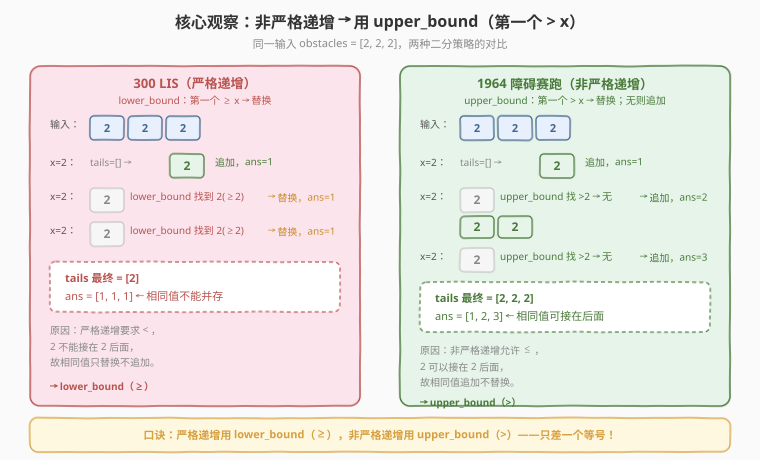
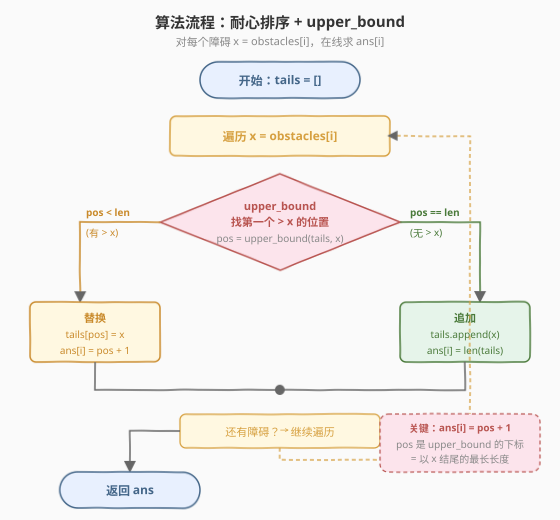

# 找出到每个位置为止最长的有效障碍赛跑路线

- **题目名称**：找出到每个位置为止最长的有效障碍赛跑路线
- **链接**：[1964. 找出到每个位置为止最长的有效障碍赛跑路线](https://leetcode.cn/problems/find-the-longest-valid-obstacle-course-at-each-position/)
- **难度**：困难
- **标签**：数组、二分查找、贪心、最长递增子序列

## 1. 题目概述

给定一个下标从 0 开始的整数数组 `obstacles`，长度为 `n`，`obstacles[i]` 表示第 `i` 个障碍的高度。对于每个下标 `i`，在满足下述条件的前提下，找出 `obstacles` 能构成的最长障碍路线的长度：

- 可以选择下标介于 `0` 到 `i` 之间（含）的任意个障碍；
- 路线中**必须包含第 `i` 个障碍**；
- 必须按障碍在 `obstacles` 中的**出现顺序**布置；
- 除第一个障碍外，路线中每个障碍的高度都必须和前一个**相同**或**更高**（即非严格递增，允许相等）。

返回长度为 `n` 的数组 `ans`，其中 `ans[i]` 为下标 `i` 对应的最长障碍赛跑路线长度。

**示例 1**：

```text
输入：obstacles = [1,2,3,2]
输出：[1,2,3,3]
解释：
  i=0: [1], 长度 1
  i=1: [1,2], 长度 2
  i=2: [1,2,3], 长度 3
  i=3: [1,2,2], 长度 3（第 3 个障碍高 2，接在 [1,2] 后面）
```

**示例 2**：

```text
输入：obstacles = [2,2,1]
输出：[1,2,1]
解释：
  i=0: [2], 长度 1
  i=1: [2,2], 长度 2（相同高度可接）
  i=2: [1], 长度 1（高 1 无法接在 2 后面）
```

**示例 3**：

```text
输入：obstacles = [3,1,5,6,4,2]
输出：[1,1,2,3,2,2]
```

**约束条件**：

- `n == obstacles.length`
- `1 <= n <= 10^5`
- `1 <= obstacles[i] <= 10^7`

> 💡 **审题关键**：① 「必须包含第 `i` 个障碍」= 求**以 `obstacles[i]` 结尾**的最长子序列长度（在线版 LIS）；② 「相同或更高」= **非严格递增**（`≤`），这是与 [300 最长递增子序列](../0201-0300/300_最长递增子序列.md)（严格 `<`）的核心区别；③ `n ≤ 10^5` 排除 `O(n²)` DP，必须用 `O(n log n)` 的贪心 + 二分。

---

## 2. 解题思路

### 2.1 暴力思路：对每个 i 向前扫

对每个 `i`，从 `j = i-1` 起向前扫，找所有 `obstacles[j] <= obstacles[i]` 的 `j` 中 `ans[j]` 最大的，`ans[i] = max(ans[j]) + 1`（若没有则 `ans[i] = 1`）。

```text
for i in 0..n:
    best = 0
    for j in 0..i-1:
        if obstacles[j] <= obstacles[i]:
            best = max(best, ans[j])
    ans[i] = best + 1
```

- **正确性**：忠实枚举所有合法前驱，取最优接上。
- **效率**：最坏 `O(n²)`，`n = 10^5` 时约 `10^10`，**超时**。

> ⚠️ 暴力法的问题：每个 `i` 独立向前扫描，**重复比较了大量已被处理的信息**。这正是 [300 LIS](../0201-0300/300_最长递增子序列.md) 从 `O(n²)` DP 优化到 `O(n log n)` 贪心+二分要解决的同一问题——用「耐心排序」维护一个 `tails` 数组，把前驱查找降到 `O(log n)`。

### 2.2 核心观察：耐心排序 + upper_bound

本题是 [300 最长递增子序列](../0201-0300/300_最长递增子序列.md) 的**非严格递增**变体，并要求**在线回答每个位置**的答案。核心区别在于二分用 `upper_bound` 而非 `lower_bound`。



**维护数组** `tails`：`tails[k]` = 长度为 `k+1` 的所有非严格递增子序列中，**最小的末尾元素**。

**性质**：`tails` 数组**非严格递增**（允许相等）。

> 💡 **为什么用 upper_bound（第一个 `> x`）而不是 lower_bound（第一个 `≥ x`）？**
>
> - **严格递增**（300 题，`<`）：相同元素不能并存，用 `lower_bound`（`≥`），遇到相等元素会**替换自己**，长度不增长。
> - **非严格递增**（本题，`≤`）：相同元素可以接在后面，用 `upper_bound`（`>`），遇到相等元素时 `upper_bound` 找不到 `> x` 的位置 → **追加到末尾**，长度增长。
>
> 一句话：**严格递增用 `lower_bound`（`≥`），非严格递增用 `upper_bound`（`>`）——只差一个等号。**

**算法**：遍历 `obstacles`，对每个 `x = obstacles[i]`：

1. 在 `tails` 中二分找**第一个 `> x`** 的位置 `pos`（`upper_bound`）
2. **若 `pos == len(tails)`**（没有 `> x` 的元素）→ `x` 可以接在所有子序列后面 → 追加到 `tails` 末尾，`ans[i] = len(tails)`
3. **若 `pos < len(tails)`**（找到 `> x` 的元素）→ 用 `x` 替换 `tails[pos]`（保持最小末尾），`ans[i] = pos + 1`

**为什么 `ans[i] = pos + 1`？**

`pos` 是 `upper_bound` 返回的下标，表示 `tails[0..pos-1]` 都 `≤ x`，即存在长度为 `pos` 的非严格递增子序列末尾 `≤ x`，可以把 `x` 接上去得到长度 `pos + 1`。而 `tails[pos] > x` 说明长度 `pos + 1` 的现有最小末尾比 `x` 大，用 `x` 替换能让该长度更优。

### 2.3 算法流程图



**完整步骤**：

1. **初始化**：空数组 `tails`，空数组 `ans`。
2. **遍历** `i` **从 `0` 到 `n-1`**：
   - `x = obstacles[i]`
   - `pos = upper_bound(tails, x)`（在 `tails` 中找第一个 `> x` 的位置）
   - 若 `pos == len(tails)`：`tails.append(x)`，`ans[i] = len(tails)`
   - 否则：`tails[pos] = x`，`ans[i] = pos + 1`
3. **结束**：返回 `ans`。

> ⚠️ **与 300 题的对比**：300 题只需最终长度，返回 `len(tails)`；本题需**每个位置**的答案，故在每步记录 `ans[i] = pos + 1`。骨架完全相同，区别仅是二分谓词（`upper_bound` vs `lower_bound`）和输出粒度。

### 2.4 示例演算

以 `obstacles = [3,1,5,6,4,2]`（示例 3）为例：

![示例演算：[3,1,5,6,4,2] 逐步处理](../images/1964_example_walkthrough.svg)

| 步骤 | i | x | tails（变化前） | upper_bound 结果 | 操作 | tails（变化后） | ans[i] |
|------|---|---|----------------|-----------------|------|----------------|--------|
| 1 | 0 | 3 | `[]` | pos=0（==len） | 追加 | `[3]` | 1 |
| 2 | 1 | 1 | `[3]` | pos=0（`>1` 的是 3） | 替换 tails[0] | `[1]` | 1 |
| 3 | 2 | 5 | `[1]` | pos=1（==len） | 追加 | `[1,5]` | 2 |
| 4 | 3 | 6 | `[1,5]` | pos=2（==len） | 追加 | `[1,5,6]` | 3 |
| 5 | 4 | 4 | `[1,5,6]` | pos=1（`>4` 的是 5） | 替换 tails[1] | `[1,4,6]` | 2 |
| 6 | 5 | 2 | `[1,4,6]` | pos=1（`>2` 的是 4） | 替换 tails[1] | `[1,2,6]` | 2 |

最终 `ans = [1,1,2,3,2,2]` ✓，与示例 3 一致。

注意步骤 5（`x=4`）：`tails = [1,5,6]`，`upper_bound` 找第一个 `> 4` 的元素是 5（pos=1），用 4 替换 5 得到 `[1,4,6]`。`6` 没被碰——因为 6 在 pos=2，不是第一个 `> 4` 的。`ans[4] = pos + 1 = 2`，表示存在长度 1 的子序列末尾 `≤ 4`（即 `[1]`），接上 4 得到 `[1,4]` 长度 2。

> 💡 对比 300 题：若本题也要求严格递增，步骤 2 的 `x=1` 会用 `lower_bound` 找 `≥1`（也是 pos=0）替换 3，结果相同；但遇到相同值如 `[2,2,2]` 时，`lower_bound` 会替换自身（ans=`[1,1,1]`），`upper_bound` 则追加（ans=`[1,2,3]`）——这正是核心差异。

---

## 3. 参考代码

### C++

```cpp
// 1964. 找出到每个位置为止最长的有效障碍赛跑路线
// 耐心排序 + upper_bound（非严格递增 LIS，在线求每个位置的答案）
// 编译: g++ -O2 -std=c++17 1964.cpp -o obstacle
#include <vector>
#include <algorithm>
using namespace std;

class Solution {
  public:
    vector<int> longestObstacleCourseAtEachPosition(vector<int>& obstacles) {
        int n = obstacles.size();
        vector<int> ans(n);
        vector<int> tails; // tails[k] = 长度 k+1 的非严格递增子序列的最小末尾

        for (int i = 0; i < n; ++i) {
            int x = obstacles[i];
            // upper_bound：找第一个 > x 的位置（非严格递增的关键）
            auto it = upper_bound(tails.begin(), tails.end(), x);
            if (it == tails.end()) {
                tails.push_back(x);
                ans[i] = tails.size();
            } else {
                *it = x;
                ans[i] = (it - tails.begin()) + 1;
            }
        }
        return ans;
    }
};
```

### Python

```python
import bisect

class Solution:
    def longestObstacleCourseAtEachPosition(self, obstacles: list[int]) -> list[int]:
        ans = []
        tails = []  # tails[k] = 长度 k+1 的非严格递增子序列的最小末尾

        for x in obstacles:
            # bisect_right = upper_bound：找第一个 > x 的插入位置
            pos = bisect.bisect_right(tails, x)
            if pos == len(tails):
                tails.append(x)
                ans.append(len(tails))
            else:
                tails[pos] = x
                ans.append(pos + 1)
        return ans
```

> 💡 **写法对照**：C++ 的 `upper_bound` 返回迭代器，`it - tails.begin()` 即下标 `pos`，`ans[i] = pos + 1`；Python 的 `bisect.bisect_right` 等价于 `upper_bound`，直接返回插入位置 `pos`。两者逻辑完全一致：找第一个 `> x` 的位置 → 追加或替换 → 记录 `ans[i] = pos + 1`。

> ⚠️ **`bisect_right` vs `bisect_left`**：`bisect_right(tails, x)` 找第一个 `> x` 的位置（`upper_bound`），`bisect_left(tails, x)` 找第一个 `≥ x` 的位置（`lower_bound`）。本题用 `bisect_right`，因为非严格递增允许相同值接在后面。用错会导致相同高度的障碍无法追加（如 `[2,2,2]` 会输出 `[1,1,1]` 而非正确的 `[1,2,3]`）。

---

## 4. 复杂度分析

| 维度 | 复杂度 | 说明 |
|------|--------|------|
| **时间复杂度** | $O(n \log n)$ | 每个元素一次 `upper_bound` 二分 $O(\log n)$，共 $n$ 次 |
| **空间复杂度** | $O(n)$ | `tails` 数组最多存 $n$ 个元素（非严格递增序列时全部追加） |

> ⚠️ 暴力 DP `O(n²)` 在 `n = 10^5` 时约 $10^{10}$ 操作超时；贪心 + 二分 `O(n log n)` 约 $10^5 \times 17 \approx 1.7 \times 10^6$，轻松通过。`tails` 最长可达 $n$（当 `obstacles` 本身非严格递增时，每个元素都追加），故空间 $O(n)$。

---

## 5. 扩展：严格递增 vs 非严格递增的统一模板

### 5.1 二分谓词的选择

| 题型 | 递增要求 | 二分谓词 | 找的位置 | 相同元素行为 |
|------|---------|---------|---------|------------|
| [300 LIS](../0201-0300/300_最长递增子序列.md) | 严格 `<` | `lower_bound`（`≥`） | 第一个 `≥ x` | 替换自身，长度不增 |
| **1964 障碍赛跑** | **非严格 `≤`** | **`upper_bound`（`>`）** | **第一个 `> x`** | **追加，长度 +1** |

**记忆口诀**：二分找的是「**破坏递增规则的第一个元素**」。

- 严格递增中，`≥ x` 就破坏了 `<`，所以找 `≥`（`lower_bound`）；
- 非严格递增中，`> x` 才破坏了 `≤`，所以找 `>`（`upper_bound`）。

### 5.2 在线 vs 离线

| 题型 | 输出 | 处理方式 |
|------|------|---------|
| 300 LIS | 全局最长长度 | 只返回 `len(tails)` |
| **1964 障碍赛跑** | **每个位置的长度** | 每步记录 `ans[i] = pos + 1` |

300 题只需最终长度，`tails` 的中间状态不需要保存；本题需要在**每个位置**即时回答「以当前元素结尾的最长长度」，故每步都要记录 `ans[i]`。`pos + 1` 正好是以 `x` 结尾的最长非严格递增子序列长度——因为 `tails[0..pos-1]` 都 `≤ x`，可以接上 `x` 得到长度 `pos + 1`。

### 5.3 通用模板

```python
import bisect

def lis_online(arr, strict=True):
    """在线求每个位置以 arr[i] 结尾的 LIS 长度。
    strict=True: 严格递增 (lower_bound)
    strict=False: 非严格递增 (upper_bound)
    """
    tails = []
    ans = []
    for x in arr:
        if strict:
            pos = bisect.bisect_left(tails, x)   # 第一个 >= x
        else:
            pos = bisect.bisect_right(tails, x)  # 第一个 > x
        if pos == len(tails):
            tails.append(x)
        else:
            tails[pos] = x
        ans.append(pos + 1)
    return ans
```

---

## 6. 面试要点

1. **本题和 300 LIS 的区别是什么？**

   - **递增性**：300 是严格递增（`<`），本题是非严格递增（`≤`，允许相等）。
   - **二分谓词**：300 用 `lower_bound`（`≥`），本题用 `upper_bound`（`>`）。
   - **输出粒度**：300 只返回全局最长长度，本题返回每个位置以该元素结尾的最长长度。

2. **为什么非严格递增用 upper_bound？**

   - `upper_bound` 找第一个 `> x` 的位置。若没有 `> x` 的元素（`pos == len`），说明 `x` `≥` 所有 `tails` 元素，可以接在任意子序列后面 → 追加，长度增长。
   - 若用 `lower_bound`（`≥`），遇到相同值会替换自身，长度不增长——这对严格递增是对的，但对非严格递增就错了。

3. **为什么 `ans[i] = pos + 1`？**

   - `pos` 是 `upper_bound` 的返回值，表示 `tails[0..pos-1]` 都 `≤ x`。即存在长度 `pos` 的非严格递增子序列末尾 `≤ x`，接上 `x` 得到长度 `pos + 1`。
   - 这是「以 `x` 结尾的最长长度」，因为 `tails[pos] > x` 说明长度 `pos + 1` 的现有末尾已经 `> x`，无法接 `x`。

4. **时间复杂度为什么是 $O(n \log n)$？**

   - 每个元素一次 `upper_bound` 二分 $O(\log n)$，`n` 个元素共 $O(n \log n)$。`tails` 的追加/替换都是 $O(1)$。`n = 10^5` 时约 $1.7 \times 10^6$ 操作，远优于暴力的 $10^{10}$。

5. **`tails` 数组本身是最长子序列吗？**

   - 不是。`tails` 只保证「每个长度的最小末尾」，替换操作会破坏顺序。`tails` 的**长度**是正确的最长长度，但内容不一定是合法子序列。若要还原具体子序列，需额外记录前驱（见 [300 题](../0201-0300/300_最长递增子序列.md) 第 5 节）。

> 💡 **一句话总结**：本题是 [300 LIS](../0201-0300/300_最长递增子序列.md) 的「非严格递增 + 在线」双变体——把 `lower_bound` 换成 `upper_bound`（允许相等追加），把「只返回长度」改成「每步记录 `pos + 1`」。核心是认清「严格用 `≥`，非严格用 `>`」这一字之差。

---

## 7. 同类练习题

- [300. 最长递增子序列](https://leetcode.cn/problems/longest-increasing-subsequence/)（[题解](../0201-0300/300_最长递增子序列.md)）：LIS 母题，严格递增用 `lower_bound`，本题的「母模板」
- [354. 俄罗斯套娃信封问题](https://leetcode.cn/problems/russian-doll-envelopes/)（[题解](../0301-0400/354_俄罗斯套娃信封问题.md)）：排序 + 二维 LIS，严格递增 `lower_bound`
- [2111. 使数组 K 递增的最少操作次数](https://leetcode.cn/problems/minimum-operations-to-make-the-array-k-increasing/)：非严格递增 LIS（`upper_bound`），本题的直接姊妹题
- [673. 最长递增子序列的个数](https://leetcode.cn/problems/number-of-longest-increasing-subsequence/)：LIS + 计数，贪心+二分需额外维护计数数组
- [1671. 得到山形数组的最少删除次数](https://leetcode.cn/problems/minimum-number-of-removals-to-make-mountain-array/)：正向 + 反向 LIS 拼山形，`upper_bound` 求每个位置的最长长度
