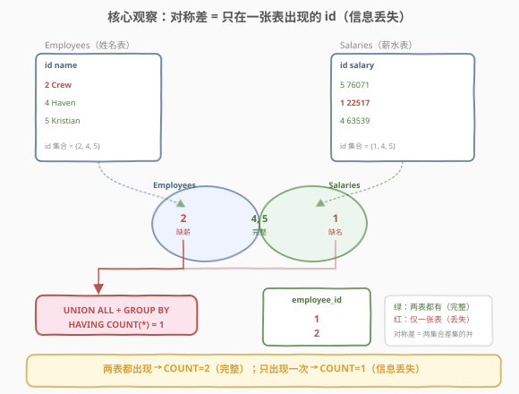
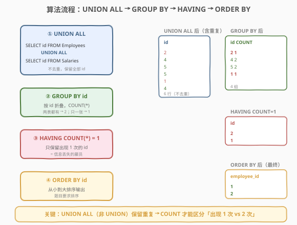
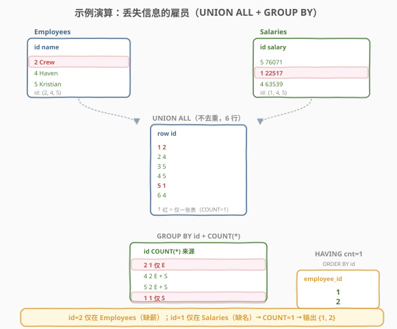

# LeetCode 丢失信息的雇员 题解

## 1. 题目概述

- **标题 / 题号**：丢失信息的雇员（#1965，easy）
- **链接**：https://leetcode.cn/problems/employees-with-missing-information/
- **难度**：简单
- **标签**：数据库、SQL、`UNION ALL`、`GROUP BY`、`HAVING`、对称差（symmetric difference）、`LEFT JOIN`、`IS NULL`、`NOT IN` 的 NULL 陷阱

**题意**：给定 `Employees`（雇员姓名）和 `Salaries`（雇员薪水）两张表，编写 SQL 查询，找出所有**丢失信息**的雇员 `employee_id`。当满足下列条件**之一**即视为信息丢失：

- 雇员的**姓名**丢失（在 `Salaries` 中有薪水但 `Employees` 中无姓名记录），或
- 雇员的**薪水信息**丢失（在 `Employees` 中有姓名但 `Salaries` 中无薪水记录）。

结果按 `employee_id` **从小到大排序**返回。

**表结构**：

```text
Table: Employees
+-------------+---------+
| Column Name | Type    |
+-------------+---------+
| employee_id | int     |  ← 具有唯一值（主键）
| name        | varchar |
+-------------+---------+
每一行表示雇员的 id 和他的姓名。

Table: Salaries
+-------------+---------+
| Column Name | Type    |
+-------------+---------+
| employee_id | int     |  ← 具有唯一值（主键）
| salary      | int     |
+-------------+---------+
每一行表示雇员的 id 和他的薪水。
```

**示例 1**：

```text
输入：
Employees 表:
+-------------+----------+
| employee_id | name     |
+-------------+----------+
| 2           | Crew     |
| 4           | Haven    |
| 5           | Kristian |
+-------------+----------+

Salaries 表:
+-------------+--------+
| employee_id | salary |
+-------------+--------+
| 5           | 76071  |
| 1           | 22517  |
| 4           | 63539  |
+-------------+--------+

输出:
+-------------+
| employee_id |
+-------------+
| 1           |
| 2           |
+-------------+
```

**解释**：

| employee_id | 在 Employees? | 在 Salaries? | 状态 | 结论 |
|-------------|---------------|--------------|------|------|
| 1 | ✗（无姓名记录） | ✓ | 缺姓名 | 丢失 → 输出 |
| 2 | ✓ | ✗（无薪水记录） | 缺薪水 | 丢失 → 输出 |
| 4 | ✓ | ✓ | 完整 | 不输出 |
| 5 | ✓ | ✓ | 完整 | 不输出 |

> 💡 **审题关键**：①「丢失」是**或**关系——姓名、薪水**任一**缺失即算丢失；② 两张表的主键都是 `employee_id`，**且各自唯一**，不存在同 id 多行的情况，这让「判定 id 是否在表中」变得简单；③ 结果需**排序**，不能依赖表的自然顺序；④ 注意 id=1 仅在 `Salaries`、id=2 仅在 `Employees`——丢失是**双向**的，必须同时检查「缺姓名」和「缺薪水」两个方向。

**约束**：

- `Employees.employee_id` 是该表中具有唯一值的列
- `Salaries.employee_id` 是该表中具有唯一值的列
- 结果按 `employee_id` 升序排列

> 💡 本题是 SQL **"对称差（symmetric difference）入门招牌题"**——核心观察：信息完整的雇员 `employee_id` 会**同时出现在两张表**中，信息丢失的雇员只出现在**其中一张**。这等价于求两表 `employee_id` 集合的**对称差**（$A \triangle B = (A \setminus B) \cup (B \setminus A)$）。难点在于 MySQL 不支持 `FULL OUTER JOIN`，需用「`UNION ALL` + `GROUP BY` + `HAVING COUNT(*) = 1`」或「双向 `LEFT JOIN` + `UNION`」模拟。

## 2. 解题思路

### 2.1 暴力思路：逐 id 查两张表

最直觉的过程式思路：取两表 `employee_id` 的并集，逐个检查每个 id 是否在 `Employees` 和 `Salaries` 中都存在，若任一缺失则收录。伪代码：

```text
result = []
ids = set(Employees.id) | set(Salaries.id)
for eid in sorted(ids):
    in_e = any(e.id == eid for e in Employees)
    in_s = any(s.id == eid for s in Salaries)
    if not in_e or not in_s:
        result.append(eid)
```

但**纯 SQL 没有显式逐行循环**——「取并集再逐个判定缺失」需换成集合式表达。关键洞察是：若把两表的 `employee_id` **不去重地**堆在一起（`UNION ALL`），完整雇员的 id 会出现 **2 次**（两表各一次），丢失雇员的 id 只出现 **1 次**——「出现次数」自然区分了完整与丢失。

### 2.2 核心观察：UNION ALL + 出现次数 = 对称差



**问题拆解为三个子问题**：

1. **合并两表 id 且不去重**：`SELECT employee_id FROM Employees UNION ALL SELECT employee_id FROM Salaries`。**`UNION ALL` 而非 `UNION`** 是关键——`UNION` 会去重，完整雇员的两个相同 id 被合并成一个，无法区分「出现 1 次」与「出现 2 次」；`UNION ALL` 保留全部行，完整雇员的 id 出现两次，丢失雇员的 id 出现一次。

2. **按 id 分组计数**：`GROUP BY employee_id` + `COUNT(*)`。把堆叠后的 id 按 `employee_id` 折叠，每组行数即该 id 在两表中出现的总次数。完整雇员 `COUNT = 2`（姓名表一次 + 薪水表一次），丢失雇员 `COUNT = 1`（仅其中一张表）。

3. **筛出 COUNT = 1**：`HAVING COUNT(*) = 1`。只保留出现一次的 id——即信息丢失的雇员。最后 `ORDER BY employee_id` 升序输出。

$$\boxed{\text{完整} \iff \text{id 在两表各出现 1 次} \iff \text{UNION ALL 后 COUNT(*) = 2};\quad \text{丢失} \iff \text{COUNT(*) = 1}}$$

> ⚠️ **`UNION ALL` vs `UNION`（本题最大坑点）**：若误用 `UNION`（去重并集），则两表都有的 id 被合并成一行，所有 id 的 `COUNT` 都是 1，`HAVING COUNT(*) = 1` 会返回**全部** id——答案错误。必须用 `UNION ALL`（保留重复）才能让「出现次数」成为判据。一句话：**需要区分「1 次还是 2 次」用 `UNION ALL`；只需去重并集用 `UNION`**。

> 💡 **为何 `COUNT = 1` 而非 `COUNT < 2`？** 因为本题两表主键 `employee_id` 各自唯一——同一 id 在单表内不会出现多次，故 `UNION ALL` 后某 id 的出现次数只可能是 1（仅一张表）或 2（两表都有），不会出现 3 及以上。`COUNT = 1` 与 `COUNT < 2` 在本题等价，但 `= 1` 语义更精确。若放宽主键约束（单表内 id 可重复），则需改用 `COUNT(DISTINCT ...)`，但本题无需。

### 2.3 算法流程图



**逻辑执行步骤**：

| 步骤 | 子句 | 作用 |
|------|------|------|
| ① | `SELECT employee_id FROM Employees UNION ALL SELECT employee_id FROM Salaries` | 两表 id 不去重堆叠，完整 id 出现 2 次、丢失 id 出现 1 次 |
| ② | `GROUP BY employee_id` | 按 id 折叠，配合 `COUNT(*)` 统计每个 id 的出现次数 |
| ③ | `HAVING COUNT(*) = 1` | 只保留出现 1 次的 id（即信息丢失者） |
| ④ | `ORDER BY employee_id` | 升序输出 |

> 💡 **SQL 子句执行顺序**：`FROM`（含 `UNION ALL`）→ `GROUP BY` → `HAVING` → `SELECT` → `ORDER BY`。`UNION ALL` 在 `FROM` 阶段先合并两表成一张派生表，`GROUP BY` 在其上分组，`HAVING` 过滤组，最后 `ORDER BY` 排序输出。`HAVING` 是**组级**过滤（用聚合函数 `COUNT`），区别于 `WHERE` 的**行级**过滤——这正是 `HAVING` 而非 `WHERE` 的原因。

### 2.4 示例演算

以示例 1 为例，观察「`UNION ALL` → `GROUP BY` + `COUNT` → `HAVING`」的逐步过程：



**步骤 ①：UNION ALL 合并两表 id（不去重，共 6 行）**

`Employees` 有 3 行（id 2/4/5），`Salaries` 有 3 行（id 5/1/4），`UNION ALL` 后保留全部共 6 行：

| row | employee_id | 来源 |
|-----|-------------|------|
| 1 | 2 | Employees |
| 2 | 4 | Employees |
| 3 | 5 | Employees |
| 4 | 5 | Salaries |
| 5 | 1 | Salaries |
| 6 | 4 | Salaries |

其中 id=4 出现 2 次（E+S）、id=5 出现 2 次（E+S）、id=2 出现 1 次（仅 E）、id=1 出现 1 次（仅 S）。

**步骤 ②③：GROUP BY + COUNT + HAVING COUNT(*) = 1**

| employee_id | COUNT(*) | 来源 | HAVING? | 结果 |
|-------------|----------|------|---------|------|
| 1 | 1 | 仅 Salaries | ✓ 保留 | 1 |
| 2 | 1 | 仅 Employees | ✓ 保留 | 2 |
| 4 | 2 | E + S | ✗ 过滤 | — |
| 5 | 2 | E + S | ✗ 过滤 | — |

**步骤 ④：ORDER BY employee_id**

最终输出 `1, 2`（升序）✓

> 💡 **观察要点**：① 完整雇员（id 4、5）的 `COUNT = 2` 被过滤，丢失雇员（id 1、2）的 `COUNT = 1` 被保留；② id=1 仅在 `Salaries`（缺姓名）、id=2 仅在 `Employees`（缺薪水）——两个方向的丢失都被一次性捕获，这正是「对称差」用一次 `UNION ALL` 同时覆盖双向的优势；③ 排序前结果可能是 `{2, 1}`，`ORDER BY` 确保输出 `{1, 2}`。

## 3. 参考代码

### SQL（解法 A：`UNION ALL` + `GROUP BY` + `HAVING`，推荐）

```sql
SELECT employee_id
FROM (
    SELECT employee_id FROM Employees
    UNION ALL
    SELECT employee_id FROM Salaries
) AS u
GROUP BY employee_id
HAVING COUNT(*) = 1
ORDER BY employee_id;
```

> 💡 **写法要点**：
> - **`UNION ALL`（非 `UNION`）**：保留重复 id，使完整雇员 id 出现 2 次、丢失雇员 id 出现 1 次。这是正确性的核心——用 `UNION` 会去重导致所有 id 都只出现 1 次，答案错误。
> - **派生表需别名**：`FROM (...) AS u`——MySQL 要求子查询必须有别名（`u` 可任取），否则报错 "Every derived table must have its own alias"。
> - **`HAVING COUNT(*) = 1`**：组级过滤，只保留出现 1 次的 id。用 `HAVING` 而非 `WHERE`，因为 `COUNT` 是聚合函数，`WHERE` 在分组前执行无法使用聚合结果。
> - **`ORDER BY employee_id`**：题目要求升序，`ORDER BY` 默认升序（`ASC`），无需显式写。
> - ✓ **最推荐**：一次 `UNION ALL` 同时覆盖「缺姓名」和「缺薪水」两个方向，思路简洁、对称差语义清晰、`NULL` 安全。

### SQL（解法 B：双向 `LEFT JOIN` + `UNION`，反连接思路）

```sql
-- 缺薪水：在 Employees 但不在 Salaries
SELECT e.employee_id
FROM Employees e
LEFT JOIN Salaries s ON e.employee_id = s.employee_id
WHERE s.employee_id IS NULL
UNION
-- 缺姓名：在 Salaries 但不在 Employees
SELECT s.employee_id
FROM Salaries s
LEFT JOIN Employees e ON s.employee_id = e.employee_id
WHERE e.employee_id IS NULL
ORDER BY employee_id;
```

> 💡 **解法 B 的思路**：把「信息丢失」拆成两个方向的反连接——
> - **缺薪水**：`Employees LEFT JOIN Salaries`，右表 `employee_id IS NULL` 即该雇员在 `Salaries` 无匹配（反连接，[1581](../1501-1600/1581_进店却未进行过交易的顾客.md) 的同款骨架）；
> - **缺姓名**：方向反过来，`Salaries LEFT JOIN Employees`，右表 `employee_id IS NULL`。
>
> 两个方向用 **`UNION`（去重）** 合并——因为某个 id 不可能同时「缺薪水」又「缺姓名」（若两表都没有该 id，它根本不会出现在任一 `LEFT JOIN` 的左表中），但用 `UNION` 去重更安全（防御性）。最后 `ORDER BY` 排序。
>
> **与解法 A 的区别**：解法 A 用「出现次数」一次性判双向；解法 B 显式拆成两个反连接再合并。两者语义等价，解法 B 更直观地体现「两个方向的丢失」，但代码更长。判反连接一律用**右表主键列**（`employee_id` 非空，变 `NULL` 当且仅当无匹配）。

### SQL（解法 C：双向 `NOT IN` + `UNION`，注意 NULL 陷阱）

```sql
SELECT employee_id FROM Employees
WHERE employee_id NOT IN (SELECT employee_id FROM Salaries)
UNION
SELECT employee_id FROM Salaries
WHERE employee_id NOT IN (SELECT employee_id FROM Employees)
ORDER BY employee_id;
```

> 💡 **解法 C 的思路**：两个方向各用 `NOT IN` 取「不在另一张表」的 id，再 `UNION` 合并。
>
> ⚠️ **`NOT IN` 的 NULL 陷阱**：若子查询结果含 `NULL`，`x NOT IN (..., NULL)` 等价于 `... AND x <> NULL`，而 `x <> NULL` 为 `UNKNOWN`，导致整个条件为 `UNKNOWN`——查询返回空集！本题 `employee_id` 是主键、保证非空，子查询不会产生 `NULL`，故 `NOT IN` 不加 `IS NOT NULL` 也能通过。但生产环境中主键约束未必可靠，养成「用 `NOT IN` 必加 `IS NOT NULL`」或「直接用 `NOT EXISTS`」的习惯更稳妥。
>
> **三法对比**：解法 A（`UNION ALL` + `GROUP BY`）一次扫描双向、最简洁；解法 B（双向 `LEFT JOIN`）语义最直观、`NULL` 安全；解法 C（`NOT IN`）代码最短但有 `NULL` 陷阱。优先选 A 或 B。

### Python（pandas）

```python
import pandas as pd

def find_employees(employees: pd.DataFrame, salaries: pd.DataFrame) -> pd.DataFrame:
    stacked = pd.concat([
        employees[['employee_id']],
        salaries[['employee_id']],
    ], ignore_index=True)
    counts = stacked.groupby('employee_id').size()
    missing = counts[counts == 1].index
    return pd.DataFrame({'employee_id': sorted(missing)})
```

> 💡 **pandas 对照**：
> - `pd.concat([employees[['employee_id']], salaries[['employee_id']]])` 对应 `UNION ALL`——`concat` 默认不去重（保留全部行），等价 `UNION ALL`；若要 `UNION`（去重）需加 `.drop_duplicates()`。
> - `.groupby('employee_id').size()` 对应 `GROUP BY employee_id` + `COUNT(*)`——`size()` 计每组行数（含所有行，等价 `COUNT(*)`）；注意用 `size()` 而非 `count()`（后者按列计非 `NULL` 值数）。
> - `counts[counts == 1]` 对应 `HAVING COUNT(*) = 1`——布尔索引过滤组。
> - `sorted(missing)` 对应 `ORDER BY employee_id`——pandas 的 `sorted` 返回升序列表；也可用 `counts[counts == 1].sort_index()`。

## 4. 复杂度分析

| 维度 | 解法 A（`UNION ALL` + `GROUP BY`） | 解法 B（双向 `LEFT JOIN`） | 解法 C（`NOT IN`） | pandas |
|------|------------------------------------|----------------------------|--------------------|--------|
| **时间** | $O(n + m)$ | $O(n + m)$ | $O(n + m)$ | $O(n + m)$ |
| **空间** | $O(n + m)$ | $O(n + m)$ | $O(m)$ / $O(n)$ | $O(n + m)$ |
| **NULL 安全** | ✓ 天然 | ✓ 天然 | ✗ 需 `IS NOT NULL` | ✓ |
| **双向覆盖** | ✓ 一次 UNION ALL | ✓ 两次 LEFT JOIN + UNION | ✓ 两次 NOT IN + UNION | ✓ 一次 concat |
| **推荐度** | ✓ **首选** | ✓ 语义直观 | ✓ 需谨慎 | ✓ 验证用 |

> - $n$ = `Employees` 表行数，$m$ = `Salaries` 表行数
> - **时间**：解法 A 的 `UNION ALL` 合并两表 $O(n + m)$，`GROUP BY` 哈希聚合 $O(n + m)$，总计 $O(n + m)$；解法 B 的两次 `LEFT JOIN` 各 $O(n + m)$（哈希连接），`UNION` 去重 $O(n + m)$，总计 $O(n + m)$；解法 C 的 `NOT IN` 通常被优化为哈希半连接 $O(n + m)$。三者渐近复杂度相同，常数略有差异。
> - **空间**：解法 A/B 需 $O(n + m)$ 存合并/连接中间表；解法 C 需 $O(m)$ 存子查询结果（第一个 `NOT IN`）+ $O(n)$（第二个）；pandas 需 $O(n + m)$ 存 DataFrame。
> - **索引优化**：在两张表的 `employee_id`（主键）上已有索引，`GROUP BY` 和 `JOIN` 均可利用主键索引的有序性，避免额外排序。

## 5. 扩展：对称差的三种写法与 UNION ALL vs UNION

### 5.1 对称差的三种等价写法

「信息丢失」即两表 `employee_id` 集合的**对称差** $A \triangle B$——只在其中一张表出现的 id。MySQL 不支持 `FULL OUTER JOIN`，有三种等价写法：

| 写法 | 模板 | NULL 安全 | 双向覆盖 |
|------|------|-----------|----------|
| **A. `UNION ALL` + `GROUP BY` + `HAVING`** | 堆叠后按出现次数筛 `COUNT=1` | ✓ 天然 | ✓ 一次 |
| **B. 双向 `LEFT JOIN` + `UNION`** | `A LJ B WHERE b.pk IS NULL` ∪ `B LJ A WHERE a.pk IS NULL` | ✓ 天然 | ✓ 两次 |
| **C. 双向 `NOT IN` + `UNION`** | `A WHERE id NOT IN B` ∪ `B WHERE id NOT IN A` | ✗ 需 `IS NOT NULL` | ✓ 两次 |

> 💡 **A 与 B/C 的本质区别**：A 用「出现次数」隐式判定双向——只出现在一张表 ⇒ 出现 1 次 ⇒ 丢失；B/C 显式拆成两个方向的差集再并集。A 的优势是一次 `UNION ALL` 同时覆盖双向、代码最短；B 的优势是语义最直观（两个反连接清晰对应「缺薪水」「缺姓名」）；C 代码最短但有 `NULL` 陷阱。

### 5.2 `UNION ALL` vs `UNION` 辨析

本题最易错点是把解法 A 的 `UNION ALL` 误写成 `UNION`：

| 写法 | 是否去重 | 完整 id 出现次数 | 丢失 id 出现次数 | `HAVING COUNT=1` 结果 |
|------|----------|------------------|------------------|----------------------|
| `UNION ALL` | ✗ 不去重 | 2 | 1 | ✓ 只剩丢失 id |
| `UNION` | ✓ 去重 | 1 | 1 | ✗ 全部 id（无法区分） |

> ⚠️ **`UNION` 会先去重再返回**——两表都有的 id 被合并成一行，所有 id 的 `COUNT` 都是 1，`HAVING COUNT(*) = 1` 退化为「返回全部 id」。这是本题最高频的错误。**记忆**：`UNION` = 去重并集（`UNION DISTINCT` 的简写）；`UNION ALL` = 保留全部（含重复）。需要用「出现次数」做判据时**必须 `UNION ALL`**。

> 💡 **性能角度**：`UNION` 需额外排序/哈希去重，通常比 `UNION ALL` 慢。本题用 `UNION ALL` 既正确又更快——除非确实需要去重，否则默认用 `UNION ALL`。

### 5.3 若两表主键不唯一（单表内 id 可重复）

本题两表 `employee_id` 各自唯一（主键），故 `UNION ALL` 后某 id 的出现次数只可能是 1 或 2。若放宽约束——单表内同一 id 可出现多次（如薪水表记录历史发薪），则 `COUNT(*)` 可能 > 2，`HAVING COUNT(*) = 1` 仍正确（只保留仅在一张表出现的 id），但「完整」的 id 若在一张表出现多次、另一张表零次，会被误判为丢失。此时需改用 `COUNT(DISTINCT ...)` 配合两张表各预去重，或改用解法 B 的反连接（反连接天然不受单表重复影响）。

### 5.4 `HAVING` vs `WHERE`

本题用 `HAVING COUNT(*) = 1` 而非 `WHERE`：

| 子句 | 执行时机 | 可用聚合函数 | 用途 |
|------|----------|--------------|------|
| `WHERE` | `GROUP BY` **之前** | ✗ 不可 | 行级过滤（筛原始行） |
| `HAVING` | `GROUP BY` **之后** | ✓ 可用 `COUNT`/`SUM` 等 | 组级过滤（筛分组结果） |

`COUNT(*)` 是对分组后行数的聚合，必须在分组后才能计算，故只能用 `HAVING`。若写 `WHERE COUNT(*) = 1` 会报错——`WHERE` 执行时还未分组，`COUNT` 无从计算。

## 6. 面试要点

1. **为什么用 `UNION ALL` 而非 `UNION`？**

   > `UNION` 会去重——两表都有的 id 被合并成一行，所有 id 的 `COUNT` 都变成 1，`HAVING COUNT(*) = 1` 会返回全部 id，答案错误。`UNION ALL` 保留重复，完整 id 出现 2 次、丢失 id 出现 1 次，`COUNT` 才能区分。一句话：**需要用「出现次数」做判据必须 `UNION ALL`；只需去重并集才用 `UNION`**。

2. **为什么用 `HAVING` 而非 `WHERE`？**

   > `COUNT(*)` 是聚合函数，对分组后的行数计数。`WHERE` 在 `GROUP BY` 之前执行，此时还未分组，`COUNT` 无从计算；`HAVING` 在 `GROUP BY` 之后执行，可用聚合结果过滤分组。规则：**行级过滤用 `WHERE`，组级过滤（含聚合函数）用 `HAVING`**。

3. **解法 B 为什么要两次 `LEFT JOIN`？**

   > 信息丢失是双向的——「缺薪水」（在 `Employees` 但不在 `Salaries`）和「缺姓名」（在 `Salaries` 但不在 `Employees`）。一次 `LEFT JOIN` 只能找单方向的缺失（如 `Employees LJ Salaries` 只能找缺薪水的）。必须两个方向各做一次反连接，再用 `UNION` 合并才能覆盖全部丢失情况。

4. **`NOT IN` 有什么陷阱？如何避免？**

   > 若子查询结果含 `NULL`，`x NOT IN (..., NULL)` 等价于 `... AND x <> NULL`，而 `x <> NULL` 为 `UNKNOWN`，导致整个条件为 `UNKNOWN`——查询返回空集。避免方法：① 子查询加 `WHERE k IS NOT NULL`；② 改用 `NOT EXISTS`（天然 `NULL` 安全）；③ 改用 `LEFT JOIN ... IS NULL`。本题主键非空，`NOT IN` 不加 `IS NOT NULL` 也能过，但生产环境应养成防御习惯。

5. **解法 A 的 `COUNT = 1` 与 `COUNT < 2` 等价吗？**

   > 本题等价。两表 `employee_id` 各自唯一（主键），`UNION ALL` 后某 id 的出现次数只可能是 1（仅一张表）或 2（两表都有），不会出现 3 及以上，故 `= 1` 与 `< 2` 结果相同。但 `= 1` 语义更精确地表达「只出现一次」。若单表内 id 可重复（非主键），`COUNT` 可能 > 2，此时 `< 2` 仍只保留 `COUNT = 1`，但「完整」的 id 若在一张表出现多次、另一张表零次会被误判——需改用反连接（解法 B）。

> 💡 **一句话总结**：1965 是 SQL **"对称差入门招牌题"**——核心模板「`SELECT id FROM A UNION ALL SELECT id FROM B` → `GROUP BY id` → `HAVING COUNT(*) = 1` → `ORDER BY id`」。三大要点：**`UNION ALL`（禁 `UNION`，否则去重致 COUNT 失效）、`HAVING`（禁 `WHERE`，聚合需组级过滤）、双向覆盖（一次 UNION ALL 同时捕获缺姓名/缺薪水）**。

## 同类练习题

| # | 题目 | 与本题的关联 |
|---|------|-------------|
| 183 | [从不订购的客户](https://leetcode.cn/problems/customers-never-order/)（[站内题解](../0101-0200/183_从不订购的客户.md)） | 反连接**最经典母题**——`Customers LEFT JOIN Orders WHERE o.id IS NULL` 找从未订购的客户，是 1965 解法 B 的**单方向**版本（只找「缺订单」一个方向），对照理解 1965 为何需双向 |
| 1581 | [进店却未进行过交易的顾客](https://leetcode.cn/problems/customer-who-visited-but-did-not-make-any-transactions/)（[站内题解](../1501-1600/1581_进店却未进行过交易的顾客.md)） | `LEFT JOIN` + `IS NULL` 反连接 + `GROUP BY` 计数，与 1965 解法 B 共享「反连接」骨架，但 1581 是单方向 + 按顾客聚合计数，1965 是双向 + 不计数 |
| 175 | [组合两个表](https://leetcode.cn/problems/combine-two-tables/) | `LEFT JOIN` 保留全部行（含无匹配），与 1965 的反连接形成对照——175 要「保留无匹配行并显示 NULL」，1965 要「筛出无匹配行」，同为 `LEFT JOIN` 但 `WHERE` 条件相反 |
| 197 | [上升的温度](https://leetcode.cn/problems/rising-temperature/)（[站内题解](../0101-0200/197_上升的温度.md)） | 自连接 + 跨行比较，与 1965 同为「两表/两行关联 + 条件筛选」范式，但 197 是同表自连接比大小，1965 是异表连接判存在性 |
| 1068 | [产品销售分析 I](https://leetcode.cn/problems/product-sales-analysis-i/)（[站内题解](../1001-1100/1068_产品销售分析I.md)） | `INNER JOIN` 关联两表，与 1965 形成对照——`INNER JOIN` 保留**两表都有匹配**的行（信息完整者），1965 恰好要**两表不都有的**（丢失者），可视为 `INNER JOIN` 结果的补集 |
