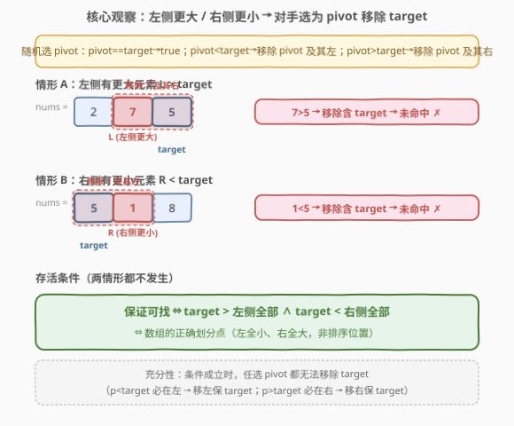
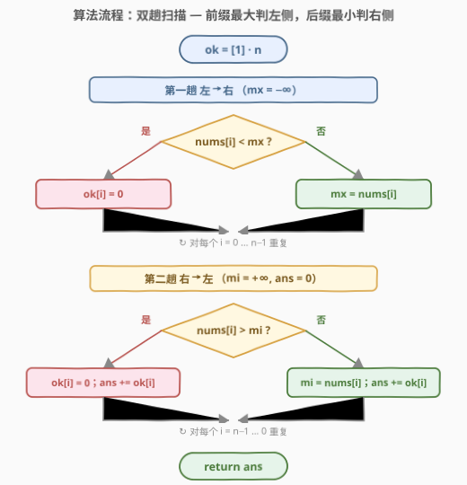

# 未排序数组中的可被二分查找的数

- **题目名称**：未排序数组中的可被二分查找的数
- **链接**：[1966. 未排序数组中的可被二分查找的数](https://leetcode.cn/problems/binary-searchable-numbers-in-an-unsorted-array/)（🔒 会员题）
- **难度**：中等
- **标签**：栈、数组、二分查找、单调栈

## 1. 题目概述

有一种**类似**二分查找的方法，入参为整数数组 `sequence`（下文记为 `nums`）和整数 `target`，判断 `target` 是否存在于 `sequence` 中。该方法**随机**选取 pivot，伪代码如下：

```text
func(sequence, target):
  while sequence 非空:
    从 sequence 中 随机 选一个元素作为 pivot
    if pivot == target: return true
    else if pivot < target: 移除 pivot 及其 左侧 所有元素
    else:                  移除 pivot 及其 右侧 所有元素
  return false
```

- 当 `sequence` **已排序**时，该方法对**所有** `target` 都能正确判断。
- 当 `sequence` **未排序**时，该方法并非对所有值都能正确判断，但对**一些**值仍可判断。

给定一个**仅含不同数字**的数组 `nums`（是否排序未知），返回通过该方法**保证**能找到的值的数量——即**对所有可能的随机选取**都能被找到的值。

**示例 1**：

```text
输入：nums = [7]
输出：1
解释：数组仅一个数字 7，必被选中且等于 target，方法返回 true。
```

**示例 2**：

```text
输入：nums = [-1,5,2]
输出：1
解释：只有 -1 保证能被找到（详见 2.4 示例演算）。
```

**约束条件**：

- $1 \le nums.length \le 10^5$
- $-10^5 \le nums[i] \le 10^5$
- `nums` 中所有值**互异**

> 💡 **审题关键**：① pivot 是**随机**选取，而非固定取中点；② 问的是「**保证**能找到」——对**所有**可能选取都成立，可视为对手刻意挑最坏 pivot 来阻碍 `target`，我们要找那些「无论如何都躲不掉被找到」的值；③ 元素**互异**，除 `target` 自身外没有等值元素来"帮忙"命中。

---

## 2. 解题思路

### 2.1 暴力思路：枚举所有 pivot 选择序列

最直觉的判定：对每个 `target = nums[i]`，枚举所有可能的 pivot 选择序列，验证是否**每一条**序列最终都能命中 `target`。若存在任意一条序列使 `target` 在被选中前就遭移除，则 `target` 不保证。

- **正确性**：穷举所有对手策略，覆盖所有"最坏情况"。
- **效率**：每个 `target` 需验证指数条序列（最坏 $n!$ 量级），$n=10^5$ 完全不可行。

> ⚠️ 暴力法的根因在于「逐 target、逐序列」地模拟随机过程。要降到多项式，必须找到**不依赖具体选取顺序**的判定条件——即无论对手怎么选，`target` 存活的**充要条件**是什么。

### 2.2 核心观察：存活条件 = 大于左侧全部 ∧ 小于右侧全部



把"随机选取"理解为"对手选最坏 pivot"，则 `target = nums[i]` 遭移除只在两种情形发生：

**情形 A（左侧有更大元素）**：若 $i$ 左侧存在 $L > nums[i]$，对手第一步选 $L$ 为 pivot。因 $L > target$，方法执行「移除 pivot 及其右侧」。$nums[i]$ 在 $L$ 右侧 $\Rightarrow$ 被移除 $\Rightarrow$ 未命中。

**情形 B（右侧有更小元素）**：若 $i$ 右侧存在 $R < nums[i]$，对手选 $R$。因 $R < target$，方法执行「移除 pivot 及其左侧」。$nums[i]$ 在 $R$ 左侧 $\Rightarrow$ 被移除 $\Rightarrow$ 未命中。

由此得到**必要性**：

$$\boxed{nums[i] \text{ 保证可找} \;\Longrightarrow\; nums[i] > \max_{j<i} nums[j] \;\wedge\; nums[i] < \min_{j>i} nums[j]}$$

（左侧无更大、右侧无更小；元素互异故严格不等。）

**充分性**：若上述两条件都成立，则任选 pivot $p$：

- $p = nums[i]$：直接命中返回 true ✓
- $p < nums[i]$：由条件 2，$i$ 右侧全部 $> nums[i] > p$，故 $p$ 不可能在 $i$ 右侧 $\Rightarrow$ $p$ 在 $i$ 左侧 $\Rightarrow$ 「移除 pivot 及其左侧」，$nums[i]$ 在右侧 **存活**
- $p > nums[i]$：由条件 1，$i$ 左侧全部 $< nums[i] < p$，故 $p$ 不可能在 $i$ 左侧 $\Rightarrow$ $p$ 在 $i$ 右侧 $\Rightarrow$ 「移除 pivot 及其右侧」，$nums[i]$ 在左侧 **存活**

每步序列严格缩短且 $nums[i]$ 永不被移除 $\Rightarrow$ 最终必被选为 pivot 命中。故条件**充分**。

> 💡 **等价表述（划分点）**：$nums[i]$ 大于左侧全部且小于右侧全部 $\Leftrightarrow$ $nums[i]$ 是数组的「**正确划分点**」——左侧元素全小、右侧元素全大，宛如以 $nums[i]$ 为 pivot 做了一次正确 partition。

> ⚠️ **常见误区：「划分点」≠「已在排序位置」。** 「已在排序位置」（排序后仍留在原位）只是**必要非充分**条件。反例 `nums = [11, -5, 24, -23, 14]`：$-5$ 排序后仍在位置 1（恰有 1 个更小元素 $-23$），看似已就位，但左侧 $11 > -5$，对手第一步选 $11$ → $11>-5$ → 移除 $11$ 及其右 → 全数组清空 → $-5$ 未命中。故 $-5$ **不**保证可找，全数组答案为 $0$ 而非 $1$。只有「左全小、右全大」的**划分点**才保证可找——不可退化为排序计数。

> ⚠️ **易错点：把"随机"当成"取中点"。** 若误以为 pivot 固定取中点（标准二分），则只需考虑 BST 搜索路径上的祖先，条件会弱得多（如 $[-1,5,2]$ 中 $5$ 在中点会立即命中）。但本题 pivot **随机**、问"**保证**找到"，需对**所有**元素都做最坏假设——这是本题与普通二分查找题的最大区别。

### 2.3 算法流程图



用 `ok[i]` 标记 $nums[i]$ 是否满足两条件，初值全 1。两次线性扫描各判一侧：

1. **左→右扫描**（判左侧无更大）：维护前缀最大值 $mx$（初值 $-\infty$）。若 $nums[i] < mx$，说明左侧存在更大元素 $\Rightarrow$ `ok[i] = 0`；否则更新 $mx = nums[i]$。
2. **右→左扫描**（判右侧无更小）：维护后缀最小值 $mi$（初值 $+\infty$）。若 $nums[i] > mi$，说明右侧存在更小元素 $\Rightarrow$ `ok[i] = 0`；否则更新 $mi = nums[i]$。
3. **统计**：返回 $\sum ok[i]$。

> 💡 **为何两次扫描而非一次？** 左侧条件只依赖 $i$ 之前的前缀最大，右侧条件只依赖 $i$ 之后的后缀最小——两者方向相反，单趟无法同时获得。前缀最大可在线扫描时增量维护，后缀最小需反向扫描。两趟后 `ok[i]` 同时承载两侧判定。

### 2.4 示例演算

以 `nums = [-1, 5, 2]` 演示两次扫描与对手视角：

![示例演算：[-1,5,2] 两次扫描得到 ok=[1,0,0]，仅 -1 保证可找](../images/1966_example_walkthrough.svg)

**两次扫描**：

| 步骤 | 方向 | $nums[i]$ | 当前极值 | 比较 | `ok` 变化 |
|------|------|-----------|----------|------|-----------|
| 1 | → | $-1$ | $mx=-\infty$ | $-1<-\infty$? 否 | $mx=-1$，`ok=[1,1,1]` |
| 2 | → | $5$ | $mx=-1$ | $5<-1$? 否 | $mx=5$，`ok=[1,1,1]` |
| 3 | → | $2$ | $mx=5$ | $2<5$? **是** | `ok[2]=0`，`ok=[1,1,0]` |
| 4 | ← | $2$ | $mi=+\infty$ | $2>+\infty$? 否 | $mi=2$，`ok=[1,1,0]` |
| 5 | ← | $5$ | $mi=2$ | $5>2$? **是** | `ok[1]=0`，`ok=[1,0,0]` |
| 6 | ← | $-1$ | $mi=2$ | $-1>2$? 否 | $mi=-1$，`ok=[1,0,0]` |

`sum(ok) = 1`，仅 $-1$ 保证可找 ✓

**对手视角验证**（为何 $5$、$2$ 不保证）：

- **$5$ 不保证**：对手选 $2$（index 2）为 pivot。$2 < 5$ → 「移除 pivot 及其左侧」→ $-1,5,2$ 全遭移除 → 序列空 → false。
- **$2$ 不保证**：对手选 $5$（index 1）为 pivot。$5 > 2$ → 「移除 pivot 及其右侧」→ 剩 $[-1]$ → 下轮选 $-1$，$-1 < 2$ → 移除 → 空 → false。
- **$-1$ 保证**：任选 pivot——选 $-1$ 直接命中；选 $5$ 则 $5>-1$ 移除 $5$ 及右剩 $[-1]$ 命中；选 $2$ 则 $2>-1$ 移除 $2$ 及右剩 $[-1,5]$，下轮无论选 $5$（移除右剩 $[-1]$ 命中）或选 $-1$（命中）都 true ✓

> 💡 **观察要点**：① $mx$ 只增不减、$mi$ 只减不增，体现"前缀最大/后缀最小"的单调性；② `ok[i]` 一旦被任一趟置 0 即不再恢复（两条件需同时满足）；③ 对手视角印证了"左侧更大/右侧更小即可致命"的充要性。

---

## 3. 参考代码

### C++（前缀最大 + 后缀最小，双趟扫描）

```cpp
class Solution {
public:
    int binarySearchableNumbers(vector<int>& nums) {
        int n = nums.size();
        vector<int> ok(n, 1);
        int mx = INT_MIN;                    // 前缀最大，-∞ 哨兵
        for (int i = 0; i < n; ++i) {
            if (nums[i] < mx) ok[i] = 0;     // 左侧存在更大元素 → 不保证
            mx = max(mx, nums[i]);           // 否则刷新前缀最大
        }
        int mi = INT_MAX;                    // 后缀最小，+∞ 哨兵
        int ans = 0;
        for (int i = n - 1; i >= 0; --i) {
            if (nums[i] > mi) ok[i] = 0;     // 右侧存在更小元素 → 不保证
            mi = min(mi, nums[i]);           // 否则刷新后缀最小
            ans += ok[i];
        }
        return ans;
    }
};
```

### Python（前缀最大 + 后缀最小，双趟扫描）

```python
class Solution:
    def binarySearchableNumbers(self, nums: List[int]) -> int:
        n = len(nums)
        ok = [1] * n
        mx = float('-inf')                   # 前缀最大，-∞ 哨兵
        for i, x in enumerate(nums):
            if x < mx:                       # 左侧存在更大元素 → 不保证
                ok[i] = 0
            else:
                mx = x                       # 否则刷新前缀最大
        mi = float('inf')                    # 后缀最小，+∞ 哨兵
        ans = 0
        for i in range(n - 1, -1, -1):
            if nums[i] > mi:                 # 右侧存在更小元素 → 不保证
                ok[i] = 0
            else:
                mi = nums[i]                 # 否则刷新后缀最小
            ans += ok[i]
        return ans
```

> 💡 **哨兵取值**：$nums[i] \in [-10^5, 10^5]$，故 `INT_MIN/INT_MAX`（C++）或 `±inf`（Python）作哨兵安全；也可用 $-10^6/+10^6$ 等外部值。元素互异保证严格不等，`<`/`>` 无歧义。

> ⚠️ **`mx = max(mx, nums[i])` vs `if-else`**：两写法等价——当 $nums[i] < mx$ 时 `max` 不改变 $mx$，与 `else` 分支一致。C++ 版用 `max` 更紧凑，Python 版用 `if-else` 显式跳过刷新，均正确。

---

## 4. 复杂度分析

| 维度 | 复杂度 | 说明 |
|------|--------|------|
| 时间复杂度 | $O(n)$ | 两次线性扫描各 $O(n)$；统计在第二趟内完成 |
| 空间复杂度 | $O(n)$ | `ok` 数组 $O(n)$；$mx$、$mi$、$ans$ 为 $O(1)$ |

> 💡 本题 $n \le 10^5$，$O(n)$ 瞬时通过。空间可优化至 $O(1)$ 吗？需同时持有前缀最大与后缀最小两侧信息——后缀最小须预存或反向扫描，故 $O(n)$ 辅助是这一双趟判定的自然代价。

---

## 5. 扩展

### 5.1 单调栈解法（呼应「单调栈」标签）

两条件可改写为「无左侧更大元素」与「无右侧更小元素」，分别等价于**无 Previous Greater Element** 与**无 Next Smaller Element**，可用单调栈判定：

- 左→右用**单调递减栈**求每个 $i$ 的左侧更大元素：栈中下标对应值严格递减；处理 $nums[i]$ 时弹出所有 $< nums[i]$ 的栈顶（互异故不等于），弹出后栈非空 $\Rightarrow$ 存在左侧更大 $\Rightarrow$ 不满足条件 1。
- 右→左用**单调递增栈**求右侧更小元素：对称地，弹出所有 $> nums[i]$ 的栈顶，栈非空 $\Rightarrow$ 存在右侧更小 $\Rightarrow$ 不满足条件 2。
- 计数同时满足两者的 $i$。

```cpp
class Solution {
public:
    int binarySearchableNumbers(vector<int>& nums) {
        int n = nums.size();
        vector<int> ok(n, 1);
        stack<int> st;                       // 单调递减栈，存下标
        for (int i = 0; i < n; ++i) {
            while (!st.empty() && nums[st.top()] < nums[i]) st.pop();
            if (!st.empty()) ok[i] = 0;      // 左侧存在更大元素
            st.push(i);
        }
        while (!st.empty()) st.pop();
        for (int i = n - 1; i >= 0; --i) {
            while (!st.empty() && nums[st.top()] > nums[i]) st.pop();
            if (!st.empty()) ok[i] = 0;      // 右侧存在更小元素
            st.push(i);
        }
        int ans = 0;
        for (int i = 0; i < n; ++i) ans += ok[i];
        return ans;
    }
};
```

> 💡 **与双趟最值法的关系**：单调栈求"左侧更大是否存在"本质等价于比较 $nums[i]$ 与前缀最大——若 $nums[i]$ 是新的前缀最大，栈被弹空，`ok[i]` 保 1。故两法逻辑等价、均 $O(n)$；双趟最值法常数更小、代码更短为首选，单调栈版的优势在于"无左侧更大/无右侧更小"这一表述可直接迁移到 next-greater / next-smaller 类问题（见第 7 节）。

### 5.2 重复值的拓展（Follow-up）

若 `nums` 含重复值，「pivot == target 即返回 true」使等值元素不再构成威胁——选到任一副本都直接命中。朴素推广是把严格不等放宽为非严格（$nums[i] \ge$ 左侧最大 $\wedge$ $nums[i] \le$ 右侧最小），但**这并不正确**，因为问题应按「值」而非「元素位置」分析。

反例：`nums = [2, 5, 2]`，问值 $2$ 是否保证找到。

- 选 $5$ → $5 > 2$ → 移除 $5$ 及右 → 剩 $[2]$（index 0）→ 命中 true ✓
- 选 $2$（任一）→ 直接命中 true ✓

故值 $2$ **保证**找到。但 index 2 的元素按非严格条件：左侧最大 $= 5$，$2 \ge 5$? 否 $\Rightarrow$ 判为"不保证"——与事实矛盾。

> ⚠️ **根因**：等值副本可"替同伴挡刀"——即便某副本所在位置违反条件，另一副本可能存活到命中。完整解法需转为**逐值**分析：对每个值 $v$，判断其最左/最右副本跨越的区间能否在所有对手选择下保留至少一个副本。这超出互异情形的简单双趟扫描，通常需结合值域上的前缀/后缀最值与副本位置综合判定。

### 5.3 常见误区：划分点 ≠ 排序位置

2.2 的反例 `nums = [11, -5, 24, -23, 14]` 值得单独咀嚼：$-5$ 排序后仍在位置 1，看似「已就位」，却因左侧存在更大元素 $11$ 而不保证可找。两者的区别在于：

- **划分点**（本题条件）：左侧**全部**更小、右侧**全部**更大——**位置与大小双重对齐**。
- **排序位置**：「恰有 $i$ 个更小」即可，不关心这些更小元素落在哪一侧——仅大小对齐、位置可错乱。

故「复制排序后逐位比较 $nums[i] == sorted[i]$」会**误判**（反例给出 $1$，正确答案 $0$）。本题必须用双趟最值法（或单调栈）判定「左无更大、右无更小」这一更强条件，不可退化为排序计数——这是最易踩的坑。

---

## 6. 面试要点

**Q1：为什么 pivot 是"随机"选取反而使条件更强（比固定取中点的二分查找）？**

> 固定取中点时，搜索路径是确定的 BST 祖先链，只需那条链上的 pivot 不误导即可，条件较弱（如 $[-1,5,2]$ 中 $5$ 在中点立即命中）。而本题 pivot 随机、"保证找到"要对**所有**选取成立，等价于对手选最坏 pivot——任何左侧更大或右侧更小的元素都会被对手利用来移除 target，故需对**全部**左侧/右侧元素提要求，条件最强。

**Q2：充分性证明中，为何 $p < nums[i]$ 时 $p$ 一定在 $i$ 左侧？**

> 由条件 2，$i$ 右侧所有元素都 $> nums[i]$。若 $p < nums[i]$ 且 $p$ 在 $i$ 右侧，则 $p > nums[i]$（右侧都更大），矛盾。故 $p$ 只能在 $i$ 左侧，「移除 pivot 及其左侧」不会动到 $i$ 右侧的 $nums[i]$。对称地，$p > nums[i]$ 时由条件 1 推得 $p$ 在 $i$ 右侧。

**Q3：`ok[i]` 被左→右趟置 0 后，右→左趟会把它改回 1 吗？**

> 不会。两趟都只会把 `ok[i]` 从 1 改成 0（判到违反条件），从不反向置 1。两条件需**同时**满足，任一违反即不保证，故用"逻辑与"语义——一次置 0 即终局。代码中 `ok[i] = 0` 是单向赋值，无需复位。

**Q4：能否 $O(1)$ 额外空间求解？**

> 双趟最值法需 `ok` 数组承载左侧判定到右侧趟——直接 $O(n)$ 辅助。若允许修改输入，可把 `ok` 信息编码进 `nums`（如符号位），但破坏输入、不优雅。等价的"排序后比较"需 $O(n)$ 复制。$O(1)$ 空间的纯解法需要更巧的构造，面试中 $O(n)$ 空间已是可接受标准答案。

**Q5：单调栈解法相比双趟最值法有何取舍？**

> 逻辑等价、复杂度相同（$O(n)$ 时间、$O(n)$ 空间，栈深度最坏 $O(n)$）。双趟最值法常数更小、代码更短为首选；单调栈版把条件表述为"无 previous greater / 无 next smaller"，与 [739. 每日温度](https://leetcode.cn/problems/daily-temperatures/)、[503. 下一个更大元素 II](https://leetcode.cn/problems/next-greater-element-ii/) 等单调栈题同构，便于迁移套用。面试中先写双趟最值法，再口述单调栈等价性，可体现深度。

> 💡 **一句话总结**：随机选 pivot 下「`target` 保证可找」 $\Leftrightarrow$ 大于左侧全部且小于右侧全部 $\Leftrightarrow$ 数组的正确划分点（左全小、右全大，**非**排序位置）；双趟线性扫描维护前缀最大与后缀最小即可计数，$O(n)$ 时间、$O(n)$ 空间。

---

## 7. 同类练习题

- [581. 最短无序连续子数组](https://leetcode.cn/problems/shortest-unsorted-continuous-subarray/)（[题解](../0501-0600/581_最短无序连续子数组.md)）：**逐元素判定与本题互为补集**——581 标记「左侧有更大 或 右侧有更小」的元素以定位需排序的最短区段，本题则计数其补集（左无更大且右无更小的「划分点」）；共享前缀最大 + 后缀最小双趟骨架。注意「划分点」强于「排序位置」，勿用排序计数代替
- [42. 接雨水](https://leetcode.cn/problems/trapping-rain-water/)（[题解](../0001-0100/42_接雨水.md)）：经典前缀最大 + 后缀最小双趟扫描，用两侧最值确定每列水位；共享"两向各扫一遍取极值"的骨架
- [739. 每日温度](https://leetcode.cn/problems/daily-temperatures/)（[题解](../0701-0800/739_每日温度.md)）：单调栈求"右侧更大元素"的距离，与本题单调栈解法中"右侧更小元素"判定同构，对照体会单调栈求 next-greater/smaller 的通用模板
- [941. 有效的山脉数组](https://leetcode.cn/problems/valid-mountain-array/)（[题解](../0901-1000/941_有效的山脉数组.md)）：前缀递增 + 后缀递减的双向扫描判定极值结构，同属"两向各扫一遍验证位置属性"的家族
