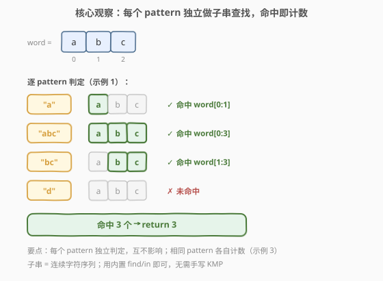
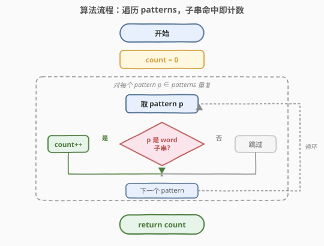
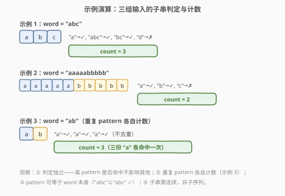

# 作为子字符串出现在单词中的字符串数目

- **题目名称**：作为子字符串出现在单词中的字符串数目
- **链接**：[1967. 作为子字符串出现在单词中的字符串数目](https://leetcode.cn/problems/number-of-strings-that-appear-as-substrings-in-word/)
- **难度**：简单
- **标签**：字符串、子串匹配、模拟

## 1. 题目概述

给你一个字符串数组 $patterns$ 和一个字符串 $word$，统计 $patterns$ 中有多少个字符串是 $word$ 的**子字符串**。返回字符串数目。

**子字符串**是字符串中的一个**连续**字符序列。

**示例 1**：

```text
输入：patterns = ["a","abc","bc","d"], word = "abc"
输出：3
解释：
- "a" 是 "abc" 的子字符串。
- "abc" 是 "abc" 的子字符串。
- "bc" 是 "abc" 的子字符串。
- "d" 不是 "abc" 的子字符串。
patterns 中有 3 个字符串作为子字符串出现在 word 中。
```

**示例 2**：

```text
输入：patterns = ["a","b","c"], word = "aaaaabbbbb"
输出：2
解释："a"✓、"b"✓、"c"✗，共 2 个。
```

**示例 3**：

```text
输入：patterns = ["a","a","a"], word = "ab"
输出：3
解释：patterns 中的每个字符串都作为子字符串出现在 word "ab" 中。
```

**约束条件**：

- $1 \le patterns.length \le 100$
- $1 \le patterns[i].length \le 100$
- $1 \le word.length \le 100$
- $patterns[i]$ 和 $word$ 仅由小写英文字母组成

> 💡 **审题关键**：① 「**子字符串**」强调**连续**字符序列，不是子序列（可不连续）；② 每个 $patterns[i]$ **独立判定**，互不影响；③ **重复 pattern 各自计数**——示例 3 中三个相同的 "a" 都命中，返回 3，**不能用 set 去重**；④ pattern 可以等于 word 本身（"abc" 是 "abc" 的子串 ✓）。

---

## 2. 解题思路

### 2.1 暴力思路：逐 pattern 枚举 word 的所有起点

最直觉的做法：对每个 pattern $p$，枚举 $word$ 中所有可能的起始位置 $i$（$0 \le i \le |word| - |p|$），逐一比对 $word[i:i+|p|]$ 是否等于 $p$。

```text
pattern "bc", word = "abc"：
  i=0: word[0:2]="ab" ≠ "bc"
  i=1: word[1:3]="bc" == "bc" ✓ → 命中，计数 +1
```

- **正确性**：穷举所有起点，覆盖子串所有可能出现的位置，命中即计数。
- **效率**：对单个 $p$ 需 $O(|word| \cdot |p|)$（每个起点比对最多 $|p|$ 个字符）；共 $n = |patterns|$ 个 pattern，总时间 $O\!\left(\sum_i |patterns[i]| \cdot |word|\right)$。约束下 $n, |word|, |p| \le 100$，最坏 $10^6$ 次字符比对，瞬时 AC。

> ⚠️ 暴力法的「浪费」在于：它把「子串查找」这件标准操作手写了一遍。而大多数语言的标准库已提供经过优化的子串查找（C++ 的 `string::find`、Python 的 `in`），不仅代码更短，实现也可能采用比朴素更快的算法。对于这种「判定型」题目，直接调用库函数即可。

### 2.2 核心观察：独立判定 + 库函数子串查找



关键洞察分三点：

**第一点：判定相互独立。** 每个 $patterns[i]$ 是否为 $word$ 的子串，是一个独立的 yes/no 问题——某个 pattern 命中与否不影响其他 pattern 的判定。因此无需任何预处理或数据结构，直接对每个 pattern 调用一次子串查找即可。

**第二点：用库函数代替手写。** 子串查找是字符串操作的标准原语：
- C++：`word.find(p) != string::npos`（返回首个匹配位置，未找到返回 `npos`）
- Python：`p in word`（底层为快速查找，常数极小）

库函数把「枚举起点 + 逐字符比对」封装成一次调用，代码更短、更不易出错，且实现经过优化。

**第三点：不能去重。** 示例 3 表明重复 pattern 各自计数（三个 "a" → 返回 3）。因此**不能用 set 对 patterns 去重**，必须逐个判定并累加。

$$\boxed{\text{count} = \sum_{p \in patterns} \mathbb{1}[\,p \text{ 是 } word \text{ 的子串}\,]}$$

> 💡 **为什么不去重也不预计算所有子串？** 一种看似「优化」的思路是：预先生成 $word$ 的所有子串存入 set，再查每个 pattern。但 ① $word$ 的子串数达 $O(|word|^2)$ 个，最坏 $10^4$，空间浪费；② 仍需遍历全部 patterns 做查询，时间并未减少；③ 去重对 patterns 无意义（题目要求重复各自计数）。因此预计算子串集合在该数据规模下是「负优化」。仅当 $|patterns| \gg |word|^2$ 时才有微弱收益。

> ⚠️ **易错点：把「子串」当成「子序列」。** 子串要求**连续**（如 "bc" 是 "abc" 的子串 ✓），子序列可不连续（如 "ac" 是 "abc" 的子序列但**不是**子串 ✗）。若误用双指针判定子序列，会把 "ac" 误判为命中。

### 2.3 算法流程图



整体为「遍历 + 判定 + 累加」的线性流程：

1. **初始化**：$count = 0$。
2. **遍历 patterns**：对每个 $p \in patterns$：
   - 调用库函数判定 $p$ 是否为 $word$ 的子串。
   - 若命中：$count\!+\!+$。
   - 若未命中：跳过。
3. **返回** $count$。

> 💡 **提前返回？** 本题**不需要**提前返回——必须遍历完所有 pattern 才能得出总数。与 [1961. 检查字符串是否为数组前缀](https://leetcode.cn/problems/check-if-string-is-a-prefix-of-array/) 中「命中即 return true」的判定型不同，本题是**计数型**，必须看完所有元素。

### 2.4 示例演算

以三个官方示例演示判定与计数过程：



**示例 1**（`patterns = ["a","abc","bc","d"]`, `word = "abc"`）：

| pattern | 查找结果 | 命中? | count |
|---------|----------|-------|-------|
| "a" | word[0:1] | ✓ | 1 |
| "abc" | word[0:3] | ✓ | 2 |
| "bc" | word[1:3] | ✓ | 3 |
| "d" | — | ✗ | 3 |

最终 $count = 3$。

**示例 2**（`patterns = ["a","b","c"]`, `word = "aaaaabbbbb"`）：word 含 5 个 'a' 与 5 个 'b'，"a"✓、"b"✓、"c"✗ → $count = 2$。

**示例 3**（`patterns = ["a","a","a"]`, `word = "ab"`）：三个相同的 "a" 各自命中 → $count = 3$（**不去重**）。

> 💡 **观察要点**：① 示例 1 中 pattern 可等于 word 本身（"abc"⊆"abc" ✓）；② 示例 3 中重复 pattern 各自计数，验证「不能去重」；③ 子串需连续，"ac" 虽是 "abc" 的子序列但不是子串。

---

## 3. 参考代码

### C++（`string::find` 判定）

```cpp
class Solution {
public:
    int numOfStrings(vector<string>& patterns, string word) {
        int count = 0;
        for (const string& p : patterns) {
            if (word.find(p) != string::npos) ++count;
        }
        return count;
    }
};
```

### Python（`in` 判定）

```python
class Solution:
    def numOfStrings(self, patterns: List[str], word: str) -> int:
        return sum(p in word for p in patterns)
```

### Python（手写朴素子串查找，对应 2.1 暴力思路）

```python
class Solution:
    def numOfStrings(self, patterns: List[str], word: str) -> int:
        def is_substring(p: str, w: str) -> bool:
            m, n = len(p), len(w)
            for i in range(n - m + 1):
                if w[i:i + m] == p:
                    return True
            return False

        return sum(is_substring(p, word) for p in patterns)
```

> 💡 **写法对照**：① C++ `find` 版与 Python `in` 版直接翻译思路，一行核心逻辑，面试默认先写这版；② 手写朴素版对应 2.1 暴力思路，显式体现「枚举起点 + 切片比对」，便于解释复杂度，但实际工程应优先用库函数。三版时间复杂度同为 $O\!\left(\sum_i |patterns[i]| \cdot |word|\right)$，约束下均瞬时返回。

> ⚠️ **C++ 的 `find` 与 Python 的 `in` 语义一致**：都返回/判定**首次**出现。本题只需「是否存在」，首次即够。若需统计出现次数或所有位置，则需循环查找或 KMP（见第 5 节）。

---

## 4. 复杂度分析

| 维度 | 库函数法 | 手写朴素法 | 说明 |
|------|---------|-----------|------|
| 时间复杂度 | $O\!\left(\sum_i \|patterns[i]\| \cdot \|word\|\right)$ | $O\!\left(\sum_i \|patterns[i]\| \cdot \|word\|\right)$ | 每 pattern 做一次子串查找，朴素查找为 $O(\|p\| \cdot \|word\|)$；库函数实现可能更快但渐近相同 |
| 空间复杂度 | $O(1)$ | $O(1)$ | 仅 count 累加器；Python 切片版若用 `w[i:i+m]` 临时切片则 $O(\|p\|)$，但可改为逐字符比对降至 $O(1)$ |

> 💡 本题 $|patterns|, |word|, |p| \le 100$，最坏约 $10^6$ 次字符比对，远在时限内。若数据规模放大（如 $|word| \le 10^5$、$|patterns| \le 10^5$），需改用 AC 自动机或多模式匹配（见第 5 节）。

---

## 5. 扩展：多模式匹配与子串查找算法

### 5.1 单模式子串查找的进阶

本题对单个 pattern 的查找用的是朴素算法。更高效的经典算法：

- **KMP**：$O(|p| + |word|)$，利用 $\pi$ 数组在失配时回退到最长真前缀，避免 $word$ 指针回退。适合 $|word|$ 较大时。
- **Rabin-Karp**：$O(|p| + |word|)$ 期望，滚动哈希。适合多模式（同长度可批量哈希比对）。
- **Boyer-Moore**：$O(|word| / |p|)$ 最优，从右向左匹配 + 坏字符/好后缀跳过。

> 💡 标准库的 `find`/`in` 在小规模下通常退化为朴素算法（常数小、cache 友好），大规模才切换到优化算法。本题规模下朴素已足够。

### 5.2 多模式匹配：当 patterns 很多时

若 $|patterns|$ 与 $|word|$ 都很大，逐 pattern 查找会退化为 $O(n \cdot |word| \cdot \overline{|p|})$。此时可用：

- **AC 自动机（Aho-Corasick）**：$O\!\left(\sum|p_i| + |word| + \text{匹配数}\right)$，一次扫描 $word$ 同时匹配所有 pattern，是多模式字符串匹配的招牌算法。
- **Trie + 失败指针**：AC 自动机的基础结构。

> ⚠️ 本题 $n \le 100$、$|word| \le 100$，用 AC 自动机是杀鸡用牛刀——构建 Trie 的开销远超朴素查找。但当题目升级为「$10^5$ 个 pattern、$10^5$ 长度的 word」时，AC 自动机是唯一可行解。

---

## 6. 面试要点

**Q1：为什么不能对 patterns 去重？**

> 示例 3 中 `patterns = ["a","a","a"]`，三个相同的 "a" 都命中，返回 3。题目要求统计 $patterns$ 中有多少个字符串是子串——按**位置**计数而非按**不同值**计数。若用 set 去重，会误返回 1。必须逐个遍历并累加。

**Q2：子串和子序列的区别？本题会混淆吗？**

> 子串要求**连续**，子序列允许**跳跃**。如 "ac" 是 "abc" 的子序列但不是子串。本题明确是子串，判定时必须保证连续——用 `find`/`in` 天然保证连续；若手写双指针判定子序列会出错。审题时看到「子字符串 / substring」即连续。

**Q3：库函数 `find`/`in` 与手写朴素查找的取舍？**

> 渐近复杂度相同，但库函数 ① 代码更短更不易错；② 实现可能优化（如 libc++ 在长串场景切换算法）；③ 经充分测试，边界处理可靠。面试中先用库函数给出正确解，再口述朴素算法的复杂度与优化方向（KMP/AC 自动机）。仅在面试官要求「手写子串查找」时才实现 KMP 等。

**Q4：pattern 可以等于 word 本身吗？**

> 可以。题目定义子串为「字符串中的一个连续字符序列」，整个字符串本身也是自身的子串（$word[0:|word|]$）。示例 1 中 "abc" 是 "abc" 的子串 ✓。`find` 返回 0，`in` 返回 True，判定正确。

**Q5：如果数据规模放大到 $10^5$，如何优化？**

> 逐 pattern 朴素查找会超时。改用 **AC 自动机**：将所有 pattern 建 Trie + 失败指针，一次扫描 $word$ 即可同时匹配所有 pattern，时间 $O\!\left(\sum|p_i| + |word| + \text{输出}\right)$。这是多模式字符串匹配的标准解法。

> 💡 **一句话总结**：每个 pattern 独立调用库函数判定是否为 word 的子串，命中即累加——$O\!\left(\sum|p_i| \cdot |word|\right)$ 时间、$O(1)$ 空间，不去重、不预计算，最直接的计数题。

---

## 7. 同类练习题

- [28. 找出字符串中第一个匹配项的下标](https://leetcode.cn/problems/find-the-index-of-the-first-occurrence-in-a-string/)（[题解](../0001-0100/28_找出字符串中第一个匹配项的下标.md)）：从「判定是否存在」升级为「定位首次出现位置」，是子串查找的母题，KMP/Rabin-Karp 的练习场
- [1961. 检查字符串是否为数组前缀](https://leetcode.cn/problems/check-if-string-is-a-prefix-of-array/)（[题解](../1901-2000/1961_检查字符串是否为数组前缀.md)）：同区间邻居，从「子串」收紧为「前缀拼接」，对照体会前缀匹配（无需回退）与子串匹配的差异
- [1455. 检查单词是否为句中其他单词的前缀](https://leetcode.cn/problems/check-if-a-word-occurs-as-a-prefix-of-any-word-in-a-sentence/)（[题解](../1401-1500/1455_检查单词是否为句中其他单词的前缀.md)）：前缀判定的镜像变体——给定词判定它是否为句子中某词的前缀，同套逐字符比对思路
- [1933. 判断字符串是否可分解为值均等的子串](https://leetcode.cn/problems/check-if-string-is-decomposable-into-value-equal-substrings/)（[题解](../1901-2000/1933_判断字符串是否可分解为值均等的子串.md)）：同区间邻居，同属「子串」家族，从「判定 pattern 是否为子串」转为「将串分解为等值子串并校验段长」，共享「连续字符段」概念
