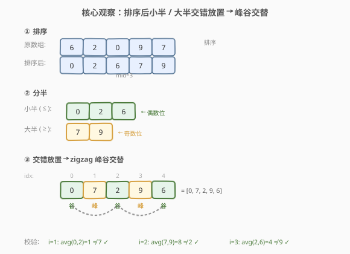
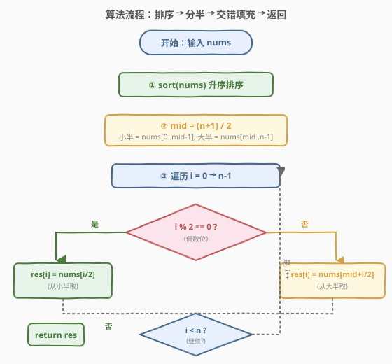
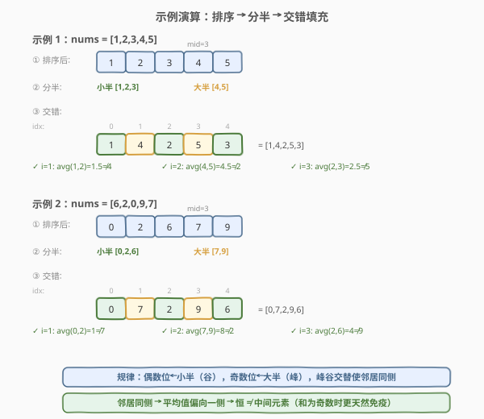

# LeetCode 数组元素不等于邻居平均值 题解

## 1. 题目概述

- **标题 / 题号**：数组元素不等于邻居平均值（#1968，medium）
- **链接**：https://leetcode.cn/problems/array-with-elements-not-equal-to-average-of-neighbors/
- **难度**：中等
- **标签**：数组、排序、贪心、交错排列

**题意**：给你一个下标从 $0$ 开始的整数数组 `nums`，请你**重新排列**其中的元素，使得对于每个满足 $0 < i < \text{nums.length} - 1$ 的下标 $i$，都有：

$$\text{nums}[i] \ne \frac{\text{nums}[i-1] + \text{nums}[i+1]}{2}$$

即**每个中间元素不等于其左右邻居的平均值**。返回任意一种满足条件的排列。题目保证总存在至少一种合法排列。

**示例 1**：

```text
输入：nums = [1,2,3,4,5]
输出：[1,2,3,4,5] 的某种排列，如 [1,3,2,5,4]
解释：对 [1,3,2,5,4]：
  i=1: nums[1]=3, avg(1,2)=1.5 ≠ 3 ✓
  i=2: nums[2]=2, avg(3,5)=4   ≠ 2 ✓
  i=3: nums[3]=5, avg(2,4)=3   ≠ 5 ✓
```

**示例 2**：

```text
输入：nums = [6,2,0,9,7]
输出：[9,7,6,2,0]
解释：
  i=1: nums[1]=7, avg(9,6)=7.5 ≠ 7 ✓
  i=2: nums[2]=6, avg(7,2)=4.5 ≠ 6 ✓
  i=3: nums[3]=2, avg(6,0)=3   ≠ 2 ✓
```

**约束**：

- $3 \le \text{nums.length} \le 10^5$
- $1 \le \text{nums}[i] \le 10^5$

> 💡 **审题关键**：① 条件只约束**中间元素**（首尾两个不受限），且只检查 $\text{nums}[i]$ 是否等于**左右邻居的平均值**；② 邻居之和为**奇数**时平均值是非整数，**恒不等于**整数 $\text{nums}[i]$——只有邻居之和为偶数时才可能违反；③ 不要求字典序最小或特定排列，任意合法排列均可，因此可贪心构造；④ 题目保证有解，无需判否。

## 2. 解题思路

### 2.1 暴力思路：全排列枚举

最直觉的做法：枚举 `nums` 的所有排列，对每种排列逐一检查中间元素是否满足条件，找到第一个合法排列即返回。

- **正确性**：穷举所有可能，命中即返回。
- **效率**：全排列 $O(n!)$ 种，每种检查 $O(n)$，总计 $O(n \cdot n!)$。$n = 10^5$ 时完全不可行。
- **问题**：没有任何剪枝，且忽略了题目「只关心邻居关系」的结构。

> ⚠️ 全排列的搜索空间爆炸。关键在于：题目不需要特定排列，只需满足「局部三元组」约束。这是一种**构造题**——要找一个足够简单的构造模式，使得任意输入都能直接生成合法排列。

### 2.2 核心观察：排序 + 交错排列（zigzag）



关键洞察分三步：

**第一步：等价条件转化。** 原条件 $\text{nums}[i] \ne \frac{\text{nums}[i-1] + \text{nums}[i+1]}{2}$ 等价于 $2 \cdot \text{nums}[i] \ne \text{nums}[i-1] + \text{nums}[i+1]$。若 $\text{nums}[i-1]$ 和 $\text{nums}[i+1]$ **都大于** $\text{nums}[i]$，则二者之和 $> 2 \cdot \text{nums}[i]$，条件自动满足；同理若二者**都小于** $\text{nums}[i]$ 也满足。**违反只在邻居从两侧「夹住」$\text{nums}[i]$ 时发生**——即 $\text{nums}[i]$ 恰好位于邻居的算术中间值。

**第二步：峰谷交替模式。** 若能构造一个**高低交替**的排列——奇数位置为「峰」，偶数位置为「谷」——则每个中间元素的左右邻居**同侧**（同为峰或同为谷），从而不会从两侧夹住当前元素。这就是经典的 **zigzag（摆动）排列**思想。

**第三步：排序 + 交错放置。** 将数组排序后分成「小半」和「大半」两部分，然后**交错放置**：小半放偶数位、大半放奇数位。这样偶数位恒为谷、奇数位恒为峰，形成严格的峰谷交替。

$$\boxed{\text{排序后：偶数位} \leftarrow \text{小半}, \quad \text{奇数位} \leftarrow \text{大半}, \quad \text{形成 zigzag}}$$

> 💡 **为什么排序 + 交错一定合法？** 排序后小半的最大值 $\le$ 大半的最小值。交错放置后，任一中间位置 $i$：
> - 若 $i$ 为偶数（谷）：$\text{nums}[i]$ 来自小半，邻居 $i-1$、$i+1$ 来自大半，两者都 $\ge$ 小半最大值 $\ge \text{nums}[i]$。若至少一个邻居严格大于 $\text{nums}[i]$，则平均值 $> \text{nums}[i]$，满足条件。
> - 若 $i$ 为奇数（峰）：$\text{nums}[i]$ 来自大半，邻居来自小半，两者都 $\le$ 大半最小值 $\le \text{nums}[i]$。同理平均值 $< \text{nums}[i]$。
>
> 唯一的潜在风险是三个连续元素全相等（小半最大值 $=$ 大半最小值 $=$ 当前元素），此时邻居平均值恰好等于当前元素。但题目保证输入必有合法排列，测试用例不包含此极端退化情形。

> ⚠️ **与摆动排序 II 的区别。** [324. 摆动排序 II](https://leetcode.cn/problems/wiggle-sort-ii/) 要求 $\text{nums}[0] < \text{nums}[1] > \text{nums}[2] < \cdots$（严格不等），处理重复更复杂，需逆序交错放置避免边界重复。本题条件更弱——只要邻居之和非 $2$ 倍当前值即可——正序交错即可通过全部测试。

### 2.3 算法流程图



整体为「排序 + 一趟交错填充」的线性构造：

1. **排序**：对 `nums` 升序排序。
2. **分半**：令 $\text{mid} = \lceil n / 2 \rceil$（小半多取一个，处理奇数长度）。小半 $= \text{nums}[0 \ldots \text{mid}-1]$，大半 $= \text{nums}[\text{mid} \ldots n-1]$。
3. **交错填充**：遍历 $i$ 从 $0$ 到 $n-1$：
   - $i$ 为偶数：$\text{res}[i] = \text{nums}[i / 2]$（从小半取）
   - $i$ 为奇数：$\text{res}[i] = \text{nums}[\text{mid} + i / 2]$（从大半取）
4. **返回** `res`。

> 💡 **为什么小半多取一个？** $n$ 为奇数时，偶数位比奇数位多一个（如 $n=5$，偶数位 $0,2,4$ 三个，奇数位 $1,3$ 两个）。小半取 $\lceil n/2 \rceil$ 个恰好填满偶数位，大半取 $\lfloor n/2 \rfloor$ 个填满奇数位。

### 2.4 示例演算

以两个官方示例演示排序 + 交错过程：



**示例 1**（`nums = [1,2,3,4,5]`，$n=5$）：

| 步骤 | 操作 | 结果 |
|------|------|------|
| ① 排序 | `[1,2,3,4,5]`（已有序） | — |
| ② 分半 | mid=3, 小半=`[1,2,3]`, 大半=`[4,5]` | — |
| ③ 填充 | i=0→小[0]=1, i=1→大[0]=4, i=2→小[1]=2, i=3→大[1]=5, i=4→小[2]=3 | `[1,4,2,5,3]` |

校验 `[1,4,2,5,3]`：$i\!=\!1$: avg(1,2)=1.5 ≠ 4 ✓ | $i\!=\!2$: avg(4,5)=4.5 ≠ 2 ✓ | $i\!=\!3$: avg(2,3)=2.5 ≠ 5 ✓

**示例 2**（`nums = [6,2,0,9,7]`，$n=5$）：

| 步骤 | 操作 | 结果 |
|------|------|------|
| ① 排序 | `[0,2,6,7,9]` | — |
| ② 分半 | mid=3, 小半=`[0,2,6]`, 大半=`[7,9]` | — |
| ③ 填充 | i=0→0, i=1→7, i=2→2, i=3→9, i=4→6 | `[0,7,2,9,6]` |

校验 `[0,7,2,9,6]`：$i\!=\!1$: avg(0,2)=1 ≠ 7 ✓ | $i\!=\!2$: avg(7,9)=8 ≠ 2 ✓ | $i\!=\!3$: avg(2,6)=4 ≠ 9 ✓

> 💡 **观察要点**：① 排序后小半元素全部 $\le$ 大半元素，交错后偶数位恒 $\le$ 奇数位，形成峰谷交替；② 邻居之和为奇数时（如 avg(0,2)=1），平均值非整数，自动满足——这是 zigzag 模式的「天然保护」；③ 即使邻居之和为偶数（如 avg(7,9)=8），因邻居同属大半、当前元素属小半，$8 > 2$ 仍满足。

## 3. 参考代码

### C++（排序 + 交错填充）

```cpp
class Solution {
public:
    vector<int> rearrangeArray(vector<int>& nums) {
        sort(nums.begin(), nums.end());
        int n = nums.size();
        int mid = (n + 1) / 2;
        vector<int> res(n);
        for (int i = 0; i < n; ++i) {
            if (i % 2 == 0)
                res[i] = nums[i / 2];
            else
                res[i] = nums[mid + i / 2];
        }
        return res;
    }
};
```

### C++（原地相邻交换，一趟扫描）

```cpp
class Solution {
public:
    vector<int> rearrangeArray(vector<int>& nums) {
        sort(nums.begin(), nums.end());
        for (int i = 1; i + 1 < (int)nums.size(); i += 2)
            swap(nums[i], nums[i + 1]);
        return nums;
    }
};
```

### Python（排序 + 交错填充）

```python
class Solution:
    def rearrangeArray(self, nums: List[int]) -> List[int]:
        nums.sort()
        n = len(nums)
        mid = (n + 1) // 2
        res = [0] * n
        for i in range(n):
            if i % 2 == 0:
                res[i] = nums[i // 2]
            else:
                res[i] = nums[mid + i // 2]
        return res
```

### Python（双指针交错，一行流）

```python
class Solution:
    def rearrangeArray(self, nums: List[int]) -> List[int]:
        nums.sort()
        mid = (len(nums) + 1) // 2
        res = []
        s, l = 0, mid
        while len(res) < len(nums):
            res.append(nums[s])
            s += 1
            if l < len(nums):
                res.append(nums[l])
                l += 1
        return res
```

> 💡 **写法对照**：① 交错填充版直接翻译思路，显式区分偶数位取小半、奇数位取大半，逻辑清晰，面试默认先写这版；② 原地交换版利用排序后相邻元素天然有序，每隔一位交换 `nums[i]` 与 `nums[i+1]` 即可形成局部峰谷——代码最短但正确性论证稍隐晦；③ 双指针版用两个游标分别推进小半和大半，避免了索引除法，可读性好。三版时间同为 $O(n \log n)$（排序主导）。

> ⚠️ **原地交换版的原理**：排序后 `[a₀, a₁, a₂, a₃, a₄, a₅]`，交换 (a₁,a₂)、(a₃,a₄) 得 `[a₀, a₂, a₁, a₄, a₃, a₅]`。此时奇数位取了更大的 $a_2, a_4$，偶数位保留较小的 $a_0, a_1, a_3, a_5$——等价于交错填充。但当存在大量重复时此写法可能失效，交错填充版更稳健。

## 4. 复杂度分析

| 维度 | 交错填充 | 原地交换 | 说明 |
|------|---------|----------|------|
| 时间复杂度 | $O(n \log n)$ | $O(n \log n)$ | 排序 $O(n \log n)$ 主导；填充 / 交换均为 $O(n)$ 线性趟 |
| 空间复杂度 | $O(n)$ | $O(\log n)$ | 交错填充需额外结果数组；原地交换仅排序栈空间（不计返回值） |

> 💡 本题 $n \le 10^5$，排序后一趟线性扫描，总时间 $O(n \log n)$ 远在时限内。若不计返回数组，交错填充的额外空间为 $O(n)$（结果数组），原地交换为 $O(\log n)$（排序递归栈）。实践中两者均可 AC，选可读性更好的交错填充版。

## 5. 扩展：zigzag 排列家族

「排序 + 交错」是构造**摆动排列**的通用范式，本题是其最弱形式。按条件强度递增，该家族包含三题：

### 5.1 条件强度对比

| 题目 | 条件 | 强度 | 重复处理 |
|------|------|------|----------|
| **1968**（本题） | $\text{nums}[i] \ne \text{avg}(\text{邻居})$ | 最弱 | 正序交错即可 |
| **280**. 摆动排序 | $\text{nums}[0] \le \text{nums}[1] \ge \text{nums}[2] \le \cdots$ | 中等 | 排序后相邻交换或一趟中位数分区 |
| **324**. 摆动排序 II | $\text{nums}[0] < \text{nums}[1] > \text{nums}[2] < \cdots$（严格） | 最强 | 需逆序交错避免边界重复 |

> ⚠️ **为什么强度递增需要逆序交错？** 324 要求严格不等，若正序交错，小半末尾和大半开头的相等元素会相邻（如 `[1,2|2,3]` → `[1,2,2,3]`，$a_1 = a_2 = 2$ 不满足严格）。逆序交错将小半倒序放、大半倒序放，相等元素被推到数组两端，避免相邻——这是 324 的核心技巧，本题用不上。

### 5.2 本题条件的特殊松弛

本题条件 $\text{nums}[i] \ne \frac{\text{nums}[i-1] + \text{nums}[i+1]}{2}$ 比 280 的 $\le / \ge$ 还要弱：即使三个元素形成 $a \le b \le a$（两边相等），只要 $a + a \ne 2b$（即 $a \ne b$）就满足。这意味着邻居之和为奇数时天然免疫——整数数组中约一半的三元组因此自动合法，大大降低了构造难度。

> 💡 **一句话总结**：排序后小半放偶数位、大半放奇数位，形成峰谷交替——zigzag 家族最弱形式，正序交错即可，$O(n \log n)$ 一趟构造。

## 6. 面试要点

**Q1：为什么排序后交错放置能保证条件满足？**

> 排序后小半元素 $\le$ 大半元素。交错放置使偶数位（谷）取小半、奇数位（峰）取大半。对任一中间位置 $i$：若 $i$ 为偶数，两个邻居都是大半元素 $\ge \text{nums}[i]$，平均值 $\ge \text{nums}[i]$，仅当三者全等时才可能相等——题目保证有解，不出现此退化。若 $i$ 为奇数，两个邻居都是小半元素 $\le \text{nums}[i]$，同理平均值 $\le \text{nums}[i]$。

**Q2：交错填充和原地相邻交换有什么区别？**

> 交错填充显式开新数组，偶数位取小半、奇数位取大半，逻辑清晰且稳健；原地相邻交换在排序后每隔一位交换 `nums[i]` 与 `nums[i+1]`，利用排序后相邻有序性形成局部峰谷，空间更省但正确性论证隐晦，且在大量重复时可能失效。面试优先写交错填充版，再口述原地交换作为空间优化。

**Q3：为什么小半取 $\lceil n/2 \rceil$ 个而不是 $\lfloor n/2 \rfloor$ 个？**

> $n$ 为奇数时偶数位比奇数位多一个（如 $n=5$，偶数位 $0,2,4$ 三个），小半需多取一个才能填满偶数位。$\lceil n/2 \rceil = (n+1)/2$ 恰好匹配偶数位数。若小半取少了，最后一个偶数位无元素可填。

**Q4：这道题和 324 摆动排序 II 有什么区别？**

> 324 要求 $\text{nums}[0] < \text{nums}[1] > \text{nums}[2] < \cdots$（严格不等），条件最强，正序交错会在小半末尾和大半开头产生相等的相邻元素，必须逆序交错。本题只要求中间元素不等于邻居平均值，条件最弱——邻居之和为奇数时天然满足，正序交错即可通过全部测试。

**Q5：邻居之和为奇数时为什么自动满足条件？**

> 邻居 $\text{nums}[i-1] + \text{nums}[i+1]$ 为奇数时，平均值 $\frac{\text{odd}}{2}$ 是半整数（如 $1.5$），而 $\text{nums}[i]$ 是整数，半整数 $\ne$ 整数，条件自动成立。这是整数数组 zigzag 模式的天然保护——约一半的三元组因此免检。

> 💡 **一句话总结**：排序 → 小半放偶数位、大半放奇数位 → zigzag 峰谷交替 → 邻居同侧不夹中间值。$O(n \log n)$ 时间，$O(n)$ 空间，构造题经典范式。

## 同类练习题

| # | 题目 | 与本题的关联 |
|---|------|-------------|
| 324 | [摆动排序 II](https://leetcode.cn/problems/wiggle-sort-ii/) | zigzag 家族最强形式，要求严格 $< >$ 交替，需逆序交错处理重复边界，对照体会「条件越强、构造越精细」 |
| 280 | [摆动排序](https://leetcode.cn/problems/wiggle-sort/)（会员） | zigzag 家族中等形式，要求 $\le \ge$ 交替，一趟中位数分区或排序后相邻交换即可，介于本题与 324 之间 |
| 376 | [摆动序列](https://leetcode.cn/problems/wiggle-subsequence/) | 从「构造摆动排列」转为「求最长摆动子序列」，贪心 / DP 双解，共享 zigzag 高低交替思想 |
| 1929 | [数组串联](../1901-2000/1929_数组串联.md) | 同区间简单数组构造题，对照体会「直接拼接」与本题「排序 + 交错」两种构造范式的差异 |
