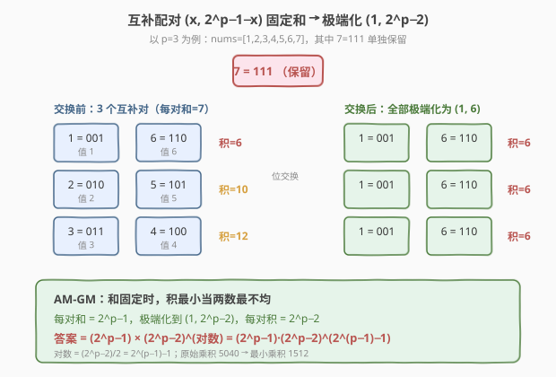
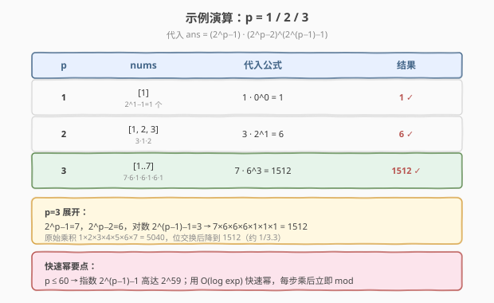

# LeetCode 数组元素的最小非零乘积 题解

## 1. 题目概述

- **标题 / 题号**：数组元素的最小非零乘积（#1969，medium）
- **链接**：https://leetcode.cn/problems/minimum-non-zero-product-of-the-array-elements/
- **难度**：中等
- **标签**：数学、快速幂、贪心、位运算

**题意**：给定正整数 $p$。有一个下标从 1 开始的数组 `nums`，包含范围 $[1, 2^p - 1]$ 内所有整数的二进制形式（两端都包含）。可以进行以下操作**任意次**：

- 从 `nums` 中选择两个元素 $x$ 和 $y$；
- 选择 $x$ 中的一位与 $y$ 对应位置（相同二进制位）的位交换。

求操作任意次后，`nums` 能得到的**最小非零**乘积。将乘积对 $10^9 + 7$ 取余后返回。

> **注意**：答案应为取余之前的最小值，最后再取余。所有元素必须保持非零（即每个数至少有一位是 1）。

**示例 1**：

```text
输入：p = 1
输出：1
解释：nums = [1]，只有一个元素，乘积为 1。
```

**示例 2**：

```text
输入：p = 2
输出：6
解释：nums = [01, 10, 11] = [1, 2, 3]，乘积 1*2*3 = 6 已是最小值。
```

**示例 3**：

```text
输入：p = 3
输出：1512
解释：nums = [001,010,011,100,101,110,111] = [1..7]
经位交换得到 [1,6,1,6,1,6,7]，乘积 1*6*1*6*1*6*7 = 1512。
```

**约束**：

- $1 \le p \le 60$

## 2. 解题思路

### 2.1 暴力思路

最直接的想法是枚举所有可能的位交换结果。但 $p$ 可达 60，数组有 $2^p - 1$ 个元素（天文数字），状态空间是 $p^{2^p}$ 量级，完全无法枚举。

> 需要换角度：不要「枚举交换结果」，而要发现**位交换的守恒量**——每位 1 的总数不变——再用数学直接定出最优分配。

### 2.2 核心观察：位守恒 + 互补配对



**观察 1（位守恒）**：交换同位置的位，不改变每个二进制位上 1 的**总个数**。在 $[1, 2^p - 1]$ 中，每个位 $i$ 恰有 $2^{p-1}$ 个 1（因为在 $[0, 2^p-1]$ 中各占一半，而 0 贡献 0）。

**观察 2（互补配对）**：把 $2^p - 1$（全 1，即 `111..111`）单独保留；剩下 $2^p - 2$ 个数可两两配对成 $(x,\ 2^p-1-x)$，每对之和恒为 $2^p - 1$。例如 $p=3$ 时配对为 $(1,6),(2,5),(3,4)$。

**观察 3（AM-GM 定乘积下界）**：对一对固定和 $S = 2^p-1$ 的正数 $(x, S-x)$，其乘积 $x(S-x)$ 是关于 $x$ 的**凹函数**，在 $x = S/2$ 处取最大，在端点 $x=1$（最小非零值）处取**最小**值 $1 \cdot (S-1) = 2^p - 2$。因此每对都应极端化为 $(1,\ 2^p-2)$。

> 💡 **关键直觉**：正数和固定时，乘积最小当各数**最不均匀**——尽量制造一堆 1 和一个大盘子。这正是 AM-GM 的反向应用（AM-GM 给出上界 $\le (S/2)^2$，端点给出下界）。

### 2.3 公式推导：位计数验证可行性


极端化目标分配为：$1$ 个 $2^p-1$、$2^{p-1}-1$ 个 $2^p-2$、$2^{p-1}-1$ 个 $1$。需验证它满足位守恒：

- $2^p-1 = \underbrace{11\cdots1}_{p}$ 用掉每位 $1$ 个，每位剩余 $2^{p-1}-1$ 个 1；
- $2^p-2 = \underbrace{11\cdots1}_{p-1}0$ 在位 $1\sim p-1$ 各贡献 1，共 $2^{p-1}-1$ 份 → 每位补 $2^{p-1}-1$ 个 1 ✓；
- $1 = \underbrace{00\cdots0}_{p-1}1$ 在位 0 贡献 1，共 $2^{p-1}-1$ 份 → 位 0 补 $2^{p-1}-1$ 个 1 ✓。

总数 $1 + 2(2^{p-1}-1) = 2^p - 1$ ✓，每位计数全部对齐，故该分配**可达**。于是最小乘积为：

$$
\text{ans} = (2^p - 1) \cdot (2^p - 2)^{\,2^{p-1}-1} \cdot 1^{\,2^{p-1}-1} = (2^p - 1)\,(2^p - 2)^{\,2^{p-1}-1}
$$

其中对数 $= (2^p-2)/2 = 2^{p-1}-1$。

### 2.4 算法流程：快速幂

$p \le 60$，指数 $2^{p-1}-1$ 高达 $2^{59} \approx 5.8 \times 10^{17}$，朴素累乘不可行。用**快速幂**把 $O(\text{exp})$ 降到 $O(\log \text{exp})$：

1. 计算 $a = (2^p - 1) \bmod \text{MOD}$、$\text{base} = (2^p - 2) \bmod \text{MOD}$、$\text{exp} = 2^{p-1} - 1$；
2. 用快速幂求 $\text{base}^{\text{exp}} \bmod \text{MOD}$；
3. 返回 $a \cdot \text{base}^{\text{exp}} \bmod \text{MOD}$。

> ⚠️ **取模细节**：$2^p$ 在 $p=60$ 时约 $1.15\times 10^{18}$，C++ 中需 `1LL << p` 并先 `% MOD` 再参与乘法；每步乘法后立即取模防溢出。$p=1$ 时 $\text{base}=0,\text{exp}=0$，按空积约定 $0^0=1$，快速幂循环不执行直接返回 1，无需特判。

### 2.5 示例演算



| $p$ | nums | 代入公式 | 结果 |
|-----|------|----------|------|
| $1$ | $[1]$ | $1 \cdot 0^0 = 1$ | $1$ ✓ |
| $2$ | $[1,2,3]$ | $3 \cdot 2^1 = 6$ | $6$ ✓ |
| $3$ | $[1..7]$ | $7 \cdot 6^3 = 1512$ | $1512$ ✓ |

以 $p=3$ 为例：$2^p-1=7$，$2^p-2=6$，对数 $2^{p-1}-1=3$，故 $7 \times 6 \times 6 \times 6 = 1512$；原始乘积 $5040$ 经位交换降到 $1512$。

## 3. 参考代码

### C++

```cpp
class Solution {
    static const long long MOD = 1e9 + 7;

    long long quickPow(long long base, long long exp) {
        long long result = 1;
        base %= MOD;
        while (exp > 0) {
            if (exp & 1) result = result * base % MOD;
            base = base * base % MOD;
            exp >>= 1;
        }
        return result;
    }

public:
    int minNonZeroProduct(int p) {
        long long a    = ((1LL << p) - 1) % MOD;   // 2^p - 1
        long long base = ((1LL << p) - 2) % MOD;   // 2^p - 2
        long long exp  = (1LL << (p - 1)) - 1;     // 2^(p-1) - 1 = 对数
        return a * quickPow(base, exp) % MOD;
    }
};
```

### Python

```python
class Solution:
    def minNonZeroProduct(self, p: int) -> int:
        MOD = 10**9 + 7
        a    = (1 << p) - 1          # 2^p - 1
        base = (1 << p) - 2          # 2^p - 2
        exp  = (1 << (p - 1)) - 1    # 2^(p-1) - 1
        return a * pow(base, exp, MOD) % MOD
```

> 💡 **Python 内置 `pow(x, e, mod)`** 即 $O(\log e)$ 模幂，底层 C 实现，比手写更快。C++ 标准库无等价物（`std::pow` 是浮点版），故手写 `quickPow`。`p=1` 时 `pow(0, 0, MOD)` 返回 1，自动处理空积。

> ⚠️ **`1LL << p` 而非 `1 << p`**：$p$ 可达 60，`1 << 60` 在 32 位 `int` 上是未定义行为；C++ 必须用 `1LL << p` 保证 `long long`。

## 4. 复杂度分析

| 维度 | 复杂度 | 说明 |
|------|--------|------|
| 时间复杂度 | $O(\log(2^{p-1})) = O(p)$ | 一次快速幂，指数为 $2^{p-1}-1$，迭代 $\approx p$ 次（指数的位数） |
| 空间复杂度 | $O(1)$ | 仅维护 `result`、`base`、`exp` 等常数个变量 |

## 5. 扩展：为何「全 1 数」必须单独保留

$2^p - 1 = \underbrace{11\cdots1}_{p}$ 是唯一一个所有位都为 1 的数。若把它也并入配对，则其互补数为 $0$（不在数组中），无法配对；且它的每一位都是 1，无法再「抽走」任何位来制造更多的 1（它本身就是最大的极端）。保留它后，剩余 $2^p-2$ 个数恰能配成 $2^{p-1}-1$ 对互补对，每对独立极端化即可。

另一种等价视角：直接做**位计数**分配——每位 $2^{p-1}$ 个 1 中拨 1 个给 $2^p-1$，剩余 $2^{p-1}-1$ 个 1 在高位集中给 $2^{p-1}-1$ 个数（凑成 $2^p-2$）、在最低位集中给另外 $2^{p-1}-1$ 个数（凑成 1）。两种视角殊途同归。

## 6. 面试要点

1. **位交换的守恒量是什么？为什么这是突破口？**

   > 每个二进制位上 1 的**总个数**守恒（交换只在同位间搬运）。一旦发现守恒量，就把「搜索交换方案」转化为「在守恒约束下求极值」的数学问题，状态空间从天文数字塌缩到一个公式。

2. **为什么最小乘积要把每对极端化为 $(1, 2^p-2)$？**

   > 互补对 $(x, 2^p-1-x)$ 固定和 $2^p-1$，乘积 $x(2^p-1-x)$ 是凹函数，在端点 $x=1$ 处取最小值 $2^p-2$。AM-GM 给出乘积上界 $(S/2)^2$，端点给出下界——和固定时，数越不均匀乘积越小。

3. **如何证明这种极端分配一定可达（不会违反位守恒）？**

   > 逐位核对：$2^p-1$ 用掉每位 1 个，剩 $2^{p-1}-1$；$2^{p-1}-1$ 个 $2^p-2$（高位全 1、最低位 0）补足位 $1\sim p-1$；$2^{p-1}-1$ 个 $1$（最低位 1）补足位 0。每位计数全部对齐，且总数 $1+2(2^{p-1}-1)=2^p-1$，故可达。

4. **$p=1$ 时公式给出 $1 \cdot 0^0$，如何处理？**

   > $0^0$ 按空积约定为 1。快速幂中 `exp=0` 时循环不执行、`result` 初值 1 直接返回；Python `pow(0,0,MOD)` 也返回 1。因此无需特判，公式对 $p=1$ 仍成立。

5. **C++ 实现有哪些溢出/类型坑？**

   > 三点：(a) `1 << p` 在 $p\ge 31$ 时对 32 位 `int` 是未定义行为，必须写 `1LL << p`；(b) $2^{60}\approx 1.15\times 10^{18}$，`% MOD` 后再乘避免 `MOD^2 \approx 10^{18}` 接近 `long long` 上限的风险；(c) `quickPow` 内 `base %= MOD` 先归约。

## 同类练习题

| # | 题目 | 与本题的关联 |
|---|------|-------------|
| 1922 | [统计好数字的数目](https://leetcode.cn/problems/count-good-numbers/)（[题解](../1901-2000/1922_统计好数字的数目.md)） | 同区间同套路——组合计数 + 快速幂取模，本题直接复用其 `quickPow` 模板 |
| 50 | [Pow(x, n)](https://leetcode.cn/problems/powx-n/)（[题解](../0001-0100/50_Powx_n.md)） | 快速幂的母题，掌握 $O(\log n)$ 二分平方思想 |
| 372 | [超级次方](https://leetcode.cn/problems/super-pow/)（[题解](../0301-0400/372_超级次方.md)） | 指数以数组形式给出的模幂进阶题，同样基于快速幂 + 模运算性质 |
| 29 | [两数相除](https://leetcode.cn/problems/divide-two-integers/)（[题解](../0001-0100/29_两数相除.md)） | 位运算「倍增翻倍」与快速幂同源，对照 $O(\log n)$ 二进制拆解范式 |
