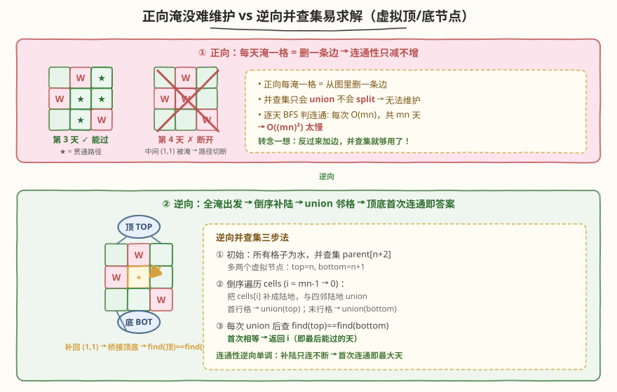
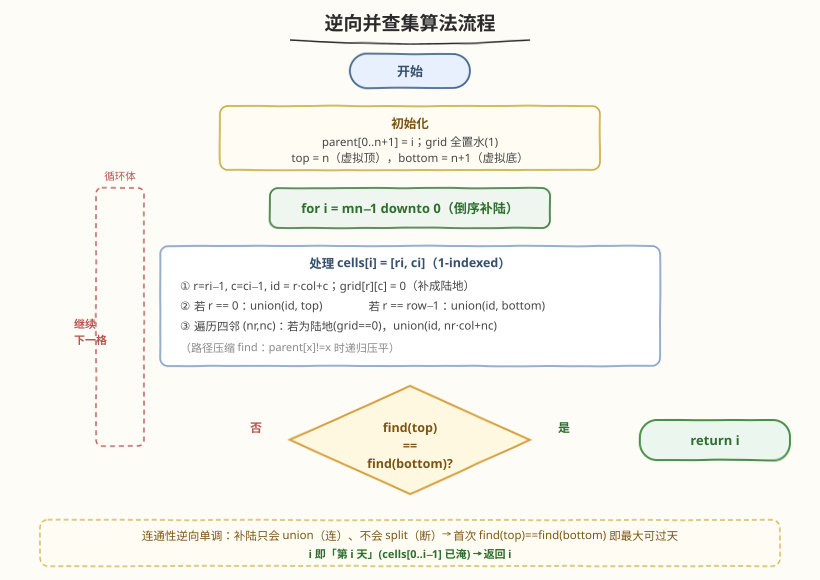
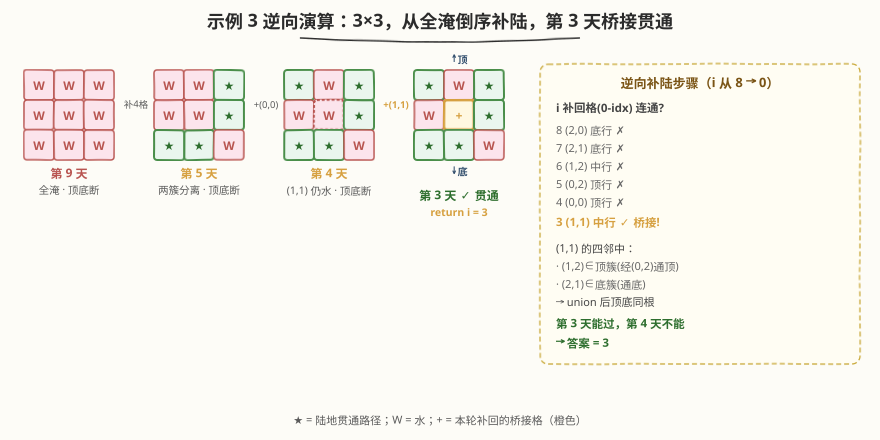

# 你能穿过矩阵的最后一天

- **题目名称**：你能穿过矩阵的最后一天
- **链接**：[1970. 你能穿过矩阵的最后一天](https://leetcode.cn/problems/last-day-where-you-can-still-cross/)
- **难度**：困难
- **标签**：并查集、二分查找、广度优先搜索、网格、连通性

## 1. 题目概述

给你一个下标从 **1** 开始的二进制矩阵，`0` 表示陆地、`1` 表示水域。矩阵有 `row` 行 `col` 列。一开始（第 `0` 天）整个矩阵都是陆地；每一天都会有一块陆地被水淹没变成水域。

给你一个下标从 **1** 开始的二维数组 `cells`，其中 `cells[i] = [ri, ci]` 表示在第 `i` 天，第 `ri` 行 `ci` 列（坐标均从 1 开始）的陆地变成水域。

你想知道：从矩阵**最上面一行**走到**最下面一行**，且只经过陆地格子的**最后一天**是第几天。可从最上面一行的**任意**格子出发，到达最下面一行的**任意**格子，只能沿上下左右四个方向移动。

**示例 1**：

```text
输入：row = 2, col = 2, cells = [[1,1],[2,1],[1,2],[2,2]]
输出：2
解释：第 1 天淹 (1,1)；第 2 天淹 (2,1)，右列仍贯通；第 3 天淹 (1,2) 后顶行全水，无法渡过。
```

**示例 2**：

```text
输入：row = 2, col = 2, cells = [[1,1],[1,2],[2,1],[2,2]]
输出：1
解释：第 1 天淹 (1,1)，仍有路径；第 2 天淹 (1,2) 后顶行两格全水，无法出发。
```

**示例 3**：

```text
输入：row = 3, col = 3, cells = [[1,2],[2,1],[3,3],[2,2],[1,1],[1,3],[2,3],[3,2],[3,1]]
输出：3
解释：第 3 天淹 (3,3) 后仍有路径 (1,3)→(2,3)→(2,2)→(3,2)；第 4 天淹 (2,2) 后路径被切断。
```

**约束条件**：

- $2 \le \text{row}, \text{col} \le 2 \times 10^4$
- $4 \le \text{row} \times \text{col} \le 2 \times 10^4$
- `cells.length == row * col`
- $1 \le r_i \le \text{row}$，$1 \le c_i \le \text{col}$
- `cells` 中的所有格子坐标都是**唯一**的

> 💡 **审题关键**：① 坐标与天数都从 **1** 开始——`cells[i]` 表示第 `i` 天淹没的格子，编码时需减 1 转 0-indexed；② 「最后一天」= 最大的天数 $d$，使得第 $d$ 天淹没完成后仍能从顶行走到底行；③ 随着天数增加水域只增不减，连通性**单调由连通走向不连通**——这是后续二分/逆向的基石。

---

## 2. 解题思路

### 2.1 暴力思路：逐天 BFS 判连通

最直白的做法：从第 1 天到第 $\text{row} \times \text{col}$ 天，每天淹没 `cells[i]` 后，从顶行所有陆地格子出发做一次 BFS，看能否到达底行。最后一次「能到达」的天数即答案。

- **正确性**：穷举每一天、每次都做完整连通判定，显然正确。
- **效率**：共 $\text{mn}$ 天，每次 BFS $O(\text{mn})$，整体 $O((\text{mn})^2)$。本题 $\text{mn} \le 2 \times 10^4$，平方后 $4 \times 10^8$，**会超时**。

> ⚠️ 暴力的浪费在于「每天淹一格 = 从图里**删一条边**」。并查集只会 `union`（合并）不会 `split`（拆分），正向删边时它束手无策，只能退回每趟 $O(\text{mn})$ 的 BFS。要想用上并查集，得让操作方向反过来——**只加边、不删边**。

### 2.2 核心观察：反向并查集 + 虚拟顶/底节点



关键洞察分三步：

**第一步：时间倒转，删边变加边。** 正向是「每天淹一格 = 删边」，逆向是「从全部淹水的终态出发，倒序把格子补回成陆地 = 加边」。并查集天生只会 `union`，**加边恰好是它的拿手好戏**。这与 [803. 打砖块](../0801-0900/803_打砖块.md) 的「逆向并查集」思路完全同构。

**第二步：虚拟顶/底节点把「顶行到顶行能否到底行」归约为「两点是否同根」。** 额外引入两个虚拟节点 `top = n`、`bottom = n + 1`（$n = \text{row} \times \text{col}$）：

- 凡是补回的格子位于**第 0 行**（顶行），就 `union(id, top)`；
- 凡是补回的格子位于**第 row−1 行**（底行），就 `union(id, bottom)`。

如此，**顶行任意格 ↔ 底行任意格存在陆地路径，当且仅当 `find(top) == find(bottom)`**。把「一整行到另一整行」的连通判定压缩成两个虚拟节点的一次 `find` 比较。

**第三步：连通性逆向单调，首次连通即答案。** 逆向补陆只会 `union`（连）、不会拆（断），所以「顶底是否连通」随补陆推进**由不连通单调走向连通**，且一旦连通就不再断开。设倒序处理到 `cells[i]`（0-indexed）时首次 `find(top) == find(bottom)`：

- 补回 `cells[i]` 后的状态 = 正向「第 $i$ 天」的状态（`cells[0..i-1]` 已淹，共 $i$ 格水）；
- 此前（补回 `cells[i]` 之前）= 「第 $i+1$ 天」状态，顶底未连。

因此第 $i$ 天能过、第 $i+1$ 天不能过，**最后能过的天 = $i$**，直接返回 $i$。

$$\text{答案} = \min_{i}\{\,i \mid \text{补回 cells}[i]\text{ 后 find(top)==find(bottom)}\,\} \quad(\text{倒序遍历，取首个})$$

> 💡 **为什么不会返回 0？** 对 $\text{row}, \text{col} \ge 2$ 的网格图，删去任一单格都不会断开顶底（$m \times n$ 网格图在 $m,n \ge 2$ 时无割点），故第 1 天必能过，答案 $\ge 1$；第 $\text{mn}$ 天全淹必不能过，答案 $\le \text{mn}-1$。循环里一定会在 $i \ge 1$ 时返回。

> ⚠️ **坐标转换**：`cells[i] = [ri, ci]` 是 1-indexed，编码时 `r = ri - 1, c = ci - 1`，格子编号 `id = r * col + c`（$0 \le id < n$）。

### 2.3 算法流程图



整体步骤：

1. **初始化**：`n = row * col`，`parent[0..n+1]` 各自为根；`grid` 全置 `1`（水）；`top = n`，`bottom = n + 1`。
2. **倒序遍历** `i` 从 `n - 1` downto `0`：
   - 取 `cells[i]`，转 0-indexed `(r, c)`，`id = r * col + c`，`grid[r][c] = 0`（补成陆地）。
   - 若 `r == 0`：`union(id, top)`；若 `r == row - 1`：`union(id, bottom)`。
   - 遍历四邻 `(nr, nc)`：若在界内且为陆地（`grid == 0`），`union(id, nr * col + nc)`。
   - 若 `find(top) == find(bottom)`：**返回 `i`**。
3. 循环自然结束（不会发生）则返回 `0`。

### 2.4 示例演算

以**示例 3**（$3 \times 3$）演算逆向补陆过程。`cells`（1-indexed）转为 0-indexed 后，倒序补回的顺序为 `(2,0)→(2,1)→(1,2)→(0,2)→(0,0)→(1,1)→...`：



| 倒序步 `i` | 补回格（0-idx） | 所在行 | 关键变化 | 顶底连通? |
|------------|-----------------|--------|----------|-----------|
| 8 | (2,0) | 底行 | 底簇萌芽，`union(id, bottom)` | ✗ |
| 7 | (2,1) | 底行 | 与 (2,0) 相邻 → 底簇成片 | ✗ |
| 6 | (1,2) | 中行 | 孤立陆地，未连顶/底 | ✗ |
| 5 | (0,2) | 顶行 | `union(id, top)`；与 (1,2) 相邻 → 顶簇 `(0,2)-(1,2)` | ✗ |
| 4 | (0,0) | 顶行 | `union(id, top)`；但中行 (1,1) 仍水，顶底两簇分离 | ✗ |
| **3** | **(1,1)** | **中行** | **四邻 (1,2)∈顶簇、(2,1)∈底簇 → `union` 后顶底同根** | **✓ 返回 3** |

- 第 3 天状态（`cells[0..2]` 已淹）：顶簇 `(0,0),(0,2),(1,2)`、底簇 `(2,0),(2,1)`，补回 `(1,1)` 后以它为桥梁连成一片 → 顶行可达底行。
- 第 4 天状态（多淹 `(1,1)`）：桥梁缺失，顶底断开 → 不能过。

故答案为 $3$，与示例输出一致。**示例 1、2** 同理：2×2 网格逆向补陆，分别在 `i=2`（补回右列底格后右列贯通）与 `i=1`（补回右列顶格即贯通）首次连通。

> 💡 **观察要点**：① 顶底首次连通的「桥梁格」未必在顶/底行——示例 3 的 `(1,1)` 是中行格，它把顶簇与底簇「缝」在一起；② 逆向单调性保证首次连通即最大天，无需继续往后补；③ 虚拟节点把「整行连通」判定降到 $O(1)$ 的 `find` 比较，是本题最关键的一笔。

---

## 3. 参考代码

### C++（反向并查集 + 路径压缩）

```cpp
class Solution {
public:
    int latestDayToCross(int row, int col, vector<vector<int>>& cells) {
        int n = row * col;
        vector<int> parent(n + 2);
        iota(parent.begin(), parent.end(), 0);   // parent[x] = x
        int top = n, bottom = n + 1;
        vector<vector<int>> grid(row, vector<int>(col, 1)); // 1=水（逆向初始全淹）
        int dx[4] = {0, 0, 1, -1};
        int dy[4] = {1, -1, 0, 0};

        function<int(int)> find = [&](int x) {
            return parent[x] == x ? x : parent[x] = find(parent[x]);
        };
        auto unite = [&](int x, int y) {
            int rx = find(x), ry = find(y);
            if (rx != ry) parent[rx] = ry;
        };

        for (int i = n - 1; i >= 0; i--) {
            int r = cells[i][0] - 1, c = cells[i][1] - 1;   // 1-indexed → 0-indexed
            int id = r * col + c;
            grid[r][c] = 0;                                  // 补成陆地
            if (r == 0)       unite(id, top);
            if (r == row - 1) unite(id, bottom);
            for (int d = 0; d < 4; d++) {
                int nr = r + dx[d], nc = c + dy[d];
                if (nr >= 0 && nr < row && nc >= 0 && nc < col && grid[nr][nc] == 0)
                    unite(id, nr * col + nc);
            }
            if (find(top) == find(bottom)) return i;
        }
        return 0;   // row,col ≥ 2 时不会执行到（第 0 天全陆必连通）
    }
};
```

### Python（反向并查集 + 路径压缩）

```python
class Solution:
    def latestDayToCross(self, row: int, col: int, cells: List[List[int]]) -> int:
        n = row * col
        parent = list(range(n + 2))
        top, bottom = n, n + 1
        grid = [[1] * col for _ in range(row)]   # 1=水

        def find(x: int) -> int:
            while parent[x] != x:
                parent[x] = parent[parent[x]]    # 路径压缩（迭代版，防递归栈溢出）
                x = parent[x]
            return x

        def unite(x: int, y: int) -> None:
            rx, ry = find(x), find(y)
            if rx != ry:
                parent[rx] = ry

        for i in range(n - 1, -1, -1):
            r, c = cells[i][0] - 1, cells[i][1] - 1
            idx = r * col + c
            grid[r][c] = 0
            if r == 0:
                unite(idx, top)
            if r == row - 1:
                unite(idx, bottom)
            for dr, dc in [(0, 1), (0, -1), (1, 0), (-1, 0)]:
                nr, nc = r + dr, c + dc
                if 0 <= nr < row and 0 <= nc < col and grid[nr][nc] == 0:
                    unite(idx, nr * col + nc)
            if find(top) == find(bottom):
                return i
        return 0
```

> ⚠️ **Python 递归 `find` 的栈风险**：$n \le 2 \times 10^4$ 时递归 `find` 一般安全，但若链退化为长链仍可能触发递归上限。这里用**迭代版** `find`（配合 `parent[x] = parent[parent[x]]` 隔代压缩）规避栈溢出，与 C++ 的递归版等价。C++ 用 `function<int(int)>` 递归在同等规模下无忧。

> 💡 **原地 `grid` 兼做已访问标记**：`grid[r][c]` 用 `0/1` 区分陆/水，补回时置 `0`，四邻检查 `grid == 0` 即「是否已是陆地」。无需额外 `visited`，常数更小。若要求不改输入，可用 `unordered_set<int>` 记录已补回的 `id` 替代。

---

## 4. 复杂度分析

| 维度 | 复杂度 | 说明 |
|------|--------|------|
| 时间复杂度 | $O(\text{mn} \cdot \alpha(\text{mn})) \approx O(\text{mn})$ | 每格补回一次，每次 $O(1)$ 次 `union`（4 邻 + 至多 2 虚拟节点），单次 `find`/`union` 为反阿克曼 $\alpha \approx 4$ |
| 空间复杂度 | $O(\text{mn})$ | `parent` 数组 $n+2$、`grid` 矩阵 $\text{mn}$，二者同阶 |

> 💡 $\text{mn} \le 2 \times 10^4$，$O(\text{mn})$ 约 $2 \times 10^4$ 次操作，远在时限内。反向并查集相比「二分 + BFS」的 $O(\text{mn} \log \text{mn})$ 更优一截（见第 5 节），且常数小、写法紧凑，是本题的最优解。

---

## 5. 扩展：二分答案 + BFS

若一时想不到逆向并查集，**二分答案 + BFS** 是更易想到的正确解法，复杂度略高但仍可过。

**思路**：连通性关于天数单调——「第 $d$ 天能过 ⟹ 第 $d-1$ 天更能过」。于是对天数 $d \in [1, \text{mn}]$ 二分，每次用 BFS 验证「淹掉 `cells[0..d-1]` 后能否从顶行到底行」，找最大的可行 $d$。

```cpp
class Solution {
public:
    int latestDayToCross(int row, int col, vector<vector<int>>& cells) {
        int n = row * col;
        int lo = 1, hi = n;                 // check(1)=true, check(n)=false
        while (lo < hi) {
            int mid = (lo + hi + 1) / 2;    // 上取整防死循环
            if (canCross(row, col, cells, mid)) lo = mid;
            else hi = mid - 1;
        }
        return lo;
    }
    // 验证第 day 天能否从顶行走到底行
    bool canCross(int row, int col, vector<vector<int>>& cells, int day) {
        vector<vector<int>> grid(row, vector<int>(col, 0));   // 0=陆地
        for (int i = 0; i < day; i++)
            grid[cells[i][0] - 1][cells[i][1] - 1] = 1;       // 淹水
        queue<pair<int,int>> q;
        for (int j = 0; j < col; j++)
            if (grid[0][j] == 0) { q.push({0, j}); grid[0][j] = 1; }
        int dx[4] = {0,0,1,-1}, dy[4] = {1,-1,0,0};
        while (!q.empty()) {
            auto [r, c] = q.front(); q.pop();
            if (r == row - 1) return true;                    // 触达底行
            for (int d = 0; d < 4; d++) {
                int nr = r + dx[d], nc = c + dy[d];
                if (nr >= 0 && nr < row && nc >= 0 && nc < col && grid[nr][nc] == 0) {
                    grid[nr][nc] = 1;                         // 原地标记已访问
                    q.push({nr, nc});
                }
            }
        }
        return false;
    }
};
```

> 💡 **两种解法对比**：
>
> | 维度 | 反向并查集 | 二分 + BFS |
> |------|-----------|-----------|
> | 时间 | $O(\text{mn}\,\alpha)$ | $O(\text{mn} \log \text{mn})$ |
> | 空间 | $O(\text{mn})$ | $O(\text{mn})$ |
> | 思路难度 | 中（需想到逆向 + 虚拟节点） | 低（单调性 → 二分是套路） |
> | 适用场景 | 仅删边/加边可逆 | 验证函数任意，更通用 |
>
> 二分法通用性更强（验证逻辑可任意复杂），是「连通性单调」类题的保底方案；逆向并查集在本题「只删不加点」的特殊结构下更优。面试可先讲二分法稳住正确性，再优化到逆向并查集展示功力。

---

## 6. 面试要点

**Q1：为什么要「反向」做？正向并查集不行吗？**

> 并查集只有 `union`（合并两个集合）操作，没有 `split`（拆分集合）。正向每天淹一格相当于删一条边，可能把一个连通块拆成两个——并查集无法表达这种「拆」。把时间倒转后，操作变成「补回陆地 = 加边 = `union`」，恰好落在并查集的能力范围内。这是「删边难、加边易」的通用转化，与 [803. 打砖块](../0801-0900/803_打砖块.md) 同理。

**Q2：虚拟顶/底节点的作用是什么？能不能不用？**

> 不用虚拟节点的话，每次要判断「顶行任一格是否与底行任一格同根」——需遍历整行做两两 `find` 比较，$O(\text{col})$。引入 `top` 连接所有顶行格、`bottom` 连接所有底行格后，顶底是否贯通等价于 `find(top)==find(bottom)`，判定降到 $O(1)$。这是把「集合到集合的连通」归约为「点到点的同根」的常用技巧，[130. 被围绕的区域](https://leetcode.cn/problems/surrounded-regions/) 的「虚拟边界节点」也是同一招。

**Q3：怎么保证返回的 `i` 就是「最后一天」？**

> 连通性在逆向过程中单调：补陆只会 `union`（连），不会拆（断），所以「顶底连通」一旦为真就恒真。倒序遍历时，**首次** `find(top)==find(bottom)` 的 `i` 是最大的使连通成立的下标。补回 `cells[i]` 后的状态恰对应正向「第 $i$ 天」（`cells[0..i-1]` 共 $i$ 格已淹），而此前一刻是「第 $i+1$ 天」且未连通——故第 $i$ 天能过、第 $i+1$ 天不能，`i` 即最后能过的天。

**Q4：二分答案 + BFS 在这里为什么也正确？**

> 连通性关于天数单调：天越多水越多，能过 ⟹ 必能过更少水的天。即 `check(d)` 单调（真前假后）。单调性是二分的充要条件，对 `[1, mn]` 二分找最后一个真即可。每次 `check` 用 BFS 从顶行多源出发到首次触及底行，$O(\text{mn})$；共 $\log(\text{mn})$ 次，总 $O(\text{mn}\log\text{mn})$。

**Q5：并查集的 `find` 为什么要路径压缩？不压缩会怎样？**

> 不压缩时 `find` 退化为 $O(\text{树高})$，最坏链状树高 $O(\text{mn})$，整体退到 $O((\text{mn})^2)$ 与暴力无异。路径压缩（递归把沿途节点直挂根，或迭代隔代压缩）把均摊单次 `find` 压到反阿克曼 $\alpha \approx 4$，整体回到近线性 $O(\text{mn}\,\alpha)$。配合按秩合并可进一步收紧常数，但单用路径压缩对本题规模已足够。

> 💡 **一句话总结**：正向淹水是删边、并查集做不了；倒序补陆变加边、并查集正合适。两个虚拟节点把「顶行到底行」的整行连通判定降到 $O(1)$，倒序首次 `find(top)==find(bottom)` 即最后能过的天——$O(\text{mn})$ 一趟搞定。

---

## 7. 同类练习题

- [803. 打砖块](https://leetcode.cn/problems/bricks-falling-when-hit/)（[题解](../0801-0900/803_打砖块.md)）：逆向并查集母题，删砖→倒序补砖 + union，本题逆向思路的直接来源
- [778. 水位上升的泳池中游泳](https://leetcode.cn/problems/swim-in-rising-water/)（[题解](../0701-0800/778_水位上升的泳池中游泳.md)）：水位上升求两点首次连通，并查集/二分 + BFS 同套路，对照「点对连通」与本题「行对行连通」
- [1631. 最小体力消耗路径](https://leetcode.cn/problems/path-with-minimum-effort/)（[题解](../1601-1700/1631_最小体力消耗路径.md)）：按边权排序并查集求两点首次连通，与逆向补陆「逐步加边判连通」同构
- [547. 省份数量](https://leetcode.cn/problems/number-of-provinces/)（[题解](../0501-0600/547_省份数量.md)）：并查集基础模板，复习 `find`/`union`/路径压缩的母题
- [684. 冗余连接](https://leetcode.cn/problems/redundant-connection/)（[题解](../0601-0700/684_冗余连接.md)）：并查集判环，体会「加边时 union 失败即成环」与本题「加边后判同根」的判据差异
