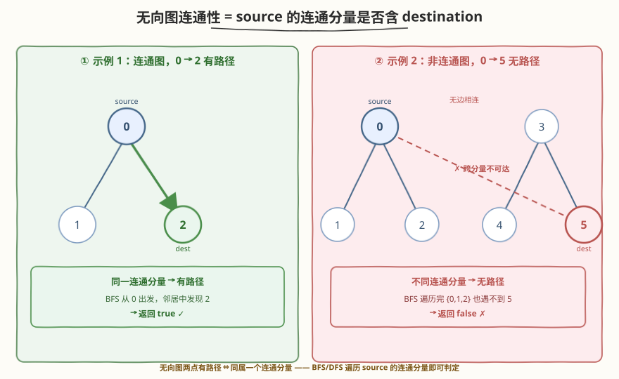
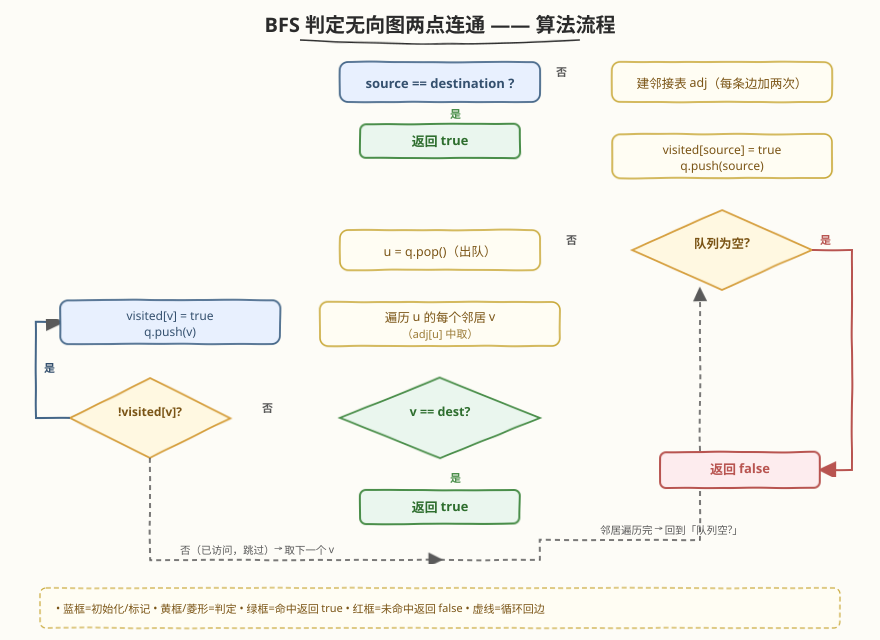
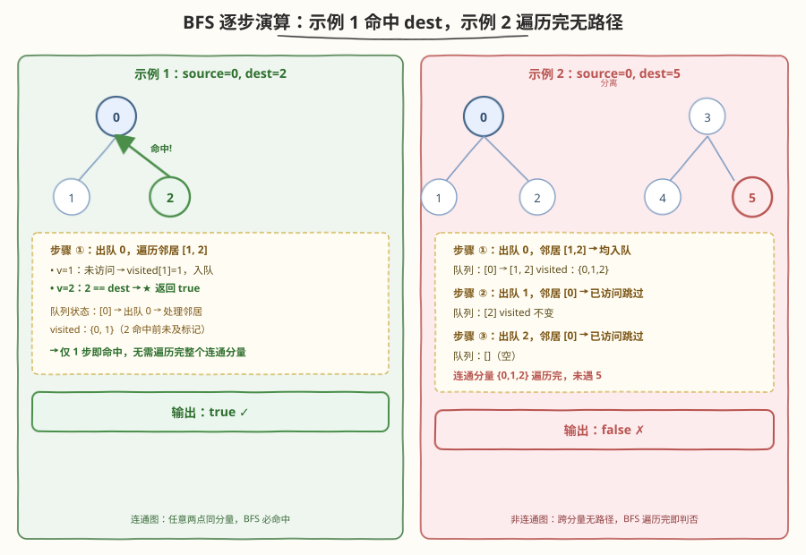

# LeetCode 寻找图中是否存在路径 题解

## 1. 题目概述

- **标题 / 题号**：寻找图中是否存在路径（#1971，easy）
- **链接**：https://leetcode.cn/problems/find-if-path-exists-in-graph/
- **难度**：简单
- **标签**：图、广度优先搜索、深度优先搜索、并查集、连通性

**题意**：给定一个有 `n` 个顶点的**双向**无向图，顶点编号为 `0` 到 `n - 1`。图中的边由二维整数数组 `edges` 表示，其中 `edges[i] = [ui, vi]` 表示顶点 `ui` 和 `vi` 之间存在一条无向边。

同时给定起点 `source` 和终点 `destination`，请你判断从 `source` 到 `destination` 是否存在一条有效路径。存在返回 `true`，否则返回 `false`。

**示例 1**：

```text
输入：n = 3, edges = [[0,1],[1,2],[2,0]], source = 0, destination = 2
输出：true
解释：从 0 到 2 有两条路径：0 → 1 → 2 和 0 → 2。
```

**示例 2**：

```text
输入：n = 6, edges = [[0,1],[0,2],[3,5],[5,4],[4,3]], source = 0, destination = 5
输出：false
解释：0 与 1、2 连成一片，3、4、5 连成另一片，两片互不相连，故 0 到 5 无路径。
```

**约束**：

- $1 \le n \le 2 \times 10^5$
- $0 \le \text{edges.length} \le 2 \times 10^5$
- `edges[i].length == 2`
- $0 \le u_i, v_i \le n - 1$
- $u_i \ne v_i$
- $0 \le \text{source}, \text{destination} \le n - 1$
- 不存在重复边，不存在自环

> 💡 **审题关键**：① **无向图**——每条边双向可通，建邻接表时两个方向都要加；② 「是否存在路径」=「`source` 与 `destination` 是否在同一连通分量」——只判**连通性**，不求最短路径；③ $n, m \le 2 \times 10^5$，必须 $O(n + m)$ 级别，建邻接表 + BFS/DFS 一次遍历即可；④ 特判 `source == destination` 直接返回 `true`（自身到自身视为有路径）。

## 2. 解题思路

### 2.1 暴力思路：枚举所有路径

最直白的做法是从 `source` 出发，用 DFS 枚举所有可能的行走序列，只要某条序列能到达 `destination` 就返回 `true`。

- **正确性**：穷举所有路径，若存在则必能找到，正确。
- **效率**：路径数量是指数级的（每个节点有若干邻居可走），且不标记已访问时同一节点会被反复经过，甚至陷入环里死循环——完全不可行。

> ⚠️ 暴力的浪费在于「盲目沿一条路径深挖到底，且不记得自己走过哪些节点」。实际上「能否到达」只关心**连通性**，与走法无关：一个节点要么属于 `source` 的连通分量、要么不属于。只需遍历 `source` 所在连通分量一次，看 `destination` 是否被访问到即可。

### 2.2 核心观察：连通性判定 → BFS/DFS 一次遍历



关键洞察分两步：

**第一步：建邻接表把边转化为可遍历结构。** 输入是「边集」形式，遍历图需要从任一节点快速取到它的所有邻居。建立邻接表 `adj[u] = [v1, v2, ...]`，每条无向边 `[u, v]` 同时加入 `adj[u]` 和 `adj[v]`。建表 $O(n + m)$，之后遍历每个节点的邻居总次数恰为 $2m$（每条边贡献两次）。

**第二步：从 `source` 出发 BFS/DFS，访问到 `destination` 即返回。** 维护 `visited` 数组标记已访问节点，从 `source` 开始遍历它的连通分量：

- 若遍历过程中访问到 `destination`，立即返回 `true`；
- 若整个连通分量遍历完仍未遇到 `destination`，说明二者不在同一连通分量，返回 `false`。

> 💡 **为什么不用求最短路？** 题目只问「是否存在路径」，不问路径长度、不问最短。因此无需 BFS 的层序计数，BFS 和 DFS 都可以——只要能把 `source` 的整个连通分量标记一遍即可。BFS 用队列、DFS 用栈/递归，两者都 $O(n + m)$。

> ⚠️ **必须标记已访问**：无向图必然存在环（如示例 1 的三角形 `0-1-2-0`），不标记已访问会陷入死循环。`visited` 数组（或原地修改邻接表）把指数级的路径搜索压缩为线性的节点遍历——每个节点只访问一次。

### 2.3 算法流程图



**主流程（BFS + 邻接表）**：

1. **特判**：若 `source == destination`，直接返回 `true`。
2. **建邻接表**：`adj` 为长度 `n` 的数组，遍历 `edges`，对每条 `[u, v]` 执行 `adj[u].push(v)`、`adj[v].push(u)`。
3. **初始化**：`visited` 数组全 `false`；`visited[source] = true`；队列 `q` 入队 `source`。
4. **BFS 循环**：当队列非空：
   - 出队 `u`；
   - 遍历 `u` 的每个邻居 `v`：
     - 若 `v == destination`：**返回 `true`**（提前命中）；
     - 若 `!visited[v]`：`visited[v] = true`，`v` 入队。
5. 队列空仍未命中 → 返回 `false`。

> 💡 **提前命中的妙处**：在「发现邻居」时检查 `v == destination` 而非等到它出队，可少一轮入队/出队开销。更关键的是，这把最坏情况（`destination` 是最后一个被访问的节点）的常数降了一截，且代码更直观。

### 2.4 示例演算

以两个官方样例演示 BFS 从 `source` 出发访问连通分量的过程：



**示例 1**：`n = 3, edges = [[0,1],[1,2],[2,0]], source = 0, destination = 2`

邻接表：`adj[0] = [1, 2]`、`adj[1] = [0, 2]`、`adj[2] = [1, 0]`。

| 步骤 | 出队 `u` | 遍历邻居 `v` | 是否命中 `dest=2` |
|------|---------|-------------|------------------|
| ① | 0 | 1 → 入队；2 | **2 == dest → 返回 true** |

- `source = 0` 入队后出队，遍历邻居时第二个就遇到 `2 == destination`，直接返回 `true`。✓

**示例 2**：`n = 6, edges = [[0,1],[0,2],[3,5],[5,4],[4,3]], source = 0, destination = 5`

邻接表：`adj[0] = [1, 2]`、`adj[1] = [0]`、`adj[2] = [0]`、`adj[3] = [5, 4]`、`adj[4] = [5, 3]`、`adj[5] = [3, 4]`。

| 步骤 | 出队 `u` | 遍历邻居 `v` | 是否命中 `dest=5` |
|------|---------|-------------|------------------|
| ① | 0 | 1 → 入队；2 → 入队 | 否 |
| ② | 1 | 0 已访问 → 跳过 | 否 |
| ③ | 2 | 0 已访问 → 跳过 | 否 |
| — | 队列空 | 连通分量 {0,1,2} 全访问完 | 未命中 → **返回 false** |

- `source = 0` 所在连通分量只有 `{0, 1, 2}`，`destination = 5` 在另一片 `{3, 4, 5}` 中，两片无任何边相连，故无路径。✓

> 💡 **观察要点**：① 示例 1 的图是**连通图**（整个图一个连通分量），任意两点间都有路径；示例 2 的图是**非连通图**（两个连通分量），跨分量无路径——本题本质就是「判两点是否同属一个连通分量」；② BFS 只遍历 `source` 所在的连通分量，不会触及其它分量，因此即使图很大但 `source` 所在分量很小，BFS 也会很快结束；③ 提前命中让示例 1 在第一步就返回，无需遍历完整个连通分量。

## 3. 参考代码

### C++（BFS + 邻接表）

```cpp
class Solution {
public:
    bool validPath(int n, vector<vector<int>>& edges, int source, int destination) {
        if (source == destination) return true;
        vector<vector<int>> adj(n);
        for (auto& e : edges) {
            adj[e[0]].push_back(e[1]);
            adj[e[1]].push_back(e[0]);
        }
        vector<char> visited(n, 0);
        visited[source] = 1;
        queue<int> q;
        q.push(source);
        while (!q.empty()) {
            int u = q.front(); q.pop();
            for (int v : adj[u]) {
                if (v == destination) return true;
                if (!visited[v]) {
                    visited[v] = 1;
                    q.push(v);
                }
            }
        }
        return false;
    }
};
```

### C++（DFS 递归版）

```cpp
class Solution {
public:
    bool validPath(int n, vector<vector<int>>& edges, int source, int destination) {
        vector<vector<int>> adj(n);
        for (auto& e : edges) {
            adj[e[0]].push_back(e[1]);
            adj[e[1]].push_back(e[0]);
        }
        vector<char> visited(n, 0);
        function<bool(int)> dfs = [&](int u) {
            if (u == destination) return true;
            visited[u] = 1;
            for (int v : adj[u])
                if (!visited[v] && dfs(v)) return true;
            return false;
        };
        return dfs(source);
    }
};
```

### Python（BFS + 邻接表）

```python
class Solution:
    def validPath(self, n: int, edges: List[List[int]], source: int, destination: int) -> bool:
        if source == destination:
            return True
        adj = [[] for _ in range(n)]
        for u, v in edges:
            adj[u].append(v)
            adj[v].append(u)
        visited = [False] * n
        visited[source] = True
        from collections import deque
        q = deque([source])
        while q:
            u = q.popleft()
            for v in adj[u]:
                if v == destination:
                    return True
                if not visited[v]:
                    visited[v] = True
                    q.append(v)
        return False
```

> 💡 **写法对照**：① BFS 用队列逐层扩展，提前命中 `destination` 即返回，逻辑清晰、无栈溢出风险；② DFS 递归版代码更紧凑，但 $n \le 2 \times 10^5$ 时递归深度可能达到连通分量大小，Python 易栈溢出、C++ 依赖编译器栈大小——大图建议用 BFS 或迭代版 DFS；③ Python 用 `collections.deque` 的 `popleft()` 保证 $O(1)$ 出队，切勿用 `list.pop(0)`（$O(n)$）。

> ⚠️ **`visited` 用 `char`/`bool` 而非 `int`**：仅需 0/1 两种状态，用 `vector<char>` 比 `vector<int>` 省一半内存（$n = 2 \times 10^5$ 时省约 800KB），常数更友好。Python 中 `bytearray(n)` 也是省内存的替代。

## 4. 复杂度分析

| 维度 | 复杂度 | 说明 |
|------|--------|------|
| 时间复杂度 | $O(n + m)$ | 建邻接表遍历 $m$ 条边 $O(m)$；BFS 每个节点至多入队/出队一次，每条边至多被两端各遍历一次共 $O(n + 2m)$，总计 $O(n + m)$ |
| 空间复杂度 | $O(n + m)$ | 邻接表存 $2m$ 条有向边 $O(m)$、`visited` 数组 $O(n)$、BFS 队列最坏 $O(n)$，总计 $O(n + m)$ |

> 💡 $n, m \le 2 \times 10^5$，$O(n + m) \approx 4 \times 10^5$，远在时限内。BFS 的高效源于「每个节点只访问一次」——`visited` 标记把指数级的路径搜索压缩为线性的节点遍历。若图退化为链，BFS 队列最多存 $O(n)$；若图为星形（一个中心连所有点），队列峰值也 $O(n)$，渐进上界均为 $O(n)$。

## 5. 扩展：并查集

若一时不想建邻接表遍历，**并查集**是另一种 $O(n + m)$ 级别（带反阿克曼常数）的解法，且无需显式建图。

**思路**：把每条边 `[u, v]` 执行 `union(u, v)`，最后判断 `find(source) == find(destination)`——同根即在同一连通分量、即有路径。与 [547. 省份数量](../0501-0600/547_省份数量.md)、[684. 冗余连接](../0601-0700/684_冗余连接.md) 的并查集用法一脉相承。

```cpp
class Solution {
public:
    bool validPath(int n, vector<vector<int>>& edges, int source, int destination) {
        vector<int> parent(n);
        iota(parent.begin(), parent.end(), 0);
        function<int(int)> find = [&](int x) {
            return parent[x] == x ? x : parent[x] = find(parent[x]);
        };
        for (auto& e : edges) {
            int ru = find(e[0]), rv = find(e[1]);
            if (ru != rv) parent[ru] = rv;
        }
        return find(source) == find(destination);
    }
};
```

```python
class Solution:
    def validPath(self, n: int, edges: List[List[int]], source: int, destination: int) -> bool:
        parent = list(range(n))

        def find(x: int) -> int:
            while parent[x] != x:
                parent[x] = parent[parent[x]]   # 路径压缩（迭代版）
                x = parent[x]
            return x

        for u, v in edges:
            ru, rv = find(u), find(v)
            if ru != rv:
                parent[ru] = rv
        return find(source) == find(destination)
```

> 💡 **两种解法对比**：
>
> | 维度 | BFS/DFS | 并查集 |
> |------|---------|--------|
> | 时间 | $O(n + m)$ | $O(n + m \cdot \alpha) \approx O(n + m)$ |
> | 空间 | $O(n + m)$（邻接表） | $O(n)$（仅 parent 数组） |
> | 空间优势 | 需建完整邻接表 | 不建图，内存更省 |
> | 在线查询 | 需重新遍历 | 一次 `find` 即可 |
> | 适用场景 | 单次连通判定 / 求路径 | 多次连通查询 / 动态加边 |
>
> 并查集**无需建邻接表**，空间仅 $O(n)$，且支持后续 $O(1)$ 的多次连通查询；BFS/DFS 需 $O(n + m)$ 空间建表，但能顺势求出具体路径、最短路径等。本题只判连通性，两者皆可，并查集更省内存、写法更短。

## 6. 面试要点

**Q1：为什么要建邻接表？直接用边集不行吗？**

> 边集是「按边存储」，要找某个节点的所有邻居需遍历全部 $m$ 条边，单次 $O(m)$。邻接表是「按节点存储」，取邻居 $O(\deg(u))$。BFS/DFS 需频繁取邻居，用边集会让每次扩展 $O(m)$、整体 $O(nm)$ 超时；邻接表把取邻居总开销压缩为 $O(2m)$（每条边被两端各遍历一次），整体 $O(n + m)$。这是图的遍历的基本范式：**先建邻接表，再遍历**。

**Q2：BFS 和 DFS 在这题有什么区别？**

> 时间复杂度都是 $O(n + m)$，结果一致。区别在于：① **空间形态**——BFS 队列最坏 $O(n)$（链状图），DFS 递归栈最坏 $O(n)$（链状图）；② **栈溢出风险**——$n \le 2 \times 10^5$ 时 DFS 递归深度可能达 $n$，Python 默认递归上限 1000 会栈溢出，C++ 依赖编译器栈大小也可能爆栈，BFS 无此风险；③ **提前终止**——两者都可在访问到 `destination` 时立即返回，但 BFS 按层扩展若求最短路更优（本题不求最短故无差异）。大图推荐 BFS。

**Q3：如果不标记 `visited` 会怎样？**

> 无向图必然存在环（如示例 1 的三角形 `0-1-2-0`），不标记已访问时 BFS/DFS 会在环上反复打转陷入死循环，永远无法终止。`visited` 数组保证每个节点只被处理一次，把指数级的路径搜索压缩为线性的节点遍历——这是图遍历正确且高效的根本保证。

**Q4：并查集和 BFS/DFS 在这题怎么选？**

> 本题只判连通性，两者皆可。并查集**不建邻接表**，空间仅 $O(n)$，且 `union` 完所有边后可 $O(\alpha)$ 内多次查询任意两点连通性——适合「一次建结构、多次查连通」的场景。BFS/DFS 需 $O(n + m)$ 建邻接表，但能顺势求出具体路径、最短路径、连通分量大小等更多信息。若只需一次连通判定且 $m$ 很大，并查集更省内存；若后续还需路径信息，BFS/DFS 更通用。

**Q5：`source == destination` 为什么要特判？**

> 题目约定顶点编号 $0$ 到 $n-1$，`source` 与 `destination` 可以相同。此时「自身到自身」视为存在路径（长度为 0 的平凡路径），应返回 `true`。若不特判，BFS 中 `visited[source] = true` 后 `source` 不会作为邻居被发现，可能误返回 `false`（尤其 `source` 无邻居时）。特判一行代码消除歧义，是最稳妥的写法。

> 💡 **一句话总结**：无向图两点是否连通 = `source` 的连通分量是否含 `destination`。建邻接表后从 `source` 做 BFS/DFS 一次遍历，访问到 `destination` 即返回 `true`——$O(n + m)$ 一趟搞定；并查集是省内存的等价替代。

## 同类练习题

| # | 题目 | 与本题的关联 |
|---|------|-------------|
| 547 | [省份数量](https://leetcode.cn/problems/number-of-provinces/)（[题解](../0501-0600/547_省份数量.md)） | 并查集/DFS 求连通分量个数，复习 `find`/`union`/路径压缩的母题 |
| 684 | [冗余连接](https://leetcode.cn/problems/redundant-connection/)（[题解](../0601-0700/684_冗余连接.md)） | 并查集判环，体会「加边时 union 失败即成环」与本题「加边后判同根」的判据差异 |
| 200 | [岛屿数量](https://leetcode.cn/problems/number-of-islands/)（[题解](../0101-0200/200_岛屿数量.md)） | 网格图的连通分量计数，DFS 沉岛/BFS/并查集三解对照，与本题同为「图连通性」家族 |
| 733 | [图像渲染](https://leetcode.cn/problems/flood-fill/) | 网格图连通分量 DFS/BFS 染色，对照本题「判连通」与「染色连通块」的遍历复用 |
| 1319 | [连通网络的操作次数](https://leetcode.cn/problems/number-of-operations-to-make-network-connected/) | 并查集求连通分量数，推导「连成一片最少加几条边」，是本题连通性判定的进阶计数版 |
