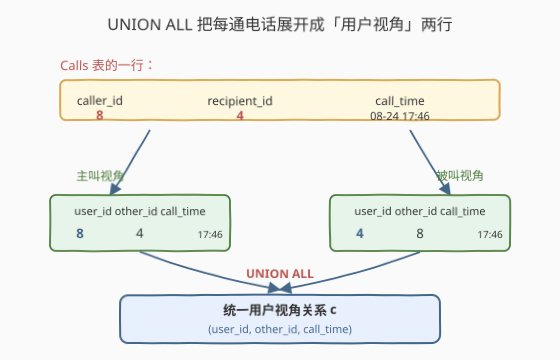
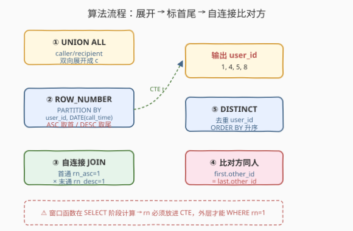
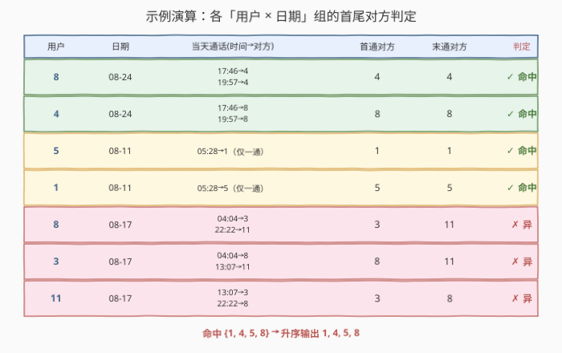

# LeetCode 同一天的第一个电话和最后一个电话 题解

> ⚠️ **注意**：本题是 LeetCode 数据库（SQL）类题目，在 leetcode.cn 上为 **Plus 会员专享题（锁题）**，[leetcode.com](https://leetcode.com/problems/first-and-last-call-on-the-same-day/) 同样为锁题。本文代码部分使用 SQL（及 pandas 对照）而非 C++/Python。

## 1. 题目概述

- **标题 / 题号**：同一天的第一个电话和最后一个电话（#1972，hard）
- **链接**：https://leetcode.cn/problems/first-and-last-call-on-the-same-day/
- **难度**：困难
- **标签**：数据库、SQL、窗口函数、`ROW_NUMBER`、`UNION ALL`（角色展开 / 逆透视 UNPIVOT）、自连接（Self-Join）、`MIN`/`MAX` 聚合、CTE、LeetCode 锁题

**题意**：给定 `Calls` 表记录电话通话流水，每行表示一次呼叫：`caller_id` 拨打给 `recipient_id`，发生在 `call_time`。一个用户既可以是主叫（`caller_id`）也可以是被叫（`recipient_id`）。编写 SQL 查询，报告这样的用户：**存在某一天，该用户当天的「第一通电话」与「最后一通电话」是和同一个人进行的**。

- 「第一通电话」= 该用户当天参与的通话中 `call_time` **最早**的一通；
- 「最后一通电话」= 该用户当天参与的通话中 `call_time` **最晚**的一通；
- 「和同一个人」= 这两通电话里**对方**（主叫看被叫、被叫看主叫）是同一个人；
- 用户在两通电话里既可都当主叫、也可都当被叫、也可一主一被，**角色不限**，只看对方是谁。

**表结构**：

```text
Table: Calls
+-------------+----------+
| Column Name | Type     |
+-------------+----------+
| caller_id   | int      |  ← 主叫（拨出方）
| recipient_id| int      |  ← 被叫（接听方）
| call_time   | datetime |  ← 通话时间 'YYYY-MM-DD hh:mm:ss'
+-------------+----------+
(caller_id, recipient_id, call_time) 无显式主键
每行表示 caller_id 在 call_time 拨打给 recipient_id 的一通电话
```

**输出**：单列 `user_id`，按 `user_id` **升序**排列。

**示例 1**：

```text
输入：
Calls 表:
+-----------+--------------+---------------------+
| caller_id | recipient_id | call_time           |
+-----------+--------------+---------------------+
| 8         | 4            | 2021-08-24 17:46:07 |
| 4         | 8            | 2021-08-24 19:57:13 |
| 5         | 1            | 2021-08-11 05:28:44 |
| 8         | 3            | 2021-08-17 04:04:15 |
| 11        | 3            | 2021-08-17 13:07:00 |
| 8         | 11           | 2021-08-17 22:22:22 |
+-----------+--------------+---------------------+

输出：
+---------+
| user_id |
+---------+
| 1       |
| 4       |
| 5       |
| 8       |
+---------+
```

**解释**（按「用户 × 当天」逐组分析，对方 = 通话里另一端的人）：

| 用户 | 日期 | 当天参与的通话（时间 → 对方） | 第一通 | 最后一通 | 对方是否同人? | 结论 |
|------|------|------------------------------|--------|----------|---------------|------|
| 8 | 08-24 | 17:46:07→4；19:57:13→4 | 对方 4 | 对方 4 | ✓ 同 | 命中 |
| 4 | 08-24 | 17:46:07→8；19:57:13→8 | 对方 8 | 对方 8 | ✓ 同 | 命中 |
| 5 | 08-11 | 05:28:44→1 | 对方 1 | 对方 1 | ✓ 同（仅一通，首尾即同一通） | 命中 |
| 1 | 08-11 | 05:28:44→5 | 对方 5 | 对方 5 | ✓ 同（仅一通） | 命中 |
| 8 | 08-17 | 04:04:15→3；22:22:22→11 | 对方 3 | 对方 11 | ✗ 异 | — |
| 3 | 08-17 | 04:04:15→8；13:07:00→11 | 对方 8 | 对方 11 | ✗ 异 | — |
| 11 | 08-17 | 13:07:00→3；22:22:22→8 | 对方 3 | 对方 8 | ✗ 异 | — |

最终命中用户为 `{1, 4, 5, 8}`，升序输出。

**约束**：

- `caller_id != recipient_id`（无人自呼）
- `call_time` 格式 `'YYYY-MM-DD hh:mm:ss'`，且**同一天内可有多通、时间精确到秒**
- 每个用户当天参与的通话按 `call_time` 排序后取首尾

> 💡 **审题关键三连**：① 「参与」= 主叫**或**被叫都得算——必须把 `caller_id`/`recipient_id` 两列**双向展开**成 `(user_id, other_id, call_time)`，这是本题最大的考点；② 「第一/最后一通」按 `call_time` 在「用户 × 当天」分组内取 `MIN`/`MAX`，**不是**按全表行号；③ 「同人」看的是**对方 id** 相等，与用户自己是主叫还是被叫无关（08-24 的 8 与 4 互为对方，两通角色互换但对方同人，双双命中）。

> ⚠️ **首尾同一通的退化情形**：若某用户当天只参与了一通电话，则其「第一通」与「最后一通」是**同一通**，对方显然同人，按题意计入结果（如 08-11 的 1 与 5）。若面试官要求「首尾必须是两通不同的电话」，只需额外加 `COUNT(*) >= 2` 或 `首通时间 <> 末通时间` 过滤，详见第 5 节扩展。

## 2. 解题思路

### 2.1 暴力思路：逐用户逐天扫描

最直觉的过程式思路：枚举每个用户、每个有通话的日子，收集当天所有参与的通话，按时间排序取首尾，比较对方是否相同。

```text
for each user u:
    for each day d where u participated:
        calls = [ (call_time, other_id) for each call involving u on d ]
        calls.sort(by=call_time)
        first_other = calls[0].other_id
        last_other  = calls[-1].other_id
        if first_other == last_other:
            result.add(u)
return sorted(result)
```

正确性显然，但**纯 SQL 没有显式逐行循环**——「按用户×天分组 + 组内取首尾」需换成集合式表达。难点不在排序（窗口函数可做），而在**「用户参与的通话」这一关系不在任何单列里**：`user_id` 要么在 `caller_id`、要么在 `recipient_id`，必须先把两列**合并**成一个统一的「用户视角」关系。

### 2.2 核心观察：UNION ALL 双向展开 + ROW_NUMBER 取首尾



**问题拆解为三个子问题**：

1. **角色展开（逆透视 UNPIVOT）**：一通 `(caller_id, recipient_id, call_time)` 同时涉及两个用户——对 `caller_id` 而言对方是 `recipient_id`，对 `recipient_id` 而言对方是 `caller_id`。用 `UNION ALL` 把每行复制成两行：

   ```text
   (caller_id  AS user_id, recipient_id AS other_id, call_time)
   UNION ALL
   (recipient_id AS user_id, caller_id   AS other_id, call_time)
   ```

   得到统一的「用户视角」关系 `c(user_id, other_id, call_time)`，每个用户每通电话恰好一行。**注意用 `UNION ALL` 而非 `UNION`**——同一用户同一天与同一对方的多次通话都要保留（否则 08-24 的 8→4 与 4→8 两通会被误去重，影响首尾判定）。

2. **组内取首尾**：在 `c` 上按 `(user_id, DATE(call_time))` 分组、按 `call_time` 升序/降序各打一个 `ROW_NUMBER`：

   - `rn_asc = ROW_NUMBER() OVER (PARTITION BY user_id, DATE(call_time) ORDER BY call_time ASC)` —— `rn_asc = 1` 即「第一通」；
   - `rn_desc = ROW_NUMBER() OVER (PARTITION BY user_id, DATE(call_time) ORDER BY call_time DESC)` —— `rn_desc = 1` 即「最后一通」。

   > 💡 为何不用 `FIRST_VALUE`/`LAST_VALUE`？因为要同时取首通的**对方**与末通的**对方**做比较，用 `ROW_NUMBER` 打标记后自连接，语义比 `FIRST_VALUE` 取值再回连更清晰，且便于在自连接里同时拿到两个 `other_id`。

3. **自连接判定同人**：把上述结果自连接——`ON user_id 相同 AND 日期相同`，一侧取 `rn_asc = 1`（首通）、另一侧取 `rn_desc = 1`（末通），比较 `first.other_id = last.other_id`。命中即该用户在该日满足条件，`DISTINCT` 取用户后升序输出。

> ⚠️ **最易错点**：忘记角色展开，只把 `caller_id` 当用户、漏掉被叫视角。例如 08-11 的用户 1 全程只当被叫（`5→1`），若不展开 `recipient_id` 视角，1 永远不会出现在数据里，答案直接漏人。**「主叫/被叫双角色」是本题的灵魂**，与 1892「双向好友 `UNION`」、1811「逆透视 `UNION ALL`」同源。

> 💡 **退化情形的自然处理**：当某用户当天只有一通电话，`rn_asc = 1` 与 `rn_desc = 1` 落在**同一行**上。自连接后 `first.other_id` 与 `last.other_id` 是同一个值，比较相等自然成立——退化情形无需特判，被窗口函数 + 自连接「免费」覆盖。这正是窗口函数取首尾比 `LIMIT 1` 更优雅之处。

### 2.3 算法流程图



**逻辑执行步骤**：

| 步骤 | 子句 | 作用 |
|------|------|------|
| ① | `UNION ALL`（CTE `c`） | 把每通电话复制成两行，统一成 `(user_id, other_id, call_time)` 用户视角 |
| ② | `ROW_NUMBER() OVER (PARTITION BY user_id, DATE(call_time) ORDER BY call_time ASC/DESC)`（CTE `t`） | 每组「用户×当天」内按时间正/倒序打序号，标记首尾两通 |
| ③ | `JOIN t first ON t last`（`first.rn_asc=1` & `last.rn_desc=1`） | 自连接把首通与末通并排，拿到两个 `other_id` |
| ④ | `WHERE first.other_id = last.other_id` + `DISTINCT user_id` + `ORDER BY user_id` | 比对方同人、去重、升序输出 |

> 💡 **SQL 子句执行顺序**：`FROM`（含 `JOIN`/`UNION ALL`）→ `WHERE` → `GROUP BY` → `HAVING` → `SELECT`（含窗口函数）→ `DISTINCT` → `ORDER BY`。窗口函数在 `SELECT` 阶段计算、晚于 `WHERE`，故 `rn_asc`/`rn_desc` 必须先放进 CTE `t`，外层才能用 `WHERE rn_asc = 1` 过滤——与 1549、1532 同理。

### 2.4 示例演算

以示例 1 数据为例，观察「`UNION ALL` 展开 → `ROW_NUMBER` 标首尾 → 自连接比对方」的逐步过程：



**步骤 ①：UNION ALL 角色展开**

6 通电话 → 12 行用户视角（每通拆成主叫、被叫两行）：

| user_id | other_id | call_time | 日期 |
|---------|----------|---------------------|------|
| 8 | 4 | 2021-08-24 17:46:07 | 08-24 |
| 4 | 8 | 2021-08-24 17:46:07 | 08-24 |
| 4 | 8 | 2021-08-24 19:57:13 | 08-24 |
| 8 | 4 | 2021-08-24 19:57:13 | 08-24 |
| 5 | 1 | 2021-08-11 05:28:44 | 08-11 |
| 1 | 5 | 2021-08-11 05:28:44 | 08-11 |
| 8 | 3 | 2021-08-17 04:04:15 | 08-17 |
| 3 | 8 | 2021-08-17 04:04:15 | 08-17 |
| 11 | 3 | 2021-08-17 13:07:00 | 08-17 |
| 3 | 11 | 2021-08-17 13:07:00 | 08-17 |
| 8 | 11 | 2021-08-17 22:22:22 | 08-17 |
| 11 | 8 | 2021-08-17 22:22:22 | 08-17 |

**步骤 ②：ROW_NUMBER 标首尾（按 user_id × 日期 分组）**

| user_id | 日期 | other_id | call_time | rn_asc | rn_desc |
|---------|------|----------|---------------------|--------|---------|
| 8 | 08-24 | 4 | 17:46:07 | 1 | 2 |
| 8 | 08-24 | 4 | 19:57:13 | 2 | 1 |
| 4 | 08-24 | 8 | 17:46:07 | 1 | 2 |
| 4 | 08-24 | 8 | 19:57:13 | 2 | 1 |
| 5 | 08-11 | 1 | 05:28:44 | 1 | 1 |
| 1 | 08-11 | 5 | 05:28:44 | 1 | 1 |
| 8 | 08-17 | 3 | 04:04:15 | 1 | 3 |
| 3 | 08-17 | 8 | 04:04:15 | 1 | 2 |
| 11 | 08-17 | 3 | 13:07:00 | 1 | 2 |
| 3 | 08-17 | 11 | 13:07:00 | 2 | 1 |
| 8 | 08-17 | 11 | 22:22:22 | 2 | 1 |
| 11 | 08-17 | 8 | 22:22:22 | 2 | 1 |

**步骤 ③④：自连接（首通 rn_asc=1 × 末通 rn_desc=1）比对方**

| user_id | 日期 | 首通对方 | 末通对方 | 同人? |
|---------|------|----------|----------|-------|
| 8 | 08-24 | 4 | 4 | ✓ → 命中 8 |
| 4 | 08-24 | 8 | 8 | ✓ → 命中 4 |
| 5 | 08-11 | 1 | 1 | ✓ → 命中 5（首尾同一行） |
| 1 | 08-11 | 5 | 5 | ✓ → 命中 1（首尾同一行） |
| 8 | 08-17 | 3 | 11 | ✗ |
| 3 | 08-17 | 8 | 11 | ✗ |
| 11 | 08-17 | 3 | 8 | ✗ |

`DISTINCT user_id` 后升序：`1, 4, 5, 8`。

> 💡 **08-24 的对称之美**：8 与 4 互为对方，8 的首通对方是 4、末通对方也是 4；4 的首通对方是 8、末通对方也是 8——两人**双双命中**。这揭示了「同一天首尾同人」是对称关系：若 A 当天首尾都跟 B，则 B 当天首尾也都跟 A（因为那两通电话同时涉及 A 和 B）。
>
> ⚠️ **08-11 的退化判定**：用户 5 当天只有一通电话，`rn_asc = 1` 与 `rn_desc = 1` 落在同一行（other_id 都是 1）。自连接时 `first` 行与 `last` 行是同一行，`first.other_id = last.other_id` 自然成立。窗口函数 + 自连接**无需特判**就覆盖了「当天仅一通」的退化情形。

## 3. 参考代码

### SQL（解法 A：`UNION ALL` + 双向 `ROW_NUMBER` 自连接，推荐）

```sql
WITH c AS (
    SELECT caller_id    AS user_id,
           recipient_id AS other_id,
           call_time
    FROM Calls
    UNION ALL
    SELECT recipient_id AS user_id,
           caller_id    AS other_id,
           call_time
    FROM Calls
),
t AS (
    SELECT user_id,
           other_id,
           call_time,
           DATE(call_time) AS d,
           ROW_NUMBER() OVER (
               PARTITION BY user_id, DATE(call_time)
               ORDER BY call_time ASC
           ) AS rn_asc,
           ROW_NUMBER() OVER (
               PARTITION BY user_id, DATE(call_time)
               ORDER BY call_time DESC
           ) AS rn_desc
    FROM c
)
SELECT DISTINCT f.user_id
FROM t f
JOIN t l
  ON f.user_id = l.user_id
 AND f.d = l.d
WHERE f.rn_asc  = 1
  AND l.rn_desc = 1
  AND f.other_id = l.other_id
ORDER BY f.user_id;
```

> 💡 **写法要点**：
> - **`UNION ALL` 而非 `UNION`**：每通电话对主叫、被叫各产生一行，两行内容不同（`user_id`/`other_id` 互换），`UNION ALL` 全部保留；即便两行碰巧相同（不会，因 `caller_id != recipient_id`）也应保留以维持计数语义。用 `UNION` 会做去重排序，多花 $O(n \log n)$ 且语义错误。
> - **`PARTITION BY user_id, DATE(call_time)`**：以「用户 × 当天」为分组单元，`DATE()` 截取日期部分丢弃时间，确保同一天内多通电话归为一组。
> - **双向 `ROW_NUMBER`**：`ORDER BY call_time ASC` 得首通、`DESC` 得末通。同一组内 `rn_asc=1` 与 `rn_desc=1` 各唯一一行（`call_time` 各异时），自连接后恰得到「首通对方 vs 末通对方」一对。
> - **自连接 `ON user_id, d`**：把首通行与末通行并排比较 `other_id`。退化情形（当天仅一通）下两行实为同一行，比较自然成立。
> - **`DISTINCT user_id`**：一个用户可能在多天命中（如 8 在 08-24 命中、08-17 未命中，但若某用户多天都命中只取一次），去重后 `ORDER BY user_id` 升序输出。
> - ✓ **最推荐**：语义清晰、一次排序、覆盖退化情形，MySQL 8.0+/PostgreSQL/SQL Server 通用。

### SQL（解法 B：`GROUP BY` + `MIN`/`MAX` 时间 + 回连取对方，无窗口函数）

```sql
WITH c AS (
    SELECT caller_id    AS user_id,
           recipient_id AS other_id,
           call_time
    FROM Calls
    UNION ALL
    SELECT recipient_id AS user_id,
           caller_id    AS other_id,
           call_time
    FROM Calls
),
bounds AS (
    SELECT user_id,
           DATE(call_time) AS d,
           MIN(call_time)  AS first_time,
           MAX(call_time)  AS last_time
    FROM c
    GROUP BY user_id, DATE(call_time)
)
SELECT DISTINCT b.user_id
FROM bounds b
JOIN c f ON b.user_id = f.user_id AND b.d = DATE(f.call_time) AND b.first_time = f.call_time
JOIN c l ON b.user_id = l.user_id AND b.d = DATE(l.call_time) AND b.last_time  = l.call_time
WHERE f.other_id = l.other_id
ORDER BY b.user_id;
```

> 💡 **解法 B 的思路**：先用 `GROUP BY user_id, DATE(call_time)` 算出每组的首尾时间（`MIN`/`MAX(call_time)`），再**两次回连**原展开表 `c`：一次按「首通时间」取首通对方 `f.other_id`、一次按「末通时间」取末通对方 `l.other_id`，最后比较同人。
>
> **与解法 A 的区别**：不依赖窗口函数，兼容 MySQL 5.7 等旧版本。语义上「`call_time` 等于组内 `MIN`/`MAX`」等价于 `rn_asc=1`/`rn_desc=1`，是「组内取最值」的经典非窗口写法。
>
> ⚠️ **并列时间的坑**：若同组内有两通电话 `call_time` 完全相同（题面时间精确到秒，理论可能），`MIN`/`MAX` 仍是该值，回连会**匹配出多行**（首通侧或末通侧变成多行），`JOIN` 后行数膨胀。若这些并列行的 `other_id` 不同，会同时产生「同人」与「不同人」两种组合，导致误判。解法 A 的 `ROW_NUMBER` 在并列时间下会**随机**选一行为 `rn=1`（无决胜键时实现相关），同样有歧义。生产环境若需稳定，可加唯一决胜键（如自增 `call_id`）到 `ORDER BY` 末尾。

### SQL（解法 C：`FIRST_VALUE` 窗口函数取首尾对方，更紧凑）

```sql
WITH c AS (
    SELECT caller_id    AS user_id,
           recipient_id AS other_id,
           call_time
    FROM Calls
    UNION ALL
    SELECT recipient_id AS user_id,
           caller_id    AS other_id,
           call_time
    FROM Calls
),
t AS (
    SELECT user_id,
           DATE(call_time) AS d,
           FIRST_VALUE(other_id) OVER w AS first_other,
           LAST_VALUE(other_id)  OVER w AS last_other
    FROM c
    WINDOW w AS (
        PARTITION BY user_id, DATE(call_time)
        ORDER BY call_time
        ROWS BETWEEN UNBOUNDED PRECEDING AND UNBOUNDED FOLLOWING
    )
)
SELECT DISTINCT user_id
FROM t
WHERE first_other = last_other
ORDER BY user_id;
```

> 💡 **解法 C 的思路**：直接用 `FIRST_VALUE(other_id)` 与 `LAST_VALUE(other_id)` 在窗口里取出首通/末通的对方，一行里同时拿到两个值做比较，省去自连接。
>
> **`LAST_VALUE` 的窗框陷阱**：`LAST_VALUE` 默认窗框是 `RANGE BETWEEN UNBOUNDED PRECEDING AND CURRENT ROW`（到当前行为止），取的是「当前行在组内的最后」而非「整组的最后」。必须显式写 `ROWS BETWEEN UNBOUNDED PRECEDING AND UNBOUNDED FOLLOWING` 把窗框扩到整组，`LAST_VALUE` 才返回组内真正末通的对方。这是 `LAST_VALUE` 最常见的坑——用 `FIRST_VALUE` 没这个问题（默认窗框起点即组首）。
>
> **与解法 A 的对照**：解法 A 用 `ROW_NUMBER` 打标记再自连接（显式两行并排），解法 C 用 `FIRST_VALUE`/`LAST_VALUE` 直接取值（一行内含两值）。语义等价，解法 C 更紧凑但需理解窗框；解法 A 更直观且便于扩展（如要求首尾必须是两通不同电话，加 `f.call_time < l.call_time` 即可，解法 C 难以表达）。

### Python（pandas）

```python
import pandas as pd

def first_and_last_call_on_the_same_day(calls: pd.DataFrame) -> pd.DataFrame:
    part1 = calls[['caller_id', 'recipient_id', 'call_time']].rename(
        columns={'caller_id': 'user_id', 'recipient_id': 'other_id'}
    )
    part2 = calls[['recipient_id', 'caller_id', 'call_time']].rename(
        columns={'recipient_id': 'user_id', 'caller_id': 'other_id'}
    )
    c = pd.concat([part1, part2], ignore_index=True)
    c['call_time'] = pd.to_datetime(c['call_time'])
    c['d'] = c['call_time'].dt.date

    c['rn_asc'] = c.groupby(['user_id', 'd'])['call_time'].rank(method='first', ascending=True)
    c['rn_desc'] = c.groupby(['user_id', 'd'])['call_time'].rank(method='first', ascending=False)

    first = c[c['rn_asc'] == 1][['user_id', 'd', 'other_id']].rename(columns={'other_id': 'first_other'})
    last = c[c['rn_desc'] == 1][['user_id', 'd', 'other_id']].rename(columns={'other_id': 'last_other'})

    merged = first.merge(last, on=['user_id', 'd'])
    hit = merged[merged['first_other'] == merged['last_other']]
    return hit[['user_id']].drop_duplicates().sort_values('user_id').reset_index(drop=True)
```

> 💡 **pandas 对照**：
> - `pd.concat([part1, part2])` 对应 SQL 的 `UNION ALL`——两段 `caller_id`/`recipient_id` 互换的视图纵向拼接，不去重。
> - `.groupby(['user_id', 'd'])['call_time'].rank(method='first', ascending=True/False)` 对应 `ROW_NUMBER() OVER (PARTITION BY user_id, d ORDER BY call_time ASC/DESC)`。pandas `rank(method='first')` = SQL `ROW_NUMBER`（按出现顺序强制唯一）；`method='min'` = `RANK`，`method='dense'` = `DENSE_RANK`。本题取首尾各一行，用 `method='first'` 最稳妥（并列时间也强制选一）。
> - `first.merge(last, on=['user_id','d'])` 对应 SQL 自连接；`first_other == last_other` 对应 `WHERE f.other_id = l.other_id`。
> - 退化情形（当天仅一通）：`rn_asc` 与 `rn_desc` 都为 1，`first` 与 `last` 是同一行，`merge` 后 `first_other == last_other` 自然成立，与 SQL 版一致。

## 4. 复杂度分析

| 维度 | 解法 A（`ROW_NUMBER` 自连接） | 解法 B（`MIN`/`MAX` 回连） | 解法 C（`FIRST_VALUE`） | pandas |
|------|------------------------------|---------------------------|------------------------|--------|
| **时间** | $O(n \log n)$ | $O(n)$（最坏 $O(n^2)$） | $O(n \log n)$ | $O(n \log n)$ |
| **空间** | $O(n)$ | $O(n)$ | $O(n)$ | $O(n)$ |
| **是否依赖窗口函数** | 是（MySQL 8.0+） | 否 | 是（MySQL 8.0+） | 否（`rank`） |
| **退化情形覆盖** | ✓ 首尾同一行 | ✓ `MIN`=`MAX` 回连同一行 | ✓ `FIRST`=`LAST` | ✓ 首尾同一行 |
| **并列时间稳定性** | ⚠️ 无决胜键，实现相关 | ⚠️ 行膨胀 | ⚠️ 实现相关 | ✓ `method='first'` |
| **推荐度** | ✓ **首选** | ✓ 旧版本/无窗口函数首选 | ✓ 紧凑备选 | ✓ 验证用 |

> - $n$ = `Calls` 表行数；展开后 `c` 表行数为 $2n$。
> - **时间**：解法 A 的 `UNION ALL` $O(n)$ + 组内排序 $O(n \log n)$（各分组大小 $k_i$，总排序 $O(\sum k_i \log k_i) \le O(n \log n)$）+ 自连接 $O(n)$（每组首尾各一行，连接代价小）。解法 B 的 `GROUP BY` 哈希聚合 $O(n)$ + 两次回连：若 `c(user_id, call_time)` 有索引则 $O(n \log n)$，否则最坏 $O(n^2)$。解法 C 与解法 A 同阶。
> - **空间**：展开表 `c` 与排序中间结果均 $O(n)$。
> - **索引优化**：在 `Calls(call_time)`、`Calls(caller_id)`、`Calls(recipient_id)` 上建索引可加速回连与分组；展开后的 `c(user_id, call_time)` 复合索引对解法 B 的回连收益最大。

## 5. 扩展：首尾须为两通不同电话的变体

题面按「`call_time` 最早/最晚」定义首尾，当天仅一通时首尾是**同一通**，对方显然同人，计入结果（示例中 08-11 的 1 与 5 即此退化）。若面试官改要求「**首尾必须是两通不同的电话**」（即当天至少两通），在各解法上加一个过滤即可：

### 5.1 解法 A 加 `COUNT` 窗口或 `f.call_time < l.call_time`

```sql
-- 方式 1：要求首通时间严格早于末通时间（首尾不同通）
WHERE f.rn_asc = 1 AND l.rn_desc = 1
  AND f.other_id = l.other_id
  AND f.call_time < l.call_time   -- ← 新增：首尾必须是两通
```

```sql
-- 方式 2：用 COUNT 窗口要求当天至少 2 通
t AS (
    SELECT ...,
           COUNT(*) OVER (PARTITION BY user_id, DATE(call_time)) AS cnt
    FROM c
)
-- 外层加 WHERE cnt >= 2
```

> 💡 **两种方式的差异**：方式 1 用 `f.call_time < l.call_time` 直接判定首尾两行不同，语义「首通严格早于末通」；方式 2 用 `COUNT(*) >= 2` 要求当天至少两通，语义「当天有不止一通」。在 `call_time` 各异时两者等价；在两通 `call_time` 完全相同的并列情形下，方式 1 会把这对并列行**排除**（`f.call_time < l.call_time` 不成立），方式 2 仍**保留**（计数 ≥ 2）——选哪种取决于业务对「同一瞬间的两通」如何定性。

### 5.2 退化情形的语义辨析

| 当天通话数 | 首通 | 末通 | 是否同人 | 题意（默认） | 严格变体 |
|------------|------|------|----------|--------------|----------|
| 1 通 | 该通 | 该通 | ✓（同人） | ✓ 命中 | ✗ 排除 |
| ≥2 通、首尾对方同 | 最早 | 最晚 | ✓ | ✓ 命中 | ✓ 命中 |
| ≥2 通、首尾对方异 | 最早 | 最晚 | ✗ | ✗ 不命中 | ✗ 不命中 |

> 💡 **一句话**：默认题意把「当天仅一通」视为首尾同人（退化成立）；严格变体要求首尾是两通不同电话，加 `call_time <` 或 `COUNT >= 2` 即可。面试时主动说明这两种语义，展示对边界情形的敏感度。

### 5.3 同库同家族对照

| 题 | 关系展开方式 | 取首尾 | 同人判定 |
|----|--------------|--------|----------|
| 1972 本题 | `UNION ALL` 双向展开 caller/recipient | `ROW_NUMBER` ASC/DESC | `first.other_id = last.other_id` |
| 1892 页面推荐Ⅱ | `UNION` 双向展开好友 | —（全展开后反连接） | — |
| 1811 寻找面试候选人 | `UNION ALL` 逆透视 medal_type | `LEAD` 取下一段 | 连续区间判定 |

> 💡 **共性**：凡涉及「**对称二元关系**」（好友、通话、师生）的 SQL 题，第一步几乎都是 `UNION`/`UNION ALL` 把 `(a, b)` 展开成 `(user=a, other=b)` ∪ `(user=b, other=a)` 的统一用户视角。掌握这个「双向展开」模板，1972、1892、1811 一通百通。

## 6. 面试要点

1. **为什么必须 `UNION ALL` 展开 caller/recipient？只用 `caller_id` 当用户行不行？**

   > 不行。一个用户既可主叫也可被叫，若只取 `caller_id` 视角，会把所有「当被叫」的通话漏掉。示例中用户 1 全程只当被叫（`5→1`），不展开就永远不出现，答案直接漏人。必须用 `UNION ALL` 把每通电话复制成两行——主叫视角 `(caller_id, recipient_id)` 与被叫视角 `(recipient_id, caller_id)`——合并成统一的 `(user_id, other_id, call_time)` 关系。这是处理「对称二元关系」的通用模板。

2. **为什么用 `UNION ALL` 而不是 `UNION`？**

   > `UNION` 会跨两段做去重排序（$O(n \log n)$），且语义错误：同一用户同一天与同一对方的多次通话是**不同通话**，必须保留以正确判定首尾。`UNION ALL` 不去重，每通电话对主叫、被叫各产生一行，两行内容不同（`user_id`/`other_id` 互换），本来就不会重复，无需去重。即便两行碰巧相同（本题因 `caller_id != recipient_id` 不会），也应保留以维持计数语义。

3. **当天只有一通电话时，`ROW_NUMBER` 的 `rn_asc=1` 和 `rn_desc=1` 落在同一行，自连接会不会出问题？**

   > 不会，反而**自然正确**。`rn_asc=1` 与 `rn_desc=1` 是同一行，自连接 `ON user_id, d` 后 `first` 与 `last` 指向同一行，`first.other_id = last.other_id` 是同一个值与自身比较，恒成立——退化情形被「免费」覆盖。这正是窗口函数取首尾比 `LIMIT 1` 更优雅之处：`LIMIT 1` 只取一行无法同时表达首尾，而双 `ROW_NUMBER` 在退化时自然塌缩成同一行。

4. **解法 B 的 `MIN`/`MAX` 回连在并列时间下有什么坑？**

   > 若同组内两通电话 `call_time` 完全相同，`MIN`=`MAX`=该值，回连 `c.call_time = first_time` 会匹配出**多行**（两通都匹配），`JOIN` 后行数膨胀。若这两通对方不同，会同时产生「同人」与「不同人」两种组合，导致误判。解法 A 的 `ROW_NUMBER` 在并列时间下无决胜键时由实现随机选一行为 `rn=1`，也有歧义。生产环境应加唯一决胜键（如自增 `call_id`）到 `ORDER BY` 末尾保证稳定。本题测试数据时间精确到秒且各异，不触发此坑。

5. **解法 C 用 `LAST_VALUE` 为什么必须显式写窗框 `ROWS BETWEEN UNBOUNDED PRECEDING AND UNBOUNDED FOLLOWING`？**

   > `LAST_VALUE` 默认窗框是 `RANGE BETWEEN UNBOUNDED PRECEDING AND CURRENT ROW`——「从组首到当前行」，所以它返回的是「**按排序到当前行为止的最后一行**」而非「整组的最后一行」。不显式扩窗框，每行的 `LAST_VALUE` 都等于自己（当前行是截至自己的最后），完全取不到组内末通。必须扩到 `UNBOUNDED FOLLOWING` 才能覆盖到组尾。`FIRST_VALUE` 没这个问题，因为默认窗框起点就是组首。这是 `LAST_VALUE` 最经典的坑，面试常考。

> 💡 **一句话总结**：1972 是 SQL **「对称二元关系双向展开 + 窗口取首尾」招牌题**——核心模板「`UNION ALL` 展开 caller/recipient → `ROW_NUMBER() ASC/DESC` 标首尾 → 自连接比 `other_id` → `DISTINCT` 升序」。最大要点：**主叫/被叫双角色必须 `UNION ALL` 展开成统一用户视角**，退化情形（当天仅一通）由双 `ROW_NUMBER` 自连接天然覆盖；与 1892、1811 共享「双向展开」骨架。

## 同类练习题

| # | 题目 | 与本题的关联 |
|---|------|-------------|
| 1892 | [页面推荐Ⅱ 🔒](https://leetcode.cn/problems/page-recommendations-ii/) | `UNION` 双向展开好友关系（对称二元关系展开模板），反连接推荐未点赞页，与本题共享「双向展开」第一步 |
| 1811 | [寻找面试候选人 🔒](https://leetcode.cn/problems/find-interview-candidates/) | `UNION ALL` 逆透视 medal_type 统一用户视角 + `LEAD` 取下一段判连续区间，同为「逆透视 + 窗口」骨架 |
| 1843 | [可疑银行账户 🔒](https://leetcode.cn/problems/suspicious-bank-accounts/) | 自连接 + 日期处理 + 连续区间判定，共享「按用户分组取组内最值/序列」思想 |
| 1174 | [即时食物配送 II 🔒](https://leetcode.cn/problems/immediate-food-delivery-ii/) | `ROW_NUMBER`/`MIN` 求首次订单 → 聚合算比例，共享「`PARTITION BY` 找组内最值」骨架 |
| 1939 | [主动请求确认消息的用户 🔒](https://leetcode.cn/problems/active-users/) | 自连接 + `TIMESTAMPDIFF` 时间差比较 + `DISTINCT`，同为「自连接 + 时间比较」家族 |
