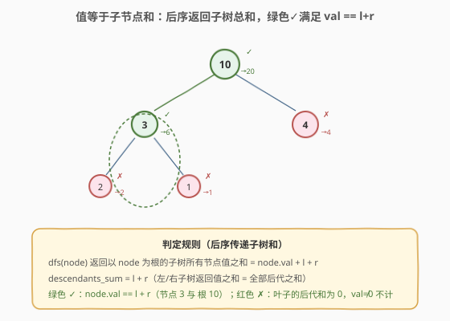
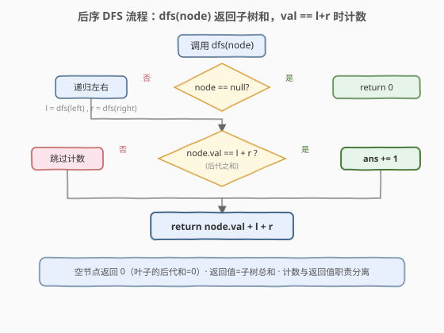
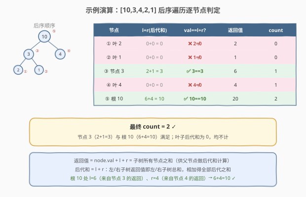

# 值等于子节点值之和的节点数量

- **题目名称**：值等于子节点值之和的节点数量
- **链接**：[1973. 值等于子节点值之和的节点数量 🔒](https://leetcode.cn/problems/count-nodes-equal-to-sum-of-descendants)
- **难度**：中等
- **标签**：树、二叉树、深度优先搜索、后序遍历

## 1. 题目概述

给定一棵二叉树的根节点 `root`，返回满足条件「节点的值等于该节点所有子节点值之和」的节点数量。

> **子节点（descendant）**：一个节点 `x` 的子节点是指从节点 `x` 出发，到所有叶子节点路径上的节点（即子树中除 `x` 自身外的全部节点）。没有子节点的叶子，其子节点之和视为 `0`。

**示例 1**：

```text
输入：root = [10,3,4,2,1]
输出：2

        10
       /  \
      3    4
     / \
    2   1
```

- 值为 `10` 的节点：子节点之和 = $3+4+2+1 = 10$，满足；
- 值为 `3` 的节点：子节点之和 = $2+1 = 3$，满足；
- 叶子 `4 / 2 / 1`：子节点之和 = $0$，均不满足。

**示例 2**：

```text
输入：root = [2,3,null,2,null]
输出：0

        2
       /
      3
     /
    2
```

没有节点满足其值等于子节点之和（根 `2` 的后代和 $3+2=5\ne2$；节点 `3` 的后代和 $2\ne3$；叶子后代和 $0$）。

**示例 3**：

```text
输入：root = [0]
输出：1
```

值为 `0` 的节点没有子节点，子节点之和视为 `0`，$0==0$ 满足。

**约束条件**：

- 树中节点数量范围 $[1, 10^5]$
- $0 \le \text{Node.val} \le 10^5$

> 💡 本题是「**后序遍历 + 数值返回值传递**」家族的招牌题。一个节点的「子节点之和」恰恰等于「左右子树所有节点之和」，而这正是左右孩子各自递归返回的值——天然的后序（自底向上）结构。与 [250. 统计同值子树](../0201-0300/250_统计同值子树.md) 的「布尔返回值传递同值性」互为表里，本题把返回值换成「子树总和」这一数值。

---

## 2. 解题思路

### 2.1 暴力思路：逐节点重新求和

最直观的做法：遍历每个节点，对每个节点调用一次 `sumDescendants(node)` 递归求其子树（除自身）的节点值之和，再与 `node.val` 比较。时间 $O(n^2)$（每个节点被重复求和多次），空间 $O(h)$ 递归栈。能过小数据，但**完全没有利用「子树之和可由子问题拼接」的性质**——一个节点的后代和等于其左右孩子的「子树总和」之和，而左右孩子在被遍历时本就可以算出这个总和，无需重复扫描。

### 2.2 核心观察：后序传递子树总和



**关键洞察**：后代和具有**最优子结构**——

> 节点 `node` 的后代和 $=$ 左子树所有节点值之和 $+$ 右子树所有节点值之和 $=$ `dfs(left) + dfs(right)`

其中 `dfs(child)` 返回「以 `child` 为根的子树所有节点值之和」（包含 `child` 自身）。这意味着只需一次**后序遍历**（先递归左、右，再处理根），DFS 返回数值「子树总和」，在节点处用 `l + r` 与 `node.val` 比较即可。每个节点只访问一次。

> ⚠️ **叶子的后代和为 0**：叶子没有孩子，`dfs(null)` 返回 `0`，故 `l + r = 0`。只有 `node.val == 0` 的叶子才会被计数（如示例 3）。这是递归的「天然基底」，无需特判。
>
> ⚠️ **返回值 ≠ 后代和**：`dfs` 返回的是「子树总和」`node.val + l + r`（含自身），而用于判定的是「后代和」`l + r`（不含自身）。二者职责分离，切勿混淆——返回值供父节点拼接，判定用 `l + r`。

### 2.3 算法流程图



**DFS 完整步骤**（函数 `dfs(node)` 返回子树所有节点值之和）：

1. **空节点**：返回 `0`（空子树无节点，和为 0）；
2. **递归左右**：`l = dfs(node.left)`，`r = dfs(node.right)`（后序：先拿到子树总和）；
3. **判定计数**：若 `node.val == l + r`，则 `ans += 1`；
4. **返回子树总和**：`return node.val + l + r`（供父节点拼接后代和）。

> 💡 **为什么空节点返回 `0`？** 空子树不含任何节点，值之和为 `0`。这不仅符合直觉，也使叶子节点的 `l + r = 0 + 0 = 0` 自然成立，无需为叶子单独写分支。与「空区间求和为 0」「空树高度为 0」的约定一脉相承。

### 2.4 示例演算

以 `root = [10,3,4,2,1]` 为例，后序遍历顺序与计数过程：



| 后序访问节点 | `l`（左子树和） | `r`（右子树和） | 后代和 `l+r` | `val == l+r`? | 返回值（子树总和） | `count` |
|-------------|----------------|----------------|-------------|--------------|------------------|---------|
| ① 叶 2 | 0 | 0 | 0 | ❌ $2\ne0$ | 2 | 0 |
| ② 叶 1 | 0 | 0 | 0 | ❌ $1\ne0$ | 1 | 0 |
| ③ 节点 3 | 2 | 1 | 3 | ✅ $3==3$ | 6 | 1 |
| ④ 叶 4 | 0 | 0 | 0 | ❌ $4\ne0$ | 4 | 1 |
| ⑤ 根 10 | 6 | 4 | 10 | ✅ $10==10$ | 20 | 2 |

最终 `count = 2` ✓。注意 ⑤ 根节点处的 `l = 6` 正是 ③ 节点 `3` 返回的子树总和，`r = 4` 是 ④ 返回的——**后序传递使父节点直接复用子节点的计算结果**，无需重新扫描。

> 💡 **数值传递链**：③ 节点 `3` 计算完返回 `6` 给根；根把 `6 + 4 = 10` 当作后代和。整条链上每个节点的子树总和只算一次、向上传递一次，这正是 $O(n)$ 的来源。

---

## 3. 参考代码

### C++

```cpp
/**
 * Definition for a binary tree node.
 * struct TreeNode {
 *     int val;
 *     TreeNode *left;
 *     TreeNode *right;
 *     TreeNode() : val(0), left(nullptr), right(nullptr) {}
 *     TreeNode(int x) : val(x), left(nullptr), right(nullptr) {}
 *     TreeNode(int x, TreeNode *left, TreeNode *right) : val(x), left(left), right(right) {}
 * };
 */
class Solution {
   public:
    int ans = 0;

    int equalToDescendants(TreeNode* root) {
        dfs(root);
        return ans;
    }

    long long dfs(TreeNode* node) {
        if (!node) return 0;                 // 空子树：和为 0
        long long l = dfs(node->left);       // 后序：先拿左右子树总和
        long long r = dfs(node->right);
        if (l + r == node->val) ans++;       // 后代和 == 自身值 → 计数
        return node->val + l + r;            // 返回子树总和（含自身）
    }
};
```

### Python

```python
# Definition for a binary tree node.
# class TreeNode:
#     def __init__(self, val=0, left=None, right=None):
#         self.val = val
#         self.left = left
#         self.right = right
class Solution:
    def equalToDescendants(self, root: Optional[TreeNode]) -> int:
        ans = 0

        def dfs(node: Optional[TreeNode]) -> int:
            nonlocal ans
            if not node:
                return 0                    # 空子树：和为 0
            l = dfs(node.left)               # 后序：先拿左右子树总和
            r = dfs(node.right)
            if l + r == node.val:            # 后代和 == 自身值 → 计数
                ans += 1
            return node.val + l + r          # 返回子树总和（含自身）

        dfs(root)
        return ans
```

> ⚠️ **C++ 必须用 `long long`**：$n \le 10^5$ 且 $\text{val} \le 10^5$，整棵树的总和可达 $10^{10}$，超过 `int` 上界（约 $2.1\times10^9$）。`dfs` 的返回值与 `l + r` 都需用 `long long`，否则会溢出导致误判。Python 原生大整数无此问题。
>
> 💡 两版等价。`dfs` 同时承担「返回子树总和」与「副作用计数」两职——返回值驱动父节点拼接后代和，副作用 `ans += 1` 记录结果。这是树形「数值返回 + 副作用计数」的通用模板，与 [250. 统计同值子树](../0201-0300/250_统计同值子树.md) 的「布尔返回 + 副作用计数」骨架完全一致，只是返回类型由 `bool` 换成数值。

---

## 4. 复杂度分析

| 维度 | 复杂度 | 说明 |
|------|--------|------|
| 时间复杂度 | $O(n)$ | 每个节点只访问一次，每次做 $O(1)$ 加法与比较 |
| 空间复杂度 | $O(h)$ | 递归栈深度 = 树高 $h$；平衡树 $O(\log n)$，退化链状 $O(n)$ |
| 最坏情况 | $O(n)$ 空间 | 树退化为单侧链时递归深度达 $n$ |

> ⚠️ 暴力法 $O(n^2)$ 的浪费在于：求某节点后代和时已扫描过其子树，父节点又重新扫描一遍。后序传递法把「子树总和」压缩成一个数值向上传递，父节点直接读取孩子的返回值，避免了重复扫描——这本质上是**记忆化思想**在树形结构上的体现，与 [250. 统计同值子树](../0201-0300/250_统计同值子树.md) 把「同值性」压缩成布尔值是同一范式。

---

## 5. 扩展：迭代法后序遍历

递归写法直观，但树极深时可能栈溢出。用显式栈做后序遍历，需在栈中标记「是否已处理左右」，并用字典缓存子树总和。

```python
class Solution:
    def equalToDescendants(self, root: Optional[TreeNode]) -> int:
        if not root:
            return 0
        ans = 0
        stack = [(root, False)]      # (节点, 是否已处理左右)
        total = {}                   # id(node) -> 子树总和
        while stack:
            node, visited = stack.pop()
            if visited:
                l = total.get(id(node.left), 0)
                r = total.get(id(node.right), 0)
                if l + r == node.val:
                    ans += 1
                total[id(node)] = node.val + l + r
            else:
                stack.append((node, True))    # 后序：根最后处理
                if node.right:
                    stack.append((node.right, False))
                if node.left:
                    stack.append((node.left, False))
        return ans
```

> 💡 **迭代 vs 递归**：迭代版用 `visited` 标记模拟后序「先左右后根」，用 `total` 字典替代递归返回值传递。时间同样 $O(n)$，空间 $O(n)$（栈 + 字典）。逻辑更繁，**面试推荐递归版**——简洁且能体现对后序子结构传递的理解。迭代版仅在树极深（递归栈溢出风险）时才有实际优势。

---

## 6. 面试要点

1. **为什么用后序遍历而不是前序或中序？**

   > 节点的后代和依赖子树的结果——只有先算出左右子树的总和，才能得到当前节点的后代和并与之比较。这是典型的「子问题结果决定父问题」结构，对应后序（左右根）。前序/中序在处理父节点时尚未获取子树总和，无法在一次遍历内完成判定。

2. **返回值为什么是「子树总和」而不是「后代和」？**

   > 父节点需要的是「孩子的子树总和」来拼接自己的后代和。若 `dfs` 返回后代和（不含自身），父节点就无法还原子树总和——会丢失自身值。返回「子树总和」（含自身）是唯一能支持父节点计算的信息：父的后代和 $=$ `dfs(left) + dfs(right)`。判定时则用 `l + r`（后代和），与返回值 `node.val + l + r` 职责分离。

3. **叶子节点如何处理？为什么不需要特判？**

   > 叶子的左右孩子为空，`dfs(null)` 返回 `0`，故后代和 `l + r = 0`。只有 `val == 0` 的叶子会被计数（如示例 3）。空节点返回 `0` 是天然基底，使叶子逻辑与内部节点统一，无需特判分支。

4. **C++ 为什么必须用 `long long`？**

   > $n \le 10^5$、$\text{val} \le 10^5$，子树总和最大 $10^{10}$，超过 `int` 上界（$2.1\times10^9$）。若用 `int`，`l + r` 与返回值都会溢出，可能产生负数或环绕值，导致 `l + r == node.val` 误判。`dfs` 返回类型、`l`、`r` 都须声明为 `long long`。Python 原生支持大整数，无此问题。

5. **本题和 250 统计同值子树的异同？**

   > 二者都是「后序遍历 + 返回值传递子结构结论 + 副作用计数」模板。区别仅在返回类型：250 返回 `bool`（子树是否同值），父节点据此与值一致性检查合流；本题返回数值（子树总和），父节点据此拼接后代和。掌握了这套骨架，树形「判定/统计」题可一通百通——把子问题结论压缩成一个返回值向上传递即可。

> 💡 **一句话总结**：1973 的灵魂是「**后序遍历 + 数值返回值传递子树总和**」——`dfs` 返回「子树所有节点值之和」，父节点用 `l + r` 得到后代和与自身值比较，一次遍历 $O(n)$ 完成判定与计数。这是 [250. 统计同值子树](../0201-0300/250_统计同值子树.md) 「布尔返回」模板的「数值返回」版本。

---

## 7. 同类练习题

- [250. 统计同值子树](https://leetcode.cn/problems/count-univalue-subtrees/)（[题解](../0201-0300/250_统计同值子树.md)）：后序返回 `bool` 传递「子树是否同值」，与本题的「数值返回」互为表里，同套后序 + 副作用计数骨架
- [124. 二叉树中的最大路径和](https://leetcode.cn/problems/binary-tree-maximum-path-sum/)：后序返回子树最大贡献值，在节点处聚合路径和，同套「后序 + 数值返回 + 副作用记录最值」模板
- [543. 二叉树的直径](https://leetcode.cn/problems/diameter-of-binary-tree/)：后序返回子树深度，在节点处聚合直径，经典「后序 + 返回值 + 副作用记录最值」模板
- [968. 监控二叉树](https://leetcode.cn/problems/binary-tree-cameras/)：后序返回节点状态（被覆盖情况），自底向上贪心放置相机，同套后序传递子结构结论思想
- [236. 二叉树的最近公共祖先](https://leetcode.cn/problems/lowest-common-ancestor-of-a-binary-tree/)（[题解](../0101-0200/236_二叉树的最近公共祖先.md)）：后序返回「子树是否含 p/q」，在节点处聚合判定 LCA，同套后序返回值传递骨架
