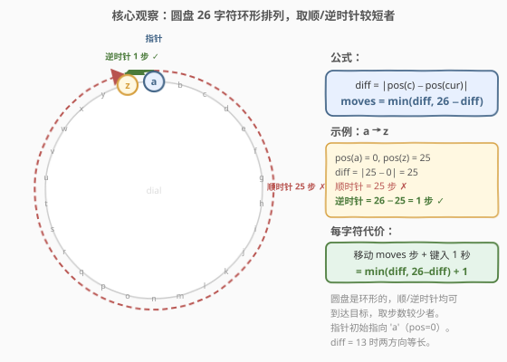
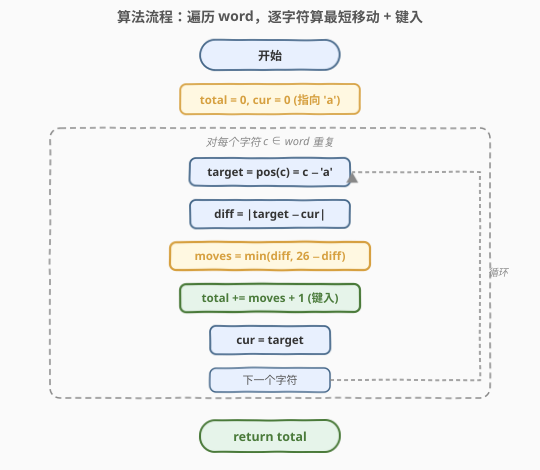
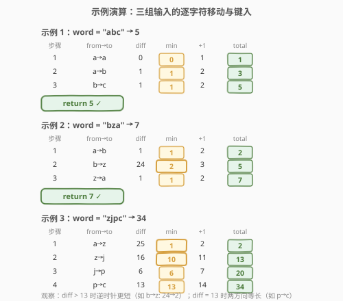

# LeetCode 使用特殊打字机键入单词的最少时间 题解

## 1. 题目概述

- **标题 / 题号**：使用特殊打字机键入单词的最少时间（#1974，easy）
- **链接**：https://leetcode.cn/problems/minimum-time-to-type-word-using-special-typewriter/
- **难度**：简单
- **标签**：贪心、字符串、模拟

**题意**：有一个特殊打字机，它由一个**圆盘**和一个**指针**组成，圆盘上标有小写英文字母 `'a'` 到 `'z'`，按字母顺序**环形排列**。**只有**当指针指向某个字母时，它才能被键入。指针**初始时**指向字符 `'a'`。

每一秒钟，你可以执行以下操作之一：

- 将指针**顺时针**或者**逆时针**移动一个字符。
- 键入指针**当前**指向的字符。

给你一个字符串 `word`，请你返回键入 `word` 所表示单词的**最少**秒数。

**示例 1**：

```text
输入：word = "abc"
输出：5
解释：
- 花 1 秒键入字符 'a'（指针初始指向 'a'，不需移动）。
- 花 1 秒将指针顺时针移到 'b'。
- 花 1 秒键入字符 'b'。
- 花 1 秒将指针顺时针移到 'c'。
- 花 1 秒键入字符 'c'。
```

**示例 2**：

```text
输入：word = "bza"
输出：7
解释：
- 花 1 秒将指针顺时针移到 'b'。
- 花 1 秒键入字符 'b'。
- 花 2 秒将指针逆时针移到 'z'。
- 花 1 秒键入字符 'z'。
- 花 1 秒将指针顺时针移到 'a'。
- 花 1 秒键入字符 'a'。
```

**示例 3**：

```text
输入：word = "zjpc"
输出：34
解释：
- 花 1 秒将指针逆时针移到 'z'。
- 花 1 秒键入字符 'z'。
- 花 10 秒将指针顺时针移到 'j'。
- 花 1 秒键入字符 'j'。
- 花 6 秒将指针顺时针移到 'p'。
- 花 1 秒键入字符 'p'。
- 花 13 秒将指针逆时针移到 'c'。
- 花 1 秒键入字符 'c'。
```

**约束**：

- $1 \le \text{word.length} \le 100$
- `word` 只包含小写英文字母

> 💡 **审题关键**：① 圆盘是**环形**的——从 `'a'` 到 `'z'` 既可顺时针走 25 步，也可逆时针走 1 步，取较短者；② 每个字符的代价 = **移动步数 + 1**（移动到目标位置 + 键入）；③ 指针**初始指向 `'a'`**，即位置 0；④ 键入 `word` 的总时间 = 逐字符移动 + 键入的累加和，每步独立贪心取最短即可。

## 2. 解题思路

### 2.1 暴力思路：BFS 搜索最短路径

最直觉的做法：将「指针位置 + 已键入字符数」定义为状态，用 BFS 搜索从初始状态 `(pos=0, typed=0)` 到目标状态 `(pos=任意, typed=n)` 的最短路径。每个状态有三个后继：顺时针移、逆时针移、键入。

- **正确性**：BFS 保证最短路径，理论可行。
- **效率**：状态空间 $O(26 \times n)$，每个状态 3 个转移，BFS 总时间 $O(n)$，空间 $O(n)$。看似可行，但 **大材小用**——本题的结构远比一般最短路简单。

> ⚠️ BFS 的「浪费」在于：它把本题当作一般图最短路问题，忽略了**圆盘是环形**这一关键结构。实际上，指针从当前位置到目标位置的最短移动是确定的——就是 $\min(\text{diff}, 26 - \text{diff})$——无需搜索即可直接计算。

### 2.2 核心观察：环形最短距离 min(diff, 26−diff)



关键洞察分三步：

**第一步：圆盘是环形的。** 26 个字母首尾相连形成环。从位置 `cur` 到位置 `target`，既可以**顺时针**走 `diff = |target - cur|` 步，也可以**逆时针**走 `26 - diff` 步。两条路径覆盖了所有到达方式，取较短者即为最短移动。

**第二步：每步独立贪心。** 键入 `word` 的过程是**顺序确定**的——必须先键入 `word[0]`，再键入 `word[1]`，依此类推。每一步的移动只取决于当前指针位置和下一个目标字符，**不受未来步骤影响**。因此无需全局规划，逐字符贪心取最短移动即可。

**第三步：代价公式。** 每个字符的代价 = 移动步数 + 键入 1 秒：

$$\boxed{\text{cost}(c) = \min(\text{diff},\; 26 - \text{diff}) + 1, \quad \text{diff} = |\text{pos}(c) - \text{pos}(\text{cur})|}$$

其中 $\text{pos}(c) = c - \text{'a'}$（字符在圆盘上的位置，$0 \sim 25$）。

> 💡 **为什么贪心是全局最优？** 本题具有**最优子结构**：键入 `word[i:]` 的最小代价 = 键入 `word[i]` 的最小代价 + 键入 `word[i+1:]` 的最小代价。而键入 `word[i]` 的最小代价 = 从当前位置到 `word[i]` 的最短移动 + 1，这个最短移动是确定的（环形距离）。因此逐字符取最短移动就是全局最优，无需回溯或动态规划。

> ⚠️ **易错点：只算顺时针。** 若忽略圆盘的环形性质，只按顺时针计算 `diff = |target - cur|`，会在 `diff > 13` 时出错。例如从 `'b'` 到 `'z'`：顺时针 24 步，但逆时针只需 2 步（`b → a → z`）。必须取 `min(diff, 26 - diff)`。

### 2.3 算法流程图



整体为「一趟遍历 + 贪心累加」的线性流程：

1. **初始化**：$\text{total} = 0$，$\text{cur} = 0$（指针初始指向 `'a'`，位置 0）。
2. **遍历 `word`**：对每个字符 $c$：
   - 计算目标位置：$\text{target} = \text{pos}(c) = c - \text{'a'}$。
   - 计算差值：$\text{diff} = |\text{target} - \text{cur}|$。
   - 取最短移动：$\text{moves} = \min(\text{diff},\; 26 - \text{diff})$。
   - 累加代价：$\text{total} \mathrel{+}= \text{moves} + 1$（移动 + 键入）。
   - 更新指针：$\text{cur} = \text{target}$。
3. **返回** $\text{total}$。

> 💡 **为什么不需要回溯？** 每一步的指针移动是确定的——从当前位置到目标字符取最短路径，没有「选哪条路」的歧义（两条路径长度不同时取短的，相同时任取一条）。因此不存在「当前选择影响未来」的情况，一趟扫描即可。

### 2.4 示例演算

以三个官方示例演示逐字符的移动与键入过程：



**示例 1**（`word = "abc"`）：

| 步骤 | from→to | diff | $\min(\text{diff}, 26-\text{diff})$ | +1（键入） | total |
|------|---------|------|--------------------------------------|-----------|-------|
| 1 | a→a | 0 | 0 | 1 | 1 |
| 2 | a→b | 1 | 1 | 2 | 3 |
| 3 | b→c | 1 | 1 | 2 | 5 |

最终 $\text{total} = 5$。

**示例 2**（`word = "bza"`）：

| 步骤 | from→to | diff | $\min(\text{diff}, 26-\text{diff})$ | +1（键入） | total |
|------|---------|------|--------------------------------------|-----------|-------|
| 1 | a→b | 1 | 1 | 2 | 2 |
| 2 | b→z | 24 | **2** | 3 | 5 |
| 3 | z→a | 1 | 1 | 2 | 7 |

最终 $\text{total} = 7$。关键在第 2 步：`b→z` 的 diff = 24，但逆时针只需 $26 - 24 = 2$ 步。

**示例 3**（`word = "zjpc"`）：

| 步骤 | from→to | diff | $\min(\text{diff}, 26-\text{diff})$ | +1（键入） | total |
|------|---------|------|--------------------------------------|-----------|-------|
| 1 | a→z | 25 | **1** | 2 | 2 |
| 2 | z→j | 16 | **10** | 11 | 13 |
| 3 | j→p | 6 | 6 | 7 | 20 |
| 4 | p→c | 13 | 13 | 14 | 34 |

最终 $\text{total} = 34$。

> 💡 **观察要点**：① 第 1 步 `a→z`：diff = 25，但逆时针只需 1 步——这是环形距离最戏剧性的体现；② 第 4 步 `p→c`：diff = 13 = 26 − 13，两方向等长，任取一条；③ 当 $\text{diff} \le 13$ 时顺时针更短（或等长），$\text{diff} > 13$ 时逆时针更短。

## 3. 参考代码

### C++（位置数字版）

```cpp
class Solution {
public:
    int minTimeToType(string word) {
        int total = 0, cur = 0;
        for (char c : word) {
            int target = c - 'a';
            int diff = abs(target - cur);
            total += min(diff, 26 - diff) + 1;
            cur = target;
        }
        return total;
    }
};
```

### Python（字符版，可读性优先）

```python
class Solution:
    def minTimeToType(self, word: str) -> int:
        total = 0
        prev = 'a'
        for c in word:
            diff = abs(ord(c) - ord(prev))
            total += min(diff, 26 - diff) + 1
            prev = c
        return total
```

### Python（位置数字版，对应 C++）

```python
class Solution:
    def minTimeToType(self, word: str) -> int:
        total, cur = 0, 0
        for c in word:
            target = ord(c) - 97
            diff = abs(target - cur)
            total += min(diff, 26 - diff) + 1
            cur = target
        return total
```

> 💡 **写法对照**：① 字符版直接用 `ord(c) - ord(prev)` 算 diff，无需显式转换位置数字，代码更贴近题意；② 位置数字版将字符映射为 $0 \sim 25$ 的整数，与 C++ 一一对应，便于解释公式。两版逻辑完全相同，时间复杂度均为 $O(n)$。

> ⚠️ **`ord('a')` vs 硬编码 97**：`ord('a') = 97` 是 ASCII 常识，但代码中用 `ord('a')` 或 `97` 均可。字符版用 `ord(c) - ord(prev)` 避免了记忆 ASCII 值，更可读；位置数字版用 `ord(c) - 97` 更简洁。面试中两种写法均可接受。

## 4. 复杂度分析

| 维度 | 复杂度 | 说明 |
|------|--------|------|
| 时间复杂度 | $O(n)$ | 一趟遍历 `word`，每个字符 $O(1)$ 计算 diff 和 min |
| 空间复杂度 | $O(1)$ | 仅 `total`、`cur` 两个变量，与输入规模无关 |

> 💡 本题 $n \le 100$，$O(n)$ 瞬时返回。即使 $n$ 放大到 $10^6$，单趟扫描仍高效。瓶颈不在算法而在 I/O。

## 5. 扩展：环形距离的通用性

### 5.1 环形最短距离公式

本题的核心公式 $\min(\text{diff},\; n - \text{diff})$ 适用于**任意环形结构**上的两点最短距离计算：

$$d_{\text{ring}}(a, b) = \min\bigl(|a - b|,\; n - |a - b|\bigr)$$

其中 $n$ 为环上元素总数，$a, b$ 为两点的位置编号。这一公式在以下场景中反复出现：

- **时钟问题**：12 小时制时钟上时针从 3 到 10 的最短转动 = $\min(7, 5) = 5$ 小时。
- **公交站间距离**：环形路线上两站间的最短距离（见 [1184. 公交站间的距离](https://leetcode.cn/problems/distance-between-bus-stops/)）。
- **字符移位**：字母表上的循环移位（见 [848. 字母移位](https://leetcode.cn/problems/shifting-letters/)）。

### 5.2 何时 diff > n/2 时逆时针更短

当 $\text{diff} > n / 2$（本题 $n = 26$，即 $\text{diff} > 13$）时，逆时针路径 $n - \text{diff}$ 更短。当 $\text{diff} = n / 2$（如本题 diff = 13）时，两方向等长，任取一条。

> 💡 **一句话总结**：环形结构上两点的最短距离 = $\min(\text{diff},\; n - \text{diff})$，逐字符贪心累加即可，$O(n)$ 时间、$O(1)$ 空间。

## 6. 面试要点

**Q1：为什么取 min(diff, 26−diff)？**

> 圆盘是环形的，从位置 `cur` 到 `target` 有两条路径：顺时针走 `diff = |target - cur|` 步，逆时针走 `26 - diff` 步。取较短者即为最短移动。例如 `a→z`：顺时针 25 步，逆时针 1 步，取 1。

**Q2：为什么贪心是全局最优？不需要动态规划或回溯吗？**

> 本题具有最优子结构：键入 `word[i:]` 的最小代价 = 键入 `word[i]` 的最小代价 + 键入 `word[i+1:]` 的最小代价。而键入 `word[i]` 的最小代价 = 环形最短移动 + 1，这个移动是确定的，没有选择歧义。因此逐字符贪心就是全局最优，无需 DP 或回溯。

**Q3：指针初始位置为什么是 'a'？**

> 题目明确指定指针初始指向 `'a'`（位置 0）。代码中 `cur = 0` 或 `prev = 'a'` 初始化即体现这一点。若初始位置不同（如指向 `'z'`），只需修改初始值即可，算法逻辑不变。

**Q4：如果圆盘字母顺序打乱（非 a→z 顺序排列）怎么办？**

> 需要额外维护一个「字符→位置」的映射表（如哈希表或数组），将字符映射到其在圆盘上的实际位置。公式 $\min(\text{diff},\; 26 - \text{diff})$ 仍然适用，但 `pos(c)` 不再是 $c - \text{'a'}$ 而是查表得到。本题字母按顺序排列，`pos(c) = c - 'a'` 是最简映射。

**Q5：diff = 13 时该走顺时针还是逆时针？**

> 两者步数相同（均为 13），走哪条都一样。$\min(13, 26 - 13) = 13$，结果不受影响。示例 3 中 `p→c`（diff = 13）即此情形，两方向等长。

> 💡 **一句话总结**：圆盘 26 字符环形排列，逐字符取 $\min(\text{diff},\; 26 - \text{diff}) + 1$ 累加——$O(n)$ 时间、$O(1)$ 空间，贪心一趟扫描。

## 同类练习题

| # | 题目 | 与本题的关联 |
|---|------|-------------|
| 1184 | [公交站间的距离](https://leetcode.cn/problems/distance-between-bus-stops/)（[题解](../1101-1200/1184_公交站间的距离.md)） | 环形路线上两站间最短距离，完全相同的 $\min(\text{diff},\; n - \text{diff})$ 公式，将字母换成公交站 |
| 848 | [字母移位](https://leetcode.cn/problems/shifting-letters/)（[题解](../0801-0900/848_字母移位.md)） | 字母表上的循环移位，共享「字母表是 mod 26 环形」的核心性质，从单步移动升级为批量移位 |
| 1935 | [可以输入的最大单词数](https://leetcode.cn/problems/maximum-number-of-words-you-can-type/)（[题解](../1901-2000/1935_可以输入的最大单词数.md)） | 同区间邻居，同属「打字机」场景的简单字符串题，从「最短移动时间」转为「坏键过滤统计可输入单词数」 |
| 796 | [旋转字符串](https://leetcode.cn/problems/rotate-string/)（[题解](../0701-0800/796_旋转字符串.md)） | 字符串的环形旋转判定，共享「首尾相连成环」的概念，从字符级环形距离升级为字符串级旋转匹配 |
