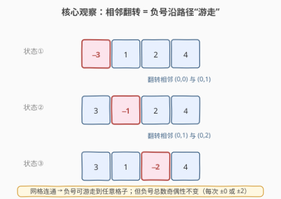
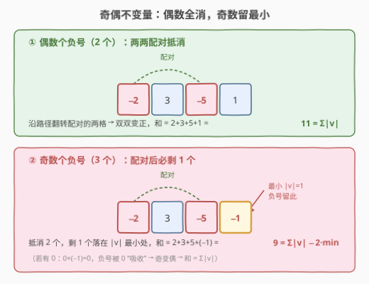
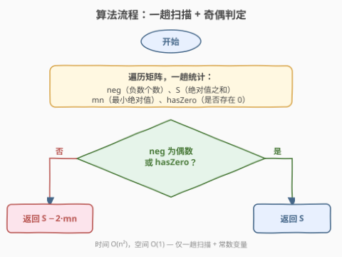
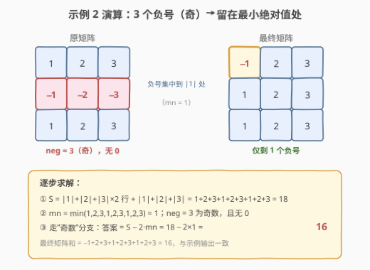

# LeetCode 最大方阵和 题解

## 1. 题目概述

- **标题 / 题号**：最大方阵和（#1975，medium）
- **链接**：https://leetcode.cn/problems/maximum-matrix-sum/
- **难度**：中等
- **标签**：贪心、矩阵、数学、不变量

**题意**：给你一个 $n \times n$ 的整数方阵 `matrix`。你可以执行以下操作**任意次**：

- 选择 `matrix` 中**相邻**两个元素，并将它们都**乘以 $-1$**。

如果两个元素有**公共边**，那么它们就是相邻的。你的目的是**最大化**方阵元素的和，请返回执行操作后能得到的最大和。

**示例 1**：

```text
输入：matrix = [[1,-1],[-1,1]]
输出：4
解释：将第一行的 2 个元素乘以 -1，再将第一列的 2 个元素乘以 -1，全矩阵变正，和为 4。
```

**示例 2**：

```text
输入：matrix = [[1,2,3],[-1,-2,-3],[1,2,3]]
输出：16
解释：将第二行的最后 2 个元素乘以 -1 → 第二行变 [−1,2,3]，再继续调整，最终仅剩一个负号落在绝对值最小处。
```

**约束**：

- $n = \text{matrix.length} = \text{matrix}[i].\text{length}$
- $2 \le n \le 250$
- $-10^5 \le \text{matrix}[i][j] \le 10^5$

> 💡 **审题关键**：① 操作每次同时翻转**两个相邻**元素的符号，不是任选两格；② 操作次数**不限**——这暗示存在一个“不变量”决定上界，而非模拟操作序列；③ 矩阵是 $n \times n$ 的**连通网格图**，任意两格之间都存在由相邻边组成的路径，这是后续“负号可游走”的拓扑前提。

## 2. 解题思路

### 2.1 暴力思路：搜索操作序列

最直白的想法：把每次“翻转相邻两格”视作一个动作，搜索所有可能的操作序列，记录过程中出现过的最大和。

- **正确性**：穷举所有序列理论上能命中最大和。
- **效率**：操作次数无上限，每步有 $O(n^2)$ 种相邻对可选，搜索空间**无限膨胀**，完全不可行。
- **盲点**：暴力只看到“操作”，没看到操作背后的**不变量**——所有合法操作序列能达成的状态集合，其实由一个简单的不变量完全刻画。

> ⚠️ 这类“不限次数翻转/交换”的题，几乎一定要先找**不变量**（哪些量永远不变），再用不变量刻画可达上界。直接搜索是没抓住问题本质的信号。

### 2.2 核心观察：负号游走 + 奇偶不变量



关键洞察分三步。

**第一步：每次操作改变负号个数为 $-2$、$0$ 或 $+2$，故“负号总数的奇偶性”是不变量。** 翻转相邻两格 $a,b$：

- 两格同号 → 翻转后仍同号，负号数不变（同正→同负，$+2$；同负→同正，$-2$）；
- 两格异号 → 翻转后仍异号，负号数不变（一正一负→一负一正，$\pm 0$）。

无论哪种，负号数的**变化量都是偶数**，因此 $\text{neg} \bmod 2$ 在任意操作序列下恒定。这是本题的**唯一不变量**。

**第二步：网格连通 → 一个负号可以沿相邻路径“游走”到任意格子。** 设负号在格子 $u$，想把它移到相邻格 $v$：翻转 $u,v$ → $u$ 变正、$v$ 变负，负号“跳”到了 $v$。沿 $u$ 到目标格 $w$ 的路径逐边重复，负号便游走到 $w$。下图展示负号从最左格游走到第三格的过程：

> 💡 **推论**：因为 $n \ge 2$ 的方阵是连通图，任意两格间有路径，所以**负号的位置可以被任意重排**——我们能自由决定哪些格子最终带负号，唯一约束是“最终负号总数与初始同奇偶”。

**第三步：用不变量定上界，并证明可达。** 设 $S = \sum |\text{matrix}[i][j]|$（绝对值之和），$m = \min |\text{matrix}[i][j]|$，初始负号数为 $\text{neg}$。

- **若 $\text{neg}$ 为偶数**：把负号两两配对，沿路径游走到相邻后翻转抵消，全部变正，和 $= S$。
- **若 $\text{neg}$ 为奇数**：至少剩一个负号。要最大化 $S - 2\sum_{\text{负号格}} |v|$，应让唯一的负号落在 $|v|$ 最小的格子上，和 $= S - 2m$。
- **若矩阵含 $0$**：翻转 $(0, \text{负格})$ → $0 \times (-1) = 0$（不变）、负格变正。即 $0$ 能“吸收”一个负号，使奇数情况也能变偶数 → 和 $= S$。



$$\text{答案} = \begin{cases} S & \text{neg 为偶数，或存在 } 0 \\ S - 2m & \text{neg 为奇数且无 } 0 \end{cases}$$

> ⚠️ **为什么“奇数情况减 $2m$ 而非 $m$”？** 负号落在最小格上，该格从 $+m$ 变成 $-m$，相对全正状态损失了 $m - (-m) = 2m$。所以从上界 $S$ 里扣 $2m$，而不是扣 $m$。

> 💡 **可达性证明要点**：① 负号可沿路径游走（连通性）；② 任意两个负号可被游走到相邻位置后翻转抵消（配对消去）；③ 抵消后若剩 1 个（奇数情况），把它游走到 $|v|$ 最小的格子即可。三步都依赖“连通网格图”这一前提——这也是题目给方阵（而非任意稀疏图）的原因。

### 2.3 算法流程图



整体步骤：

1. **一趟遍历**矩阵所有元素，维护四个量：
   - `S` = 绝对值之和；
   - `neg` = 负数个数；
   - `mn` = 最小绝对值；
   - `hasZero` = 是否存在 $0$。
2. **判定分支**：
   - 若 `neg` 为偶数 **或** `hasZero` 为真 → 返回 `S`；
   - 否则（`neg` 为奇数且无 $0$）→ 返回 `S - 2 * mn`。

无需真正执行任何翻转，统计完即得答案。

### 2.4 示例演算

以**示例 2**演算。原矩阵有 $3$ 个负号（$-1,-2,-3$），为奇数且无 $0$。



| 步骤 | 计算 | 结果 |
|------|------|------|
| ① 绝对值之和 $S$ | $1+2+3+1+2+3+1+2+3$ | $18$ |
| ② 最小绝对值 $m$ | $\min(1,2,3,1,2,3,1,2,3)$ | $1$ |
| ③ 奇偶判定 | $\text{neg}=3$ 为奇数，无 $0$ | 走“奇数”分支 |
| ④ 答案 | $S - 2m = 18 - 2\times 1$ | $16$ |

最终只需保留一个负号在 $|v|=1$ 的格子上（如图把 $(0,0)$ 变成 $-1$），其余全部翻正，矩阵和 $= -1+2+3+1+2+3+1+2+3 = 16$，与示例输出一致。**示例 1** 同理：$2$ 个负号（偶数）→ 直接全正 → $S = 1+1+1+1 = 4$。

> 💡 **观察要点**：① 答案只依赖四个统计量，与负号的具体位置无关——位置可通过游走任意重排；② 奇数情况下“负号留在哪”由 $m$ 决定，与负号原本分布无关；③ 含 $0$ 时奇偶分支被短路，统一返回 $S$，这是常被漏掉的边界。

## 3. 参考代码

### C++

```cpp
class Solution {
public:
    long long maxMatrixSum(vector<vector<int>>& matrix) {
        long long S = 0;          // 绝对值之和
        int neg = 0;              // 负数个数
        int mn = INT_MAX;         // 最小绝对值
        bool hasZero = false;
        for (const auto& row : matrix) {
            for (int x : row) {
                if (x == 0) hasZero = true;
                if (x < 0) neg++;
                int a = abs(x);
                S += a;
                mn = min(mn, a);
            }
        }
        if (neg % 2 == 0 || hasZero) return S;
        return S - 2LL * mn;      // 注意用 long long 防溢出
    }
};
```

### Python

```python
class Solution:
    def maxMatrixSum(self, matrix: List[List[int]]) -> int:
        S = 0
        neg = 0
        mn = float("inf")
        has_zero = False
        for row in matrix:
            for x in row:
                if x == 0:
                    has_zero = True
                if x < 0:
                    neg += 1
                a = abs(x)
                S += a
                if a < mn:
                    mn = a
        if neg % 2 == 0 or has_zero:
            return S
        return S - 2 * mn
```

> ⚠️ **溢出提醒**：$n \le 250$，$|matrix[i][j]| \le 10^5$，故 $S \le 250 \times 250 \times 10^5 = 6.25 \times 10^9$，超过 `int` 上界（$\approx 2.1\times 10^9$）。C++ 必须用 `long long` 累加 $S$，且 `S - 2 * mn` 写成 `S - 2LL * mn` 避免 `int` 中间溢出。Python 无此虑。

> 💡 **`hasZero` 可省略**：若存在 $0$，则 $mn = 0$，奇数分支返回 $S - 2\times 0 = S$，与偶数分支结果一致。因此代码可简化为只判 `neg % 2 == 0`，奇数时统一返回 `S - 2 * mn`——$0$ 的存在会自然让 `mn=0` 把扣减归零。这里显式写出 `hasZero` 仅为对应思路分支，便于讲解。

## 4. 复杂度分析

| 维度 | 复杂度 | 说明 |
|------|--------|------|
| 时间复杂度 | $O(n^2)$ | 一趟遍历 $n \times n$ 个元素，每个做 $O(1)$ 的绝对值/比较/累加 |
| 空间复杂度 | $O(1)$ | 仅维护 $S$、`neg`、`mn`、`hasZero` 四个标量，与输入规模无关 |

> 💡 $n \le 250$，$n^2 \le 62500$，单趟扫描在毫秒级完成。这是该问题的**理论下界**——至少要读入全部 $n^2$ 个数才能统计，无法优于 $O(n^2)$ 时间。

## 5. 扩展：连通性为什么重要？

本题的“负号游走”论证强依赖方阵是**连通网格图**：任意两格间存在由相邻边组成的路径。若把题目改成一般图（只在有边相连的两点间允许翻转），结论会如何？

- **图连通**：结论不变。负号仍可沿任意路径游走，奇偶不变量依旧决定上界，答案是 $S$（偶）或 $S - 2m$（奇、无 $0$）。
- **图不连通**：负号**不能跨连通块游走**。每个连通块独立维护自己的奇偶性，答案 $= \sum_{\text{块 }k}\big(S_k - 2m_k \cdot [\text{块 }k\text{ 内 neg 为奇且无 }0]\big)$。即每个奇数块各扣 $2m_k$，不能合并。

这把本题推广到了“图上符号翻转”的一般框架：**连通块内负号奇偶性是不变量，块间独立**。方阵只是“整张图恰为一个连通块”的特例。

> 💡 **与“翻转整行/整列”题的对照**：[2128. 删除全 1 的行列翻转](https://leetcode.cn/problems/remove-all-ones-with-row-and-column-flips/) 中翻转整行/整列，不变量是“任意两行的逐列异或 pattern 要么全等要么互补”。同样是“找不变量 → 判可达”，但不变量由操作定义决定，与本题“奇偶”不同。体会“操作决定不变量”这一通用思路。

## 6. 面试要点

**Q1：为什么不用搜索或 DP 模拟操作序列？**

> 操作次数无上限，搜索空间无限。这类“不限次数翻转”题的本质是**不变量**：所有合法操作改变负号数的量都是 $\pm 0$ 或 $\pm 2$，故“负号数奇偶性”恒定。不变量刻画了可达状态的边界，直接用统计量求上界即可，无需模拟。

**Q2：怎么想到“负号可以游走”？**

> 翻转相邻两格 $u,v$：若 $u$ 负 $v$ 正，翻转后 $u$ 正 $v$ 负——等价于负号从 $u$“跳”到了 $v$。沿一串相邻边重复，负号就沿路径游走。方阵是连通网格图，任意两格间有路径，所以负号位置可任意重排，唯一约束是奇偶性。这是“操作 = 移动某种标记”的视角转换。

**Q3：奇数情况为什么减 $2m$ 而不是 $m$？**

> 奇数个负号至少剩一个。把它放在 $|v|$ 最小的格子（值为 $m$）：相对“全正”的上界 $S$，该格从 $+m$ 变 $-m$，损失 $m-(-m)=2m$。所以从 $S$ 扣 $2m$，而非 $m$。常见口误是说成“扣掉最小的那个值”，那是漏算了一次方向反转。

**Q4：矩阵里有 $0$ 时会怎样？为什么要单独讨论？**

> 翻转 $(0, \text{负格})$：$0\times(-1)=0$ 不变，负格变正——$0$“吸收”了一个负号，使奇数个负号也能变偶数，答案直接是 $S$。代码层面其实无需特判：含 $0$ 时 $m=0$，奇数分支 $S - 2m = S$，自然归位。但思路讲解时点出 $0$ 的“吸收”作用，能展示对边界的完整把握。

**Q5：复杂度和溢出要注意什么？**

> 时间 $O(n^2)$ 一趟扫描，空间 $O(1)$，是理论最优。溢出是最大陷阱：$n=250$、$|v|\le 10^5$ 时 $S$ 可达 $6.25\times 10^9$，超 `int`。C++ 必须用 `long long` 累加，且减法写 `S - 2LL * mn` 避免中间 `int` 溢出。Python 无整型上限无需担心，但思路讲解时点出 C++ 的坑能加分。

> 💡 **一句话总结**：相邻翻转改变负号数 $\pm 0$ 或 $\pm 2$ → 奇偶性是不变量；网格连通 → 负号可游走到任意格子重排。偶数个负号全消得 $S$，奇数个留一个在最小绝对值处得 $S - 2m$，含 $0$ 则归为 $S$。一趟 $O(n^2)$ 统计四个量即得答案。

## 同类练习题

| # | 题目 | 与本题的关联 |
|---|------|-------------|
| 2128 | [删除全 1 的行列翻转](https://leetcode.cn/problems/remove-all-ones-with-row-and-column-flips/) | 翻转整行/整列判定能否全清零，同样是“找不变量定可达性”，对照“行列翻转不变量”与本题“奇偶不变量” |
| 3191 | [使二进制数组元素等于零的最小操作数 I](https://leetcode.cn/problems/minimum-operations-to-make-binary-array-elements-equal-to-zero-i/) | 翻转连续 3 个元素的贪心，对照“翻转相邻 2 个求最大和”的可达性视角差异 |
| 2317 | [操作后的最大 XOR](https://leetcode.cn/problems/maximum-xor-after-operations/) | 用“按位不变量”求最大化结果，与本题“用奇偶不变量定上界”同思路，体会不同操作下的不变量形式 |
| 1007 | [行相等的最少多米诺旋转](https://leetcode.cn/problems/minimum-domino-rotations-for-equal-row/) | 受限翻转下求最小操作数，对照本题“不限次数求最大和”——同属翻转类问题但目标不同 |
