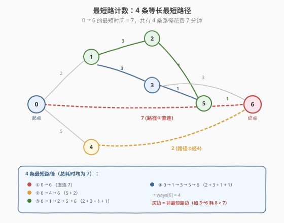
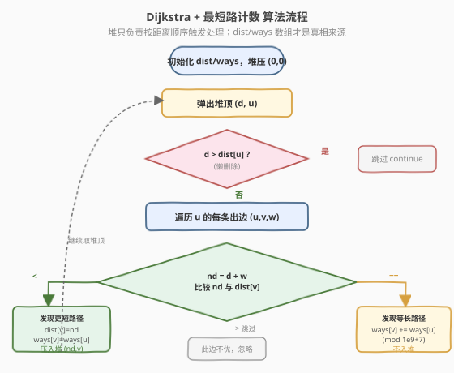
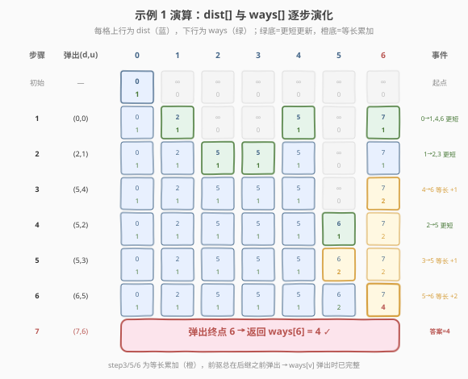

# 到达目的地的方案数

- **题目名称**：到达目的地的方案数
- **链接**：[1976. 到达目的地的方案数](https://leetcode.cn/problems/number-of-ways-to-arrive-at-destination/)
- **难度**：中等
- **标签**：图、最短路径、Dijkstra、计数

## 1. 题目概述

城市由 $n$ 个路口组成（编号 $0$ 到 $n-1$），某些路口之间有**双向**道路。保证图连通，且任意两路口之间最多一条路。

给定 `roads = [[u, v, time], ...]`，其中 `time` 为通过该道路所需分钟数。求从路口 $0$ 出发、花费**最少时间**到达路口 $n-1$ 的**路径数目**。由于答案可能很大，对 $10^9 + 7$ 取余后返回。

> 💡 **关键区别**：普通最短路只问「最短距离是多少」，本题还要问「有几条不同的最短路径」。这要求在松弛边时不仅维护距离，还要同步维护「到达该点的最短路条数」。

**示例 1**：

```text
输入：n = 7, roads = [[0,6,7],[0,1,2],[1,2,3],[1,3,3],[6,3,3],[3,5,1],[6,5,1],[2,5,1],[0,4,5],[4,6,2]]
输出：4
解释：从路口 0 到路口 6 的最短时间为 7 分钟，共有 4 条花费 7 分钟的路径：
- 0 ➝ 6
- 0 ➝ 4 ➝ 6
- 0 ➝ 1 ➝ 2 ➝ 5 ➝ 6
- 0 ➝ 1 ➝ 3 ➝ 5 ➝ 6
```

**示例 2**：

```text
输入：n = 2, roads = [[1,0,10]]
输出：1
解释：只有一条从 0 到 1 的路，花费 10 分钟。
```

**约束条件**：

- $1 \le n \le 200$
- $n - 1 \le \text{roads.length} \le \frac{n(n-1)}{2}$
- $1 \le \text{time}_i \le 10^9$
- $u_i \ne v_i$，任意两路口间至多一条路，图连通

---

## 2. 解题思路

### 2.1 暴力思路：为什么不能直接枚举路径？

最朴素的办法是枚举 $0$ 到 $n-1$ 的所有路径，记录其中最短时间及其出现次数。但路径数随节点数**指数增长**（图稍大即天文数字），必然超时。

退一步：能否先求出最短距离 $D$，再 DFS 只走总长恰为 $D$ 的路径来计数？这仍会重复访问大量中间状态——同一个「到达节点 $v$ 时已用时间 $t$」会被不同路径反复走到，存在大量**重复子问题**。

> ⚠️ 本题的核心在于：**在求最短路的同时顺带完成计数**，而不是「先求距离，再单独数路径」。二者可以合并到同一次 Dijkstra 中，避免重复搜索。

### 2.2 核心观察：Dijkstra + 最短路条数累加



回顾堆优化 Dijkstra（母题见 [743. 网络延迟时间](../0701-0800/743_网络延迟时间.md)）：维护 `dist[]` 表示源点到各点的最短估计，每次弹出距离最小的节点 $u$ 并松弛其出边。

本题在此基础上**增加一个并行数组** `ways[]`，含义为：

$$\text{ways}[v] = \text{从源点 0 到 v 的最短路径条数}$$

关键在于**松弛边 $(u, v, w)$ 时如何更新 `ways[v]`**。由于 Dijkstra 按 `dist` 从小到大弹出节点，弹出 $u$ 时 `dist[u]` 已最终确定、`ways[u]` 也已累加完毕（所有 $u$ 的最短路前驱都更近、更早被弹出）。于是分两种情况：

- **发现更短路径**（$dist[u] + w < dist[v]$）：之前的 `ways[v]` 全部作废，重置为 `ways[u]`（即「经由 $u$ 的这一条新最短路」），并更新 `dist[v]`、入堆。
- **发现等长路径**（$dist[u] + w = dist[v]$）：又多出 `ways[u]` 条同样短的路，累加 `ways[v] += ways[u]`，**无需入堆**（`dist[v]` 没变）。

> 💡 **为什么等长时不用入堆？** `dist[v]` 没变，$v$ 早已以该距离入过堆（或已被弹出）。而 $w \ge 1 \Rightarrow dist[u] = dist[v] - w < dist[v]$，故 $u$ 一定在 $v$ 之前被弹出——所有能贡献给 `ways[v]` 的等长前驱 $u$ 都会在 $v$ 被弹出之前处理完，`ways[v]` 在 $v$ 弹出时已累加完整。

### 2.3 算法流程图



1. 建邻接表 `adj[u] = [(v, w), ...]`（无向图，双向加边）。
2. 初始化 `dist[0] = 0`、`dist[其他] = ∞`；`ways[0] = 1`、`ways[其他] = 0`。
3. 最小堆存 `(距离, 节点)`，压入 `(0, 0)`。
4. 循环弹出堆顶 `(d, u)`：
   - **懒删除**：若 `d > dist[u]`，跳过（过期记录）。
   - **松弛每条出边** `(u, v, w)`，令 `nd = d + w`：
     - 若 `nd < dist[v]`：`dist[v] = nd`；`ways[v] = ways[u]`；压入 `(nd, v)`。
     - 若 `nd == dist[v]`：`ways[v] = (ways[v] + ways[u]) % MOD`。
5. 返回 `ways[n-1]`。

> ⚠️ **取模时机**：每次累加 `ways` 后立即 `% MOD`，防止中间值溢出（`time` 可达 $10^9$，`dist` 用 `long long`）。`dist` 比较时不取模。

### 2.4 示例演算

以示例 1 为例（$n=7$，终点为 6）。下图逐步展示 `dist[]` / `ways[]` 的演化，绿色为「严格更短」更新，橙色为「等长累加」。



| 步骤 | 弹出 `(d, u)` | 关键松弛 | dist 变化 | ways 变化 |
|------|--------------|----------|-----------|-----------|
| 初始 | — | dist[0]=0 | [0,∞,∞,∞,∞,∞,∞] | [1,0,0,0,0,0,0] |
| 1 | `(0,0)` | 0→6(7) 更短；0→1(2) 更短；0→4(5) 更短 | [0,2,∞,∞,5,∞,7] | [1,1,0,0,1,0,1] |
| 2 | `(2,1)` | 1→2(3) 更短；1→3(3) 更短 | [0,2,5,5,5,∞,7] | [1,1,1,1,1,0,1] |
| 3 | `(5,4)` | 4→6(2)：5+2=7 **==** dist[6]=7 → 累加 | 不变 | ways[6]=1+1=**2** |
| 4 | `(5,2)` | 2→5(1) 更短：dist[5]=6 | [0,2,5,5,5,6,7] | ways[5]=1 |
| 5 | `(5,3)` | 3→5(1)：5+1=6 **==** dist[5]=6 → 累加 | 不变 | ways[5]=1+1=**2** |
| 6 | `(6,5)` | 5→6(1)：6+1=7 **==** dist[6]=7 → 累加 | 不变 | ways[6]=2+2=**4** |
| 7 | `(7,6)` | 到达终点，返回 ways[6] | — | **4** ✓ |

> 💡 **观察 step 3/5/6**：这三步都是「等长累加」，对应三条经由中间点的最短路（`0→4→6`、`0→1→3→5→6`、`0→1→2→5→6`）。加上 step 1 直接走的 `0→6`，共 4 条，与答案吻合。注意 `5→6` 的累加发生在 `ways[5]` 已被 step 4、step 5 累加完整（=2）之后——这正是「前驱先于后继弹出」的体现。

---

## 3. 参考代码

### C++

```cpp
class Solution {
public:
    int countPaths(int n, vector<vector<int>>& roads) {
        const long long MOD = 1e9 + 7;
        // 邻接表
        vector<vector<pair<int, long long>>> adj(n);
        for (auto& r : roads) {
            adj[r[0]].push_back({r[1], r[2]});
            adj[r[1]].push_back({r[0], r[2]});
        }

        const long long INF = LLONG_MAX / 2;
        vector<long long> dist(n, INF);
        vector<long long> ways(n, 0);
        dist[0] = 0;
        ways[0] = 1;

        // 最小堆：(距离, 节点)
        priority_queue<pair<long long, int>, vector<pair<long long, int>>,
                       greater<>> pq;
        pq.push({0, 0});

        while (!pq.empty()) {
            auto [d, u] = pq.top(); pq.pop();
            if (d > dist[u]) continue;          // 懒删除
            for (auto& [v, w] : adj[u]) {
                long long nd = d + w;
                if (nd < dist[v]) {             // 发现更短路径
                    dist[v] = nd;
                    ways[v] = ways[u];
                    pq.push({nd, v});
                } else if (nd == dist[v]) {     // 发现等长路径，累加
                    ways[v] = (ways[v] + ways[u]) % MOD;
                }
            }
        }
        return ways[n - 1];
    }
};
```

### Python

```python
class Solution:
    def countPaths(self, n: int, roads: List[List[int]]) -> int:
        MOD = 10 ** 9 + 7
        adj = [[] for _ in range(n)]
        for u, v, w in roads:
            adj[u].append((v, w))
            adj[v].append((u, w))

        INF = float('inf')
        dist = [INF] * n
        ways = [0] * n
        dist[0] = 0
        ways[0] = 1

        import heapq
        pq = [(0, 0)]  # (距离, 节点)
        while pq:
            d, u = heapq.heappop(pq)
            if d > dist[u]:            # 懒删除
                continue
            for v, w in adj[u]:
                nd = d + w
                if nd < dist[v]:       # 发现更短路径
                    dist[v] = nd
                    ways[v] = ways[u]
                    heapq.heappush(pq, (nd, v))
                elif nd == dist[v]:    # 发现等长路径，累加
                    ways[v] = (ways[v] + ways[u]) % MOD

        return ways[n - 1]
```

> 💡 **数据类型注意**：`time` 可达 $10^9$，路径长度可累加到 $n \cdot 10^9 \approx 2 \times 10^{11}$，超出 32 位 `int` 范围。C++ 中 `dist` 与堆元素须用 `long long`；Python 的 `int` 无此问题。`ways` 取模后用 `int` 即可，但 C++ 中为简化统一也开 `long long`。

---

## 4. 复杂度分析

| 维度 | 复杂度 | 说明 |
|------|--------|------|
| 时间复杂度 | $O(E \log V)$ | 每条边至多触发一次「更短」入堆，堆操作 $O(\log V)$；等长累加不入堆，$O(1)$ |
| 空间复杂度 | $O(V + E)$ | 邻接表 $O(E)$，`dist`/`ways` 各 $O(V)$，堆最坏 $O(E)$ |

> 💡 本题 $V \le 200$、$E \le \frac{V(V-1)}{2} \approx 2 \times 10^4$，$E \log V$ 约 $2 \times 10^4 \times 8$，非常宽裕。即使 $V$ 大一个数量级也能通过。

---

## 5. 扩展：计数为何必须在「弹出时累加」而非「入堆时」

一种常见错误是：在发现 `nd == dist[v]` 时也把 $v$ 重新入堆，期望「再松弛一次」。这会导致**重复处理**——同一节点被多次弹出，`ways` 被错误地翻倍累加，且堆规模膨胀。

正确的「懒删除」范式是：

- **入堆仅发生在 `dist` 严格变小时**（保证每个距离值至多对应一条堆记录被有效处理）。
- **等长时只累加 `ways`，不碰堆**。$v$ 会以其当前 `dist[v]` 被弹出一次，弹出时 `ways[v]` 已被所有更近的前驱累加完整。

这与 [743. 网络延迟时间](../0701-0800/743_网络延迟时间.md) 中「弹出时 `d > dist[u]` 则跳过」的懒删除思想一脉相承：**堆只负责按距离顺序触发处理，`dist`/`ways` 数组才是真相来源**。

> ⚠️ **对比「最短路计数」的两类写法**：
> - **Dijkstra 版（本题）**：适用于**非负权**图，$O(E \log V)$。
> - **拓扑排序 + DP 版**：仅适用于 **DAG**（如有向无环图），按拓扑序递推 `ways[v] += ways[u]`，$O(V+E)$。本题是无向图（存在环），不能用拓扑排序，必须用 Dijkstra 利用「弹出顺序 = 距离升序」来天然地避免环导致的重复计数。

---

## 6. 面试要点

1. **`ways` 数组在什么时候更新？分哪两种情况？**

   > 松弛边 $(u,v,w)$ 时：若 $dist[u]+w < dist[v]$，重置 `ways[v] = ways[u]` 并入堆；若 $dist[u]+w = dist[v]$，累加 `ways[v] += ways[u]` 但不入堆。前者是「找到更短路，旧计数作废」，后者是「找到等长路，计数相加」。

2. **为什么等长时不用入堆？**

   > $w \ge 1 \Rightarrow dist[u] < dist[v]$，故 $u$ 必在 $v$ 之前被弹出。所有能贡献给 `ways[v]` 的等长前驱都在 $v$ 弹出前处理完。$v$ 的 `dist` 未变，重复入堆只会造成重复处理与堆膨胀。

3. **为什么 `ways[u]` 在 $u$ 被弹出时已经完整？**

   > Dijkstra 按距离升序弹出。$u$ 的所有最短路前驱 $p$ 满足 $dist[p] < dist[u]$，必先于 $u$ 弹出，并在弹出时把 `ways[p]` 累加到 `ways[u]`。故 $u$ 弹出时 `ways[u]` 已是最终值，可安全传播给后继。

4. **为什么不能用 BFS 或拓扑排序？**

   > BFS 只适用于等权图；本题边权各异。拓扑排序要求 DAG；本题是无向图含环，无法拓扑排序。Dijkstra 利用「非负权 + 弹出即确定」的性质，天然处理环且不重复计数。

5. **数据类型有什么坑？**

   > `time` 最大 $10^9$，路径长度可达 $n \cdot 10^9 \approx 2 \times 10^{11}$，C++ 须用 `long long` 存 `dist` 与堆元素，否则溢出导致比较错误。`ways` 取模后范围在 `int` 内，但为避免「累加前溢出」，C++ 中也建议用 `long long` 再取模。

6. **和 743（网络延迟时间）的异同？**

   > 743 是 Dijkstra 母题，只求最短距离（取 `max(dist)`）；本题在其上增加 `ways` 并行数组，松弛时分情况维护计数。核心框架（堆 + 懒删除 + 松弛）完全一致，本题是「带计数的最短路」的标准延伸。

---

## 7. 同类练习题

- [743. 网络延迟时间](https://leetcode.cn/problems/network-delay-time/)（[题解](../0701-0800/743_网络延迟时间.md)）：堆优化 Dijkstra 单源最短路母题，本题在其上增加路径计数，先掌握此题的堆 + 懒删除框架
- [1928. 规定时间内到达终点的最小花费](https://leetcode.cn/problems/minimum-cost-to-reach-destination-in-time/)（[题解](../1901-2000/1928_规定时间内到达终点的最小花费.md)）：Dijkstra 在 `(城市, 时间)` 二维状态图上搜索，展示如何把额外约束纳入状态，与本题「把计数纳入状态」对照
- [787. K 站中转内最便宜的航班](https://leetcode.cn/problems/cheapest-flights-within-k-stops/)（[题解](../0701-0800/787_K站中转内最便宜的航班.md)）：带「边数上限」约束的最短路，Bellman-Ford 按轮分层，对比 Dijkstra 处理约束的不同方式
- [1514. 概率最大的路径](https://leetcode.cn/problems/path-with-maximum-probability/)：Dijkstra 变体，把「最大概率」转成「最长路」，展示 Dijkstra 状态定义与松弛方向的灵活性
- [1631. 最小体力消耗路径](https://leetcode.cn/problems/path-with-minimum-effort/)：Dijkstra 变体，路径代价定义为边上最大权差，进一步体会「松弛时维护的量」可以多样化
