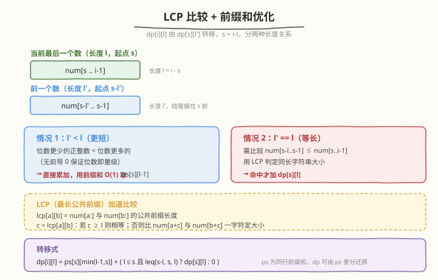
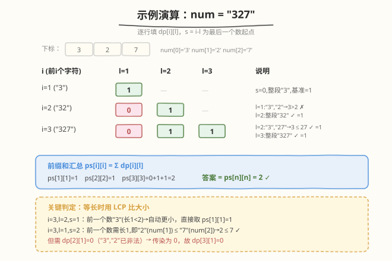

# 划分数字的方案数

- **题目名称**：划分数字的方案数
- **链接**：[1977. 划分数字的方案数](https://leetcode.cn/problems/number-of-ways-to-separate-numbers/)
- **难度**：困难
- **标签**：动态规划、字符串、前缀和

## 1. 题目概述

给定一个由若干**正整数**连接而成的字符串 `num`。这些数字满足：**非递减**排列，且**没有任何数字有前导 0**。但你忘记在数字之间加逗号了。

请返回能得到字符串 `num` 的**可能的正整数数组**个数。由于答案可能很大，结果对 $10^9 + 7$ 取余后返回。

**示例 1**：

```text
输入：num = "327"
输出：2
解释：可能的方案为 [3, 27] 与 [327]
```

**示例 2**：

```text
输入：num = "094"
输出：0
解释：不能有前导 0，且所有数字均为正数。
```

**示例 3**：

```text
输入：num = "0"
输出：0
```

**示例 4**：

```text
输入：num = "9999999999999"
输出：101
```

**约束条件**：

- $1 \leq \text{num.length} \leq 3500$
- `num` 只含有数字 `'0'` 到 `'9'`

> ⚠️ 关键约束有两点：一是**非递减**（每个数 $\leq$ 后一个数），二是**无前导 0**（首字符为 `'0'` 的段非法，单个 `"0"` 也不是正整数）。长度上限 3500 决定了必须用 $O(n^2)$ 解法。

---

## 2. 解题思路

### 2.1 暴力思路（枚举所有切分点）

把 $n$ 个字符之间的 $n-1$ 个间隔视为「切 / 不切」，共有 $2^{n-1}$ 种切分方案。每种方案需 $O(n)$ 验证非递减与无前导 0。$n=3500$ 时 $2^{3499}$ 完全不可行，必须利用**非递减**这一单调结构做 DP。

### 2.2 核心观察：按「最后一个数」做区间 DP


**状态定义**：设 $dp[i][l]$ 表示切分前 $i$ 个字符 `num[0..i-1]`、且**最后一个数的长度为 $l$** 的方案数。此时最后一个数是 `num[i-l..i-1]`，记其起点 $s = i - l$。

**合法性约束**：

- `num[s] != '0'`（无前导 0，否则 $dp[i][l] = 0$）。
- 当 $s = 0$（即整个前缀作为一个数），方案数直接为 1。

**转移**：要让当前数合法，前一个数（结尾接在 $s$ 之前，长度 $l'$）必须 $\leq$ 当前数 `num[s..i-1]`。记前一个数为 `num[s-l'..s-1]`，则：

- **$l' < l$**：位数更少的正整数（无前导 0）必然小于位数更多的，**自动满足**非递减。这类贡献为 $\sum_{l'=1}^{l-1} dp[s][l']$，可用前缀和 $O(1)$ 取。
- **$l' = l$**：等长字符串需逐字符比较 `num[s-l..s-1] \leq num[s..i-1]`，命中才加上 $dp[s][l]$。
- **$l' > l$**：前一个数位数更多，必然更大，跳过。

$$
dp[i][l] \;=\; \underbrace{\sum_{l' < l} dp[s][l']}_{\text{前缀和}} \;+\; \begin{cases} dp[s][l] & \text{若 } l \leq s \text{ 且 } \text{num}[s-l..s\!-\!1] \leq \text{num}[s..i\!-\!1] \\ 0 & \text{否则} \end{cases}
$$

> 💡 **为什么「更短必更小」成立？** 因为没有前导 0，一个 $k$ 位的正整数最小是 $10^{k-1}$，而 $k+1$ 位的最小是 $10^k = 10 \times 10^{k-1}$。位数严格多一位必严格更大。这条性质把 $O(n)$ 的求和降到 $O(1)$ 前缀和，是本题的关键加速点。

### 2.3 算法流程图：LCP 比较 + 前缀和优化



等长比较若逐字符做仍可能退化到 $O(n)$，整体变 $O(n^3)$。为此**预处理 LCP 表**：

$$
\text{lcp}[i][j] = \text{num}[i\!:] \text{ 与 } \text{num}[j\!:] \text{ 的最长公共前缀长度}
$$

用倒序递推 $\text{lcp}[i][j] = (\text{num}[i]==\text{num}[j])\,?\, \text{lcp}[i\!+\!1][j\!+\!1]+1 : 0$，$O(n^2)$ 预处理、$O(1)$ 查询。

判定 `num[a..a+l-1] \leq num[b..b+l-1]`（同长 $l$）：

1. $c = \text{lcp}[a][b]$。
2. 若 $c \geq l$：两串完全相同，返回 `true`。
3. 否则在位置 $a+c$ 与 $b+c$ 首次不同，比较单字符 $\text{num}[a+c] < \text{num}[b+c]$ 即定大小。

**前缀和降维**：维护 $ps[i][l] = \sum_{l'=1}^{l} dp[i][l']$，则 $\sum_{l' < l} dp[s][l'] = ps[s][\min(l-1, s)]$（$\min$ 是因为 $dp[s][l']$ 在 $l' > s$ 时为 0）。而 $dp[s][l]$ 本身可由差分还原：$dp[s][l] = ps[s][l] - ps[s][l-1]$，于是**无需单独存 $dp$ 数组**，空间省一半。

**算法步骤**：

1. 预处理 $\text{lcp}$ 表（倒序双循环）。
2. 双循环枚举 $i \in [1, n]$、$l \in [1, i]$：
   - $s = i - l$；若 `num[s] == '0'` 则 $dp[i][l] = 0$。
   - 否则取「更短」贡献 $ps[s][\min(l-1, s)]$。
   - 若 $l \leq s$ 且 $\text{leq}(s-l, s, l)$，再加 $dp[s][l]$（差分还原）。
   - 累加更新 $ps[i][l] = (ps[i][l-1] + dp[i][l]) \bmod MOD$。
3. 返回 $ps[n][n]$（即 $\sum_{l=1}^{n} dp[n][l]$）。

### 2.4 示例演算



以 `num = "327"`（$n=3$）走一遍：

| $i$（前 $i$ 字符） | $l=1$ | $l=2$ | $l=3$ | 说明 |
|---|---|---|---|---|
| $i=1$ (`"3"`) | **1** | — | — | $s=0$，整段 `"3"`，基准 1 |
| $i=2$ (`"32"`) | 0 | **1** | — | $l=1$：前数 `"3"` > `"2"` ✗；$l=2$：整段 `"32"` ✓ |
| $i=3$ (`"327"`) | 0 | **1** | **1** | $l=2$：`"3"` ≤ `"27"` ✓（短自动小）；$l=3$：整段 ✓ |

注意 $i=3, l=1$ 虽然单个比较 `"2" ≤ "7"` 成立，但它依赖 $dp[2][1]$（即 `"3","2"` 方案），而后者因 $3 > 2$ 已为 0，**非法性会沿转移传染**，故 $dp[3][1] = 0$。

汇总：$ps[3][3] = 0 + 1 + 1 = 2$，与示例一致 ✓。

---

## 3. 参考代码

### C++

```cpp
// O(n^2) DP + LCP 预处理 + 前缀和优化
class Solution {
public:
    int numberOfCombinations(string num) {
        int n = num.size();
        const int MOD = 1e9 + 7;

        // lcp[i][j] = num[i:] 与 num[j:] 的最长公共前缀长度
        vector<vector<int>> lcp(n + 1, vector<int>(n + 1, 0));
        for (int i = n - 1; i >= 0; --i)
            for (int j = n - 1; j >= 0; --j)
                if (num[i] == num[j])
                    lcp[i][j] = lcp[i + 1][j + 1] + 1;

        // 比较 num[a..a+l-1] <= num[b..b+l-1]（同长 l）
        auto leq = [&](int a, int b, int l) -> bool {
            int c = lcp[a][b];
            if (c >= l) return true;            // 完全相同
            return num[a + c] < num[b + c];     // 首个不同字符定大小
        };

        // ps[i][l] = sum_{l'=1}^{l} dp[i][l']，dp 由 ps 差分还原，省一半空间
        vector<vector<int>> ps(n + 1, vector<int>(n + 1, 0));
        for (int i = 1; i <= n; ++i) {
            for (int l = 1; l <= i; ++l) {
                int s = i - l;                   // 最后一个数的起点
                int val = 0;
                if (num[s] != '0') {
                    if (s == 0) {
                        val = 1;                 // 整个前缀作为一个数
                    } else {
                        // 更短的前一个数：位数少必更小，前缀和直接取
                        val = ps[s][min(l - 1, s)];
                        // 等长的前一个数：需字符串大小比较
                        if (l <= s && leq(s - l, s, l))
                            val = (val + ps[s][l] - ps[s][l - 1] + MOD) % MOD;
                    }
                }
                ps[i][l] = (ps[i][l - 1] + val) % MOD;
            }
        }
        return ps[n][n];
    }
};
```

### Python

```python
# O(n^2) DP + LCP 预处理 + 前缀和优化
class Solution:
    def numberOfCombinations(self, num: str) -> int:
        n = len(num)
        MOD = 10 ** 9 + 7

        # lcp[i][j] = num[i:] 与 num[j:] 的最长公共前缀长度
        lcp = [[0] * (n + 1) for _ in range(n + 1)]
        for i in range(n - 1, -1, -1):
            for j in range(n - 1, -1, -1):
                if num[i] == num[j]:
                    lcp[i][j] = lcp[i + 1][j + 1] + 1

        def leq(a: int, b: int, l: int) -> bool:
            """比较 num[a..a+l-1] <= num[b..b+l-1]（同长 l）"""
            c = lcp[a][b]
            if c >= l:
                return True
            return num[a + c] < num[b + c]

        # ps[i][l] = sum_{l'=1}^{l} dp[i][l']，dp 由 ps 差分还原
        ps = [[0] * (n + 1) for _ in range(n + 1)]
        for i in range(1, n + 1):
            for l in range(1, i + 1):
                s = i - l                       # 最后一个数的起点
                val = 0
                if num[s] != '0':
                    if s == 0:
                        val = 1                 # 整个前缀作为一个数
                    else:
                        # 更短的前一个数：位数少必更小
                        val = ps[s][min(l - 1, s)]
                        # 等长的前一个数：需字符串大小比较
                        if l <= s and leq(s - l, s, l):
                            val = (val + ps[s][l] - ps[s][l - 1]) % MOD
                ps[i][l] = (ps[i][l - 1] + val) % MOD

        return ps[n][n]
```

---

## 4. 复杂度分析

| 维度 | 复杂度 | 说明 |
|------|------|------|
| **时间** | $O(n^2)$ | LCP 预处理 $O(n^2)$；DP 双循环 $O(n^2)$ 状态、每态 $O(1)$ 转移 |
| **空间** | $O(n^2)$ | LCP 表 $O(n^2)$；前缀和表 $ps$ $O(n^2)$（$dp$ 由差分还原，不另存） |
| **常数** | 中等 | $n=3500$ 时约 $1.2 \times 10^7$ 次内层操作，C++ 稳过，Python 需注意常数 |

> ⚠️ **空间优化提示**：$n=3500$ 时两张 $(n\!+\!1)^2$ 的 `int` 表约 $98\,\text{MB}$。若内存紧张，可将 LCP 表改用 `short`（值上限 3500 $<$ 32767 不成立，需用 `int16` 边界注意——实际 3500 $> 32767$ 不成立，3500 $<$ 32767 成立，故 `short` 可行）压到 $24\,\text{MB}$。

---

## 5. 扩展：为什么不用一维滚动？

很多区间 DP 能用滚动数组压到 $O(n)$ 空间，但本题不行：

- $dp[i][l]$ 转移依赖 $dp[s][l']$，其中 $s = i - l$ 可取 $[0, i-1]$ 任意值，**依赖整列历史行**而非仅上一行。
- 等长分支还依赖 $dp[s][l]$（同行同列），必须保留所有历史行的前缀和。
- 因此 $O(n^2)$ 空间是本质的，除非改用别的状态定义（如按起点+长度枚举，仍需 $O(n^2)$）。

> 💡 **对比 132. 分割回文串 II**：那题也是「字符串切分 DP + 预处理表」，但转移只依赖「前缀是否能切成回文」，可用一维 DP；本题多了**非递减约束**使状态必须带「最后一段长度」这个维度，升到二维。

---

## 6. 面试要点

1. **为什么按「最后一个数的长度」定义状态，而不是按切分点？**

   - 切分点枚举是 $2^{n-1}$ 指数级；而非递减约束的本质是「相邻两段的大小关系」。
   - 用「最后一段长度 $l$」作状态维度，能把「前一段 $\leq$ 当前段」变成对 $l'$ 的分类讨论（更短 / 等长 / 更长），进而用前缀和与 LCP 把转移降到 $O(1)$。

2. **「更短必更小」为什么要求无前导 0？**

   - 若允许前导 0，`"09"`（值 9）是 2 位却比 `"10"`（值 10）小，位数与量级脱钩。
   - 题目保证无前导 0，故位数严格多一位 $\Rightarrow$ 值严格更大，这是 $O(1)$ 求和成立的基石。

3. **LCP 表如何把等长比较降到 $O(1)$？**

   - $\text{lcp}[a][b]$ 给出两串从 $a,b$ 起的公共前缀长度 $c$。
   - 若 $c \geq l$，两段完全相同；否则第 $c$ 位是首个差异，比一次字符即定大小。
   - LCP 表本身用倒序递推 $O(n^2)$ 预处理，是字符串 DP 的通用加速工具。

4. **`ps[s][min(l-1, s)]` 里的 `min` 是干什么的？**

   - $dp[s][l']$ 在 $l' > s$ 时无意义（一段不可能比整个前缀还长），本应为 0。
   - 但前缀和表只在 $l' \leq s$ 范围内填值，$l' > s$ 处保持 0 而非「延展的总和」。
   - 故取 $\min(l-1, s)$ 把下标钳到有效区间，避免读到 0 而漏算。

5. **答案为什么是 $ps[n][n]$ 而非某个 $dp[n][l]$？**

   - 题目问「所有可能的数组个数」，不限定最后一段长度，需对 $l \in [1, n]$ 求和。
   - $ps[n][n]$ 正是 $\sum_{l=1}^{n} dp[n][l]$，一步到位。

---

## 7. 同类练习题

- [132. 分割回文串 II](https://leetcode.cn/problems/palindrome-partitioning-ii/)：字符串切分 DP + 预处理表（回文表）加速判定，与本题 LCP 预处理同构，但转移可降一维。
- [139. 单词拆分](https://leetcode.cn/problems/word-break/)：字符串切分 DP 的判定版（$dp[i]$=前 $i$ 字符能否拆），对比本题的计数版。
- [97. 交错字符串](https://leetcode.cn/problems/interleaving-string/)：二维布尔 DP + 滚动数组，同样是「双指针位置」作状态。
- [10. 正则表达式匹配](https://leetcode.cn/problems/regular-expression-matching/)：二维 DP + 子串匹配分支，体会「带子串关系的二维 DP」通用套路。
