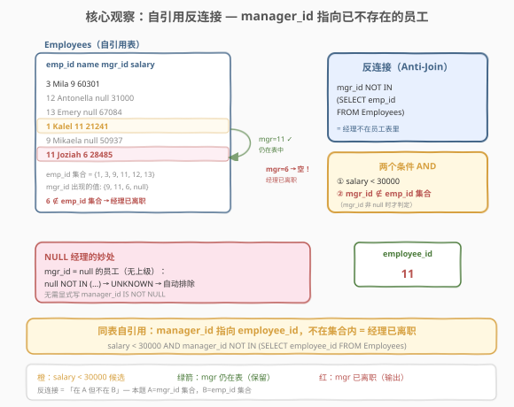
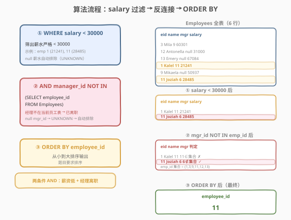
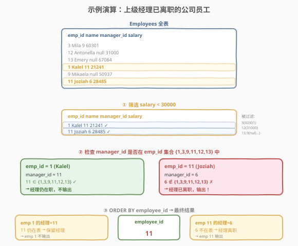

# 上级经理已离职的公司员工

- **题目名称**：上级经理已离职的公司员工
- **链接**：[1978. 上级经理已离职的公司员工](https://leetcode.cn/problems/employees-whose-manager-left-the-company/)
- **难度**：简单
- **标签**：数据库、SQL、反连接（anti-join）、自连接（self-join）、`NOT IN`、`NOT EXISTS`、`LEFT JOIN ... IS NULL`、`NULL` 处理

## 1. 题目概述

给定 `Employees` 表（员工 id、姓名、上级经理 id、薪水），编写 SQL 查询，找出**薪水严格少于 `$30000`** 且**上级经理已离职**的员工 `employee_id`。

当一个经理离开公司时，他们的信息会从员工表中删除，但员工的 `manager_id` 列仍保留离职经理的 id。结果按 `employee_id` **从小到大排序**返回。

**表结构**：

```text
Table: Employees
+-------------+----------+
| Column Name | Type     |
+-------------+----------+
| employee_id | int      |  ← 主键
| name        | varchar  |
| manager_id  | int      |  ← 可为 NULL（无上级经理）
| salary      | int      |
+-------------+----------+
每行表示一个员工、其薪水和上级经理的 id。
有些员工没有上级经理（manager_id 为空）。
```

**示例**：

```text
输入：
Employees 表:
+-------------+-----------+------------+--------+
| employee_id | name      | manager_id | salary |
+-------------+-----------+------------+--------+
| 3           | Mila      | 9          | 60301  |
| 12          | Antonella | null       | 31000  |
| 13          | Emery     | null       | 67084  |
| 1           | Kalel     | 11         | 21241  |
| 9           | Mikaela   | null       | 50937  |
| 11          | Joziah    | 6          | 28485  |
+-------------+-----------+------------+--------+

输出:
+-------------+
| employee_id |
+-------------+
| 11          |
+-------------+
```

**解释**：

| employee_id | name | salary | manager_id | 经理是否在表? | 结论 |
|-------------|------|--------|------------|---------------|------|
| 3 | Mila | 60301 | 9 | — | ✗ 薪资 ≥ 30000，过滤 |
| 12 | Antonella | 31000 | null | — | ✗ 薪资 ≥ 30000，过滤 |
| 13 | Emery | 67084 | null | — | ✗ 薪资 ≥ 30000，过滤 |
| 1 | Kalel | 21241 | 11 | ✓ 11 在表中（Joziah） | ✗ 经理仍在职，不输出 |
| 9 | Mikaela | 50937 | null | — | ✗ 薪资 ≥ 30000，过滤 |
| 11 | Joziah | 28485 | 6 | ✗ 6 不在表中（已离职） | ✓ 经理已离职 → 输出 |

> 💡 **审题关键**：① 「薪水严格少于 30000」——严格小于，`=` 30000 不算；② 「经理已离职」= `manager_id` 指向的人**不在当前 `Employees` 表中**——不是 `manager_id` 为空，而是指向一个已删除的 id；③ `manager_id` 为 `null` 的员工没有上级经理，**不算**「经理已离职」（他们根本就没有经理）；④ 结果需排序。

> 💡 本题是 SQL **"自引用反连接招牌题"**——核心观察：`Employees` 表的 `manager_id` 列指向同表的 `employee_id`，若某 `manager_id` 值**不在** `employee_id` 集合中，说明该经理已离职（记录被删除但引用残留）。这等价于一个**自连接反连接**（self anti-join）：在 `manager_id` 集合中但不在 `employee_id` 集合中的值。难点在于 `manager_id` 可为 `NULL`，需正确处理三值逻辑。

---

## 2. 解题思路

### 2.1 暴力思路：逐员工检查

最直觉的过程式思路：遍历每个员工，先看薪水是否 < 30000，若是再看 `manager_id` 是否非空且不在员工 id 集合中。伪代码：

```text
emp_ids = {e.employee_id for e in Employees}   # 当前在册员工 id 集合
result = []
for e in Employees:
    if e.salary < 30000 and e.manager_id is not None:
        if e.manager_id not in emp_ids:        # 经理已离职
            result.append(e.employee_id)
return sorted(result)
```

关键洞察：SQL 中「`manager_id` 不在 `employee_id` 集合中」天然对应**反连接**——`NOT IN` 子查询或 `LEFT JOIN ... IS NULL`。而 `manager_id IS NULL` 的行会因 SQL 三值逻辑被自动排除（`NULL NOT IN (...)` 结果为 `UNKNOWN`），省去了显式的 `IS NOT NULL` 检查。

### 2.2 核心观察：自引用反连接 — manager_id 指向已不存在的员工



**问题拆解为两个 AND 条件**：

1. **薪水过滤**：`salary < 30000`。严格小于，`=` 不算。`salary` 为 `NULL` 的行会被三值逻辑自动排除（`NULL < 30000` 为 `UNKNOWN`），但本题 `salary` 非 `NULL`。

2. **经理已离职**：`manager_id NOT IN (SELECT employee_id FROM Employees)`。`manager_id` 指向一个**不在**当前员工表中的 id——说明该经理的记录已被删除（离职），但 `manager_id` 的引用残留。这就是**反连接**：在 `manager_id` 集合中但不在 `employee_id` 集合中。

$$\boxed{\text{经理已离职} \iff \text{manager\_id} \notin \{\text{employee\_id}\} \iff \text{manager\_id NOT IN (SELECT employee\_id FROM Employees)}}$$

> ⚠️ **`NULL` 的妙处与陷阱**：`manager_id` 为 `NULL` 的员工（无上级经理）不应输出。SQL 三值逻辑天然处理了这一点——`NULL NOT IN (1, 3, ...)` 等价于 `NULL <> 1 AND NULL <> 3 AND ...`，而 `NULL <> x` 恒为 `UNKNOWN`，`AND` 链中有 `UNKNOWN` 则结果为 `UNKNOWN`，该行被过滤。**但前提是子查询结果不含 `NULL`**——本题 `employee_id` 是主键（非空），故 `NOT IN` 安全。若子查询可能含 `NULL`，则需加 `WHERE employee_id IS NOT NULL` 或改用 `NOT EXISTS`。

> 💡 **与 183（从不订购的客户）的对照**：183 是「客户不在订单表中」——跨表反连接；1978 是「manager_id 不在 employee_id 集合中」——**同表自引用反连接**。骨架完全相同，区别仅在于连接发生在同一张表内（`manager_id` → `employee_id`）还是两张表之间。

### 2.3 算法流程图



**逻辑执行步骤**：

| 步骤 | 子句 | 作用 |
|------|------|------|
| ① | `WHERE salary < 30000` | 筛出薪水严格少于 30000 的员工 |
| ② | `AND manager_id NOT IN (SELECT employee_id FROM Employees)` | 反连接：manager_id 不在员工 id 集合中 → 经理已离职 |
| ③ | `ORDER BY employee_id` | 升序输出 |

> 💡 **SQL 子句执行顺序**：`FROM` → `WHERE`（含子查询 `NOT IN`）→ `SELECT` → `ORDER BY`。`WHERE` 中的两个条件用 `AND` 连接，同时满足才保留。子查询 `(SELECT employee_id FROM Employees)` 在 `WHERE` 求值时先执行，返回当前所有 `employee_id`，然后对每行的 `manager_id` 做 `NOT IN` 判定。

### 2.4 示例演算

以示例为例，观察「全表 → 薪水过滤 → 反连接过滤 → 排序」的逐步过程：



**步骤 ①：WHERE salary < 30000**

全表 6 行，仅 emp_id=1（salary=21241）和 emp_id=11（salary=28485）满足 `salary < 30000`：

| employee_id | name | salary | manager_id | 保留? |
|-------------|------|--------|------------|-------|
| 3 | Mila | 60301 | 9 | ✗ ≥ 30000 |
| 12 | Antonella | 31000 | null | ✗ ≥ 30000 |
| 13 | Emery | 67084 | null | ✗ ≥ 30000 |
| 1 | Kalel | 21241 | 11 | ✓ |
| 9 | Mikaela | 50937 | null | ✗ ≥ 30000 |
| 11 | Joziah | 28485 | 6 | ✓ |

**步骤 ②：AND manager_id NOT IN (SELECT employee_id FROM Employees)**

当前 `employee_id` 集合 = $\{1, 3, 9, 11, 12, 13\}$，对两个候选逐一判定：

| employee_id | manager_id | manager_id ∈ 集合? | 结论 |
|-------------|------------|---------------------|------|
| 1 | 11 | ✓ 11 ∈ 集合（Joziah 仍在） | ✗ 经理在职，不输出 |
| 11 | 6 | ✗ 6 ∉ 集合（6 号已离职） | ✓ 经理已离职，输出 |

**步骤 ③：ORDER BY employee_id**

最终输出 `{11}`（升序）✓

> 💡 **观察要点**：① emp_id=1 虽薪水低，但其经理（id=11 = Joziah）仍在表中，故不输出；② emp_id=11 的经理 id=6 不在表中——6 号员工的记录已被删除（离职），但 `manager_id=6` 的引用残留，反连接捕获了这一点；③ `manager_id` 为 `null` 的员工（12、13、9）在步骤 ① 即因薪水被过滤，即使薪水低也会在步骤 ② 被 `NULL NOT IN (...)` 的 `UNKNOWN` 排除——双重保险。

---

## 3. 参考代码

### SQL（解法 A：`NOT IN` 子查询，推荐）

```sql
SELECT employee_id
FROM Employees
WHERE salary < 30000
  AND manager_id NOT IN (SELECT employee_id FROM Employees)
ORDER BY employee_id;
```

> 💡 **写法要点**：
> - **`NOT IN` 反连接**：`manager_id NOT IN (SELECT employee_id FROM Employees)` —— `manager_id` 不在当前 `employee_id` 集合中 = 经理已离职。这是反连接在自引用表上的直接表达。
> - **`NULL` 自动排除**：`manager_id` 为 `NULL` 的行，`NULL NOT IN (...)` 为 `UNKNOWN`，自动被 `WHERE` 过滤——无需显式写 `manager_id IS NOT NULL`。
> - **子查询 `NULL` 安全**：`employee_id` 是主键（非空），子查询不含 `NULL`，`NOT IN` 无空集陷阱。若主键约束不可靠，应加 `WHERE employee_id IS NOT NULL` 或改用解法 C（`NOT EXISTS`）。
> - **`AND` 两条件**：薪水过滤与经理离职判定用 `AND` 连接，同时满足才保留。
> - ✓ **最推荐**：代码最短、语义最直观、`NULL` 安全（本题约束下）。

### SQL（解法 B：`LEFT JOIN` 自连接反连接）

```sql
SELECT e1.employee_id
FROM Employees e1
LEFT JOIN Employees e2 ON e1.manager_id = e2.employee_id
WHERE e1.salary < 30000
  AND e1.manager_id IS NOT NULL
  AND e2.employee_id IS NULL
ORDER BY e1.employee_id;
```

> 💡 **解法 B 的思路**：对 `Employees` 表做**自连接**（同一张表取两个别名 `e1`/`e2`），用 `LEFT JOIN` 把每个员工的 `manager_id` 关联到 `e2.employee_id`：
> - `e1.manager_id = e2.employee_id`：尝试匹配经理记录；
> - `e2.employee_id IS NULL`：匹配失败（右表无对应行）→ 经理记录不存在 → 已离职；
> - `e1.manager_id IS NOT NULL`：排除无上级经理的员工（`LEFT JOIN` 中 `manager_id` 为 `NULL` 时 `e2` 全为 `NULL`，需显式排除，否则会被误判为「经理已离职」）。
>
> **与解法 A 的区别**：解法 A 用 `NOT IN` 子查询表达「不在集合中」；解法 B 用 `LEFT JOIN ... IS NULL` 表达「连接无匹配」。语义等价，但解法 B 需**显式** `manager_id IS NOT NULL`——因为 `LEFT JOIN` 把 `NULL` 管理员也连上了（右表全 `NULL`），不排除会误判。这是 `LEFT JOIN` 反连接在自引用表上的特殊注意点。

### SQL（解法 C：`NOT EXISTS`，最稳妥）

```sql
SELECT employee_id
FROM Employees e1
WHERE salary < 30000
  AND manager_id IS NOT NULL
  AND NOT EXISTS (
      SELECT 1 FROM Employees e2
      WHERE e2.employee_id = e1.manager_id
  )
ORDER BY employee_id;
```

> 💡 **解法 C 的思路**：用 `NOT EXISTS` 替代 `NOT IN` ——对每行 `e1`，检查不存在 `e2.employee_id = e1.manager_id` 的行（即经理不在表中）。
>
> **与解法 A 的区别**：`NOT EXISTS` 天然 `NULL` 安全——它判断的是「子查询是否有结果行」，不涉及 `NULL` 比较的三值逻辑。即便子查询的 `employee_id` 含 `NULL` 也不受影响。但需显式 `manager_id IS NOT NULL`——因为 `NOT EXISTS` 不像 `NOT IN` 那样自动排除 `NULL`（`e2.employee_id = NULL` 无行返回，`NOT EXISTS` 为真，会把无经理的员工误判为「经理已离职」）。
>
> **三法对比**：解法 A（`NOT IN`）代码最短、`NULL` 自动排除（本题安全）；解法 B（`LEFT JOIN`）语义直观但需显式 `IS NOT NULL`；解法 C（`NOT EXISTS`）最稳妥（生产环境 `NULL` 安全），也需显式 `IS NOT NULL`。优先选 A（简洁）或 C（稳妥）。

### Python（pandas）

```python
import pandas as pd

def find_employees(employees: pd.DataFrame) -> pd.DataFrame:
    emp_ids = set(employees['employee_id'])
    mask = (
        (employees['salary'] < 30000)
        & (employees['manager_id'].notna())
        & (~employees['manager_id'].isin(emp_ids))
    )
    result = employees.loc[mask, ['employee_id']].sort_values('employee_id')
    return result
```

> 💡 **pandas 对照**：
> - `employees['salary'] < 30000` 对应 `WHERE salary < 30000`——注意 pandas 中 `NaN < 30000` 为 `False`（不同于 SQL 的 `UNKNOWN`），行为一致。
> - `employees['manager_id'].notna()` 对应 `manager_id IS NOT NULL`——pandas 需显式排除 `NaN`，否则 `NaN.isin(emp_ids)` 为 `False`，`~False` 为 `True` 会误判。这与 SQL 解法 C（`NOT EXISTS`）的显式排除同理。
> - `~employees['manager_id'].isin(emp_ids)` 对应 `manager_id NOT IN (SELECT employee_id ...)`——`isin` 做集合成员判定，`~` 取反即反连接。
> - `.sort_values('employee_id')` 对应 `ORDER BY employee_id`。

---

## 4. 复杂度分析

| 维度 | 解法 A（`NOT IN`） | 解法 B（`LEFT JOIN`） | 解法 C（`NOT EXISTS`） | pandas |
|------|--------------------|-----------------------|------------------------|--------|
| **时间** | $O(n)$ | $O(n)$ | $O(n)$ | $O(n)$ |
| **空间** | $O(n)$ | $O(n)$ | $O(1)$ / $O(n)$ | $O(n)$ |
| **NULL 安全** | ✓ 本题安全 | ✓ 显式处理 | ✓ 天然安全 | ✓ 显式处理 |
| **需显式 IS NOT NULL** | ✗ 自动排除 | ✓ 需显式 | ✓ 需显式 | ✓ 需显式 |
| **推荐度** | ✓ **首选** | ✓ 语义直观 | ✓ 最稳妥 | ✓ 验证用 |

> - $n$ = `Employees` 表行数
> - **时间**：解法 A 的 `NOT IN` 子查询构建 `employee_id` 集合 $O(n)$，外层扫描 $O(n)$，总计 $O(n)$（子查询通常被优化为哈希半连接）；解法 B 的自连接 `LEFT JOIN` 哈希连接 $O(n)$；解法 C 的 `NOT EXISTS` 对每行做存在性检查，优化器通常用哈希/索引半连接 $O(n)$。三者渐近复杂度相同。
> - **空间**：解法 A 需 $O(n)$ 存子查询结果；解法 B 需 $O(n)$ 存连接中间表；解法 C 依赖优化器，可能 $O(1)$（逐行索引探测）或 $O(n)$（哈希）；pandas 需 $O(n)$ 存 DataFrame。
> - **索引优化**：`employee_id` 是主键（有索引），`NOT EXISTS` 和 `LEFT JOIN` 的连接条件 `e2.employee_id = e1.manager_id` 可利用主键索引做快速探测。

---

## 5. 扩展：反连接的三种写法与 NULL 处理

### 5.1 反连接的三种等价写法

「经理已离职」即 `manager_id` 不在 `employee_id` 集合中——反连接 $A \setminus B$（$A$ = `manager_id` 集合，$B$ = `employee_id` 集合）。SQL 有三种等价写法：

| 写法 | 模板 | NULL 安全 | 需显式 IS NOT NULL |
|------|------|-----------|---------------------|
| **A. `NOT IN`** | `mgr NOT IN (SELECT eid FROM ...)` | ✗ 子查询含 NULL 则失效 | ✗ 自动排除 |
| **B. `LEFT JOIN ... IS NULL`** | `A LJ B ON a=b WHERE b.pk IS NULL` | ✓ 天然 | ✓ 需显式 |
| **C. `NOT EXISTS`** | `NOT EXISTS (SELECT 1 FROM B WHERE b=a)` | ✓ 天然 | ✓ 需显式 |

> 💡 **三法对 NULL 的不同行为**（本题最大坑点）：
> - **`NOT IN`**：`NULL NOT IN (...)` 为 `UNKNOWN` → 自动排除（**不需要** `IS NOT NULL`）。但若子查询结果含 `NULL`，则 `x NOT IN (..., NULL)` 为 `UNKNOWN` → **全部排除**（空集陷阱）。
> - **`LEFT JOIN ... IS NULL`**：`manager_id` 为 `NULL` 时，`NULL = e2.employee_id` 无匹配，`e2` 全 `NULL`，`IS NULL` 为真 → **误判为离职**（需显式 `IS NOT NULL` 排除）。
> - **`NOT EXISTS`**：`manager_id` 为 `NULL` 时，`e2.employee_id = NULL` 无行返回，`NOT EXISTS` 为真 → **误判为离职**（需显式 `IS NOT NULL` 排除）。
>
> 一句话：**`NOT IN` 自动排除 `NULL` 管理员但有子查询空集陷阱；`LEFT JOIN` 和 `NOT EXISTS` 需显式排除 `NULL` 管理员但子查询 `NULL` 安全**。

### 5.2 `NOT IN` 的 NULL 空集陷阱

若 `NOT IN` 的子查询结果**含 `NULL`**，则整个查询返回**空集**：

```sql
-- 若 SELECT employee_id FROM Employees 含 NULL（本题不会，主键非空）：
-- manager_id NOT IN (1, 3, NULL, ...)
-- = manager_id <> 1 AND manager_id <> 3 AND manager_id <> NULL AND ...
--                                  ^^^^^^^^^^^^^^^^ = UNKNOWN
-- → AND 链中有 UNKNOWN → 结果为 UNKNOWN → 该行被过滤
-- → 所有行都被过滤 → 空集！
```

> ⚠️ **避免方法**：① 子查询加 `WHERE employee_id IS NOT NULL`；② 改用 `NOT EXISTS`（天然 `NULL` 安全）；③ 改用 `LEFT JOIN ... IS NULL`。本题 `employee_id` 是主键（非空），`NOT IN` 不加 `IS NOT NULL` 也能通过，但生产环境应养成防御习惯。

### 5.3 自引用反连接 vs 跨表反连接

本题的反连接发生在**同一张表内**（`manager_id` → `employee_id` 都在 `Employees` 表），而 183（从不订购的客户）的反连接发生在**两张表之间**（`Customers.customerId` → `Orders.customerId`）：

| 维度 | 183（跨表） | 1978（自引用） |
|------|-------------|----------------|
| 连接类型 | `Customers` ↔ `Orders`（异表） | `Employees e1` ↔ `Employees e2`（同表） |
| 反连接列 | `Customers.id` NOT IN `Orders.customerId` | `Employees.manager_id` NOT IN `Employees.employee_id` |
| 别名需求 | 不需要（两表名不同） | **需要**（同表取 `e1`/`e2` 两个别名） |
| `NULL` 处理 | 客户 id 非主键侧可能需注意 | `manager_id` 可为 `NULL`，需正确排除 |

> 💡 **自连接的别名**：解法 B/C 中 `FROM Employees e1` 和子查询 `FROM Employees e2` 是同一张表的两个「快照」/别名——`e1` 代表「员工视角」，`e2` 代表「经理视角」。SQL 允许同表取多个别名，各自独立引用，这是自连接的标准写法。

### 5.4 `salary < 30000` 的严格小于

题目要求「严格少于 30000」，即 `salary < 30000`（不含 `=` 30000）。示例中 emp_id=12 的 `salary=31000` 和 emp_id=3 的 `salary=60301` 都 ≥ 30000 被过滤。若误写 `<= 30000` 会把 `salary` 恰好 30000 的员工也纳入——本题无此边界用例，但审题时需注意「严格」二字。

---

## 6. 面试要点

1. **「经理已离职」如何用 SQL 表达？**

   > 经理离职后记录被删除，但 `manager_id` 引用残留。判定「经理已离职」= `manager_id` 指向的 id **不在**当前 `employee_id` 集合中——即反连接 `manager_id NOT IN (SELECT employee_id FROM Employees)`。也可用 `LEFT JOIN ... IS NULL` 或 `NOT EXISTS`。

2. **`NOT IN` 的 `NULL` 陷阱是什么？如何避免？**

   > 两个层面：① **外层 `manager_id` 为 `NULL`**：`NULL NOT IN (...)` 为 `UNKNOWN`，自动被 `WHERE` 过滤——这正是本题想要的行为（无经理的员工不输出），无需显式 `IS NOT NULL`。② **子查询结果含 `NULL`**：`x NOT IN (..., NULL)` 为 `UNKNOWN`，导致**全部行被过滤**（空集陷阱）。避免方法：子查询加 `WHERE ... IS NOT NULL`，或改用 `NOT EXISTS` / `LEFT JOIN ... IS NULL`（天然 `NULL` 安全）。

3. **解法 B 为什么需要显式 `manager_id IS NOT NULL`？**

   > `LEFT JOIN` 中，当 `e1.manager_id` 为 `NULL` 时，`NULL = e2.employee_id` 无匹配，`e2` 全为 `NULL`，`e2.employee_id IS NULL` 为真——会把无经理的员工误判为「经理已离职」。故需 `AND e1.manager_id IS NOT NULL` 显式排除。解法 C（`NOT EXISTS`）同理。只有 `NOT IN` 靠三值逻辑自动排除 `NULL` 管理员。

4. **`NOT IN`、`LEFT JOIN ... IS NULL`、`NOT EXISTS` 三者如何选择？**

   > ① `NOT IN`：代码最短，但子查询含 `NULL` 有空集陷阱——主键非空时安全，适合本题。② `LEFT JOIN ... IS NULL`：语义直观（连接无匹配），需显式 `IS NOT NULL`，适合需要连接其他列的场景。③ `NOT EXISTS`：最稳妥（天然 `NULL` 安全），需显式 `IS NOT NULL`，生产环境首选。性能上现代优化器三者通常等价（都优化为半连接）。

5. **本题与 183（从不订购的客户）的异同？**

   > 相同：都是反连接——找「在 A 但不在 B」的记录。不同：① 183 是跨表反连接（`Customers` ↔ `Orders`），1978 是**同表自引用**反连接（`manager_id` → `employee_id` 都在 `Employees`），需用别名 `e1`/`e2`；② 1978 额外有 `salary < 30000` 的过滤条件；③ 1978 的 `manager_id` 可为 `NULL`（无经理），需正确处理三值逻辑，183 的 `customerId` 无此问题。

> 💡 **一句话总结**：1978 是 SQL **"自引用反连接招牌题"**——核心模板「`WHERE salary < 30000 AND manager_id NOT IN (SELECT employee_id FROM Employees) ORDER BY employee_id`」。三大要点：**反连接（`NOT IN` / `LEFT JOIN IS NULL` / `NOT EXISTS` 三选一）、自引用（同表 `manager_id` → `employee_id`，需别名）、`NULL` 处理（`NOT IN` 自动排除但有子查询陷阱，`LEFT JOIN`/`NOT EXISTS` 需显式 `IS NOT NULL`）**。

---

## 7. 同类练习题

- [183. 从不订购的客户](https://leetcode.cn/problems/customers-never-order/)（[站内题解](../0101-0200/183_从不订购的客户.md)）：反连接**最经典母题**——`Customers LEFT JOIN Orders WHERE o.id IS NULL` 找从未订购的客户。1978 是其**自引用升级版**（同表 `manager_id` → `employee_id`），对照理解反连接在跨表与自引用上的异同
- [1965. 丢失信息的雇员](https://leetcode.cn/problems/employees-with-missing-information/)（[站内题解](../1901-2000/1965_丢失信息的雇员.md)）：`UNION ALL` + `GROUP BY` + `HAVING` 求对称差，与 1978 同为 `Employees` 表场景的集合运算题，但 1965 求两表对称差（双向丢失），1978 求同表反连接（单向经理离职）
- [1581. 进店却未进行过交易的顾客](https://leetcode.cn/problems/customer-who-visited-but-did-not-make-any-transactions/)（[站内题解](../1501-1600/1581_进店却未进行过交易的顾客.md)）：`LEFT JOIN` + `IS NULL` 反连接 + `GROUP BY` 计数，与 1978 共享反连接骨架，但 1581 是跨表 + 按顾客聚合，1978 是自引用 + 不聚合
- [570. 至少有5名直接下属的经理](https://leetcode.cn/problems/managers-with-at-least-5-direct-reports/)：同表自连接（`e1.manager_id = e2.employee_id`）+ `GROUP BY` 计数，与 1978 同为 `Employees` 自引用题，但 570 是**正向连接**（找在册经理的下属数），1978 是**反向连接**（找不在册的经理）
- [1355. 活动参与者](https://leetcode.cn/problems/activity-participants/)：`NOT IN` / `NOT EXISTS` 反连接找未参与某活动的用户，与 1978 共享反连接模板，跨表场景，无 `NULL` 管理问题，适合对照理解 `NOT IN` 在无 `NULL` 时的简洁性
