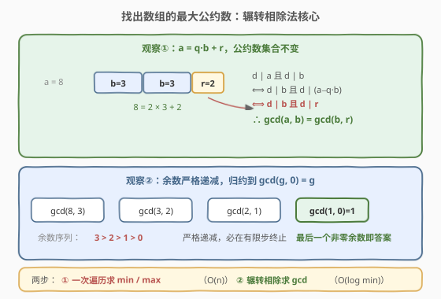
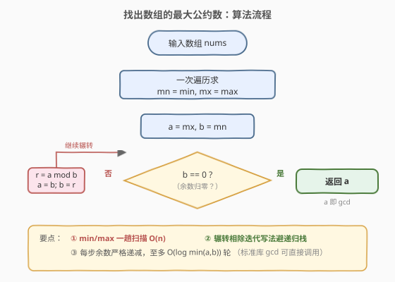
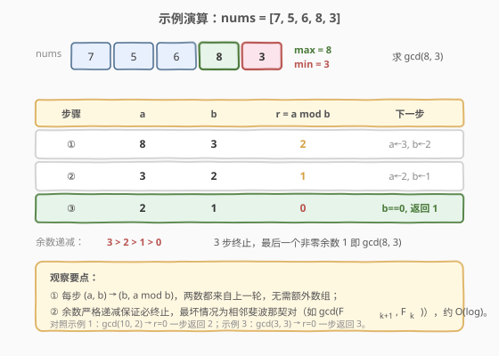

# LeetCode 找出数组的最大公约数 题解

## 1. 题目概述

- **标题 / 题号**：找出数组的最大公约数（#1979，easy）
- **链接**：https://leetcode.cn/problems/find-greatest-common-divisor-of-array/
- **难度**：简单
- **标签**：数学、数组、最大公约数、辗转相除法

**题意**：给你一个整数数组 `nums`，返回数组中**最大数**和**最小数**的**最大公约数**。

两个数的**最大公约数**是能够被两个数同时整除的最大正整数。

**示例 1**：

```text
输入：nums = [2,5,6,9,10]
输出：2
解释：
nums 中最小的数是 2
nums 中最大的数是 10
2 和 10 的最大公约数是 2
```

**示例 2**：

```text
输入：nums = [7,5,6,8,3]
输出：1
解释：
nums 中最小的数是 3
nums 中最大的数是 8
3 和 8 的最大公约数是 1
```

**示例 3**：

```text
输入：nums = [3,3]
输出：3
解释：
nums 中最小的数是 3
nums 中最大的数是 3
3 和 3 的最大公约数是 3
```

**约束**：

- $2 \le \text{nums.length} \le 1000$
- $1 \le \text{nums[i]} \le 1000$

> 💡 **审题关键**：① 题目只要 `gcd(min, max)`，不是整个数组的 GCD——千万别算多；② `nums[i] ≥ 1`，故 `gcd ≥ 1` 恒成立，无需处理 0 的特例（但辗转相除本身对 0 也有定义：$\gcd(a, 0) = a$）；③ 当 `min == max`（如示例 3 全等数组）时 `gcd = min = max`，算法天然兼容。

## 2. 解题思路

### 2.1 暴力思路：枚举公约数

最直白的做法：先一趟扫描拿到 `mn`、`mx`，然后**从 `mn` 倒着枚举到 1**，第一个能同时整除 `mn` 和 `mx` 的数就是答案。

```text
for d in range(mn, 0, -1):
    if mx % d == 0 and mn % d == 0:   # mn % d == 0 必然成立，因为 d ≤ mn 不保证
        return d
```

- **正确性**：穷举所有可能的公约数，取最大的，显然正确。
- **效率**：最坏枚举 `mn` 次，每次 $O(1)$，总计 $O(\text{mn})$。本题 $\text{mn} \le 1000$ 可过，但**没有利用 GCD 的代数结构**——辗转相除能在 $O(\log \text{mn})$ 内一步到位。

> ⚠️ 暴力的浪费在于「逐个试除」：它把 GCD 当成搜索问题，而 GCD 其实有**优美的递推结构** $\gcd(a, b) = \gcd(b, a \bmod b)$，能把两数同步缩小，每步余数严格递减。

### 2.2 核心观察：辗转相除法



关键洞察分两步：

**第一步：整除不变性。** 设 $a > b$，由带余除法 $a = q \cdot b + r$（$0 \le r < b$）。对任意整数 $d$：

$$d \mid a \text{ 且 } d \mid b \iff d \mid b \text{ 且 } d \mid (a - q \cdot b) = d \mid r$$

即「$a, b$ 的公约数集合」与「$b, r$ 的公约数集合」**完全相同**，故

$$\gcd(a, b) = \gcd(b, a \bmod b)$$

这一步把求 GCD 的问题**等价归约**到更小的数对 $(b, r)$，而不改变答案。

**第二步：余数严格递减，必然终止。** 反复套用上式：

$$\gcd(a, b) \to \gcd(b, r_1) \to \gcd(r_1, r_2) \to \cdots \to \gcd(g, 0) = g$$

其中余数序列 $b > r_1 > r_2 > \cdots > g > 0$ 严格递减（每步余数都小于除数），有限步内必然归零。**最后一个非零余数 $g$ 即为 $\gcd(a, b)$**。

> 💡 **一句话**：先一趟求 `min/max`（决定算谁），再辗转相除（决定怎么算）。整除不变性保证每步等价、余数递减保证必然终止——$O(n) + O(\log \text{mn})$ 两步搞定。

> ⚠️ **终止条件的方向**：循环条件是 `b != 0`，返回的是 `a`（最后一个非零余数此刻已落到 `a` 上）。若误写成 `a != 0` 返回 `b`，在 `a < b` 的初始情形会先做一次「无效交换」虽不致错（因 `a % b = a` 当 `a < b`），但语义混乱，建议一开始就保证 `a ≥ b`（本题 `a = max ≥ min = b` 天然满足）。

### 2.3 算法流程图



整体步骤：

1. **一趟扫描**：初始化 `mn = mx = nums[0]`，遍历 `nums` 更新 `mn = min(mn, x)`、`mx = max(mx, x)`。
2. **初始化**：`a = mx`，`b = mn`（保证 `a ≥ b`）。
3. **辗转相除循环**：当 `b != 0` 时，`r = a % b`；`a = b`；`b = r`。
4. **返回** `a`（此刻 `a` 即为最后一个非零余数 = GCD）。

### 2.4 示例演算

以**示例 2** `nums = [7,5,6,8,3]` 演算：一趟扫描得 `min = 3`、`max = 8`，求 `gcd(8, 3)`。



| 步骤 | a | b | r = a mod b | 下一步 |
|------|---|---|------------|--------|
| ① | 8 | 3 | 2 | a←3, b←2 |
| ② | 3 | 2 | 1 | a←2, b←1 |
| ③ | 2 | 1 | 0 | b==0，返回 a=1 |

- 余数序列 $3 > 2 > 1 > 0$ 严格递减，3 步终止，最后一个非零余数 $1$ 即 $\gcd(8, 3)$。
- **示例 1** `gcd(10, 2)`：$10 \bmod 2 = 0$，一步终止返回 $2$。
- **示例 3** `gcd(3, 3)`：$3 \bmod 3 = 0$，一步终止返回 $3$（`min == max` 时答案就是它们本身）。

> 💡 **观察要点**：① 每步 `(a, b) → (b, a mod b)` 两数都来自上一轮，无需额外数组，原地两个变量即可；② 最坏情况为相邻斐波那契对 $\gcd(F_{k+1}, F_k)$，余数每次只减一格，步数约 $\log_\varphi(\text{mn}) \approx O(\log \text{mn})$；③ `min == max` 或 `min` 整除 `max` 时一步即止，最优情况 $O(1)$。

## 3. 参考代码

### C++（手写辗转相除 + 一趟扫描）

```cpp
class Solution {
public:
    int findGCD(vector<int>& nums) {
        int mn = nums[0], mx = nums[0];
        for (int x : nums) {
            if (x < mn) mn = x;
            if (x > mx) mx = x;
        }
        int a = mx, b = mn;
        while (b != 0) {
            int r = a % b;
            a = b;
            b = r;
        }
        return a;
    }
};
```

### Python（手写辗转相除 + 一趟扫描）

```python
class Solution:
    def findGCD(self, nums: List[int]) -> int:
        mn = mx = nums[0]
        for x in nums:
            if x < mn:
                mn = x
            if x > mx:
                mx = x
        a, b = mx, mn
        while b:
            a, b = b, a % b
        return a
```

### 调用标准库（最简写法）

```cpp
// C++17 <numeric> 的 std::gcd
class Solution {
public:
    int findGCD(vector<int>& nums) {
        auto [it_min, it_max] = minmax_element(nums.begin(), nums.end());
        return gcd(*it_min, *it_max);
    }
};
```

```python
# Python math.gcd
class Solution:
    def findGCD(self, nums: List[int]) -> int:
        from math import gcd
        return gcd(min(nums), max(nums))
```

> 💡 **代码要点**：① 手写版把辗转相除的每一步都摊开，便于面试时讲清原理；标准库版是工程首选，`gcd` 时间复杂度同样是 $O(\log \min(a, b))$；② Python 的 `a, b = b, a % b` 是**元组解包**，一步完成赋值，无需临时变量 `r`；③ 一趟扫描同时维护 `min/max` 比 `min(nums) + max(nums)` 两次遍历常数更优（虽然本题规模下无差别）。

## 4. 复杂度分析

| 维度 | 复杂度 | 说明 |
|------|--------|------|
| 时间复杂度 | $O(n + \log \text{mn})$ | 一趟扫描 $O(n)$ 求 `min/max`；辗转相除 $O(\log \min(\text{mn}, \text{mx})) = O(\log \text{mn})$（$\text{mn} \le \text{mx}$） |
| 空间复杂度 | $O(1)$ | 仅 `mn, mx, a, b, r` 等常数个变量 |

> 💡 $\text{mn} \le 1000$，$\log \text{mn} \le 10$，辗转相除至多约 10 轮；$n \le 1000$，整体约 $1010$ 次操作，远在时限内。即便数据规模放大到 $10^9$，$O(\log)$ 的辗转相除依然从容——这是它相对暴力枚举 $O(\text{mn})$ 的根本优势。

## 5. 扩展：辗转相除的正确性与更相减损

### 5.1 为什么 $\gcd(a, b) = \gcd(b, a \bmod b)$ 成立？

由带余除法 $a = q \cdot b + r$。要证「$a, b$ 的公约数集合」=「$b, r$ 的公约数集合」：

- **正向**（$d \mid a$ 且 $d \mid b \Rightarrow d \mid r$）：$d \mid b \Rightarrow d \mid q \cdot b$；又 $d \mid a$，故 $d \mid (a - q \cdot b) = d \mid r$。
- **反向**（$d \mid b$ 且 $d \mid r \Rightarrow d \mid a$）：$d \mid b \Rightarrow d \mid q \cdot b$；又 $d \mid r$，故 $d \mid (q \cdot b + r) = d \mid a$。

两集合相等，最大元自然相等，即 $\gcd(a, b) = \gcd(b, r)$。

### 5.2 步数上界：为什么是 $O(\log)$？

设辗转相除的数对序列为 $(a_0, b_0) \to (b_0, r_1) \to (r_1, r_2) \to \cdots$，其中 $r_{i+1} = r_{i-1} \bmod r_i < r_i$。最坏情况（每步余数只比除数小一点点）发生在**相邻斐波那契数**上：$\gcd(F_{k+1}, F_k)$ 的余数序列正是 $F_{k-1}, F_{k-2}, \ldots$，每次只前进一格。由 $F_k \approx \varphi^k / \sqrt{5}$（$\varphi \approx 1.618$），步数 $k \approx \log_\varphi(\text{mn}) = O(\log \text{mn})$。

> ⚠️ 这意味着**任何**不超过 $\text{mn}$ 的输入对，辗转相除步数都不超过约 $\log_\varphi \text{mn} \approx 1.44 \ln \text{mn}$——这是一个紧的上界，斐波那契对是唯一的「最坏输入」。

### 5.3 更相减损术：减法版 GCD

《九章算术》的「更相减损术」用减法代替取模：$\gcd(a, b) = \gcd(a - b, b)$（$a > b$）。原理相同（$d \mid a, d \mid b \iff d \mid a-b, d \mid b$），但**步数可能退化到 $O(\text{mn})$**（如 $\gcd(\text{mn}+1, 1)$ 要减 `mn` 次）。取模版相当于「一次减很多步」，把线性步数压成对数步数。

```python
# 更相减损（朴素版，可能 O(mn)）
def gcd_sub(a: int, b: int) -> int:
    while a != b:
        if a > b: a -= b
        else:     b -= a
    return a
```

> 💡 位运算版 `gcd`（Stein 算法）用「除 2」优化更相减损，避免大数取模的昂贵代价，在任意精度整数场景下更优；但本题 `nums[i] ≤ 1000`，标准辗转相除已是最佳。

## 6. 面试要点

**Q1：为什么只算 `gcd(min, max)` 而不是整个数组的 GCD？**

> 题目明确要求「最大数和最小数的最大公约数」，不是全数组 GCD。这是审题陷阱：不少人凭直觉算 `gcd(nums[0], gcd(nums[1], ...))` 求全数组 GCD，会得到不同答案（如 `nums = [6, 10, 15]`，`gcd(6,15)=3` 但全数组 `gcd=1`）。**先读题再动手**。

**Q2：辗转相除为什么保证终止？返回的 `a` 确实是 GCD 吗？**

> 终止性：每步余数 $r = a \bmod b < b$，新数对 `(b, r)` 的第二个分量严格递减，非负整数序列必在有限步降到 0。正确性：由整除不变性 $\gcd(a,b) = \gcd(b, r)$，每步等价归约；当 `b = 0` 时 $\gcd(a, 0) = a$（任何数整除 0，故最大公约数即 $a$），此刻 `a` 正是最后一个非零余数 = 所求 GCD。

**Q3：步数为什么是 $O(\log)$？最坏输入是什么？**

> 余数每步至少减半「差不多」——严格说最坏情况是相邻斐波那契对 $\gcd(F_{k+1}, F_k)$，余数序列就是倒序的斐波那契列，每次只减一格。由 $F_k \approx \varphi^k/\sqrt5$，步数 $k = O(\log_\varphi \text{mn}) = O(\log \text{mn})$。任何其他输入的步数都不超过它。

**Q4：迭代写法相比递归有什么好处？**

> 递归版 `gcd(a, b) = b ? gcd(b, a%b) : a` 简洁，但深度等于步数，最坏 $O(\log)$ 层调用栈一般无忧，但在某些语言/环境（如 Python 默认递归上限 1000、嵌入式栈小）下有风险。迭代版 `while (b) { r=a%b; a=b; b=r; }` 用循环代替递归，$O(1)$ 栈空间，是工程更稳的选择。本题规模两者皆可。

**Q5：能不能直接用标准库 `gcd`？手写会不会被扣分？**

> 工程中应优先用 `std::gcd`（C++17）/ `math.gcd`（Python），它们经过充分测试且复杂度相同。面试中建议**先讲清辗转相除原理再写代码**，可先给手写版展示理解，再提一句「工程中调标准库即可」。两套都准备好，进可攻退可守。

> 💡 **一句话总结**：一趟扫描求 `min/max` 决定算谁，辗转相除决定怎么算——整除不变性让每步等价、余数递减让必然终止，$O(n) + O(\log)$ 两步收工。简单题考的是把 GCD 工具用对地方、讲清原理。

## 同类练习题

| # | 题目 | 与本题的关联 |
|---|------|-------------|
| 1071 | [字符串的最大公因子](https://leetcode.cn/problems/greatest-common-divisor-of-strings/)（[题解](../1001-1100/1071_字符串的最大公因子.md)） | 把 GCD 推广到字符串长度，本题的「姊妹题」，拼接等价 + 长度取 gcd |
| 914 | [卡牌分组](https://leetcode.cn/problems/x-of-a-kind-in-a-deck-of-cards/) | 统计各点数张数后求张数的 GCD，GCD ≥ 2 即可分组，同为「公约数」思想 |
| 1250 | [检查「好数组」](https://leetcode.cn/problems/check-if-it-is-a-good-array/) | 判断数组能否选出乘积为 1 的子集，等价于全数组 GCD = 1，从「两数 GCD」升级到「全数组 GCD」 |
| 365 | [水壶问题](https://leetcode.cn/problems/water-and-jug-problem/) | 用 GCD 判定能否量出目标水量，数学建模中 GCD 的判定作用 |
| 231 | [2 的幂](https://leetcode.cn/problems/power-of-two/)（[题解](../0201-0300/231_2的幂.md)） | 同为数学简单题，用位运算 `n & (n-1)` 判定，与 GCD 同属「数论基础工具箱」 |
