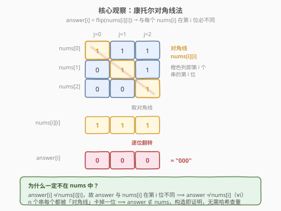
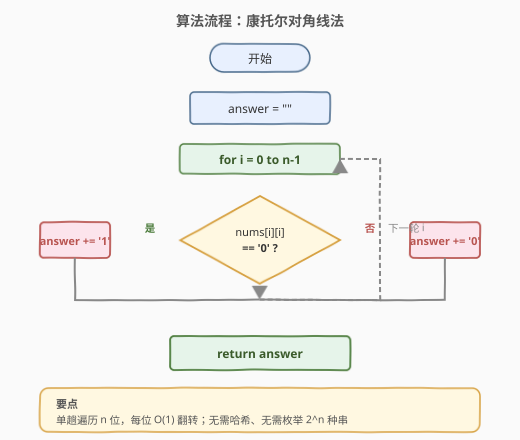
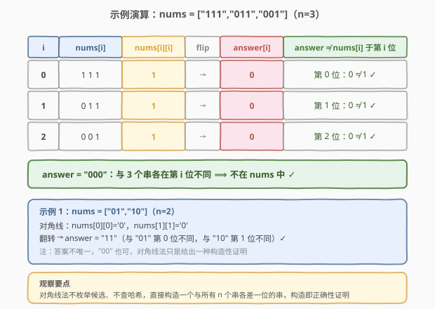

# LeetCode 找出不同的二进制字符串 题解

## 1. 题目概述

- **标题 / 题号**：找出不同的二进制字符串（#1980，medium）
- **链接**：https://leetcode.cn/problems/find-unique-binary-string/
- **难度**：中等
- **标签**：数组、哈希表、字符串、位运算、数学

**题意**：给定一个字符串数组 `nums`，由 `n` 个**互不相同**的二进制字符串组成，每个字符串长度均为 `n`。请找出并返回一个长度为 `n` 且**没有出现在** `nums` 中的二进制字符串。若存在多种答案，返回**任意一个**即可。

**示例 1**：

```text
输入：nums = ["01","10"]
输出："11"
解释："11" 没有出现在 nums 中。"00" 也是正确答案。
```

**示例 2**：

```text
输入：nums = ["00","01"]
输出："11"
解释："11" 没有出现在 nums 中。"10" 也是正确答案。
```

**示例 3**：

```text
输入：nums = ["111","011","001"]
输出："101"
解释："101" 没有出现在 nums 中。"000"、"010"、"100"、"110" 也是正确答案。
```

**约束**：

- $n = \text{nums.length}$
- $1 \le n \le 16$
- $\text{nums[i].length} = n$
- `nums[i]` 仅由 `'0'` / `'1`' 组成
- `nums` 中所有字符串**互不相同**

> 💡 **审题关键**：① 长度为 $n$ 的二进制串共有 $2^n$ 种，而 `nums` 只给了 $n$ 个，当 $n \ge 1$ 时 $2^n > n$ 恒成立（$n=16$ 时 $65536 \gg 16$），所以**必定存在**缺失串，这是鸽巢原理的直接推论；② 题目只要「任意一个」缺失串，不要求字典序最小，这为「构造性」解法留下了空间——不必枚举所有候选，直接「造」一个保证缺失的串即可。

## 2. 解题思路

### 2.1 暴力思路：枚举 $2^n$ 种串 + 哈希查重

最直观的做法：把 `nums` 存入哈希集合，然后从小到大枚举所有 $2^n$ 个长度为 $n$ 的二进制串，返回第一个不在集合中的。

- **正确性**：$2^n > n$ 保证至少有一个串缺失，枚举必能命中。
- **效率**：时间 $O(2^n \cdot n)$（每个串长度 $n$，哈希比较也是 $O(n)$），空间 $O(n^2)$（存 $n$ 个长 $n$ 的串）。$n=16$ 时 $2^{16}=65536$，仍可接受，但远非最优。

> ⚠️ 暴力法把「$2^n$ 种可能」全部当成搜索空间，却忽略了题目给的 `n` 个串本身就是「构造缺失串」的原料。能不能不枚举、直接「造」出一个必然缺失的串？见 2.2。

### 2.2 核心观察：康托尔对角线法



把 `nums` 看作一个 $n \times n$ 的 0/1 矩阵：第 $i$ 行是 `nums[i]`。关键洞察是**沿主对角线**取每一位 `nums[i][i]`，然后**逐位翻转**，构造出答案：

$$\boxed{\text{answer}[i] = \begin{cases} \text{'1'} & \text{若 nums[i][i] = '0'} \\ \text{'0'} & \text{若 nums[i][i] = '1'} \end{cases}, \quad 0 \le i < n}$$

**为什么它一定不在 `nums` 中？** 因为 `answer` 与第 $i$ 个串 `nums[i]` 恰好在**第 $i$ 位**不同：

- `answer[i]` 是 `nums[i][i]` 的翻转，故 $\text{answer}[i] \neq \text{nums}[i][i]$。
- 两个串若相等，必须每一位都相等；既然 `answer` 与 `nums[i]` 在第 $i$ 位已经不同，则 $\text{answer} \neq \text{nums}[i]$。
- 这对每个 $i \in [0, n)$ 都成立，所以 `answer` 与全部 $n$ 个串都不同 ⟹ $\text{answer} \notin \text{nums}$。

> 💡 这就是著名的**康托尔对角线论证（Cantor's diagonal argument）**——历史上康托尔用它证明实数不可数：假设可数地把实数列成一张表，沿对角线翻转每一位就能「造」出一个不在表中的实数，矛盾。本题是该论证的离散有限版：$n$ 个串「占不满」$2^n$ 种可能，对角线翻转直接给出一个缺席者。**构造即证明**，无需枚举、无需哈希。

> ⚠️ 对角线法给出的答案**不唯一**（题目也允许任意一个）。例如示例 3 中对角线法得 `"000"`，而官方示例输出是 `"101"`，二者都正确。不要纠结「为什么和示例输出不一样」。

### 2.3 算法流程图



流程极简：单趟遍历 $i = 0 \dots n-1$，读 `nums[i][i]`，按位翻转追加到 `answer`，返回即可。没有嵌套循环、没有回溯、没有哈希。

### 2.4 示例演算

以示例 3（`nums = ["111","011","001"]`，$n=3$）演算对角线法，并对照示例 1：



| $i$ | `nums[i]` | `nums[i][i]` | flip → `answer[i]` | 验证 `answer` ≠ `nums[i]` |
|-----|-----------|--------------|--------------------|---------------------------|
| 0 | `"111"` | `'1'` | `'0'` | 第 0 位：`0 ≠ 1` ✓ |
| 1 | `"011"` | `'1'` | `'0'` | 第 1 位：`0 ≠ 1` ✓ |
| 2 | `"001"` | `'1'` | `'0'` | 第 2 位：`0 ≠ 1` ✓ |

得 `answer = "000"`。它与 `nums[0]` 在第 0 位不同、与 `nums[1]` 在第 1 位不同、与 `nums[2]` 在第 2 位不同，因此不在 `nums` 中 ✓。

> 💡 **观察要点**：对角线法不枚举候选、不查哈希，直接构造一个与所有 $n$ 个串各差一位的串。每一位的翻转都「精准卡掉」一个 `nums[i]`，$n$ 位刚好卡掉 $n$ 个串，构造即正确性证明。

## 3. 参考代码

### 方法一：康托尔对角线法（O(n) 时间，推荐）

### C++

```cpp
class Solution {
  public:
    string findDifferentBinaryString(vector<string>& nums) {
        string ans;
        for (int i = 0; i < (int)nums.size(); ++i) {
            ans += (nums[i][i] == '0') ? '1' : '0';
        }
        return ans;
    }
};
```

### Python

```python
class Solution:
    def findDifferentBinaryString(self, nums: List[str]) -> str:
        return "".join('1' if nums[i][i] == '0' else '0' for i in range(len(nums)))
```

> 💡 一行流：`'1' if nums[i][i] == '0' else '0'` 即按位翻转，等价于 `chr(ord('1') + ord('0') - ord(nums[i][i]))`，但前者可读性远胜。

### 方法二：哈希枚举法（O(2^n · n)，暴力对照）

### C++

```cpp
class Solution {
  public:
    string findDifferentBinaryString(vector<string>& nums) {
        int n = nums.size();
        unordered_set<int> seen;
        for (auto& s : nums) seen.insert(stoi(s, nullptr, 2));
        for (int x = 0; x < (1 << n); ++x) {
            if (!seen.count(x)) {
                string ans;
                for (int i = n - 1; i >= 0; --i) ans += ((x >> i) & 1) ? '1' : '0';
                return ans;
            }
        }
        return "";
    }
};
```

### Python

```python
class Solution:
    def findDifferentBinaryString(self, nums: List[str]) -> str:
        n = len(nums)
        seen = {int(s, 2) for s in nums}
        for x in range(1 << n):
            if x not in seen:
                return format(x, '0{}b'.format(n))
        return ""
```

> ⚠️ 枚举法把二进制串当整数处理（`int(s, 2)` / `stoi`），用位运算还原串。$n \le 16$ 时 `1 << n` 在 `int` 范围内安全；若 $n$ 更大（本题不会），需改回字符串递增。面试中先讲清对角线法，再口述此法作为「暴力对照」即可。

## 4. 复杂度分析

| 维度 | 方法 | 复杂度 | 说明 |
|------|------|--------|------|
| 时间复杂度 | 对角线法 | $O(n)$ | 单趟遍历 $n$ 位，每位 $O(1)$ 翻转 |
| 空间复杂度 | 对角线法 | $O(n)$ | 仅存长度为 $n$ 的答案串（不计返回值则 $O(1)$） |
| 时间复杂度 | 哈希枚举 | $O(2^n \cdot n)$ | 枚举 $2^n$ 个串，每个 $O(n)$ 哈希比较 |
| 空间复杂度 | 哈希枚举 | $O(n^2)$ | 哈希集存 $n$ 个长 $n$ 的串 |

> 💡 对角线法把指数级搜索空间压缩到线性：它不「找」缺失串，而是「造」一个必然缺失的串。$n=16$ 时枚举法要处理 $65536$ 个候选，对角线法只看 $16$ 位——差距源于是否利用了「$n$ 个串本身就是构造原料」这一结构。

## 5. 扩展：随机法与鸽巢视角

### 5.1 随机采样法

由于 $2^n \gg n$，随机生成一个长 $n$ 二进制串，命中 `nums` 的概率极低。期望尝试次数约 $\frac{2^n}{n}$（$n=16$ 时约 $4096$ 次，仍很快）：

```python
import random

class Solution:
    def findDifferentBinaryString(self, nums: List[str]) -> str:
        n = len(nums)
        seen = set(nums)
        while True:
            cand = ''.join(random.choice('01') for _ in range(n))
            if cand not in seen:
                return cand
```

> ⚠️ 随机法**期望**很快，但**最坏**情况理论上无界（虽然概率近乎为零）。面试中可作为「利用 $2^n \gg n$ 的鸽巢直觉」的谈资，但工程上优先确定性的对角线法。

### 5.2 鸽巢原理：为什么一定有解

长度为 $n$ 的二进制串共 $2^n$ 种，`nums` 只占 $n$ 个位置。由**鸽巢原理**，只要 $2^n > n$（即 $n \ge 1$ 恒成立），就必存在不在 `nums` 中的串。这是题目「必定有解」的数学保证，也是对角线法「构造即证明」成立的前提——若 $2^n \le n$（本题不可能），对角线法构造的串理论上仍与每个 `nums[i]` 不同，但「不同」的串可能超出 $2^n$ 种合法串的范围而无意义；本题 $2^n > n$ 保证了对角线产物必落在合法空间内且确实缺席。

> 💡 **一句话总结**：$2^n \gg n$ 是「必有缺失」的鸽巢保证，对角线法是「找出缺失」的构造利器——前者说「一定有」，后者说「这样造一定对」。

## 6. 面试要点

**Q1：对角线法为什么保证构造的串不在 `nums` 中？**

> `answer[i]` 是 `nums[i][i]` 的翻转，故 $\text{answer}[i] \neq \text{nums}[i][i]$。两个串相等要求每一位都相等；既然 `answer` 与 `nums[i]` 在第 $i$ 位已不同，则 $\text{answer} \neq \text{nums}[i]$。这对所有 $i \in [0,n)$ 成立，故 `answer` 与全部 $n$ 个串都不同。这是康托尔对角线论证的有限离散版。

**Q2：为什么不用哈希枚举，反而用对角线法？**

> 枚举法把 $2^n$ 种串当搜索空间，$O(2^n \cdot n)$；对角线法利用「$n$ 个给定串本身就是构造原料」，只看对角线 $n$ 位，$O(n)$。差距源于是否挖掘了题目结构——`nums` 给的不仅是「待避开的集合」，更是「可直接翻转的素材」。

**Q3：对角线法给出的答案和官方示例输出不一致，有问题吗？**

> 没问题。题目明确「任意一个」正确答案即可。示例 3 对角线法得 `"000"`，官方示例给 `"101"`，二者都不在 `nums` 中，都正确。不要纠结与示例输出是否逐字符一致。

**Q4：$n$ 的取值范围对解法选择有影响吗？**

> $n \le 16$ 时 $2^{16}=65536$，枚举法也能过。但若 $n$ 放大到 $30$ 甚至 $10^5$（变体题），枚举法 $O(2^n)$ 直接爆炸，对角线法 $O(n)$ 依然稳。面试中点出「对角线法不依赖 $2^n$ 可枚举」能体现对复杂度本质的理解。

**Q5：这和康托尔证明实数不可数是什么关系？**

> 同源。康托尔假设实数可数、列成无穷表，沿对角线翻转每位造出一个不在表中的实数，导出矛盾，从而证明实数不可数。本题是该论证的有限版：$n$ 个串「占不完」$2^n$ 种，对角线翻转直接给出缺席者。理解了这个思想，遇到「给定 $n$ 个对象，找一个不在其中的」类问题，可优先想「能否对角线构造」。

## 同类练习题

| # | 题目 | 与本题的关联 |
|---|------|-------------|
| 268 | [丢失的数字](https://leetcode.cn/problems/missing-number/)（[题解](../0201-0300/268_丢失的数字.md)） | 给定 $0 \sim n$ 中 $n$ 个数找缺失的那个，$n+1$ 种可能只给 $n$ 个，鸽巢+求和 $O(n)$；与本题同为「$n+1$（或 $2^n$）种空间只给 $n$ 个，找缺失」的鸽巢家族 |
| 41 | [缺失的第一个正数](https://leetcode.cn/problems/first-missing-positive/)（[题解](../0001-0100/41_缺失的第一个正数.md)） | 在 $n$ 个数中找最小缺失正整数，用下标当哈希键原地标记，$O(n)$ 时间 $O(1)$ 空间；对照体会「找缺失」的另一条路——原地索引标记 |
| 448 | [找到所有数组中消失的数字](https://leetcode.cn/problems/find-all-numbers-disappeared-in-an-array/)（[题解](../0401-0500/448_找到所有数组中消失的数字.md)） | $1 \sim n$ 中找所有缺失数，同样用下标取负标记存在性；本题的「多位缺失」版，索引标记法的招牌题 |
| 287 | [寻找重复数](https://leetcode.cn/problems/find-the-duplicate-number/)（[题解](../0201-0300/287_寻找重复数.md)） | $n+1$ 个数在 $[1,n]$ 中找重复，Floyd 判圈；与本题互为对偶——一个找「多出来的」，一个找「缺失的」，都靠挖掘「值域与下标」的结构关系 |
