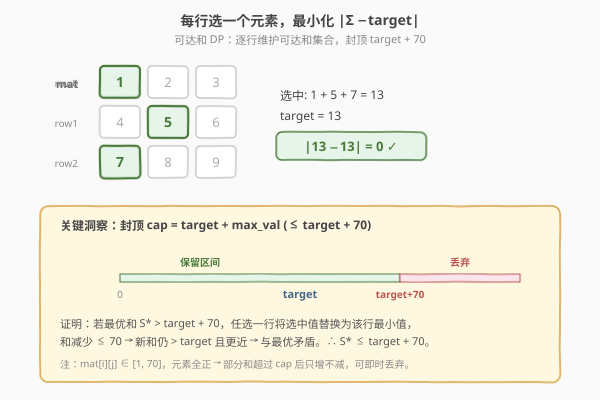
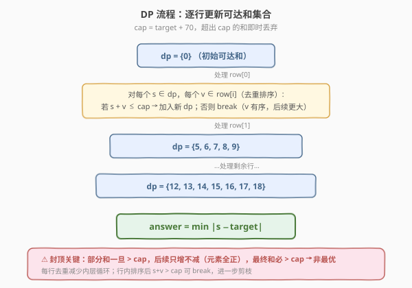
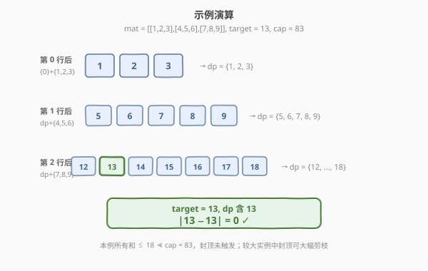

# 最小化目标值与所选元素的差

- **题目名称**：最小化目标值与所选元素的差
- **链接**：[1981. 最小化目标值与所选元素的差](https://leetcode.cn/problems/minimize-the-difference-between-target-and-chosen-elements/)
- **难度**：中等
- **标签**：动态规划、可达和 DP、bitset

## 1. 题目概述

给定大小为 $m \times n$ 的整数矩阵 `mat` 和整数 `target`。从矩阵的**每一行**中选择一个整数，使所有选中元素之**和**与 `target` 的**绝对差**最小。返回该最小绝对差。

**示例 1**：

```text
输入：mat = [[1,2,3],[4,5,6],[7,8,9]], target = 13
输出：0
解释：第一行选 1，第二行选 5，第三行选 7，和 = 13，绝对差 = 0。
```

**示例 2**：

```text
输入：mat = [[1],[2],[3]], target = 100
输出：94
解释：唯一方案 1+2+3=6，|6-100| = 94。
```

**示例 3**：

```text
输入：mat = [[1,2,9,8,7]], target = 6
输出：1
解释：选 7，|7-6| = 1。
```

**约束条件**：

- $1 \le m, n \le 70$
- $1 \le \text{mat}[i][j] \le 70$
- $1 \le \text{target} \le 800$

> 💡 本题本质是**每行选一个元素的可达和 DP**——维护"前若干行能凑出哪些和"，与 [416. 分割等和子集](../0401-0500/416_分割等和子集.md)（0-1 背包求子集和）同源。区别在于：本题每行**必选一个**（而非选/不选），且优化目标是**最小化与 target 的绝对差**而非判定恰好相等。

---

## 2. 解题思路

### 2.1 暴力思路：枚举所有组合

从每行选一个元素，共 $n^m$ 种组合。$m = n = 70$ 时组合数天文数字，**不可行**。

> ⚠️ 暴力的根本问题：**子问题重叠**。不同行之间的选择相互独立，但"前 $i$ 行凑出的和"这个中间状态被大量重复计算。例如前两行选 $(1,5)$ 和 $(2,4)$ 都凑出和 6，后续行的选择完全相同——暴力却各算一遍。

### 2.2 核心观察：可达和 DP + 封顶优化

**观察 1：每行选一个 → 可达和集合滚动更新。**

定义 $dp$ 为当前可达和的集合。初始 $dp = \{0\}$。处理第 $i$ 行后：

$$dp' = \{\, s + v \mid s \in dp,\ v \in \text{mat}[i] \,\}$$

即"旧可达和 + 本行某元素 = 新可达和"。处理完所有 $m$ 行后，答案为 $\min_{s \in dp} |s - \text{target}|$。

**观察 2：最优和不超过 $\text{target} + \max(\text{mat})$，可封顶剪枝。**

> 💡 **关键定理**：设最优和为 $S^*$，则 $S^* \le \text{target} + \max(\text{mat})$。
>
> **反证**：若 $S^* > \text{target} + \max(\text{mat})$，任选一行 $i$，将其选中值 $v$ 替换为该行最小值 $v_{\min}$。因为 $v \le \max(\text{mat})$ 且 $v_{\min} \ge 1$，所以 $v - v_{\min} \le \max(\text{mat}) - 1 < \max(\text{mat})$。新和 $S' = S^* - (v - v_{\min}) > \text{target}$，且 $S' < S^*$，故 $|S' - \text{target}| < |S^* - \text{target}|$，与 $S^*$ 最优矛盾。$\square$

由于 $\text{mat}[i][j] \le 70$，可设 $\text{cap} = \text{target} + 70$。**任何超过 cap 的部分和直接丢弃**——因为所有元素为正，部分和只增不减，一旦超过 cap 最终和必超过 cap，不可能是最优解。



> ⚠️ **封顶的本质**：不是"截断"到 cap，而是**丢弃**。超过 cap 的和不会变得更小（元素全正），所以永远无法接近 target。

### 2.3 算法流程图



**完整步骤**：

1. **初始化** `dp = {0}`（和为 0 可达），设 `cap = target + 70`。
2. **逐行处理**：对第 $i$ 行：
   - **排序去重**：将行内元素排序并去重，减少内层循环次数（同值选一次即可）。
   - **滚动更新**：`new_dp = {}`，对每个 $s \in \text{dp}$、每个 $v \in \text{row}$：
     - 若 $s + v \le \text{cap}$：加入 `new_dp`。
     - 若 $s + v > \text{cap}$：因 $v$ 有序，后续 $v$ 更大，直接 `break`。
   - `dp = new_dp`。
3. **返回** $\min_{s \in \text{dp}} |s - \text{target}|$。

### 2.4 示例演算

以 `mat = [[1,2,3],[4,5,6],[7,8,9]], target = 13` 为例（`cap = 83`，所有和远未触顶）：



**第 0 行后**：$dp = \{0\} + \{1,2,3\} = \{1, 2, 3\}$

**第 1 行后**：

| 旧和 $s$ | $s$+4 | $s$+5 | $s$+6 |
|----------|-------|-------|-------|
| 1 | 5 | 6 | 7 |
| 2 | 6 | 7 | 8 |
| 3 | 7 | 8 | 9 |

去重后 $dp = \{5, 6, 7, 8, 9\}$。

**第 2 行后**：

| 旧和 $s$ | $s$+7 | $s$+8 | $s$+9 |
|----------|-------|-------|-------|
| 5 | 12 | 13 | 14 |
| 6 | 13 | 14 | 15 |
| 7 | 14 | 15 | 16 |
| 8 | 15 | 16 | 17 |
| 9 | 16 | 17 | 18 |

去重后 $dp = \{12, 13, 14, 15, 16, 17, 18\}$。

**答案**：$\min |s - 13| = |13 - 13| = 0$。

> 💡 注意第 1 行后 $dp$ 只有 5 个值（而非 $3 \times 3 = 9$ 个）——不同行的选择可能凑出相同和，**去重是性能关键**。第 2 行后 $dp$ 只有 7 个值（而非 $5 \times 3 = 15$ 个），同理。

---

## 3. 参考代码

### C++

```cpp
// 1981_最小化目标值与所选元素的差.cpp
// 编译: g++ -O2 -std=c++17 1981.cpp -o sol
#include <vector>
#include <algorithm>
#include <climits>
using namespace std;

class Solution {
  public:
    int minimizeTheDifference(vector<vector<int>>& mat, int target) {
        int cap = target + 70;  // 最优和不超过 target + max_val
        vector<bool> dp(cap + 1, false);
        dp[0] = true;

        for (auto& row : mat) {
            // 排序去重，减少内层循环
            vector<int> vals(row.begin(), row.end());
            sort(vals.begin(), vals.end());
            vals.erase(unique(vals.begin(), vals.end()), vals.end());

            vector<bool> next(cap + 1, false);
            for (int s = 0; s <= cap; ++s) {
                if (!dp[s]) continue;
                for (int v : vals) {
                    if (s + v > cap) break;  // 有序，后续更大直接停
                    next[s + v] = true;
                }
            }
            dp = next;
        }

        int ans = INT_MAX;
        for (int s = 0; s <= cap; ++s) {
            if (dp[s]) ans = min(ans, abs(s - target));
        }
        return ans;
    }
};
```

### Python

```python
class Solution:
    def minimizeTheDifference(self, mat: list[list[int]], target: int) -> int:
        cap = target + 70  # 最优和不超过 target + max_val
        reachable = {0}

        for row in mat:
            unique_vals = sorted(set(row))  # 去重加速
            new_reachable = set()
            for s in reachable:
                for v in unique_vals:
                    if s + v <= cap:
                        new_reachable.add(s + v)
            reachable = new_reachable

        return min(abs(s - target) for s in reachable)
```

> 💡 **去重为什么重要？** 每行最多 70 个元素，但值域仅 $[1, 70]$，去重后最多 70 个唯一值。更重要的是：不同行的选择可能凑出相同和，`set` / `vector<bool>` 天然去重，$dp$ 大小受 cap 限制而非指数增长。

---

## 4. 复杂度分析

| 维度 | 复杂度 | 说明 |
|------|--------|------|
| **时间** | $O(m \cdot n \cdot \text{cap})$ | 每行遍历 $dp$（大小 $\le \text{cap}+1$）× 行内唯一值（$\le n$）；$\text{cap} = \text{target}+70 \le 870$ |
| **空间** | $O(\text{cap})$ | $dp$ 数组大小 $\text{cap}+1$，滚动更新只需两份 |

> ⚠️ 不封顶时 $dp$ 大小可达 $m \times 70 = 4900$，时间 $O(m \cdot n \cdot 4900) \approx 24\text{M}$，也能过但慢约 6 倍。封顶将 $dp$ 压到 $\le 871$，时间降到 $\approx 4.3\text{M}$，效率显著提升。

---

## 5. 扩展：bitset 优化与子集和联系

### 5.1 bitset 加速

用整数位运算模拟布尔数组，将内层"加法"变为**位移 + 或运算**，常数极小：

```python
class Solution:
    def minimizeTheDifference(self, mat: list[list[int]], target: int) -> int:
        cap = target + 70
        bits = 1  # bit s 置 1 表示和 s 可达，初始 bit 0 = 1
        mask = (1 << (cap + 1)) - 1

        for row in mat:
            new_bits = 0
            for v in sorted(set(row)):
                new_bits |= (bits << v)   # 所有可达和 +v
            bits = new_bits & mask         # 封顶：截断超过 cap 的位

        best = float('inf')
        s = 0
        while bits:
            if bits & 1:
                best = min(best, abs(s - target))
            bits >>= 1
            s += 1
        return best
```

> 💡 `bits << v` 将所有可达和同时加 $v$，`|=` 合并不同 $v$ 的结果——一条指令处理整个 $dp$ 数组。Python 大整数天然支持任意宽度位运算，无需 `std::bitset<871>` 的固定长度限制。

### 5.2 与子集和 / 背包 DP 的联系

本题属于**"每类必选一个"的可达和 DP**，与经典子集和/背包问题一脉相承：

| 题目 | 选择模型 | 优化目标 | 与本题关系 |
|------|---------|---------|-----------|
| **1981** 本题 | 每行必选一个 | 最小化 \|和−target\| | — |
| [416. 分割等和子集](../0401-0500/416_分割等和子集.md) | 每元素选/不选 | 判定和 = target | 0-1 背包判定版 |
| [1049. 最后一块石头的重量 II](../1001-1100/1049_最后一块石头的重量II.md) | 每元素选/不选 | 最小化两组差 | 0-1 背包最值版 |
| [322. 零钱兑换](https://leetcode.cn/problems/coin-change/) | 每硬币可选无限次 | 最少硬币数 | 完全背包 |

> 💡 通用模板：**维护"可达和集合"，按选择模型滚动更新**。0-1 背包是"选/不选"（`dp |= dp << v`），本题是"必选一个"（`new_dp = {s+v for s in dp for v in row}`），完全背包是"可选多次"（内层正序遍历）。

---

## 6. 面试要点

1. **为什么可以封顶 target + 70？**

   - 反证：若最优和 $S^* > \text{target} + 70$，任选一行将选中值替换为该行最小值。减少量 $\le 70$，新和仍 $> \text{target}$ 但更近，与最优矛盾。
   - 因此 $S^* \le \text{target} + 70$，超过的部分和可即时丢弃（元素全正，部分和只增不减）。

2. **不封顶也能过吗？为什么还要封顶？**

   - 不封顶时 $dp$ 大小最大 $m \times 70 = 4900$，时间 $O(m \cdot n \cdot 4900) \approx 24\text{M}$，LeetCode 上能过。
   - 封顶后 $dp \le 871$，时间降到 $\approx 4.3\text{M}$，**快约 6 倍**。面试中展示封顶分析能体现对问题结构的深入理解。

3. **为什么要对每行排序去重？**

   - **去重**：行内同值选多次结果相同，去重后最多 70 个唯一值，减少内层循环。
   - **排序**：排序后内层循环遇到 $s + v > \text{cap}$ 可 `break`（后续 $v$ 更大），进一步剪枝。两者配合将内层循环从 $O(n)$ 降到实际遍历的合法值数。

4. **与 416（分割等和子集）的区别？**

   - 416 是"每元素选/不选"（0-1 背包），$dp$ 转移是 `dp[s] |= dp[s-v]`（逆向，01 背包一维）。
   - 本题是"每行必选一个"，$dp$ 转移是 `new_dp[s+v] = true`（正向，需要两份数组）。
   - 416 判定"恰好等于 target"，本题求"最接近 target"。

5. **如果 m, n 更大（如 1000）怎么办？**

   - 封顶仍然有效（$dp \le \text{target} + 70$），但 $m$ 增大会使外层循环变长。
   - 若 $n$ 也很大且行内值域大，可考虑 **bitset 优化**（`dp |= dp << v`），将内层循环降为 $O(\text{cap}/64)$。
   - 极端情况可考虑 **meet in the middle**（前后各半，合并两半可达和），但本题约束下不必要。

> 💡 **一句话总结**：本题是"每行必选一个"的可达和 DP，核心是维护可达和集合滚动更新。封顶 target+70 是关键优化——基于"替换为行最小值"的反证，将 $dp$ 空间从 4900 压到 870。

---

## 7. 同类练习题

- [1774. 最接近目标价格的甜点成本](https://leetcode.cn/problems/closest-dessert-cost/)：基料必选一种 + 配料选/不选，最小化与 target 的差，可达和 DP 变体
- [416. 分割等和子集](https://leetcode.cn/problems/partition-equal-subset-sum/)：0-1 背包判定子集和 = target，可达和 DP 的判定版
- [1049. 最后一块石头的重量 II](https://leetcode.cn/problems/last-stone-weight-ii/)：0-1 背包最小化两组差，可达和 DP 的最值版
- [1755. 最接近目标值的子序列和](https://leetcode.cn/problems/closest-subsequence-sum/)：meet in the middle 求最接近 target 的子集和，大数据量进阶
- [2035. 将数组分成两个数组使最小差](https://leetcode.cn/problems/partition-array-into-two-arrays-to-minimize-sum-difference/)：meet in the middle + 双指针，2n 长度分两组最小差
