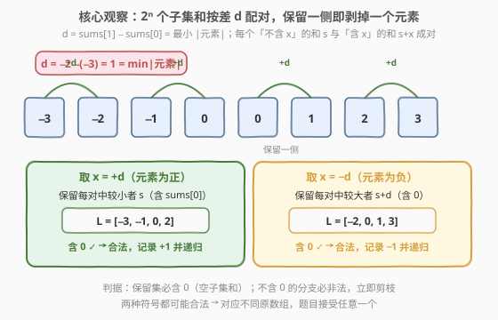
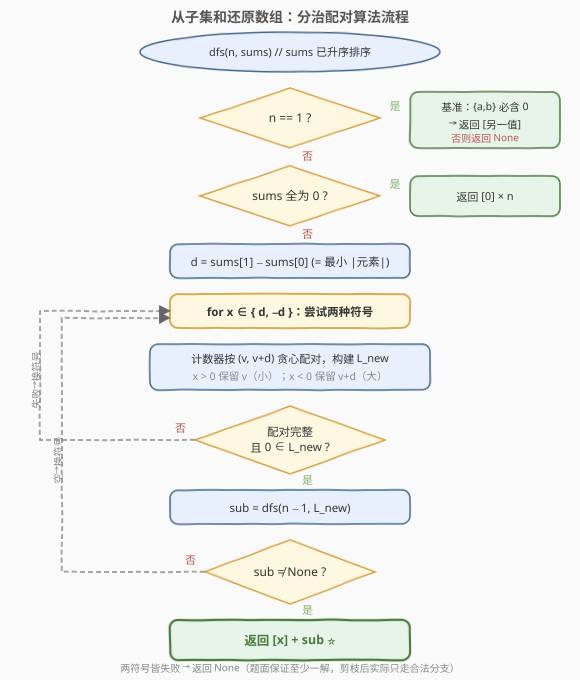

# 从子集的和还原数组

- **题目名称**：从子集的和还原数组
- **链接**：[1982. 从子集的和还原数组](https://leetcode.cn/problems/find-array-given-subset-sums/)
- **难度**：困难
- **标签**：数组、分治、递归、哈希表

## 1. 题目概述

存在一个长度为 $n$ 的未知整数数组 `arr`。给你 $n$ 和一个长度为 $2^n$ 的数组 `sums`，它是 `arr` **所有子集的和**构成的多重集（顺序被打乱）。请还原出任意一个合法的 `arr`。

> 子集的和：对 `arr` 的任一子集（含空集），其元素之和。空集和规定为 $0$。因此 `sums` 中**一定包含 $0$**（空子集）。

**示例 1**：

```text
输入：n = 3, sums = [-3,-2,-1,0,0,1,2,3]
输出：[1,2,-3]
解释：[1,2,-3] 的 8 个子集和分别为
  [] → 0；[1] → 1；[2] → 2；[1,2] → 3；
  [-3] → -3；[1,-3] → -2；[2,-3] → -1；[1,2,-3] → 0
恰好等于 sums。[-1,-2,3] 等也被视为正确。
```

**示例 2**：

```text
输入：n = 2, sums = [0,0,0,0]
输出：[0,0]
```

**示例 3**：

```text
输入：n = 4, sums = [0,0,5,5,4,-1,4,9,9,-1,4,3,4,8,3,8]
输出：[0,-1,4,5]
```

**约束条件**：

- $1 \le n \le 15$
- $\text{sums.length} = 2^n$
- $-10^4 \le \text{sums}[i] \le 10^4$
- 测试用例保证至少存在一个正确答案。

> 💡 **审题关键**：① `sums` 是 $2^n$ 个子集和的**多重集**（含重复，如示例 1 有两个 $0$）；② 只需返回**任意一个**合法数组，排列与整体取负均被接受；③ $n \le 15$ 但 $2^n \le 32768$，禁止 $O(4^n)$ 级暴力枚举原数组，必须从「子集和集合的结构」入手反向求解。

---

## 2. 解题思路

### 2.1 暴力思路：枚举原数组并验证

最朴素的做法：枚举所有可能的 $n$ 元数组 `arr`（每个元素取值范围 $[-10^4, 10^4]$，组合数天文数字），对每个候选计算其 $2^n$ 个子集和，排序后与 `sums` 比较。

- **正确性**：穷举必能命中。
- **效率**：完全不可行。元素取值范围太大，组合数远超时限。

> ⚠️ 暴力的根因在于「正向构造」。换个视角：**子集和集合本身携带了原数组的全部信息**——能否直接从 `sums` 的结构里「读出」每个元素？这正是 2.2 的核心观察。

### 2.2 核心观察：按差 d 配对，剥掉一个元素



把 `sums` **升序排序**。设原数组某个元素为 $x$。对任意「不含 $x$」的子集 $T$，其和 $s$ 与「含 $x$」的对应子集和 $s + x$ **恰好相差 $|x|$**。于是 $2^n$ 个子集和可两两配成 $2^{n-1}$ 对 $(s,\ s+x)$。若能确定 $x$ 与配对方式，把每对的「不含 $x$」侧 $s$ 收集起来，就得到**去掉 $x$ 后的数组的子集和集合**——问题规模从 $n$ 降到 $n-1$，递归即可。

**两个关键事实**：

**事实 1：$d = \text{sums}[1] - \text{sums}[0]$ 恰为「最小 $|元素|$」。**

排序后 $\text{sums}[0]$ 是最小子集和 =「所有负数之和」（取全部负数、不取正数）。比它大一点的次小和 $\text{sums}[1]$，只能由两种操作得到：往最小子集里**加入最小正数**，或从中**移除最小 $|$负数$|$**。两者带来的增量分别是「最小正数」与「最小 $|$负数$|$」，取较小者即

$$d = \text{sums}[1] - \text{sums}[0] = \min_i |a_i|$$

于是候选元素只有两个：$+d$ 或 $-d$（绝对值已锁定，符号待定）。

**事实 2：配对总形如 $(v,\ v+d)$，保留哪一侧由符号决定。**

无论 $x = +d$ 还是 $x = -d$，每对的两个成员都相差 $d$，较小的记 $v$、较大的 $v+d$：

- **取 $x = +d$（正元素）**：最小子集（全负数）**不含** $x$，故 $\text{sums}[0]$ 在「不含 $x$」侧。**保留较小者 $v$**（含 $\text{sums}[0]$）。
- **取 $x = -d$（负元素）**：最小子集（全负数）**含** $x$，故 $\text{sums}[0]$ 在「含 $x$」侧。**保留较大者 $v+d$**（含空集和 $0$）。

**合法性判据**：保留集是「去掉 $x$ 后的数组的子集和集合」，**必含 $0$**（空子集）。因此配对完成后，若保留集**不含 $0$**，则该符号非法，立即剪枝换另一符号。含 $0$ 则递归。

> 💡 **为什么不会走错路？** 对正确符号，保留集天然含 $0$（空子集在「不含 $x$」侧）。对错误符号，保留集往往不含 $0$ 而被剪枝；即便偶然含 $0$，它对应的是**另一个同样合法的原数组**（题目接受任意解），递归仍能成功。两种符号中至少一个对应真元素，故总能还原。

### 2.3 算法流程图



算法 `dfs(n, sums)`（`sums` 已排序）：

1. **基准 $n = 1$**：`sums` 只有两个值 $\{a, b\}$，单元素数组的子集和为 $\{0, x\}$，故必含 $0$。若 $a = 0$ 返回 $[b]$；若 $b = 0$ 返回 $[a]$；否则非法返回 `None`。
2. **全零特判**：若 `sums` 全为 $0$，返回 $[0] \times n$。
3. 计算 $d = \text{sums}[1] - \text{sums}[0]$。
4. **遍历 $x \in \{d,\ -d\}$**：用计数器（哈希表）按 $(v,\ v+d)$ 贪心配对，构建保留集 $L$（$x > 0$ 保留 $v$，$x < 0$ 保留 $v+d$）。
5. 若配对完整且 $0 \in L$：递归 `dfs(n-1, L)`；若返回非空，则前置 $x$ 返回。
6. 两符号皆失败返回 `None`（题面保证不会发生）。

**贪心配对的正确性**：按升序遍历，当前最小可用值 $v$ 必是「需要保留/需要消去」的那一侧（因为它的搭档 $v+d$ 更大，尚未被处理）。用哈希计数器 $O(1)$ 查找搭档即可。

### 2.4 示例演算

![示例 1 演算：三层递归还原 [1,2,-3]](../images/1982_example_walkthrough.svg)

以示例 1（$n=3$，`sums = [-3,-2,-1,0,0,1,2,3]`）演示：

**第 1 层**（$n=3$）：排序后 $d = -2 - (-3) = 1$。取 $x = +1$，按 $(v, v+1)$ 配对：$(-3,-2),\ (-1,0),\ (0,1),\ (2,3)$，保留较小者 $v$ → $L = [-3,-1,0,2]$，含 $0$ ✓，记录 $+1$。

**第 2 层**（$n=2$，$L=[-3,-1,0,2]$）：$d = -1-(-3) = 2$。取 $x = +2$，配对 $(-3,-1),\ (0,2)$，保留较小者 → $L = [-3,0]$，含 $0$ ✓，记录 $+2$。

**第 3 层**（$n=1$，$L=[-3,0]$）：基准，$\{a,b\}=\{-3,0\}$ 含 $0$，返回 $[-3]$。

回溯拼接：$[+1] \to [+1,+2] \to [+1,+2,-3] = [1,2,-3]$ ✓。

> 💡 **观察**：每层 $d$ 恰为当前数组的最小 $|$元素$|$（$1, 2, 3$），逐层「剥洋葱」般取出最小绝对值元素。保留集总含 $0$，全程无需回溯。

---

## 3. 参考代码

### C++

```cpp
class Solution {
public:
    vector<int> recoverArray(int n, vector<int>& sums) {
        sort(sums.begin(), sums.end());
        vector<int> ans;
        dfs(n, sums, ans);
        return ans;
    }
private:
    bool dfs(int n, vector<int>& sums, vector<int>& ans) {
        if (n == 1) {
            int a = sums[0], b = sums[1];
            if (a == 0) { ans = {b}; return true; }
            if (b == 0) { ans = {a}; return true; }
            return false;                       // {a,b} 不含 0，非法
        }
        if (sums.front() == 0 && sums.back() == 0) {
            ans.assign(n, 0);                   // 全零特判
            return true;
        }
        int d = sums[1] - sums[0];              // = 最小 |元素|
        for (int x : {d, -d}) {                 // 两种符号都试
            unordered_map<int,int> cnt;
            for (int s : sums) cnt[s]++;
            vector<int> nxt;
            bool ok = true;
            for (int v : sums) {                // 升序贪心配对
                if (cnt[v] == 0) continue;
                int partner = v + d;
                auto it = cnt.find(partner);
                if (it == cnt.end() || it->second == 0) { ok = false; break; }
                cnt[v]--;
                cnt[partner]--;
                nxt.push_back(x > 0 ? v : partner);   // +d 保留小，-d 保留大
            }
            if (!ok) continue;
            sort(nxt.begin(), nxt.end());
            if (!binary_search(nxt.begin(), nxt.end(), 0)) continue;  // 不含 0 必非法
            if (dfs(n - 1, nxt, ans)) {
                ans.insert(ans.begin(), x);    // 前置当前元素
                return true;
            }
        }
        return false;
    }
};
```

### Python

```python
from collections import Counter
from typing import List

class Solution:
    def recoverArray(self, n: int, sums: List[int]) -> List[int]:
        sums = sorted(sums)

        def dfs(n: int, sums: List[int]) -> List[int] | None:
            if n == 1:
                a, b = sums[0], sums[1]
                if a == 0:
                    return [b]
                if b == 0:
                    return [a]
                return None                        # {a,b} 不含 0，非法
            if sums[0] == 0 and sums[-1] == 0:
                return [0] * n                     # 全零特判

            d = sums[1] - sums[0]                   # = 最小 |元素|
            for x in (d, -d):                       # 两种符号都试
                cnt = Counter(sums)
                nxt = []
                ok = True
                for v in sums:                     # 升序贪心配对
                    if cnt[v] == 0:
                        continue
                    partner = v + d
                    if cnt[partner] == 0:
                        ok = False
                        break
                    cnt[v] -= 1
                    cnt[partner] -= 1
                    nxt.append(v if x > 0 else partner)   # +d 保留小，-d 保留大
                if not ok or 0 not in nxt:
                    continue
                nxt.sort()
                sub = dfs(n - 1, nxt)
                if sub is not None:
                    return [x] + sub
            return None

        return dfs(n, sums)
```

> 💡 **实现细节**：① `partner = v + d` 与符号无关——两种符号下配对的两数都相差 $d$，区别只在保留哪一侧；② `x > 0` 时保留 $v$（小），`x < 0` 时保留 `partner`（大），呼应 2.2 的判别；③ 全零特判可省略（通用流程也能处理 $d=0$：此时某元素为 $0$，所有子集和重复偶数次，配对自然消去一半），加上仅为加速与可读性。

> ⚠️ **$d = 0$ 的情况**：意味着数组含 $0$ 元素，此时每个子集和出现偶数次，`partner = v` 会使 `cnt[v]` 一次减 $2$。由于重数恒为偶数，不会出现负计数，逻辑自洽。

---

## 4. 复杂度分析

| 维度 | 复杂度 | 说明 |
|------|--------|------|
| 时间复杂度 | $O(n \cdot 2^n)$ | 每层一次配对扫描 $O(2^k)$；$n$ 层共 $O(\sum 2^k) = O(2^n)$，含 $0$ 剪枝使每层至多一次失败旁支，总体 $O(n \cdot 2^n)$ 上界 |
| 空间复杂度 | $O(2^n)$ | 哈希计数器与保留集 $L$ 各存 $O(2^k)$，递归深度 $O(n)$，最大占用 $O(2^n)$ |

> 💡 $n \le 15 \Rightarrow 2^n \le 32768$，$n \cdot 2^n \approx 5 \times 10^5$，远在时限内。「含 $0$」不变式把错误符号几乎都在当层剪掉，实际常系数极小。

---

## 5. 扩展：正确性证明与多解来源

**递归正确性（归纳）**：设 `dfs(k, S)` 在 `S` 为某 $k$ 元数组的子集和集合时返回一个合法数组。基准 $k=1$ 显然成立（$\{0,x\}$ → $[x]$）。归纳步：对 $n$ 元数组，取最小 $|$元素$|$ $x_0$（$|x_0|=d$），正确符号下保留集 $L$ 恰为「去掉 $x_0$」后的 $(n-1)$ 元数组的子集和集合，由归纳假设 `dfs(n-1, L)` 返回合法数组 $A'$，则 $A' \cup \{x_0\}$ 的子集和 $= L \cup (L + x_0) = S$，合法。∎

**为何「错误符号」也合法？** 当 $+d$ 与 $-d$ 都使保留集含 $0$ 时，它们各自对应一个**不同的合法原数组**（互为部分元素的符号翻转/置换）。例如 `sums=[-3,-2,-1,0,0,1,2,3]` 既可还原为 $[1,2,-3]$（取 $+1$）也可还原为 $[-1,-2,3]$（取 $-1$）。这正是题面「任意一个」的来源——算法先试 $+d$，命中即返回，无需枚举所有解。

**与正向枚举的对比**：朴素「枚举原数组 + 验证」是 $O(\text{值域}^n \cdot 2^n)$，不可行；本算法利用子集和的**配对结构**把「还原」降为 $O(n \cdot 2^n)$，关键在于 $d$ 一步锁定最小 $|$元素$|$，避免了搜索。

---

## 6. 面试要点

**Q1：为什么 $d = \text{sums}[1] - \text{sums}[0]$ 一定等于最小 $|$元素$|$？**

> $\text{sums}[0]$ 是最小子集和 = 全部负数之和。次小和 $\text{sums}[1]$ 只能由「加最小正数」或「移除最小 $|$负数$|$」得到，二者增量分别为这两个量，取较小即为 $d$，恰是全体元素的最小绝对值。

**Q2：怎么决定取 $+d$ 还是 $-d$？为什么两种都要试？**

> 符号无法直接判定——最小 $|$元素$|$ 可能是正也可能是负。两种符号对应不同的配对保留侧（$+d$ 保留小 $v$，$-d$ 保留大 $v+d$），各试一次，靠「保留集含 $0$」与递归成败自动筛选。至少一种对应真元素，故必成。

**Q3：「保留集必须含 $0$」这个剪枝的依据是什么？去掉它会怎样？**

> 保留集是「去掉某元素后的数组」的子集和集合，必含空集和 $0$。不含 $0$ 说明该符号配出的不是合法子集和集合，必非法。去掉它会让错误分支深入递归、甚至配出错误数组，最终只能靠最末层基准或全量验证兜底，效率与正确性都变差。

**Q4：$n \le 15$，为什么不能用「枚举原数组 + 验证子集和」？**

> 元素取值范围 $[-10^4,10^4]$，$n$ 元数组的组合空间约 $2 \times 10^{4n}$，即便 $n=4$ 也已 $10^{16}$ 量级；且每次验证要算 $2^n$ 个子集和。完全不可行。必须反向利用子集和结构。

**Q5：贪心配对（按升序取最小可用值）为什么正确？**

> 配对中较小者 $v$ 的搭档 $v+d$ 更大。按升序遍历时，最小可用值不可能是某个更大值的搭档（否则那个更小值应先被处理），故它必是需保留/消去的一侧，搭档 $v+d$ 可在哈希表中 $O(1)$ 取到。贪心选择唯一且必然成功（对正确符号）。

> 💡 **一句话总结**：排序后 $d = \text{sums}[1]-\text{sums}[0]$ 锁定最小 $|$元素$|$，按 $(v,v+d)$ 配对、保留含 $0$ 的一侧即剥掉该元素，递归 $n$ 层还原——$O(n \cdot 2^n)$ 时间、$O(2^n)$ 空间。

---

## 7. 同类练习题

- [1755. 最接近目标值的子序列和](../1701-1800/1755_最接近目标值的子序列和.md)：枚举一半子集和排序后二分，与本题对「子集和集合」结构的处理相通
- [2035. 将数组分成两个数组并最小化数组和的差](https://leetcode.cn/problems/partition-array-into-two-arrays-to-minimize-sum-difference/)：同样 $n \le 15$ + 子集和 meet-in-the-middle，难度与本题相当
- [416. 分割等和子集](../0401-0500/416_分割等和子集.md)：子集和判定 DP，对照「判定存在」与「反向还原」的难度跃迁
- [454. 四数相加 II](../0401-0500/454_四数相加%20II.md)：Meet-in-the-Middle 分组哈希，思想同源
