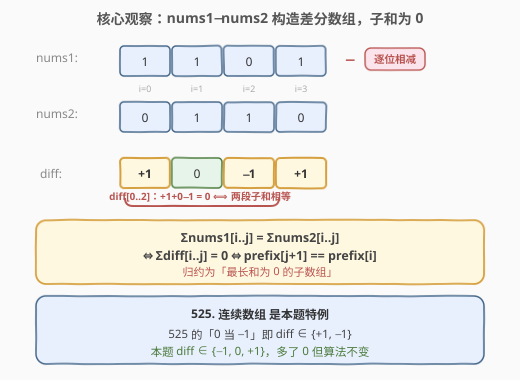
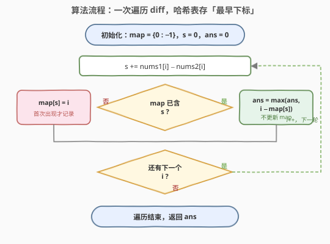
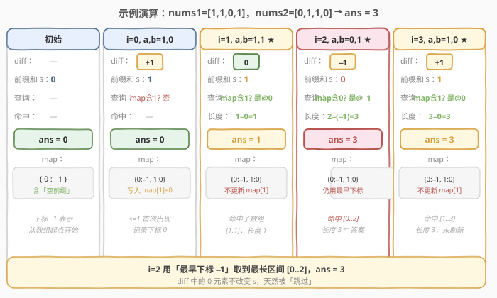

# LeetCode 范围和相等的最宽索引对 题解

## 1. 题目概述

- **标题 / 题号**：范围和相等的最宽索引对（#1983，medium）
- **链接**：https://leetcode.cn/problems/widest-pair-of-indices-with-equal-range-sum/
- **难度**：中等
- **标签**：数组、哈希表、前缀和

**题意**：给定两个**以 0 为索引**的二进制数组 `nums1` 和 `nums2`。找出**最宽**的索引对 `(i, j)`，使得 `i <= j` 并且 `nums1[i] + nums1[i+1] + ... + nums1[j] == nums2[i] + nums2[i+1] + ... + nums2[j]`。

**最宽**的指标对是指在 `i` 和 `j` 之间**距离最大**的指标对。一对指标之间的**距离**定义为 `j - i + 1`。返回最宽索引对的**距离**；如果没有满足条件的索引对，则返回 `0`。

**示例 1**：

```text
输入：nums1 = [1,1,0,1], nums2 = [0,1,1,0]
输出：3
解释：取 i = 1, j = 3：
nums1[1]+nums1[2]+nums1[3] = 1+0+1 = 2
nums2[1]+nums2[2]+nums2[3] = 1+1+0 = 2
距离 = j - i + 1 = 3 - 1 + 1 = 3。
```

**示例 2**：

```text
输入：nums1 = [0,1], nums2 = [1,1]
输出：1
解释：取 i = 1, j = 1：nums1[1] = 1，nums2[1] = 1，距离 = 1。
```

**示例 3**：

```text
输入：nums1 = [0], nums2 = [1]
输出：0
解释：没有满足要求的索引对。
```

**约束**：

- `n == nums1.length == nums2.length`
- $1 \le n \le 10^5$
- `nums1[i]` 仅为 `0` 或 `1`
- `nums2[i]` 仅为 `0` 或 `1`

> ⚠️ 注意：求的是「**最宽距离**」而非个数；数据规模到 $10^5$，要求 $O(n)$ 级别解法，暴力 $O(n^2)$ 必然超时。

## 2. 解题思路

### 2.1 暴力思路

枚举所有索引对 `(i, j)`（$i \le j$），分别统计 `nums1[i..j]` 与 `nums2[i..j]` 的和并比较，维护最大距离。两重循环 + 求和共 $O(n^2)$，在 $n = 10^5$ 时约 $10^{10}$ 次操作，严重超时。需要找到「一次扫描就能判断」的增量方法。

### 2.2 核心观察：构造差分数组，转化为「前缀和相等」



直接同时维护两个数组的段内和很别扭，但有一个干净的等价转换：**把两个数组逐位相减**，得到差分数组 `diff[k] = nums1[k] - nums2[k]`。于是「两段子和相等」就等价于「`diff` 这一段的和为 `0`」：

$$
\sum_{k=i}^{j} \text{nums1}[k] = \sum_{k=i}^{j} \text{nums2}[k] \;\Longleftrightarrow\; \sum_{k=i}^{j} \big(\text{nums1}[k] - \text{nums2}[k]\big) = 0 \;\Longleftrightarrow\; \sum_{k=i}^{j} \text{diff}[k] = 0
$$

而「`diff` 的某段子和为 `0`」又等价于「**两端的前缀和相等**」。设 `s` 为 `diff` 的前缀和，则：

$$
\sum_{k=i}^{j} \text{diff}[k] = 0 \;\Longleftrightarrow\; \text{s}[j+1] - \text{s}[i] = 0 \;\Longleftrightarrow\; \text{s}[j+1] = \text{s}[i]
$$

> 💡 **关键转化**：问题从「两段子和相等」变成「**找两个前缀和相等的位置，使它们的距离最大**」。这正是哈希表的舒适区——记录每个前缀和**第一次出现**的位置，后面再遇到相同值时直接算距离。

> 💡 **与 [525. 连续数组](../0501-0600/525_连续数组.md) 的关系**：525 把 `0` 当作 `−1`、`1` 当作 `+1`，本质就是构造一个 `diff ∈ {+1, −1}` 的差分数组；本题 `diff ∈ {−1, 0, +1}`，只是多了一个 `0`（两位相等时），算法完全不变。**525 是 1983 的特例**，1983 是 525 的直接推广。

### 2.3 算法流程图



一次遍历即可：

1. 维护哈希表 `map`，记录每个前缀和**首次出现**的下标；初始 `map = {0 : -1}`（前缀和 `0` 在「空前缀」处即下标 `-1` 出现，对应从数组起点开始的子数组）。
2. 维护当前前缀和 `s`（初值 `0`）与答案 `ans`（初值 `0`）。
3. 对每个下标 `i`：`s += nums1[i] - nums2[i]`。
   - 若 `s` 已在 `map` 中：说明 `map[s]` 到 `i` 这一段 `diff` 之和为 `0`，更新 `ans = max(ans, i - map[s])`；**不更新** `map`，保留最早下标才能取到最宽。
   - 若 `s` 不在 `map` 中：`map[s] = i`，首次出现才记录。
4. 遍历结束，`ans` 即答案。

> ⚠️ **为什么命中时不更新 `map`**：本题求最宽距离，相同前缀和的**最早**下标能配出最大区间；若用新下标覆盖，后续再匹配时算出的距离只会更短。口诀：**求个数存频次，求最宽存最早**。

### 2.4 示例演算

以 `nums1 = [1,1,0,1]`、`nums2 = [0,1,1,0]` 为例（`diff = [+1, 0, -1, +1]`，答案应为 `3`）：



| 步骤 | i | a, b | diff | 前缀和 s | 查询 map | 命中长度 | ans | map 更新 |
|------|---|------|------|----------|----------|----------|-----|----------|
| 初始 | — | — | — | 0 | — | — | 0 | {0:−1} |
| 1 | 0 | 1, 0 | +1 | 1 | 不含 1 | — | 0 | 写入 {1:0} |
| 2 | 1 | 1, 1 | 0 | 1 | 含 1 @0 | 1−0=1 | 1 | 不更新 |
| 3 | 2 | 0, 1 | −1 | 0 | 含 0 @−1 | 2−(−1)=3 | 3 | 不更新 |
| 4 | 3 | 1, 0 | +1 | 1 | 含 1 @0 | 3−0=3 | 3 | 不更新 |

最终答案 `3`，对应 `i=2` 时由「最早下标 −1」配出的区间 `[0..2]`（距离 `2−(−1)=3`）。

> 💡 **看 i=2 这一步**：此时 `s=0` 在历史中出现过（下标 `-1`），用最早下标 `-1` 才得到距离 `3`。另外注意 `i=1` 的 `diff=0`：它不改变 `s`，天然被「跳过」——这正是 1983 相比 525 多出的 `0` 元素，但算法无需任何特殊处理。

## 3. 参考代码

### C++

```cpp
class Solution {
  public:
    int widestPairOfIndices(vector<int>& nums1, vector<int>& nums2) {
        unordered_map<int, int> mp;
        mp[0] = -1;
        int ans = 0, s = 0;
        int n = nums1.size();
        for (int i = 0; i < n; ++i) {
            s += nums1[i] - nums2[i];
            auto it = mp.find(s);
            if (it != mp.end()) {
                ans = max(ans, i - it->second);
            } else {
                mp[s] = i;
            }
        }
        return ans;
    }
};
```

### Python

```python
class Solution:
    def widestPairOfIndices(self, nums1: List[int], nums2: List[int]) -> int:
        mp = {0: -1}
        ans = s = 0
        for i, (a, b) in enumerate(zip(nums1, nums2)):
            s += a - b
            if s in mp:
                ans = max(ans, i - mp[s])
            else:
                mp[s] = i
        return ans
```

## 4. 复杂度分析

| 维度 | 复杂度 | 说明 |
|------|--------|------|
| 时间复杂度 | $O(n)$ | 只遍历数组一次，每次哈希表查询 / 写入均摊 $O(1)$ |
| 空间复杂度 | $O(n)$ | 最坏情况下每个前缀和都不同，哈希表存 $n+1$ 个键 |

> 💡 本题 `diff ∈ {−1, 0, +1}`，前缀和取值范围是 $[-n, n]$，因此也可用一个大小 $2n+1$ 的数组代替哈希表（下标偏移 $n$，初值 `-2` 表示「未出现」），把单次操作常数压到更低；但哈希表写法更通用、可读性更好，是面试首选。

## 5. 扩展：1983 与 525 的同构关系

同属「前缀和 + 哈希」家族，下列题目目标不同导致哈希表存的内容截然不同，但**归约手法一致**——都是把「区间满足某条件」转成「两端前缀状态相等」：

| 题目 | 目标 | 前缀状态 | 哈希表存什么 | 已存在时是否覆盖 |
|------|------|----------|--------------|------------------|
| 560. 和为 K 的子数组 | **计数** | 前缀和 | **频次** | 不覆盖，频次 +1 |
| 974. 和可被 K 整除的子数组 | **计数** | 前缀余数 | **频次** | 不覆盖，频次 +1 |
| **525. 连续数组** | **最长长度** | 前缀和（0→−1） | **最早下标** | **不覆盖**，保留最早 |
| **1983. 范围和相等的最宽索引对** | **最宽距离** | 前缀和（逐位差） | **最早下标** | **不覆盖**，保留最早 |

> 💡 **525 → 1983 的推广链**：525 在**单个**二进制数组里找「0/1 个数相等」的最长子数组，等价于 `diff = [+1 (遇1), −1 (遇0)]`；1983 把「单个数组的 0/1 计数」推广到「**两个**数组的段内和相等」，`diff = nums1 − nums2 ∈ {−1, 0, +1}`。多出的 `0` 表示两位相等、对前缀和无影响，无需任何特殊处理——这正是该套路最具迁移性的体现。

## 6. 面试要点

1. **为什么构造 `diff = nums1 − nums2`？**
   - 把「两段子和相等」归约成「一段子和为 0」，再归约成「两端前缀和相等」，把双数组双变量问题压缩成单变量（前缀和），从而能用哈希表一次扫描求解。

2. **哈希表为什么初始化 `{0: -1}`？**
   - 当前缀和再次变为 `0` 时，意味着从数组**开头**到当前位置两数组段内和相等，此时区间起点应是「数组起点之前」即下标 `-1`，距离为 `i - (-1) = i + 1`。不初始化会漏掉所有「从头开始」的合法索引对。

3. **遇到已存在的前缀和时，为什么不更新哈希表？**
   - 本题求最宽距离，相同前缀和的**最早**下标能配出最大区间；若用新下标覆盖，后续再匹配时算出的距离只会更短。

4. **`diff` 中的 `0` 元素（两位相等）需要特殊处理吗？**
   - 不需要。`0` 不改变前缀和 `s`，相当于在「相同状态」上多停了一步，天然被算法吸收——这正是 1983 相比 525 多出来的情形，但代码与 525 完全一致。

5. **能推广到非二进制数组吗？**
   - 能。只要两个数组等长，`diff = nums1 − nums2` 的构造对任意整数都成立，「段内和相等 ⟺ diff 段子和为 0 ⟺ 两端前缀和相等」的归约不变，算法原样适用。

## 同类练习题

| # | 题目 | 与本题的关联 |
|---|------|-------------|
| 525 | [连续数组](https://leetcode.cn/problems/contiguous-array/)（[题解](../0501-0600/525_连续数组.md)） | 本题的特例，`0` 当 `−1` 即 `diff ∈ {+1, −1}`，对照推广关系 |
| 560 | [和为 K 的子数组](https://leetcode.cn/problems/subarray-sum-equals-k/) | 前缀和 + 哈希的「计数」变体，对比哈希表存频次 vs 存下标 |
| 974 | [和可被 K 整除的子数组](https://leetcode.cn/problems/subarray-sums-divisible-by-k/) | 前缀和改为前缀余数，同余即相减为 K 的倍数 |
| 1915 | [最美子字符串的数目](https://leetcode.cn/problems/number-of-wonderful-substrings/)（[题解](../1901-2000/1915_最美子字符串的数目.md)） | 前缀状态（元音奇偶位掩码）+ 哈希，同目录下的「状态相等」变体 |
| 523 | [连续的子数组和](https://leetcode.cn/problems/continuous-subarray-sum/) | 前缀和 + 同余，且要求子数组长度至少为 2，下标差需 ≥ 2 |
