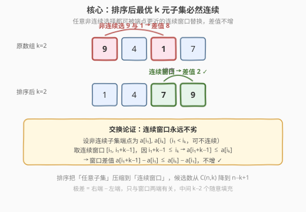
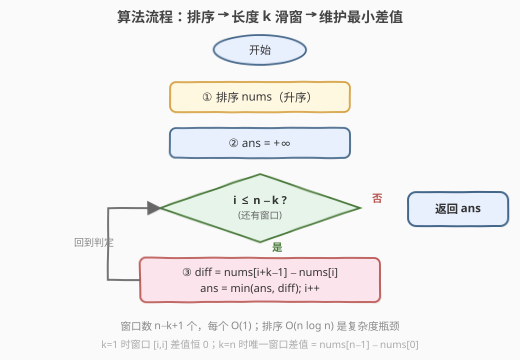

# LeetCode 学生分数的最小差值 题解

## 1. 题目概述

- **标题 / 题号**：学生分数的最小差值（#1984，easy）
- **链接**：https://leetcode.cn/problems/minimum-difference-between-highest-and-lowest-of-k-scores/
- **难度**：简单
- **标签**：数组、排序、滑动窗口

**题意**：给你一个 **下标从 0 开始** 的整数数组 `nums`，其中 `nums[i]` 表示第 `i` 名学生的分数。另给你一个整数 `k`。

从数组中选出任意 `k` 名学生的分数，使这 `k` 个分数间 **最高分** 和 **最低分** 的 **差值** 达到 **最小化**。返回可能的 **最小差值**。

**示例 1**：

```text
输入：nums = [90], k = 1
输出：0
解释：选出 1 名学生的分数，仅有 1 种方法：
- [90] 最高分和最低分之间的差值是 90 - 90 = 0
可能的最小差值是 0
```

**示例 2**：

```text
输入：nums = [9,4,1,7], k = 2
输出：2
解释：选出 2 名学生的分数，有 6 种方法：
- [9,4,1,7] 最高分和最低分之间的差值是 9 - 4 = 5
- [9,4,1,7] 最高分和最低分之间的差值是 9 - 1 = 8
- [9,4,1,7] 最高分和最低分之间的差值是 9 - 7 = 2
- [9,4,1,7] 最高分和最低分之间的差值是 4 - 1 = 3
- [9,4,1,7] 最高分和最低分之间的差值是 7 - 4 = 3
- [9,4,1,7] 最高分和最低分之间的差值是 7 - 1 = 6
可能的最小差值是 2
```

**约束**：

- $1 \le k \le \text{nums.length} \le 1000$
- $0 \le \text{nums}[i] \le 10^5$

> 💡 **审题关键**：① 选出的 `k` 个分数**不要求在原数组中相邻**，是任意子集；② 只关心这 `k` 个数的「最大值 − 最小值」，中间值不影响答案；③ `k = 1` 时最高分 = 最低分 = 自身，差值恒为 0（如示例 1）。

## 2. 解题思路

### 2.1 暴力思路：枚举所有 k 元子集

最直白的做法：枚举 `nums` 中所有大小为 `k` 的子集，每个子集求 `max − min`，取最小值。

- **正确性**：穷举所有可能，显然正确。
- **效率**：子集数 $\binom{n}{k}$，$n = 1000$、$k$ 取 $\approx n/2$ 时高达 $\binom{1000}{500} \approx 10^{299}$，完全不可行。

> ⚠️ 暴力的浪费在于「无视顺序」地乱选——它把选 `k` 个数当成无约束组合问题，而**答案只取决于所选子集的最大值与最小值**，中间的 $k-2$ 个数随意填充即可。这暗示存在更紧的结构。

### 2.2 核心观察：排序后最优子集必然连续



关键洞察分两步：

**第一步：答案只依赖端点。** 对于选定的 `k` 个分数，差值 = $\max - \min$，与中间 $k-2$ 个数无关。所以「选哪 `k` 个」可以简化为「选一个最小值 $L$ 和一个最大值 $R$，且 $R$ 与 $L$ 之间至少能塞下 $k-2$ 个数」。

**第二步：排序 + 连续窗口。** 把 `nums` 升序排序后，**最优的 `k` 个数必然是排序数组中一段连续的 `k` 个元素**。证明用交换论证：

- 设某个最优解选了 $a_{i_1} \le a_{i_2} \le \cdots \le a_{i_k}$（排序后下标 $i_1 < i_2 < \cdots < i_k$，但不一定连续）。
- 其差值为 $a_{i_k} - a_{i_1}$。考虑把「中间的 $k-2$ 个」全部收紧到 $[i_1, i_k]$ 内**紧贴端点的连续位置**：差值仍由 $a_{i_k} - a_{i_1}$ 决定，**不变**。
- 进一步，把端点也收紧：取连续窗口 $[i, i+k-1]$，则 $a_{i+k-1} - a_i \le a_{i_k} - a_{i_1}$（因为 $a_{i+k-1} \le a_{i_k}$ 且 $a_i \ge a_{i_1}$，只要窗口起点 $i$ 落在 $[i_1, i_k-k+1]$ 内）。

故**只需枚举所有长度为 `k` 的连续窗口**，取 $a_{i+k-1} - a_i$ 的最小值即可。

> 💡 **一句话**：排序让「端点最近」等价于「窗口最窄」——最优 `k` 元子集的端点必然贴在排序数组的一段连续 `k` 格上，于是 $O(n \log n)$ 排序 + $O(n)$ 一趟滑窗收工。

> ⚠️ **为什么不可能是非连续子集更优？** 假设非连续子集端点为 $a_{i_1}, a_{i_k}$，那么连续窗口 $[i_1, i_1+k-1]$ 的右端 $a_{i_1+k-1} \le a_{i_k}$（因为 $i_1 + k - 1 \le i_k$，排序后下标大的值不小），故窗口差值 $\le$ 非连续子集差值。所以连续窗口**永远不劣于**任何同端点的非连续选择。

### 2.3 算法流程图



整体步骤：

1. **排序**：对 `nums` 升序排序。
2. **初始化**：`ans = +∞`。
3. **滑窗扫描**：`i` 从 `0` 到 `n - k`，对每个窗口 `[i, i+k-1]`，计算 `diff = nums[i+k-1] - nums[i]`，更新 `ans = min(ans, diff)`。
4. **返回** `ans`。

> 💡 **边界**：`k = 1` 时窗口差值 `nums[i] - nums[i] = 0`，`ans = 0`，与示例 1 一致；`k = n` 时只有一个窗口，答案即 `nums[n-1] - nums[0]`。

### 2.4 示例演算

以**示例 2** `nums = [9,4,1,7]`、`k = 2` 演算：

![示例 2 演算：排序后 [1,4,7,9]，三个长度 2 窗口差值 3,3,2，最小为 2](../images/1984_example_walkthrough.svg)

| 步骤 | 排序后数组 | 窗口 `[i, i+1]` | 差值 `nums[i+1] - nums[i]` | `ans` |
|------|-----------|-----------------|--------------------------|-------|
| ① 排序 | `[1, 4, 7, 9]` | — | — | `+∞` |
| ② `i=0` | `[1, 4, 7, 9]` | `[1, 4]` | $4 - 1 = 3$ | `3` |
| ③ `i=1` | `[1, 4, 7, 9]` | `[4, 7]` | $7 - 4 = 3$ | `3` |
| ④ `i=2` | `[1, 4, 7, 9]` | `[7, 9]` | $9 - 7 = 2$ | `2` |

- 排序后只需考察 $n - k + 1 = 3$ 个窗口，而非 $\binom{4}{2} = 6$ 个子集。
- 最小差值为 `2`，对应窗口 `[7, 9]`，与暴力枚举 6 个子集的结果一致。

> 💡 **观察要点**：① 排序把「任意子集」压缩到「连续窗口」，候选数从 $\binom{n}{k}$ 降到 $n - k + 1$；② 每个窗口的差值就是「右端 − 左端」，中间元素无需关心；③ `k` 越大窗口越宽、差值越大；`k = 1` 时所有窗口差值为 0。

## 3. 参考代码

### C++（排序 + 一趟滑窗）

```cpp
class Solution {
public:
    int minimumDifference(vector<int>& nums, int k) {
        sort(nums.begin(), nums.end());
        int ans = INT_MAX;
        for (int i = 0; i + k <= (int)nums.size(); ++i) {
            ans = min(ans, nums[i + k - 1] - nums[i]);
        }
        return ans;
    }
};
```

### Python（排序 + 一趟滑窗）

```python
class Solution:
    def minimumDifference(self, nums: List[int], k: int) -> int:
        nums.sort()
        return min(nums[i + k - 1] - nums[i] for i in range(len(nums) - k + 1))
```

### 写法变体：显式滑窗（便于讲解）

```python
class Solution:
    def minimumDifference(self, nums: List[int], k: int) -> int:
        nums.sort()
        ans = float('inf')
        for i in range(len(nums) - k + 1):
            diff = nums[i + k - 1] - nums[i]
            if diff < ans:
                ans = diff
        return ans
```

> 💡 **代码要点**：① 排序是复杂度瓶颈 $O(n \log n)$，滑窗本身 $O(n)$；② 循环条件 `i + k <= n` 等价于 `i <= n - k`，即窗口右端 `i + k - 1` 不越界；③ `k = 1` 时 `nums[i] - nums[i] = 0`，`min` 自然得 0，无需特判。

## 4. 复杂度分析

| 维度 | 复杂度 | 说明 |
|------|--------|------|
| 时间复杂度 | $O(n \log n)$ | 排序 $O(n \log n)$；一趟滑窗 $O(n)$ 扫描 $n - k + 1$ 个窗口，每窗 $O(1)$ |
| 空间复杂度 | $O(\log n)$ | 排序所需调用栈 / 临时空间（C++ `std::sort` 为内省排序，Python `list.sort` 为 Timsort，均 $O(\log n)$ 辅助空间） |

> 💡 $n \le 1000$，$n \log n \approx 10^4$ 次操作，远在时限内。即便 $n$ 放大到 $10^5$，$O(n \log n)$ 仍从容——排序后滑窗是此类「最小化极差」问题的通用模板。

## 5. 扩展：为什么排序是这道题的「钥匙」？

### 5.1 极差问题的通用范式

凡是「选 `k` 个元素使 `max − min` 最小（或最大）」的问题，套路几乎一致：**排序 + 滑窗**。原因在于排序后：

- 极差 = 右端 − 左端，**只与窗口两端有关**；
- 任意非连续子集都能被端点更近的连续窗口替换，差值不增。

这把「排序」从可选优化变成**结构必需**——它把无序的组合搜索问题，规约为有序的区间最值问题。

### 5.2 与「最大化和」类问题的区别

注意区分两类相似但不同的题：

| 题型 | 目标 | 套路 |
|------|------|------|
| **最小化极差**（本题） | $\min(\max - \min)$ | 排序 + 最窄窗口 |
| **最大化和**（如 2144） | $\max(\sum \text{差值})$ | 排序 + DP / 贪心 |

本题是「最小化」方向，窗口越窄越好；而「最大化」方向则需要考虑更多结构。识别目标方向是套对模板的前提。

### 5.3 如果 k 很大怎么办？

当 $k$ 接近 $n$ 时，窗口数 $n - k + 1$ 很少（极端 $k = n$ 时只有 1 个窗口），算法反而更快。不存在「`k` 大导致超时」的情况——这是滑窗解法相对暴力枚举 $\binom{n}{k}$ 的另一优势：复杂度与 `k` 几乎无关（只影响窗口数，不改变 $O(n \log n)$ 量级）。

## 6. 面试要点

**Q1：为什么排序后最优子集必然是连续的 `k` 个？**

> 交换论证：设最优解选了排序后的下标 $i_1 < i_2 < \cdots < i_k$（可不连续），差值为 $a_{i_k} - a_{i_1}$。考虑连续窗口 $[i_1, i_1+k-1]$，因 $i_1+k-1 \le i_k$，有 $a_{i_1+k-1} \le a_{i_k}$，故窗口差值 $a_{i_1+k-1} - a_{i_1} \le a_{i_k} - a_{i_1}$。即「用连续窗口替换非连续子集，差值不增」，所以最优解可在连续窗口中取到。

**Q2：不排序直接双指针行不行？**

> 不行。双指针依赖「窗口右端 − 左端」就是极差，这只在数组有序时成立。未排序时，窗口内的最大 / 最小值不一定在两端，需要额外 $O(k)$ 求极值，整体退化为 $O(n \cdot k)$，且无法保证最优子集是连续窗口。**排序是结构必需，不是优化**。

**Q3：`k = 1` 为什么不需要特判？**

> `k = 1` 时窗口为 `[i, i]`，差值 `nums[i] - nums[i] = 0`，`min` 后 `ans = 0`，天然正确。循环条件 `i + k <= n` 即 `i + 1 <= n` 也合法（`i` 从 0 到 `n-1`）。代码对 `k = 1` 和 `k = n` 两个边界都自适应，无需分支。

**Q4：能不能用固定大小滑窗的「双指针模板」？**

> 可以，但没必要。固定大小 `k` 的滑窗通常用于「窗口内需维护聚合量（如最大值、和）」的场景，配合单调队列 / 前缀和把均摊代价压到 $O(1)$。本题窗口内只需「右端 − 左端」，$O(1)$ 直接取，无需双指针移动右端、收缩左端那套机制，一个 `for` 循环更清晰。

**Q5：排序用升序还是降序有区别吗？**

> 无本质区别。升序时差值 = `nums[i+k-1] - nums[i]`（右减左）；降序时差值 = `nums[i] - nums[i+k-1]`（左减右），结果相同。习惯上用升序，与「最小值在左、最大值在右」的直觉一致。

> 💡 **一句话总结**：极差最小化 = 排序 + 最窄 `k` 长窗口。排序把「任意子集」压缩到「连续窗口」，$O(n \log n)$ 排序 + $O(n)$ 一趟扫描收工——这是「选 k 个使极差最小」类问题的通用模板。

## 同类练习题

| # | 题目 | 与本题的关联 |
|---|------|-------------|
| 2144 | [打折购买糖果的最小花费](https://leetcode.cn/problems/minimum-cost-of-buying-candies-with-discount/) | 排序 + 贪心，相邻两送一的优惠结构同样依赖排序后的连续配对 |
| 561 | [数组拆分](https://leetcode.cn/problems/array-partition/) | 排序后两两配对取最小值求和，同为「排序让最优配对连续」的极差 / 配对型问题 |
| 719 | [找出第 K 小的数对距离](https://leetcode.cn/problems/find-k-th-smallest-pair-distance/)（[题解](../0701-0800/719_找出第K小的数对距离.md)） | 排序 + 双指针统计数对距离，本题的「数对距离」进阶版（求第 k 小而非最小） |
| 1509 | [三次操作后最大值与最小值的最小差值](https://leetcode.cn/problems/minimum-difference-between-largest-and-smallest-value-in-three-operations/) | 允许改 3 个元素后求极差最小，排序 + 枚举 4 种删除端点方案，本题「至多改 3 个」的进阶变体 |
| 2037 | [使每位学生都有座位的最少移动次数](https://leetcode.cn/problems/minimum-number-of-moves-to-seat-everyone/) | 排序后位置与学生对齐求移动和，同为「排序让最优配对连续」的简单题 |
