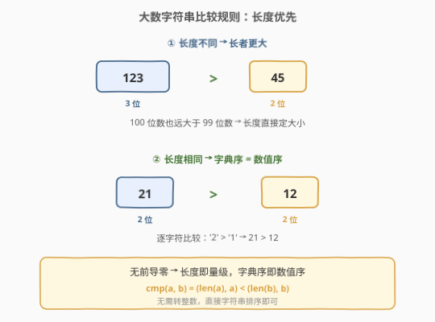
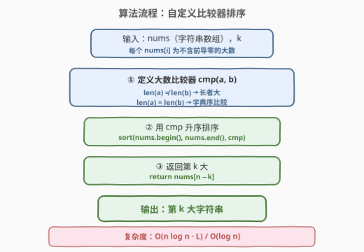

# LeetCode 找出数组中的第 K 大整数 题解

## 1. 题目概述

- **标题 / 题号**：找出数组中的第 K 大整数（#1985，medium）
- **链接**：https://leetcode.cn/problems/find-the-kth-largest-integer-in-the-array/
- **难度**：中等
- **标签**：字符串、排序、堆、快速选择

**题意**：给你一个字符串数组 `nums` 和一个整数 `k`。`nums` 中的每个字符串都表示一个**不含前导零**的整数。返回 `nums` 中表示第 $k$ 大整数的字符串。

> **注意**：重复的数字在统计时会视为不同元素考虑。例如 `nums = ["1","2","2"]`，`"2"` 是最大的，`"2"` 是第二大的，`"1"` 是第三大的。

**示例 1**：

```text
输入：nums = ["3","6","7","10"], k = 4
输出："3"
解释：按非递减顺序排列为 ["3","6","7","10"]，第 4 大整数是 "3"。
```

**示例 2**：

```text
输入：nums = ["2","21","12","1"], k = 3
输出："2"
解释：按非递减顺序排列为 ["1","2","12","21"]，第 3 大整数是 "2"。
```

**示例 3**：

```text
输入：nums = ["0","0"], k = 2
输出："0"
```

**约束**：

- $1 \le k \le \text{nums.length} \le 10^4$
- $1 \le \text{nums}[i].\text{length} \le 100$
- `nums[i]` 仅由数字组成
- `nums[i]` 不含任何前导零

> ⚠️ **关键信号**：`nums[i].length` 可达 $100$，意味着数字最多有 $10^{100}$ 量级——远超 64 位整数的表示范围（$\approx 9.2 \times 10^{18}$，约 19 位）。因此**不能简单地将字符串转为整数再排序**（C++/Java 会溢出）。必须直接在字符串上定义比较规则。

## 2. 解题思路

### 2.1 暴力思路：转整数后排序

最直觉的做法是把每个字符串转成整数，再用经典的 [215. 数组中的第K个最大元素](../0201-0300/215_数组中的第K个最大元素.md) 方法（排序或快速选择）求解。

> ⚠️ **致命问题**：`nums[i]` 最多 $100$ 位数字，数值可达 $10^{100}$，远超 `long long`（$\sim 9.2 \times 10^{18}$）的表示范围。C++/Java **没有内置大整数类型**，直接转换会溢出。Python 虽有任意精度整数，但将 $10^4$ 个 $100$ 位字符串逐一转 `int` 再排序，常数开销大且不通用。

核心矛盾：**我们需要比较大数，但不需要计算大数的具体值**。

### 2.2 核心观察：字符串本身就可以比较大小



题目保证 `nums[i]` **不含前导零**，这一条件是解题的钥匙。对于不含前导零的数字字符串，**长度直接决定量级**：

- **长度不同**：位数多的数一定更大。例如 `"123"`（3 位）$> $"45"`（2 位），因为最小的 3 位数 $100$ 也大于最大的 2 位数 $99$。推到极致：$100$ 位数 $\ge 10^{99}$，而 $99$ 位数 $\le 10^{99} - 1$，长度长者必大。
- **长度相同**：此时字典序（逐字符从左到右比较）与数值序**完全等价**。例如 `"21"` vs `"12"`：首位 `'2' > '1'`，故 $21 > 12$。这是因为等长数字字符串的逐位比较，本质上就是在比较对应位上的数值大小。

因此，我们可以定义一个**大数比较器**：

$$\text{cmp}(a, b) = \begin{cases} \text{len}(a) < \text{len}(b) & \text{若长度不同} \\ a < b \text{（字典序）} & \text{若长度相同} \end{cases}$$

等价于以元组 $(\text{len}(s),\; s)$ 作为排序键——先按长度升序，长度相同再按字典序升序。

> 💡 **为什么「无前导零」是前提？** 若允许前导零，`"012"` 和 `"12"` 表示同一个数 $12$，但长度不同（3 vs 2），按长度比较会得出 `"012" > "12"` 的错误结论。题目保证无前导零，使得**字符串长度 = 数值位数**，长度才能可靠地反映量级。

### 2.3 算法流程图



只需三步：① 定义大数比较器 `cmp`（长度优先，等长字典序）；② 用 `cmp` 对 `nums` 升序排序；③ 返回 `nums[n - k]`（升序排序后，倒数第 $k$ 个即第 $k$ 大）。时间 $O(n \log n \cdot L)$，空间 $O(\log n)$。

### 2.4 示例演算

![示例演算：nums=["2","21","12","1"], k=3](../images/1985_example_walkthrough.svg)

以示例 2 `nums = ["2","21","12","1"]`、`k = 3` 为例：

| 步骤 | 操作 | 结果 |
|------|------|------|
| 输入 | — | `["2", "21", "12", "1"]` |
| 按长度分组 | 长度 1：`"1"`, `"2"`；长度 2：`"12"`, `"21"` | — |
| 组内字典序 | 长度 1 → `"1" < "2"`；长度 2 → `"12" < "21"` | — |
| 合并排序 | 短的在前，同长按字典序 | `["1", "2", "12", "21"]` |
| 取第 $k$ 大 | $n = 4$, $k = 3$ → `nums[n - k] = nums[1]` | **`"2"`** |

最终答案 = **`"2"`**。

> 💡 **验证**：排序后 `["1", "2", "12", "21"]` 中，第 1 大 = `"21"`，第 2 大 = `"12"`，第 3 大 = `"2"`，与题目解释一致。注意 `"2"`（数值 2）$> $"12"`（数值 12）是**错误**的——这里第 3 大是 `"2"` 恰好因为 `"12"` 和 `"21"` 比它更大，排序后 `"2"` 排在倒数第 3 位。

## 3. 参考代码

### 方法一：排序 + 自定义比较器（推荐）

### C++

```cpp
class Solution {
public:
    string kthLargestNumber(vector<string>& nums, int k) {
        auto cmp = [](const string& a, const string& b) {
            if (a.size() != b.size()) return a.size() < b.size();
            return a < b;
        };
        sort(nums.begin(), nums.end(), cmp);
        return nums[nums.size() - k];
    }
};
```

### Python

```python
class Solution:
    def kthLargestNumber(self, nums: List[str], k: int) -> str:
        nums.sort(key=lambda s: (len(s), s))
        return nums[-k]
```

> 💡 **实现细节**：
> - **C++ 比较器**：先比 `a.size()` 与 `b.size()`（$O(1)$），不等则直接定序；等长才走 `a < b`（字典序，最坏 $O(L)$）。大多数比较在长度判断阶段即可决出，常数很小。
> - **Python 排序键**：`key=lambda s: (len(s), s)` 以元组为键，Python 元组逐元素比较天然实现「长度优先，等长字典序」——比 C++ 的 `cmp` 函数更简洁，且 Timsort 对已部分有序的输入有自适应优化。
> - **返回 `nums[-k]`**：升序排序后，倒数第 $k$ 个就是第 $k$ 大。Python 负索引 `nums[-k]` 等价于 `nums[n - k]`。
> - **稳定性**：题目要求重复数字视为不同元素，排序的稳定性不影响结果（相同值的字符串谁先谁后都算同一个排名档位）。

### 方法二：小顶堆维护 k 个最大元素

当 $k \ll n$ 时，维护大小为 $k$ 的小顶堆比全排序更优。

### Python

```python
import heapq

class Solution:
    def kthLargestNumber(self, nums: List[str], k: int) -> str:
        heap = []
        for num in nums:
            heapq.heappush(heap, (len(num), num))
            if len(heap) > k:
                heapq.heappop(heap)
        return heap[0][1]
```

### C++

```cpp
class Solution {
public:
    string kthLargestNumber(vector<string>& nums, int k) {
        auto cmp = [](const string& a, const string& b) {
            if (a.size() != b.size()) return a.size() < b.size();
            return a < b;
        };
        priority_queue<string, vector<string>, decltype(cmp)> pq(cmp);
        for (const string& num : nums) {
            pq.push(num);
            if ((int)pq.size() > k) pq.pop();
        }
        return pq.top();
    }
};
```

> 💡 **堆的方向**：小顶堆的堆顶是当前 $k$ 个元素中的**最小值**，即第 $k$ 大。新元素入堆后若大小超过 $k$，弹出堆顶（最小值），始终保持堆中是已见过的最大的 $k$ 个数。C++ 的 `priority_queue` 默认大顶堆，需传入比较器 `cmp` 使其行为等价于小顶堆（`cmp` 判定 `a` 优先级低于 `b` 时 `a` 在堆顶方向）。
>
> ⚠️ **C++ 堆比较器方向**：`priority_queue` 的第三个参数 `Compare` 中，`cmp(a, b)` 返回 `true` 表示 `a` 的优先级**低于** `b`（`b` 先出队）。要模拟小顶堆，`cmp` 应定义为「小于」关系，这样最小的元素优先级最低、排在堆顶。这里复用排序时的同一个 `cmp`（`a < b` 语义），恰好使堆顶为最小元素。

## 4. 复杂度分析

| 维度 | 方法一（排序） | 方法二（堆） | 说明 |
|------|---------------|-------------|------|
| 时间复杂度 | $O(n \log n \cdot L)$ | $O(n \log k \cdot L)$ | $L$ 为单次比较的字符串长度上限（$100$）；排序 $n \log n$ 次比较，堆 $n \log k$ 次 |
| 空间复杂度 | $O(\log n)$ | $O(k)$ | 排序递归栈 vs 堆存储 $k$ 个字符串 |

> 💡 **$L$ 的实际影响**：虽然单次比较最坏 $O(L)$，但由于比较器先判长度（$O(1)$），只有等长时才走字典序。实际运行中绝大多数比较在长度阶段就决出，常数远小于理论最坏值。$n = 10^4$、$L = 100$ 时，排序约 $10^4 \times 14 \times 100 \approx 1.4 \times 10^7$ 次字符比较，毫秒级完成。
>
> ⚠️ **$k$ 的选择**：当 $k$ 接近 $n$ 时，堆方法退化为 $O(n \log n)$，与排序相同但常数更大；当 $k \ll n$（如 $k = 1$）时，堆方法 $O(n)$ 明显优于排序。面试中若无 $k$ 的额外信息，**排序法作为默认方案**最简洁可靠。

## 5. 扩展：快速选择与 215 的对照

### 5.1 快速选择法

[215. 数组中的第K个最大元素](../0201-0300/215_数组中的第K个最大元素.md) 的经典解法之一是**快速选择**（Quickselect），平均 $O(n)$、最坏 $O(n^2)$。本题同样适用——只需将分区时的比较改为大数比较器：

```python
import random

class Solution:
    def kthLargestNumber(self, nums: List[str], k: int) -> str:
        n = len(nums)
        target = n - k  # 升序排序后第 k 大的下标

        def less(a, b):
            if len(a) != len(b):
                return len(a) < len(b)
            return a < b

        def quickselect(lo, hi):
            if lo == hi:
                return nums[lo]
            pivot = nums[random.randint(lo, hi)]
            lt, gt = lo, hi
            i = lo
            while i <= gt:
                if less(nums[i], pivot):
                    nums[lt], nums[i] = nums[i], nums[lt]
                    lt += 1
                    i += 1
                elif less(pivot, nums[i]):
                    nums[gt], nums[i] = nums[i], nums[gt]
                    gt -= 1
                else:
                    i += 1
            if target < lt:
                return quickselect(lo, lt - 1)
            elif target > gt:
                return quickselect(gt + 1, hi)
            else:
                return nums[target]

        return quickselect(0, n - 1)
```

> ⚠️ 快速选择最坏 $O(n^2)$，需随机化 pivot 规避。面试中除非被要求 $O(n)$ 平均复杂度，否则排序法更简洁、无最坏情况风险。C++ 也可用 `std::nth_element` 配合自定义比较器一行解决。

### 5.2 与 215 的对照

| 维度 | [215. 第K个最大元素](../0201-0300/215_数组中的第K个最大元素.md) | **1985. 第 K 大整数** |
|------|------|------|
| 数据类型 | `int`（32 位整数） | 字符串（最多 100 位大数） |
| 比较方式 | 直接 `<` / `>` | 自定义比较器（长度优先 + 字典序） |
| 算法选择 | 排序 / 快速选择 / 堆 | 同左，仅比较器不同 |
| 核心难点 | 快速选择的随机化 | 大数比较的正确性 |

> 💡 **一句话总结**：1985 是 215 的**大数字符串版**——算法骨架完全一致（排序取第 $k$ 大），唯一的考点在于「如何在不转整数的前提下正确比较两个大数字符串」。无前导零保证了「长度即量级」，使字符串比较等价于数值比较。

### 5.3 Python 的 `int()` 可行吗？

Python 的整数是任意精度的，`int("123...100位...")` 不会溢出。因此 `nums.sort(key=int)` 在 Python 中**确实能 AC**。但这并非题目的本意：

- **不通用**：C++/Java 无内置大整数，此方法不可移植。
- **效率低**：将 $10^4$ 个 $100$ 位字符串转为整数，每个转换 $O(L)$，总计 $O(nL)$ 的额外开销。
- **掩盖考点**：面试官出此题正是考察「字符串比较」的思路，直接 `int()` 相当于回避了核心问题。

面试中可主动提及「Python 可以直接 `key=int`，但题目限制 100 位是为了考察字符串比较」，展示对考点本质的理解。

## 6. 面试要点

**Q1：为什么不能直接把字符串转成 `long long` 再排序？**

> `nums[i]` 最多 $100$ 位数字，数值可达 $10^{100}$，而 `long long` 最大约 $9.2 \times 10^{18}$（19 位）。100 位数字远超 64 位整数范围，转换必然溢出。C++/Java 没有内置大整数类型，必须直接在字符串上定义比较规则。

**Q2：为什么字符串的字典序等于数值序？需要什么前提？**

> 前提是**无前导零**。无前导零时，数字字符串的长度等于数值的位数，因此：① 长度不同 → 位数多者更大（最小的 $n+1$ 位数 $10^n$ 大于最大的 $n$ 位数 $10^n - 1$）；② 长度相同 → 逐字符从左到右比较就是逐位比较数值大小，字典序与数值序完全一致。若有前导零（如 `"012"` vs `"12"`），长度不再等于有效位数，此等价关系破坏。

**Q3：排序法和小顶堆法各适合什么场景？**

> 排序法 $O(n \log n)$ 适合 $k$ 与 $n$ 同量级或不确定 $k$ 大小的场景，写法最简洁。小顶堆 $O(n \log k)$ 适合 $k \ll n$（如 $k = 1$ 求最大值时退化为 $O(n)$）。若问题变为**数据流**中动态维护第 $k$ 大（如 [703. 数据流中的第K大元素](../0701-0800/703_数据流中的第K大元素.md)），则必须用堆，因为排序无法高效应对增量数据。

**Q4：本题和 215（第K个最大元素）有什么区别？**

> 算法骨架完全相同（排序/快速选择/堆取第 $k$ 大），区别仅在数据类型：215 是 `int` 直接比较，1985 是大数字符串需自定义比较器。1985 的考点是「将数值比较转化为字符串比较」的思路——利用无前导零保证长度即量级，从而用 $(\text{len}, \text{字典序})$ 的元组比较代替数值比较。

**Q5：如果允许前导零，该怎么做？**

> 需要先去除前导零（`strip('0')` 或从左找第一个非零位），再按 $(\text{len}, \text{字典序})$ 比较。注意全零字符串 `"000"` 应归一化为 `"0"`（长度 1）。本质上仍是「有效位数 + 字典序」，只是多一步预处理。

> 💡 **一句话总结**：大数字符串的第 $k$ 大 → 自定义比较器（长度优先 + 等长字典序）排序，取 `nums[n - k]`。无前导零是关键前提，使字符串比较等价于数值比较，无需转整数。$k \ll n$ 时可用小顶堆优化到 $O(n \log k)$。

## 同类练习题

| # | 题目 | 与本题的关联 |
|---|------|-------------|
| 215 | [数组中的第K个最大元素](https://leetcode.cn/problems/kth-largest-element-in-an-array/)（[站内题解](../0201-0300/215_数组中的第K个最大元素.md)） | 第 $k$ 大的整数版母题，算法骨架完全一致，仅数据类型为 `int`——对比可体会「比较器」是本题唯一新增考点 |
| 703 | [数据流中的第K大元素](https://leetcode.cn/problems/kth-largest-element-in-a-stream/)（[站内题解](../0701-0800/703_数据流中的第K大元素.md)） | 动态数据流中维护第 $k$ 大，必须用小顶堆——本题方法二的延伸场景 |
| 378 | [有序矩阵中第K小的元素](https://leetcode.cn/problems/kth-smallest-element-in-a-sorted-matrix/)（[站内题解](../0301-0400/378_有序矩阵中第K小的元素.md)） | 第 $k$ 小的变体，二分值域 + 计数 / 小顶堆 k 路归并——另一类「第 $k$ 大/小」的经典范式 |
| 179 | [最大数](https://leetcode.cn/problems/largest-number/)（[站内题解](../0101-0200/179_最大数.md)） | 字符串排序自定义比较器的另一经典题，比较规则为 `a+b` vs `b+a`——对比可体会「不同比较规则服务于不同目标」 |
| 23 | [合并K个升序链表](https://leetcode.cn/problems/merge-k-sorted-lists/) | 小顶堆维护 $k$ 路归并的典型应用，与本题方法二共享「堆维护 top-k」的骨架 |
