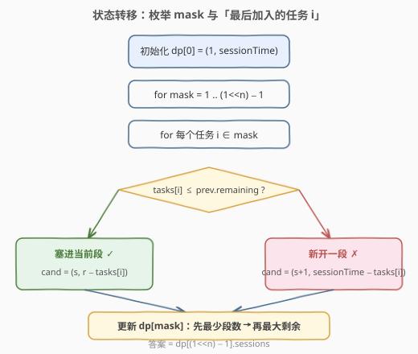
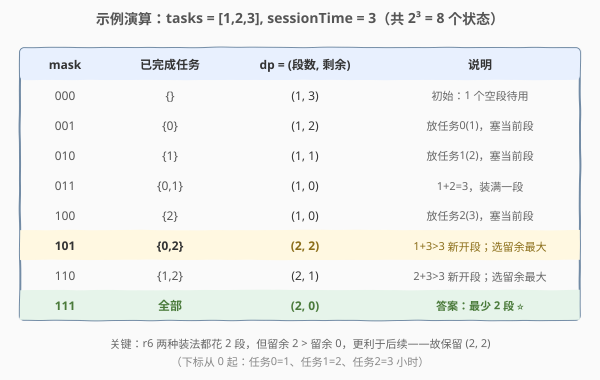

# 完成任务的最少工作时间段

- **题目名称**：完成任务的最少工作时间段
- **链接**：[1986. 完成任务的最少工作时间段](https://leetcode.cn/problems/minimum-number-of-work-sessions-to-finish-the-tasks/)
- **难度**：中等
- **标签**：位运算、动态规划、状态压缩、贪心

## 1. 题目概述

给定 `n` 个任务，第 `i` 个任务需要 `tasks[i]` 小时。一个**工作时间段**中至多连续工作 `sessionTime` 小时。要求：

- 一个任务必须在其所在时间段内完成（**不能拆分**到多个时间段）；
- 完成一个任务后可立即开始下一个；
- 可按**任意顺序**完成任务。

返回完成所有任务所需的**最少**时间段数。数据保证 `sessionTime ≥ max(tasks)`，即任何单个任务都能放进一个时间段。

**示例 1**：

```text
输入：tasks = [1,2,3], sessionTime = 3
输出：2
解释：
  第 1 段：任务 0 + 任务 1 = 1 + 2 = 3 小时（装满）
  第 2 段：任务 2 = 3 小时
```

**示例 2**：

```text
输入：tasks = [3,1,3,1,1], sessionTime = 8
输出：2
解释：
  第 1 段：3 + 1 + 3 + 1 = 8 小时（装满）
  第 2 段：1 小时
```

**示例 3**：

```text
输入：tasks = [1,2,3,4,5], sessionTime = 15
输出：1
解释：总和 15 ≤ 15，一个时间段即可。
```

**约束条件**：

- `n == tasks.length`
- `1 <= n <= 14`
- `1 <= tasks[i] <= 10`
- `max(tasks[i]) <= sessionTime <= 15`

> ⚠️ **关键信号**：`n ≤ 14` 是**状压 DP（bitmask DP）**的标志范围——$2^{14}=16384$ 个状态，恰好落在「可以枚举所有子集」的甜区。本题本质是「把任务划分成若干和不超过 `sessionTime` 的子集，最小化子集数」，是经典的**装箱 / 子集划分**问题（NP-hard），但 `n` 小可用状压 DP 精确求解。

---

## 2. 解题思路

### 2.1 暴力思路

把 `n` 个任务按某种顺序排好，然后**贪心装箱**：顺序扫过去，能塞进当前段就塞，塞不下就新开一段。对固定顺序，贪心装箱是 $O(n)$ 的。

问题在于：**不同顺序得到不同的装箱结果**，且贪心「塞得下就塞」对固定顺序**未必最优**（它是装箱问题的经典近似策略，最坏比 $\frac{11}{9}$）。要保证最优，必须考虑所有顺序。暴力枚举全排列 $n!$，`14! ≈ 8.7×10^10`，不可行。

换一个视角：最终方案是把任务**划分**成若干组（每组一段），每组之和 `≤ sessionTime`，求最少组数。这等价于：选一个任务子集作为「第 1 段」（和 `≤ sessionTime`），剩下的子问题求最少段数——**最优子结构**出现，可状压 DP。

### 2.2 核心观察：位掩码记录「已完成任务集合」+ 维护当前段的剩余容量

按某个顺序逐个「完成」任务时，任意中间状态只需关心两件事：

1. **哪些任务已经做完了**（决定还剩哪些任务）；
2. **当前正在用的那个时间段还剩多少容量**（决定下个任务能否塞进来）。

已关闭的历史时间段不再影响未来——只有「当前打开的那一段」的剩余容量才有意义。于是用一个 `n` 位二进制数 `mask` 编码「已完成任务集合」，再附带两个标量即可完整刻画状态。

![状态设计：dp[mask] = (最少段数, 当前段最大剩余容量)](../images/work_sessions_state.svg)

定义：

$$dp[\text{mask}] = (\text{sessions},\ \text{remaining})$$

- `sessions`：完成 `mask` 所表示的任务集合，所用的**最少**时间段数；
- `remaining`：在取到该最少段数的前提下，**当前（最后一个）打开时间段**的**最大**剩余容量。

> 💡 **为什么 `remaining` 要取「最大」？** 这是本题的关键贪心决策。在**段数相同**的情况下，当前段剩余容量越大，越能容纳后续任务——后续任务要么塞进当前段（不增段数），要么新开段（增段数）。剩余越大，「塞得下」的概率越高，**绝不会更差**。这是一种**支配关系**：`(s, r₁)` 在 `r₁ ≥ r₂` 时支配 `(s, r₂)`，被支配的状态可直接丢弃。保留最大 `remaining` 是安全的。

### 2.3 状态转移

对每个 `mask`，枚举**最后加入的那个任务** `i`（即 `mask` 的第 `i` 位为 1）。其前驱状态为 `mask ^ (1 << i)`，记其 `dp` 值为 `(s, r)`。现在要把任务 `i`（时长 `tasks[i]`）放进当前打开的段：

- **若 `tasks[i] ≤ r`**：塞进当前段，不增段数 → 候选 $(s,\ r - \text{tasks}[i])$；
- **若 `tasks[i] > r`**：当前段装不下，**关闭它并新开一段**装这个任务 → 候选 $(s+1,\ \text{sessionTime} - \text{tasks}[i])$。

在所有候选中，按「**先最小化 `sessions`，再最大化 `remaining`**」取最优，赋给 `dp[mask]`。



- **初始**：`dp[0] = (1, sessionTime)`——空集视为「已开 1 个满容量段待用」。这样第一个任务塞进去时 `sessions` 仍为 1，计数自然。
- **答案**：`dp[(1 << n) - 1].sessions`——所有任务完成时的最少段数。

> ⚠️ **`dp[0]` 为什么是 `(1, sessionTime)` 而不是 `(0, 0)`？** 因为我们把「当前打开的段」算作已使用。空集时已预备好一个满容量段，所以 `sessions = 1`；它并非「已消耗」，只是「待用」。若写成 `(0, 0)`，第一个任务会因 `tasks[i] > 0` 误走「新开段」分支凑成 `(1, ...)`——结果恰好也对，但语义上「当前段剩余 0」表示无可用段，与「有一个满段待用」不同。统一用 `(1, sessionTime)` 语义更清晰。

### 2.4 示例演算

取 `tasks = [1,2,3], sessionTime = 3`，共 $2^3 = 8$ 个状态。下标从 0 起：任务 0 时长 1、任务 1 时长 2、任务 2 时长 3。



聚焦最关键的状态 `mask = 101`（任务 0、2 完成，即时长 1 和 3）：

- 从 `001`（任务 0 完成，`(1, 2)`）加任务 2（时长 3）：`3 > 2` → 新开段 → `(2, 3−3) = (2, 0)`；
- 从 `100`（任务 2 完成，`(1, 0)`）加任务 0（时长 1）：`1 > 0` → 新开段 → `(2, 3−1) = (2, 2)`。

两种装法都花 **2 段**，但后者当前段留余 2、前者留余 0。按「最大剩余」保留 `(2, 2)`——这 2 小时余量在 `mask = 111` 时让任务 1（时长 2）能直接塞进去而不开第 3 段。最终 `dp[111] = (2, 0)`，答案 **2**，与示例一致。

---

## 3. 参考代码

### Python

```python
class Solution:
    def minSessions(self, tasks: List[int], sessionTime: int) -> int:
        n = len(tasks)
        dp = [(float('inf'), 0)] * (1 << n)
        dp[0] = (1, sessionTime)                       # 空集 = 1 个满段待用
        for mask in range(1, 1 << n):
            best = (float('inf'), 0)
            for i in range(n):
                if not (mask >> i & 1):
                    continue
                s, r = dp[mask ^ (1 << i)]             # 前驱：去掉任务 i
                if tasks[i] <= r:                      # 塞进当前段
                    cand = (s, r - tasks[i])
                else:                                  # 装不下，新开一段
                    cand = (s + 1, sessionTime - tasks[i])
                # 先最少段数，再最大剩余
                if cand[0] < best[0] or (cand[0] == best[0] and cand[1] > best[1]):
                    best = cand
            dp[mask] = best
        return dp[(1 << n) - 1][0]
```

### C++

```cpp
class Solution {
  public:
    int minSessions(vector<int>& tasks, int sessionTime) {
        int n = tasks.size();
        const int INF = 1e9;
        // dp[mask] = {sessions, remaining}：最少段数 & 该段数下当前段最大剩余
        vector<pair<int,int>> dp(1 << n, {INF, 0});
        dp[0] = {1, sessionTime};                      // 空集 = 1 个满段待用
        for (int mask = 1; mask < (1 << n); ++mask) {
            for (int i = 0; i < n; ++i) {
                if (!(mask >> i & 1)) continue;
                auto [s, r] = dp[mask ^ (1 << i)];     // 前驱：去掉任务 i
                int ns, nr;
                if (tasks[i] <= r) {                   // 塞进当前段
                    ns = s;
                    nr = r - tasks[i];
                } else {                               // 装不下，新开一段
                    ns = s + 1;
                    nr = sessionTime - tasks[i];
                }
                if (ns < dp[mask].first ||
                    (ns == dp[mask].first && nr > dp[mask].second))
                    dp[mask] = {ns, nr};
            }
        }
        return dp[(1 << n) - 1].first;
    }
};
```

> 💡 **小技巧**：若把 `remaining` 存成其相反数 `−remaining`，则「最小化 `sessions`、最大化 `remaining`」就等价于对 `(sessions, −remaining)` 做**字典序最小**——可直接用 `pair` 的默认 `min` 比较，省去自定义判断。本解显式写出比较是为了逻辑清晰。

---

## 4. 复杂度分析

| 维度 | 复杂度 | 说明 |
|------|--------|------|
| 时间复杂度 | $O(n \cdot 2^n)$ | 共 $2^n$ 个状态，每个状态枚举 $n$ 个任务作为「最后加入者」 |
| 空间复杂度 | $O(2^n)$ | `dp` 数组大小为 $2^n$，每项存一对整数 |

$n=14$ 时约 $14 \times 16384 \approx 2.3 \times 10^5$ 次操作，毫秒级完成。转移为「拉」式（由前驱推出当前），无递归栈，常数极小。

---

## 5. 扩展：二分答案 + 回溯剪枝

换个角度：答案 `k`（段数）具有**单调性**——段越多越容易装下。于是可**二分 `k`**，用回溯判定「能否把所有任务装进 `k` 个容量为 `sessionTime` 的桶」。判定函数是经典的**装箱回溯**：

- 任务**降序排序**（大件先放，早期触发剪枝）；
- 逐个任务尝试放入每个能装下的桶；
- **关键剪枝**：用 `tried` 集合记录本轮已试过的「桶剩余容量」，相同剩余只试一次——彻底消除桶之间的对称性。

```python
class Solution:
    def minSessions(self, tasks: List[int], sessionTime: int) -> int:
        tasks.sort(reverse=True)                       # 大件先放，利于剪枝
        n = len(tasks)

        def can(k: int) -> bool:
            bins = [0] * k                             # 各桶已用容量
            def dfs(i: int) -> bool:
                if i == n:
                    return True
                tried = set()                          # 本层已试过的剩余容量
                for j in range(k):
                    if bins[j] + tasks[i] > sessionTime:
                        continue
                    if bins[j] in tried:               # 相同剩余只试一次
                        continue
                    tried.add(bins[j])
                    bins[j] += tasks[i]
                    if dfs(i + 1):
                        return True
                    bins[j] -= tasks[i]
                return False
            return dfs(0)

        lo = (sum(tasks) + sessionTime - 1) // sessionTime   # 总和下界
        hi = n                                                # 每任务一段必可行
        while lo < hi:
            mid = (lo + hi) // 2
            if can(mid):
                hi = mid
            else:
                lo = mid + 1
        return lo
```

两种方法对比：

| 方法 | 时间复杂度 | 特点 |
|------|-----------|------|
| 状压 DP | $O(n \cdot 2^n)$ | 稳定（对 $2^n$ 多项式级），无剪枝依赖，**推荐** |
| 二分 + 回溯 | 最坏指数，剪枝后实际很快 | 思路直白（装箱 + 二分），可推广到 `n` 更大但答案 `k` 很小的场景 |

> 💡 **与 698 的关系**：判定函数与 [698. 划分为 K 个相等的子集](https://leetcode.cn/problems/partition-to-k-equal-sum-subsets/) 的回溯写法几乎一致——698 是「`k` 个和**恰好**等于 `target` 的子集」，本题是「`k` 个和**不超过** `sessionTime` 的子集」，把「相等」放宽为「上界」即可。

---

## 6. 面试要点

1. **`n ≤ 14` 为什么提示状压 DP？**
   - $2^{14}=16384$，状态空间可承受。一般 `n ≤ 20` 的「选/不选」计数/最值/划分问题都应首选状压 DP，这是识别该套路的经验阈值。

2. **状态为什么记 `(sessions, remaining)` 两个量，而不只是 `sessions`？**
   - 只记最少段数会丢失「当前段还能装多少」的信息，无法判断下一个任务能否塞进当前段。`remaining` 把当前打开段的容量带进状态，转移才完备。

3. **为什么 `remaining` 取「最大」而不是「最小」或任意一个？**
   - 段数相同时，剩余容量越大越能容纳后续任务，存在**支配关系**（`(s, r₁)` 在 `r₁ ≥ r₂` 时支配 `(s, r₂)`）。保留最大 `remaining` 不丢最优解，同时把状态压缩成单一最优对。

4. **`dp[0] = (1, sessionTime)` 的「1」会不会多算一段？**
   - 不会。它表示「预备好一个满容量段待用」，并非已消耗。第一个任务塞进去后 `sessions` 仍为 1，只有装不下新开段时才 `+1`。最终答案对非空任务集至少为 1，计数自洽。

5. **贪心「塞得下就塞」在固定顺序下不最优，状压 DP 如何修复？**
   - 状压 DP 不依赖单一顺序——它枚举所有「最后加入的任务」，等价于考虑所有排列的装箱结果并对每个子集保留最优，从而克服了固定顺序贪心的短视。

---

## 7. 同类练习题

- [698. 划分为 K 个相等的子集](https://leetcode.cn/problems/partition-to-k-equal-sum-subsets/)（[站内题解](../0601-0700/698_划分为K个相等的子集.md)）：把数组分成 `k` 个和相等的子集，回溯/状压母题，判定函数与本题扩展方法同构
- [1655. 分配重复整数](https://leetcode.cn/problems/distribute-repeating-integers/)：`mask` 表示已分配的需求子集，状压 DP 判定可行性，状态设计与本题同源
- [691. 贴纸拼词](https://leetcode.cn/problems/stickers-to-spell-word/)：`mask` 表示已拼出字符子集，求最少贴纸数——最值型状压 DP，承接本题
- [1799. N 次操作后的最大分数](https://leetcode.cn/problems/maximize-score-after-n-operations/)：`mask` 表示剩余可用数字，成对取数求最大得分，状态设计思路一致
- [526. 优美的排列](https://leetcode.cn/problems/beautiful-arrangement/)（[站内题解](../0501-0600/526_优美的排列.md)）：`n ≤ 15` 计数型状压 DP，对比可体会「`mask` 编码已选集合」的通用范式
