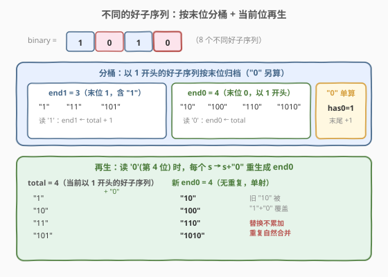
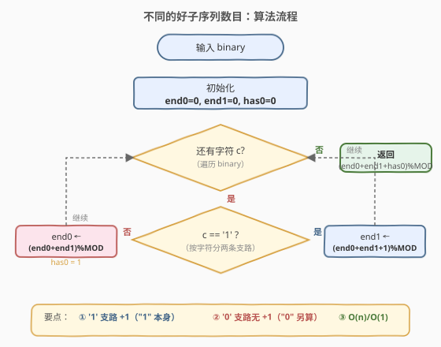
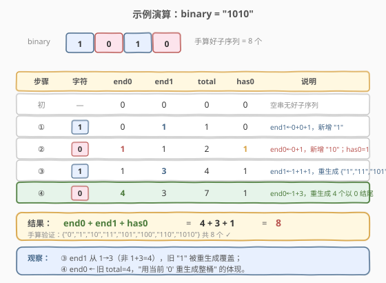

# 不同的好子序列数目

- **题目名称**：不同的好子序列数目
- **链接**：[1987. 不同的好子序列数目](https://leetcode.cn/problems/number-of-unique-good-subsequences/)
- **难度**：困难
- **标签**：字符串、动态规划、去重计数

## 1. 题目概述

给你一个二进制字符串 `binary`。`binary` 的一个**子序列**如果是**非空**的且没有**前导 0**（除非数字是 `"0"` 本身），那么它就是一个**好**的子序列。请你找到 `binary` **不同好子序列**的数目。由于答案可能很大，将它对 $10^9 + 7$ 取余后返回。

子序列指从原数组中删除若干个（可以一个也不删除）元素后，不改变剩余元素顺序得到的序列。

**示例 1**：

```text
输入：binary = "001"
输出：2
解释：好子序列为 ["0","0","1"]，不同好子序列为 "0" 和 "1"。
注意 "00"、"01"、"001" 都有前导 0，不是好的。
```

**示例 2**：

```text
输入：binary = "11"
输出：2
解释：好子序列为 ["1","1","11"]，不同好子序列为 "1" 和 "11"。
```

**示例 3**：

```text
输入：binary = "101"
输出：5
解释：不同好子序列为 "0"、"1"、"10"、"11"、"101"。
```

**约束条件**：

- $1 \le \text{binary.length} \le 10^5$
- `binary` 只含有 `'0'` 和 `'1'`。

> 💡 **审题关键**：① 子序列（可不连续）不是子串，$n = 10^5$ 时总数可达 $2^{10^5}$，枚举不可行；② "好"=无前导零或本身即 `"0"`，等价于「以 1 开头」或「恰为 `"0"`」；③ 要的是**不同**子序列数目，难点全在去重。

---

## 2. 解题思路

### 2.1 暴力思路：枚举 + 去重

最直白：枚举全部 $2^n - 1$ 个非空子序列，过滤"好"的，丢进哈希集合去重。

- **正确性**：穷举 + 集合去重，显然正确。
- **效率**：生成 $O(2^n \cdot n)$ + 哈希 $O(n)$。$n = 10^5$ 时 $2^n$ 是天文数字，完全不可行。

> ⚠️ 暴力的浪费在于「按子序列枚举、把去重推迟到生成之后」。而子序列的**生成过程**本身有递推结构——每个字符"取/不取"两分支，相同字符在不同位置取会产生重复。把去重做进递推，就是 DP。

### 2.2 核心观察：按末位字符分桶 + 当前位再生



把好子序列分两类（`"0"` 单独处理）：

- **以 1 开头、末位为 0** 的好子序列集合，大小记 `end0`；
- **以 1 开头、末位为 1** 的好子序列集合（含 `"1"` 本身），大小记 `end1`。

> 💡 `"0"` 本身也是好子序列，但它不能作前缀接别的字符（接上变成 `"00"`/`"01"`，有前导 0）。所以把 `"0"` 从 DP 状态里摘出去，最后看串里有没有 `'0'`，有就 `+1`。

**关键定理**：处理到位置 $i$（字符 $c$）时，**所有以 $c$ 结尾的好子序列**恰等于

$$\{\, s + c \mid s \text{ 是 } binary[0..i{-}1] \text{ 的、以 1 开头的好子序列}\,\} \;\cup\; \begin{cases}\{\text{"1"}\}, & c = \text{'1'} \\ \varnothing, & c = \text{'0'}\end{cases}$$

成立的三条理由：

- **每个 $s + c$ 都是好子序列**：$s$ 以 1 开头，故 $s + c$ 以 1 开头，无前导 0；
- **每个以 $c$ 结尾的好子序列 $t$ 都能写成 $s + c$**：若 $t = \text{"1"}$，对应 $c = \text{'1'}$ 的特例；否则 $t$ 长度 $\ge 2$，去掉末位 $c$ 得 $s$，$s$ 以 1 开头、非空，是 $binary[0..i{-}1]$ 的好子序列（$t$ 的末位 $c$ 可"挪"到当前第 $i$ 位，因为 $binary[i] = c$，前缀部分仍是 $binary[0..i{-}1]$ 的子序列）；
- **映射 $s \mapsto s + c$ 单射**，新桶内无重复。

由此得 $O(1)$ 转移（记 `total = end0 + end1` 为当前以 1 开头的好子序列总数）：

| 当前字符 $c$ | `end0` 更新 | `end1` 更新 | 说明 |
|------|-----------|-----------|------|
| `'1'` | 不变 | `end1 ← total + 1` | 用当前 '1' 重生成全部以 1 结尾的好子序列：`total` 个 $s+\text{'1'}$ 加 `"1"` 本身 |
| `'0'` | `end0 ← total` | 不变 | 用当前 '0' 重生成全部以 0 结尾、以 1 开头的好子序列：`total` 个 $s+\text{'0'}$；`"0"` 另算 |

> ⚠️ **为什么是"替换"不是"累加"**：每次用当前位 $c$ 重新生成"以 $c$ 结尾"的整桶，旧 `end[c]` 被覆盖。但旧桶里每个字符串 $t = s + c$ 都能被新桶覆盖（把末位 $c$ 挪到当前位即可），故总数不丢——这就是去重：**重复字符串在"重新生成"时自然合并**，无需显式减去"上一次出现"。

> 💡 对比 [940. 不同的子序列 II](https://leetcode.cn/problems/distinct-subsequences-ii/) 的通用公式 $dp \gets 2 \cdot dp - last[c]$：那是对**整个字符表**统一转移。本题字符表只有 {0,1} 且"好"约束砍掉 '0' 开头支路，化简成 `end0/end1` 两状态，省去 `last` 数组——是 940 在二进制好子序列场景下的**精简特例**。

### 2.3 算法流程图



整体步骤：

1. **初始化**：`end0 = end1 = 0`，`has0 = 0`（标记是否出现过 `'0'`，最后加 `"0"` 本身），`MOD = 10^9 + 7`。
2. **逐字符扫描** `binary`：
   - 若 $c = \text{'1'}$：`end1 = (end0 + end1 + 1) % MOD`。
   - 若 $c = \text{'0'}$：`end0 = (end0 + end1) % MOD`；`has0 = 1`。
3. **返回** `(end0 + end1 + has0) % MOD`。

### 2.4 示例演算

以 `binary = "1010"` 演算（手算全部好子序列 = `{"0","1","10","11","101","100","110","1010"}` 共 8 个）：



| 步骤 | 字符 | end0 | end1 | total | has0 | 说明 |
|------|------|------|------|-------|------|------|
| 初 | — | 0 | 0 | 0 | 0 | 空串无好子序列 |
| ① | `'1'` | 0 | 1 | 1 | 0 | `end1←0+0+1`，新增 `"1"` |
| ② | `'0'` | 1 | 1 | 2 | 1 | `end0←0+1`，新增 `"10"`；`has0=1`（`"0"` 另存） |
| ③ | `'1'` | 1 | 3 | 4 | 1 | `end1←1+1+1=3`，重生成 `{"1","11","101"}` |
| ④ | `'0'` | 4 | 3 | 7 | 1 | `end0←1+3=4`，重生成 `{"10","100","110","1010"}` |

最终 `end0 + end1 + has0 = 4 + 3 + 1 = 8`，与手算一致。

> 💡 **观察要点**：① 第 ③ 步 `end1` 从 1 跳到 3 而非 $1+3=4$——旧 `"1"` 被 `"1"+\text{'1'}=\text{"11"}` 和 `""+\text{'1'}=\text{"1"}` 重新覆盖，`"1"` 不重复计；② 第 ④ 步 `end0` 从 1 跳到 4 = 旧 `total`，正是"用当前 `'0'` 重生成整桶"的体现；③ `has0` 只升不降，一旦见过 `'0'` 就为最后 `+1` 做准备。

---

## 3. 参考代码

### C++

```cpp
class Solution {
public:
    int numberOfUniqueGoodSubsequences(string binary) {
        const int MOD = 1e9 + 7;
        long long end0 = 0, end1 = 0;
        int has0 = 0;
        for (char c : binary) {
            if (c == '1') {
                end1 = (end0 + end1 + 1) % MOD;
            } else {
                end0 = (end0 + end1) % MOD;
                has0 = 1;
            }
        }
        return (int)((end0 + end1 + has0) % MOD);
    }
};
```

### Python

```python
class Solution:
    def numberOfUniqueGoodSubsequences(self, binary: str) -> int:
        MOD = 10**9 + 7
        end0 = end1 = 0
        has0 = 0
        for c in binary:
            if c == '1':
                end1 = (end0 + end1 + 1) % MOD
            else:
                end0 = (end0 + end1) % MOD
                has0 = 1
        return (end0 + end1 + has0) % MOD
```

> 💡 **代码要点**：① 三个状态量 `end0/end1/has0` + 一个循环，是本题最简形式；② C++ 用 `long long` 承载中间加法：`end0+end1+1` 最大接近 $3 \times 10^9$，超出 32 位有符号 `int` 上界 $\approx 2.1 \times 10^9$，用 `long long` 更稳；③ 每个分支只更新 `end0` 或 `end1` 之一，读取的均是旧值，无需临时变量，转移顺序无关。

---

## 4. 复杂度分析

| 维度 | 复杂度 | 说明 |
|------|--------|------|
| 时间复杂度 | $O(n)$ | 一趟扫描，每个字符 $O(1)$ 转移 |
| 空间复杂度 | $O(1)$ | 仅 `end0/end1/has0` 三个变量 |

> 💡 $n \le 10^5$，约 $10^5$ 次加法取模，远在时限内。即便 $n = 10^7$ 也能线性跑过——这是 DP 相对 $O(2^n)$ 暴力的根本优势。

---

## 5. 扩展：与 940 通用公式的等价性

[940. 不同的子序列 II](https://leetcode.cn/problems/distinct-subsequences-ii/) 对任意字符表给通用公式：设 $dp$ 为当前不同非空子序列总数，处理字符 $c$ 时

$$dp \gets 2 \cdot dp - last[c]$$

其中 $last[c]$ 是上一次处理 $c$ 之前的 $dp$ 快照（扣除重复）。

本题在"好"约束下字符表只有 {0,1}，且 `'0'` 不能作子序列首位（除 `"0"`）。把 940 的公式按末位字符拆开：

- 处理 `'1'`：新的以 1 结尾的好子序列 $= total + 1$（`total` 为当前以 1 开头的好子序列数，即 `end0+end1`；`+1` 为 `"1"`）。940 里的 $-last[\text{'1'}]$ 在"替换式再生"下被吸收——旧 `end1` 整桶被覆盖重生成，重复自然消除。
- 处理 `'0'`：新的以 0 结尾、以 1 开头的好子序列 $= total$（每个 $s+\text{'0'}$）。同理 $-last[\text{'0'}]$ 被吸收。

所以 `end0/end1` 两状态 DP = 940 通用公式在二进制好子序列场景下的**化简等价形式**，省去了 `last` 数组与显式减法。

---

## 6. 面试要点

**Q1：为什么"替换"而不是"累加"能去重？**

> 每次处理字符 $c$ 时，用当前位重新生成"以 $c$ 结尾"的整桶：$\{s + c : s \in \text{当前以 1 开头的好子序列}\}$。旧 `end[c]` 里每个字符串 $t = s + c$，把末位 $c$ 挪到当前位置 $i$（$binary[i] = c$ 保证可行），前缀 $s$ 仍是 $binary[0..i{-}1]$ 的好子序列——故 $t$ 必在新桶里。映射 $s \mapsto s + c$ 单射，新桶无重复。旧桶被完整覆盖，总数不丢、重复不增。

**Q2：为什么 `"0"` 要单独用 `has0` 处理，不能并入 DP？**

> `"0"` 是唯一允许以 `'0'` 开头的好子序列。若并入 `end0`，则处理下一个 `'0'` 时会把 `"0"+\text{'0'}=\text{"00"}` 当作"以 1 开头"的好子序列纳入，错误。把 `"0"` 摘出，`end0/end1` 严格表示"以 1 开头"的好子序列，`"0"` 用 `has0` 标记最后加 1，状态语义干净。

**Q3：`end1 = end0 + end1 + 1` 里的 `+1` 是什么？为什么 `end0` 的更新没有 `+1`？**

> `+1` 对应 `"1"` 本身（空串 $+\ \text{'1'}$）。`'1'` 单独是好子序列，处理首个 `'1'` 时必须有 `+1` 才能把它计入。`'0'` 单独也是好子序列，但它是 `"0"`——以 `'0'` 开头，不属于"以 1 开头"的 `end0` 桶，故 `end0` 更新无 `+1`，`"0"` 由 `has0` 另算。

**Q4：会不会溢出？取模时机？**

> 三状态量全程 $< MOD < 2^{30}$。`end0 + end1 + 1 < 3 \times MOD \approx 3 \times 10^9$，C++ 32 位有符号 `int`（上界 $\approx 2.1 \times 10^9$）会溢出，故用 `long long` 承载中间值，每次转移后立即 `% MOD`。Python 大整数无此忧，但仍取模避免数值膨胀。

**Q5：能否推广到任意字符表的"无前导零不同子序列"？**

> 可以。把 `end0/end1` 推广为 `end[c]`（按末位字符分桶，$c \in \Sigma$），维护 $total = \sum_c end[c]$。处理字符 $c$ 时 `end[c] ← total + bonus`，其中 $bonus$ 取决于 $c$ 单独是否"好"（首位允许情况按"好"的定义调整），`"0"` 单独由 `has0` 处理。这就是 940 通用公式加上"无前导零"约束的版本。

> 💡 **一句话总结**：把好子序列按末位字符分桶，每读一个字符就用当前位"重新生成"对应桶——映射单射保证去重、旧桶被完整覆盖保证不漏，$O(n)/O(1)$ 收工。本质是 940 通用去重公式在二进制好子序列下的化简。

---

## 7. 同类练习题

- [940. 不同的子序列 II](https://leetcode.cn/problems/distinct-subsequences-ii/)：本题母题，任意字符表的不同子序列计数，通用公式 $dp = 2\,dp - last[c]$，对照本题的化简
- [730. 统计不同回文子序列](https://leetcode.cn/problems/count-different-palindromic-subsequences/)：同为"统计不同子序列"家族，回文约束下的区间 DP + 去重，难度更上一层
- [115. 不同的子序列](https://leetcode.cn/problems/distinct-subsequences/)（[题解](../0101-0200/115_不同的子序列.md)）：子序列计数（数出现次数而非去重），双串 DP，对照"计数 vs 去重"的差异
- [1698. 字符串的不同子字符串个数](https://leetcode.cn/problems/number-of-distinct-substrings-in-a-string/)：子串（连续）去重，用后缀数组/后缀自动机，与子序列去重的 DP 形成结构对照
