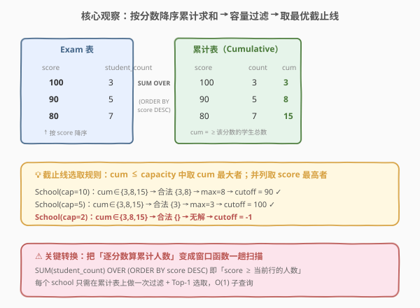
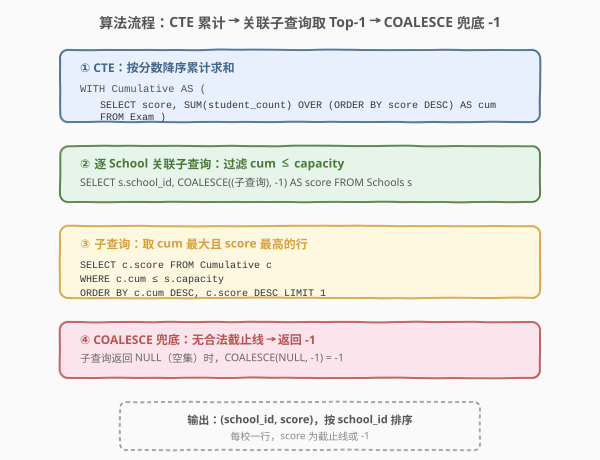
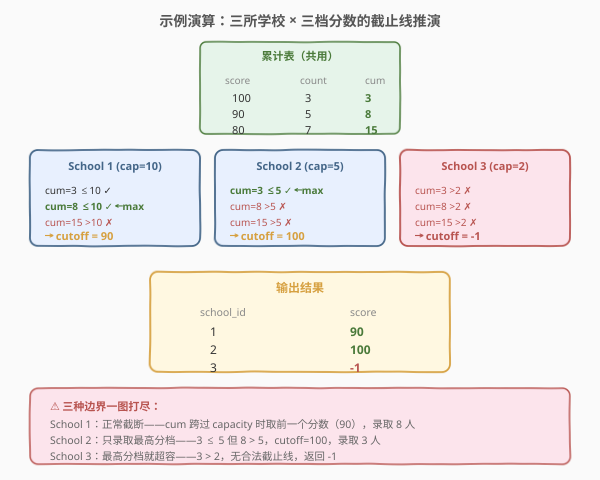

# LeetCode 找出每所学校的最低分数要求 题解

## 1. 题目概述

- **标题 / 题号**：找出每所学校的最低分数要求（#1988，medium）
- **链接**：https://leetcode.cn/problems/find-cutoff-score-for-each-school/
- **难度**：中等
- **标签**：SQL、窗口函数、累计求和（SUM OVER）、关联子查询、COALESCE、CROSS JOIN、ROW_NUMBER、排序取 Top-1

**题意**：给定 `Schools`（学校信息）与 `Exam`（考试成绩分布）两张表。每所学校有一个 `capacity`（最大招生人数）。`Exam` 表记录每个分数档的学生人数。学校设定一个**截止分数线**（cutoff score）：所有分数 ≥ cutoff 的学生被该校录取。

编写 SQL 查询，**为每所学校**找出截止分数线，满足：

1. 录取人数（分数 ≥ cutoff 的学生总数）≤ 该校 capacity；
2. 在满足 (1) 的前提下，录取人数尽可能多（最大化录取名额利用率）；
3. 若多个分数线录取人数相同，取**最高**分数线（更严格的选拔标准）；
4. 若不存在合法分数线（即最高分档的人数就超过 capacity），返回 `-1`。

**表结构**：

```text
表: Schools
+-----------+----------+
| Column    | Type     |
+-----------+----------+
| school_id | int      |   ← 主键
| capacity  | int      |
+-----------+----------+
school_id 是该表的主键。capacity 表示该校最多可招收的学生数。

表: Exam
+---------------+----------+
| Column        | Type     |
+---------------+----------+
| score         | int      |   ← 主键
| student_count | int      |
+---------------+----------+
score 是该表的主键。每行表示有 student_count 名学生考了 score 分。
```

> 💡 **审题关键**：① 结果**为每所学校一行**，基准是 `Schools` 表；② 截止线决定录取集合——score ≥ cutoff 的学生**整档录取**，不是逐人挑选；③ 优化目标是「录取人数最大化 + 容量不超」，不是「恰好填满」；④ 并列时取**最高**分线（更严格选拔），而非最低；⑤ 无解返回 -1（最高分档人数就超容）。

**示例 1**：

```text
输入：
Schools 表:
+-----------+----------+
| school_id | capacity |
+-----------+----------+
| 1         | 10       |
| 2         | 5        |
| 3         | 2        |
+-----------+----------+
Exam 表:
+-------+---------------+
| score | student_count |
+-------+---------------+
| 100   | 3             |
| 90    | 5             |
| 80    | 7             |
+-------+---------------+

输出:
+-----------+-------+
| school_id | score |
+-----------+-------+
| 1         | 90    |
| 2         | 100   |
| 3         | -1    |
+-----------+-------+
```

**解释**：

按分数降序累计求和（cum = 分数 ≥ 当前行 score 的学生总数）：

| score | student_count | cum |
|-------|---------------|-----|
| 100   | 3             | 3   |
| 90    | 5             | 8   |
| 80    | 7             | 15  |

| 学校 | capacity | 合法 cum（≤capacity） | max cum | cutoff | 录取人数 |
|------|----------|----------------------|---------|--------|----------|
| 1    | 10       | 3, 8                 | 8       | 90     | 8        |
| 2    | 5        | 3                    | 3       | 100    | 3        |
| 3    | 2        | —（3 > 2）           | —       | -1     | 0        |

> 💡 本题是 SQL **「窗口函数累计求和 + 容量约束取 Top-1」** 的经典题。核心在于把「每个 cutoff 对应的录取人数」预计算成一张累计表，再为每所学校在表上做一次过滤 + 排序取首行。骨架与 [184. 部门工资最高的员工](../0001-0100/184_部门工资最高的员工.md) 的「分组取最值」同源，但多了累计预处理与容量约束两道坎。

## 2. 解题思路

### 2.1 暴力思路：逐学校逐分数枚举

最直觉的过程式思路：对每所学校，遍历 `Exam` 表中每个分数作为候选 cutoff，对每个候选算「所有 score ≥ 候选 的 student_count 之和」，过滤掉超过 capacity 的，在剩余候选中取录取人数最大者（并列取最高分）。伪代码如下：

```text
result = []
for each school in Schools:
    best_score = -1
    best_admitted = 0
    for each score s in Exam:
        admitted = sum(e.student_count for e in Exam if e.score >= s)
        if admitted <= school.capacity:
            if admitted > best_admitted or (admitted == best_admitted and s > best_score):
                best_admitted = admitted
                best_score = s
    result.append((school.school_id, best_score))
return result
```

但**纯 SQL 没有显式双层循环**——「逐学校逐分数算累计」需换成集合式表达。关键转换有两步：① 把「对每个 cutoff 算 ≥cutoff 的人数」翻译成窗口函数 `SUM(student_count) OVER (ORDER BY score DESC)` 一趟预计算；② 把「每校取最优 cutoff」翻译成关联子查询或 `CROSS JOIN + ROW_NUMBER`。

> ⚠️ 关键转换：暴力法对每所学校 × 每个分数都重新求一次和（$O(S \times E^2)$）。预计算累计表后，每所学校只需在表上做一次 `WHERE + ORDER BY + LIMIT`（$O(E)$），且累计表只算一次（$O(E)$）。

### 2.2 核心观察：窗口函数累计求和 + 容量过滤取 Top-1



**三道关卡**：

1. **累计求和（SUM OVER）**：对 `Exam` 表按 `score` 降序排列，用窗口函数 `SUM(student_count) OVER (ORDER BY score DESC)` 计算每个分数的累计人数 `cum`。`cum` 的含义是「分数 ≥ 当前行 score 的学生总数」——正是以该 score 为 cutoff 时的录取人数。

   $$\text{cum}(s) = \sum_{\text{score}' \geq s} \text{student\_count}(\text{score}')$$

   - score=100：cum = 3（只有 100 分档的 3 人）
   - score=90：cum = 3+5 = 8（100 分档 + 90 分档）
   - score=80：cum = 3+5+7 = 15（全部学生）

2. **容量过滤 + 取最优（WHERE + ORDER BY + LIMIT）**：对每所学校，在累计表中筛选 `cum ≤ capacity` 的行，按 `cum DESC, score DESC` 排序取首行。`cum DESC` 保证录取人数最大化；`score DESC` 在录取人数并列时取最高分数线。

   $$\text{cutoff} = \arg\max_{s} \;\big(\text{cum}(s),\; s\big) \quad \text{s.t.} \quad \text{cum}(s) \leq \text{capacity}$$

3. **无解兜底（COALESCE）**：当累计表中所有行的 `cum` 都 > capacity（即最高分档人数就超容），子查询返回空集 → `NULL`，用 `COALESCE(NULL, -1)` 兜回 `-1`。

$$\boxed{\text{score} = \text{COALESCE}\Big(\big(\text{SELECT score FROM Cumulative WHERE cum} \leq \text{cap ORDER BY cum DESC, score DESC LIMIT 1}\big),\;-1\Big)}$$

> 💡 **为什么 `ORDER BY cum DESC, score DESC` 能同时满足两个优化目标？** `cum DESC` 排在最前的行就是录取人数最大的合法行（最大化录取）；若有多行 `cum` 相同（例如某分数档人数为 0 导致累计值不变），`score DESC` 保证取最高分（更严格选拔）。两个排序键把「最大化」与「并列取最高」一气呵成。

> ⚠️ **最常见的错解**：① 忘记 `score DESC` 次级排序，导致并列时取了最低分；② 用 `INNER JOIN` 而非 `LEFT JOIN`/`COALESCE`，丢失无解学校；③ 把 `cum` 算成升序累计（从低分到高分），导致语义反转。

### 2.3 算法流程图



**逻辑执行步骤**：

| 步骤 | 子句 | 作用 |
|------|------|------|
| ① | `WITH Cumulative AS (SELECT score, SUM(student_count) OVER (ORDER BY score DESC) AS cum FROM Exam)` | 预计算累计表：每个分数 → ≥该分数的总人数 |
| ② | `SELECT s.school_id, COALESCE((子查询), -1) AS score FROM Schools s` | 逐学校调用子查询，无解时 COALESCE 兜 -1 |
| ③ | 子查询：`SELECT c.score FROM Cumulative c WHERE c.cum ≤ s.capacity ORDER BY c.cum DESC, c.score DESC LIMIT 1` | 过滤合法行，取 cum 最大且 score 最高的首行 |
| ④ | `ORDER BY s.school_id` | 按学校号排序输出 |

> 💡 **逻辑执行顺序**：CTE 先物化累计表（$O(E)$ 一趟扫描），再对 `Schools` 每行执行一次子查询（$O(E)$ 过滤 + 排序）。若累计表的 `cum` 列有索引或已排序，子查询可走二分/索引扫描降至 $O(\log E)$。整体 $O(E + S \cdot E)$，优化器可能改写为 JOIN 进一步降低常数。

### 2.4 示例演算

以三所学校 × 三档分数的示例走一遍推演：



| 学校 | capacity | 合法行（cum ≤ cap） | max cum | 最高分（并列时） | cutoff | 录取 |
|------|----------|---------------------|---------|------------------|--------|------|
| 1    | 10       | (100,3), (90,8)     | 8       | 90               | **90** | 8 人 |
| 2    | 5        | (100,3)             | 3       | 100              | **100**| 3 人 |
| 3    | 2        | —（3 > 2）          | —       | —                | **-1** | 0 人 |

> 💡 **三个观察要点**：① School 1 是正常截断——cum 从 3 跳到 8 再到 15，capacity=10 卡在 8 和 15 之间，取 cum=8 对应的 score=90；② School 2 只能录取最高分档——3 ≤ 5 但 8 > 5，cutoff=100 只招 100 分的 3 人；③ School 3 最高分档就 3 > 2，无合法截止线，返回 -1。三种边界一图打尽。

> ⚠️ **为什么 School 1 的 cutoff 是 90 而不是 100？** 虽然 cutoff=100 时 cum=3 也合法，但 3 < 8，不满足「录取人数最大化」。学校宁可用更低的分数线（90）多招 5 人（共 8 人），只要不超 capacity（10）。这就是「最大化」的含义——不是填满，而是在不超的前提下尽量多招。

## 3. 参考代码

### SQL（解法 A：CTE + 窗口函数 + 关联子查询，推荐）

```sql
WITH Cumulative AS (
    SELECT score,
           SUM(student_count) OVER (ORDER BY score DESC) AS cum
    FROM Exam
)
SELECT s.school_id,
       COALESCE(
           (SELECT c.score
            FROM Cumulative c
            WHERE c.cum <= s.capacity
            ORDER BY c.cum DESC, c.score DESC
            LIMIT 1),
           -1
       ) AS score
FROM Schools s
ORDER BY s.school_id;
```

> 💡 **写法要点**：
> - **CTE `Cumulative`**：`SUM(student_count) OVER (ORDER BY score DESC)` 按分数降序累加，`cum` 即「≥该分数的人数」。一趟扫描 $O(E)$ 预计算，所有学校共用。
> - **关联子查询**：`WHERE c.cum <= s.capacity` 过滤合法行，`ORDER BY cum DESC, score DESC LIMIT 1` 取「录取最多 + 并列最高分」的首行。子查询引用外层 `s.capacity`，每校独立求值。
> - **`COALESCE(..., -1)`**：子查询返回空集时得 `NULL`，兜回 `-1`。
> - ⚠️ `LIMIT 1` 是 MySQL/PostgreSQL 语法；SQL Server 用 `TOP 1`，Oracle 用 `FETCH FIRST 1 ROWS ONLY`。

### SQL（解法 B：CROSS JOIN + ROW_NUMBER，纯集合式）

```sql
WITH Cumulative AS (
    SELECT score,
           SUM(student_count) OVER (ORDER BY score DESC) AS cum
    FROM Exam
),
Ranked AS (
    SELECT s.school_id,
           c.score,
           ROW_NUMBER() OVER (
               PARTITION BY s.school_id
               ORDER BY c.cum DESC, c.score DESC
           ) AS rnk
    FROM Schools s
    CROSS JOIN Cumulative c
    WHERE c.cum <= s.capacity
)
SELECT s.school_id,
       COALESCE(r.score, -1) AS score
FROM Schools s
LEFT JOIN Ranked r
    ON s.school_id = r.school_id AND r.rnk = 1
ORDER BY s.school_id;
```

> 💡 **写法要点**：
> - **`CROSS JOIN`**：把每所学校与累计表做笛卡尔积，`WHERE c.cum <= s.capacity` 在 JOIN 时过滤，只保留合法行。School 3 的所有行都被过滤掉，不进入 `Ranked`。
> - **`ROW_NUMBER`**：按 `school_id` 分区，`cum DESC, score DESC` 排序，每校排名第一（`rnk=1`）的行即最优 cutoff。
> - **`LEFT JOIN`**：School 3 在 `Ranked` 中无行（全被过滤），`LEFT JOIN` 保留并让 `r.score` 为 `NULL`，`COALESCE` 兜 -1。
> - ✓ **无关联子查询**，纯集合式操作，优化器可自由选择 JOIN 顺序与策略。适合窗口函数支持好但关联子查询优化差的引擎。

### SQL（解法 C：标量子查询累加，无窗口函数版）

```sql
SELECT s.school_id,
       COALESCE(
           (SELECT e1.score
            FROM Exam e1
            WHERE (SELECT COALESCE(SUM(e2.student_count), 0)
                   FROM Exam e2
                   WHERE e2.score >= e1.score) <= s.capacity
            ORDER BY (SELECT COALESCE(SUM(e2.student_count), 0)
                      FROM Exam e2
                      WHERE e2.score >= e1.score) DESC,
                     e1.score DESC
            LIMIT 1),
           -1
       ) AS score
FROM Schools s
ORDER BY s.school_id;
```

> 💡 **写法要点**：
> - **无窗口函数**：用关联标量子查询 `(SELECT SUM(e2.student_count) FROM Exam e2 WHERE e2.score >= e1.score)` 逐行算累计——对每个 `e1.score`，求所有 ≥ 该分数的人数。MySQL 5.7 及以下不支持窗口函数时用此版。
> - **两处引用同一子查询**：`WHERE` 过滤 + `ORDER BY` 排序都引用累计值。优化器可能缓存结果，但最坏 $O(E^2)$。
> - **`COALESCE(SUM(...), 0)`**：防御性处理 `Exam` 为空时 `SUM` 返回 `NULL` 的情况。
> - ⚠️ 性能最差，仅作兼容方案。MySQL 8.0+ 务必用解法 A。

### Python（pandas）

```python
import pandas as pd

def find_cutoff_score(schools: pd.DataFrame, exam: pd.DataFrame) -> pd.DataFrame:
    if exam.empty:
        schools = schools.copy()
        schools['score'] = -1
        return schools[['school_id', 'score']].sort_values('school_id')

    exam = exam.sort_values('score', ascending=False)
    exam['cum'] = exam['student_count'].cumsum()

    def get_cutoff(capacity: int) -> int:
        valid = exam[exam['cum'] <= capacity]
        if valid.empty:
            return -1
        max_cum = valid['cum'].max()
        return valid.loc[valid['cum'] == max_cum, 'score'].max()

    schools = schools.copy()
    schools['score'] = schools['capacity'].apply(get_cutoff)
    return schools[['school_id', 'score']].sort_values('school_id')
```

> 💡 **pandas 对照**：
> - `.sort_values('score', ascending=False)` + `.cumsum()` 等价于 `SUM(student_count) OVER (ORDER BY score DESC)`——降序排列后累加。
> - `exam[exam['cum'] <= capacity]` 等价于 `WHERE c.cum <= s.capacity`——过滤合法行。
> - `valid['cum'].max()` + `valid.loc[..., 'score'].max()` 等价于 `ORDER BY cum DESC, score DESC LIMIT 1`——先取最大 cum，再在最大 cum 行中取最高 score。
> - `if valid.empty: return -1` 等价于 `COALESCE(..., -1)`——空集兜底。
> - ⚠️ pandas 的 `.apply(get_cutoff)` 是逐行调用，对 $S$ 所学校各做一次过滤（$O(E)$），总 $O(S \cdot E)$。若需向量化，可用 `merge` 做笛卡尔积再分组取 Top-1（类似解法 B）。

## 4. 复杂度分析

| 维度 | 解法 A（CTE + 子查询） | 解法 B（CROSS JOIN + ROW_NUMBER） | 解法 C（标量子查询） |
|------|------------------------|----------------------------------|----------------------|
| **时间** | $O(E + S \cdot E)$ | $O(E + S \cdot E)$ | $O(E^2 + S \cdot E)$ |
| **空间** | $O(E)$（CTE 物化） | $O(S \cdot E)$（笛卡尔积） | $O(1)$（无中间表） |
| **窗口函数** | ✓ 需要 MySQL 8.0+ | ✓ 需要 MySQL 8.0+ | ❌ 不需要 |
| **关联子查询** | ✓ 每校一次 | ❌ 纯 JOIN | ✓ 每校 × 每分一次 |
| **推荐度** | ★★★ 首选 | ★★ 备选 | ★ 兼容旧版 |

> - $E$ = `Exam` 表行数（不同分数档数），$S$ = `Schools` 表行数。
> - **解法 A**：CTE 一趟扫描 $O(E)$ 预计算累计表；每所学校在表上做 $O(E)$ 过滤 + 排序取首行。若 `cum` 已排序（CTE 按 `score DESC` 产出，`cum` 单调递增），排序退化为 $O(E)$ 扫描。总计 $O(E + S \cdot E)$。
> - **解法 B**：CTE $O(E)$；`CROSS JOIN` 产出 $O(S \cdot E)$ 行（过滤前），过滤后 ≤ $S \cdot E$；`ROW_NUMBER` 需排序 $O(S \cdot E \log E)$。总计 $O(E + S \cdot E \log E)$。空间多一份 $O(S \cdot E)$ 中间结果。
> - **解法 C**：每个 `e1` 行触发一次 $O(E)$ 子查询（求 ≥e1.score 的 SUM），共 $E$ 行 → $O(E^2)$ 预计算；每所学校在 $E$ 行上过滤 + 排序 $O(E)$。总计 $O(E^2 + S \cdot E)$。⚠️ 性能最差，仅兼容用。
> - **索引优化**：给 `Exam.score` 建索引可加速 `e2.score >= e1.score` 的范围扫描（解法 C）；CTE 物化后 `cum` 已随 `score DESC` 有序，解法 A/B 的过滤可走有序扫描。

> ⚠️ SQL 复杂度取决于**执行计划与数据分布**：若 `Schools` 的 `capacity` 分布集中（多数学校的合法行集中在累计表尾部），解法 A 的子查询可用索引从尾部倒扫快速命中。面试中说明「CTE 预计算 $O(E)$，每校子查询 $O(E)$ 过滤取首行，整体 $O(E + S \cdot E)$」即可。本题数据量小，重点是逻辑正确性（累计方向、并列取最高、无解兜底）。

## 5. 扩展

### 5.1 累计方向：为什么是 `ORDER BY score DESC` 而非 `ASC`？

窗口函数 `SUM(student_count) OVER (ORDER BY score DESC)` 的累计方向是从**最高分向最低分**累加。这保证了 `cum` 的语义是「分数 ≥ 当前行 score 的总人数」——即以该 score 为 cutoff 时的录取人数。

若误用 `ORDER BY score ASC`，`cum` 变成「分数 ≤ 当前行 score 的总人数」，语义完全反转——变成「淘汰人数」而非「录取人数」。此时需要用 `SUM(student_count) OVER () - SUM(student_count) OVER (ORDER BY score ASC)` 间接求，既冗长又易错。

> 💡 **口诀**：cutoff = 最低录取分 → 累计方向 = 从高到低（DESC）→ cum = ≥该分的人数。方向与 cutoff 的语义一致。

### 5.2 并列处理：`ORDER BY cum DESC, score DESC` 的一气呵成

题目的两个优化目标——「录取人数最大化」与「并列取最高分」——用两个排序键一次表达：

| 排序键 | 方向 | 目标 |
|--------|------|------|
| `cum DESC` | 降序 | 录取人数最大化（cum 越大录取越多） |
| `score DESC` | 降序 | 并列时取最高分（更严格选拔） |

> 💡 **何时触发并列？** 当某分数档 `student_count = 0` 时，该档的 `cum` 与上一档相同。例如 scores [100, 95, 90] counts [3, 0, 5]：score=100 cum=3，score=95 cum=3（并列），score=90 cum=8。若 capacity=3，合法行为 (100,3) 和 (95,3)，`score DESC` 取 100。但实际 `Exam` 表通常不含 0 人分数档，并列较少出现——题目保留此规则是为防御性覆盖。

### 5.3 无解边界：-1 的触发条件与 `COALESCE`

当**最高分档的 `student_count` 就 > `capacity`** 时，累计表中所有行的 `cum` 都 ≥ 该 `student_count` > `capacity`，`WHERE c.cum <= s.capacity` 过滤后为空集，子查询返回 `NULL`。

$$\text{无解} \iff \min_s \text{cum}(s) = \text{student\_count}(\text{最高分}) > \text{capacity}$$

`COALESCE(NULL, -1)` 把 `NULL` 兜成 `-1`。若用 `LEFT JOIN`（解法 B），无匹配的学校在右表为 `NULL`，同样靠 `COALESCE` 兜底。

> ⚠️ **`IFNULL` vs `COALESCE`**：`IFNULL(x, -1)` 是 MySQL 方言（只接受 2 参数）；`COALESCE(x, -1)` 是 SQL 标准（可接受 N 参数），跨库通用。面试中推荐 `COALESCE`。

### 5.4 跨数据库语法差异

| 数据库 | 取首行语法 | 窗口函数支持 |
|--------|-----------|-------------|
| **MySQL 8.0+** | `LIMIT 1` | ✓ |
| **PostgreSQL** | `LIMIT 1` | ✓ |
| **SQL Server** | `TOP 1` | ✓ |
| **Oracle** | `FETCH FIRST 1 ROWS ONLY` | ✓ |
| **MySQL 5.7** | `LIMIT 1` | ❌（用解法 C） |

```sql
-- SQL Server 版（解法 A 变体）
WITH Cumulative AS (
    SELECT score, SUM(student_count) OVER (ORDER BY score DESC) AS cum
    FROM Exam
)
SELECT s.school_id,
       COALESCE(
           (SELECT TOP 1 c.score
            FROM Cumulative c
            WHERE c.cum <= s.capacity
            ORDER BY c.cum DESC, c.score DESC),
           -1
       ) AS score
FROM Schools s
ORDER BY s.school_id;
```

## 6. 面试要点

**Q1：为什么用窗口函数 `SUM OVER` 而不是自连接？**

> 自连接 `Exam e1 LEFT JOIN Exam e2 ON e2.score >= e1.score` + `GROUP BY e1.score` + `SUM(e2.student_count)` 也能算累计，但复杂度 $O(E^2)$（每行触发一次范围扫描）。窗口函数 `SUM(student_count) OVER (ORDER BY score DESC)` 只需一趟排序 + 流式累加，$O(E \log E)$（排序）或 $O(E)$（若 score 已有序）。语义也更清晰——`OVER (ORDER BY score DESC)` 直接表达「从高到低累加」。MySQL 8.0+ 务必用窗口函数。

**Q2：`ORDER BY cum DESC, score DESC` 如何同时满足两个优化目标？**

> `cum DESC` 是主排序键：`cum` 越大说明录取人数越多，排在最前的行就是「合法行中录取最多」的。`score DESC` 是次排序键：当多行 `cum` 相同（例如某分数档 0 人导致累计值不变），取 `score` 最高的行——即「并列时取更严格的分数线」。两个键把「最大化录取」和「并列取最高分」用一次 `ORDER BY + LIMIT 1` 完成，无需额外子查询或 `CASE` 判断。

**Q3：什么时候返回 -1？`COALESCE` 在这里起什么作用？**

> 当最高分档的 `student_count` 就超过学校的 `capacity` 时，累计表中所有行的 `cum` 都 > `capacity`（因为最高分档的 `cum` 就等于其 `student_count`，是最小 cum 值）。`WHERE c.cum <= s.capacity` 过滤后为空集，子查询返回 `NULL`。`COALESCE(NULL, -1)` 把 `NULL` 兜成 `-1`，表示「无合法截止线，该校无法招生」。在解法 B 中，`CROSS JOIN` 后所有行被 `WHERE` 过滤掉，`Ranked` CTE 中无该校行，`LEFT JOIN` 让 `r.score` 为 `NULL`，同样靠 `COALESCE` 兜底。

**Q4：解法 A（关联子查询）与解法 B（CROSS JOIN + ROW_NUMBER）有何区别？**

> 解法 A 对每所学校执行一次子查询，逻辑直观但可能被优化器按嵌套循环执行（每校一次 $O(E)$ 扫描）。解法 B 先做笛卡尔积再统一排序取 Top-1，纯集合式无关联子查询，优化器可自由选择 JOIN 策略（哈希、归并）。在 `Schools` 行数多时，解法 B 的 `CROSS JOIN` 会生成 $S \times E$ 行中间结果，空间开销更大；但若 `capacity` 过滤能在大规模数据上提前裁剪，解法 B 可能更快。面试中首推解法 A 说明思路，再提解法 B 作为「无关联子查询」的替代方案。

**Q5：如果 `Exam` 表为空怎么办？**

> `Exam` 为空时，CTE `Cumulative` 也为空。解法 A 的子查询在空表上执行返回 `NULL` → `COALESCE(NULL, -1) = -1`，所有学校都返回 -1（无学生可招）。pandas 版需显式判断 `exam.empty`：空 DataFrame 上 `.sort_values` 和 `.cumsum` 虽不报错但产出空结果，`get_cutoff` 中 `valid.empty` 为真返回 -1。SQL 靠空集语义自然兜底，pandas 需显式处理——这是两种语言对空集行为的关键差异。

> 💡 **一句话总结**：1988 是 SQL **「窗口函数累计求和 + 容量约束取 Top-1」** 的招牌题——`SUM(student_count) OVER (ORDER BY score DESC)` 一趟预计算每个 cutoff 对应的录取人数，每所学校在累计表上 `WHERE cum ≤ capacity ORDER BY cum DESC, score DESC LIMIT 1` 取最优截止线，`COALESCE` 兜底 -1。考点在「累计方向（DESC）」「双排序键一气呵成（cum + score）」「无解兜底（COALESCE）」三连，是所有「阈值选取 + 约束优化」类 SQL 题的基座。

## 同类练习题

| # | 题目 | 与本题的关联 |
|---|------|-------------|
| 184 | [部门工资最高的员工](https://leetcode.cn/problems/department-highest-salary/)（[站内题解](../0001-0100/184_部门工资最高的员工.md)） | SQL「分组取最值」母题——`LEFT JOIN + GROUP BY` 或窗口函数取每组最高。1988 是其「累计 + 容量约束」升级版，多了预计算与过滤 |
| 176 | [第二高的薪水](https://leetcode.cn/problems/second-highest-salary/)（[站内题解](../0001-0100/176_第二高的薪水.md)） | `COALESCE` 兜底 `NULL` 的经典题——无第二高时返回 `NULL`。1988 的 `-1` 兜底与此同源，对比「缺失值兜底」（176）与「无解兜底」（1988） |
| 1174 | [即时食物配送 II](https://leetcode.cn/problems/immediate-food-delivery-ii/)（[站内题解](../1101-1200/1174_即时食物配送II.md)） | `AVG(布尔) × 100` 算比例 + 窗口函数 `RANK` 取首次配送。与 1988 同为窗口函数应用题，对比「分组取首行」（1174）与「累计 + 过滤取首行」（1988） |
| 1934 | [确认率](https://leetcode.cn/problems/confirmation-rate/)（[站内题解](1934_确认率.md)） | `LEFT JOIN + AVG(IF)` 算分组比率 + `ROUND` 格式化。与 1988 同为「逐实体算指标 + 兜底缺失值」家族，对比「分组比率保空组」（1934）与「容量约束取最优」（1988） |
| 1070 | [产品销售分析 III](https://leetcode.cn/problems/product-sales-analysis-iii/) | 每产品最低价年份的「分组 Top-1」题。与 1988 同为「逐组排序取首行」骨架，对比「分组取最值」（1070）与「累计 + 约束取首行」（1988） |
