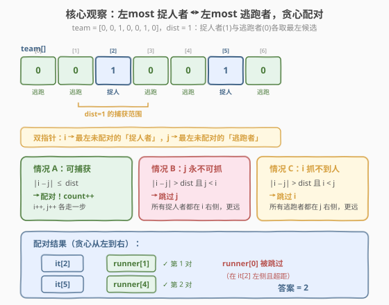
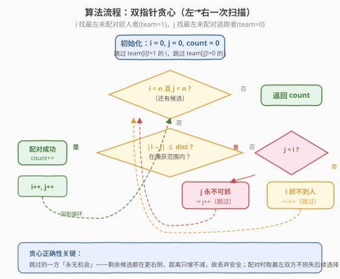
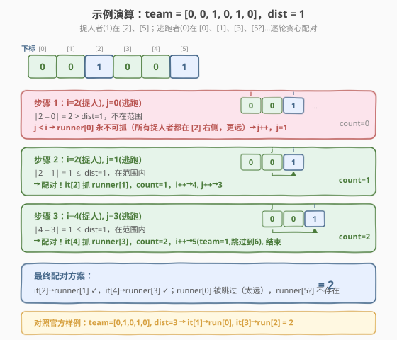

# LeetCode 捉迷藏中可捕获的最大人数 题解

## 1. 题目概述

- **标题 / 题号**：捉迷藏中可捕获的最大人数（#1989，medium）
- **链接**：https://leetcode.cn/problems/maximum-number-of-people-that-can-be-caught-in-tag/
- **难度**：中等
- **标签**：贪心、数组、双指针

**题意**：$n$ 个人站成一排，从左到右编号 $0$ 到 $n-1$。给定整数数组 `team` 与整数 `dist`：

- `team[i] = 1` 表示第 $i$ 个人是**捉人者**（"it"）；
- `team[i] = 0` 表示第 $i$ 个人是**逃跑者**（非 "it"）；
- `dist` 是捉人者能抓到人的**最大距离**。

捉人者 $i$ 可以抓到逃跑者 $j$，当且仅当 $|i - j| \le \text{dist}$。**每个捉人者最多抓一个人，每个逃跑者最多被抓一次**。返回能被抓到的**最大人数**。

**示例 1**：

```text
输入：team = [0,1,0,1,0], dist = 3
输出：2
解释：
  捉人者在 [1]、[3]；逃跑者在 [0]、[2]、[4]
  it[1] 抓 runner[0]（|1-0|=1 ≤ 3），it[3] 抓 runner[2]（|3-2|=1 ≤ 3）
  最多抓 2 人（只有 2 个捉人者）
```

**示例 2**：

```text
输入：team = [0,0,1,0,1,0], dist = 1
输出：2
解释：
  捉人者在 [2]、[4]；逃跑者在 [0]、[1]、[3]、[5]
  it[2] 抓 runner[1]（|2-1|=1 ≤ 1），it[4] 抓 runner[3]（|4-3|=1 ≤ 1）
  runner[0] 距 it[2] 为 2 > 1，且在所有捉人者左侧 → 永远抓不到，跳过
  最多抓 2 人
```

**约束**：

- $n = \text{team.length}$
- $1 \le n \le 10^5$
- $\text{team}[i] \in \{0, 1\}$
- $1 \le \text{dist} \le 10^5$

> 💡 **审题关键**：① 这是一道**配对型最优化**问题——捉人者与逃跑者一一配对，求最大配对数，与「任务分配」同构；② 距离约束 $|i-j| \le \text{dist}$ 是**对称区间**，但配对的不可重复性使它不能用简单的区间计数；③ 关键在于「**谁该被放弃**」——当最左的捉人者与最左的逃跑者距离太远时，必须果断舍弃一方，而舍弃谁取决于「谁在左侧」。

## 2. 解题思路

### 2.1 暴力思路：二分图最大匹配

把每个捉人者与每个逃跑者看作二分图的两类节点，若 $|i - j| \le \text{dist}$ 则连边。问题转化为**二分图最大匹配**，可用匈牙利算法求解。

- **正确性**：忠实建模，最大匹配数即答案。
- **效率**：匈牙利算法 $O(VE)$，最坏 $O(n^2)$（$n = 10^5$ 时约 $10^{10}$，**超时**）。

> ⚠️ 暴力法的问题：它没有利用题目的一维线性结构。所有节点排成一条线、距离约束是对称的——这意味着匹配关系有**单调性**，可以贪心而非搜索。

### 2.2 核心观察：贪心配对 + 双指针



将所有捉人者按位置从左到右排列，逃跑者同理。维护两个指针：

- $i$：最左未配对的**捉人者**位置；
- $j$：最左未配对的**逃跑者**位置。

每轮比较 $i$ 与 $j$，分三种情况：

| 情况 | 条件 | 动作 | 理由 |
|------|------|------|------|
| **A. 可捕获** | $|i - j| \le \text{dist}$ | 配对，$i\!+\!+$, $j\!+\!+$, `count++` | 双方在范围内，配对不损失后续选择 |
| **B. j 永不可抓** | $|i - j| > \text{dist}$ 且 $j < i$ | $j\!+\!+$（跳过逃跑者） | 所有剩余捉人者都在 $i$ 右侧 $\ge i > j$，距 $j$ 只增不减 → $j$ 永远抓不到 |
| **C. i 抓不到人** | $|i - j| > \text{dist}$ 且 $i < j$ | $i\!+\!+$（跳过捉人者） | 所有剩余逃跑者都在 $j$ 右侧 $\ge j > i$，距 $i$ 只增不减 → $i$ 永远抓不到人 |

> 💡 **关键洞察**：当最左双方距离太远时，**位置更靠左的那个永远无法参与配对**——因为另一方（以及后续所有候选）都在更右侧，距离只会更大。因此果断丢弃它，不损失任何最优解。

### 2.3 算法流程图



**完整步骤**：

1. **初始化**：$i = 0$, $j = 0$, $\text{count} = 0$。
2. **循环**（$i < n$ 且 $j < n$）：
   - 跳过 $i$：`while i < n and team[i] != 1: i++`（找下一个捉人者）
   - 跳过 $j$：`while j < n and team[j] != 0: j++`（找下一个逃跑者）
   - 若 $i \ge n$ 或 $j \ge n$，跳出
   - 若 $|i - j| \le \text{dist}$：`count++`, `i++`, `j++`
   - 否则若 $j < i$：`j++`（情况 B）
   - 否则（$i < j$）：`i++`（情况 C）
3. **返回** `count`。

> ⚠️ **跳过非候选**：每次循环开头先把 $i$ 推到下一个 `team[i]==1`、$j$ 推到下一个 `team[j]==0`。这保证比较时 $i$ 一定是捉人者、$j$ 一定是逃跑者。配对或跳过后 `i++`/`j++` 只走一步，下一轮循环开头的跳过逻辑会继续推进。

### 2.4 示例演算

以 `team = [0, 0, 1, 0, 1, 0]`, `dist = 1` 为例：



| 步骤 | $i$（捉人） | $j$（逃跑） | $|i-j|$ | 判定 | 动作 | count |
|------|-----------|-----------|---------|------|------|-------|
| 1 | 2 | 0 | 2 | $> \text{dist}$, $j < i$ | 跳过 $j$，$j \to 1$ | 0 |
| 2 | 2 | 1 | 1 | $\le \text{dist}$ | 配对，$i \to 4$, $j \to 3$ | 1 |
| 3 | 4 | 3 | 1 | $\le \text{dist}$ | 配对，$i \to 5$, $j \to 4$ | 2 |
| 4 | — | — | — | $i$ 跳过 `team[5]=1`→$i=6 \ge n$ | 结束 | 2 |

注意步骤 1：$j=0$ 在 $i=2$ 左侧且超距，所有捉人者（$[2]$、$[4]$）都在 $j=0$ 右侧，距离 $\ge 2 > \text{dist}=1$，故 runner[0] 永不可抓，果断跳过。这正是贪心的精髓——**用 $O(1)$ 判定丢弃一个永无机会的候选**，而非搜索所有可能。

> 💡 对照官方样例 `team = [0,1,0,1,0]`, `dist = 3`：$i=1, j=0$ → $|1-0|=1 \le 3$ 配对；$i=3, j=2$ → $|3-2|=1 \le 3$ 配对；$i=4$ 跳过非捉人者后越界。答案 = 2。

## 3. 参考代码

### C++

```cpp
// 捉迷藏中可捕获的最大人数.cpp —— 贪心双指针
// 编译: g++ -O2 -std=c++17 捉迷藏中可捕获的最大人数.cpp -o tag
#include <vector>
#include <cstdlib>
using namespace std;

class Solution {
  public:
    int catchMaximumAmountofPeople(vector<int>& team, int dist) {
        int n = team.size();
        int i = 0, j = 0, count = 0;
        while (i < n && j < n) {
            while (i < n && team[i] != 1) i++;   // 找下一个捉人者
            while (j < n && team[j] != 0) j++;   // 找下一个逃跑者
            if (i >= n || j >= n) break;
            if (abs(i - j) <= dist) {            // 情况 A：可捕获
                count++;
                i++;
                j++;
            } else if (j < i) {                  // 情况 B：逃跑者太远（左侧）
                j++;
            } else {                             // 情况 C：捉人者太远（左侧）
                i++;
            }
        }
        return count;
    }
};
```

### Python

```python
class Solution:
    def catchMaximumAmountofPeople(self, team: list[int], dist: int) -> int:
        n = len(team)
        i = j = count = 0
        while i < n and j < n:
            while i < n and team[i] != 1:   # 找下一个捉人者
                i += 1
            while j < n and team[j] != 0:   # 找下一个逃跑者
                j += 1
            if i >= n or j >= n:
                break
            if abs(i - j) <= dist:          # 情况 A：可捕获
                count += 1
                i += 1
                j += 1
            elif j < i:                     # 情况 B：逃跑者太远（左侧）
                j += 1
            else:                           # 情况 C：捉人者太远（左侧）
                i += 1
        return count
```

> 💡 **写法对照**：C++ 用 `abs(i - j)`（需 `<cstdlib>`），Python 用 `abs(i - j)`。两者逻辑完全一致：跳到下一个候选 → 判距 → 配对或丢弃。注意 `team[i] != 1` 而非 `team[i] == 0`，因为题目只保证取值 $\{0,1\}$，用 `!= 1` 更稳妥（防御性写法）。

## 4. 复杂度分析

| 维度 | 复杂度 | 说明 |
|------|--------|------|
| **时间复杂度** | $O(n)$ | $i$ 和 $j$ 各从 $0$ 单调推进到 $n$，总移动次数 $\le 2n$；每个元素至多被跳过一次 |
| **空间复杂度** | $O(1)$ | 只用 $i$、$j$、`count` 三个变量，原地扫描 |

> ⚠️ 虽然有两层 `while`（外层主循环 + 内层跳过非候选），但 $i$ 和 $j$ **各自单调递增、永不回退**，总推进次数 $\le 2n$，故 $O(n)$。这与 [11 盛最多水的容器](../0001-0100/11_盛最多水的容器.md) 的双指针均摊分析同理。

## 5. 扩展：贪心正确性证明

### 5.1 交换论证

**命题**：存在一个最优解，其中最左捉人者 $i$ 与最左逃跑者 $j$ 要么配对、要么至少一方不在任何配对中。

**证明**：设最优解中 $i$ 配 $j'$（$j' \ne j$），$j$ 配 $i'$（$i' \ne i$），且 $|i - j'| \le \text{dist}$、$|i' - j| \le \text{dist}$。

- 若 $|i - j| \le \text{dist}$（情况 A）：交换为 $i \leftrightarrow j$、$i' \leftrightarrow j'$。因 $j < j'$ 且 $i < i'$，由三角不等式可验证新配对仍在范围内，配对数不变。
- 若 $|i - j| > \text{dist}$ 且 $j < i$（情况 B）：$j$ 在 $i$ 左侧且超距。所有捉人者 $\ge i > j$，距 $j$ 均 $\ge i - j > \text{dist}$，故 $j$ 不可能在任何配对中 → 丢弃 $j$ 不损失最优解。
- 若 $|i - j| > \text{dist}$ 且 $i < j$（情况 C）：对称地，$i$ 不可能在任何配对中 → 丢弃 $i$ 不损失最优解。

故贪心选择不破坏最优性。$\square$

### 5.2 与区间调度的关系

本题与 [435 无重叠区间](../0401-0500/435_无重叠区间.md) 的贪心区间调度**同构**：都是「在一维线性结构上选最大不相冲突子集」。差别在于 435 按**右端点**排序贪心（区间不相交），本题按**位置**双指针贪心（距离约束对称）。两者的核心都是——**果断丢弃「无可挽回」的候选**。

## 6. 面试要点

1. **为什么用贪心而不是二分图匹配？**

   - 二分图匹配 $O(n^2)$ 没有利用一维线性结构。本题的距离约束在一维上有**单调性**：位置越远的对距离越大。贪心双指针利用这一点，$O(n)$ 一次扫描搞定。

2. **贪心为什么正确？丢弃的一方真的「永无机会」吗？**

   - 情况 B（$j < i$ 且超距）：$j$ 是最左逃跑者，$i$ 是最左捉人者，所有剩余捉人者都在 $i$ 右侧 $\ge i$，距 $j$ 只增不减 → $j$ 永远超距。
   - 情况 C 对称。丢弃「位置更左且超距」的一方是安全的，因为后续候选只会更远。

3. **为什么取最左双方配对，而不是最左捉人者配最右可达逃跑者？**

   - 最左配对不损失后续选择：配对后双方各走一步，剩余候选集合与任意其他配对方案相比只少不劣。最右可达反而可能「抢走」后续捉人者的唯一候选。

4. **时间复杂度为什么是 $O(n)$？有两层 while。**

   - $i$ 和 $j$ 各自单调递增、永不回退，总推进 $\le 2n$。内层跳过 `while` 只是把指针推到下一个有效候选，均摊 $O(1)$。

5. **`team[i] != 1` 和 `team[i] == 0` 有区别吗？**

   - 题目保证取值 $\{0,1\}$ 时无区别。用 `!= 1` 是防御性写法——若数据有异常值（如 $-1$），`!= 1` 会跳过它（当作非捉人者），`== 0` 则会卡住。面试中说明这点体现严谨。

> 💡 **一句话总结**：本题是「一维配对型贪心」的招牌——双指针各取最左候选，在范围内配对、超距时丢弃左侧永无机会者，$O(n)$ 一趟扫描求最大配对数。核心是看清「丢弃安全」的单调性。

## 同类练习题

| # | 题目 | 与本题的关联 |
|---|------|-------------|
| 11 | [盛最多水的容器](https://leetcode.cn/problems/container-with-most-water/)（[题解](../0001-0100/11_盛最多水的容器.md)） | 双指针贪心招牌题，左右指针向内收缩，本题的「双指针均摊 $O(n)$」母模板 |
| 435 | [无重叠区间](https://leetcode.cn/problems/non-overlapping-intervals/)（[题解](../0401-0500/435_无重叠区间.md)） | 一维区间贪心调度，按右端点丢弃冲突区间，与本题「果断丢弃无机会者」同构 |
| 455 | [分发饼干](https://leetcode.cn/problems/assign-cookies/) | 双指针贪心配对（小孩胃口 ↔ 饼干尺寸），排序后最左配对，与本题配对逻辑同骨架 |
| 881 | [救生艇](https://leetcode.cn/problems/boats-to-save-people/) | 双指针贪心配对（最轻+最重共乘一船），排序后两端指针，本题的「配对计数」变体 |
