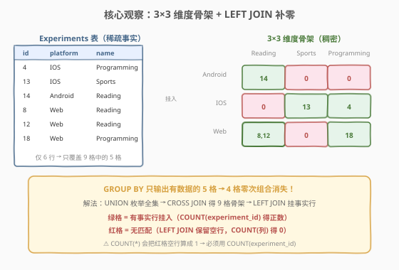
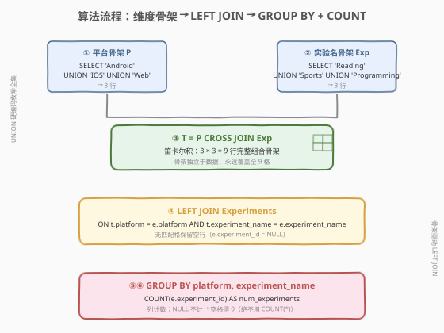
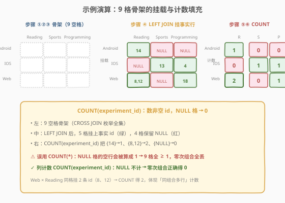

# 统计实验的数量

- **题目名称**：统计实验的数量
- **链接**：[1990. 统计实验的数量 🔒](https://leetcode.cn/problems/count-the-number-of-experiments)
- **难度**：中等
- **标签**：数据库、SQL、`CROSS JOIN`、`LEFT JOIN`、`GROUP BY`、`COUNT(column)`、维度齐全、笛卡尔积骨架、LeetCode 锁题

## 1. 题目概述

给定 `Experiments` 表，编写 SQL 查询，报告**三个实验平台中每种实验完成的次数**。注意，每一对（实验平台、实验名称）都应包含在输出中，**包括次数为零的组合**。结果可以任意顺序返回。

**表结构**：

```text
Table: Experiments
+-----------------+------+
| Column Name     | Type |
+-----------------+------+
| experiment_id   | int  |  ← 主键
| platform        | enum |
| experiment_name | enum |
+-----------------+------+

platform 是枚举类型，取值为 ('Android', 'IOS', 'Web') 之一。
experiment_name 是枚举类型，取值为 ('Reading', 'Sports', 'Programming') 之一。
该表记录实验人员进行的实验：ID、所用平台、实验名称。
```

**示例 1**：

```text
输入：
Experiments 表:
+---------------+----------+-----------------+
| experiment_id | platform | experiment_name |
+---------------+----------+-----------------+
| 4             | IOS      | Programming     |
| 13            | IOS      | Sports          |
| 14            | Android  | Reading         |
| 8             | Web      | Reading         |
| 12            | Web      | Reading         |
| 18            | Web      | Programming     |
+---------------+----------+-----------------+

输出：
+----------+-----------------+-----------------+
| platform | experiment_name | num_experiments |
+----------+-----------------+-----------------+
| Android  | Reading         | 1               |
| Android  | Sports          | 0               |
| Android  | Programming     | 0               |
| IOS      | Reading         | 0               |
| IOS      | Sports          | 1               |
| IOS      | Programming     | 1               |
| Web      | Reading         | 2               |
| Web      | Sports          | 0               |
| Web      | Programming     | 1               |
+----------+-----------------+-----------------+
```

**解释**：

| 平台 | Reading | Sports | Programming | 合计 |
|------|---------|--------|-------------|------|
| Android | 1 | 0 | 0 | 1 |
| IOS | 0 | 1 | 1 | 2 |
| Web | 2 | 0 | 1 | 3 |

**约束条件**：

- `experiment_id` 是 `Experiments` 表的主键（具有唯一值）
- `platform` ∈ `('Android', 'IOS', 'Web')`
- `experiment_name` ∈ `('Reading', 'Sports', 'Programming')`
- 输出必须覆盖全部 $3 \times 3 = 9$ 个（平台, 实验名）组合，**次数为零的组合也要出现**

> 💡 **审题关键**：① 这是 SQL **「维度齐全（sparse → dense）」招牌题**——直接 `GROUP BY platform, experiment_name` 只会返回数据中**实际出现**的组合，零次组合会「消失」；② 关键在于先构造一张 $3 \times 3 = 9$ 行的「维度笛卡尔积骨架」，再把事实表 `LEFT JOIN` 上去，让空格子以 `0` 留住；③ 计数时必须用 `COUNT(experiment_id)`（列计数，遇 `NULL` 不计）而非 `COUNT(*)`（行计数，会把 `LEFT JOIN` 产生的空行算成 1）。

---

## 2. 解题思路

### 2.1 暴力思路：逐对查询计数

最直觉的过程式思路：枚举 3 个平台 × 3 个实验名共 9 个组合，对每一对单独 `SELECT COUNT(*)`：

```text
for p in ('Android', 'IOS', 'Web'):
    for e in ('Reading', 'Sports', 'Programming'):
        cnt = SELECT COUNT(*) FROM Experiments WHERE platform = p AND experiment_name = e
        emit (p, e, cnt)
```

- **正确性**：枚举覆盖全部 9 格，零次组合天然以 `0` 输出。
- **效率**：9 次独立查询，每次全表扫描；当枚举维度变多（如 $N \times M$ 维）时查询数 $N \cdot M$ 线性增长，且无法利用一次排序/哈希的局部性，**无法在单条 SQL 中表达**——SQL 的范式是「集合式一次性求解」。

> ⚠️ **为何不能直接 `SELECT platform, experiment_name, COUNT(*) FROM Experiments GROUP BY 1, 2`？** 因为 `GROUP BY` 只对**数据中存在的分组键**产生行。示例中 `Android × Sports` 在表里没有任何行，`GROUP BY` 不会为它输出一行——这正是「零次组合消失」的根因，也是本题唯一真正的难点。

### 2.2 核心观察：维度笛卡尔积骨架 + LEFT JOIN 补零



**问题拆解为三个子问题**：

1. **构造平台维度表 `P`**：用 `UNION` 显式列出 3 个枚举值 `('Android', 'IOS', 'Web')`，得到一张 3 行的「平台骨架」。
2. **构造实验名维度表 `E`**：同理 `UNION` 列出 `('Reading', 'Sports', 'Programming')`，得到 3 行的「实验名骨架」。
3. **笛卡尔积 + 左连接 + 计数**：`P CROSS JOIN E` 得到 9 行的完整组合骨架 `T`；再 `LEFT JOIN Experiments USING (platform, experiment_name)`，让每个组合挂上它的实验行（无则为 `NULL`）；最后 `GROUP BY platform, experiment_name`，用 `COUNT(experiment_id)` 计数——**`NULL` 不计入，零次组合自然得 0**。

> 💡 **为何 `COUNT(experiment_id)` 而非 `COUNT(*)`？** `LEFT JOIN` 对无匹配的组合仍保留一行（右侧字段全为 `NULL`）。`COUNT(*)` 数行数，会把这一行算成 `1`；而 `COUNT(experiment_id)` 数的是**右表主键列的非空值**，空匹配为 `0`。这是「补零」类题目的**最易错点**——列计数 vs 行计数，一字之差，结果全错。

> 💡 **为何要「硬编码」枚举值而不 `SELECT DISTINCT platform FROM Experiments`？** 维度骨架必须独立于事实数据，否则当某个枚举值在表中**完全没出现**时，`DISTINCT` 取不到它，骨架就残缺了。题目明确给出枚举的**全集**（3 个平台、3 个实验名），应直接硬编码构造，保证骨架永远是完整的 $3 \times 3$。这与「事实表 `DISTINCT` 取维度」的写法形成对照——后者只适用于「维度全集即数据中出现的值」的场景。

### 2.3 算法流程图



**逻辑执行步骤**：

| 步骤 | 子句 | 作用 |
|------|------|------|
| ① | `WITH P AS (SELECT 'Android' UNION SELECT 'IOS' UNION SELECT 'Web')` | 平台维度骨架（3 行） |
| ② | `WITH Exp AS (SELECT 'Reading' UNION SELECT 'Sports' UNION SELECT 'Programming')` | 实验名维度骨架（3 行） |
| ③ | `T AS (SELECT * FROM P, Exp)` | 笛卡尔积，得 $3 \times 3 = 9$ 行完整组合 |
| ④ | `LEFT JOIN Experiments USING (platform, experiment_name)` | 把事实行挂到对应格子，无匹配则右侧 `NULL` |
| ⑤ | `GROUP BY platform, experiment_name` | 按组合分组 |
| ⑥ | `COUNT(experiment_id) AS num_experiments` | 列计数，`NULL` 不计 → 零次组合得 0 |

> 💡 **SQL 子句执行顺序**：`FROM`（含 `JOIN`/`ON`）→ `WHERE` → `GROUP BY` → `HAVING` → `SELECT`（含聚合）→ `ORDER BY` → `LIMIT`。`LEFT JOIN` 在 `FROM` 阶段完成，先于 `GROUP BY`；`COUNT` 在 `SELECT` 阶段对已分好的组求值。理解这一顺序能解释「为何 `LEFT JOIN` 的空行能进入 `GROUP BY` 并被 `COUNT` 处理」。

### 2.4 示例演算

以示例 1 数据为例，观察「9 格骨架 → `LEFT JOIN` 挂事实行 → `COUNT` 填数」的逐步过程：



**步骤 ①②③：构造 9 格骨架 `T = P × E`**

| platform | Reading | Sports | Programming |
|----------|---------|--------|-------------|
| Android | ◻ | ◻ | ◻ |
| IOS | ◻ | ◻ | ◻ |
| Web | ◻ | ◻ | ◻ |

**步骤 ④：LEFT JOIN Experiments，把 6 条事实行挂到对应格子**

| experiment_id | platform | experiment_name | 挂入格子 |
|---------------|----------|-----------------|----------|
| 4 | IOS | Programming | IOS × Programming |
| 13 | IOS | Sports | IOS × Sports |
| 14 | Android | Reading | Android × Reading |
| 8 | Web | Reading | Web × Reading |
| 12 | Web | Reading | Web × Reading（同格第二条） |
| 18 | Web | Programming | Web × Programming |

挂载后各格持有的 `experiment_id`（无则为 `NULL`）：

| platform | Reading | Sports | Programming |
|----------|---------|--------|-------------|
| Android | {14} | {NULL} | {NULL} |
| IOS | {NULL} | {13} | {4} |
| Web | {8, 12} | {NULL} | {18} |

**步骤 ⑤⑥：GROUP BY + COUNT(experiment_id)**

`COUNT(experiment_id)` 对每格数非空 `experiment_id` 个数：

| platform | Reading | Sports | Programming | 行输出 |
|----------|---------|--------|-------------|--------|
| Android | 1 | 0 | 0 | (Android, Reading, 1) / (Android, Sports, 0) / (Android, Programming, 0) |
| IOS | 0 | 1 | 1 | (IOS, Reading, 0) / (IOS, Sports, 1) / (IOS, Programming, 1) |
| Web | 2 | 0 | 1 | (Web, Reading, 2) / (Web, Sports, 0) / (Web, Programming, 1) |

共 9 行，与期望输出一致。

> 💡 **若误用 `COUNT(*)` 会怎样？** `Android × Sports` 格子在 `LEFT JOIN` 后保留一行 `(Android, Sports, NULL, NULL, NULL)`，`COUNT(*)` 数行得 `1`，错误地输出 `1` 而非 `0`。9 格全部会变成「至少为 1」，零次组合彻底丢失——这正是为何必须用列计数。

---

## 3. 参考代码

### SQL（解法 A：`UNION` 构维度 + `CROSS JOIN` + `LEFT JOIN`，推荐）

```sql
WITH
    P AS (
        SELECT 'Android' AS platform
        UNION
        SELECT 'IOS'
        UNION
        SELECT 'Web'
    ),
    Exp AS (
        SELECT 'Reading' AS experiment_name
        UNION
        SELECT 'Sports'
        UNION
        SELECT 'Programming'
    ),
    T AS (
        SELECT *
        FROM P
        CROSS JOIN Exp
    )
SELECT
    t.platform,
    t.experiment_name,
    COUNT(e.experiment_id) AS num_experiments
FROM T AS t
LEFT JOIN Experiments AS e
       ON t.platform = e.platform
      AND t.experiment_name = e.experiment_name
GROUP BY t.platform, t.experiment_name;
```

> 💡 **写法要点**：
> - **两个 `UNION` CTE**：分别硬编码平台与实验名的枚举全集，保证骨架独立于事实数据、永远完整。`UNION` 会去重，即使误写重复值也无妨（`UNION ALL` 同样可行，因为此处本就无重复）。
> - **`CROSS JOIN`**：`P × Exp` 得 9 行骨架。写 `FROM P, Exp`（隐式笛卡尔积）与显式 `CROSS JOIN` 等价，后者语义更清晰、推荐。
> - **`LEFT JOIN ... ON` 双条件**：用 `(platform, experiment_name)` 两列同时匹配，把事实行精确挂到对应格子。也可写成 `LEFT JOIN Experiments USING (platform, experiment_name)`，更简洁。
> - **`COUNT(e.experiment_id)`**：列计数，`LEFT JOIN` 无匹配时 `e.experiment_id` 为 `NULL` 不计入，得 `0`。**绝不可写 `COUNT(*)`**。
> - **`GROUP BY t.platform, t.experiment_name`**：按骨架的两列分组；用 `t.` 前缀明确取骨架列而非右表列（右表对应列在空行上为 `NULL`，分组会出错）。
> - ✓ **最推荐**：语义清晰、维度全集显式可控、MySQL 8.0+/PostgreSQL 通用。

### SQL（解法 B：`USING` 简写 + 隐式笛卡尔积）

```sql
WITH
    P AS (
        SELECT 'Android' AS platform UNION SELECT 'IOS' UNION SELECT 'Web'
    ),
    Exp AS (
        SELECT 'Reading' AS experiment_name UNION SELECT 'Sports' UNION SELECT 'Programming'
    )
SELECT platform, experiment_name, COUNT(experiment_id) AS num_experiments
FROM
    P
    CROSS JOIN Exp
    LEFT JOIN Experiments USING (platform, experiment_name)
GROUP BY 1, 2;
```

> 💡 **解法 B 的思路**：与解法 A 完全同构，仅做两处精简——① 不再单独命名笛卡尔积 CTE `T`，直接在 `FROM` 中链式 `CROSS JOIN` 后接 `LEFT JOIN`；② 用 `USING (platform, experiment_name)` 替代 `ON ... AND ...`，列名相同时更简洁；③ `GROUP BY 1, 2` 用位置序号引用 `platform, experiment_name`。`USING` 在两表同名列上自动取唯一值（空匹配时仍为骨架值，因为 `USING` 的语义是「取左侧非空的那列」），故 `COUNT(experiment_id)` 引用的是 `Experiments.experiment_id`，空匹配为 `NULL` 得 0，行为正确。
>
> **`USING` vs `ON` 的细微差别**：`ON t.platform = e.platform` 会保留两表各自的 `platform` 列（需用 `t.platform` 消歧）；`USING (platform)` 合并为一列，空匹配时取左表值（骨架值），更适合「以骨架为驱动」的补零场景。两种写法结果一致。

### SQL（解法 C：递归 CTE 从枚举构造，避免硬编码分散）

```sql
WITH RECURSIVE Dim(platform, experiment_name) AS (
    SELECT 'Android', 'Reading'
    UNION ALL SELECT 'IOS', 'Reading'
    UNION ALL SELECT 'Web', 'Reading'
    UNION ALL SELECT 'Android', 'Sports'
    UNION ALL SELECT 'IOS', 'Sports'
    UNION ALL SELECT 'Web', 'Sports'
    UNION ALL SELECT 'Android', 'Programming'
    UNION ALL SELECT 'IOS', 'Programming'
    UNION ALL SELECT 'Web', 'Programming'
)
SELECT
    d.platform,
    d.experiment_name,
    COUNT(e.experiment_id) AS num_experiments
FROM Dim AS d
LEFT JOIN Experiments AS e
       ON d.platform = e.platform
      AND d.experiment_name = e.experiment_name
GROUP BY d.platform, d.experiment_name;
```

> 💡 **解法 C 的思路**：把 9 个组合一次性写进一个 `RECURSIVE` CTE（此处 `RECURSIVE` 关键字仅为语法允许 `UNION ALL` 多行展开，实际无递归依赖）。适合维度组合数较多、希望集中维护枚举全集的场景。`RECURSIVE` 在 MySQL 8.0+/PostgreSQL 支持，MySQL 5.7 不支持——可去掉 `RECURSIVE` 改为普通 CTE（多分支 `UNION ALL` 仍是合法的单一 CTE），但 `WITH` 本身也需 MySQL 8.0+。

### Python（pandas）

```python
import pandas as pd

def count_experiments(experiments: pd.DataFrame) -> pd.DataFrame:
    platforms = ['Android', 'IOS', 'Web']
    names = ['Reading', 'Sports', 'Programming']

    skeleton = pd.DataFrame(
        [(p, n) for p in platforms for n in names],
        columns=['platform', 'experiment_name']
    )

    merged = skeleton.merge(
        experiments, on=['platform', 'experiment_name'], how='left'
    )

    result = (
        merged.groupby(['platform', 'experiment_name'], as_index=False)
        ['experiment_id']
        .count()
        .rename(columns={'experiment_id': 'num_experiments'})
    )
    return result[['platform', 'experiment_name', 'num_experiments']]
```

> 💡 **pandas 对照**：
> - `pd.DataFrame([(p,n) for p in platforms for n in names], ...)` 对应 `P CROSS JOIN Exp`——用列表推导生成 9 行骨架。
> - `.merge(experiments, on=[...], how='left')` 对应 `LEFT JOIN Experiments USING (platform, experiment_name)`——`how='left'` 以骨架为左表，无匹配行右侧为 `NaN`。
> - `.groupby([...])['experiment_id'].count()` 对应 `COUNT(experiment_id)`——pandas 的 `Series.count()` 同样**不计 `NaN`**，零次组合得 0，与 SQL 列计数语义一致（注意：pandas `DataFrame.count()` 也是非空计数；但**勿用** `.size()`，它数行数，相当于 `COUNT(*)`，会对空匹配格输出 1）。
> - 最后 `[['platform','experiment_name','num_experiments']]` 调整列序。

---

## 4. 复杂度分析

| 维度 | 解法 A（`UNION`+`CROSS JOIN`） | 解法 B（`USING` 简写） | 解法 C（递归 CTE） |
|------|-------------------------------|------------------------|--------------------|
| **时间** | $O(n + k)$ | $O(n + k)$ | $O(n + k)$ |
| **空间** | $O(k)$ | $O(k)$ | $O(k)$ |
| **可读性** | ✓ 最清晰，维度分列 | ✓ 简洁紧凑 | 一般，9 行罗列较冗长 |
| **维度可维护性** | ✓ 改一处枚举即可 | ✓ 同 A | △ 需同步多处 |
| **推荐度** | ✓ **首选** | ✓ 等价备选 | ✗ 仅作思路对照 |

> - $n$ = `Experiments` 表行数；$k$ = 维度组合数（本题 $k = 3 \times 3 = 9$，常数）
> - **时间**：构造骨架 $O(k)$；`LEFT JOIN` 在 `(platform, experiment_name)` 上做哈希/嵌套循环匹配 $O(n + k)$（无索引时哈希连接 $O(n)$，或有索引时 $O(k \log n)$）；`GROUP BY` + `COUNT` $O(n + k)$。总体线性。
> - **空间**：骨架 $O(k)$ + 连接中间结果 $O(n + k)$。$k$ 为常数 9，实际空间由 $n$ 主导。
> - **索引优化**：在 `Experiments(platform, experiment_name)` 上建复合索引可让 `LEFT JOIN` 走索引范围扫描，避免全表扫描；但由于 `GROUP BY` 同样基于这两列，索引也能让分组直接利用有序性，一次扫描完成。
> - **当 $k$ 很大时**：若枚举维度扩展为 $N \times M$（如 $100 \times 100 = 10^4$ 格），骨架本身 $O(NM)$ 行成为主要开销，此时应确保 `LEFT JOIN` 走索引、避免笛卡尔积膨胀。

---

## 5. 扩展：动态维度全集的获取（进阶）

题目的枚举全集是**题目给定**的（3 平台 × 3 实验名），故硬编码安全。但若题目改为「维度全集需从另一张维度表获取」，应如何处理？

**场景**：存在独立的 `Platforms(platform)` 与 `ExperimentTypes(experiment_name)` 维度表，要求覆盖它们的笛卡尔积。

```sql
SELECT
    p.platform,
    e.experiment_name,
    COUNT(exp.experiment_id) AS num_experiments
FROM Platforms AS p
CROSS JOIN ExperimentTypes AS e
LEFT JOIN Experiments AS exp
       ON exp.platform = p.platform
      AND exp.experiment_name = e.experiment_name
GROUP BY p.platform, e.experiment_name;
```

> 💡 **通用化要点**：
> - **维度全集来自维度表**：用 `CROSS JOIN` 两张维度表代替硬编码 `UNION`，骨架由维度表驱动，自动随维度表更新而完整——这是数仓中「星型模型」事实表填充的标准范式。
> - **仍需 `LEFT JOIN` + 列计数**：无论骨架如何构造，补零的两步不变——`LEFT JOIN` 事实表、`COUNT(事实表主键列)`。这是「稀疏 → 稠密」转换的通用模板。
> - **`CROSS JOIN` 的退化**：当某张维度表为空时，`CROSS JOIN` 结果为空（笛卡尔积的空集性质），整个查询返回 0 行——这是预期行为（无维度即无组合）。
> - **多维扩展**：若有 3 个维度（平台 × 实验名 × 国家），连续 `CROSS JOIN` 三张维度表得 $N \cdot M \cdot L$ 行骨架，再 `LEFT JOIN` 事实表——结构不变，仅维度数增加。

---

## 6. 面试要点

1. **为什么直接 `GROUP BY platform, experiment_name` + `COUNT(*)` 不行？**

   > `GROUP BY` 只对**数据中实际存在的分组键组合**产生行。`Android × Sports` 在表里没有行，`GROUP BY` 不会为它输出任何行——零次组合直接「消失」。必须先构造完整的 $3 \times 3 = 9$ 行维度骨架，再 `LEFT JOIN` 事实表，才能让空格子以 `0` 留住。

2. **`COUNT(experiment_id)` 与 `COUNT(*)` 在 `LEFT JOIN` 后的区别？**

   > - `COUNT(*)` 数**行数**，`LEFT JOIN` 无匹配时仍保留 1 行（右表字段全 `NULL`），数得 `1`——错误地把零次组合记为 1。
   > - `COUNT(experiment_id)` 数**右表主键列的非空值**，无匹配时该列为 `NULL` 不计入，数得 `0`——正确。
   > 一句话：补零场景**永远用列计数**（计数右表主键或任意非空列），**绝不用 `COUNT(*)`**。

3. **为什么维度骨架要硬编码枚举值，而非 `SELECT DISTINCT platform FROM Experiments`？**

   > 维度骨架必须**独立于事实数据**，保证永远是完整的枚举全集。若用 `SELECT DISTINCT platform FROM Experiments`，当某平台在表中**完全没出现**时，`DISTINCT` 取不到它，骨架残缺，该平台的所有组合都不会输出——即便它在枚举定义里合法。题目已给出枚举全集，应直接硬编码；若全集存在维度表中，则 `CROSS JOIN` 维度表（见第 5 节扩展）。

4. **`USING (platform, experiment_name)` 与 `ON t.platform = e.platform AND ...` 的区别？**

   > `ON` 保留两表各自的同名列，需用 `t.platform` 消歧；`USING` 把同名列合并为一列，空匹配时取**左表值**（骨架值）。在「以骨架为驱动的补零」场景，`USING` 更合适——分组时引用的 `platform` 始终是骨架的非空值，不会因右表 `NULL` 而分组错误。两者结果一致，`USING` 更简洁。

5. **若题目改为「只输出次数 > 0 的组合」，该如何调整？**

   > 两种方式：① 不构造骨架，直接 `SELECT platform, experiment_name, COUNT(*) FROM Experiments GROUP BY 1, 2`——`GROUP BY` 天然只返回有数据的组合，即次数 ≥ 1；② 保留骨架 + `LEFT JOIN`，在 `GROUP BY` 后加 `HAVING COUNT(experiment_id) > 0`。方式 ① 更简洁高效（无需骨架），适用于「稀疏输出」；本题要求「稠密输出（含零）」，故必须用骨架。

> 💡 **一句话总结**：1990 是 SQL **「维度齐全 / 补零」招牌题**——核心模板「`UNION` 构维度骨架 → `CROSS JOIN` 得 $N \times M$ 全组合 → `LEFT JOIN` 事实表 → `GROUP BY` + `COUNT(事实表主键列)`」。两大要点：**骨架必须独立于数据（硬编码枚举全集）**；**计数必须用列计数而非 `COUNT(*)`**——前者保证 9 格不缺，后者保证空格得 0。

---

## 7. 同类练习题

- [1173. 即时食物配送 I](https://leetcode.cn/problems/immediate-food-delivery-i/)：`SUM(条件)` / `AVG(条件)` 求比例，同为「按维度聚合计数」骨架，本题补零版
- [1174. 即时食物配送 II 🔒](https://leetcode.cn/problems/immediate-food-delivery-ii/)：`ROW_NUMBER` 求首次订单后聚合，与本题共享「按维度分组计数」的聚合层
- [1280. 学生们参加各科测试的次数](https://leetcode.cn/problems/students-and-examinations/)：`Students × Subjects` 笛卡尔积 + `LEFT JOIN Examinations` + `COUNT(attended)` 补零——与 1990 **几乎同构**，是本题的最佳姊妹题（维度齐全招牌题双胞胎）
- [596. 超过 5 名学生的课程](https://leetcode.cn/problems/classes-more-than-5-students/)：`GROUP BY` + `HAVING COUNT` 过滤，对照「稀疏输出」与本题「稠密补零」的差异
- [607. 销售员 🔒](https://leetcode.cn/problems/sales-person/)：`LEFT JOIN` + `NULL` 判定「无匹配」，共享 `LEFT JOIN` 保留空行的语义，但用途从「补零计数」转为「存在性过滤」
