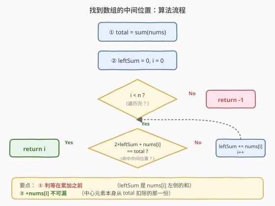

# 找到数组的中间位置

- **题目名称**：找到数组的中间位置
- **链接**：[1991. 找到数组的中间位置](https://leetcode.cn/problems/find-the-middle-index-in-array/)
- **难度**：简单
- **标签**：数组、前缀和

## 1. 题目概述

给你一个下标从 **0** 开始的整数数组 `nums`，请你找到 **最左边** 的中间位置 `middleIndex`（也就是所有可能中间位置下标最小的一个）。

中间位置 `middleIndex` 是满足

$$\text{nums}[0] + \text{nums}[1] + \cdots + \text{nums}[\text{middleIndex}-1] = \text{nums}[\text{middleIndex}+1] + \cdots + \text{nums}[n-1]$$

的数组下标。

- 若 `middleIndex == 0`，左边部分的和定义为 `0`。
- 若 `middleIndex == nums.length - 1`，右边部分的和定义为 `0`。
- 返回满足条件**最左边**的 `middleIndex`；若不存在，返回 `-1`。

> ⚠️ 注意：`nums[middleIndex]` **本身**既不计入左侧和，也不计入右侧和。

**示例 1**：

```text
输入：nums = [2,3,-1,8,4]
输出：3
解释：下标 3 之前的数字和为：2 + 3 + -1 = 4
      下标 3 之后的数字和为：4 = 4
```

**示例 2**：

```text
输入：nums = [1,-1,4]
输出：2
解释：下标 2 之前的数字和为：1 + -1 = 0
      下标 2 之后的数字和为：0
```

**示例 3**：

```text
输入：nums = [2,5]
输出：-1
解释：不存在符合要求的 middleIndex。
```

**示例 4**：

```text
输入：nums = [1]
输出：0
解释：下标 0 之前的数字和为：0
      下标 0 之后的数字和为：0
```

**约束条件**：

- $1 \le \text{nums.length} \le 100$
- $-1000 \le \text{nums}[i] \le 1000$

> 💡 **审题关键**：① 本题与主站 [724. 寻找数组的中心下标](../0701-0800/724_寻找数组的中心下标.md) **完全相同**，仅题面措辞差异；② `nums[i]` 可正可负可为零，单调性不成立，不能提前剪枝；③ `n \le 100` 规模极小，暴力 `O(n^2)` 也能过，但前缀和 `O(n)` 才是面试期望解法。

---

## 2. 解题思路

### 2.1 暴力思路：逐下标两侧求和

对每个下标 `i`，分别累加 `nums[0..i-1]` 得到左侧和 `leftSum`，累加 `nums[i+1..n-1]` 得到右侧和 `rightSum`，比较是否相等。共有 $n$ 个候选下标，每次两侧求和 $O(n)$，总复杂度 $O(n^2)$。

- **正确性**：穷举所有下标，逐一验证定义，显然正确。
- **效率**：$n \le 100$ 时约 $10^4$ 次运算，可过，但**每次重复累加左侧和**做了大量冗余计算——左移一格只是多加一个 `nums[i-1]`，完全可以滚动复用。

> ⚠️ 暴力的浪费在于「每个 `i` 都从头算两侧和」，把前缀信息丢了。只要维护一个滚动的 `leftSum`，再用总和消去右侧和，就能把 $O(n^2)$ 压成 $O(n)$。

### 2.2 核心观察：前缀和 + 总和消去右侧

![核心观察：左侧和等于右侧和等价于 2×左侧和 + nums[i] = 总和](../images/mididx_concept.svg)

关键直觉是把「右侧和」用**总和**与**左侧和**表达出来，避免每次重新累加右侧：

设 $\text{total} = \sum \text{nums}$，$\text{leftSum} = \text{nums}[0] + \cdots + \text{nums}[i-1]$。则

$$\text{rightSum} = \text{total} - \text{leftSum} - \text{nums}[i]$$

因为整个数组的和等于「左侧和 + `nums[i]` + 右侧和」。中间位置的条件 $\text{leftSum} = \text{rightSum}$ 代入即：

$$\text{leftSum} = \text{total} - \text{leftSum} - \text{nums}[i]$$

整理得判等条件为：

$$\boxed{2 \times \text{leftSum} + \text{nums}[i] = \text{total}}$$

于是只需**一次遍历**：维护一个滚动的 `leftSum`（初始为 $0$），每到下标 $i$ 先判定上述等式是否成立，成立就返回 $i$；否则把 `nums[i]` 累加进 `leftSum`，继续向右。整个过程**不需要显式构造前缀和数组**，空间 $O(1)$。

> 💡 **为什么 `leftSum` 初始为 $0$ 是对的？** 因为最左端下标 $i=0$ 时左侧没有元素，左侧和按题意就是 $0$。此时判等条件变为 $2 \times 0 + \text{nums}[0] = \text{total}$，即「`nums[0]` 是否等于整个数组剩余部分的和」，与示例 4（`nums = [1]`，`total = 1`，$2 \times 0 + 1 = 1$ ✅）完全一致。

### 2.3 算法流程图



整体只有一重 `for` 循环，`leftSum` 随 $i$ 单调右移，每轮做一次 $O(1)$ 的判等与累加：

1. **预处理**：一趟求 `total = sum(nums)`。
2. **滚动判定**（$i$ 从 $0$ 到 $n-1$）：
   - 若 $2 \times \text{leftSum} + \text{nums}[i] = \text{total}$，返回 $i$。
   - 否则 $\text{leftSum} \leftarrow \text{leftSum} + \text{nums}[i]$，继续。
3. **未命中**：循环结束仍无返回，则返回 $-1$。

### 2.4 示例演算

![示例演算：nums = [2,3,-1,8,4]，total = 16](../images/mididx_example_walkthrough.svg)

以**示例 1** `nums = [2,3,-1,8,4]`、$\text{total} = 2+3-1+8+4 = 16$ 为例逐步演算：

| $i$ | $\text{nums}[i]$ | $\text{leftSum}$ | 判定 $2 \times \text{leftSum} + \text{nums}[i]$ | 命中？ | 累加后 $\text{leftSum}$ |
|-----|------------------|-------------------|-------------------------------------------------|--------|--------------------------|
| 0 | 2  | 0 | $2 \times 0 + 2 = 2$    | $2 \ne 16$ ❌ | 2 |
| 1 | 3  | 2 | $2 \times 2 + 3 = 7$    | $7 \ne 16$ ❌ | 5 |
| 2 | -1 | 5 | $2 \times 5 + (-1) = 9$ | $9 \ne 16$ ❌ | 4 |
| 3 | 8  | 4 | $2 \times 4 + 8 = 16$   | $16 = 16$ ✅ | **返回 3** |

- $i=3$ 时左侧和 $2+3+(-1)=4$，右侧和 $4$，二者相等，故返回 $3$，与官方答案一致 ✓
- **示例 2** `nums = [1,-1,4]`，$\text{total}=4$：$i=0$ 判 $0+1=1\ne4$；$i=1$ 判 $2+(-1)=1\ne4$；$i=2$ 判 $2 \times 0 + 4 = 4$ ✅ 返回 $2$。
- **示例 3** `nums = [2,5]`，$\text{total}=7$：$i=0$ 判 $2\ne7$；$i=1$ 判 $2 \times 2 + 5 = 9 \ne 7$；返回 $-1$。

> 💡 **观察要点**：① 判等必须在累加**之前**——`leftSum` 表示的是 `nums[i]` **左侧**的和，若先累加再判等就把 `nums[i]` 错算进左侧；② `+ nums[i]` 这一项代表「中心元素本身」从总和中扣除的那一份，不可漏；③ `leftSum` 在 $i=2 \to 3$ 时从 $5$ 降到 $4$（因为加了 $-1$），说明元素可负时左侧和**非单调**，无法提前剪枝。

---

## 3. 参考代码

### C++

```cpp
class Solution {
public:
    int findMiddleIndex(vector<int>& nums) {
        int total = 0;
        for (int x : nums) total += x;        // 数组总和
        int leftSum = 0;
        for (int i = 0; i < (int)nums.size(); ++i) {
            if (2 * leftSum + nums[i] == total) return i;   // 命中中间位置
            leftSum += nums[i];               // 否则把 nums[i] 计入左侧和
        }
        return -1;                            // 遍历完仍无命中
    }
};
```

### Python

```python
class Solution:
    def findMiddleIndex(self, nums: list[int]) -> int:
        total = sum(nums)
        left_sum = 0
        for i, x in enumerate(nums):
            if 2 * left_sum + x == total:     # 命中中间位置
                return i
            left_sum += x                     # 否则把 nums[i] 计入左侧和
        return -1
```

> 💡 **写法要点**：① 先求 `total` 再一趟滚动判定，两趟 $O(n)$；② Python 用 `enumerate` 同时取下标与值，`left_sum` 滚动累加，无需前缀和数组；③ 本题与 [724](../0701-0800/724_寻找数组的中心下标.md) 的代码**完全一致**，函数名不同而已。

> ⚠️ **两个易错点**：
> 1. **判定要在累加之前**。`leftSum` 表示 `nums[i]` **左侧**的和，必须先用当前 `leftSum` 判等，再把 `nums[i]` 累加进去。
> 2. **`nums[i]` 不计入任一侧**。判等条件是 `2 * leftSum + nums[i] == total`，其中 `+ nums[i]` 不可漏——它正是「中心元素本身」从总和中扣掉的那一份。若误写成 `2 * leftSum == total`，会在 `nums[i] != 0` 时给出错误答案。

---

## 4. 复杂度分析

| 维度 | 复杂度 | 说明 |
|------|--------|------|
| 时间复杂度 | $O(n)$ | 一次遍历求 `total` + 一次遍历判定，共两次 $O(n)$ 线性扫描 |
| 空间复杂度 | $O(1)$ | 仅用 `total / leftSum / i` 等常数个变量，未开辟前缀和数组 |

> 💡 $n \le 100$，两趟共约 $200$ 次操作，远在时限内。即便数据规模放大到 $10^6$，$O(n)$ 的前缀和依然从容——这是它相对暴力 $O(n^2)$ 的根本优势。

---

## 5. 扩展：与 724 的关系及前缀和数组

### 5.1 本题与 724 的关系

本题与主站 [724. 寻找数组的中心下标](https://leetcode.cn/problems/find-pivot-index/) **完全相同**：题意、判等条件、算法流程一致，仅题面措辞（「中间位置」vs「中心下标」）与示例数据不同。LeetCode 官方也在 724 题面注明「本题与主站 724 题相同」。两题的解法、代码、复杂度完全互通，掌握一题即掌握两题。

### 5.2 为什么不用前缀和数组

本题也可以先构造前缀和数组 `prefix[i] = nums[0] + ... + nums[i-1]`（约定 `prefix[0] = 0`），再对每个 $i$ 判定 $\text{prefix}[i] = \text{total} - \text{prefix}[i] - \text{nums}[i]$，时间同为 $O(n)$，但空间升到 $O(n)$。

由于判等只依赖**当前** `leftSum`，历史前缀和无后续用途，滚动维护一个标量即可把空间压到 $O(1)$。这条「**能滚动就别开数组**」的原则也适用于 [303. 区域和检索](https://leetcode.cn/problems/range-sum-query-immutable/) 这类**多次查询**的场景——那里历史前缀和会被反复复用，才值得开数组缓存。

---

## 6. 面试要点

**Q1：为什么把右侧和用 `total - leftSum - nums[i]` 表达，而不是单独维护一个右侧和？**

> 单独维护右侧和需要先对整个数组求一次「后缀和」或从 `total` 里逐步扣减，逻辑分支多、易错。用总和消去右侧后，判等条件化为只含 `leftSum` 与 `nums[i]` 的等式 $2 \times \text{leftSum} + \text{nums}[i] = \text{total}$，**一次遍历、一个滚动变量**即可，代码最简、空间最优。

**Q2：`leftSum` 的初值为什么是 $0$ 而不是 `nums[0]`？**

> `leftSum` 表示 `nums[i]` **左侧**元素之和。当 $i = 0$ 时左侧没有元素，按题意左侧和为 $0$，所以初值取 $0$。若误取 `nums[0]`，相当于把中心元素本身塞进了左侧和，判等条件就错了。

**Q3：如果数组元素全为正数，能否提前剪枝？**

> 可以。元素全正时 `leftSum` 随 $i$ 单调递增，一旦 `leftSum > total / 2` 且当前 `nums[i] > 0`，后续 `leftSum` 只会更大，右侧和只会更小，不可能再相等，可提前返回 `-1`。但本题元素可负，单调性不成立，所以**不能**剪枝，必须扫完。

**Q4：判等条件中 `+ nums[i]` 的物理含义是什么？**

> 它表示「中心元素本身」要从总和中扣除。因为 $\text{total} = \text{leftSum} + \text{nums}[i] + \text{rightSum}$，当 $\text{leftSum} = \text{rightSum}$ 时 $\text{total} = 2 \times \text{leftSum} + \text{nums}[i]$。漏掉这一项就等于假设中心元素为 $0$，仅在 `nums[i] == 0` 时碰巧正确。

**Q5：本题与 724 有何区别？面试中该如何表述？**

> 二者**完全相同**——题意、算法、代码一致，仅题面措辞与示例数据不同。面试中只需说「这是经典的前缀和判等问题：用总和消去右侧和，滚动维护左侧和，一趟扫描命中即返回」，一套代码同时覆盖 724 与 1991。

> 💡 **一句话总结**：总和消去右侧和 $\Rightarrow$ 判等化为 $2 \times \text{leftSum} + \text{nums}[i] = \text{total}$ $\Rightarrow$ 滚动一趟 $O(n)$ 时间 $O(1)$ 空间。

---

## 7. 同类练习题

- [724. 寻找数组的中心下标](https://leetcode.cn/problems/find-pivot-index/)（[题解](../0701-0800/724_寻找数组的中心下标.md)）：与本题**完全同构**，同一套前缀和判等，两题共用一套代码
- [303. 区域和检索 - 数组不可变](https://leetcode.cn/problems/range-sum-query-immutable/)（[题解](../0301-0400/303_区域和检索 - 数组不可变.md)）：前缀和数组的经典应用，多次区间查询时才值得开数组
- [560. 和为 K 的子数组](https://leetcode.cn/problems/subarray-sum-equals-k/)（[题解](../0501-0600/560_和为K的子数组.md)）：前缀和 + 哈希求「恰好等于 K」的子数组个数，前缀和家族进阶
- [238. 除自身以外数组的乘积](https://leetcode.cn/problems/product-of-array-except-self/)（[题解](../0201-0300/238_除自身以外数组的乘积.md)）：把「前缀和」换成「前缀积 + 后缀积」，左右各扫一遍的对称结构
- [974. 和可被 K 整除的子数组](https://leetcode.cn/problems/subarray-sums-divisible-by-k/)（[题解](../0901-1000/974_和可被K整除的子数组.md)）：前缀和 + 同余定理，前缀和思想的进一步延伸
