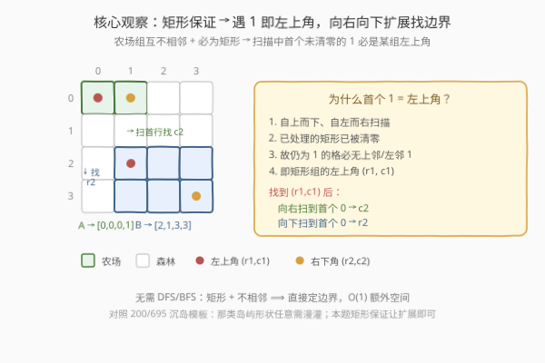
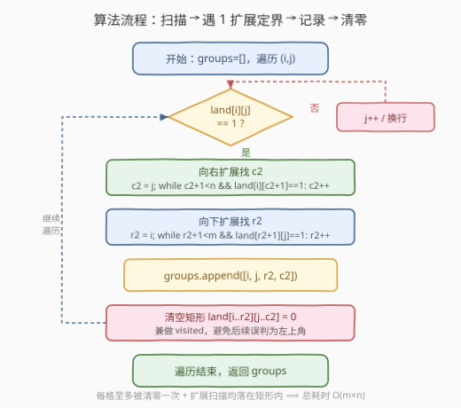
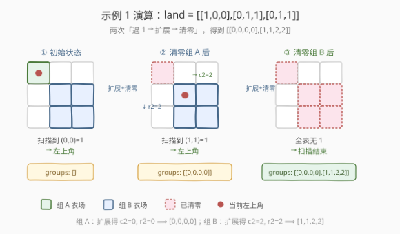

# 找到所有的农场组

- **题目名称**：找到所有的农场组
- **链接**：[1992. 找到所有的农场组](https://leetcode.cn/problems/find-all-groups-of-farmland/)
- **难度**：中等
- **标签**：数组、矩阵、扫描

## 1. 题目概述

给你一个下标从 **0** 开始、大小为 $m \times n$ 的二进制矩阵 `land`，其中 `0` 表示一单位森林土地，`1` 表示一单位农场土地。

农场土地以**矩形**的**农场组**形式存在，每个农场组**仅**包含农场土地，且题目保证**不会有两个农场组相邻**（即一个农场组中的任一格都不会与另一个农场组的任一格在四个方向上相邻）。

请找到**所有农场组**的左上角与右下角坐标，左上角 `(r1, c1)`、右下角 `(r2, c2)` 用长度为 4 的数组 `[r1, c1, r2, c2]` 表示。返回包含若干个这样子数组的二维数组，顺序任意；无农场组则返回空数组。

**示例 1**：

```text
输入：land = [[1,0,0],[0,1,1],[0,1,1]]
输出：[[0,0,0,0],[1,1,2,2]]
解释：第一个农场组左上角 land[0][0]，右下角 land[0][0]；
      第二个农场组左上角 land[1][1]，右下角 land[2][2]。
```

**示例 2**：

```text
输入：land = [[1,1],[1,1]]
输出：[[0,0,1,1]]
```

**示例 3**：

```text
输入：land = [[0]]
输出：[]
```

**约束条件**：

- $m == \text{land.length}$
- $n == \text{land[i].length}$
- $1 \le m, n \le 300$
- `land` 只含 `0` 和 `1`
- 农场组都是**矩形**形状

---

## 2. 解题思路

### 2.1 暴力思路：DFS/BFS 连通分量

最直觉的写法是套用 [200. 岛屿数量](../0101-0200/200_岛屿数量.md) 的沉岛模板：遍历矩阵，遇 `1` 启动 DFS/BFS 找出整个连通块，过程中维护 `min_r / min_c / max_r / max_c` 四个边界，连通块走完后把 `(min_r, min_c, max_r, max_c)` 加入答案，再把整块置 `0`（沉岛兼 visited）。

> 这种写法正确，但**完全没用到本题的两个关键保证**——「农场组是矩形」与「农场组互不相邻」。它把矩形当成任意形状的岛屿来漫灌，多开了 $O(m \times n)$ 的递归栈/队列空间，代码也偏重。其实只要利用「矩形 + 不相邻」，就能**免 DFS、免额外空间**，一遍扫描直接定界。

### 2.2 核心观察：扫描 + 扩展定界



关键洞察有两条：

1. **首个未清零的 `1` 必是某组的左上角**。按自上而下、自左而右扫描，凡是位于某组「内部」或「非左上角」的格子，其上方或左方必然仍是同组的 `1`；而处理更早的组时这些 `1` 已经被清零。因此扫描中**第一次遇到的 `1`**，其上方与左方都不可能有 `1`，必然是一个新组的左上角 `(r1, c1)`。

2. **矩形保证让边界可直接扩展**。从 `(r1, c1)` 出发：
   - **向右扫**首行 `land[r1][c]`，遇首个 `0` 或越界即停，得到右界 `c2`；
   - **向下扫**首列 `land[r][c1]`，遇首个 `0` 或越界即停，得到下界 `r2`。

   由于组是矩形且与其它组不相邻，首行从 `c1` 到 `c2` 全为 `1`、首列从 `r1` 到 `r2` 全为 `1`，且矩形内部必然全为 `1`，故 `(r1, c1, r2, c2)` 唯一确定整组。

> 💡 **为什么不需要 DFS**：[200. 岛屿数量](../0101-0200/200_岛屿数量.md) 里岛屿形状任意，必须四方向漫灌才能覆盖；本题的「矩形」保证把形状锁定成了轴对齐矩形，**两个方向的一维扫描**就足以定出全部边界。这是「题目约束决定算法复杂度」的典型例子——先吃透约束再选算法，而不是无脑套模板。

> ⚠️ **清零的职责**：找到一组后必须把矩形 `land[r1..r2][c1..c2]` 整片置 `0`。它兼做 visited 标记，保证后续扫描中这些格子不再被误当作新组的左上角。不清零的话，`(r1, c1+1)`、`(r1+1, c1)` 等内部格子仍为 `1`，会被重复触发。

### 2.3 算法流程图



整体步骤：

1. 初始化空 `groups`，双重循环遍历 `(i, j)`。
2. 若 `land[i][j] == 1`（必为某组左上角）：
   - 置 `c2 = j`，向右 `while c2+1 < n and land[i][c2+1] == 1: c2++`；
   - 置 `r2 = i`，向下 `while r2+1 < m and land[r2+1][j] == 1: r2++`；
   - `groups.append([i, j, r2, c2])`；
   - 把矩形 `land[i..r2][j..c2]` 全部置 `0`。
3. 遍历结束返回 `groups`。

### 2.4 示例演算

以**示例 1** `land = [[1,0,0],[0,1,1],[0,1,1]]` 演算：



| 步骤 | 扫描到的左上角 | 向右扩展 | 向下扩展 | 记录 | 清零后矩阵 |
|------|----------------|----------|----------|------|------------|
| ① | `(0,0)` | `land[0][1]=0` ⟹ `c2=0` | `land[1][0]=0` ⟹ `r2=0` | `[0,0,0,0]` | `[[0,0,0],[0,1,1],[0,1,1]]` |
| ② | `(1,1)` | `land[1][2]=1, land[1][3]` 越界 ⟹ `c2=2` | `land[2][1]=1, land[3][1]` 越界 ⟹ `r2=2` | `[1,1,2,2]` | `[[0,0,0],[0,0,0],[0,0,0]]` |
| ③ | 全表无 `1`，扫描结束 | — | — | — | 返回 `[[0,0,0,0],[1,1,2,2]]` |

**示例 2** `land = [[1,1],[1,1]]`：扫描到 `(0,0)=1`，向右 `c2=1`，向下 `r2=1`，记录 `[0,0,1,1]`，整片清零后返回 `[[0,0,1,1]]`。

**示例 3** `land = [[0]]`：无 `1`，返回 `[]`。

---

## 3. 参考代码

### C++

```cpp
class Solution {
public:
    vector<vector<int>> findFarmland(vector<vector<int>>& land) {
        int m = land.size(), n = land[0].size();
        vector<vector<int>> groups;
        for (int i = 0; i < m; i++) {
            for (int j = 0; j < n; j++) {
                if (land[i][j] == 1) {
                    int r2 = i, c2 = j;
                    while (c2 + 1 < n && land[i][c2 + 1] == 1) c2++;
                    while (r2 + 1 < m && land[r2 + 1][j] == 1) r2++;
                    groups.push_back({i, j, r2, c2});
                    for (int r = i; r <= r2; r++)
                        for (int c = j; c <= c2; c++)
                            land[r][c] = 0;
                }
            }
        }
        return groups;
    }
};
```

### Python

```python
class Solution:
    def findFarmland(self, land: List[List[int]]) -> List[List[int]]:
        m, n = len(land), len(land[0])
        groups = []
        for i in range(m):
            for j in range(n):
                if land[i][j] == 1:
                    r2, c2 = i, j
                    while c2 + 1 < n and land[i][c2 + 1] == 1:
                        c2 += 1
                    while r2 + 1 < m and land[r2 + 1][j] == 1:
                        r2 += 1
                    groups.append([i, j, r2, c2])
                    for r in range(i, r2 + 1):
                        for c in range(j, c2 + 1):
                            land[r][c] = 0
        return groups
```

> 💡 **清零的双重身份**：把矩形置 `0` 既是「标记已处理」又是「沉岛」，二者合一省去了 `visited` 矩阵。若面试官要求不改输入，可改用第 5 节的「左上角局部判定法」，或另开一个 `visited` 矩阵。

---

## 4. 复杂度分析

| 维度 | 复杂度 | 说明 |
|------|--------|------|
| 时间复杂度 | $O(m \times n)$ | 每个格子至多被「清零」一次；向右/向下扩展的扫描均落在所属矩形内部，合计每格至多被读一次，总耗时线性于格数 |
| 空间复杂度 | $O(1)$ | 仅用若干边界变量（`r2/c2` 等）；输出数组不计入辅助空间。原地清零，无需 `visited` 矩阵或 DFS 递归栈 |

> 对比 DFS/BFS 沉岛写法的 $O(m \times n)$ 空间（递归栈或队列最坏深度），本写法把空间压到 $O(1)$，这正是「利用矩形约束」的红利。

---

## 5. 扩展：左上角局部判定法（不改输入）

上面主解法靠「清零」来保证扫到的 `1` 必是左上角。其实左上角可以**纯靠局部邻域判定**，无需修改矩阵：

一个格子 `(i, j)` 是某农场组的左上角，当且仅当：

$$
\text{land}[i][j] = 1 \;\land\; (i = 0 \;\lor\; \text{land}[i-1][j] = 0) \;\land\; (j = 0 \;\lor\; \text{land}[i][j-1] = 0)
$$

即「自身为 `1`」且「上方无 `1`」且「左方无 `1`」。由于农场组互不相邻且为矩形，一个组的左上角必然同时满足这三个条件；而非左上角的格子要么自身为 `0`，要么上方或左方仍为 `1`。

找到左上角后，照样向右、向下扩展得 `c2 / r2`，**完全不必清零**——因为后续格子即便仍为 `1`，也会因「左方有 `1`」而被排除出左上角候选。

```cpp
class Solution {
public:
    vector<vector<int>> findFarmland(vector<vector<int>>& land) {
        int m = land.size(), n = land[0].size();
        vector<vector<int>> groups;
        for (int i = 0; i < m; i++) {
            for (int j = 0; j < n; j++) {
                if (land[i][j] == 1
                    && (i == 0 || land[i - 1][j] == 0)
                    && (j == 0 || land[i][j - 1] == 0)) {
                    int r2 = i, c2 = j;
                    while (c2 + 1 < n && land[i][c2 + 1] == 1) c2++;
                    while (r2 + 1 < m && land[r2 + 1][j] == 1) r2++;
                    groups.push_back({i, j, r2, c2});
                }
            }
        }
        return groups;
    }
};
```

> 💡 **两种写法等价**：清零法靠「抹掉已处理」让后续 `1` 自然成为左上角；局部判定法靠「邻域条件」直接识别左上角。前者改输入但代码更短，后者不改输入但每次多两次边界比较。面试中按是否允许修改输入取舍即可。同理也可以**只靠右下角**判定（下方无 `1` 且右方无 `1`），思路对称。

---

## 6. 面试要点

1. **为什么扫到的第一个 `1` 一定是左上角？**

   > 自上而下、自左而右扫描时，凡是非左上角的格子，其上方或左方必有同组的 `1`。而更早处理的组已被清零，所以**仍为 `1` 的格子**其上方与左方都不可能有 `1`，只能是某个新组的左上角。这正是「清零兼 visited」的妙处。

2. **这题和 200. 岛屿数量 有什么区别？**

   > 200 题岛屿形状任意，必须四方向 DFS/BFS 漫灌；本题农场组**保证是矩形且互不相邻**，两个方向的一维扫描即可定界，无需漫灌。同样是网格题，吃透「矩形」约束能把空间从 $O(m \times n)$ 压到 $O(1)$。这说明**先理解题目保证再选算法**，比无脑套模板更优。

3. **清零为什么必须清整片矩形，不能只清左上角？**

   > 清零兼做 visited。若只清 `(r1, c1)`，矩形内其余格子仍为 `1`，后续扫描到 `(r1, c1+1)` 时它上方为 `0`、左方为 `0`（因为 `(r1,c1)` 被清了），会被误判为新组左上角，导致重复计数。整片清零才能彻底抹除该组。

4. **能否不修改输入？**

   > 可以，用第 5 节的「左上角局部判定法」：`land[i][j]==1 && (i==0 || land[i-1][j]==0) && (j==0 || land[i][j-1]==0)` 识别左上角，无需清零。代价是每次多两次邻域比较，但仍是 $O(m \times n)$ 时间、$O(1)$ 空间。也可另开 `visited` 矩阵，但要多 $O(m \times n)$ 空间。

5. **时间复杂度为什么是 $O(m \times n)$ 而不是更高？扩展扫描不会重复读格子吗？**

   > 不会。向右扫描只读首行 `land[r1][c1..c2]`，向下扫描只读首列 `land[r1..r2][c1]`，这些格子在清零时也会被写。每个格子至多被「扩展时读一次 + 清零时写一次」，摊到全局仍是 $O(m \times n)$。即便用局部判定法不清零，每个格子也只被外层循环访问一次，扩展扫描只触碰各矩形的首行首列，合计不超过总格数。

---

## 7. 同类练习题

- [200. 岛屿数量](https://leetcode.cn/problems/number-of-islands/)（[题解](../0101-0200/200_岛屿数量.md)）：网格 DFS 沉岛母题；对照本题体会「形状任意需漫灌」vs「矩形保证可一维扫描定界」
- [695. 岛屿的最大面积](https://leetcode.cn/problems/max-area-of-island/)（[题解](../0601-0700/695_岛屿的最大面积.md)）：沉岛模板上叠加面积统计，体会「模板 + 一个累加维度」与本题「利用约束简化模板」的两种思路
- [1254. 统计封闭岛屿的数目](https://leetcode.cn/problems/number-of-closed-islands/)（[题解](../1201-1300/1254_统计封闭岛屿的数目.md)）：沉岛时叠加「是否触及边界」判定，与本题「叠加邻域判定识别左上角」思路同构
- [1020. 飞地的数量](https://leetcode.cn/problems/number-of-enclaves/)（[题解](../1001-1100/1020_飞地的数量.md)）：边界连通分量预处理 + 剩余计数，对比本题「预处理（清零）后再判定」的归约思想
- [1905. 统计子岛屿](https://leetcode.cn/problems/count-sub-islands/)（[题解](../1901-2000/1905_统计子岛屿.md)）：同区间网格题，沉岛时叠加「逐格对照另一张图」判定，与本题同属「网格扫描 + 一个额外判定维度」家族
