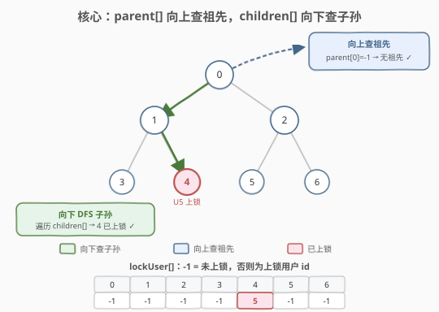
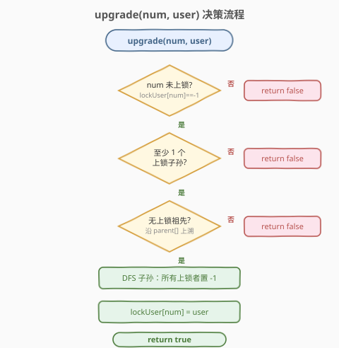
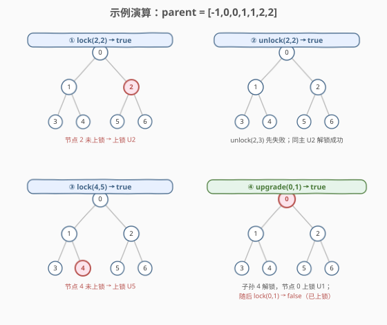

# 树上的操作

- **题目名称**：树上的操作
- **链接**：[1993. 树上的操作](https://leetcode.cn/problems/operations-on-tree/)
- **难度**：中等
- **标签**：设计、树、深度优先搜索

## 1. 题目概述

给你一棵 $n$ 个节点的树，编号 $0$ 到 $n-1$，以父节点数组 `parent` 给出（`parent[i]` 是节点 $i$ 的父节点，`parent[0] = -1` 表示根）。要求设计数据结构 `LockingTree`，支持三种操作：

| 操作 | 触发条件（全部满足才成功） | 成功时的副作用 |
|------|----------------------------|----------------|
| **lock(num, user)** | 节点 `num` 当前**未上锁** | 节点 `num` 被 `user` 上锁 |
| **unlock(num, user)** | 节点 `num` 当前**被 `user` 上锁**（同主） | 节点 `num` 变为未上锁 |
| **upgrade(num, user)** | ① `num` 未上锁；② `num` 至少有一个**上锁的子孙**（任意用户）；③ `num` **没有任何上锁的祖先** | 解锁 `num` 的**所有上锁子孙**，然后 `num` 被 `user` 上锁 |

成功返回 `true`，否则 `false`。

**示例 1**：

```text
输入：
["LockingTree", "lock", "unlock", "unlock", "lock", "upgrade", "lock"]
[[[-1, 0, 0, 1, 1, 2, 2]], [2, 2], [2, 3], [2, 2], [4, 5], [0, 1], [0, 1]]
输出：
[null, true, false, true, true, true, false]

解释（树形：0 为根，1、2 为其子，3、4 为 1 的子，5、6 为 2 的子）：
lock(2, 2)    → true   节点 2 未上锁 → 上锁 U2
unlock(2, 3)  → false  节点 2 被 U2 上锁，U3 无权解锁
unlock(2, 2)  → true   同主 U2 解锁节点 2
lock(4, 5)    → true   节点 4 未上锁 → 上锁 U5
upgrade(0, 1) → true   节点 0 未上锁、有上锁子孙(4)、无上锁祖先 → 子孙 4 解锁，节点 0 上锁 U1
lock(0, 1)    → false  节点 0 已被上锁
```

**约束条件**：

- $n = \text{parent.length}$，$2 \le n \le 2000$
- `parent[0] == -1`，其余 $0 \le \text{parent}[i] \le n-1$
- $0 \le \text{num} \le n-1$，$1 \le \text{user} \le 10^4$
- `parent` 表示一棵合法的树
- `lock`、`unlock`、`upgrade` 的调用**总共**不超过 $2000$ 次

---

## 2. 解题思路

### 2.1 暴力思路

最直观的做法是只维护一个 `lockedUser` 数组（`-1` 表示未上锁），每次操作按定义去查：

- `lock`/`unlock`：直接读写 `lockedUser[num]`，$O(1)$。
- `upgrade`：为了判定「有无上锁子孙」和「有无上锁祖先」，需要每次遍历整棵树或全数组——找祖先要从 `num` 沿 `parent` 上溯 $O(h)$，找子孙要遍历全部节点判定是否在 `num` 子树内 $O(n)$。

$n \le 2000$、操作总数 $\le 2000$，暴力的 $O(n \cdot \text{ops}) \approx 4 \times 10^6$ 其实**能过**。问题在于「找子孙」如果用「遍历全部节点 + 判祖先」实现，常数大且不优雅。**核心优化点是把树的双向遍历结构预处理出来**：向上靠 `parent[]`，向下靠 `children[]` 邻接表。

### 2.2 核心观察：双向邻接 + 锁主数组



关键洞察：**upgrade 的三个条件恰好对应两个方向的遍历**——「无上锁祖先」要向上走，「有上锁子孙 + 解锁子孙」要向下走。预处理两张表即可让两个方向都 $O(1)$ 跳转：

| 数据结构 | 类型 | 用途 | 服务的操作 |
|----------|------|------|-----------|
| **parent[]** | 整型数组（题目给定） | 由 `num` $O(1)$ 跳到父节点 | upgrade 条件③「无上锁祖先」：沿 `parent` 上溯 |
| **children[]** | 邻接表（`vector<vector<int>>`） | 由 `num` $O(1)$ 取所有子节点 | upgrade 条件②「有上锁子孙」+ 副作用「解锁所有子孙」：DFS 下溯 |
| **lockUser[]** | 整型数组（`-1` 表示未上锁） | $O(1)$ 读写节点锁状态与持锁人 | lock / unlock / upgrade 条件① |

> 💡 **为什么 `lock` 不需要查祖先/子孙？** 题目对 `lock` 的约束只有「节点未上锁」一项。祖先/子孙约束是 `upgrade` 专属的「升级门槛」——升级代价是清空整棵子树的锁，所以必须严苛；普通上锁只是单点操作，互不干扰。这个不对称是本题设计的精髓。

> ⚠️ **`unlock` 的「同主」判定**：不是「任意人都能解锁」，而是只有上锁者本人能解。因此 `lockUser[]` 存的是**用户 id** 而非布尔值，`unlock` 时比较 `lockUser[num] == user`。

### 2.3 算法流程图

`upgrade` 是本题的难点，决策流程如下：



三个操作的具体执行逻辑：

- **lock(num, user)**：若 `lockUser[num] == -1`，置 `lockUser[num] = user`，返回 `true`；否则 `false`。$O(1)$。
- **unlock(num, user)**：若 `lockUser[num] == user`，置 `lockUser[num] = -1`，返回 `true`；否则 `false`。$O(1)$。
- **upgrade(num, user)**：
  1. 若 `lockUser[num] != -1` → `false`（条件①）。
  2. DFS `children[num]`，统计上锁子孙；若一个都没有 → `false`（条件②）。
  3. 沿 `parent[]` 从 `num` 上溯到根，若任一祖先 `lockUser != -1` → `false`（条件③）。
  4. 全部满足：再 DFS 一遍 `children[num]`，把上锁子孙置 `-1`，最后 `lockUser[num] = user`，返回 `true`。

> 💡 **两趟 DFS 可合并为一趟**：第一次 DFS 时顺手把上锁子孙记录下来，判定通过后直接对记录的节点解锁，避免再扫一遍。下方代码采用合并写法。

### 2.4 示例演算

以题目示例 `parent = [-1, 0, 0, 1, 1, 2, 2]` 为例，树形如下，逐步演示锁状态变化：



关键步骤解读：

- **① lock(2,2)**：`lockUser[2] == -1` → 置 2，返回 `true`。节点 2 被用户 2 上锁。
- **② unlock(2,3)**：`lockUser[2] == 2 != 3` → `false`。用户 3 无权解锁。接着 `unlock(2,2)`：`lockUser[2] == 2` → 置 `-1`，返回 `true`，节点 2 恢复未上锁。
- **③ lock(4,5)**：`lockUser[4] == -1` → 置 5，返回 `true`。节点 4 被用户 5 上锁。
- **④ upgrade(0,1)**：检查 ①`lockUser[0]==-1` ✓；②DFS 子孙发现节点 4 上锁 ✓；③沿 `parent` 上溯 `parent[0]==-1`（根，无祖先）✓。三条件全满足 → 解锁节点 4，`lockUser[0]=1`，返回 `true`。随后 `lock(0,1)`：`lockUser[0]==1 != -1` → `false`。

> ⚠️ 注意 **④ 之后整棵子树只剩节点 0 一把锁**：upgrade 会清空 `num` 子树内的**所有**锁（无论谁上的），这是「升级」的代价——用一个高层锁替换掉散落在子孙上的多把锁。

---

## 3. 参考代码

### C++

```cpp
class LockingTree {
    vector<int> parent;
    vector<vector<int>> children;
    vector<int> lockUser;   // -1 表示未上锁，否则为持锁用户 id

  public:
    LockingTree(vector<int>& parent) : parent(parent), lockUser(parent.size(), -1) {
        int n = parent.size();
        children.resize(n);
        for (int i = 0; i < n; ++i)
            if (parent[i] != -1) children[parent[i]].push_back(i);
    }

    bool lock(int num, int user) {
        if (lockUser[num] != -1) return false;
        lockUser[num] = user;
        return true;
    }

    bool unlock(int num, int user) {
        if (lockUser[num] != user) return false;
        lockUser[num] = -1;
        return true;
    }

    bool upgrade(int num, int user) {
        // 条件①：num 未上锁
        if (lockUser[num] != -1) return false;

        // 条件③：无上锁祖先（沿 parent 上溯）
        for (int p = parent[num]; p != -1; p = parent[p])
            if (lockUser[p] != -1) return false;

        // 条件② + 副作用：收集上锁子孙，至少一个才升级；通过后全部解锁
        vector<int> lockedDesc;
        dfsCollect(num, lockedDesc);
        if (lockedDesc.empty()) return false;
        for (int d : lockedDesc) lockUser[d] = -1;
        lockUser[num] = user;
        return true;
    }

  private:
    // DFS 遍历 num 的子孙（不含 num 自身），收集所有上锁节点
    void dfsCollect(int num, vector<int>& lockedDesc) {
        for (int c : children[num]) {
            if (lockUser[c] != -1) lockedDesc.push_back(c);
            dfsCollect(c, lockedDesc);
        }
    }
};
```

### Python

```python
class LockingTree:
    def __init__(self, parent: List[int]):
        self.parent = parent
        self.lock_user = [-1] * len(parent)
        self.children = [[] for _ in range(len(parent))]
        for i, p in enumerate(parent):
            if p != -1:
                self.children[p].append(i)

    def lock(self, num: int, user: int) -> bool:
        if self.lock_user[num] != -1:
            return False
        self.lock_user[num] = user
        return True

    def unlock(self, num: int, user: int) -> bool:
        if self.lock_user[num] != user:
            return False
        self.lock_user[num] = -1
        return True

    def upgrade(self, num: int, user: int) -> bool:
        # 条件①
        if self.lock_user[num] != -1:
            return False
        # 条件③：无上锁祖先
        p = self.parent[num]
        while p != -1:
            if self.lock_user[p] != -1:
                return False
            p = self.parent[p]
        # 条件② + 副作用：收集并解锁上锁子孙
        locked_desc = []
        self._dfs_collect(num, locked_desc)
        if not locked_desc:
            return False
        for d in locked_desc:
            self.lock_user[d] = -1
        self.lock_user[num] = user
        return True

    def _dfs_collect(self, num: int, locked_desc: List[int]) -> None:
        for c in self.children[num]:
            if self.lock_user[c] != -1:
                locked_desc.append(c)
            self._dfs_collect(c, locked_desc)
```

> 💡 **语言选择**：C++ 的 `vector<vector<int>>` 构建邻接表简洁高效；Python 用列表推导同样直观。两者都用 `-1` 哨兵表示未上锁，避免额外布尔数组。注意 `_dfs_collect` 不访问 `num` 自身——子孙定义不含节点本身。

---

## 4. 复杂度分析

| 维度 | 操作 | 复杂度 | 说明 |
|------|------|--------|------|
| 时间复杂度 | init | $O(n)$ | 遍历 `parent` 建邻接表 + 初始化 `lockUser` |
| 时间复杂度 | lock | $O(1)$ | 一次数组读写 |
| 时间复杂度 | unlock | $O(1)$ | 一次比较 + 一次写 |
| 时间复杂度 | upgrade | $O(n)$ | 祖先上溯 $O(h) \le O(n)$ + 子孙 DFS $O(n)$（一趟合并） |
| 空间复杂度 | 全部 | $O(n)$ | `parent` $O(n)$ + `children` $O(n)$（边数 $n-1$）+ `lockUser` $O(n)$ |

> ⚠️ upgrade 的最坏 $O(n)$ 出现在 `num` 为根且整棵树退化为链时。$n \le 2000$、操作总数 $\le 2000$，总计 $\le 4 \times 10^6$ 次操作，远在时间限制内。若 $n$ 与操作数都到 $10^5$ 级别，则需引入子树 DFS 序 + 线段树/树状数组维护「子树内是否有锁」与「祖先链是否有锁」，把 upgrade 降到 $O(\log n)$。

---

## 5. 扩展：大规模下的子树查询优化

若 $n$ 与操作数提升到 $10^5$，单次 upgrade 的 $O(n)$ DFS 会超时。优化思路是把树上的「子树」与「祖先链」两类查询转化为线性结构上的区间查询：

- **子树 → 区间**：对树做一次 DFS 序（进/出时间戳），节点 `num` 的子树对应一段连续区间 $[\text{tin}[num], \text{tout}[num]]$。「有上锁子孙」等价于该区间内是否存在 `lockUser != -1`，「解锁所有子孙」等价于区间置 `-1`——用线段树维护区间非 `-1` 元素计数即可在 $O(\log n)$ 完成判定与批量清空。
- **祖先链 → 前缀**：祖先链上是否有锁，可用树上前缀和或「最近上锁祖先」指针（上锁时更新、解锁时回退到更上层）维护，$O(1)$ 或 $O(\log n)$ 查询。

这套改造与 [1938. 查询最大基因差](../1901-2000/1938_查询最大基因差.md) 的离线 DFS + Trie 思想同源——都是把树形查询拍平到线性结构上再借助数据结构加速。本题规模小，无需如此复杂，但理解此升级路径有助于应对面试中的「数据范围变大怎么办」追问。

---

## 6. 面试要点

1. **`lock` 为什么不查祖先和子孙？**
   - 题目对 `lock` 只要求「节点未上锁」。祖先/子孙约束是 `upgrade` 专属门槛——升级会清空整棵子树的锁，代价大，故门槛严苛；普通上锁是单点操作，互不干扰。这种不对称是设计精髓，面试时务必说清。

2. **`unlock` 为什么要校验「同主」？**
   - `unlock(num, user)` 只有在 `lockUser[num] == user` 时才成功。因此 `lockUser[]` 必须存用户 id 而非布尔值，比较时直接判等。常见错误是用布尔数组导致无法区分持锁人。

3. **upgrade 三个条件的检查顺序有讲究吗？**
   - 有。先查 $O(1)$ 的条件①（未上锁），再查 $O(h)$ 的条件③（无上锁祖先，沿 `parent` 上溯），最后查 $O(n)$ 的条件②（有上锁子孙，DFS）。把便宜的检查前置可提前剪枝，避免无谓的 DFS。不过条件②的 DFS 结果还要用于副作用（解锁子孙），所以即便顺序调整也要在最后统一执行清空。

4. **DFS 收集子孙时为什么要合并两趟？**
   - 第一次 DFS 既要判定「至少一个上锁子孙」，又要记录具体哪些子孙需解锁。若分两趟（先判定再清空），子树会被扫两遍。合并写法：DFS 时把上锁子孙压入 `lockedDesc`，判定通过后直接遍历 `lockedDesc` 解锁，常数更优。

5. **如果操作数与 $n$ 都到 $10^5$，如何优化 upgrade？**
   - 用 DFS 序把子树映射为连续区间，线段树维护区间内「非 `-1` 计数」，子树判定与批量清空 $O(\log n)$；祖先链用「最近上锁祖先」指针 $O(1)$ 查询。详见第 5 节扩展。

---

## 7. 同类练习题

- [1971. 寻找图中是否存在路径](https://leetcode.cn/problems/find-if-path-exists-in-graph/)（[题解](../1901-2000/1971_寻找图中是否存在路径.md)）：树/图的邻接表建图基础，对比本题 `children[]` 的构建
- [236. 二叉树的最近公共祖先](https://leetcode.cn/problems/lowest-common-ancestor-of-a-binary-tree/)（[题解](../0201-0300/236_二叉树最近公共祖先.md)）：树的后序 DFS + 祖先链判定，与本题 upgrade 的「上溯祖先」同源
- [1938. 查询最大基因差](https://leetcode.cn/problems/maximum-genetic-difference-query/)（[题解](../1901-2000/1938_查询最大基因差.md)）：树形查询拍平到 DFS 序 + Trie，承接第 5 节大规模优化思路
- [146. LRU 缓存](https://leetcode.cn/problems/lru-cache/)（[题解](../0101-0200/146_LRU缓存.md)）：设计题招牌，哈希 + 双向链表分工，对比本题「三表各司其职」的设计范式
