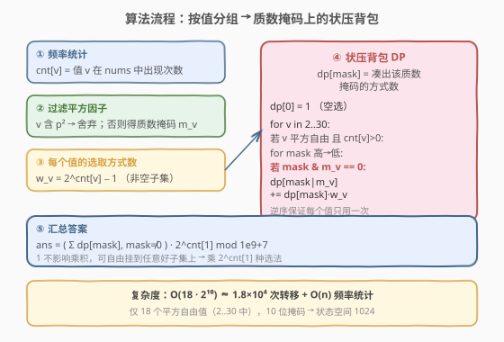
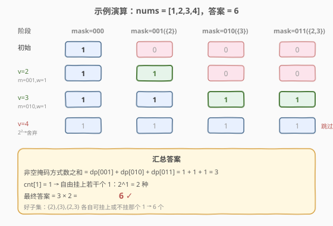

# LeetCode 好子集的数目 题解

## 1. 题目概述

- **标题 / 题号**：好子集的数目（#1994，hard）
- **链接**：https://leetcode.cn/problems/the-number-of-good-subsets/
- **难度**：困难
- **标签**：位运算、动态规划、状态压缩、数学、质因数分解

**题意**：给你一个整数数组 `nums`。如果 `nums` 的一个子集中，所有元素的乘积可以表示为一个或多个**互不相同的质数**的乘积，那么称它为**好子集**。

- 换句话说，好子集的乘积必须是一个**无平方因子的数**（square-free number）：每个质数在乘积中至多出现一次。
- 例如 `nums = [1, 2, 3, 4]`：`[2, 3]`、`[1, 2, 3]`、`[1, 3]`、`[2]`、`[2, 3]`、`[3]` 是好子集；`[1, 4]` 和 `[4]` 不是，因为乘积 $4 = 2 \times 2$ 含重复质数。

两个子集只要删除的**下标不同**就视为不同子集（即使元素值完全一样）。返回不同好子集的数目对 $10^9 + 7$ 取余的结果。

**示例 1**：

```text
输入：nums = [1,2,3,4]
输出：6
解释：好子集为 [1,2]、[1,2,3]、[1,3]、[2]、[2,3]、[3]。
```

**示例 2**：

```text
输入：nums = [4,2,3,15]
输出：5
解释：好子集为 [2]、[2,3]、[2,15]、[3]、[15]。
```

**约束**：

- $1 \le \text{nums.length} \le 10^5$
- $1 \le \text{nums[i]} \le 30$

> ⚠️ **关键信号**：`nums[i] ≤ 30` 是本题的「题眼」。$30$ 以内的质数只有 $2, 3, 5, 7, 11, 13, 17, 19, 23, 29$ 共 **10 个**。这意味着每个元素的质因数构成可用一个 **10 位掩码** 表示，状态空间仅 $2^{10} = 1024$——典型的状压 DP 甜区。同时 $n$ 高达 $10^5$，但值域极小，必须「按值分组」而非按元素枚举。

## 2. 解题思路

### 2.1 暴力思路

枚举 `nums` 的所有 $2^n$ 个子集，对每个子集算乘积并判定是否为无平方因子数。

- **正确性**：穷举显然覆盖所有子集。
- **效率**：$n = 10^5$ 时 $2^n$ 是天文数字，完全不可行；且子集乘积会膨胀到极大整数，无法存储。

> ⚠️ 暴力的浪费在于「按元素枚举」。值域只有 $1 \sim 30$，相同值的元素在乘积上贡献相同——应当**按值聚合**，把「$n$ 个元素的选/不选」压缩成「$18$ 类平方自由值的选/不选」。

### 2.2 核心观察：质数位掩码 + 平方自由过滤


**第一步：哪些值根本不能出现在好子集里？**

好子集的乘积必须无平方因子，因此**单个元素本身必须无平方因子**（否则它自带 $p^2$，乘积必然含 $p^2$）。一个数无平方因子，等价于它的质因数分解中每个质数只出现一次，称为**平方自由数**（square-free）。

$1 \sim 30$ 中含平方因子（$p^2 \mid v$）的数直接淘汰：

$$4=2^2,\ 8=2^3,\ 9=3^2,\ 12=2^2{\cdot}3,\ 16=2^4,\ 18=2{\cdot}3^2,\ 20=2^2{\cdot}5,\ 24=2^3{\cdot}3,\ 25=5^2,\ 27=3^3,\ 28=2^2{\cdot}7$$

剩下的**平方自由值**（$v \ge 2$）只有 18 个：$2, 3, 5, 6, 7, 10, 11, 13, 14, 15, 17, 19, 21, 22, 23, 26, 29, 30$。

**第二步：用 10 位掩码记录每个值使用的质数集合。**

30 以内共 10 个质数 $p_0, \dots, p_9$。对平方自由值 $v$，定义其质数掩码

$$m_v = \sum_{i:\, p_i \mid v} 2^i$$

例如 $m_2 = 0000000001_2$，$m_6 = m_{2\cdot3} = 0000000011_2$，$m_{30} = m_{2\cdot3\cdot5} = 0000000111_2$。

**第三步：好子集 ⇔ 选出若干平方自由值，它们的掩码两两按位与为 0。**

两个值能共存当且仅当它们不共享任何质数，即 $m_a\ \&\ m_b = 0$。把所有选中值的掩码按位或起来得到子集的总掩码 $M$，则：

- $M \ne 0$（乘积至少含一个质数，否则乘积为 1，不是「一个或多个质数的乘积」）；
- 选中过程中任意两值掩码不相交（保证无平方因子）。

> 💡 **值 1 的特殊性**：$1$ 没有质因数，$m_1 = 0$。它不影响乘积，也不与任何值冲突。所以 $1$ 可以**自由挂载**到任意一个好子集上（选 0 个、1 个、…、全部 `cnt[1]` 个）。但**全选 1**（乘积仍为 1）不是好子集——所以 $1$ 只能作为「附加项」，不能单独成好子集。最终答案乘上 $2^{\text{cnt}[1]}$ 即可（每个 1 选或不选）。

### 2.3 算法流程图



**模型：分组背包 + 状压 DP。** 把 18 个平方自由值看成 18 组「物品」，每组里要么不选该值、要么选该值的若干次出现（同值的不同下标算不同子集，所以选 $k$ 个出现有 $\binom{\text{cnt}[v]}{k}$ 种，非空子集共 $2^{\text{cnt}[v]} - 1$ 种）。

定义 `dp[mask]` = 当前已考虑的平方自由值中，凑出总质数掩码为 `mask` 的方式数。

- **初始化**：`dp[0] = 1`（空选）。
- **对每个平方自由值** $v$（$cnt[v] > 0$），其掩码 $m_v$、选取方式数 $w_v = 2^{\text{cnt}[v]} - 1$：
  - **逆序**枚举 `mask`（从 $(1\ll 10)-1$ 到 $0$）；
  - 若 `mask & m_v == 0`（与已选质数不冲突），则
    $$\text{dp}[\text{mask} \mid m_v]\ \mathrel{+}=\ \text{dp}[\text{mask}] \cdot w_v$$
- **答案**：$\displaystyle\left(\sum_{\text{mask} \ne 0} \text{dp}[\text{mask}]\right) \cdot 2^{\text{cnt}[1]} \bmod (10^9{+}7)$。

> ⚠️ **为什么逆序枚举？** 把 $m_v$ 并入 `mask` 得到的新状态 `mask | m_v` 数值上**严格大于** `mask`（多了若干置 1 的位）。逆序（高 → 低）时，被写入的更大下标在本轮已处理过，不会再作为源状态被读取——这就保证每个值 $v$ 在一轮内**最多贡献一次**，不会「自己和自己合并」导致重复使用。这与 0-1 背包逆序枚举容量的原理完全一致。

> 💡 **为什么 $w_v = 2^{\text{cnt}[v]} - 1$ 而不是 $\text{cnt}[v]$？** 同一个值 $v$ 在 `nums` 中可能出现多次（不同下标）。选中「至少一个」$v$ 的下标子集有 $2^{\text{cnt}[v]} - 1$ 种，它们对乘积贡献相同（都是 $m_v$），但在「不同子集」意义下是不同答案——题目正是按这下标区分的。

### 2.4 示例演算

以 `nums = [1, 2, 3, 4]` 为例（`cnt = {1:1, 2:1, 3:1, 4:1}`）：



| 阶段 | 处理 | dp[000] | dp[001] | dp[010] | dp[011] | 说明 |
|------|------|---------|---------|---------|---------|------|
| 初始 | — | 1 | 0 | 0 | 0 | 空选 |
| v=2 | $m=001, w=1$ | 1 | 1 | 0 | 0 | mask=000 → 001，乘 1 |
| v=3 | $m=010, w=1$ | 1 | 1 | 1 | 1 | 000→010、001→011 |
| v=4 | $2^2$ 舍弃 | 1 | 1 | 1 | 1 | 跳过 |

- 非空掩码方式数之和 $= 1 + 1 + 1 = 3$（对应乘积 $\{2\}, \{3\}, \{2\cdot3\}$ 三类）。
- $\text{cnt}[1] = 1$，自由挂 1 的方式 $= 2^1 = 2$。
- 最终答案 $= 3 \times 2 = 6$，与示例一致。✓

> 💡 **观察要点**：① `v=4` 因含 $2^2$ 直接跳过，不进入 DP；② `v=3` 处理时同时由 `mask=000` 和 `mask=001` 出发，分别落到 `010` 和 `011`，体现了「与已有掩码不相交才能合并」；③ 三个非空掩码 $001, 010, 011$ 各贡献 1，恰好对应「以不同质数集合为乘积」的三类好子集，再乘 1 的挂载方式得 6。

## 3. 参考代码

### Python

```python
class Solution:
    def numberOfGoodSubsets(self, nums: List[int]) -> int:
        MOD = 10**9 + 7
        primes = [2, 3, 5, 7, 11, 13, 17, 19, 23, 29]

        def mask_of(v: int) -> int:
            m = 0
            for i, p in enumerate(primes):
                if v % (p * p) == 0:          # 含 p²，直接淘汰
                    return -1
                if v % p == 0:
                    m |= 1 << i
            return m

        cnt = [0] * 31
        for x in nums:
            cnt[x] += 1

        dp = [0] * (1 << 10)
        dp[0] = 1
        for v in range(2, 31):
            if cnt[v] == 0:
                continue
            mv = mask_of(v)
            if mv < 0:
                continue
            wv = (pow(2, cnt[v], MOD) - 1) % MOD   # 非空下标子集数
            for mask in range((1 << 10) - 1, -1, -1):   # 逆序：每个值只用一次
                if dp[mask] and (mask & mv) == 0:
                    dp[mask | mv] = (dp[mask | mv] + dp[mask] * wv) % MOD

        total = sum(dp[1:]) % MOD                  # 排除 mask=0（空选/仅 1）
        return total * pow(2, cnt[1], MOD) % MOD   # 自由挂上若干个 1
```

### C++

```cpp
class Solution {
public:
    int numberOfGoodSubsets(vector<int>& nums) {
        const int MOD = 1e9 + 7;
        int primes[10] = {2, 3, 5, 7, 11, 13, 17, 19, 23, 29};

        // maskOf[v]: v 的质数掩码；-1 表示含平方因子，不可用
        int maskOf[31];
        for (int v = 1; v <= 30; ++v) {
            int m = 0; bool ok = true;
            for (int i = 0; i < 10; ++i) {
                int p = primes[i];
                if (v % (p * p) == 0) { ok = false; break; }
                if (v % p == 0) m |= 1 << i;
            }
            maskOf[v] = ok ? m : -1;
        }

        int cnt[31] = {0};
        for (int x : nums) cnt[x]++;

        // 预处理 2 的幂（cnt[v] 最大 1e5）
        vector<long long> pow2(nums.size() + 1);
        pow2[0] = 1;
        for (int i = 1; i <= (int)nums.size(); ++i)
            pow2[i] = pow2[i - 1] * 2 % MOD;

        long long dp[1 << 10] = {0};
        dp[0] = 1;
        for (int v = 2; v <= 30; ++v) {
            if (cnt[v] == 0) continue;
            int mv = maskOf[v];
            if (mv < 0) continue;
            long long wv = (pow2[cnt[v]] - 1 + MOD) % MOD;   // 非空下标子集数
            for (int mask = (1 << 10) - 1; mask >= 0; --mask) { // 逆序
                if (dp[mask] == 0) continue;
                if ((mask & mv) == 0) {
                    dp[mask | mv] = (dp[mask | mv] + dp[mask] * wv) % MOD;
                }
            }
        }

        long long total = 0;
        for (int mask = 1; mask < (1 << 10); ++mask)
            total = (total + dp[mask]) % MOD;
        total = total * pow2[cnt[1]] % MOD;                  // 自由挂上若干个 1
        return (int)total;
    }
};
```

> 💡 **代码要点**：① `mask_of` 在遇到 $p^2 \mid v$ 时立即返回 $-1$，把 11 个含平方因子值一次性过滤；② `wv = 2^cnt[v] - 1` 用快速幂（Python 内置 `pow` 三参形式）或预处理的幂数组计算，注意 `(x - 1 + MOD) % MOD` 防负数；③ 逆序枚举 `mask` 是 0-1 背包的经典写法，保证每个值至多用一次；④ `if dp[mask] == 0: continue` 跳过不可达状态，常数优化明显；⑤ 答案先对 `mask != 0` 求和，再乘 $2^{\text{cnt}[1]}$——两者顺序无关，因为 1 的掩码为 0 不影响 `mask` 取值。

## 4. 复杂度分析

| 维度 | 复杂度 | 说明 |
|------|--------|------|
| 时间复杂度 | $O(n + 18 \cdot 2^{10})$ | 频率统计 $O(n)$；DP 对 18 个平方自由值各扫 1024 个掩码 |
| 空间复杂度 | $O(2^{10}) = O(1)$ | `dp` 数组大小 1024；幂数组 $O(n)$ 可省（用快速幂则 $O(1)$） |

$18 \times 1024 \approx 1.8 \times 10^4$ 次转移，加上 $n = 10^5$ 的频率统计，总耗时在毫秒级。值域 $30$ 是本题能用状压 DP 的根本原因——若值域放宽到 $10^9$，质数个数爆炸，此法失效。

## 5. 扩展：为什么不能用「按元素」的状压 DP？

直觉上状压 DP 要求状态数 $2^k$ 可控。本题 $n = 10^5$，若按「元素选/不选」做状压，状态数 $2^{10^5}$ 显然不可行。能按下标状压的前提是 $n \le 20$ 左右（如 [526. 优美的排列](https://leetcode.cn/problems/beautiful-arrangement/) 中 $n \le 15$）。

本题的关键转换是**按值分组**：值域 $1 \sim 30$ 极小，相同值的元素在「乘积贡献」上等价，于是把 $10^5$ 个元素的选/不选压缩成 $18$ 类值的选/不选，再用 $10$ 位质数掩码做状态。这是「**大 $n$ 小值域**」类计数题的通用套路：先按值分桶聚合，再在值域或其派生维度（如质数掩码）上做 DP。

> 💡 另一种等价视角：把 18 个平方自由值看作「**多维费用 0-1 背包**」——每个质数是一维容量（0/1），每个值占用其掩码对应的那几维。答案即所有非空占用方案数。这与 [474. 一和零](https://leetcode.cn/problems/ones-and-zeroes/)（两维费用 0-1 背包）同构，只是本题维度上升到 10 维，故必须用位掩码而非数组表达状态。

## 6. 面试要点

**Q1：为什么 `nums[i] ≤ 30` 是状压 DP 的信号？**

> $30$ 以内只有 10 个质数，每个值的质因数构成可用 10 位掩码编码，状态空间 $2^{10} = 1024$ 落在可承受范围。一般「值域小 + 计数/最值 + 选/不选」三要素齐备时，优先考虑在值域派生维度（如质数掩码）上状压。

**Q2：为什么含平方因子的值要直接淘汰，而不是让它「少用一次」？**

> 好子集要求乘积无平方因子，即每个质数在**整体乘积**中至多出现一次。若某元素自带 $p^2$，无论怎么选它都会让 $p$ 至少出现两次，无法被其他选择「抵消」。所以含平方因子的值**根本不能出现在任何好子集里**，直接过滤。

**Q3：值 1 为什么单独处理，不放进 DP？**

> $m_1 = 0$，并入 DP 后转移变成 `dp[mask | 0] += dp[mask] * w_1`，即对每个 `mask` 自乘 $(1 + w_1) = 2^{\text{cnt}[1]}$——等价于最后整体乘 $2^{\text{cnt}[1]}$。但 1 的掩码为 0 会与 `mask=0`（空选）状态混叠，且 1 单独不成好子集（乘积为 1）。单独拎出来用 $2^{\text{cnt}[1]}$ 处理，状态语义最干净。

**Q4：逆序枚举 `mask` 的必要性？能否正序？**

> 必须逆序。把 $m_v$ 并入得到的 `mask | m_v` 严格大于 `mask`，逆序时被更新的更大下标本轮已处理过，不会再次作为源状态读取，从而每个值只用一次。正序则会让「刚加入 $v$ 的新状态」立刻被同轮再次转移，相当于 $v$ 被用了多次——这是 0-1 背包（逆序）与完全背包（正序）的经典区别。

**Q5：如何处理答案取模与负数？**

> $w_v = 2^{\text{cnt}[v]} - 1$ 在 $2^{\text{cnt}[v]} \bmod \text{MOD}$ 为 0 时会得到 $-1$，故写作 `(pow - 1 + MOD) % MOD`。C++ 中 `dp[mask] * wv` 可能超 `int`，用 `long long` 承载中间乘法，每次转移后立即 `% MOD`。

> 💡 **一句话总结**：小值域 → 10 位质数掩码 → 状压背包；含平方因子值过滤、值 1 单独挂载、逆序枚举防重复，$O(n + 18 \cdot 2^{10})$ 收工。

## 同类练习题

| # | 题目 | 与本题的关联 |
|---|------|-------------|
| 526 | [优美的排列](https://leetcode.cn/problems/beautiful-arrangement/)（[站内题解](../0501-0600/526_优美的排列.md)） | 状压 DP 母题，$n \le 15$ 直接按下标集合做掩码，对照本题「值域小→派生掩码」的间接状压 |
| 474 | [一和零](https://leetcode.cn/problems/ones-and-zeroes/)（[站内题解](../0401-0500/474_一和零.md)） | 多维费用 0-1 背包，与本题「每个质数是一维 0/1 容量」结构同构，对照维度从 2 升到 10 时用位掩码替代数组 |
| 416 | [分割等和子集](https://leetcode.cn/problems/partition-equal-subset-sum/)（[站内题解](../0301-0400/416_分割等和子集.md)） | 0-1 背包计数/判定母题，逆序枚举容量的同一套模板，承接「按值分组 + 选/不选」 |
| 204 | [计数质数](https://leetcode.cn/problems/count-primes/)（[站内题解](../0201-0300/204_计数质数.md)） | 质数筛基础，承接 $\le 30$ 质数枚举与「平方因子判定」的数论前置 |
| 1774 | [最接近目标价格的甜点成本](https://leetcode.cn/problems/closest-dessert-cost/) | 小值域下「按基底/配料分组选/不选」的背包型搜索/DP，与本题「按值分组」思路相通 |
