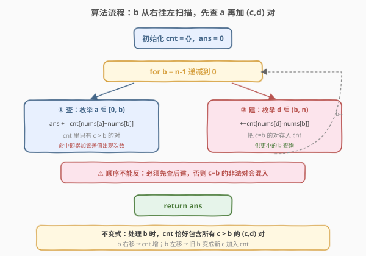
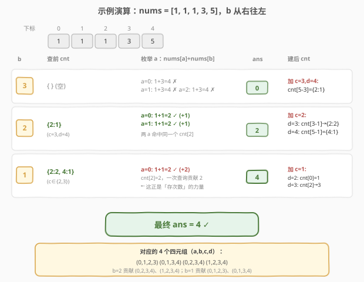

# LeetCode 统计特殊四元组 题解

## 1. 题目概述

- **标题 / 题号**：统计特殊四元组（#1995，easy）
- **链接**：https://leetcode.cn/problems/count-special-quadruplets/
- **难度**：简单
- **标签**：数组、哈希表、枚举

**题意**：给定一个 **0 下标** 整数数组 `nums`，统计满足以下条件的四元组 `(a, b, c, d)` 的**个数**：

- $\text{nums}[a] + \text{nums}[b] + \text{nums}[c] == \text{nums}[d]$
- $a < b < c < d$

**示例 1**：

```text
输入：nums = [1,2,3,6]
输出：1
解释：唯一的特殊四元组 (0, 1, 2, 3)：1 + 2 + 3 == 6。
```

**示例 2**：

```text
输入：nums = [3,3,6,4,5]
输出：0
解释：不存在满足条件的四元组。
```

**示例 3**：

```text
输入：nums = [1,1,1,3,5]
输出：4
解释：四个特殊四元组：
  (0, 1, 2, 3) → 1 + 1 + 1 == 3
  (0, 1, 3, 4) → 1 + 1 + 3 == 5
  (0, 2, 3, 4) → 1 + 1 + 3 == 5
  (1, 2, 3, 4) → 1 + 1 + 3 == 5
```

**约束**：

- $4 \leq \text{nums.length} \leq 50$
- $1 \leq \text{nums}[i] \leq 100$

> 💡 数据规模极小（$n \leq 50$），四重循环暴力 $O(n^4) \approx 6.25 \times 10^6$ 也能过。但本题的精髓在于：把 $O(n^4)$ 一路优化到 $O(n^2)$，思路与 [454. 四数相加 II](../0401-0500/454_四数相加%20II.md) 的「Meet in the Middle」一脉相承。

## 2. 解题思路

### 2.1 暴力思路：四重循环枚举

最直接的做法：四重循环枚举所有 $(a, b, c, d)$ 组合，判断是否满足 $a < b < c < d$ 且三数之和等于第四数。

```text
for a in 0..n:
    for b in a+1..n:
        for c in b+1..n:
            for d in c+1..n:
                if nums[a]+nums[b]+nums[c]==nums[d]: ans++
```

时间复杂度 $O(n^4)$，$n=50$ 时约 $6.25 \times 10^6$ 次运算，刚好能过但毫无技巧。问题在于：四个下标同时枚举，没有利用「等式可拆分」的结构。

### 2.2 核心观察：分组 + 哈希（Meet in the Middle）

![核心思路：等式拆成左右两组，左半存 nums[a]+nums[b]，右半查 nums[d]-nums[c]](../images/csq_meet_middle.svg)

**关键转换**：把等式 $\text{nums}[a] + \text{nums}[b] + \text{nums}[c] = \text{nums}[d]$ 移项：

$$
\text{nums}[a] + \text{nums}[b] = \text{nums}[d] - \text{nums}[c]
$$

左侧只涉及 $(a, b)$，右侧只涉及 $(c, d)$，且 $a < b < c < d$ 保证了**左半的下标整体小于右半**。这正是 [454. 四数相加 II](../0401-0500/454_四数相加%20II.md) 的分组结构——只不过 454 是四个独立数组天然分组，本题是同一个数组靠「下标有序」来切分。

> ⚠️ **与 454 的关键差异**：454 的四个数组互不依赖，可以先完整建表再完整查表。本题在**同一个数组**里，$(a, b)$ 与 $(c, d)$ 通过 $b < c$ 耦合——不能一次性把所有 $(c, d)$ 对存入哈希，否则会混入 $c \leq b$ 的非法对。必须**按 $b$ 从右往左扫描**，让哈希表始终只装「当前位置右侧」的 $(c, d)$ 对。

**算法骨架**：

1. 从右往左遍历 `b`（`b` 作为第二个下标）。
2. 对每个 `b`，先用哈希表 `cnt` 统计有多少 $a < b$ 满足 $\text{nums}[a] + \text{nums}[b]$ 命中表中的某个 $\text{nums}[d] - \text{nums}[c]$。
3. 再把 `b` 当作第三个下标 $c$（供后续更小的 `b` 使用），把所有 $(c=b,\, d > b)$ 对的 $\text{nums}[d] - \text{nums}[b]$ 存入 `cnt`。

> 💡 **为什么从右往左？** 当 `b` 从大到小移动时，「右侧可用的 $(c, d)$ 对」只增不减——每次 `b` 左移一格，就把 $c = b+1$（旧 `b` 位置）相关的 $(c, d)$ 对新加入哈希表。这样 `cnt` 始终精确代表「下标严格大于当前 `b`」的所有 $(c, d)$ 对，天然满足 $b < c < d$。

### 2.3 算法流程图



**完整步骤**：

1. 初始化 `cnt` 为空哈希表，`ans = 0`。
2. **外层循环** `b` 从 $n-1$ **递减**到 $0$：
   - **查**：枚举 $a \in [0, b)$，`ans += cnt[nums[a] + nums[b]]`（命中即累加该值出现次数）。
   - **建**：枚举 $d \in (b, n)$，`++cnt[nums[d] - nums[b]]`（把 $c = b$ 的对存入，供更小的 `b` 查询）。
3. 返回 `ans`。

> ⚠️ **顺序不能反**：必须**先查后建**。若先建（把 $c = b$ 的对存入）再查，会把 $c = b$（即 $c$ 不严格大于 $b$）的非法对也算进去。先查保证 `cnt` 里只有 $c > b$ 的对。

### 2.4 示例演算

以 `nums = [1, 1, 1, 3, 5]`（示例 3）为例，下标 $0 \sim 4$：



**关键观察**：到 `b = 1` 时，`cnt[2] = 2`（来自两个不同的 $(c, d)$ 对），于是 `a = 0` 的一次查询直接贡献 $2$——这正是「存次数而非存是否」的力量，也是哈希表相比集合的核心优势。

最终 `ans = 4`，对应示例 3 的四个四元组。

## 3. 参考代码

### C++（O(n²) Meet in the Middle）

```cpp
class Solution {
  public:
    int countQuadruplets(vector<int>& nums) {
        int n = nums.size(), ans = 0;
        unordered_map<int, int> cnt; // cnt[x] = 右侧 (c,d) 对中 nums[d]-nums[c]==x 的个数
        for (int b = n - 1; b >= 0; --b) {
            // b 作为第二个下标：查 a < b
            for (int a = 0; a < b; ++a)
                ans += cnt[nums[a] + nums[b]];
            // b 作为第三个下标（供后续更小的 b 使用）：加 (c=b, d>b) 对
            for (int d = b + 1; d < n; ++d)
                ++cnt[nums[d] - nums[b]];
        }
        return ans;
    }
};
```

### Python

```python
class Solution:
    def countQuadruplets(self, nums: List[int]) -> int:
        n = len(nums)
        ans = 0
        cnt = defaultdict(int)  # cnt[x] = 右侧 (c,d) 对中 nums[d]-nums[c]==x 的个数
        for b in range(n - 1, -1, -1):
            # b 作为第二个下标：查 a < b
            for a in range(b):
                ans += cnt[nums[a] + nums[b]]
            # b 作为第三个下标（供后续更小的 b 使用）：加 (c=b, d>b) 对
            for d in range(b + 1, n):
                cnt[nums[d] - nums[b]] += 1
        return ans
```

> 💡 **值域小可用数组代替哈希**：$\text{nums}[i] \in [1, 100]$，则 $\text{nums}[d] - \text{nums}[c] \in [-99, 99]$、$\text{nums}[a] + \text{nums}[b] \in [2, 200]$。用大小 $301$、偏移 $100$ 的数组代替 `unordered_map`，常数更小。此处为清晰起见用哈希表。

## 4. 复杂度分析

| 维度 | 复杂度 | 说明 |
|------|--------|------|
| 时间复杂度 | $O(n^2)$ | 外层 $n$ 次；每个 `b` 的「查」$O(b)$ +「建」$O(n-b)$，合计 $\sum_{b} n = O(n^2)$；哈希操作均摊 $O(1)$ |
| 空间复杂度 | $O(n^2)$ | 最坏情况 $\binom{n}{2}$ 个 $(c, d)$ 对各产生不同差值，哈希表存 $O(n^2)$ 条 |

> 💡 $n=50$ 时 $n^2 = 2500$，哈希表最多数千条目，极为宽裕。

## 5. 扩展：$O(n^3)$ 频率数组解法

若一时想不到 Meet in the Middle，$O(n^3)$ 是自然的中间台阶：固定 $b, c, d$ 三重循环，用频率数组 $\text{freq}[x]$ 记录 $a < b$ 中 $\text{nums}[a] == x$ 的个数，把「找 $a$」从 $O(n)$ 降到 $O(1)$。

由 $\text{nums}[a] = \text{nums}[d] - \text{nums}[c] - \text{nums}[b]$，只需查 $\text{freq}[\text{target}]$：

```cpp
class Solution {
  public:
    int countQuadruplets(vector<int>& nums) {
        int n = nums.size(), ans = 0;
        int freq[101] = {0}; // freq[x] = a < b 中 nums[a]==x 的个数
        for (int b = 1; b <= n - 3; ++b) {
            freq[nums[b - 1]]++; // 纳入 nums[b-1]，使 freq 覆盖 a ∈ [0, b)
            for (int c = b + 1; c < n - 1; ++c)
                for (int d = c + 1; d < n; ++d) {
                    int target = nums[d] - nums[c] - nums[b];
                    if (target >= 1) ans += freq[target];
                }
        }
        return ans;
    }
};
```

| 解法 | 时间 | 空间 | 关键思路 |
|------|------|------|----------|
| 四重循环 | $O(n^4)$ | $O(1)$ | 暴力枚举 |
| 频率数组 | $O(n^3)$ | $O(\max \text{nums})$ | 固定 $b,c,d$， freq 查 $a$ |
| Meet in the Middle | $O(n^2)$ | $O(n^2)$ | 等式拆半，哈希汇合 |

> 💡 三种解法对应「逐步用空间换时间」的优化链条：$O(n^4) \to O(n^3) \to O(n^2)$，每一步把一重循环替换为 $O(1)$ 的哈希/频率查询。

## 6. 面试要点

1. **本题和 454 四数相加 II 的核心异同？**

   - 相同：都把「四数相等」拆成「左半 = 右半」用哈希汇合，思路同为 Meet in the Middle。
   - 不同：454 是四个**独立**数组，可先完整建表再查；本题是**同一个**数组，$(a,b)$ 与 $(c,d)$ 靠 $b < c$ 耦合，必须**按 $b$ 从右往左扫描**，让哈希表只装右侧的 $(c,d)$ 对。

2. **为什么必须从右往左扫 `b`，且先查后建？**

   - 从右往左保证「右侧 $(c,d)$ 对」只增不减，哈希表增量维护 $O(1)$ 摊还。先查后建保证查的时候 `cnt` 里只有 $c > b$ 的对，避免 $c = b$ 的非法对混入。

3. **哈希表存「次数」而非「下标」，为什么？**

   - 题目只问四元组个数，不关心具体下标。存次数可直接累加：若 `cnt[x] = k`，则某个 $(a,b)$ 命中时贡献 $k$ 个四元组。示例 3 中 `b=1` 时 `cnt[2]=2`，一次查询直接贡献 $2$。

4. **能否把分组换成「3 + 1」？**

   - 理论可以：预存三个数的和再查第四个，但 $O(n^3)$ 建表劣于 $O(n^2)$。「2 + 2」均分是最优分组，与 454 一致。

5. **如果 $n$ 放大到 $500$，$O(n^2)$ 还够用吗？**

   - $n=500$ 时 $n^2 = 2.5 \times 10^5$，依然轻松。但若 $n$ 到 $10^4$ 级别，$O(n^2)$ 空间（哈希表 $10^8$ 条）会成为瓶颈，需要重新审视问题结构或改用值域数组（当值域小时）。

## 同类练习题

| # | 题目 | 与本题的关联 |
|---|------|-------------|
| 454 | [四数相加 II](https://leetcode.cn/problems/4sum-ii/)（[题解](../0401-0500/454_四数相加%20II.md)） | 四个独立数组的 Meet in the Middle 母题，本题的思路起点 |
| 1 | [两数之和](https://leetcode.cn/problems/two-sum/)（[题解](../0001-0100/1_两数之和.md)） | 哈希查补数的鼻祖，k-sum 系列的根基 |
| 18 | [四数之和](https://leetcode.cn/problems/4sum/)（[题解](../0001-0100/18_四数之和.md)） | 同名异套路，对比「排序 + 双指针」与「分组 + 哈希」的适用场景 |
| 1726 | [同积元组](https://leetcode.cn/problems/tuples-with-same-product/)（[题解](../1701-1800/1726_同积元组.md)） | 同样统计满足等式约束的四元组个数，哈希聚合等值关系计数 |
