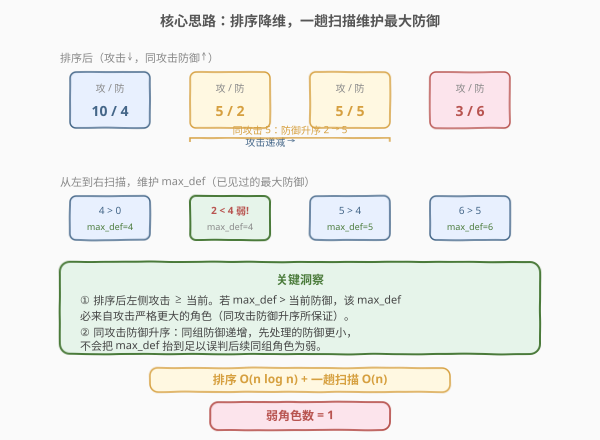
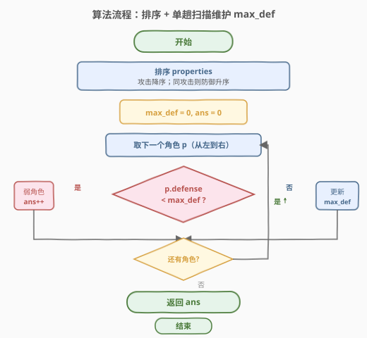

# LeetCode 游戏中弱角色的数量 题解

## 1. 题目概述

- **标题 / 题号**：游戏中弱角色的数量（#1996，medium）
- **链接**：https://leetcode.cn/problems/the-number-of-weak-characters-in-the-game/
- **难度**：中等
- **标签**：数组、排序、贪心、单调维护

**题意**：你正在参加一个多角色游戏，每个角色都有两个主要属性：**攻击** 和 **防御**。给定二维整数数组 `properties`，其中 `properties[i] = [attack_i, defense_i]` 表示第 $i$ 个角色的属性。

如果存在另一个角色 $j$，其攻击和防御**都严格高于**角色 $i$（即 $\text{attack}_j > \text{attack}_i$ 且 $\text{defense}_j > \text{defense}_i$），则角色 $i$ 为**弱角色**。返回弱角色的数量。

**示例 1**：

```text
输入：properties = [[5,5],[6,3],[3,6]]
输出：0
解释：不存在攻击和防御都严格高于其他角色的角色。
```

**示例 2**：

```text
输入：properties = [[2,2],[3,3]]
输出：1
解释：第一个角色 [2,2] 是弱角色，因为 [3,3] 的攻击和防御都严格更大。
```

**示例 3**：

```text
输入：properties = [[1,5],[10,4],[4,3]]
输出：1
解释：第三个角色 [4,3] 是弱角色，因为 [10,4] 的攻击和防御都严格更大。
```

**约束**：

- $2 \leq \text{properties.length} \leq 10^5$
- $\text{properties}[i].\text{length} == 2$
- $1 \leq \text{attack}_i, \text{defense}_i \leq 10^5$

> 💡 数据规模 $n \leq 10^5$，意味着 $O(n^2)$ 暴力两两比较（$\sim 10^{10}$）必然超时。突破口在于「二维偏序」——把其中一个维度排序后，问题降为一维上的「是否存在更大的值」。

## 2. 解题思路

### 2.1 暴力思路：两两比较

最直接的做法：对每个角色 $i$，扫描所有其他角色 $j$，若存在 $\text{attack}_j > \text{attack}_i$ 且 $\text{defense}_j > \text{defense}_i$，则 $i$ 为弱角色。

```text
for i in 0..n:
    weak = false
    for j in 0..n:
        if attack[j]>attack[i] and defense[j]>defense[i]:
            weak = true; break
    if weak: ans++
```

时间复杂度 $O(n^2)$，$n = 10^5$ 时约 $10^{10}$ 次运算，远超时限。问题在于：对每个角色独立地「找支配者」，没有利用攻击维度的全局顺序。

### 2.2 核心观察：排序降维 + 单趟能量维护



**关键转换**：把「是否存在攻击和防御都严格更大的角色」拆成两个维度分别处理。

1. **按攻击降序排序**：排序后，所有排在当前角色**左侧**的角色，攻击都 $\geq$ 当前。于是「攻击严格更大」这个条件，只需在左侧角色里找——只要左侧存在防御更大的角色，当前就是弱角色。
2. **维护左侧最大防御 `max_def`**：扫描时记录已遍历角色的最大防御。若 `max_def > 当前防御`，说明左侧有角色防御更大，且其攻击 $\geq$ 当前；再结合下一步保证「严格更大」，即可判定为弱。
3. **同攻击防御升序——消除「攻击相等」的歧义**：排序时，对**攻击相同**的角色按**防御升序**排列。这样在同一攻击组内，先处理的防御更小，不会把 `max_def` 抬到能误判后续同组角色。

> ⚠️ **为什么同攻击必须防御升序？** 弱角色要求攻击**严格**更大。若同攻击组按防御降序，先处理的大防御角色会把 `max_def` 抬高，导致同组后续小防御角色被误判为弱（而它们的攻击其实相等，不满足「严格更大」）。防御升序保证：同组内先处理的防御更小，绝不会因同组角色抬高 `max_def`。
>
> 更严格地：设 $M$ 为「攻击严格更大的组」贡献的最大防御，同组已处理角色的防御均 $\leq$ 当前（升序）。故当前看到的 $\text{max\_def} = \max(M,\ \text{同组已处理防御})$。当 $\text{当前防御} < \text{max\_def}$ 时，因同组已处理防御 $\leq$ 当前防御 $< \text{max\_def}$，必有 $\text{max\_def} = M$，即支配者来自攻击严格更大的组。✅

### 2.3 算法流程图



**完整步骤**：

1. 对 `properties` 排序：主键攻击**降序**，次键防御**升序**。
2. 初始化 `max_def = 0`，`ans = 0`。
3. **从左到右**遍历每个角色 $p$：
   - 若 $p.\text{defense} < \text{max\_def}$：$p$ 是弱角色，`ans++`。
   - 否则：更新 $\text{max\_def} = \max(\text{max\_def},\ p.\text{defense})$。
4. 返回 `ans`。

> 💡 **注意**：判定为弱时**不更新** `max_def`——弱角色的防御更小，不会成为新的最大值；即便相等也不影响（升序保证后续同组防御更大才更新）。简化起见，无论是否为弱都可执行 `max_def = max(max_def, p.defense)`，结果等价。

### 2.4 示例演算

以示例 3 `properties = [[1,5],[10,4],[4,3]]` 为例：

![示例演算：排序后 [10,4]→[4,3]→[1,5]，仅 [4,3] 为弱](../images/nwc_example_walkthrough.svg)

| 步骤 | 角色 (攻, 防) | max_def (前) | 判定 | max_def (后) |
|------|---------------|--------------|------|--------------|
| 1 | 10, 4 | 0 | 4 > 0，非弱 | 4 |
| 2 | 4, 3 | 4 | 3 < 4，**弱!** | 4 |
| 3 | 1, 5 | 4 | 5 > 4，非弱 | 5 |

第 2 步中 `max_def = 4` 来自 $[10, 4]$（攻击 $10 > 4$ 严格更大），故 $[4, 3]$ 被双属性严格压制。最终 `ans = 1`。

## 3. 参考代码

### C++（排序 + 单趟扫描）

```cpp
class Solution {
  public:
    int numberOfWeakCharacters(vector<vector<int>>& properties) {
        // 攻击降序；同攻击防御升序
        sort(properties.begin(), properties.end(),
             [](const vector<int>& a, const vector<int>& b) {
                 return a[0] == b[0] ? a[1] < b[1] : a[0] > b[0];
             });
        int max_def = 0, ans = 0;
        for (const auto& p : properties) {
            if (p[1] < max_def) {
                ++ans;            // 被左侧攻击严格更大的角色压制
            } else {
                max_def = p[1];   // 更新最大防御
            }
        }
        return ans;
    }
};
```

### Python

```python
class Solution:
    def numberOfWeakCharacters(self, properties: List[List[int]]) -> int:
        # 攻击降序；同攻击防御升序
        properties.sort(key=lambda x: (-x[0], x[1]))
        max_def = 0
        ans = 0
        for _, defense in properties:
            if defense < max_def:
                ans += 1          # 被左侧攻击严格更大的角色压制
            else:
                max_def = defense  # 更新最大防御
        return ans
```

> 💡 **Python 排序键**：`(-x[0], x[1])` 一行实现「攻击降序 + 同攻击防御升序」——攻击取负即降序，防御正序即升序，简洁且无自定义 comparator 的开销。

## 4. 复杂度分析

| 维度 | 复杂度 | 说明 |
|------|--------|------|
| 时间复杂度 | $O(n \log n)$ | 排序主导 $O(n \log n)$；单趟扫描 $O(n)$，总体 $O(n \log n)$ |
| 空间复杂度 | $O(\log n)$ | 排序的递归栈空间（原地排序，不计输入）；仅额外 $O(1)$ 变量 |

> 💡 $n = 10^5$ 时 $n \log n \approx 1.7 \times 10^6$，远在时限内。瓶颈在排序，已是该问题的最优渐近复杂度。

## 5. 扩展：从右到左的对称写法

上述解法按攻击降序、从左到右维护「左侧最大防御」。对称地，也可**按攻击升序、从右到左维护右侧最大防御**——思路完全等价，只是扫描方向取反：

```cpp
class Solution {
  public:
    int numberOfWeakCharacters(vector<vector<int>>& properties) {
        // 攻击升序；同攻击防御降序（对称翻转）
        sort(properties.begin(), properties.end(),
             [](const vector<int>& a, const vector<int>& b) {
                 return a[0] == b[0] ? a[1] > b[1] : a[0] < b[0];
             });
        int max_def = 0, ans = 0;
        for (int i = (int)properties.size() - 1; i >= 0; --i) {
            if (properties[i][1] < max_def) ++ans;
            else max_def = properties[i][1];
        }
        return ans;
    }
};
```

> ⚠️ 对称写法中，同攻击改为**防御降序**（与从左到右版的升序相反），因为从右到左扫描时，同组内先处理（更靠右）的应防御更大，才不会误判更靠左的同组角色。两种写法等价，选一种记牢即可。

| 解法 | 排序方向 | 扫描方向 | 同攻击次键 | 维护量 |
|------|----------|----------|------------|--------|
| 从左到右 | 攻击降序 | → | 防御升序 | 左侧 max_def |
| 从右到左 | 攻击升序 | ← | 防御降序 | 右侧 max_def |

## 6. 面试要点

1. **为什么排序能把 $O(n^2)$ 降到 $O(n \log n)$？**

   - 排序后，攻击维度天然有序：左侧角色攻击 $\geq$ 当前。于是「找攻击严格更大的支配者」从「全量扫描」变为「在有序前缀里查最大防御」——只需维护一个 `max_def` 变量，$O(1)$ 即可判定。

2. **同攻击为什么必须防御升序（从左到右版）？**

   - 弱角色要求攻击**严格**更大。若同攻击防御降序，大防御角色先处理会抬高 `max_def`，使同组小防御角色被误判为弱（攻击其实相等）。升序保证同组先处理者防御更小，不误抬 `max_def`；当 `当前防御 < max_def` 时，`max_def` 必来自攻击严格更大的组。

3. **判定为弱时为何不更新 `max_def`？**

   - 弱角色的防御 $< \text{max\_def}$，不会成为新最大值，更新与否结果一致。为清晰可只在非弱分支更新；亦可无脑 `max_def = max(max_def, p.defense)`，等价。

4. **本题和 354 俄罗斯套娃信封问题有何异同？**

   - 相同：都是「二维偏序」——一个属性排序，另一个维度上求解。都需处理「同值」边界。
   - 不同：354 求**最长嵌套链**（LIS，需二分）；本题只判「是否存在支配者」（维护最大值即可）。354 同宽按高降序、本题同攻击按防升序——方向相反，因 354 的 LIS 中同宽不能嵌套需降序排除，本题同攻击不能支配也需升序排除，本质都是「让同值不互相干扰」。

5. **能否用单调栈或树状数组解？**

   - 可以。按攻击降序处理后，防御维度可用**单调栈**维护一个严格递减的防御栈（类似「下一个更大元素」），或对防御值域建**树状数组/线段树**查询「攻击严格更大的组中防御 $>$ 当前的数量」。二者均为 $O(n \log n)$，但常数大于单变量维护法，适合防御带权或需计数的变体。

## 同类练习题

| # | 题目 | 与本题的关联 |
|---|------|-------------|
| 354 | [俄罗斯套娃信封问题](https://leetcode.cn/problems/russian-doll-envelopes/)（[题解](../0301-0400/354_俄罗斯套娃信封问题.md)） | 二维偏序母题，一维排序 + 另一维 LIS，对比「求最长链」与「判存在支配者」 |
| 169 | [多数元素](https://leetcode.cn/problems/majority-element/) | 同样「排序后单变量判定」的思路，排序把多数元素挤到中点位置 |
| 493 | [翻转对](https://leetcode.cn/problems/reverse-pairs/) | 二维偏序计数型（$i < j$ 且 $\text{nums}[i] > 2\,\text{nums}[j]$），归并/树状数组解法承接本题的「排序降维」思想 |
| 300 | [最长递增子序列](https://leetcode.cn/problems/longest-increasing-subsequence/)（[题解](../0201-0300/300_最长递增子序列.md)） | 一维 LIS，354 的降维基础，与本题同属「排序 + 维护极值」家族 |
