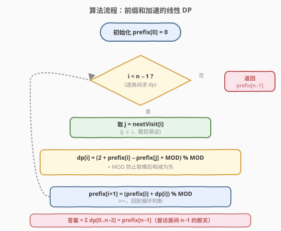
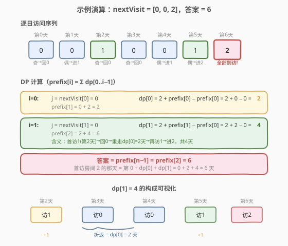

# 访问完所有房间的第一天

- **题目名称**：访问完所有房间的第一天
- **链接**：[1997. 访问完所有房间的第一天](https://leetcode.cn/problems/first-day-where-you-have-been-in-all-the-rooms/)
- **难度**：中等
- **标签**：动态规划、前缀和、数学

## 1. 题目概述

有 $n$ 个房间，编号 $0$ 到 $n-1$。日期编号从 $0$ 开始，每天访问一个房间。第 $0$ 天访问 $0$ 号房间。给定长度为 $n$ 的数组 `nextVisit`，访问规则如下（设当天访问房间 $i$）：

- 若算上本次，访问 $i$ 号房间的次数为**奇数** → 次日访问 `nextVisit[i]`（其中 $0 \le \text{nextVisit}[i] \le i$）；
- 若算上本次，访问 $i$ 号房间的次数为**偶数** → 次日访问 $(i+1) \bmod n$。

返回**访问完所有房间的第一天**的日期编号，对 $10^9 + 7$ 取余。

**示例 1**：

```text
输入：nextVisit = [0,0]
输出：2
解释：
  第0天 访问房间0（第1次，奇）→ 次日去 nextVisit[0]=0
  第1天 访问房间0（第2次，偶）→ 次日去 (0+1)%2=1
  第2天 访问房间1（首次到访，所有房间已访问）
```

**示例 2**：

```text
输入：nextVisit = [0,0,2]
输出：6
解释：访问序列 [0,0,1,0,0,1,2,...]，第6天首次到访房间2。
```

**示例 3**：

```text
输入：nextVisit = [0,1,2,0]
输出：6
解释：访问序列 [0,0,1,1,2,2,3,...]，第6天首次到访房间3。
```

**约束条件**：

- $n = \text{nextVisit.length}$
- $2 \le n \le 10^5$
- $0 \le \text{nextVisit}[i] \le i$

> 💡 **审题关键**：① $\text{nextVisit}[i] \le i$ 是核心约束——首次到访 $i$（奇数次）后只能**往回跳**到不大于 $i$ 的房间，永远无法跳到未访问过的房间；② 房间 $i$ 必须被访问**两次**（先奇后偶）才能前进到 $i+1$，这造就了「折返」结构；③ $n = 10^5$ 意味着模拟每一天会超时（答案可达指数级），必须用 DP 直接算天数而非逐步模拟。

---

## 2. 解题思路

### 2.1 暴力思路：逐日模拟

按规则一天一天模拟，记录每个房间的访问次数，直到所有房间都被访问过。

- **正确性**：忠实模拟，首次全部到访的那天即答案。
- **效率**：设 $f(n)$ 为最坏天数。由于每次首访 $i$ 都要折返重走 $0..i-1$ 的全程，$f(n)$ 可达 $O(2^n)$ 级。$n = 10^5$ 时天数爆炸，且取模后无法判断终止——**完全不可行**。

> ⚠️ 暴力的浪费在于「逐日推进」没有利用折返的**重复结构**：每次从房间 $j$ 折返走回 $j+1$ 的过程与当初首访 $j$ 时完全一样。把这个「子过程耗时」抽象成一个 DP 值，就能跳过模拟、直接算总天数。

### 2.2 核心观察：奇偶规则 → 折返结构 + 状态不变量

![核心观察：首访 i 后回跳 nextVisit[i]，折返走回 i 再前进](../images/first_day_visit_concept.svg)

**关键不变量**：首次到访房间 $i$ 时，房间 $0, 1, \dots, i-1$ 各被访问了**偶数次**（每个都「走完了一来一回」）。

> 💡 **为什么成立**：要前进到 $i+1$，房间 $i$ 必须被访问偶数次；而首次到访 $i$ 是奇数次（第 1 次）。每次到访 $i$（奇数次）都回跳到 $\le i$ 的房间，要再回到 $i$ 就得把途中经过的房间各再走「一来一回」——偶数次叠加偶数次仍为偶数。归纳即得。

基于此不变量，定义：

$$\text{dp}[i] = \text{首次到访 } i \text{ 到首次到访 } i+1 \text{ 之间经过的天数}$$

首访 $i$ 后的流程拆为三段：

1. **第 1 天**：访问 $i$（奇数次）→ 回跳到 $j = \text{nextVisit}[i]$（$j \le i$）；
2. **折返**：从 $j$ 重新走完 $j \to j+1 \to \dots \to i-1 \to i$。由不变量，回跳到 $j$ 时房间 $0..j-1$ 仍为偶数次，状态与「当初首访 $j$」**完全相同**，故这段耗时恰为 $\text{dp}[j] + \text{dp}[j+1] + \dots + \text{dp}[i-1]$；
3. **再访 $i$（偶数次）→ 前进到 $i+1$**：花费第 1 天。

合起来：

$$\text{dp}[i] = 2 + \sum_{k=j}^{i-1} \text{dp}[k], \quad j = \text{nextVisit}[i]$$

其中「$+2$」= 首访 $i$ 那天 + 再访 $i$ 那天。

### 2.3 算法流程图



用前缀和 $\text{prefix}[i] = \sum_{k=0}^{i-1} \text{dp}[k]$（$\text{prefix}[0] = 0$）将区间和化为 $O(1)$：

$$\text{dp}[i] = 2 + \text{prefix}[i] - \text{prefix}[\text{nextVisit}[i]]$$

$$\text{prefix}[i+1] = \text{prefix}[i] + \text{dp}[i]$$

**完整步骤**：

1. **初始化**：$\text{prefix}[0] = 0$，$\text{MOD} = 10^9 + 7$。
2. **循环** $i = 0, 1, \dots, n-2$：
   - $j = \text{nextVisit}[i]$
   - $\text{dp}[i] = \big(2 + \text{prefix}[i] - \text{prefix}[j] + \text{MOD}\big) \bmod \text{MOD}$（$+\text{MOD}$ 防取模后相减为负）
   - $\text{prefix}[i+1] = \big(\text{prefix}[i] + \text{dp}[i]\big) \bmod \text{MOD}$
3. **返回** $\text{prefix}[n-1]$。

> ⚠️ **为什么答案是 $\text{prefix}[n-1]$**：第 $0$ 天首访房间 $0$，之后经 $\text{dp}[0]$ 天首访房间 $1$，再经 $\text{dp}[1]$ 天首访房间 $2$……经 $\text{dp}[n-2]$ 天首访房间 $n-1$。总天数 $= \sum_{k=0}^{n-2} \text{dp}[k] = \text{prefix}[n-1]$。房间 $n-1$ 是最后被到访的（因 $\text{nextVisit}[i] \le i$ 恒不超前），故首访 $n-1$ 即「全部到访」。

### 2.4 示例演算

以 `nextVisit = [0, 0, 2]`（$n=3$）为例：



**逐日访问序列**：`[0, 0, 1, 0, 0, 1, 2]`（第 $0\sim6$ 天）。

**DP 计算**：

| $i$ | $j=\text{nextVisit}[i]$ | $\text{dp}[i] = 2 + \text{prefix}[i] - \text{prefix}[j]$ | $\text{prefix}[i+1]$ |
|-----|------------------------|----------------------------------------------------------|----------------------|
| 0   | 0                      | $2 + 0 - 0 = 2$                                          | $2$                  |
| 1   | 0                      | $2 + 2 - 0 = 4$                                          | $6$                  |

**答案** $= \text{prefix}[2] = 6$ ✓

> 💡 **$\text{dp}[1] = 4$ 的含义**：首访房间 $1$（第 $2$ 天，奇）→ 回跳到 $0$ → 重走 $\text{dp}[0]=2$ 天回到房间 $1$（第 $5$ 天，偶）→ 前进到房间 $2$（第 $6$ 天）。$2 + 2 = 4$ 天。

对照示例 3 `nextVisit = [0, 1, 2, 0]`：每个 $\text{nextVisit}[i] = i$，折返区间为空（$\sum = 0$），$\text{dp}[i] = 2$，答案 $= 2 \times 3 = 6$ ✓。

---

## 3. 参考代码

### C++

```cpp
// 访问完所有房间的第一天.cpp —— 前缀和优化 DP
// 编译: g++ -O2 -std=c++17 访问完所有房间的第一天.cpp -o firstday
#include <vector>
using namespace std;

class Solution {
  public:
    int firstDayBeenInAllRooms(vector<int>& nextVisit) {
        const int MOD = 1e9 + 7;
        int n = nextVisit.size();
        vector<int> prefix(n + 1, 0);          // prefix[i] = Σ dp[0..i-1]
        for (int i = 0; i < n - 1; ++i) {
            int j = nextVisit[i];
            long long dp = (2LL + prefix[i] - prefix[j] + MOD) % MOD;
            prefix[i + 1] = (prefix[i] + dp) % MOD;
        }
        return prefix[n - 1];
    }
};
```

### Python

```python
class Solution:
    def firstDayBeenInAllRooms(self, nextVisit: list[int]) -> int:
        MOD = 10**9 + 7
        n = len(nextVisit)
        prefix = [0] * (n + 1)                  # prefix[i] = Σ dp[0..i-1]
        for i in range(n - 1):
            j = nextVisit[i]
            dp = (2 + prefix[i] - prefix[j] + MOD) % MOD
            prefix[i + 1] = (prefix[i] + dp) % MOD
        return prefix[n - 1] % MOD
```

> 💡 **写法对照**：C++ 用 `2LL` 强转 `long long` 防止 `2 + prefix[i] - prefix[j]` 在 `int` 下中间结果溢出（虽各项 $< \text{MOD} < 2^{30}$，相减后 $+\text{MOD}$ 再 $+2$ 仍在 `int` 范围，但加 `LL` 更稳妥）；Python 无溢出顾虑，`+ MOD` 纯为处理负数。两者循环都只到 $n-2$（房间 $n-1$ 是终点，无需算 $\text{dp}[n-1]$）。

---

## 4. 复杂度分析

| 维度 | 复杂度 | 说明 |
|------|--------|------|
| **时间复杂度** | $O(n)$ | 单趟循环 $i = 0 \dots n-2$，每次 $O(1)$ 查表与前缀和加减 |
| **空间复杂度** | $O(n)$ | `prefix` 数组长度 $n+1$；可优化到 $O(1)$ 额外空间但需保留所有 `prefix[j]`（$j$ 任意），故仍需 $O(n)$ |

> ⚠️ 为什么不能省成 $O(1)$：$\text{dp}[i]$ 依赖 $\text{prefix}[\text{nextVisit}[i]]$，而 $\text{nextVisit}[i]$ 可以是 $0 \dots i$ 中任意值，无法仅靠滚动变量覆盖——必须保留整个前缀和数组供随机访问。

---

## 5. 扩展：不变量的归纳证明

**命题**：首次到访房间 $i$ 时，房间 $0, 1, \dots, i-1$ 各被访问偶数次。

**归纳基**：$i = 0$ 时前缀为空，平凡成立。

**归纳步**：设首访 $i$ 时不变量成立。首访 $i$（奇数次）后回跳到 $j = \text{nextVisit}[i] \le i$，此时房间 $i$ 为奇数次，$0..i-1$ 仍偶数次。要再回到 $i$，必须依次「走完」$j, j+1, \dots, i-1$——每「走完」一个房间 $k$（从奇数次到偶数次前进到 $k+1$），房间 $k$ 的访问数 $+2$（一来一回），偶数性不变。故再次到访 $i$ 时，$0..i-1$ 仍偶数次，$i$ 变为偶数次。此时前进到 $i+1$，$0..i$ 全偶数——归纳到 $i+1$ 成立。$\square$

**推论**：回跳到 $j$ 时，房间 $0..j-1$ 偶数次、$j$ 刚被访问（奇数次），与「当初首访 $j$」的状态完全一致，因此折返耗时恰为 $\text{dp}[j] + \dots + \text{dp}[i-1]$。这正是 DP 可行性的根基。

---

## 6. 面试要点

1. **为什么不能直接模拟？天数到底有多大？**

   - 每次首访 $i$ 都要折返重走 $0..i-1$，最坏 $\text{nextVisit}[i] = 0$ 时 $\text{dp}[i] = 2 + \text{prefix}[i]$，$\text{dp}$ 呈指数增长（$\text{dp}[i] \approx 2^{i+1}$）。$n = 10^5$ 时天数天文级，且取模后无法用「天数等于多少」判断终止。必须用 DP 直接算而非模拟。

2. **DP 状态为什么定义为「首访 $i$ 到首访 $i+1$ 的天数」而非「到第 $i$ 天访问了哪间房」？**

   - 后者状态空间随天数爆炸，无最优子结构。前者抓住了「折返子过程可复用」的结构——首访 $i$ 后回跳到 $j$，折返走回 $i$ 的子过程与当初走 $j \to j+1$ 完全同构，耗时相同，可叠加重用。

3. **为什么回跳到 $j$ 后的折返耗时恰好等于 $\text{dp}[j] + \dots + \text{dp}[i-1]$？**

   - 关键在不变量：首访 $i$ 时 $0..i-1$ 全偶数次。回跳到 $j$ 时 $0..j-1$ 仍偶数次，$j$ 刚变奇数次——与首访 $j$ 时状态一致。故走 $j \to j+1$ 耗时 $= \text{dp}[j]$；到 $j+1$ 时状态又与首访 $j+1$ 一致，再走 $j+1 \to j+2$ 耗时 $= \text{dp}[j+1]$……依次类推到 $i$。

4. **为什么答案不是 $\text{dp}[n-1]$ 而是 $\text{prefix}[n-1]$？**

   - $\text{dp}[n-1]$ 表示「首访 $n-1$ 到首访 $n$」的天数，但房间只有 $0..n-1$，没有 $n$。房间 $n-1$ 是最后被到访的，首访它即「全部到访」。总天数 $= \text{dp}[0] + \dots + \text{dp}[n-2]$（从首访 $0$ 到首访 $n-1$），即 $\text{prefix}[n-1]$。

5. **取模时 `+ MOD` 的作用？C++ 里 `2LL` 的意义？**

   - `prefix[i]` 和 `prefix[j]` 都已取模，相减可能为负，`+ MOD` 后再取模保证非负。C++ 中 `2 + prefix[i] - prefix[j] + MOD` 各项 $< 2^{30}$，和 $< 2^{32}$ 不会溢出 `int`，但加 `2LL` 转 `long long` 是更稳健的防御写法，避免边界数据或改大 MOD 时翻车。

> 💡 **一句话总结**：本题是「奇偶规则催生折返、不变量保证子过程可复用」的招牌 DP——把逐日模拟抽象成 $\text{dp}[i] = 2 + \sum_{k=j}^{i-1}\text{dp}[k]$，再用前缀和 $O(1)$ 求区间和，$O(n)$ 一趟搞定。核心是看穿「回跳后的状态」与「当初首访」完全一致。

---

## 7. 同类练习题

- [62. 不同路径](https://leetcode.cn/problems/unique-paths/)：网格 DP + 前缀思想（状态由左侧/上侧累加），本题用前缀和把区间求和降到 $O(1)$ 的同思路
- [213. 打家劫舍 II](https://leetcode.cn/problems/house-robber-ii/)：拆环为线 + 一维 DP，与本题「把折返结构拆成线性子过程」同构
- [740. 删除并获得点数](https://leetcode.cn/problems/delete-and-earn-points/)：值域建桶 + 打家劫舍 DP，把「相邻互斥」转成线性递推，与本题「折返耗时叠加」的线性化同理
- [1987. 不同的好子序列数目](https://leetcode.cn/problems/number-of-unique-good-subsequences/)（[题解](../1901-2000/1987_不同的好子序列数目.md)）：同区间的线性 DP + 取模计数，本题的「前缀和优化 + MOD 防负」在该题中以「分桶再生」形式再现
