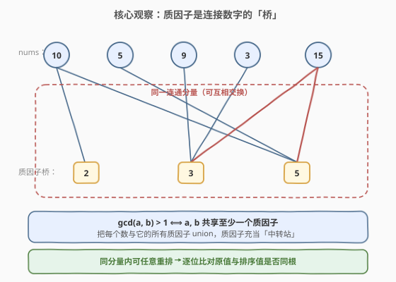
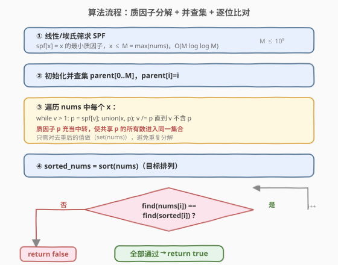
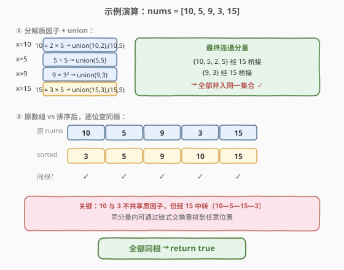

# 数组的最大公因数排序

- **题目名称**：数组的最大公因数排序
- **链接**：[1998. 数组的最大公因数排序](https://leetcode.cn/problems/gcd-sort-of-an-array/)
- **难度**：困难
- **标签**：并查集、数学、质因数分解、排序

## 1. 题目概述

给定一个整数数组 `nums`，可以对它执行**任意次**如下操作：

- 若 $\gcd(\text{nums}[i], \text{nums}[j]) > 1$，则可以交换 `nums[i]` 与 `nums[j]`。

判断是否能通过上述交换把 `nums` 排成**非递减顺序**，能则返回 `true`，否则返回 `false`。

**示例 1**：

```text
输入：nums = [7,21,3]
输出：true
解释：
- 交换 7 和 21（gcd=7）  → [21, 7, 3]
- 交换 21 和 3（gcd=3） → [3, 7, 21]   已排序
```

**示例 2**：

```text
输入：nums = [5,2,6,2]
输出：false
解释：5 与任何其他元素的 gcd 都为 1，无法移动，无法完成排序。
```

**示例 3**：

```text
输入：nums = [10,5,9,3,15]
输出：true
解释：
- 交换 10 和 15（gcd=5） → [15, 5, 9, 3, 10]
- 交换 15 和 3 （gcd=3） → [3, 5, 9, 15, 10]
- 交换 10 和 15（gcd=5） → [3, 5, 9, 10, 15]   已排序
```

**约束条件**：

- $1 \le \text{nums.length} \le 3 \times 10^4$
- $2 \le \text{nums}[i] \le 10^5$

> ⚠️ **关键信号**：交换条件是「$\gcd > 1$」而非「相等」。这意味着两个数只要**共享任意一个质因子**就能直接交换；再通过链式交换，**同一连通分量内的数可任意重排**。一旦想到「连通分量」，并查集几乎是唯一解。

---

## 2. 解题思路

### 2.1 暴力思路：建图 + 求连通分量

最直觉的做法：把每个元素看作图中的节点，对所有 $(i, j)$ 对计算 $\gcd$，若 $>1$ 则连一条边，再用 DFS/BFS 或并查集求连通分量。最后排序 `nums`，逐位检查「原值」与「目标值」是否同属一个分量。

> ⚠️ **致命问题**：求所有数对的 $\gcd$ 是 $O(n^2 \log V)$，$n = 3 \times 10^4$ 时约 $9 \times 10^8$ 次 $\gcd$ 运算，必然超时。必须避免两两配对。

核心矛盾：**我们需要刻画「能互相交换」的等价关系，但不能枚举所有数对**。

### 2.2 核心观察：质因子是连接数字的「桥」



关键事实：

$$\gcd(a, b) > 1 \iff a, b \text{ 至少共享一个质因子}$$

因此「能直接交换」=「共享质因子」。若引入**质因子作为中转节点**：

- 对数组中每个数 $x$，分解出它的所有质因子 $p_1, p_2, \dots, p_k$；
- 在并查集中把 $x$ 与每个 $p_i$ `union`。

这样一来，**共享同一质因子的所有数会自然落入同一集合**；即便 $a$、$c$ 不直接共享质因子，只要存在 $b$ 使 $a \sim b$、$b \sim c$（$\sim$ 表示共享质因子），它们也会被并查集合并到一起。

> 💡 **为何这样省下了 $O(n^2)$？** 每个数只和它**自己的**质因子合并（每个数至多 $\log V$ 个不同质因子），总边数 $O(n \log V)$，远少于 $O(n^2)$。质因子充当「公共枢纽」——所有含质因子 $p$ 的数都通过 $p$ 间接相连，无需两两枚举。

> 💡 **为何同分量内可任意重排？** 设分量内元素为 $a_1, a_2, \dots, a_m$，可通过枢纽质因子逐次把任意元素「换」到任意位置：要换 $a_i$ 到位置 $j$，找一个与 $a_j$ 共享质因子的中转 $a_k$，先换 $a_i \leftrightarrow a_k$（经共享质因子链可达），再换到 $a_j$。归纳可知整个分量是一组可任意置换的元素。因此**「能排序」$\iff$「每个位置的原值与目标值同根」**。

### 2.3 算法流程图



五步走：

1. **筛 SPF**：用埃氏筛预处理 $[2, M]$ 内每个数的最小质因子 `spf[x]`，$M = \max(\text{nums})$，使得后续每个数能在 $O(\log x)$ 时间内分解。
2. **初始化并查集**：`parent` 大小为 $M + 1$（数值本身做下标，质因子也在 $[2, M]$ 内），`parent[i] = i`。
3. **分解 + union**：遍历 `nums`（去重），对每个 $x$ 用 `spf` 分解质因子，将 $x$ 与每个质因子 `union`。
4. **排序**：得到目标排列 `sorted_nums`。
5. **逐位比对**：对每个 $i$，若 `find(nums[i]) != find(sorted_nums[i])` 直接返回 `false`；全部通过返回 `true`。

### 2.4 示例演算



以示例 3 `nums = [10, 5, 9, 3, 15]`、$M = 15$ 为例：

- 分解：$10 = 2 \times 5$、$5 = 5$、$9 = 3^2$、$3 = 3$、$15 = 3 \times 5$。
- union 后：$\{10, 2, 5\}$、$\{9, 3\}$ 两组，经 $15$（同时含 $3$、$5$）桥接，**全部并入同一集合**。
- `sorted = [3, 5, 9, 10, 15]`，逐位检查 `find` 均相同 → 返回 `true`。

> 💡 注意 $10$ 与 $3$ 并不直接共享质因子（$\gcd(10,3)=1$），但通过 $15$ 中转（$10 \xleftrightarrow{5} 15 \xleftrightarrow{3} 3$）仍属同一分量，这正是质因子桥的威力。

---

## 3. 参考代码

### C++（SPF 筛 + 并查集 + 路径压缩）

```cpp
class Solution {
    int parent[100005];
    int spf[100005];

    int find(int x) {
        if (parent[x] != x) parent[x] = find(parent[x]);
        return parent[x];
    }
    void unite(int x, int y) {
        int rx = find(x), ry = find(y);
        if (rx != ry) parent[rx] = ry;
    }
public:
    bool gcdSort(vector<int>& nums) {
        int M = *max_element(nums.begin(), nums.end());
        // 埃氏筛求最小质因子 spf
        for (int i = 0; i <= M; i++) spf[i] = i;
        for (int i = 2; (long long)i * i <= M; i++) {
            if (spf[i] == i) {                       // i 是质数
                for (int j = i * i; j <= M; j += i) {
                    if (spf[j] == j) spf[j] = i;
                }
            }
        }
        // 初始化并查集
        for (int i = 0; i <= M; i++) parent[i] = i;
        // 每个数与它的所有质因子 union（质因子作中转桥）
        for (int x : nums) {
            int v = x;
            while (v > 1) {
                int p = spf[v];
                unite(x, p);
                while (v % p == 0) v /= p;          // 一次性除尽同一质因子
            }
        }
        // 逐位比对原值与排序值是否同根
        vector<int> sorted_nums = nums;
        sort(sorted_nums.begin(), sorted_nums.end());
        for (int i = 0; i < (int)nums.size(); i++) {
            if (find(nums[i]) != find(sorted_nums[i])) return false;
        }
        return true;
    }
};
```

### Python（SPF 筛 + 并查集 + 隔代压缩）

```python
class Solution:
    def gcdSort(self, nums: List[int]) -> bool:
        M = max(nums)
        # 埃氏筛求最小质因子
        spf = list(range(M + 1))
        i = 2
        while i * i <= M:
            if spf[i] == i:                          # i 是质数
                for j in range(i * i, M + 1, i):
                    if spf[j] == j:
                        spf[j] = i
            i += 1
        # 并查集（数值本身做下标）
        parent = list(range(M + 1))

        def find(x):
            while parent[x] != x:
                parent[x] = parent[parent[x]]        # 隔代压缩
                x = parent[x]
            return x

        def union(x, y):
            rx, ry = find(x), find(y)
            if rx != ry:
                parent[rx] = ry

        # 每个数与它的所有质因子 union（去重避免重复分解）
        for x in set(nums):
            v = x
            while v > 1:
                p = spf[v]
                union(x, p)
                while v % p == 0:
                    v //= p
        # 逐位比对原值与排序值是否同根
        sorted_nums = sorted(nums)
        for a, b in zip(nums, sorted_nums):
            if find(a) != find(b):
                return False
        return True
```

> 💡 **实现细节**：
> - **数值即下标**：`nums[i] ≤ 10^5`，直接用数值作 `parent` 下标，质因子也在 $[2, M]$ 内，无需额外映射。若数值上界更大（如 $10^9$），需先离散化或换用「质因子集合哈希」方案。
> - **SPF 一次性除尽**：内层 `while (v % p == 0) v /= p` 把同一质因子一次除干净，只 `union` 一次，避免重复合并（$9 = 3^2$ 只 union 一次 $(9, 3)$）。
> - **去重**：Python 版遍历 `set(nums)`，重复值只分解一次；C++ 版数组重复分解也只是多几次幂等 `union`，不影响正确性，但去重可进一步提速。
> - **为何 `union(x, p)` 而非 `union(x, y)`？** 质因子 $p$ 是「公共枢纽」，所有含 $p$ 的数都经 $p$ 间接相连，自然省去两两配对。

---

## 4. 复杂度分析

| 维度 | 复杂度 | 说明 |
|------|--------|------|
| 时间复杂度 | $O(M \log \log M + n \log M + n \log n)$ | 筛 SPF $O(M \log \log M)$；每个数分解 + union 共 $O(n \log M)$（每数至多 $\log M$ 个不同质因子）；排序 $O(n \log n)$；逐位查 $O(n \alpha)$ |
| 空间复杂度 | $O(M)$ | `parent` 与 `spf` 数组各 $O(M)$，$M = \max(\text{nums}) \le 10^5$ |

> 💡 本题 $M \le 10^5$、$n \le 3 \times 10^4$，总量约 $10^5 + 3 \times 10^4 \times 6 \approx 3 \times 10^5$ 次操作，毫秒级完成。若 $M$ 大到无法开 $O(M)$ 数组（如 $10^9$），需改为对每个数即时试除分解（$O(\sqrt V)$ 每个），但 $n$ 也会相应受限。

---

## 5. 扩展：即时试除分解与线性筛

### 5.1 不预处理 SPF 的写法

当 $M$ 很大但 $n$ 较小时，不必开 $O(M)$ 的 `spf` 数组，对每个 $x$ 直接试除到 $\sqrt{x}$ 即可分解：

```python
def factorize(x):
    factors = []
    d = 2
    while d * d <= x:
        if x % d == 0:
            factors.append(d)
            while x % d == 0:
                x //= d
        d += 1
    if x > 1:
        factors.append(x)
    return factors
```

单次分解 $O(\sqrt{x})$，总 $O(n \sqrt{M})$。本题 $M = 10^5$、$\sqrt{M} \approx 316$，$n = 3 \times 10^4$ 时约 $10^7$ 次，也能 AC，但 SPF 筛更快更优雅。

### 5.2 线性筛（欧拉筛）求 SPF

埃氏筛已足够，若追求理论最优可用线性筛，$O(M)$ 时间求出 SPF：

```cpp
vector<int> linear_sieve(int M) {
    vector<int> spf(M + 1), primes;
    for (int i = 2; i <= M; i++) {
        if (spf[i] == 0) { spf[i] = i; primes.push_back(i); }
        for (int p : primes) {
            if (p > spf[i] || (long long)i * p > M) break;
            spf[i * p] = p;
        }
    }
    return spf;
}
```

> 💡 详见 [204. 计数质数](../0201-0300/204_计数质数.md) 的埃氏筛 / 线性筛模板。本题用埃氏筛已绰绰有余。

---

## 6. 面试要点

**Q1：为什么「$\gcd > 1$ 可交换」能转化成并查集问题？**

> 交换关系不是传递的（$a$ 能换 $b$、$b$ 能换 $c$，不代表 $a$ 能直接换 $c$），但「能通过若干次交换到达」是**等价关系的传递闭包**——这正是连通分量。并查集天生用于维护这种「动态加边 + 查连通性」的等价类，所以一旦识别出「连通分量」四个字，并查集几乎是反射动作。

**Q2：为什么用质因子做中转，而不是直接两两 union？**

> 两两 union 需 $O(n^2)$ 次 $\gcd$，$n = 3 \times 10^4$ 时约 $9 \times 10^8$ 次运算，必然超时。引入质因子作枢纽：每个数只与自己的质因子合并（每数至多 $\log M$ 个），总边数降到 $O(n \log M)$；共享同一质因子的数会自动经该质因子连通，等价于「两两共享质因子」的传递闭包，但代价从平方降到准线性。

**Q3：为什么同分量内的数能任意重排？**

> 任意 $a$、$b$ 同分量意味着存在质因子链 $a \sim p_1 \sim \cdots \sim p_k \sim b$（$\sim$ 表示共享质因子）。沿链做相邻交换即可把 $a$ 移到 $b$ 的位置，类似冒泡。归纳地，整个分量是一组「可任意置换」的元素。因此只需保证每个目标位置的值来自同一分量即可。

**Q4：为什么 `parent` 数组大小取 $M+1$？质因子也在这个范围内吗？**

> 数值上界 $M = \max(\text{nums})$。任意 $x \le M$ 的质因子 $p \le x \le M$，所以质因子下标也在 $[2, M]$ 内，`parent[0..M]` 足够覆盖所有数值与质因子节点。若 $M$ 很大（如 $10^9$）无法开数组，需离散化数值 + 即时试除分解质因子。

**Q5：逐位比对时，为什么比较的是「值」而非「下标」？**

> 并查集是按**数值**建的（`union(x, p)` 中 $x$ 是数值），所以 `find(nums[i])` 查的是「数值 `nums[i]` 所属集合」。排序后位置 $i$ 应放的值是 `sorted_nums[i]`，只要这两个**值**同根，就能把 `sorted_nums[i]` 通过链式交换挪到位置 $i$。重复元素也成立：同值必同根，自然通过。

> 💡 **一句话总结**：「$\gcd > 1$ 可交换」→ 质因子作中转建并查集 → 同分量可任意重排 → 排序后逐位查同根。难点不在并查集本身，而在想到「用质因子当桥」把 $O(n^2)$ 配对降到 $O(n \log M)$。

---

## 7. 同类练习题

- [547. 省份数量](https://leetcode.cn/problems/number-of-provinces/)（[站内题解](../0501-0600/547_省份数量.md)）：并查集母题，本题的并查集骨架（find/union/路径压缩）直接复用
- [684. 冗余连接](https://leetcode.cn/problems/redundant-connection/)（[站内题解](../0601-0700/684_冗余连接.md)）：并查集判环，加边时两端已同根即冗余——对照「动态加边 + 查连通」的另一应用
- [952. 按公因数计算最大组件大小](https://leetcode.cn/problems/largest-component-size-by-common-factor/)：与本题几乎同模板——质因子分解 + 并查集求最大分量，只是问「最大分量大小」而非「能否排序」
- [2709. 最大公约数遍历](https://leetcode.cn/problems/greatest-common-divisor-traversal/)：本题的镜像版——判断「任意两位置可达」等价于「所有数同分量」，质因子桥同一套写法
- [204. 计数质数](https://leetcode.cn/problems/count-primes/)（[站内题解](../0201-0300/204_计数质数.md)）：埃氏筛 / 线性筛模板，是本题 SPF 预处理的母题
