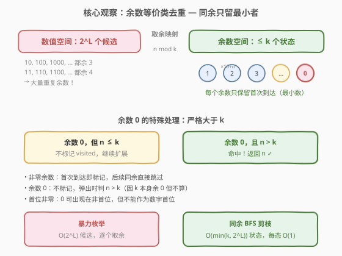
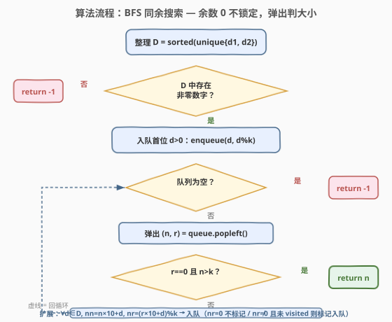
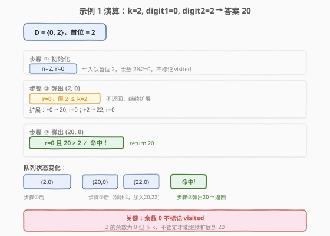

# LeetCode 最小的仅由两个数组成的倍数 题解

## 1. 题目概述

- **标题 / 题号**：最小的仅由两个数组成的倍数（#1999，medium）
- **链接**：https://leetcode.cn/problems/smallest-greater-multiple-made-of-two-digits/
- **难度**：中等
- **标签**：数学、枚举、广度优先搜索

**题意**：给定一个正整数 $k$ 和两个数字 $\text{digit1}$、$\text{digit2}$（均在 $0$–$9$ 之间），请你找出**大于 $k$** 的最小正整数 $n$，满足：

1. $n$ 的**每一位数字**只能是 $\text{digit1}$ 或 $\text{digit2}$（两种数字不必都出现）；
2. $n$ 是 $k$ 的**倍数**（即 $k \mid n$）。

如果不存在这样的 $n$，返回 $-1$。答案保证能装入 64 位有符号整数，或为 $-1$。

**示例 1**：

```text
输入：k = 2, digit1 = 0, digit2 = 2
输出：20
解释：仅由数字 0 和 2 组成且大于 2 的 k=2 的倍数中，最小的是 20。
  - 2 本身由 {0,2} 组成且是 2 的倍数，但不满足"大于 2"（等于）；
  - 下一个候选 20 > 2 且 20 % 2 == 0，即为答案。
```

**示例 2**：

```text
输入：k = 3, digit1 = 4, digit2 = 2
输出：24
解释：仅由 {2,4} 组成且大于 3 的 3 的倍数：24（24 % 3 == 0）。
  2 不满足 > 3；4 % 3 = 1；22 % 3 = 1；24 % 3 = 0 ✓。
```

**示例 3**：

```text
输入：k = 5, digit1 = 2, digit2 = 4
输出：-1
解释：仅由 {2,4} 组成的数末位只能是 2 或 4，而 5 的倍数末位必须是 0 或 5，
  故永远不可能凑出 5 的倍数，返回 -1。
```

**约束**：

- $1 \le k \le 10^{10}$
- $0 \le \text{digit1}, \text{digit2} \le 9$

> 💡 **审题关键**：① 「仅由两个数字组成」指每位取自集合 $\{\text{digit1}, \text{digit2}\}$，不要求两种都出现，$\text{digit1} = \text{digit2}$ 时退化为「全由同一个数字组成」；② **严格大于** $k$——$k$ 本身即便是倍数也不算（示例 1 的 $2$ 就被排除）；③ 首位不能为 $0$（否则不是合法正整数表示），但 $0$ 可作为非首位出现在数字中。

## 2. 解题思路

### 2.1 暴力思路：逐个枚举由 digit1/digit2 组成的数

最直白的做法呼应官方提示：**按从小到大的顺序，逐个生成仅由 $\text{digit1}$、$\text{digit2}$ 组成的正整数，检查它是否大于 $k$ 且为 $k$ 的倍数**，命中即返回。

生成方式：按位数 $L = 1, 2, 3, \ldots$ 递增，每位填入 $\text{digit1}$ 或 $\text{digit2}$（首位须非零），同位数内按字典序即等于数值递增。由于答案保证装入 64 位整数，最多枚举到 $L = 18$ 位（$2^{63} \approx 9.2 \times 10^{18}$，共 19 位，但 19 位数中最大的 $999\ldots$ 超出 `long long` 正数范围，安全上界取 18 位）。

- **正确性**：穷举所有候选，第一个满足条件即为最小。
- **效率**：每位 2 种选择，$L$ 位共 $2^L$ 个数，总计 $\sum_{L=1}^{18} 2^L \approx 2^{19} \approx 5 \times 10^5$ 个候选；每个候选做一次取余 $O(1)$，总量 $\approx 5 \times 10^5$，可接受。

> ⚠️ 暴力能过但浪费在「重复余数」上：例如 $k = 7$、数字 $\{0,1\}$ 时，$10$ 和 $1000$ 对 $7$ 同余（都余 $3$），从它们继续追加数字得到的新余数完全一样——较小者 $10$ 总是不劣于 $1000$。这种冗余暗示可以用**余数去重**大幅剪枝。

### 2.2 核心观察：BFS 同余剪枝



关键洞察分两步：

**第一步：余数等价类。** 一个由 $\{\text{digit1}, \text{digit2}\}$ 组成的数 $n$ 是 $k$ 的倍数，当且仅当 $n \bmod k = 0$。追加一位数字 $d$ 后，新余数为 $(r \times 10 + d) \bmod k$，其中 $r$ 是原余数。这意味着我们可以**只跟踪余数**，而不需要存储完整的数。

**第二步：同余剪枝。** 如果两个数 $n_1 < n_2$ 且 $n_1 \equiv n_2 \pmod{k}$，那么从 $n_1$ 出发追加数字能到达的所有余数，从 $n_2$ 出发同样能到达，且 $n_1$ 的后代总比 $n_2$ 的对应后代更小。因此 **每个余数只需访问一次**（首次到达时对应最小数），后续同余的数直接跳过。

这就是经典的 **BFS on remainders**（同余 BFS）：把余数 $0, 1, \ldots, k-1$ 看作图中的节点，从每位数字对应的余数出发，沿「追加一位」的边做广度优先搜索，首次到达余数 $0$ 即找到最小倍数。

> 💡 **一句话**：把「枚举数字」转化为「搜索余数图」——$O(2^L)$ 的候选压缩到 $O(\min(k, 2^L))$ 个状态，每个状态只处理一次。

### 2.3 处理「严格大于 k」：余数 0 不锁定



标准同余 BFS 找到的是「最小的 $k$ 的倍数」，但本题要求**严格大于 $k$**。这带来一个微妙问题：

- 若最小倍数 $m > k$，直接返回。
- 若 $m \le k$，由于 $m$ 是 $k$ 的正倍数且 $m \le k$，只能 $m = k$（即 $k$ 本身恰好由 $\{\text{digit1}, \text{digit2}\}$ 组成）。此时需要找**下一个**余数为 $0$ 的数。

**解法**：对余数 $0$ **不标记 visited**。当弹出余数 $0$ 的数时：

- 若该数 $> k$：即为答案，返回。
- 若该数 $\le k$（即等于 $k$）：不返回，继续扩展（追加数字生成更大的候选）。

由于非零余数仍然正常去重，扩展余数 $0$ 的数产生的子余数（$\text{digit} \bmod k$）很快被标记 visited，不会引起指数爆炸。余数 $0$ 的数本身虽可能多次入队，但总量不超过 $O(\min(k, 2^L))$——每个非零余数最多产生一个余数 $0$ 的子节点。

整体算法步骤：

1. **整理数字**：$D = \text{sorted}(\text{unique}(\{\text{digit1}, \text{digit2}\}))$，若无非零数字则返回 $-1$。
2. **初始化 BFS**：队列存 $(\text{数值}, \text{余数})$；`visited` 集合记录已访问的非零余数。
3. **入队首位**：对每个 $d \in D$ 且 $d > 0$，入队 $(d,\ d \bmod k)$；若余数非零则标记 visited。
4. **BFS 循环**：弹出 $(n, r)$：
   - $r = 0$ 且 $n > k$：返回 $n$。
   - 否则，对每个 $d \in D$（升序）：计算 $n' = n \times 10 + d$，$r' = (r \times 10 + d) \bmod k$；若 $r' = 0$ 则直接入队（不标记）；若 $r' \ne 0$ 且未 visited 则标记并入队。
5. **队列为空**仍未找到：返回 $-1$。

> ⚠️ **溢出处理**：$k$ 可达 $10^{10}$，中间数 $n$ 可能超过 32 位但保证装入 64 位。C++ 中用 `long long` 并在追加前检查 $n \le (\text{LLONG\_MAX} - d) / 10$；Python 原生大整数无此问题。

### 2.4 示例演算

以**示例 1** $k = 2,\ \text{digit1} = 0,\ \text{digit2} = 2$ 演算：



$D = \{0, 2\}$，非零数字仅 $2$。

| 步骤 | 队列弹出 $(n, r)$ | $r=0$? | $n > k=2$? | 扩展（追加 $d \in \{0,2\}$） | 新入队 |
|------|-------------------|--------|------------|------------------------------|--------|
| ① 初始化 | — | — | — | 入队首位 $2$：$(2,\ 2\bmod 2=0)$ | $(2, 0)$ |
| ② 弹出 $(2, 0)$ | $r=0$ | 是 | $2 > 2$？**否** | 追加 $0$：$n'=20,\ r'=0$；追加 $2$：$n'=22,\ r'=0$ | $(20,0),\ (22,0)$ |
| ③ 弹出 $(20, 0)$ | $r=0$ | 是 | $20 > 2$？**是** ✓ | — | 返回 $20$ |

- 步骤 ② 是关键：$2$ 的余数为 $0$ 但不满足「严格大于 $k$」，由于**余数 $0$ 不标记 visited**，继续扩展得到 $20$ 和 $22$。
- 步骤 ③ 弹出 $20$（更小者先出队），满足 $> k$ 且余数 $0$，即为答案。

> 💡 **对照暴力**：暴力法会逐个检查 $0, 2, 20, 22, 200, \ldots$，在 $20$ 处命中。BFS 同余剪枝在余数维度去重，跳过了所有冗余路径，但本例数字少、路径短，两者差别不大；当 $k$ 较大、答案较长时优势才显著（如 $k=7,\ \{0,1\}$，答案 $1001$，暴力枚举 $8$ 个数，BFS 访问 $7$ 个余数即定位）。

## 3. 参考代码

### C++（BFS 同余剪枝）

```cpp
class Solution {
public:
    long long findInteger(int k, int digit1, int digit2) {
        // 整理候选数字（升序去重）
        vector<int> D;
        if (digit1 <= digit2) { D.push_back(digit1); if (digit2 != digit1) D.push_back(digit2); }
        else { D.push_back(digit2); D.push_back(digit1); }

        // 必须存在非零首位数字
        if (D.back() == 0) return -1;

        // BFS：队列存 (数值, 余数)；visited 记录非零余数
        queue<pair<long long, int>> q;
        unordered_set<int> visited;

        for (int d : D) {
            if (d == 0) continue;            // 首位不能为 0
            int r = d % k;
            q.push({d, r});
            if (r != 0) visited.insert(r);   // 余数 0 不标记
        }

        while (!q.empty()) {
            auto [n, r] = q.front(); q.pop();
            if (r == 0 && n > k) return n;   // 命中：余数 0 且严格大于 k

            for (int d : D) {
                if (n > (LLONG_MAX - d) / 10) continue;   // 溢出保护
                long long nn = n * 10 + d;
                int nr = (int)((r * 10LL + d) % k);
                if (nr == 0) {
                    q.push({nn, 0});         // 余数 0：不标记，直接入队
                } else if (!visited.count(nr)) {
                    visited.insert(nr);
                    q.push({nn, nr});
                }
            }
        }
        return -1;
    }
};
```

### Python（BFS 同余剪枝）

```python
class Solution:
    def findInteger(self, k: int, digit1: int, digit2: int) -> int:
        D = sorted(set([digit1, digit2]))
        if D[-1] == 0:          # 无非零数字，无法组成正整数
            return -1

        from collections import deque
        q = deque()
        visited = set()         # 记录已访问的非零余数

        for d in D:
            if d == 0:
                continue        # 首位不能为 0
            r = d % k
            q.append((d, r))
            if r != 0:
                visited.add(r)  # 余数 0 不标记

        while q:
            n, r = q.popleft()
            if r == 0 and n > k:
                return n
            for d in D:
                nn = n * 10 + d
                nr = (r * 10 + d) % k
                if nr == 0:
                    q.append((nn, 0))        # 余数 0：不标记
                elif nr not in visited:
                    visited.add(nr)
                    q.append((nn, nr))

        return -1
```

### 写法变体：纯枚举（无 BFS 剪枝，逻辑最直白）

```python
class Solution:
    def findInteger(self, k: int, digit1: int, digit2: int) -> int:
        D = sorted(set([digit1, digit2]))
        if D[-1] == 0:
            return -1

        # 按位数从 1 到 18，DFS 生成所有由 D 中数字组成的正整数
        def dfs(val: int):
            if val > k and val % k == 0:
                return val
            if val > 10 ** 18:         # 超出 64 位范围上界
                return -1
            for d in D:
                res = dfs(val * 10 + d)
                if res != -1:
                    return res
            return -1

        # 首位从非零数字开始
        for d in D:
            if d == 0:
                continue
            res = dfs(d)
            if res != -1:
                return res
        return -1
```

> 💡 **代码要点**：① BFS 按队列 FIFO 配合首位/追加都按升序遍历 $D$，天然保证弹出序列按数值递增，首个满足条件的即为最小；② 余数 $0$ **不标记 visited** 是处理「严格大于 $k$」的关键——若标记则会错过 $k$ 本身之后的下一个倍数；③ C++ 中 `(r * 10LL + d) % k` 用 `long long` 中间量防 `int` 溢出（$k$ 可达 $10^{10}$，$r \times 10$ 可能超 32 位）。

## 4. 复杂度分析

| 维度 | 复杂度 | 说明 |
|------|--------|------|
| 时间复杂度 | $O(\min(k,\ 2^L))$ | $L$ 为答案位数（$\le 18$）。每个非零余数至多入队一次，余数 $0$ 的入队次数不超过非零余数总数，故状态数 $\le \min(k,\ 2^L)$；每状态扩展 $|D| \le 2$ 条边，每边 $O(1)$ |
| 空间复杂度 | $O(\min(k,\ 2^L))$ | `visited` 集合 + BFS 队列，均与状态数同阶 |

> 💡 当 $k$ 较小（如 $k \le 10^5$）时复杂度为 $O(k)$，BFS 剪枝效果显著；当 $k$ 极大但答案位数少时退化为 $O(2^L) \le O(2^{18}) \approx 2.6 \times 10^5$，仍可接受。两种极端下均不超时。

## 5. 扩展：无解判定与同余 BFS 的普适性

### 5.1 什么时候一定无解？

返回 $-1$ 意味着在 64 位范围内，不存在由 $\{\text{digit1}, \text{digit2}\}$ 组成的 $k$ 的倍数且大于 $k$。最典型的无解场景：

- **末位封锁**：若 $\gcd(\text{digit1}, \text{digit2})$ 与 $k$ 的某些因子冲突。例如 $k = 5$、$\{2,4\}$——$5$ 的倍数末位必须是 $0$ 或 $5$，而 $2,4$ 都不是，故永远无解（示例 3）。
- **更一般的判定**：BFS 队列耗尽即无解——所有可达余数都不含 $0$（或含 $0$ 但数值 $\le k$ 且无法继续生成更大的倍数）。这等价于「余数图中从起始余数到 $0$ 不可达」，或可达但路径过长超出 64 位。

### 5.2 同余 BFS 的通用范式

「用指定数字集合凑 $k$ 的最小倍数」是一类经典问题的通法：

| 问题变体 | 约束 | 核心调整 |
|----------|------|----------|
| 最小倍数（不要求 $> k$） | 只需余数 $0$ | 余数 $0$ 正常标记 visited，首次到达即返回 |
| 本题：严格大于 $k$ 的最小倍数 | 额外要求 $n > k$ | **余数 $0$ 不标记 visited**，弹出时判 $n > k$ |
| 最小倍数由 $\{0,1\}$ 组成（LeetCode 1015） | 数字固定为 $\{0,1\}$ | 同余 BFS，$O(k)$ |
| 最小倍数由给定数字集合组成 | 数字集合可 $> 2$ 个 | $D$ 扩展为多元素，每状态扩展 $|D|$ 条边 |

> 💡 同余 BFS 的本质是**把「数值空间搜索」压缩到「余数空间搜索」**——利用 $n \bmod k$ 只有 $k$ 种取值这一事实，将指数级的候选数压缩到线性状态。这是所有「用受限数字凑倍数」问题的通用钥匙。

### 5.3 为什么 BFS 能保证最小？

BFS 按层数（即数字位数）递增处理，同层数内按队列 FIFO 顺序配合升序遍历数字 $D$，保证弹出序列严格按数值递增。因此**首次**满足「余数 $0$ 且 $> k$」的数必为全局最小。这与 Dijkstra 中「首次弹出的即为最短」的论证同构——边权非负（追加一位使数值增大），BFS 天然有序。

## 6. 面试要点

**Q1：为什么余数 0 不能标记 visited？**

> 若标记 visited，当首个余数 $0$ 的数恰好 $\le k$（即等于 $k$ 本身）时，后续所有通向余数 $0$ 的路径都会被剪掉，导致找不到严格大于 $k$ 的倍数。不标记 visited 使得 BFS 能继续探索并找到下一个余数 $0$ 的数。代价是余数 $0$ 可能多次入队，但由于非零余数仍正常去重，总量受 $O(\min(k, 2^L))$ 控制。

**Q2：如何保证找到的是最小的？**

> BFS 按数字位数递增处理，同位数内按队列 FIFO 顺序配合升序遍历数字，保证弹出序列按数值递增。首个满足「余数 $0$ 且 $> k$」的数即为全局最小。类比 Dijkstra：边权非负（追加一位数值必增），首次弹出即最优。

**Q3：$k$ 很大（如 $10^{10}$）时 BFS 还可行吗？**

> 可行。此时 `visited` 用哈希集合而非布尔数组，空间只存实际访问的余数。由于答案最多 18 位，BFS 最多生成 $2^{18} \approx 2.6 \times 10^5$ 个候选，实际访问的余数不超过此数。退化为枚举的复杂度，但仍远低于超时阈值。若 $k$ 极大且答案不存在，队列为空即返回 $-1$。

**Q4：`digit1 == digit2` 时怎么办？**

> 退化为「全由同一个数字 $d$ 组成」。$D = \{d\}$，每状态只扩展 $1$ 条边，候选数为 $d, dd, ddd, \ldots$（位数递增）。BFS 退化为线性扫描，正确性不变。例如 $k=3,\ d=9$：$9$ 不满足 $>3$……等等，$9 > 3$ 且 $9\%3=0$，直接返回 $9$。

**Q5：为什么不直接遍历 $k$ 的倍数（$2k, 3k, 4k, \ldots$）检查数字组成？**

> 也可以，但效率取决于答案倍数的大小。若最小的合格倍数是 $ck$（$c$ 很大），则需检查 $c-1$ 个倍数，每个检查数字组成 $O(\log n)$。而同余 BFS 直接在「数字空间」搜索，复杂度与 $k$ 的余数结构相关，通常远优于遍历倍数。两种思路互补：倍数遍历适合 $k$ 大、答案倍数小的情况；同余 BFS 适合 $k$ 小或答案位数少的情况。

> 💡 **一句话总结**：同余 BFS 把「用指定数字凑 $k$ 的倍数」从指数级枚举压缩到线性状态搜索；处理「严格大于 $k$」只需让余数 $0$ 不锁定——弹出时判大小即可。

## 同类练习题

| # | 题目 | 与本题的关联 |
|---|------|-------------|
| 1015 | [可被 K 整除的最小整数](https://leetcode.cn/problems/smallest-integer-divisible-by-k/) | 用 $\{0,1\}$ 凑 $k$ 的最小倍数，同余 BFS 的经典特例（数字集合固定为 $\{0,1\}$，不要求 $> k$） |
| 1292 | [元素和小于等于阈值的正方形的最大边长](https://leetcode.cn/problems/maximum-side-length-of-a-square-with-sum-less-than-or-equal-to-threshold/) | 二维前缀和 + 滑窗，同为「枚举空间压缩」思路但维度不同 |
| 899 | [有序队列](https://leetcode.cn/problems/orderly-queue/) | 字符串可移动前 $k$ 个字符，$k=1$ 时求最小字典序轮转、$k \ge 2$ 时全排序，同为「受限操作下求最小」的构造型思维 |
| 204 | [计数质数](https://leetcode.cn/problems/count-primes/)（[题解](../0201-0300/204_计数质数.md)） | 埃氏筛，同为「数学 + 枚举优化」把暴力 $O(n^2)$ 压到 $O(n \log \log n)$ 的经典套路 |
| 264 | [丑数 II](https://leetcode.cn/problems/ugly-number-ii/)（[题解](../0201-0300/264_丑数II.md)） | 三指针多路归并生成只含 $\{2,3,5\}$ 质因子的数，同为「用受限因子/数字生成最小数」的 BFS/归并范式 |
