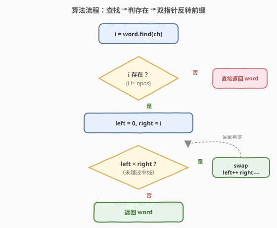
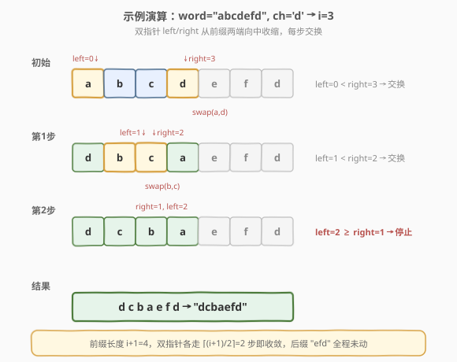

# LeetCode 反转单词前缀 题解

## 1. 题目概述

- **标题 / 题号**：反转单词前缀（#2000，easy）
- **链接**：https://leetcode.cn/problems/reverse-prefix-of-word/
- **难度**：简单
- **标签**：字符串、双指针

**题意**：给你一个下标从 **0** 开始的字符串 `word` 和一个字符 `ch`。找出 `ch` **第一次出现**的下标 `i`，**反转** `word` 中从下标 `0` 开始、直到下标 `i` 结束（含下标 `i`）的那段字符。如果 `word` 中不存在字符 `ch`，则无需进行任何操作。返回 **结果字符串**。

**示例 1**：

```text
输入：word = "abcdefd", ch = 'd'
输出："dcbaefd"
解释："d" 第一次出现在下标 3。反转从下标 0 到下标 3（含）的这段字符，结果字符串是 "dcbaefd"。
```

**示例 2**：

```text
输入：word = "xyxzxe", ch = 'z'
输出："zxyxxe"
解释："z" 第一次也是唯一一次出现是在下标 3。反转 [0..3]，结果为 "zxyxxe"。
```

**示例 3**：

```text
输入：word = "abcd", ch = 'z'
输出："abcd"
解释："z" 不存在于 word 中，无需执行反转操作。
```

**约束**：

- `1 <= word.length <= 250`
- `word` 由小写英文字母组成
- `ch` 是一个小写英文字母

> 💡 本题分两步：先**定位** `ch` 首次出现的下标 `i`，再**原地反转**前缀 `word[0..i]`。若 `ch` 不存在则原样返回。难点不在算法而在边界——「首次出现」「含下标 `i`」「不存在」三个细节决定代码是否正确。

## 2. 解题思路

### 2.1 暴力思路

最直觉的做法是「切分 + 拼接」：

- 从左向右扫描找 `ch` 第一次出现的下标 `i`。
- 把 `word` 切成 `word[0..i]` 和 `word[i+1..]` 两段。
- 反转前缀段，再与后缀段拼接返回。

这种写法正确，但会**创建中间子串**，空间复杂度 $O(n)$（Python 的切片、C++ 的 `substr` 都会拷贝）。而题目允许我们**直接在原串上操作**——只需一次双指针交换即可原地完成反转，无需额外空间。

### 2.2 核心观察：定位 + 原地双指针反转

![核心概念：定位 ch 首次出现 → 反转前缀 [0..i]](../images/rpw_reverse_prefix_concept.svg)

关键观察：`ch` 第一次出现的下标 `i` 把串切成**前缀 `[0..i]`** 和**后缀 `[i+1..]`** 两段。

- **前缀**需要反转：用左右双指针 `left = 0`、`right = i` 从两端向中收缩，每步 `swap(word[left], word[right])` 后 `left++`、`right--`，直到 `left >= right`。
- **后缀**原封不动：从 `i+1` 到末尾的字符不参与交换。

> 💡 关键直觉：**反转一个区间就是双指针从两端向中交换**。`left < right` 是循环守卫——当指针相遇或越过中线时停止，避免把已交换的字符再换回去（否则会还原成原串）。区间长度 $i+1$ 为偶数时指针最终 `left > right`（越过），为奇数时 `left == right`（正中字符不动），两种情况都由 `left < right` 统一处理，无需特判。

**时间复杂度**：$O(n)$（查找 $O(n)$ + 反转 $O(i) \le O(n)$）；**空间复杂度**：$O(1)$（原地交换，仅用索引）。若使用语言内置 `find`，查找阶段通常是优化过的快速实现，常数更小。

### 2.3 算法流程图



流程分三个阶段：

1. **查找**：`i = word.find(ch)` 定位 `ch` 首次出现的下标。
2. **判存在**：若 `i` 不存在（`npos` / `-1`），直接返回原 `word`。
3. **反转**：`left = 0, right = i`，循环 `while (left < right)` 执行 `swap` 后双指针相向收缩。循环结束后返回 `word`。

### 2.4 示例演算



以 `word = "abcdefd"`、`ch = 'd'` 为例，`d` 首次出现在下标 `3`，前缀 `[0..3] = "abcd"` 待反转：

- **初始**：`left = 0`、`right = 3`，串为 `[a b c d] e f d`。
- **第 1 步**：`left(0) < right(3)` → `swap(a, d)`，串变为 `[d b c a] e f d`；`left = 1`、`right = 2`。
- **第 2 步**：`left(1) < right(2)` → `swap(b, c)`，串变为 `[d c b a] e f d`；`left = 2`、`right = 1`。
- **终止**：`left(2) >= right(1)` → 循环退出。后缀 `efd` 全程未动。
- **返回** `"dcbaefd"`。

> 💡 注意第 2 步结束后 `left > right`（越过中线），这正是 `left < right` 守卫的作用——若写成 `left <= right`，第 3 步会交换 `word[2]` 与 `word[1]`（即 `b` 与 `c`），把刚换好的字符又换回去，结果错误地变成 `"dbcaefd"`。

## 3. 参考代码

### C++（原地双指针）

```cpp
class Solution {
  public:
    string reversePrefix(string word, char ch) {
        int i = word.find(ch);          // ch 首次出现的下标，不存在返回 -1
        if (i == string::npos) return word;
        int left = 0, right = i;
        while (left < right) {
            swap(word[left], word[right]);
            left++;
            right--;
        }
        return word;
    }
};
```

### Python（原地双指针）

```python
class Solution:
    def reversePrefix(self, word: str, ch: str) -> str:
        i = word.find(ch)               # 不存在返回 -1
        if i == -1:
            return word
        s = list(word)                  # str 不可变，转 list 原地交换
        left, right = 0, i
        while left < right:
            s[left], s[right] = s[right], s[left]
            left += 1
            right -= 1
        return "".join(s)
```

### Python（切片一行流，对比用）

```python
class Solution:
    def reversePrefix(self, word: str, ch: str) -> str:
        i = word.find(ch)
        return word if i == -1 else word[:i+1][::-1] + word[i+1:]
```

> ⚠️ **两种写法的对比**：切片写法简洁且 Pythonic，面试中可优先给出；但若面试官追问「能否 $O(1)$ 额外空间」，则需切换到双指针原地交换（Python 中 `str` 不可变，需先转 `list`，严格意义上仍是 $O(n)$ 空间，但体现了「不借助额外子串」的原地思想）。C++ 中 `string` 可变，双指针版本是真正的 $O(1)$ 额外空间。

## 4. 复杂度分析

| 维度 | 复杂度 | 说明 |
|------|--------|------|
| 时间复杂度 | $O(n)$ | `find` 查找最坏遍历整个串 $O(n)$；双指针反转最多走 $\lfloor (i+1)/2 \rfloor$ 步，$i \le n-1$ 故仍 $O(n)$；总体线性 |
| 空间复杂度 | $O(1)$（C++）/ $O(n)$（Python） | C++ 原地交换仅用两个索引；Python 因 `str` 不可变需转 `list`，额外 $O(n)$ 空间 |

> 与切片写法的对比：切片写法时间同为 $O(n)$，但空间为 $O(n)$（创建前缀反转副本 + 后缀副本）；C++ 双指针版本空间严格 $O(1)$，是面试中期望的「原地」解法。

## 5. 扩展：使用标准库 API

C++ 和 Python 都提供了直接反转区间的能力，可以进一步简化代码：

**C++（`std::reverse`）**：

```cpp
class Solution {
  public:
    string reversePrefix(string word, char ch) {
        int i = word.find(ch);
        if (i != string::npos) reverse(word.begin(), word.begin() + i + 1);
        return word;
    }
};
```

> 💡 `reverse(first, last)` 反转 $[first, last)$ 半开区间，故 `last` 应为 `word.begin() + i + 1`（越过下标 `i` 一个位置），对应反转 $[0..i]$ 闭区间。这是本题最容易写错的细节——半开区间末尾要 `+1`。

**Python（切片赋值，原地修改 list）**：

```python
class Solution:
    def reversePrefix(self, word: str, ch: str) -> str:
        i = word.find(ch)
        if i != -1:
            s = list(word)
            s[:i+1] = s[:i+1][::-1]   # 切片反转 + 原地赋值回 list
            word = "".join(s)
        return word
```

### 5.1 与 344. 反转字符串 的关系

[344. 反转字符串](https://leetcode.cn/problems/reverse-string/)（[站内题解](../0301-0400/344_反转字符串.md)）是本题的「母题」：反转整个字符数组。本题只需在 344 的双指针模板外**包一层「先定位 `ch` 下标」**，把反转范围从 $[0..n-1]$ 缩小到 $[0..i]$。掌握 344 的双指针模板后，本题就是「定位 + 套模板」的组合。

## 6. 面试要点

1. **为什么是 `ch` 的「第一次」出现？后续出现的 `ch` 要不要反转？**

   - 题目明确要求「第一次出现的下标 `i`」。后续出现的 `ch`（如示例 1 中下标 6 的 `d`）位于后缀 `[i+1..]` 内，不参与反转。用 `find` / `index` 天然返回首次出现位置，无需手动处理。

2. **`ch` 不存在时怎么处理？**

   - `find` 返回 `string::npos`（C++）或 `-1`（Python），此时直接返回原 `word`，**不进入反转逻辑**。这是必须显式判断的边界——若漏判，`i = -1` 会导致 `right = -1`，双指针循环不执行（`0 < -1` 为假），C++ 中看似无碍但逻辑不清晰；Python 切片 `word[:-1+1] = word[:0]` 反转空串虽不出错但语义错误。建议始终显式判空。

3. **双指针循环条件为什么是 `left < right` 而非 `left <= right`？**

   - `left < right` 保证只在指针未相遇时交换。当 `left == right`（前缀长度为奇数，正中字符）时无需交换——一个字符和自己交换无意义且浪费一次操作。更危险的是，若写成 `left <= right` 且未及时收缩，可能在越过中线后继续交换，把已反转的字符又换回去。`left < right` 是「反转区间」类问题的通用守卫。

4. **能否用标准库一行解决？**

   - 可以。C++ 用 `reverse(word.begin(), word.begin() + i + 1)`；Python 用 `word[:i+1][::-1] + word[i+1:]`。但面试中建议先手写双指针展示对反转过程的理解，再提及标准库作为对照。注意 C++ `reverse` 是半开区间 $[first, last)$，末尾要 `+1`。

5. **Python 中 `str` 不可变，如何做到「原地」？**

   - 严格意义上 Python 无法对 `str` 原地修改。双指针写法需先 `list(word)` 转成可变列表，交换后再 `"".join` 拼回，额外 $O(n)$ 空间。但相比切片写法，双指针版本不创建前缀/后缀两个子串副本，且展示了「区间反转」的核心思想，是面试中表达思路的更好载体。C++ 的 `string` 可变，双指针版本是真正的 $O(1)$ 额外空间。

## 同类练习题

| # | 题目 | 与本题的关联 |
|---|------|-------------|
| 344 | [反转字符串](https://leetcode.cn/problems/reverse-string/)（[站内题解](../0301-0400/344_反转字符串.md)) | 本题的母题——原地双指针反转整个字符数组，掌握此模板后本题只需加一层「定位下标」 |
| 541 | [反转字符串 II](https://leetcode.cn/problems/reverse-string-ii/) | 在 344 基础上加「每 $2k$ 个字符反转前 $k$ 个」的区间规则，同为双指针反转 + 区间判定 |
| 151 | [反转字符串中的单词](https://leetcode.cn/problems/reverse-words-in-a-string/)（[站内题解](../0101-0200/151_反转字符串中的单词.md)） | 字符串反转家族的另一形态——反转单词顺序而非字符顺序，需先逐词反转再整体反转 |
| 917 | [仅仅反转字母](https://leetcode.cn/problems/reverse-only-letters/) | 双指针反转但只交换字母、跳过非字母，是「带过滤的双指针反转」变体 |
| 125 | [验证回文串](https://leetcode.cn/problems/valid-palindrome/) | 双指针从两端向中比较（而非交换），同属「双指针操作字符串两端」范式 |
