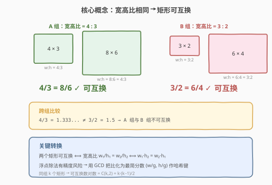
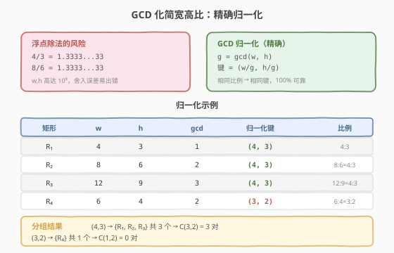
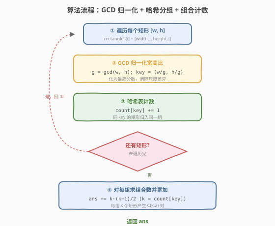
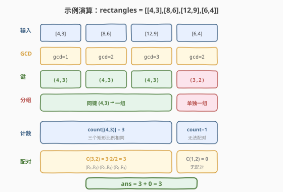

# 可互换矩形的数对

- **题目名称**：可互换矩形的数对
- **链接**：[2001. 可互换矩形的数对](https://leetcode.cn/problems/number-of-pairs-of-interchangeable-rectangles/)
- **难度**：中等
- **标签**：哈希表、数学、几何

## 1. 题目概述

给定一个下标从 **0** 开始的二维整数数组 `rectangles`，其中 `rectangles[i] = [width_i, height_i]` 表示第 `i` 个矩形的宽与高。

如果两个矩形 `i` 和 `j`（`i < j`）满足 $\dfrac{\text{width}_i}{\text{width}_j} = \dfrac{\text{height}_i}{\text{height}_j}$，则称它们**可互换**（即宽高比相同）。返回可互换矩形数对的**总数**。

**示例 1**：

```text
输入：rectangles = [[4,3],[6,5],[3,2],[4,3],[3,2]]
输出：2
解释：矩形 0 和 3 宽高比均为 4:3，可互换；矩形 2 和 4 宽高比均为 3:2，可互换。
共 2 对。
```

**示例 2**：

```text
输入：rectangles = [[4,3],[8,6],[12,9],[6,4]]
输出：3
解释：矩形 0、1、2 宽高比均为 4:3（8:6 = 12:9 = 4:3），三两组合共 C(3,2)=3 对。
```

**约束条件**：

- $n = \text{rectangles.length}$
- $1 \le n \le 10^5$
- $\text{rectangles}[i].\text{length} == 2$
- $1 \le \text{width}_i, \text{height}_i \le 10^9$

> 💡 **审题关键**：① 「可互换」的本质是**宽高比相同**，与矩形绝对尺寸无关——`[4,3]` 与 `[8,6]` 比例一致即可互换；② 答案是**数对计数**而非最大组大小，同组 $k$ 个矩形贡献 $C(k,2) = \dfrac{k(k-1)}{2}$ 对；③ $n \le 10^5$ 时答案可达 $C(10^5, 2) \approx 5 \times 10^9$，**超出 32 位整数**，C++ 必须用 `long long`。

---

## 2. 解题思路

### 2.1 暴力思路：两两比较

最直观的做法：双重循环枚举所有数对 `(i, j)`，逐对判定是否可互换（即 `width_i/width_j == height_i/height_j`）。

```text
for i in 0..n:
    for j in i+1..n:
        if rectangles[i][0] * rectangles[j][1] == rectangles[i][1] * rectangles[j][0]:
            ans++
```

- **正确性**：穷举所有数对并逐个判定，显然正确（用交叉相乘 `w_i·h_j == h_i·w_j` 避免除法，规避浮点与除零）。
- **效率**：$O(n^2)$。$n = 10^5$ 时约 $5 \times 10^9$ 次比较，**远超时限**。

> ⚠️ 暴力法的浪费在于「重复比较同比例的矩形」。若 5 个矩形比例相同，它们两两形成的 10 个数对都满足条件，却各自独立判定。破局思路：**先按比例分组，再在组内用组合数一次性统计**。

### 2.2 核心观察：GCD 归一化 + 哈希分组



**关键转换**分三步：

**第一步：把「可互换」归约为「宽高比相同」。** 两矩形可互换 $\Leftrightarrow \dfrac{w_i}{w_j} = \dfrac{h_i}{h_j} \Leftrightarrow \dfrac{w_i}{h_i} = \dfrac{w_j}{h_j}$。于是每个矩形对应一个**宽高比** $r = w : h$，比例相同的矩形互相可互换。

**第二步：用 GCD 把比例化为最简分数。** 直接用浮点数 `w / h` 作哈希键有精度风险（$w, h$ 高达 $10^9$，不同分数的浮点表示可能碰撞）。将比例表示为最简分数 $\left(\dfrac{w}{g}, \dfrac{h}{g}\right)$，其中 $g = \gcd(w, h)$，化简后相同的分数必代表同一比例。



**第三步：组内组合计数。** 用哈希表统计每个归一化比例出现的次数。若某比例出现 $k$ 次，则它贡献 $C(k, 2) = \dfrac{k(k-1)}{2}$ 个可互换数对（从 $k$ 个矩形中任选 2 个）。累加所有组的贡献即为答案。

> 💡 **与 149. 直线上最多的点数 同构**：149 题用 GCD 化简斜率 $(\Delta y, \Delta x)$ 作哈希键统计同斜率的点数，本题用 GCD 化简宽高比 $(w, h)$ 作哈希键统计同比例的矩形数——同一套「GCD 归一化 + 哈希分组」范式。区别仅在：149 求最大组大小，本题求所有组的组合数之和。

### 2.3 算法流程图



**完整步骤**：

1. **初始化** `count = {}`（空哈希表），`ans = 0`（用 64 位整数）
2. **遍历**每个矩形 `[w, h]`：
   - 计算 $g = \gcd(w, h)$
   - 归一化键 `key = (w/g, h/g)`
   - `count[key] += 1`
3. **遍历**哈希表每个值 $k$：
   - `ans += k * (k - 1) / 2`
4. 返回 `ans`

> 💡 也可以在遍历矩形时**边计数边累加**：对当前矩形，先 `ans += count[key]`（与已入组的矩形配对），再 `count[key] += 1`。等价于 $C(k,2) = \sum_{i=1}^{k-1} i$，省去二次遍历。

### 2.4 示例演算

以 `rectangles = [[4,3],[8,6],[12,9],[6,4]]` 演示：



| 矩形 | $w$ | $h$ | $g=\gcd(w,h)$ | 归一化键 $(w/g, h/g)$ | 哈希表变化 |
|------|-----|-----|---------------|----------------------|-----------|
| R₁ | 4 | 3 | 1 | $(4, 3)$ | `{(4,3): 1}` |
| R₂ | 8 | 6 | 2 | $(4, 3)$ | `{(4,3): 2}` |
| R₃ | 12 | 9 | 3 | $(4, 3)$ | `{(4,3): 3}` |
| R₄ | 6 | 4 | 2 | $(3, 2)$ | `{(4,3): 3, (3,2): 1}` |

- 组 $(4,3)$：$k = 3$，贡献 $C(3,2) = \dfrac{3 \times 2}{2} = 3$ 对
- 组 $(3,2)$：$k = 1$，贡献 $C(1,2) = 0$ 对
- **答案**：$3 + 0 = 3$ ✓

> 💡 **观察要点**：① 三个矩形 `[4,3]`、`[8,6]`、`[12,9]` 尺寸不同但比例均为 $4:3$，GCD 归一化后映射到同一键；② 组内只需 $k$ 即可算出 $C(k,2)$，无需枚举具体数对——这是从 $O(n^2)$ 降到 $O(n)$ 的关键；③ 边计数边累加写法中，R₁ 入组时 `count=0` 加 0，R₂ 入组时加 1（与 R₁ 配对），R₃ 入组时加 2（与 R₁、R₂ 配对），累计 $0+1+2=3$，与 $C(3,2)$ 完全一致。

---

## 3. 参考代码

### C++

```cpp
// 可互换矩形的数对.cpp —— GCD 归一化 + 哈希分组 + 组合计数
// 编译: g++ -O2 -std=c++17 可互换矩形的数对.cpp -o interchangeable
#include <vector>
#include <unordered_map>
#include <numeric>
using namespace std;

class Solution {
  public:
    long long interchangeableRectangles(vector<vector<int>>& rectangles) {
        unordered_map<long long, int> count;
        long long ans = 0;
        for (const auto& r : rectangles) {
            int w = r[0], h = r[1];
            int g = gcd(w, h);
            long long key = (long long)(w / g) * 200000LL + (h / g);
            ans += count[key];       // 与已入组的同比例矩形逐一配对
            count[key]++;
        }
        return ans;
    }
};
```

### Python

```python
from math import gcd
from collections import defaultdict

class Solution:
    def interchangeableRectangles(self, rectangles: list[list[int]]) -> int:
        count = defaultdict(int)
        ans = 0
        for w, h in rectangles:
            g = gcd(w, h)
            key = (w // g, h // g)
            ans += count[key]        # 与已入组的同比例矩形逐一配对
            count[key] += 1
        return ans
```

> ⚠️ **C++ 哈希键编码**：`pair<int,int>` 在 `unordered_map` 中需自定义哈希，较繁琐。这里用 `long long` 把两个分量编码为单值 `key = (w/g) * 200000 + (h/g)`。归一化后 $w/g, h/g \le 10^9$，但同组内 $g$ 已消除公因子，实际分量远小于 $10^9$；为绝对安全可改用字符串或 `pair` + 自定义哈希。Python 直接用元组 `(w//g, h//g)` 作键，最简洁。
>
> ⚠️ **溢出**：答案最大 $C(10^5, 2) \approx 4.99995 \times 10^9$，超出 `int`（约 $2.1 \times 10^9$）。C++ 中 `ans` 与 `count[key]` 累加均需 `long long`；Python 整数任意精度无此问题。

---

## 4. 复杂度分析

| 维度 | 复杂度 | 说明 |
|------|--------|------|
| **时间复杂度** | $O(n \log M)$ | 遍历 $n$ 个矩形，每次 $\gcd$ 为 $O(\log M)$（$M = \max(w, h) \le 10^9$，$\log M \approx 30$） |
| **空间复杂度** | $O(n)$ | 哈希表最坏存 $n$ 个不同比例 |
| **最优时间** | $O(n \log M)$ | 每个矩形至少计算一次比例，$\gcd$ 不可避免 |

> 💡 $\gcd$ 的 $O(\log M)$ 是常数级别（$M \le 10^9$，$\log M \approx 30$），对总复杂度影响很小，通常简写为 $O(n)$。本题 $n = 10^5$，总操作约 $3 \times 10^6$，远在时限内。

---

## 5. 扩展：为什么交叉相乘也能判等，但本题不直接用？

判定 $\dfrac{w_i}{h_i} = \dfrac{w_j}{h_j}$ 的两种精确方法：

| 方法 | 判定式 | 优点 | 缺点 |
|------|--------|------|------|
| **交叉相乘** | $w_i \cdot h_j == h_i \cdot w_j$ | 无浮点、无需 GCD | 两两比较 $O(n^2)$，无法分组 |
| **GCD 归一化** | $(w_i/g_i, h_i/g_i) == (w_j/g_j, h_j/g_j)$ | 可哈希分组，$O(n)$ | 需计算 GCD |

交叉相乘在**判定单个数对**时更直接（无 GCD 开销），但**无法把同比例的矩形归到一组**——因为 `(w_i·h_j, h_i·w_j)` 依赖于具体配对，而非单个矩形的固有属性。GCD 归一化为每个矩形生成**独立的比例指纹** $(w/g, h/g)$，才能用哈希表分组并一次性统计组合数。

> 💡 **本质区别**：交叉相乘是**关系判定**（描述两个对象间的关系），GCD 归一化是**属性抽取**（为每个对象生成可比较的规范形式）。当问题需要「按等价类分组」时，属性抽取远胜关系判定。这与 149 题用 GCD 化简斜率而非逐对算叉积判共线是同一道理。

---

## 6. 面试要点

**Q1：为什么用 GCD 归一化比例，而不是直接用浮点数 `w / h`？**

> 浮点除法有精度限制。$w, h$ 高达 $10^9$，某些不同分数的 `double` 表示可能因舍入误差而碰撞（或相同分数因计算路径不同而不等）。GCD 把比例化为最简整数分数 $(w/g, h/g)$，是 100% 精确的，且 `gcd` 运算极快（$O(\log M)$）。这是处理「精确有理数比较」的标准做法。

**Q2：答案为什么可能溢出 32 位整数？如何处理？**

> 最坏情况：所有 $n = 10^5$ 个矩形比例相同，答案 $C(10^5, 2) = \dfrac{10^5 \times (10^5 - 1)}{2} \approx 4.99995 \times 10^9$，超过 `int` 上限 $\approx 2.1 \times 10^9$。C++ 中 `ans` 必须声明为 `long long`；`count[key]` 虽然单个不超 $10^5$，但累加到 `ans` 时需 64 位。Python 整数任意精度，无需额外处理。

**Q3：边计数边累加与先分组再求和，两种写法等价吗？**

> 完全等价。边计数边累加：处理第 $i$ 个同组矩形时，`ans += count[key]`（已有 `count[key]` 个先入组的矩形与之配对），再 `count[key]++`。累计贡献 $\sum_{i=0}^{k-1} i = \dfrac{k(k-1)}{2} = C(k,2)$。两种写法结果一致，前者省一次遍历、后者可读性略好。

**Q4：C++ 中如何处理 `pair<int,int>` 作为哈希键？**

> `unordered_map<pair<int,int>, int>` 无法直接使用，因为标准库没有为 `pair` 提供哈希。三种方案：① 自定义哈希仿函数；② 用 `map<pair<int,int>, int>`（有序，$O(\log n)$ 查找，稍慢）；③ 把两分量编码为单个 `long long`（如 `key = a * BASE + b`，`BASE` 取大于分量上界的值）。本题采用方案 ③，简洁高效。

**Q5：本题与 149. 直线上最多的点数 有何异同？**

> **同**：都用 GCD 化简分数作哈希键（149 是斜率 $(\Delta y, \Delta x)$，本题是宽高比 $(w, h)$），都按等价类分组。**异**：149 求最大组大小（`max(count.values())`），本题求所有组的组合数之和（`sum C(k,2)`）；149 对每个点单独建表（因斜率依赖参考点），本题全局一张表（比例是矩形固有属性）。掌握「GCD 归一化 + 哈希分组」范式即可迁移。

> 💡 **一句话总结**：可互换 $\Rightarrow$ 宽高比相同 $\Rightarrow$ GCD 归一化为最简分数 $(w/g, h/g)$ 作哈希键 $\Rightarrow$ 同组 $k$ 个矩形贡献 $C(k,2)$ 对。核心是「把关系判定转为属性抽取」，用 GCD 为每个矩形生成规范化的比例指纹。

---

## 7. 同类练习题

- [149. 直线上最多的点数](https://leetcode.cn/problems/max-points-on-line/)（[题解](../0101-0200/149_直线上最多的点数.md)）：同套「GCD 归一化 + 哈希分组」范式的母题，用 GCD 化简斜率作哈希键统计同斜率的点，对照体会属性抽取的通用性
- [1. 两数之和](https://leetcode.cn/problems/two-sum/)（[题解](../0001-0100/1_两数之和.md)）：哈希表「固定一个查匹配」的经典范式，与本题「按等价类分组计数」同为哈希表计数家族
- [454. 四数相加 II](https://leetcode.cn/problems/4sum-ii/)（[题解](../0401-0500/454_四数相加II.md)）：分组 + 哈希计数（Meet in the Middle），同样是「先归约为可哈希的键再统计配对数」
- [219. 存在重复元素 II](https://leetcode.cn/problems/contains-duplicate-ii/)：哈希表按值分组 + 滑动窗口判定近邻，对照「按值分组」与「按比例分组」的思路差异
- [2260. 划分成相等数对](https://leetcode.cn/problems/divide-array-into-equal-pairs/)：按值哈希分组判定能否两两配对，是本题「分组 + 组内配对」思路的判定型变体
