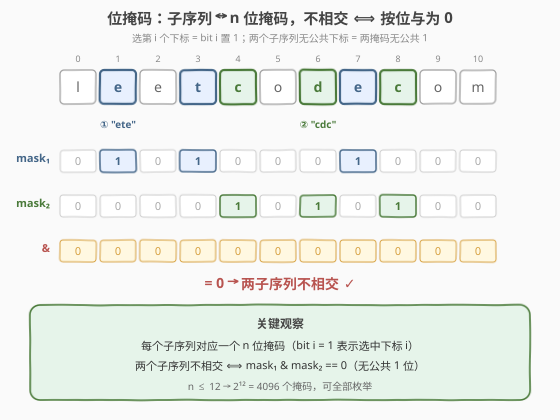
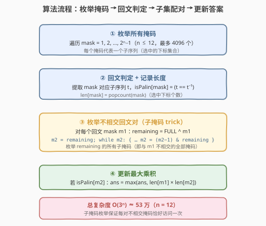
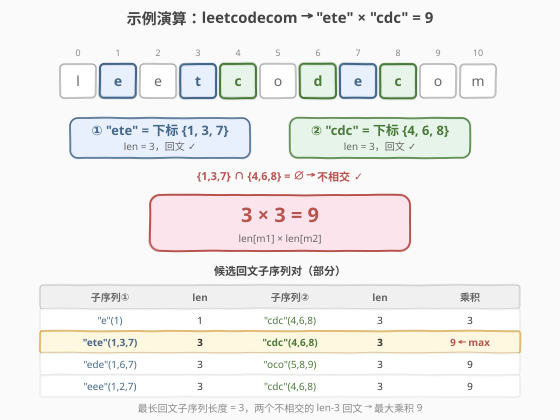

# 两个回文子序列长度的最大乘积

- **题目名称**：两个回文子序列长度的最大乘积
- **链接**：[2002. 两个回文子序列长度的最大乘积](https://leetcode.cn/problems/maximum-product-of-the-length-of-two-palindromic-subsequences/)
- **难度**：中等
- **标签**：位运算、状态压缩、枚举

## 1. 题目概述

给定一个字符串 $s$，请你找到 $s$ 中两个**不相交回文子序列**，使得它们长度的**乘积最大**。两个子序列在原字符串中如果没有任何相同下标的字符，则它们是**不相交**的。返回两个回文子序列长度可以达到的最大乘积。

**子序列**：从原字符串中删除若干个字符（可以一个也不删除）后，剩余字符不改变顺序而得到的结果。**回文字符串**：从前往后读和从后往前读一模一样的字符串。

**示例 1**：

```text
输入：s = "leetcodecom"
输出：9
解释：最优方案是选择 "ete"（下标 1,3,7）作为第一个子序列，"cdc"（下标 4,6,8）作为第二个子序列。
      它们的乘积为 3 * 3 = 9。
```

**示例 2**：

```text
输入：s = "bb"
输出：1
解释：最优方案为选择 "b"（第一个字符）和 "b"（第二个字符），乘积为 1 * 1 = 1。
```

**示例 3**：

```text
输入：s = "accbcaxxcxx"
输出：25
解释：最优方案为选择 "accca" 和 "xxcxx"，乘积为 5 * 5 = 25。
```

**约束条件**：

- $2 \le s.length \le 12$
- $s$ 只含有小写英文字母。

> 💡 **审题关键**：① **不相交**指两个子序列**不共享任何下标**，而非子序列内容不同——"bb" 中两个 "b" 内容相同但下标不同，仍合法；② 子序列**保持原序**但不必连续；③ $n \le 12$ 是本题最关键的约束——它暗示可以用**指数级枚举**（$2^n$ 或 $3^n$）直接求解，无需复杂优化。

---

## 2. 解题思路

### 2.1 暴力思路：DFS 同时构造两个子序列

最直观的做法是**逐个字符决定去向**：对字符串的每个位置 $i$，字符 $s[i]$ 有三种选择——

1. **加入子序列 ①**；
2. **加入子序列 ②**；
3. **跳过**（两个子序列都不选）。

走到末尾时，检查两个构造出的子序列是否都是回文，若是则计算长度乘积并更新答案。

```
dfs(i, s1, s2):
    if i == n:
        if s1 是回文 and s2 是回文:
            ans = max(ans, len(s1) * len(s2))
        return
    dfs(i+1, s1, s2)            # 跳过 s[i]
    dfs(i+1, s1 + s[i], s2)     # s[i] 加入子序列 ①
    dfs(i+1, s1, s2 + s[i])     # s[i] 加入子序列 ②
```

- **正确性**：每个字符的三种去向穷尽了所有「两个不相交子序列」的构造方式，末尾回文检查保证合法。
- **效率**：每个位置 3 种选择，共 $3^n$ 个叶子。$n = 12$ 时 $3^{12} = 531\,441$，每个叶子做两次回文判定 $O(n)$，总量 $\approx 6 \times 10^6$，勉强可过但有冗余——大量叶子在构造过程中已经注定不优（如 $s_1$ 很短时无论 $s_2$ 多长乘积都小），且重复进行回文判定。

> ⚠️ DFS 的核心浪费在于**把「选哪些下标」和「判定回文」耦合在一起**——其实一个子序列是否回文只取决于它选了哪些下标，与另一个子序列无关。把「下标集合」提前枚举并预判定回文，就能解耦。

### 2.2 核心观察：位掩码枚举 + 子集配对



关键洞察分三步：

**第一步：子序列 ↔ 位掩码。** 字符串长度 $n \le 12$，每个子序列可以唯一地用一个 $n$ 位二进制掩码表示——bit $i$ 为 1 表示选中下标 $i$，为 0 表示不选。掩码取值范围 $[0, 2^n - 1]$，总共 $2^{12} = 4096$ 个，完全可以枚举。

**第二步：不相交 ⟺ 按位与为 0。** 两个子序列不相交（无公共下标），等价于它们对应的掩码 $m_1$、$m_2$ 满足 $m_1 \mathbin{\&} m_2 = 0$——即两个掩码没有任何公共的 1 位。这把「不相交」这个集合关系转化为一个 $O(1)$ 的位运算判定。

**第三步：回文属性可预计算。** 一个掩码是否对应回文子序列，只取决于掩码本身（选了哪些下标及这些位置的字符），与配对无关。因此可以**预处理**所有掩码的回文性与长度，后续配对时 $O(1)$ 查表。

> 💡 **一句话**：把「构造两个子序列」分解为「枚举所有子序列掩码 → 预判回文 → 在不相交掩码对中找最大乘积」，利用位掩码把 $3^n$ 的 DFS 压缩为 $O(3^n)$ 的子集枚举，且每个状态 $O(1)$ 查表。

### 2.3 算法流程图



整体分四个阶段：

1. **枚举所有掩码**：遍历 $mask = 1, 2, \ldots, 2^n - 1$（跳过 0，空子序列长度为 0 不产生正乘积）。
2. **回文判定 + 记录长度**：对每个掩码，提取对应子序列 $t$，判定 $t$ 是否回文（$t == t^{-1}$），记录 `isPalin[mask]` 与 `len[mask]`（$= \text{popcount}(mask)$）。
3. **枚举不相交回文对**：对每个回文掩码 $m_1$，计算 $remaining = \text{FULL} \oplus m_1$（$m_1$ 的补集），然后用**子掩码枚举 trick** 遍历 $remaining$ 的所有子掩码 $m_2$——这些 $m_2$ 恰好是与 $m_1$ 不相交的全部掩码。
4. **更新最大乘积**：若 $m_2$ 也是回文，则 $ans = \max(ans, \text{len}[m_1] \times \text{len}[m_2])$。

> ⚠️ **子掩码枚举 trick**：`m2 = remaining; while m2: { 处理 m2; m2 = (m2 - 1) & remaining; }`。该循环按递减顺序遍历 $remaining$ 的所有非空子掩码，总数 $2^{\text{popcount}(remaining)}$。对所有 $m_1$ 求和，总量为 $\sum_{k=0}^{n} \binom{n}{k} 2^{n-k} = 3^n$，$n=12$ 时约 $5.3 \times 10^5$，极快。

### 2.4 示例演算

以**示例 1** $s = \text{"leetcodecom"}$（$n = 11$）演算：



字符串下标与字符：

| 下标 | 0 | 1 | 2 | 3 | 4 | 5 | 6 | 7 | 8 | 9 | 10 |
|------|---|---|---|---|---|---|---|---|---|---|----|
| 字符 | l | e | e | t | c | o | d | e | c | o | m |

**回文掩码预计算**（部分）：

- $m_1 = \text{bit}\{1,3,7\}$：子序列 "ete"，回文 ✓，$\text{len} = 3$
- $m_2 = \text{bit}\{4,6,8\}$：子序列 "cdc"，回文 ✓，$\text{len} = 3$
- 其他长度-3 回文子序列："ede"(1,6,7)、"oco"(5,8,9)、"eee"(1,2,7)、"cec"(4,7,8) 等

**配对与乘积**：

- $m_1 = \text{bit}\{1,3,7\}$（"ete"），$remaining$ 包含下标 $\{0,2,4,5,6,8,9,10\}$。枚举 $remaining$ 的子掩码，发现 $m_2 = \text{bit}\{4,6,8\}$（"cdc"）是回文且 $\text{len} = 3$，乘积 $3 \times 3 = 9$。
- 其他不相交回文对如 "ede"×"oco" = 9、"eee"×"cdc" = 9 等，乘积均为 9。
- 不存在长度 $\ge 4$ 的回文子序列（3 个 e、2 个 c、2 个 o，无法凑出更长的回文），故最大乘积为 $9$。

> 💡 **为什么没有更大的乘积？** 字符串中最长回文子序列长度为 3（如 "ete"、"cdc" 等），两个不相交的长度-3 回文子序列的最大乘积为 $3 \times 3 = 9$。即使有一个长度-4 回文配一个长度-2 回文（$4 \times 2 = 8 < 9$），也不如 $3 \times 3$ 优。这说明**乘积最大不等于各自最长**——需要枚举所有配对才能确定。

---

## 3. 参考代码

### C++（位掩码枚举 + 子掩码配对）

```cpp
class Solution {
public:
    int maxProduct(string s) {
        int n = s.size();
        int FULL = (1 << n) - 1;

        // 预处理：每个掩码的回文性与长度
        vector<bool> isPalin(1 << n, false);
        vector<int> lenn(1 << n, 0);

        for (int mask = 1; mask <= FULL; mask++) {
            // 提取子序列
            string t;
            for (int i = 0; i < n; i++) {
                if (mask & (1 << i)) t += s[i];
            }
            lenn[mask] = t.size();
            // 判定回文
            bool ok = true;
            for (int i = 0, j = t.size() - 1; i < j; i++, j--) {
                if (t[i] != t[j]) { ok = false; break; }
            }
            isPalin[mask] = ok;
        }

        // 枚举不相交回文对
        int ans = 0;
        for (int m1 = 1; m1 <= FULL; m1++) {
            if (!isPalin[m1]) continue;
            int remaining = FULL ^ m1;
            // 子掩码枚举 trick：遍历 remaining 的所有非空子掩码
            for (int m2 = remaining; m2 > 0; m2 = (m2 - 1) & remaining) {
                if (isPalin[m2]) {
                    ans = max(ans, lenn[m1] * lenn[m2]);
                }
            }
        }
        return ans;
    }
};
```

### Python（位掩码枚举 + 子掩码配对）

```python
class Solution:
    def maxProduct(self, s: str) -> int:
        n = len(s)
        FULL = (1 << n) - 1

        # 预处理：每个掩码的回文性与长度
        is_palin = [False] * (1 << n)
        length = [0] * (1 << n)

        for mask in range(1, 1 << n):
            t = ''.join(s[i] for i in range(n) if mask & (1 << i))
            length[mask] = len(t)
            is_palin[mask] = (t == t[::-1])

        # 枚举不相交回文对
        ans = 0
        for m1 in range(1, 1 << n):
            if not is_palin[m1]:
                continue
            remaining = FULL ^ m1
            m2 = remaining
            while m2:
                if is_palin[m2]:
                    ans = max(ans, length[m1] * length[m2])
                m2 = (m2 - 1) & remaining
        return ans
```

> 💡 **代码要点**：① 外层只遍历回文掩码 $m_1$（`if (!isPalin[m1]) continue`），跳过非回文掩码大幅减少内层循环；② 子掩码枚举 `m2 = (m2 - 1) & remaining` 保证每次迭代都在 $remaining$ 的子掩码内，且按递减顺序不重不漏；③ `remaining = FULL ^ m1`（等价于 `FULL & ~m1`）取出 $m_1$ 未占用的所有位，$m_2$ 在其中取子集天然保证与 $m_1$ 不相交。

---

## 4. 复杂度分析

| 维度 | 复杂度 | 说明 |
|------|--------|------|
| 时间复杂度 | $O(3^n)$ | 预处理 $O(n \cdot 2^n)$（每个掩码提取子序列 $O(n)$）；配对阶段对每个 $m_1$ 枚举 $remaining$ 的子掩码，总量 $\sum_{k=0}^{n} \binom{n}{k} 2^{n-k} = 3^n$，每次 $O(1)$ 查表。$n = 12$ 时 $3^{12} \approx 5.3 \times 10^5$ |
| 空间复杂度 | $O(2^n)$ | `isPalin` 与 `len` 数组各 $2^n$ 大小，$n = 12$ 时 $4096$ 个元素 |

> 💡 $n \le 12$ 是本题能用位掩码枚举的关键边界。若 $n$ 增大到 20，$3^{20} \approx 3.5 \times 10^9$ 不可行，需改用状压 DP 或其他优化。LeetCode 将 $n$ 限制在 12 正是为了让 $O(3^n)$ 解法通过。

---

## 5. 扩展：DFS 三分支写法

除了位掩码枚举，还可以用 DFS 同时构造两个子序列，逻辑更直观但效率略低：

```python
class Solution:
    def maxProduct(self, s: str) -> int:
        n = len(s)
        ans = 0

        def dfs(i: int, s1: str, s2: str):
            nonlocal ans
            if i == n:
                if s1 and s2 and s1 == s1[::-1] and s2 == s2[::-1]:
                    ans = max(ans, len(s1) * len(s2))
                return
            dfs(i + 1, s1, s2)            # 跳过 s[i]
            dfs(i + 1, s1 + s[i], s2)     # s[i] 加入子序列 ①
            dfs(i + 1, s1, s2 + s[i])     # s[i] 加入子序列 ②

        dfs(0, "", "")
        return ans
```

- **复杂度**：$O(3^n \cdot n)$——$3^n$ 个叶子，每个做两次回文判定 $O(n)$。$n = 12$ 时 $\approx 6 \times 10^6$，可过。
- **对比位掩码**：DFS 不需要预计算和位运算，代码更短更易懂，适合面试时先写出来再优化；位掩码解法把回文判定提前到预处理阶段，配对时 $O(1)$ 查表，常数更优。

> 💡 两种解法的**搜索空间本质相同**——DFS 的每个叶子对应一对不相交子序列（两个下标集合），位掩码枚举则显式地遍历所有掩码对并过滤不相交的。位掩码的优势在于用子掩码 trick 直接跳过所有相交对，而 DFS 天然只产生不相交对（每个字符只去一个地方），无需过滤。

---

## 6. 面试要点

**Q1：为什么用位掩码表示子序列？**

> $n \le 12$ 时，所有子序列只有 $2^{12} = 4096$ 个，用一个 12 位整数即可唯一表示每个子序列（bit $i$ = 1 表示选下标 $i$）。位掩码的好处是：①「不相交」转化为 $O(1)$ 的按位与判定 $m_1 \mathbin{\&} m_2 = 0$；② 可用子掩码枚举 trick 高效遍历所有不相交掩码对，总量 $O(3^n)$；③ 回文属性可预计算并 $O(1)$ 查表。

**Q2：子掩码枚举 trick 的原理是什么？**

> `m2 = (m2 - 1) & remaining` 的每一次迭代将 $m_2$ 减 1 后与 $remaining$ 取按位与。减 1 操作会把 $m_2$ 最低位的 1 变 0、其下所有位变 1，再 `& remaining` 把超出 $remaining$ 范围的位清零，从而得到 $remaining$ 的下一个子掩码。该循环按递减顺序不重不漏地遍历 $remaining$ 的所有非空子掩码，总数 $2^{\text{popcount}(remaining)} - 1$。

**Q3：为什么复杂度是 $O(3^n)$ 而不是 $O(4^n)$？**

> 朴素双循环枚举所有掩码对 $(m_1, m_2)$ 是 $O(4^n)$。但用子掩码 trick 后，对每个 $m_1$ 只遍历 $remaining = \text{FULL} \oplus m_1$ 的子掩码（即与 $m_1$ 不相交的掩码），跳过了所有相交对。总量 $\sum_{k=0}^{n} \binom{n}{k} 2^{n-k} = (1+2)^n = 3^n$，这是组合恒等式 $\sum \binom{n}{k} 2^{n-k} = 3^n$ 的直接应用。

**Q4：DFS 写法和位掩码写法哪个更适合面试？**

> 视时间约束而定。DFS 三分支写法逻辑直观、代码短，适合**先写出正确解**向面试官展示思路，然后口述优化方向。位掩码写法展示了位运算和子掩码枚举的功底，适合在面试官追问「能否更高效」时给出。两者复杂度分别为 $O(3^n \cdot n)$ 和 $O(3^n)$，在 $n \le 12$ 下都能通过。

**Q5：如果 $n$ 更大（如 $n \le 20$）怎么办？**

> $O(3^{20}) \approx 3.5 \times 10^9$ 不可行。可考虑状压 DP：令 $dp[mask]$ 为在 $mask$ 表示的下标集合内能取到的最长回文子序列长度，预处理后枚举 $mask$ 的所有划分 $(m_1, mask \oplus m_1)$ 取 $dp[m_1] \times dp[mask \oplus m_1]$ 的最大值。预处理 $dp$ 可用区间 DP $O(n^2 \cdot 2^n)$，划分枚举 $O(3^n)$ 仍太慢，需进一步用 SOS DP（Sum Over Subsets）优化到 $O(n \cdot 2^n)$。

> 💡 **一句话总结**：$n \le 12$ 的小数据规模是位掩码枚举的信号——用掩码表示子序列、按位与判不相交、子掩码 trick 枚举配对，$O(3^n)$ 一气呵成。

---

## 7. 同类练习题

- [78. 子集](https://leetcode.cn/problems/subsets/)：位掩码枚举所有子集的母题，本题枚举子序列掩码的基础
- [131. 分割回文串](https://leetcode.cn/problems/palindrome-partitioning/)：回文判定 + 回溯搜索，训练回文子序列/子串的判定直觉
- [1986. 完成任务的最少工作时间段](https://leetcode.cn/problems/minimum-number-of-work-sessions-to-finish-the-tasks/)：$n \le 14$ 的状压 DP，同为「$n$ 极小 → 位掩码」的信号题
- [46. 全排列](https://leetcode.cn/problems/permutations/)：回溯枚举的经典母题，与本题 DFS 三分支写法思路相通
- [5. 最长回文子串](https://leetcode.cn/problems/longest-palindromic-substring/)：回文问题基础，中心扩展法是判定/寻找回文的入门套路
