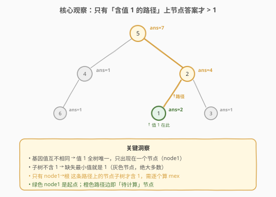
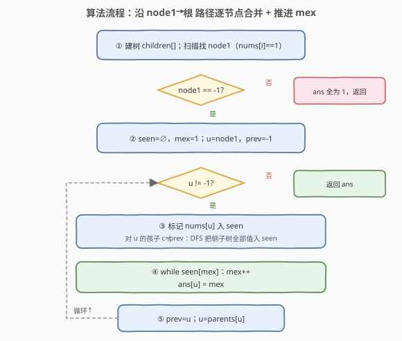
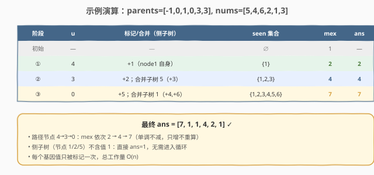

# 每棵子树内缺失的最小基因值

- **题目名称**：每棵子树内缺失的最小基因值
- **链接**：[2003. 每棵子树内缺失的最小基因值](https://leetcode.cn/problems/smallest-missing-genetic-value-in-each-subtree/)
- **难度**：困难
- **标签**：树、深度优先搜索、并查集、枚举优化

## 1. 题目概述

有一棵以节点 `0` 为根的家族树，共 `n` 个节点（编号 `0` 到 `n-1`）。给定 `parents`，其中 `parents[i]` 是节点 `i` 的父节点（`parents[0] == -1`）。每个节点有一个**互不相同**的基因值 `nums[i]`（取值 `[1, 10^5]`）。

对每个节点 `i`，求以 `i` 为根的**子树**内**缺失的最小正整数**基因值，返回长度为 `n` 的数组 `ans`。

**示例 1**：

```text
输入：parents = [-1,0,0,2], nums = [1,2,3,4]
输出：[5,1,1,1]

        0(1)
       /   \
     1(2)  2(3)
            \
            3(4)
```

- 节点 0 子树含 `{1,2,3,4}` → 缺失最小为 5
- 节点 1/2/3 的子树均不含 1 → 答案都是 1

**示例 2**：

```text
输入：parents = [-1,0,1,0,3,3], nums = [5,4,6,2,1,3]
输出：[7,1,1,4,2,1]

        0(5)
       /    \
     1(4)   3(2)
      |     /   \
     2(6) 4(1)  5(3)
```

各子树答案：0→7，1→1，2→1，3→4，4→2，5→1。

**约束条件**：

- `n == parents.length == nums.length`
- `2 <= n <= 10^5`
- `parents[0] == -1`，其余 `0 <= parents[i] <= n-1`，表示一棵合法的树
- `1 <= nums[i] <= 10^5`，且 `nums[i]` **互不相同**

> 💡 本题难点在于 `n` 高达 $10^5$，对每个节点独立求 mex 会退化到 $O(n^2)$。突破口藏在「基因值互不相同」这一约束里——它把整棵树的计算压缩到**一条从根到某节点的路径**上。

---

## 2. 解题思路

### 2.1 暴力思路：逐节点收集子树值再求 mex

最直观的做法：对每个节点 `i`，DFS 遍历它的子树收集所有基因值放入集合，再从 1 开始递增找到第一个不在集合中的正整数。单节点 $O(\text{子树大小})$，全体求和为 $O(n^2)$（每个节点被它的所有祖先各访问一次）。`n = 10^5` 时必然超时，且**完全没利用「基因值互不相同」与「mex 单调性」**。

### 2.2 核心观察：只关心「含值 1 的路径」



**关键洞察**：基因值互不相同 ⟹ 值 `1` 在全树中**唯一**，只出现在某个节点 `node1`。于是：

> 一个节点的子树**含值 1** ⟺ 该节点是 `node1` 或 `node1` 的祖先（即位于 `node1 → 根` 这条路径上）。

- **不在路径上的节点**：子树不含 1 ⟹ 缺失的最小正整数就是 **1**，答案直接为 1（占绝大多数，全树至多 `n` 个节点里只有路径长度个例外）。
- **路径上的节点**：子树含 1，答案 $\geq 2$，需真正计算 mex。

进一步，路径上**越靠近根**的节点，其子树是「下方路径节点子树」的超集（路径节点的子树沿路径向上单调变大，只会不断并入新的侧子树）。因此：

> 把 `node1` 的子树值集合作为起点，沿路径**向上**逐节点「并入当前节点的值 + 当前节点的侧子树（非路径孩子的子树）」，并维护一个**只增不减**的 `mex` 指针即可。

- `mex` 单调不减：因为集合只增不减，缺失的最小值只会变大或不变。
- 每个基因值**只被标记一次**：侧子树之间互不相交，且与路径节点一一对应，全体 DFS 总工作量为 $O(n)$。

> ⚠️ **为何要跳过「路径孩子」？** 当我们从 `node1` 向上走到父节点 `u` 时，`u` 的某个孩子恰好在路径上（即上一轮处理的 `prev`）。该孩子子树的值**上一轮已全部并入** `seen`，再 DFS 一遍会重复劳动。故每轮只对 `u` 的「非 `prev` 孩子」做侧子树 DFS。

### 2.3 算法流程图



**完整步骤**：

1. **建树**：由 `parents` 构造 `children` 邻接表；扫描找出 `node1`（`nums[i] == 1` 的节点）。
2. **特判**：若 `node1 == -1`（全树无值 1），所有子树 mex 都是 1，直接返回 `[1]*n`。
3. **初始化**：布尔数组 `seen[1..n+1]`（mex 上界为 $n+1$，因为至多 $n$ 个值存在），`mex = 1`，`u = node1`，`prev = -1`。
4. **沿路径向上**（`while u != -1`）：
   - 标记 `nums[u]` 进 `seen`；
   - 对 `u` 的每个孩子 `c`，若 `c == prev` 跳过（路径孩子已处理），否则 DFS 把 `c` 子树所有值标记进 `seen`；
   - `while seen[mex]` 成立则 `mex++`（推进到下一个缺失值）；
   - `ans[u] = mex`；
   - `prev = u`，`u = parents[u]`（向上走一层）。
5. **返回** `ans`（路径外节点保持初值 1）。

> 💡 **为何 `seen` 只开到 `n+2`？** 全树仅 $n$ 个互不相同的值，故 $1..n$ 不可能全在（最多 $n$ 个），mex 必然 $\leq n+1$。任何 $> n+1$ 的基因值都不可能成为 mex，标记时直接跳过即可，空间保持 $O(n)$。

### 2.4 示例演算

以示例 2 `parents = [-1,0,1,0,3,3], nums = [5,4,6,2,1,3]` 为例，`node1 = 4`（值 1），路径 `4 → 3 → 0`：



| 阶段 | 当前 `u` | 标记/合并（侧子树） | `seen` 集合 | `mex` | `ans[u]` |
|------|---------|--------------------|-------------|-------|----------|
| 初始 | — | — | $\emptyset$ | 1 | — |
| ① | 4 | +1（node1 自身，无侧子树） | {1} | 2 | ans[4]=2 |
| ② | 3 | +2；合并侧子树 5（+3） | {1,2,3} | 4 | ans[3]=4 |
| ③ | 0 | +5；合并侧子树 1（+4,+6） | {1,2,3,4,5,6} | 7 | ans[0]=7 |

路径外节点 1/2/5 子树不含 1，答案默认 1。最终 `ans = [7,1,1,4,2,1]` ✓。

> 💡 **观察 mex 跳跃**：第 ② 步 `mex` 从 2 直接跳到 4——因为并入侧子树 5 的值 3 让 `seen[3]=true`，`while seen[mex]` 连续推进两步。这正是「mex 单调推进 + 集合只增」的协同效果，整体推进次数不超过 $n+1$。

---

## 3. 参考代码

### C++

```cpp
class Solution {
  public:
    vector<int> smallestMissingValueSubtrees(vector<int>& parents, vector<int>& nums) {
        int n = parents.size();
        vector<vector<int>> children(n);
        for (int i = 1; i < n; ++i)
            children[parents[i]].push_back(i);

        vector<int> ans(n, 1);                 // 路径外节点默认 1
        int node1 = -1;
        for (int i = 0; i < n; ++i)
            if (nums[i] == 1) { node1 = i; break; }
        if (node1 == -1) return ans;           // 全树无值 1 → 全为 1

        vector<char> seen(n + 2, 0);            // mex 上界 n+1
        int mex = 1;

        auto add_subtree = [&](int root) {      // 迭代 DFS：标记子树所有值
            stack<int> stk;
            stk.push(root);
            while (!stk.empty()) {
                int x = stk.top(); stk.pop();
                int v = nums[x];
                if (v <= n + 1) seen[v] = 1;    // 大于 n+1 不可能成为 mex
                for (int c : children[x]) stk.push(c);
            }
        };

        int u = node1, prev = -1;
        while (u != -1) {                       // 沿 node1 → 根 路径向上
            int v = nums[u];
            if (v <= n + 1) seen[v] = 1;
            for (int c : children[u]) {
                if (c == prev) continue;        // 路径孩子已并入，跳过
                add_subtree(c);                 // 合并侧子树
            }
            while (seen[mex]) ++mex;            // mex 单调推进
            ans[u] = mex;
            prev = u;
            u = parents[u];
        }
        return ans;
    }
};
```

### Python

```python
class Solution:
    def smallestMissingValueSubtrees(self, parents: List[int], nums: List[int]) -> List[int]:
        n = len(parents)
        children = [[] for _ in range(n)]
        for i in range(1, n):
            children[parents[i]].append(i)

        ans = [1] * n                           # 路径外节点默认 1
        node1 = next((i for i in range(n) if nums[i] == 1), -1)
        if node1 == -1:                         # 全树无值 1 → 全为 1
            return ans

        seen = [False] * (n + 2)                 # mex 上界 n+1
        mex = 1

        def add_subtree(root: int) -> None:      # 迭代 DFS：标记子树所有值
            stack = [root]
            while stack:
                x = stack.pop()
                v = nums[x]
                if v <= n + 1:                   # 大于 n+1 不可能成为 mex
                    seen[v] = True
                stack.extend(children[x])

        u, prev = node1, -1
        while u != -1:                           # 沿 node1 → 根 路径向上
            v = nums[u]
            if v <= n + 1:
                seen[v] = True
            for c in children[u]:
                if c == prev:                    # 路径孩子已并入，跳过
                    continue
                add_subtree(c)                   # 合并侧子树
            while seen[mex]:                     # mex 单调推进
                mex += 1
            ans[u] = mex
            prev, u = u, parents[u]

        return ans
```

> 💡 两版等价，均用**迭代 DFS** 避免树退化为链时的递归栈溢出（`n = 10^5`）。`seen` 用布尔数组而非哈希集合，常数更小；标记时跳过 `v > n+1` 保证空间 $O(n)$。

---

## 4. 复杂度分析

| 维度 | 复杂度 | 说明 |
|------|--------|------|
| 时间复杂度 | $O(n)$ | 每个节点在所有 `add_subtree` 调用中至多被访问一次（侧子树两两不相交）；路径遍历 $O(\text{路径长})$；`mex` 指针单调递增，整体推进 $\leq n+1$ 次 |
| 空间复杂度 | $O(n)$ | `children` 邻接表 $O(n)$、`seen` 数组 $O(n)$、`ans` $O(n)$、显式 DFS 栈最坏 $O(n)$ |
| 最坏情况 | 路径长 $O(n)$ | 树退化为链时 `node1` 在链底，路径长 $n$，但无侧子树需 DFS，仍 $O(n)$ |

> ⚠️ 暴力法 $O(n^2)$ 的浪费在于「子树值集合」无法沿路径复用——父节点的子树 = 某个孩子的子树 ∪ 其他侧子树，而暴力对父节点从头收集。本题做法把路径孩子子树的集合**继承**下来（沿路径向上只做增量合并），是「**增量维护 / 沿路径继承状态**」思想在树上的体现，与 [2421. 根据节点间路径查询最小值](https://leetcode.cn/problems/number-of-good-paths/) 的路径合并思路相通。

---

## 5. 扩展：若基因值不互不相同会怎样？

题目保证 `nums[i]` 互不相同，这是本题 $O(n)$ 解法的**根基**：

- 互不相同 ⟹ 值 1 唯一 ⟹ 「子树含 1」等价于「节点在 `node1→根` 路径上」⟹ 绝大多数节点答案直接为 1，只需处理一条路径。
- 若**取消互不相同**：值 1 可能出现在多个节点，含 1 的子树不再是一条路径上的节点，而是一棵「含 1 节点及其所有祖先」的并集（可能布满全树）。此时「跳过非路径节点」的剪枝失效，需对每个节点真正计算 mex，退化为 $O(n^2)$ 或需借助更重型的数据结构（如树上启发式合并 + 值域分块）。

> 💡 这说明「读懂约束、用足约束」是难题优化的关键——很多 $O(n)$ 题解正是建立在题目给的额外保证上。面试时遇到此类「互不相同/唯一」条件，应优先联想到「定位唯一元素 + 路径剪枝」。

**通用 mex 维护技巧（值域并查集）**：当 mex 查询与插入交错且 mex 不保证单调时，可用并查集「跳过连续已存在值」：每次标记值 `v` 时把 `v` 所在集合合并到 `v+1`，查询 `find(v)` 即得下一个缺失值，单次接近 $O(\alpha(n))$。本题因 mex 单调，线性推进已足够，无需并查集。

---

## 6. 面试要点

1. **为什么大多数节点答案直接是 1？**

   > 基因值互不相同 ⟹ 值 1 全树唯一。某节点子树含 1 当且仅当它在「含 1 节点 → 根」的路径上。不在该路径上的节点子树不含 1，缺失的最小正整数就是 1。全树只有路径上的节点（至多树高个）需要真正计算。

2. **`mex` 指针为什么可以只增不减？要不要每轮重置？**

   > 沿路径向上时，子树集合**单调增大**（父节点子树 ⊇ 路径孩子子树）。集合只增不减 ⟹ 缺失的最小值只增不减 ⟹ `mex` 可继承上一轮的值继续推进。若每轮从 1 重扫就退化回 $O(n^2)$。整体推进次数 $\leq n+1$，均摊 $O(1)$。

3. **为什么每个节点在侧子树 DFS 中只被访问一次？**

   > 路径上每个节点的「侧子树」= 其非路径孩子的子树。这些侧子树**两两不相交**（一棵树中不同子树互不相交），且路径孩子子树不在侧子树集合内（它沿路径被继承）。故全体侧子树 DFS 总访问量 $\leq n$，加上路径本身的 $O(n)$，整体 $O(n)$。

4. **为什么要跳过 `c == prev` 的孩子？不跳会怎样？**

   > `prev` 是上一轮处理的路径孩子，它的子树值已在上轮全部并入 `seen`。不跳过会重复 DFS 同一子树，最坏退化到 $O(n^2)$（链状路径 + 每轮重扫下方子树）。跳过它正是「沿路径继承状态」的实现关键。

5. **`seen` 数组为什么开 `n+2` 而不是按值域 `10^5+2` 开？**

   > 全树仅 $n$ 个互不相同的值，故 $1..n$ 不可能全部出现，mex 必 $\leq n+1$。任何 $> n+1$ 的值都不可能成为 mex，标记时跳过即可。开 `n+2` 把空间从 $O(\max nums)$ 压到 $O(n)$，且更贴合问题本质（mex 上界由元素个数决定，与值域无关）。

> 💡 **一句话总结**：2003 的灵魂是「**用唯一性约束把全树问题压缩到一条路径，再沿路径增量合并 + 单调 mex**」——互不相同 ⟹ 值 1 唯一 ⟹ 只算 `node1→根` 路径；集合只增 ⟹ mex 只增 ⟹ 整体 $O(n)$。这是「读懂约束、用足约束」的范本题。

---

## 7. 同类练习题

- [2421. 根据节点间路径查询最小值的好路径数目](https://leetcode.cn/problems/number-of-good-paths/)：树上按路径/值域增量合并（并查集 + 节点按值排序逐层激活），与本题「沿路径继承集合状态」思路相通
- [200. 岛屿数量](https://leetcode.cn/problems/number-of-islands/)（[题解](../0101-0200/200_岛屿数量.md)）：树/图遍历基础，对照本题的子树 DFS 与迭代栈写法
- [547. 省份数量](https://leetcode.cn/problems/number-of-provinces/)（[题解](../0101-0200/547_省份数量.md)）：并查集模板，承接第 5 节「值域并查集维护 mex」的扩展思路
- [236. 二叉树的最近公共祖先](https://leetcode.cn/problems/lowest-common-ancestor-of-a-binary-tree/)（[题解](../0101-0200/236_二叉树的最近公共祖先.md)）：树上「祖先/路径」概念，与本题「`node1` 到根的路径」定位同源
- [1903. 字符串中的最大奇数](https://leetcode.cn/problems/largest-odd-number-in-string/)：贪心 + 读懂约束做构造，对照体会「用足题目条件」的通用解题姿态
