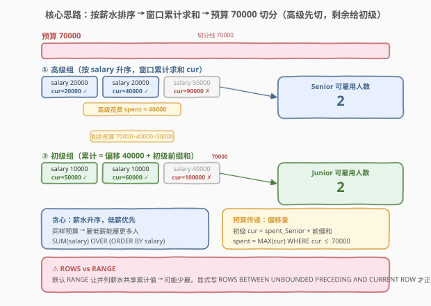
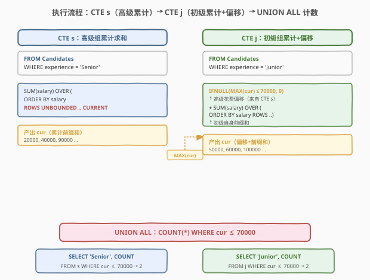
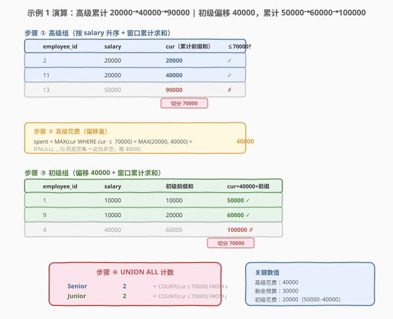

# 职员招聘人数

- **题目名称**：职员招聘人数
- **链接**：[2004. 职员招聘人数 🔒](https://leetcode.cn/problems/the-number-of-seniors-and-juniors-to-join-the-company/)
- **难度**：困难
- **标签**：SQL、窗口函数、累计求和（Running Sum）、ORDER BY、IFNULL、CTE、UNION ALL、贪心

## 1. 题目概述

给定 `Candidates` 表，记录每位候选人的 `employee_id`、经验层级（`Senior` / `Junior`）和期望月薪 `salary`。公司工资预算为 **70000 美元**，招聘标准按优先级如下：

1. **先雇最多的高级员工**——在预算内尽可能多雇 `Senior`；
2. **再雇最多的初级员工**——用雇完高级员工后的剩余预算，尽可能多雇 `Junior`。

编写 SQL 查询，返回最终雇佣的高级员工数和初级员工数。结果格式为 `(experience, accepted_candidates)`，**任意顺序**返回。

> ⚠️ 本题是 LeetCode **Plus 会员专享题（🔒）**，免费版变体为 [2010. 职员招聘人数 II](https://leetcode.cn/problems/the-number-of-seniors-and-juniors-to-join-the-company-ii/)。

**表结构**：

```text
Table: Candidates
+-------------+------+
| Column Name | Type |
+-------------+------+
| employee_id | int  |  ← 主键
| experience  | enum |  ← 取值 'Senior' / 'Junior'
| salary      | int  |
+-------------+------+
employee_id 是此表的主键列。
experience 是包含一个值（"Senior"、"Junior"）的枚举类型。
每行显示候选人的 id、月薪和经验。
```

**示例 1**：

```text
输入：
Candidates 表:
+-------------+------------+--------+
| employee_id | experience | salary |
+-------------+------------+--------+
| 1           | Junior     | 10000  |
| 9           | Junior     | 10000  |
| 2           | Senior     | 20000  |
| 11          | Senior     | 20000  |
| 13          | Senior     | 50000  |
| 4           | Junior     | 40000  |
+-------------+------------+--------+

输出：
+------------+---------------------+
| experience | accepted_candidates |
+------------+---------------------+
| Senior     | 2                   |
| Junior     | 2                   |
+------------+---------------------+
```

**解释**：

| 步骤 | 操作 | 预算变化 |
|------|------|----------|
| ① 雇高级 | 雇佣 ID 2、11（各 20000），累计花费 40000 ≤ 70000 | 剩余 30000 |
| ② 再雇高级？ | ID 13 薪水 50000，40000 + 50000 = 90000 > 70000，雇不起 | 剩余 30000 |
| ③ 雇初级 | 雇佣 ID 1、9（各 10000），累计花费 30000 + 20000 = 50000 ≤ 70000 | 剩余 10000 |
| ④ 再雇初级？ | ID 4 薪水 40000，50000 + 40000 = 90000 > 70000，雇不起 | 剩余 10000 |

最终雇佣高级 2 人、初级 2 人。

**示例 2**：

```text
输入：
Candidates 表:
+-------------+------------+--------+
| employee_id | experience | salary |
+-------------+------------+--------+
| 1           | Junior     | 10000  |
| 9           | Junior     | 10000  |
| 2           | Senior     | 80000  |
| 11          | Senior     | 80000  |
| 13          | Senior     | 80000  |
| 4           | Junior     | 40000  |
+-------------+------------+--------+

输出：
+------------+---------------------+
| experience | accepted_candidates |
+------------+---------------------+
| Senior     | 0                   |
| Junior     | 3                   |
+------------+---------------------+
```

**解释**：所有高级员工月薪都是 80000 > 70000，一个都雇不起（高级 0 人）。全部 70000 预算留给初级：10000 + 10000 + 40000 = 60000 ≤ 70000，雇佣全部 3 名初级员工。

**约束条件**：

- `employee_id` 是主键，每名候选人唯一
- `experience` 取值为 `'Senior'` 或 `'Junior'`
- `salary` 为正整数
- 预算固定为 70000

> 💡 **审题关键**：①「最多」指的是**人数最多**而非花费最多——要最大化计数，应优先雇**薪水最低**的候选人；② 雇佣有**优先级**——高级先雇、初级后雇，二者不是独立并行；③ 预算在高级和初级之间**传递**——高级花剩的预算给初级用；④ 即使某层级雇佣 0 人，结果也必须输出该层级行（`accepted_candidates = 0`）。

---

## 2. 解题思路

### 2.1 暴力思路：逐人贪心模拟

最直觉的过程式思路是：把候选人分成高级、初级两组，各自按薪水升序排序；先从高级组逐个雇（累计花费 ≤ 70000 即雇），再从初级组接着雇（累计花费 ≤ 70000 即雇）。

```text
budget = 70000
sort seniors by salary ASC
spent = 0
senior_count = 0
for s in seniors:
    if spent + s.salary <= budget:
        spent += s.salary
        senior_count += 1
    else:
        break

sort juniors by salary ASC
junior_count = 0
for j in juniors:
    if spent + j.salary <= budget:
        spent += j.salary
        junior_count += 1
    else:
        break

return [(Senior, senior_count), (Junior, junior_count)]
```

这个模拟完全正确，但 SQL 是集合式语言，没有显式循环。「逐个累加并判断 ≤ 预算」的模式在 SQL 中对应**窗口函数的累计求和（Running Sum）**——`SUM(salary) OVER (ORDER BY salary ROWS BETWEEN UNBOUNDED PRECEDING AND CURRENT ROW)` 一步算出每人的「前缀累计花费」，再 `WHERE cur <= 70000` 筛选可雇用者即可。

> ⚠️ **关键转换**：把「逐人循环累加」翻译成「一次性算出所有人的累计前缀和」。窗口函数 `SUM() OVER (ORDER BY ...)` 正是为此而生——它对排序后的每一行，计算从第一行到当前行的累计和，等价于循环中的 `spent += salary`。

### 2.2 核心观察：贪心 + 窗口函数累计求和



**问题本质**：这是一道**贪心 + 累计前缀和**题。核心观察有三点：

**观察 ①：贪心策略——薪水升序，低薪优先**

$$\text{最大化雇用人数} \iff \text{优先选择薪水最低的候选人}$$

要让雇用人数最多，就应该贪心地从薪水最低的开始雇。直觉上：同样花 30000，雇 3 个 10000 的比雇 1 个 30000 的人多。因此对高级和初级**分别按 `salary` 升序排序**，从前到后依次雇用。

**观察 ②：窗口累计求和——前缀和判断可雇用性**

$$\text{cur}(i) = \sum_{k=1}^{i} \text{salary}[k]$$

对排序后的第 $i$ 位候选人，其累计前缀和 $\text{cur}(i)$ 表示「雇用前 $i$ 人的总花费」。若 $\text{cur}(i) \le 70000$，则前 $i$ 人全部可雇；若 $\text{cur}(i) > 70000$，则第 $i$ 人及之后都雇不起（因为薪水升序，后面只会更贵）。

用 SQL 窗口函数一步算出：

```sql
SUM(salary) OVER (ORDER BY salary ROWS BETWEEN UNBOUNDED PRECEDING AND CURRENT ROW) AS cur
```

**观察 ③：预算传递——高级花费作为初级的「起点偏移」**

$$\text{cur}_{\text{Junior}}(i) = \text{spent}_{\text{Senior}} + \sum_{k=1}^{i} \text{salary}_{\text{Junior}}[k]$$

高级和初级不是独立的——初级使用的预算是 70000 **减去**高级已花费的部分。因此初级的累计前缀和需要加上一个**起点偏移量** $\text{spent}_{\text{Senior}}$（高级实际花费总额）。

$\text{spent}_{\text{Senior}}$ 怎么算？它就是高级组中所有 $\text{cur} \le 70000$ 的最大累计值：

$$\text{spent}_{\text{Senior}} = \max\{\text{cur}_{\text{Senior}}(i) \mid \text{cur}_{\text{Senior}}(i) \le 70000\}$$

> 💡 **为什么取 `MAX` 而非 `SUM`？** 因为高级组的累计前缀和 `cur` 已经是从小到大递增的。所有 $\text{cur} \le 70000$ 的行中，最大的那个就是高级组的总花费——它是最后一个可雇用者的累计值。若用 `SUM` 会把所有可雇用者的累计值加起来，导致重复计算。若无高级可雇（所有 `cur > 70000` 或无高级），则 `MAX` 返回 `NULL`，用 `IFNULL(NULL, 0)` 补 0。

> ⚠️ **`ROWS` vs `RANGE`（重要细节）**：`SUM() OVER (ORDER BY salary)` 默认使用 `RANGE` 框架——当多个候选人薪水相同时，它们会获得**相同**的累计值（包含所有并列行的总和）。这会导致「本可雇一人、却判定全员超预算」的错误。必须显式指定 `ROWS BETWEEN UNBOUNDED PRECEDING AND CURRENT ROW`，让每一行获得**独立递增**的累计值，才能正确处理并列薪水。详见第 5 节扩展。

### 2.3 算法流程图



**逻辑执行步骤**：

| 步骤 | 子句 | 作用 |
|------|------|------|
| ① | `CTE s`：`WHERE experience='Senior'` + `SUM(salary) OVER (ORDER BY salary ROWS ...)` | 高级组按薪水升序，算出每人的累计前缀和 `cur` |
| ② | `CTE j`：`IFNULL((SELECT MAX(cur) FROM s WHERE cur <= 70000), 0)` | 查高级实际花费作为初级累计的起点偏移 |
| ③ | `CTE j`：`+ SUM(salary) OVER (ORDER BY salary ROWS ...)` | 初级组累计前缀和 = 高级花费 + 初级前缀和 |
| ④ | `SELECT 'Senior', COUNT(*) FROM s WHERE cur <= 70000` | 统计可雇用的高级人数 |
| ⑤ | `UNION ALL SELECT 'Junior', COUNT(*) FROM j WHERE cur <= 70000` | 统计可雇用的初级人数 |

> 💡 **为什么用 `UNION ALL` 而非 `UNION`？** 两个子查询分别返回 `'Senior'` 和 `'Junior'` 一行，行值天然不同，无需去重。`UNION ALL` 保留所有行且不去重，比 `UNION` 少一次排序去重操作，效率更高。

> ⚠️ **`COUNT` 返回 0 而非空行**：当某层级无人可雇（如示例 2 的高级），`SELECT 'Senior', COUNT(*) FROM s WHERE cur <= 70000` 仍返回一行 `(Senior, 0)`——因为 `COUNT` 是聚合函数，对空结果集返回 0。这恰好满足题目「即使 0 人也要输出该行」的要求，无需额外 `IFNULL` 或 `LEFT JOIN` 兜底。

### 2.4 示例演算

以示例 1 数据为例，逐步观察贪心 + 窗口累计求和的完整过程：



**第一步：高级组按薪水升序 + 窗口累计求和（CTE s）**

| 排序后顺序 | employee_id | salary | cur（累计前缀和） | cur ≤ 70000？ |
|-----------|-------------|--------|-------------------|---------------|
| 1 | 2 | 20000 | 20000 | ✓ |
| 2 | 11 | 20000 | 40000 | ✓ |
| 3 | 13 | 50000 | 90000 | ✗ |

> 💡 两位 20000 薪水的高级员工并列，`ROWS` 框架保证它们获得**递增**的累计值 20000、40000（而非 `RANGE` 下的都取 40000）。这里 40000 ≤ 70000，两种框架都判定可雇，结果恰好相同；但当预算紧张时差异会显现（见第 5 节）。

**第二步：计算高级实际花费（偏移量）**

$$\text{spent}_{\text{Senior}} = \max\{20000, 40000\} = 40000 \quad (\text{90000 > 70000 排除})$$

```sql
IFNULL((SELECT MAX(cur) FROM s WHERE cur <= 70000), 0)  →  40000
```

**第三步：初级组按薪水升序 + 窗口累计求和 + 偏移（CTE j）**

| 排序后顺序 | employee_id | salary | 初级前缀和 | cur = 40000 + 前缀和 | cur ≤ 70000？ |
|-----------|-------------|--------|-----------|----------------------|---------------|
| 1 | 1 | 10000 | 10000 | 50000 | ✓ |
| 2 | 9 | 10000 | 20000 | 60000 | ✓ |
| 3 | 4 | 40000 | 60000 | 100000 | ✗ |

**第四步：UNION ALL 计数**

| 来源 | experience | COUNT（cur ≤ 70000） |
|------|-----------|---------------------|
| CTE s | Senior | 2（ID 2、11） |
| CTE j | Junior | 2（ID 1、9） |

**最终输出**：

| experience | accepted_candidates |
|------------|---------------------|
| Senior | 2 |
| Junior | 2 |

---

## 3. 参考代码

### SQL（解法 A：CTE + 窗口函数累计求和，推荐）

```sql
WITH
    s AS (
        SELECT
            employee_id,
            SUM(salary) OVER (
                ORDER BY salary
                ROWS BETWEEN UNBOUNDED PRECEDING AND CURRENT ROW
            ) AS cur
        FROM Candidates
        WHERE experience = 'Senior'
    ),
    j AS (
        SELECT
            employee_id,
            IFNULL(
                (SELECT MAX(cur) FROM s WHERE cur <= 70000),
                0
            ) + SUM(salary) OVER (
                ORDER BY salary
                ROWS BETWEEN UNBOUNDED PRECEDING AND CURRENT ROW
            ) AS cur
        FROM Candidates
        WHERE experience = 'Junior'
    )
SELECT
    'Senior' AS experience,
    COUNT(employee_id) AS accepted_candidates
FROM s
WHERE cur <= 70000
UNION ALL
SELECT
    'Junior' AS experience,
    COUNT(employee_id) AS accepted_candidates
FROM j
WHERE cur <= 70000;
```

> 💡 **写法要点**：
> - **CTE `s`**：筛出高级候选人，`SUM(salary) OVER (ORDER BY salary ROWS ...)` 算累计前缀和 `cur`。`ROWS BETWEEN UNBOUNDED PRECEDING AND CURRENT ROW` 显式指定逐行累加，正确处理并列薪水。
> - **CTE `j`**：筛出初级候选人，累计前缀和 = `IFNULL((SELECT MAX(cur) FROM s WHERE cur <= 70000), 0)`（高级花费偏移）+ 初级自身前缀和。`IFNULL` 兜底：若无高级可雇或无高级候选人，偏移为 0。
> - **`UNION ALL`**：两段 `COUNT` 各返回一行，拼成 `(Senior, n)` + `(Junior, m)`。`COUNT` 对空结果集返回 0，天然保证 0 人也输出行。
> - ⚠️ `IFNULL` 的子查询必须用**括号包裹**：`IFNULL((SELECT ...), 0)`，否则语法错误。

### SQL（解法 B：子查询 + 窗口函数，无 CTE）

```sql
SELECT
    'Senior' AS experience,
    COUNT(employee_id) AS accepted_candidates
FROM (
    SELECT
        employee_id,
        SUM(salary) OVER (
            ORDER BY salary
            ROWS BETWEEN UNBOUNDED PRECEDING AND CURRENT ROW
        ) AS cur
    FROM Candidates
    WHERE experience = 'Senior'
) s
WHERE cur <= 70000
UNION ALL
SELECT
    'Junior' AS experience,
    COUNT(employee_id) AS accepted_candidates
FROM (
    SELECT
        employee_id,
        IFNULL(
            (SELECT MAX(cur) FROM (
                SELECT SUM(salary) OVER (
                    ORDER BY salary
                    ROWS BETWEEN UNBOUNDED PRECEDING AND CURRENT ROW
                ) AS cur
                FROM Candidates
                WHERE experience = 'Senior'
            ) s WHERE cur <= 70000),
            0
        ) + SUM(salary) OVER (
            ORDER BY salary
            ROWS BETWEEN UNBOUNDED PRECEDING AND CURRENT ROW
        ) AS cur
    FROM Candidates
    WHERE experience = 'Junior'
) j
WHERE cur <= 70000;
```

> 💡 **与解法 A 的区别**：把 CTE `s` 内联到初级子查询中（求 `MAX(cur)` 时重复写一遍高级累计求和），不使用 `WITH`。逻辑完全相同，但高级累计求和的 SQL 重复出现两次——可读性较差。MySQL 5.7 及以下不支持 CTE（`WITH`）时可用此写法；MySQL 8.0+ 优先用解法 A。

### Python（pandas）

```python
import pandas as pd

def count_seniors_and_juniors(candidates: pd.DataFrame) -> pd.DataFrame:
    budget = 70000

    seniors = candidates[candidates['experience'] == 'Senior'].sort_values('salary')
    seniors['cum'] = seniors['salary'].cumsum()
    senior_hired = int((seniors['cum'] <= budget).sum())

    spent = int(seniors['cum'].iloc[senior_hired - 1]) if senior_hired > 0 else 0

    juniors = candidates[candidates['experience'] == 'Junior'].sort_values('salary')
    juniors['cum'] = spent + juniors['salary'].cumsum()
    junior_hired = int((juniors['cum'] <= budget).sum())

    return pd.DataFrame({
        'experience': ['Senior', 'Junior'],
        'accepted_candidates': [senior_hired, junior_hired],
    })
```

> 💡 **pandas 对照**：`sort_values('salary')` 对应 `ORDER BY salary`；`cumsum()` 对应 `SUM() OVER (ORDER BY ... ROWS ...)` 累计前缀和；`(cum <= budget).sum()` 对应 `COUNT(*) WHERE cur <= 70000`；`spent = seniors['cum'].iloc[...]` 对应 `SELECT MAX(cur) FROM s WHERE cur <= 70000`——取最后一个可雇用者的累计值作为高级总花费。`if senior_hired > 0` 对应 `IFNULL(..., 0)` 兜底空集。

---

## 4. 复杂度分析

| 维度 | 解法 A（CTE + 窗口函数） | 解法 B（子查询） | pandas |
|------|-------------------------|------------------|--------|
| **时间** | $O(n \log n)$ | $O(n \log n)$ | $O(n \log n)$ |
| **空间** | $O(n)$ | $O(n)$ | $O(n)$ |
| **扫描次数** | 2 次过滤 + 1 次子查询 | 3 次过滤（高级算两遍） | 2 次过滤 |
| **可读性** | ✓ **最佳**（CTE 分层清晰） | 差（子查询嵌套深） | ✓ 清晰 |

> - $n$ = `Candidates` 表行数
> - **时间**：对高级、初级各做一次 `ORDER BY salary` 排序 $O(n \log n)$，窗口函数累计求和 $O(n)$（排序后线性扫描），子查询求 `MAX` $O(n)$。总体由排序主导 $O(n \log n)$。
> - **空间**：CTE / 子查询需物化排序后的中间表 $O(n)$。
> - 解法 B 的高级累计求和写了两次（外层计数 + 内层求 `MAX`），若数据库不做 CTE 物化缓存，可能多一次排序；解法 A 用 CTE 复用 `s`，更高效。

---

## 5. 扩展：ROWS vs RANGE——并列薪水的细节陷阱

### 5.1 两种窗口框架的区别

`SUM(salary) OVER (ORDER BY salary)` 的窗口框架决定了并列行的累计值如何计算：

| 框架 | 行为 | 并列行累计值 |
|------|------|-------------|
| `ROWS BETWEEN UNBOUNDED PRECEDING AND CURRENT ROW` | 逐**物理行**累加 | **递增**（每人不同） |
| `RANGE BETWEEN UNBOUNDED PRECEDING AND CURRENT ROW`（默认） | 按**值域**累加，并列行共享 | **相同**（含所有并列行的总和） |

### 5.2 反例：RANGE 导致少雇

假设预算 70000，高级组薪水为 `[40000, 40000, 30000]`，排序后为 `[30000, 40000, 40000]`：

| 排序后 | salary | `ROWS` 累计 | `ROWS` ≤ 70000？ | `RANGE` 累计 | `RANGE` ≤ 70000？ |
|--------|--------|------------|------------------|-------------|-------------------|
| 1 | 30000 | 30000 | ✓ | 30000 | ✓ |
| 2 | 40000 | 70000 | ✓ | **110000** | ✗ |
| 3 | 40000 | **110000** | ✗ | 110000 | ✗ |

- **`ROWS`**：第 2 人累计 70000 ≤ 70000 ✓ → 雇 2 人（正确）
- **`RANGE`**：第 2 人累计 110000 > 70000 ✗ → 只雇 1 人（**错误**！本可雇 2 人）

> ⚠️ `RANGE` 把两个 40000 合并算成 30000 + 40000 + 40000 = 110000，导致第 2 人被判超预算。实际上第 2 人累计只需 30000 + 40000 = 70000，恰好可雇。**`ROWS` 逐行累加才是「逐人贪心」的正确语义**。

### 5.3 为什么很多题解用 RANGE 也能过？

LeetCode 测试用例中，并列薪水的累计值恰好都 ≤ 70000（如示例 1 的两个 20000，累计 40000 ≤ 70000）或都 > 70000，两种框架结果恰好相同。但**生产环境中薪水并列是常态**，`RANGE` 会系统性少雇。面试中应主动提及这一区别，体现对窗口函数的深入理解。

> 💡 **记忆口诀**：「逐行累加用 `ROWS`，值域分组是 `RANGE`」。凡是用窗口函数做「逐人/逐行贪心累加」时，一律显式写 `ROWS BETWEEN UNBOUNDED PRECEDING AND CURRENT ROW`，避免默认 `RANGE` 的并列陷阱。

---

## 6. 面试要点

1. **为什么要按 `salary` 升序排序？**

   > 题目要求最大化雇用**人数**（而非花费）。同样预算下，雇低薪候选人能雇更多人——贪心选择薪水最低者优先。这与 [455. 分发饼干](https://leetcode.cn/problems/assign-cookies/) 的贪心思路同源：小饼干先喂小胃口的孩子。

2. **初级组的累计前缀和为什么要加偏移量？**

   > 预算在高级和初级之间**传递**——高级花剩的才给初级。初级的累计花费 = 高级已花费总额 + 初级自身前缀和。若不加偏移，初级组会从 0 开始累计，可能「雇了过多初级」超出总预算。偏移量 = `MAX(cur) FROM s WHERE cur <= 70000`，即高级组最后一个可雇用者的累计值。

3. **`IFNULL((SELECT MAX(cur) ...), 0)` 的 `0` 兜底什么情况？**

   > 两种情况返回 `NULL`：① 所有高级候选人的 `cur` 都 > 70000（一个高级都雇不起，如示例 2）；② `Candidates` 表中根本没有高级候选人（CTE `s` 为空集，`MAX` 返回 `NULL`）。两种情况下高级花费为 0，全部 70000 预算留给初级。`IFNULL(NULL, 0)` 把 `NULL` 补 0 作为偏移。

4. **为什么必须用 `ROWS` 而非默认的 `RANGE`？**

   > `RANGE` 框架下，薪水并列的行会获得**相同**的累计值（含所有并列行的总和），导致「本可雇其中一人、却判定全员超预算」的错误。`ROWS` 框架逐物理行累加，每人获得递增的累计值，正确反映「逐人贪心」的语义。详见第 5 节反例。

5. **`COUNT` 对空结果集返回什么？为什么不用 `IFNULL(COUNT(...), 0)`？**

   > `COUNT` 是聚合函数，对空结果集（`WHERE` 过滤后无行）返回 **0** 而非 `NULL`。因此 `SELECT 'Senior', COUNT(*) FROM s WHERE cur <= 70000` 在无人可雇时仍返回一行 `(Senior, 0)`，恰好满足题目「0 人也输出」的要求。无需额外 `IFNULL` 或 `LEFT JOIN` 兜底——这与 `SUM`（空集返回 `NULL`）的行为不同，是 `COUNT` 的天然特性。

> 💡 **一句话总结**：2004 的核心是「**贪心 + 窗口累计求和**」——按薪水升序排序，用 `SUM() OVER (ORDER BY salary ROWS ...)` 算前缀和判断可雇用性；高级花费作为初级累计的偏移量实现预算传递；`COUNT` 对空集返回 0 的特性天然保证 0 人也输出行。记住 `ROWS` 框架避免并列薪水陷阱。

---

## 7. 同类练习题

- [2010. 职员招聘人数 II 🔒](https://leetcode.cn/problems/the-number-of-seniors-and-juniors-to-join-the-company-ii/)：本题的进阶版——额外输出**剩余预算**，需要把高级花费和初级花费分别计算并从 70000 中扣除，窗口累计求和的骨架完全相同
- [534. 游戏玩法分析 III](https://leetcode.cn/problems/game-play-analysis-iii/)：`SUM OVER (ORDER BY date)` 累计求和的经典题——按玩家分组算累计游戏数，与 2004 的窗口累计求和同源，但无需偏移传递
- [1321. 餐馆营业额变化](https://leetcode.cn/problems/restaurant-growth/)：`AVG OVER (ORDER BY date ROWS 6 PRECEDING)` 7 天滑动窗口均值——窗口函数 `ROWS N PRECEDING` 框架的运用，与 2004 的 `ROWS UNBOUNDED PRECEDING` 同一框架家族
- [184. 部门工资最高的员工](https://leetcode.cn/problems/department-highest-salary/)（[题解](../0101-0200/184_部门工资最高的员工.md)）：`GROUP BY` + 子查询定位最高薪——对比 2004 的窗口函数方案，理解「分组取最值」的窗口函数 vs 子查询两种范式
- [1194. 锦标赛优胜者](https://leetcode.cn/problems/tournament-winners/)（[题解](../1101-1200/1194_锦标赛优胜者.md)）：`UNION ALL + ROW_NUMBER OVER (PARTITION BY ...)` 分组排名——同为 SQL Hard 题，窗口函数排名 vs 2004 的窗口函数累计求和，互补巩固窗口函数范式
