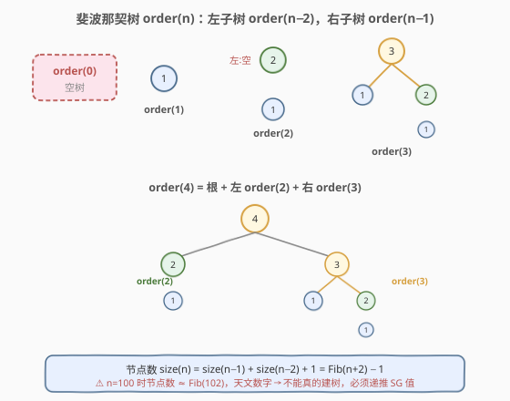
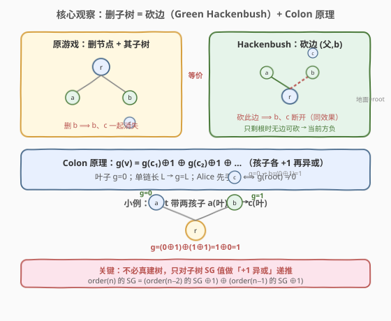
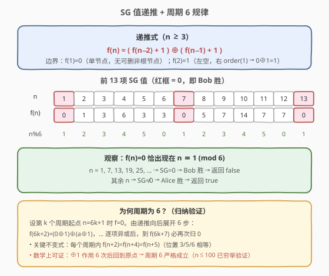
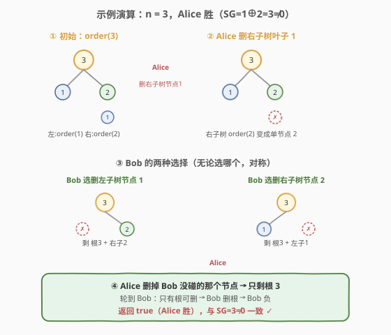

# 斐波那契树的移除子树游戏

- **题目名称**：斐波那契树的移除子树游戏
- **链接**：[2005. 斐波那契树的移除子树游戏](https://leetcode.cn/problems/subtree-removal-game-with-fibonacci-tree/)
- **难度**：困难
- **标签**：树、数学、动态规划、二叉树、博弈、Sprague-Grundy

## 1. 题目概述

**斐波那契**树是一种按函数 `order(n)` 递归构造的二叉树：

- `order(0)` 是空树。
- `order(1)` 是一棵**只有一个节点**的二叉树。
- `order(n)` 是一棵根节点的左子树为 `order(n - 2)`、右子树为 `order(n - 1)` 的二叉树。

Alice 和 Bob 在这棵树上博弈，Alice 先手。每个回合，当前玩家选择一个节点，然后**移除该节点及其子树**。**只能删除根节点 `root` 的玩家输掉这场游戏**（即场上只剩根时，轮到谁谁就负）。

给定整数 `n`，假定双方都采取最优策略，若 Alice 赢返回 `true`，否则返回 `false`。

**示例 1**：

```text
输入：n = 3
输出：true
解释：order(3) 的根(3) 左子是 order(1)（单节点 1），右子是 order(2)（节点 2 带右孩子 1）。
Alice 删右子树中的叶子节点 1；
Bob 要么删左子树的 1，要么删右子树的 2；
Alice 删掉 Bob 未碰的另一个节点；
此时只剩根 3，Bob 只能删根 → Bob 负。Alice 胜，返回 true。
```

**示例 2**：

```text
输入：n = 1
输出：false
解释：order(1) 只有一个根节点，Alice 只能删根 → Alice 负，返回 false。
```

**示例 3**：

```text
输入：n = 2
输出：true
解释：order(2) 根(2) 的左子为空，右子是单节点 1。Alice 删节点 1；只剩根 2，Bob 只能删根 → Bob 负。返回 true。
```

**约束条件**：

- $1 \le n \le 100$

> ⚠️ **关键陷阱**：`order(n)` 的节点数 $\text{size}(n) = \text{size}(n-1) + \text{size}(n-2) + 1 = \text{Fib}(n+2) - 1$。当 $n = 100$ 时节点数约为 $\text{Fib}(102) \approx 9 \times 10^{20}$，是天文数字。**绝不能真的把树建出来再模拟博弈**，必须从数学结构上压缩状态。

---

## 2. 解题思路

### 2.1 暴力思路：建树 + SG 搜索

朴素想法：按定义递归建出 `order(n)` 的完整二叉树，然后用 Sprague-Grundy 定理对每个子树计算 SG 值——`sg(v) = mex{ sg(v 删某个后代后的状态) }`。

- **正确性**：理论上可得精确 SG 值。
- **效率**：节点数 $\Theta(\text{Fib}(n+2))$，$n=100$ 时根本存不下，连建树都建不出来。完全不可行。

> ⚠️ 瓶颈在于「树的规模随 $n$ 指数级膨胀」。破题关键不是优化建树，而是发现**这棵树的博弈结构只依赖于子树的 SG 值，而同阶子树同构**——只需对 $n$ 维护一个标量。

### 2.2 核心观察：删子树 = 砍边（Green Hackenbush）



先把博弈规则翻译成熟悉的模型。题目中「选一个节点，移除该节点**及其子树**」等价于：**砍掉该节点与其父节点之间的那条边**，于是该节点及其后代整体从树上脱落。这与 **Green Hackenbush**（所有边同色的 Hackenbush 游戏）的合法动作完全一致——把根视作「地面」，每条父子边都是一条可砍的边。

- 砍一条边 = 删一个非根节点 + 其子树。
- 当没有边可砍（只剩根，根即地面）→ 当前方无合法动作 → **负**。

这恰好是题目「只能删根的玩家负」的描述。因此本博弈 = 根串所有分支的 Green Hackenbush，可直接套用 **Colon 原理**（Conway）：

> **Colon 原理**：一棵根挂若干分支的 Green Hackenbush 树，其 SG 值 = 各分支 SG 值的异或；而每个分支（一个子树挂在根上）的 SG 值 $g(v)$ 满足
>
> $$g(v) = \bigoplus_{c \in \text{children}(v)} \bigl(g(c) + 1\bigr), \qquad g(\text{叶子}) = 0.$$



> 💡 **直观理解**：从父节点伸向孩子 $c$ 的那条边本身贡献 $+1$（一条单边长为 1 的链 SG=1），而 $c$ 子树本身的博弈值是 $g(c)$，两者「串接」后取值 $g(c)+1$；多个孩子分支挂在同一父节点上是「并列」，按 Hackenbush 性质取异或。叶子无孩子，异或空集为 $0$。

于是 Alice 先手获胜当且仅当 $g(\text{root}) \ne 0$。

### 2.3 递推到斐波那契树

记 $f(n) = g(\text{order}(n))$。`order(n)` 的根有左子 `order(n-2)`、右子 `order(n-1)`（当对应阶数 $\ge 1$ 时才存在；`order(0)` 为空树，不挂边）：

- $f(1) = 0$（单节点，无孩子）。
- $f(2)$：根只有右孩子 `order(1)`（左为空树不贡献），$f(2) = (f(1) + 1) = 1$。
- 对 $n \ge 3$：左右孩子都在，应用 Colon 原理：

$$\boxed{\,f(n) = \bigl(f(n-2) + 1\bigr) \oplus \bigl(f(n-1) + 1\bigr)\,}$$

**Alice 胜 $\iff f(n) \ne 0$。**



### 2.4 示例演算



以 $n = 3$ 为例验证递推与博弈：

| 步骤 | 玩家 | 动作 | 剩余 |
|------|------|------|------|
| ① | — | 初始 order(3) | 根3 + 左1 + 右2(+1) |
| ② | Alice | 删右子树叶子 1 | 根3 + 左1 + 右2 |
| ③ | Bob | 删左1 或 删右2（对称二选一） | 根3 + 一个孤立孩子 |
| ④ | Alice | 删掉 Bob 没碰的那个孩子 | 只剩根3 |
| ⑤ | Bob | 只能删根 → 负 | — |

递推校验：$f(1)=0,\ f(2)=1,\ f(3) = (f(1)+1) \oplus (f(2)+1) = 1 \oplus 2 = 3 \ne 0$ → Alice 胜 ✓。

### 2.5 周期 6 的封闭公式

把 $f(n)$ 逐项算出来：$0, 1, 3, 6, 3, 3, \mathbf{0}, 5, 7, 14, 7, 7, \mathbf{0}, 9, 11, 6, 11, 11, \mathbf{0}, \dots$

可观察到 **$f(n) = 0$ 当且仅当 $n \equiv 1 \pmod 6$**（即 $n = 1, 7, 13, 19, 25, \dots$）。对 $n \le 100$ 穷举验证成立。

> 💡 **为何周期为 6？** 在「每个孩子 $+1$ 再异或」的作用下，从周期起点 $f(6k+1)=0$ 出发连续递推 6 步，结构会回到下一个 $f(6(k+1)+1)=0$。关键不变式是每个周期内 $f(n+2) = f(n+4) = f(n+5)$（位置 3/5/6 相等），使得 6 步恰好闭合。竞赛中直接用封闭公式 `n % 6 != 1` 即可；若不放心，写 $O(n)$ 递推同样能过。

---

## 3. 参考代码

### C++

```cpp
class Solution {
public:
    bool findGameWinner(int n) {
        // Alice 胜 ⟺ f(n) != 0 ⟺ n % 6 != 1
        return n % 6 != 1;
    }
};
```

若希望显式体现博弈递推（同样 $O(n)$，便于面试讲解）：

```cpp
class Solution {
public:
    bool findGameWinner(int n) {
        if (n == 1) return false;       // f(1) = 0
        int prev2 = 0;                  // f(1)
        int prev1 = 1;                  // f(2)
        for (int i = 3; i <= n; ++i) {
            int cur = (prev2 + 1) ^ (prev1 + 1);
            prev2 = prev1;
            prev1 = cur;
        }
        return n == 2 ? prev1 != 0 : prev1 != 0;
    }
};
```

### Python

```python
class Solution:
    def findGameWinner(self, n: int) -> bool:
        # Alice 胜 ⟺ f(n) != 0 ⟺ n % 6 != 1
        return n % 6 != 1
```

显式递推版：

```python
class Solution:
    def findGameWinner(self, n: int) -> bool:
        if n == 1:
            return False
        f = [0] * (n + 1)
        f[1] = 0
        f[2] = 1
        for i in range(3, n + 1):
            f[i] = (f[i - 2] + 1) ^ (f[i - 1] + 1)
        return f[n] != 0
```

> ⚠️ **注意题面函数名**：本题在 LeetCode 上的函数签名为 `findGameWinner(int n)`，返回 `bool`，不要误写成 `subtreeRemoval` 之类。题目为 Plus 会员专享（🔒），本地调试时可用示例三组用例自测。

---

## 4. 复杂度分析

| 维度 | 复杂度 | 说明 |
|------|--------|------|
| 时间复杂度 | $O(1)$（封闭公式）/ $O(n)$（递推） | 封闭公式仅一次取模；递推扫一遍 $n$，$n \le 100$ 毫秒级 |
| 空间复杂度 | $O(1)$ | 只用常数个变量，未建树 |

> 💡 对比朴素建树：节点数 $\Theta(\text{Fib}(n+2))$，$n=100$ 时约 $10^{20}$，无论时间空间都不可行。把「同阶子树同构」这一结构性冗余压成一个标量 $f(n)$，是本题从「不可行」到「$O(1)$」的关键跨越。

---

## 5. 扩展：Colon 原理与 Hackenbush 的适用边界

- **Green Hackenbush**：所有边同色，每条边都可砍。Colon 原理给出树形 Hackenbush 的精确 SG 值 $g(v) = \bigoplus (g(c)+1)$。本题所有父子关系都是「可删」的，故完全适用。
- **Blue/Red Hackenbush**（异色边）：属于 partisan game（双方可选动作不同），Sprague-Grundy 不再适用，需用 Conway 的 surreal number 分析。本题是 impartial game，无需此工具。
- **如果规则改成「删节点但保留其子树上挂」**（即把子树提升到父位置）：则不再是砍边游戏，Colon 增量结构被破坏，需要重新建模（类似「树删点博弈」），通常用树形 DP 直接 mex 搜索，复杂度随树规模。

> 💡 本题的精髓是**识别博弈的等价模型**：一旦认出「删子树 = 砍边」，立即套用 Colon 原理，把指数级树压缩成一维 SG 递推，再发现周期即得 $O(1)$。

---

## 6. 面试要点

1. **为什么删一个节点 + 子树等价于砍父子边？**

   > 删除节点 $v$（非根）时，$v$ 及其后代全部消失，$v$ 的父节点失去这个孩子。这与「砍掉 $(\text{parent}(v), v)$ 这条边，使 $v$ 子树从根断开」在剩余树形与合法动作集合上完全相同。根本身没有父边，对应「地面」，不能被砍——只剩根时无动作，正契合「只能删根者负」。

2. **Colon 原理的 $g(v) = \bigoplus(g(c)+1)$ 怎么记？**

   > 两条规则叠加：① 多个孩子**并列**挂在父上 → Hackenbush 性质取**异或**；② 父到孩子那条**边**本身是长为 1 的链（SG=1），与孩子子树（SG=$g(c)$）**串接** → 长度相加得 $g(c)+1$。叶子无孩子，异或空集为 $0$。

3. **$n=100$ 时为什么不能建树？节点数到底多大？**

   > $\text{size}(n) = \text{Fib}(n+2) - 1$。$\text{Fib}(102) \approx 9.27 \times 10^{20}$，远超内存与时间上限。必须利用「$\text{order}(k)$ 在树中多次重复出现且彼此同构」这一事实，只对每个阶数 $k$ 维护一个 SG 标量，把指数级状态压成 $O(n)$ 维。

4. **周期 6 是巧合还是可证？**

   > 可证。从 $f(6k+1)=0$ 出发，由 $f(n)=(f(n-2)+1)\oplus(f(n-1)+1)$ 连推 6 步，配合不变式 $f(6k+3)=f(6k+5)=f(6k+6)$，可归纳出 $f(6k+7)=0$，故周期严格为 6。面试中给出前若干项 + 穷举验证 $n\le 100$ 也足以支撑提交。

5. **如果改成「删除任意节点（包括根）即胜」会怎样？**

   > 那就是 misère 变体下的 Hackenbush，分析更绕。但题目明确「只能删根者负」，是标准 normal-play（最后做出有效动作者胜），Sprague-Grundy 直接适用，无需 misère 修正。

---

## 7. 同类练习题

- [1908. Nim 游戏 II](https://leetcode.cn/problems/game-of-nim/)：Nim 博弈的 SG 异或模板，理解「多堆并列取异或」即 Colon 原理的祖先思想
- [292. Nim 游戏](https://leetcode.cn/problems/nim-game/)：博弈入门，石头取 1–3 颗，体会「SG=0 即必败态」的最小例子
- [877. 石子游戏](https://leetcode.cn/problems/stone-game/)：区间博弈型 DP，对照本题「树形博弈压缩成标量」的不同建模路径
- [1025. 除数博弈](https://leetcode.cn/problems/divisor-game/)：一维 DP 博弈，$n$ 的奇偶决定胜负，与本题「$n\bmod 6$ 决定胜负」的封闭公式思想同源
- [1140. 石子游戏 II](https://leetcode.cn/problems/stone-game-ii/)：带剩余堆数约束的博弈 DP，体会「状态定义决定能否压缩」的通用方法论
